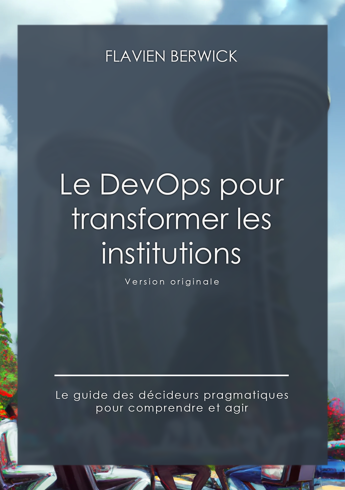

# Scaling Institutions with DevOps - The book

<div style="text-align:center">
  <table style="margin-left:auto; margin-right:auto;">
    <tr>
      <td>
        
      </td>
      <td>
        
      </td>
    </tr>
  </table>
</div>

This repo hosts a book written by an SRE/DevOps engineer, [me](https://berwick.fr). So I had to make it GitOps-compliant. I hope it will be community-driven over time to fill it with good resources or enhance some parts.

While you will be able to order the physical version soon, this is the digital and interactive copy.

## Languages

- French :fr: [Le DevOps pour transformer les institutions](fra/README.md)
- English :us: [Scaling Institutions with DevOps](eng/README.md) [^1]

## Summary

Many organizations have begun their digital transformation but are struggling to establish a clear or effective strategy. They then call on many experts in the hope of success. What they have been looking for for so many years and what they did not know the name of is described in this book : DevOps.

This book aims to introduce you to this movement rooted in the largest and most successful organizations in the world.

Accessible, this practical and illustrated guide will allow you to discover the range of possibilities offered by state-of-the-art DevOps technologies, what organizational prerequisites they ask and how to implement them at your scale.

## Purpose

This book is filled with recommendations about DevOps practices, including versioning everything you do : from documentation, presentations, to infrastructure recipes (IaC). So this repo is a perfect illustration of how it can be done !

I believe the practice of writing a book the gitops-style is not a bad move : it's portable, iterative, open and automatable. Of course, it's far fetched for the use case, but this is a funny way to illustrate the methodology.

_That said, this way of writing is very convenient for not being annoyed by compatibility issues when I switch from my Windows to my Linux PC._

It automatically :

<!-- - [Checks spells](https://github.com/check-spelling/check-spelling/blob/main/.github/workflows/spelling.yml) of english-written texts -->
- [Validates Markdown](https://github.com/marketplace/actions/markdown-linting-action) format
- Renders a PDF version on _develop_ and _main_
- Creates a release on _main_ (for physical book)
- [Updates](./.github/workflows/publish.yml) the Amazon physical version book through their API

## Publishing

This book has a double life. Let's make sure it reflects DevOps' state of the art practices at all times with your contributions.

- "Source edition" : the original book, unique, written exclusively by the author
- "Community edition(s)" : annual versions of the book including community contributions to improve it

## Supporting the author

- ⭐ Star and share this repo
- 📓 Buy the hardcover book (soon)
- ☕ Sponsor / Tip the author (soon)

## Book generation

This repository has [automatic](.github/workflows/render_pdf.yml) PDF generation thanks to Pandoc.

```bash
cd ./fra && make pdf && cd -
```

## License

Copyright © 2023 Flavien BERWICK

## Useful VSCode extensions when writing

- [Spellcheck](https://github.com/bartosz-antosik/vscode-spellright)
- [Markdownlint](https://github.com/DavidAnson/vscode-markdownlint)
- [Wordcount](https://github.com/Microsoft/vscode-wordcount)
- [Todo Tree](https://github.com/Gruntfuggly/todo-tree)
- [TODO Highlight](https://github.com/wayou/vscode-todo-highlight)
- [Markdown Footnote](https://github.com/houkanshan/vscode-markdown-footnote)

[^1]: To be translated (not planned at the moment)
