# Acknowledgments

Dear colleagues, dear friends,

There are those adventures that could not succeed without the rigor and dedication of a few. You have been those few. By agreeing to read and reread this manuscript, by sharing your constructive criticism, your informed suggestions and during our enriching discussions, you have largely contributed to its success.

Through your expert eyes, I was able to sharpen every line, polish every word. Your support has been a pillar, a silent and unwavering force. Many thanks for your time, expertise and camaraderie.

It is because this writing is also partly yours that I wanted to mark it with the names of the most tireless contributors. However, in order to preserve your anonymity, I have chosen to only include your initials. Thank you BA, FT, MR, FC, FP, NK, AB, AC, NP, NM, CH, EL, PB, AN and TF.

\newpage


\newpage

# Disclaimers

This book includes numerous references and web links to people, products, companies and organizations. The opinions expressed in this book are those of the author and do not in any way reflect the opinions of the entities mentioned.

The author has no affiliation with any companies mentioned in this book, whether by partnership, sponsorship, or any other arrangement. Any mention of a company or product is strictly informative and should not be construed as promotion in any way.

_Transparency seems essential to me in any research and writing work, and I wish my readers to be informed of my lack of affiliation with the organizations cited in my work._

\newpage

<!-- markdownlint-disable MD045 -->

<!-- markdownlint-enable MD045 -->

\newpage

# Introduction

The constant evolution of technology requires organizations to reinvent themselves. They are forced to respond ever more quickly - and often without increasing resources - to their operational requirements. Strategists are mobilizing to stay ahead of the curve in the face of ever-fiercer competition.

Many organizations have already started their digital transformation to master the complexity of interdependent and fragmented information systems. DevOps is one of the approaches to achieving this goal and working more efficiently.

Appearing in 2007, this cultural and organizational movement allows an organization's stakeholders to work more effectively to achieve its objectives more quickly.

Thanks to several theorized methods, DevOps constitutes a means of responding to this efficiency challenge. Each aims to improve the relevance and reliability of the services offered by the organization. To enable it to be more agile, DevOps takes full advantage of _Cloud_ technologies: mostly open, proven, standardized, and attractive.

According to the consulting and research company Gartner, more than 85% of organizations will adopt a _Cloud_ strategy by 2025[^GartnerCloud2025]. Atlassian's survey revealed that 99% of companies believe DevOps positively impacts their organization[^AtlassianDevopsStudy].

Several initiatives to create sovereign _Cloud_ platforms are taking shape around the world. This is for example the case of [_MeghRaj_](https://www.nic.in/servicecontents/national-cloud) in India (2014), _Bundescloud_ in Germany (2015), _JEDI_ in the United States (2017) , _Nimbus_ in Israel (2020), _GAIA-X_ in Europe (2020), the _Riigipilv_ in Estonia (2020), _Outscale_, _Athea_, and _S3NS_ in France (2010, 2017 and 2021), the [_Government Cloud_](https://www.nippon.com/en/in-depth/a07707) in Japan (2021), the _National Strategic Hub_ in Italy (2022). At the heart of these infrastructures, there is unanimous agreement on an organizational structure to unify practices and orchestrate these technologies: DevOps.

More widely used in the private sector, the major cloud providers (_Amazon Web Services_, _Google Cloud Platform_, _Microsoft Azure_, _Alibaba Cloud_) internally practice this organizational, promote it, and provide the technologies to adopt it.

South Korea has historically [favored the use of private cloud technologies](https://news.bloomberglaw.com/privacy-and-data-security/south-koreas-new-cloud-computing-act-and-new-rules-on-outsourcing-of-data-processing-by-financial-institutions), especially since its 2015 law that facilitated outsourcing[^SouthKorea2015CloudLaw]. Owing to multiple overlapping investments, outdated information systems, and a shortage of cybersecurity experts within the country, South Korea established national data centers in 2007. These centers now accommodate the information systems of 45 government agencies[^GIDCKorea]. In the wake of the COVID-19 crisis, in 2021, the country announced an ambitious digital transformation plan for its administration: the Digital Government Master Plan 2021-2025[^SouthKoreaMasterPlan2021]. This strategic plan introduces a technical framework named [_eGovFrame_](https://www.worldbank.org/en/events/2022/02/09/digital-the-door-to-a-better-world-digital-government-strategy-and-cases-in-korea) designed for the development and management of government information systems. One of its primary objectives is to enhance their interoperability, and it intrinsically incorporates DevOps principles.

In an effort to regain sovereignty, other governments display a clear desire to adopt these technologies and practices, without necessarily describing their initiatives in public. These desires take shape within documents mentioning the Cloud, AI, or data strategy of the countries.

For example, Canada released its "Goal 2020"[^CanadaGoal2020] report in 2013 to modernize the manner in which public services operate. It later released the "_Cloud Adoption Strategy_"[^CanadaCAS] in 2018.

In the UK, the Ministry of Defence announced in 2022 its intention to become an "AI-ready" organization, in its "Defence Artificial Intelligence Strategy"[^UKDefenceAIStrategy]. In the way it describes its transformation, it perfectly captures the essence of DevOps.

> « We must change into a software-intensive enterprise, organised and motivated to value and harness data, prepared to tolerate increased risk, learn by doing and rapidly reorient to pursue successes and efficiencies. We must be able to develop, test and deploy new algorithms faster than our adversaries. We must be agile and integrated, [...] » - UK Ministry of Defence, chapter "Culture, Skills and Policies", page 17.

As early as 2018, the UK Ministry of Defence launched the NELSON[^NELSON] program to equip themselves with a [big-data platform](https://joinup.ec.europa.eu/collection/open-source-observatory-osor/news/open-source-royal-navy) for the benefit of the _Royal Navy_. This technical environment, based on Cloud technologies, also incorporates DevOps practices.

Across the Atlantic, the United States had already recognized the need in 2011 to manage information in a unified and agile manner, accessible via a single access point (see chapter "[Zero trust](#zero-trust-based-development)"). The _Department of Defense_ (DoD) outlines this vision in its "DoD IT Enterprise Strategy and Roadmap"[^DoDITEnterpriseStrategyRoadmap].

> « Twenty-first century military operations require an agile information environment to achieve an information advantage for personnel and mission partners. [...] To meet this challenge, DoD is undertaking a concerted effort to unify its networks into a single information environment that will improve both operational effectiveness and information security posture. »
>
> - United States Department of Defense, chapter "Vision for a more Effective, Efficient and Secure DoD Information Enterprise", page 4.

He will publish in 2019 his first reference guide for the industrialization of DevSecOps practices[^DoDEnterpriseDevSecOpsReferenceDesign]: a methodology emphasizing security (see chapter "[DevSecOps](#devsecops)"). Aimed at providers, buyers, and managers of modern information systems, this institutional guide describes best practices for the implementation and maintenance of such systems. The stated goal is to deploy software at the "speed of operations". In the economic environment, the parallel is that of the "speed of stock markets".

In the private sector, Microsoft historically launched its new products every 3 to 4 years (e.g., Windows, Office). As early as 2014, its CEO Satya NADELLA warned his teams about the risk posed by the long duration of this development cycle. By continuing with the same organization mode, Microsoft would become obsolete. The teams responsible for developing each product worked independently from one another, with their own organizational methods and their own tools. NADELLA reorganized the company based on the DevOps methodology. He would unify the tools and practices of the teams, so they would interact with each other[^MicrosoftDevOpsAbelWang].

Faced with increasingly aggressive economic[^AUKUS] or military[^InfluenceRussia] competitors, transformation is an imperative necessity to stay in the race and prevail in the next confrontations. For institutions, it is no longer a question of "if" but "when" they will need to embark on a transformation journey, or risk being left behind.

However, the majority of organizations still struggle to pragmatically implement these new practices. The main obstacle is finding the talents capable of implementing the techniques and tools suitable for DevOps operation.

There are numerous studies to refer to on DevOps, which is primarily a topic of cultural transformation for technical and management teams. These studies draw upon the experiences of many players and allow us to avoid common mistakes in a transformation approach.

For instance, Google Cloud's DORA[^DORAWebsite] research program (_DevOps Research & Assessment_) has been conducted since 2014 with over 33,000 professionals in the Cloud sector. Each year, its report on the state of DevOps worldwide is published. Therefore, this field is far from new, and the initial risk is now much more moderate for newcomers. However, the industry continually finds ever-more effective ways to transform, to keep pace with the rapid advancements in the digital sector.

This book aims to demystify both the organizational and technical aspects of DevOps. These concepts are accessible to all and will provide you with an overview of the Cloud's challenges for a successful transformation. It offers guidance for a first-time DevOps experiment or to refine an ongoing transformation.

We will explore the reasons for the emergence of this methodology, its content, and how to inspire your organization to transform. Every organization has its own needs, its own maturity level, and there is no one-size-fits-all solution. Nevertheless, the industry's successive experiences have led to the creation of standards that will be presented throughout this book.

The experience of pioneering companies now ensures that efforts invested in DevOps will make your organization more efficient, agile, and sustainable.

# The five pillars of DevOps

According to the renowned American company [Atlassian](https://www.atlassian.com/devops/what-is-devops/history-of-devops)[^AtlassianHistoryOfDevops], the DevOps movement was born between 2007 and 2008. It was a time when software development professionals (those who develop) and system administrators (those who deploy) were each concerned about their poor ability to collaborate. They viewed this situation as a critical dysfunction, stemming from their lack of closeness.

Initially, DevOps focused on how to improve the efficiency of software development and deployment. More than a decade later, this methodology has evolved to address other areas such as security, Cloud infrastructures, and corporate culture. Around 2015, the DevOps methodology was primarily employed by major American tech companies (GAFAM[^GAFAM] and NATU[^NATU]) or businesses that were already using the [agile methodology](#staying-close-to-business-needs).

Now widespread, organizations of all sizes use the DevOps methodology worldwide and across various sectors[^GoogleCloudDevopsLeaders] (healthcare, finance, transportation, government, heavy industry...).

The term DevOps is attributed to Belgian engineer Patrick DEBOIS. As a consultant in 2007 for the Belgian government, he was tasked with migrating a data center. After spending significant time discussing with developers and system administrators, he observed what renowned engineers Andrew CLAY SHAFER and Lee THOMPSON would later theorize two years afterward as the "wall of confusion"[^WallofConfusion]. This metaphor can be summed up as stakeholders not understanding each other.

The community coined a term for a real phenomenon that hinders communication and collaboration between teams, resulting in inefficiencies and delays. This led to the writing of his book in 2015, "The DevOps Handbook: How to Create Technologically Agile, Reliable, and Secure Organizations"[^TheDevopsHandbook]. In it, DEBOIS describes how organizations can increase profitability, improve their corporate culture, and surpass their goals using DevOps practices.

Google theorizes five pillars of DevOps:

1. [**Reduce organizational silos**](#breaking-down-organizational-silos)
   - By fostering engagement and sharing the sense of responsibility among stakeholders in both successes and failures (engineers, project managers, users/business teams). Everyone should feel involved and validated at their level.
2. [**Embracing failure**](#embracing-failure)
   - With the understanding that failure is a result of the organization's lack of procedures and methods.
3. [**Reducing the cost of change**](#reducing-the-cost-of-change)
   - Implement changes incrementally, deploy quickly, fail quickly to iterate.
4. [**Leveraging automation**](#leverage-automation)
   - Automate to save time and improve the maintainability of the infrastructure.
5. [**Measuring everything**](#measuring-everything)
   - By establishing performance indicators, system reliability metrics, to better understand the behavior of deployed services, respond more quickly, or even predict.

# DevOps vs Site Reliability Engineering

To fully understand how DevOps can benefit your organization, let's start by defining two of the most important terms in the field: DevOps and SRE.

## DevOps

It bridges the gap between development and production.

"Dev" stands for "development" while "Ops" refers to the administration of IT systems in production.

"DevOps" (_Development and Operations_) denotes the organizational and cultural movement aimed at streamlining the software development and deployment cycle.

To achieve this goal, engineers practicing DevOps are tasked with facilitating communication and collaboration among stakeholders (developers, system administrators, security teams, project managers, and users).

They identify the most relevant IT practices and tools for an organization and study their implementation. As a team, they ensure the alignment of developments with deployment requirements. Today, these professionals primarily focus on the use of _Cloud_ technologies.

DevOps practices span the entire technical chain, emphasizing automated mechanisms for development (e.g., continuous integration), deployment (e.g., continuous deployment), and maintenance (e.g., monitoring). Both internal teams and clients benefit. The former collaborate more effectively and securely, while the latter receive higher-quality software more promptly.

This role involves the responsibility of aligning all stakeholders on a common working method. Hence, possessing strong communication and teaching skills is vital, especially in transforming organizations.

DevOps engineering aims to make the entire organization aware of system reliability issues. The most experienced engineers can establish practices that meet resilience requirements without affecting development velocity.

The main challenge lies in striking a balance between complexity induced by reliability and security requirements and the need to develop new features.

In the next part of this book, we'll see that the implementation of DevOps is unique to each organization. To reach these goals, methods and tools adjust according to the organization's technical maturity level. There's no "one-size-fits-all" approach, but there are "best practices" to know and follow.

Just as there isn't a single recipe, there isn't a unique "DevOps engineer" profession. We'll touch upon this topic in the chapter ["Between SRE and DevOps"](#between-sre-and-devops).

While the term DevOps is becoming increasingly popular and is starting to appear commonly in job offers, _Site Reliability Engineering_ (SRE) is less well-known, particularly in France.


## Site Reliability Engineering (SRE)

System Reliability Engineering (SRE) is an older discipline than DevOps. It traces back to 2003 when Ben TREYNOR SLOSS, then an engineer at Google, founded a team bearing this name. He is recognized as the founding father of SRE and the earliest practices considered as "DevOps".

The Site Reliability Engineer is responsible for designing, deploying and maintaining the infrastructure that makes the company's services available. He ensures the proper functioning of the technical base on which the software is deployed. It ensures their security and guarantees their availability to customers.

The SRE team, therefore, is responsible for your IT infrastructure, typically comprising several environments: development, testing, pre-production (or _staging_), and production. They aim to answer the question, "what are the things (tools, procedures, machines) that we don't have, but need to achieve our resilience goal?"

SREs employ software engineering practices to manage their infrastructures. They develop and deploy tools aimed at achieving a resilience objective. In this regard, SRE encompasses many facets of DevOps (see chapter ["The 5 pillars of DevOps"](#the-five-pillars-of-devops)), but focuses on the automation of administration, as well as the measurement of system reliability.

Companies primarily hire them to honor their service contract (_Service Level Agreement_, see chapter "[Resilience indicators](#resilience-indicators)"). In the private sector, if service availability drops below the value stipulated in the contract (e.g., below 99% monthly availability), the company is obligated to pay penalties.

In simpler terms, companies task SREs with making their infrastructure more resilient, meaning ever more available and stable. SREs seek to answer the following question: "what are the things (tools, procedures, machines) that we don't have, but need to achieve our resilience goal?"

DevOps practices are an excellent means to reach this goal, which is why SREs often employ them in their daily work.

## Between SRE and DevOps

Definitions vary depending on who you ask. While some leaders like Google and AWS officially define DevOps as a "methodology" and the role of SRE as its "implementation"[^WhatIsSREForAWS], the majority of job listings in the market often still use the title "DevOps Engineer": a title that is incomplete in the strict sense of the historical definition.

The fact is that both disciplines have evolved and overlap in many areas today: they share the goal of rapidly deploying reliable and efficient software.

However, they don't focus entirely on the same things. While DevOps leans more towards development efficiency and deployment speed (see CI/CD, automated tests, developer experience, cross-team collaboration...), SRE focuses on system reliability, adopting a more methodical approach (see SLI/SLO/SLA, error budgets, _blue/green_ deployments, postmortems...).

Today, you might find "DevOps Engineers" who don't do SRE, but the reverse is rare. As DevOps is a philosophy, this term should be used as an adjective. For instance: "DevOps Software Engineer" or "DevOps System Administrator".

However, let's see what the market has to say. By observing job listings in the field[^DevOpsDefinitionStudy], it's noticeable that those titled "DevOps Engineer" involve a wide range of tasks. They might be:

- Development-oriented: software engineering, system engineering, quality assurance engineering[^QualityAssuranceBasics].
- Operations-oriented: system administration, Cloud engineering, network engineering.
- Oriented towards both: SRE, automation engineering, platform engineering; all roles in the software supply chain (see chapter "[Securing your software supply chain](#securing-your-software-supply-chain)").

In reality, all these roles enable the practice of DevOps. However, the presence of each within an organization depends on its maturity and resources (fig. <spanc/>\ref{fig:devopsjobsevolution}).

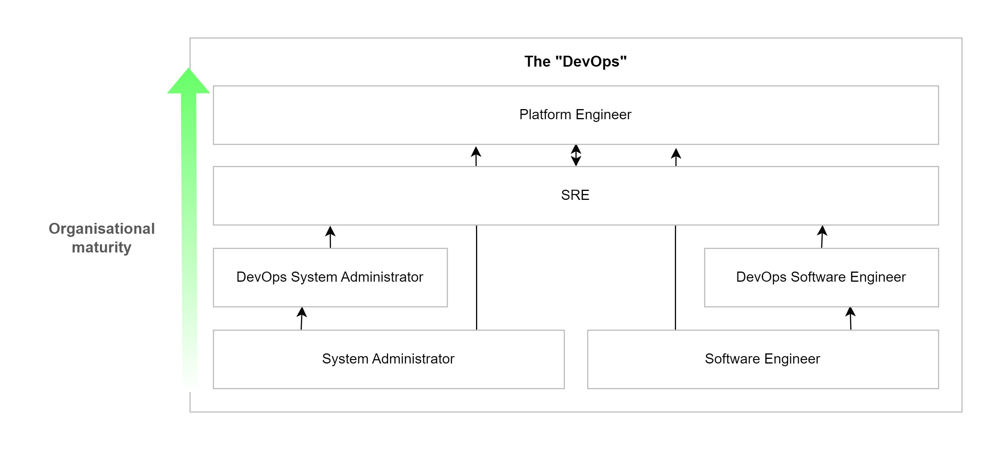

In summary, it's said that SRE utilizes DevOps methods[^HowSRERelatesToDevOps]. DevOps and SRE are neither opposing nor identical methods, but two disciplines that will help you break down barriers between your teams. This will allow you to deploy services faster, more securely, and of higher quality.

In this book, you will discover best practices from these unified disciplines, tailored to institutions.

## DevSecOps

The term DevSecOps is gaining in popularity. It describes a DevOps organizational approach that integrates Information Systems Security (ISS) teams from the software design phase and throughout its lifecycle.

More specifically, it ensures compliance with security standards set by the organization, using automated rules that verify the compliance of developed software.

Perhaps you've heard of "_shift left security_"? This term emphasizes the importance of incorporating security efforts into a software project as early as possible (best practices, vulnerability analyses, audits).

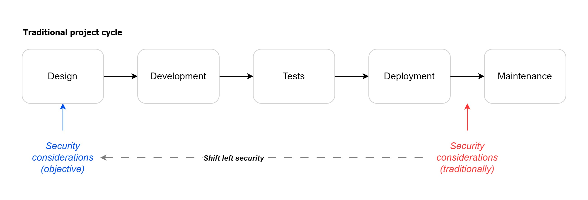

Organizationally speaking, this method places the ISS teams at the heart of the exchanges between developers and production teams. These teams will support the developers to integrate the organization's security requirements into their software as seamlessly as possible.

From the design phase, the DevSecOps ISS teams define and provide tools that monitor the presence of privacy and security features in the software. For example, they will check for GDPR[^GDPR] functionalities in a software or the proper functioning of the "need-to-know" mechanism for data access. This can also include the implementation of [automatic vulnerability detectors](#continuous-integration-ci) in the code.

Nicolas CHAILLAN, former Director of Software Engineering at the _United States Air Force_ (USAF) [defines it](https://podcasters.spotify.com/pod/show/podcastmortem/episodes/19-The-DevSecOps--lUS-Air-Force-e1mqvem)[^DevSecOpsUSAirForce] this way :

> "DevSecOps is the evolution of software engineering. It's the balance between development velocity and the time allocated to security considerations. We want security to be integrated to ensure it's not overlooked but added to the software development cycle. It's about using modern cybersecurity processes to ensure the software is both efficient and built securely, ensuring it remains problem-free over time. This is what will allow companies and organizations to remain competitive and move forward at the necessary speed against their competitors."

Today, the term "DevSecOps" is often favored with the sole aim of making the discipline more attractive. However, it can help Information Systems Security (ISS) teams and their managers understand they have a [concrete role](#devops-security-engineer) to play in this type of organization. It's the "Sec" in the middle of "DevSecOps".

> Author's Note: I consider security to be inherent to any information system, so I see the "Sec" in "DevSecOps" as implied. That's why I will rarely use this term throughout this book.

We will discuss the paradigm of this organizational structure and its security techniques in the chapter "[Security: a new paradigm with the DevOps approach](#security-a-new-paradigm-with-the-devops-approach)". But before that, let's learn more about the organizational challenges of DevOps.

# DevOps in Practice

A DevOps initiative is a significant transformation for an organization. If it hasn't yet transitioned to [agile mode](#staying-close-to-business-needs), it involves every layer of the company to foster shared synergies.

DevOps doesn't just bring together "Dev" (software engineers) and "Ops" (system administrators), but primarily the management layer. Management needs support in understanding the opportunities presented by a change that's often perceived as challenging because it's unfamiliar. In most cases, this transformation requires a significant evolution of the organization's IT systems in the long run, as it involves the adoption of new tools.

Empathy is the key skill for a successful transformation. For some, these new work methods and tools are in stark contrast to their traditional practices.

That's why it's crucial to frequently educate the hierarchy on the benefits of shifting to DevOps: demonstrate it to them, answer all their questions, and support them until they fully grasp its implications.

Every organization benefits from addressing new technological challenges. In the face of ever-modern and swift competition, your entity will not dominate by resting on its laurels.

## Why DevOps?

Research reports support the theory that the benefits of efforts invested in SRE become apparent in the medium term[^DORAReportSREPractice].

According to these, practicing SRE does not affect an organization's resilience until a certain maturity level has been reached. This means that one needs to achieve a critical mass before being able to reap the benefits of these tools and practices (fig. <spanc/>\ref{fig:adoption-of-sre-practices}).

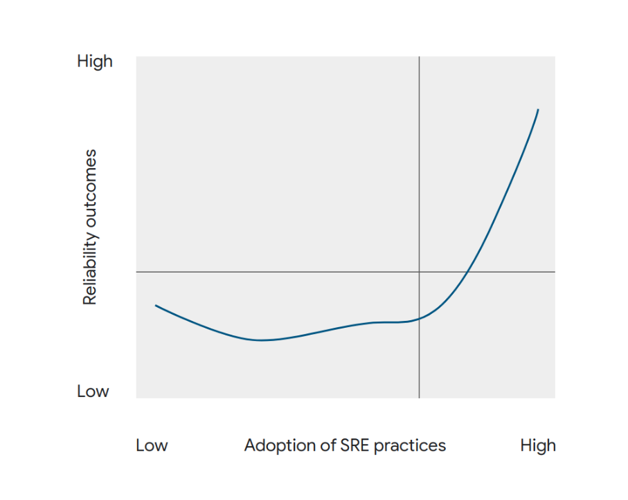

The DORA 2022 report highlights the need to adopt a substantial number of SRE practices before harvesting "significant" resilience benefits[^DORAReportSREPRacticesFigures]. This phenomenon can deter decision-makers from transitioning to a DevOps model.

Where interest is confirmed is that the benefits yielded by DevOps exceed the costs once the initial investments are made.

This trend is precisely where DevOps shines: even though traditional infrastructures initially require little investment to provide a service, the cost (in terms of human resources and financially) of maintaining them increases proportionally to the number of services deployed. This makes their management unsustainable in the long run. DevOps, on the other hand, requires a higher initial investment but provides the ability to manage exponential activity with a logarithmic cost trend (fig. <spanc/>\ref{fig:courbes_interet_devops}).

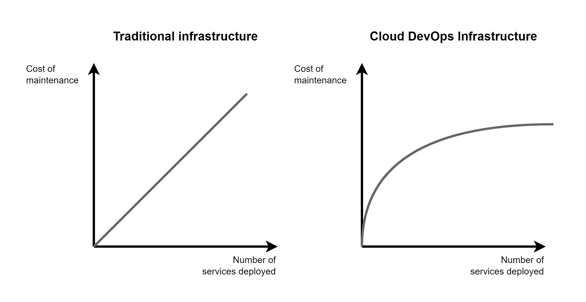

This organizational mode aims to make infrastructures more reliable, reduce manual tasks to make the most of engineers' time, deploy software faster, and ultimately, deliver a better-quality service.

DevOps to traditional infrastructures is what assembly line construction is to craftsmanship: by constructing on an assembly line, costs are reduced, and demand is met. The added advantage in software is that one can adjust the product to be delivered within a few hours. This action can be repeated several times a day!

While historic practices deserve credit for running information systems for years, more agile methods exist today[^RedGate2021Report]. To militarize the argument: bows and arrows served their purpose, but since then, armies have invented the AR-15[^AR15].

The challenge of transformation is to get your hierarchy to buy into this initial (significant but necessary) investment, even when the benefits might initially be hard to see. This is a common challenge that we will address in the chapter ["How to convince and keep the faith"](#how-to-convince-and-keep-the-faith).

## Skeptics and over-optimists

Companies are typically aware of the changes they need to implement. However, they either hesitate or are unable to immediately commit to the necessary efforts to achieve this transformation.

The most skeptical or overly optimistic believe they can get by by starting a cost-effective initiative:

> "I only need one SRE/Cloud/DevOps engineer."

Sorry, **no**.

Let's use an example to illustrate this scenario. You start with a 2-person team developing software. Several issues are already identified, especially if you're operating in a regulated sector:

- Who sets up the infrastructure to properly develop this software? (Software factory, dependency mirrors, library registries...)
- Who secures this infrastructure?
- Who handles backups?
- Who defines development rules and ensures their consistency for maintaining software over time?

If you rely solely on your software engineers to manage infrastructure, they will inevitably accrue technical debt since it's not their core competency. This debt incurs costs and maintenance efforts, which worsen as your team grows. Developers won't focus on development but will spread thin on tasks meant for an SRE. This scenario already calls for at least 1 SRE/DevOps engineer.

What if you hired more and now have a team of 6 engineers? They need machines set up and configured. Some encounter bugs, others request library updates... If there are security mandates (e.g., approvals, event logs), time must be spent setting up tools and infrastructure properly. This calls for at least one additional SRE/DevOps engineer.

Two engineers leave your company? Unfortunately, you still have to maintain the evolved infrastructure for your remaining 4 engineers and all the machines or servers you've set up.

Understand that you need to achieve a critical mass of SRE/DevOps profiles to sustain a robust foundation. This foundation enables your engineers to have the necessary tools to work efficiently. This critical mass should adjust based on staff size and can't be reduced without facing significant operational challenges.

The debate often circles back to "quality or quantity?". History of global armed conflicts demonstrates that both are often necessary[^MassInArmedConflicts]. Armies need a critical mass of soldiers and equipment to establish favorable power dynamics and compensate for losses to keep advancing. Though high-quality equipment can accomplish more, it can't handle everything simultaneously. The same goes for an engineering team. No matter how brilliant, a critical size is needed to meet the basic requirements for an efficient and resilient service.

> For instance, Google, with tens of thousands of engineers, maintains its SRE-to-developer ratio at about 10%[^GoogleWorkBookEngagementModel]. This SRE/developer ratio and associated costs are initially high at the outset of your initiative but tend to level off as the number of deployed services grows. This is due to the strong infrastructure needs at the start of your initiative, which decrease as administrative tasks become automated.

It's proven that transitioning a traditional structure to DevOps demands significant investment. Establishing the foundation to reap its benefits also takes time. However, remember that the essence of DevOps practices is to manage exponential growth with logarithmically trending costs (see chapter "[Why DevOps?](#why-devops)").

## Too big, too soon

The failure of a project is often due to a poorly defined scope, with overly ambitious objectives or unclear planning. This mismanagement leads to uncontrolled increases in timeframes and costs. It then becomes common to seek an "interim solution" while hoping that the initial plan might eventually come to fruition.

A DevOps initiative is built upon what already exists within your institution: the key is to start small to accurately understand the needs of the business and to bring the entire organization on board. This approach is the _Kaizen_ method, originated in Japan during the 1950s within Toyota factories. In France, it's known as the "strategy of small steps".

Dare to start small and iterate as both you and your institution become more familiar with the challenges and nuances of these new technologies. Ensure that each team becomes an advocate for your initiative. We will discuss the theories behind this recommendation in the chapter "[How to persuade and keep the faith](#comment-convaincre-et-garder-la-foi)".

Changing the culture of an organization takes time, but taking shortcuts may offend, demotivate your teams, and _ultimately_, cause your project to fail. Since DevOps is based on the principle of successive iterations, you'll be taking fewer risks.

## Initiatives within Organizations

Has your management been convinced by your transformation initiative and granted you all the necessary resources? If so, move on to the next chapter. If not, let's delve deeper to understand why.

It may happen that newly appointed decision-makers ask their subordinates to "quickly" find turnkey solutions to the problems they encounter. Rather than adopting an investigative approach, the urgency of obtaining immediate results leads them to make hasty decisions. After all, a leader is expected to quickly and effectively find cost-effective solutions. Most of the time, however, initiatives - of varying maturity - already exist within the organization.

Technical solutions are easy to design and delegate. Instead of considering historical proposals, purchasing "off-the-shelf" technologies or launching a brand new project may seem more efficient. However, choosing a solution without considering the organization's inherent constraints (organizational and technical maturity, human and material resources, technical debt, learning curve...) can be risky.

Moreover, these constraints are often already recognized and have been expressed for years by internal expertise. They lead to the birth of projects initiated by employees, in response to observed needs or their own frustrations. Instead of encouraging them to find a solution, they are often reprimanded for insubordination. In reality, these projects often get lost in middle management and rarely reach the decision-maker who can sustain them.

Indeed, decision-makers seldom have the time to meet each of their teams. As a result, they tend to [favor their own opinions](https://copyconstruct.medium.com/why-success-is-often-elusive-at-the-highest-echelons-3e02e4dd3e7f) or seek those of their deputies instead of their experts. The resulting decision, therefore, reflects the perspective of a single person, isolated from operational realities. The more layers of management there are, the more pronounced this isolation becomes. This leads to a concentration on poorly researched and non-inclusive projects. Paired with inherently low-impact communication, it inevitably produces frustration within the company.

A prime example is the _U.S. Department of Defense_ (DoD). They launched a new DevSecOps initiative named _Vulcan_[^DISAVulcan] 4 years after the _Platform One_[^PlatformOne] initiative, which had the same aim. Beyond causing frustrations within the _Platform One_ teams[^ChaillanDisaTweet], the _Vulcan_ program has experienced delays and cost overruns[^DISAVulcanDelays].

In other instances, the skepticism of some leaders leads them to question proposals made by their internal experts. Taken to an extreme, this mindset negates the benefit of hiring experts who interact daily with the company's issues. The external expert (e.g., a consulting firm, a third party) then becomes indispensable, viewed as objective and impartial[^SujetSupposeSavoir].

When faced with leaders who do not share our vision, one can express outrage and leave or try to understand their reactions and improve practices. As the leader of an internal initiative, you need to understand the decision-makers' fears: entrusting a groundbreaking project that disrupts organizational practices carries multiple risks.

If your organization is large and longstanding, it's because it has consistently met a need. If leaders come to believe it needs transformation (or if you anticipate it) and nothing has been started, the organization might be facing the innovator's dilemma.

Conceptualized by Clayton M. CHRISTENSEN[^InnovatorDilemmaBook] in 1997, this dilemma describes a scenario where a pioneering company, attempting to maintain its competitive edge, inadvertently misses out on major innovation. A previously unforeseen competitor then offers this innovation and upturns the market share. For instance, in 2023, Microsoft stunned everyone by releasing a ChatGPT integrated into its search engine before Google did. At that time, Google was the pioneer in internet search and was investing billions of euros annually in AI research. How could Google let a competitor get the upper hand?

The answer is simple: the risk for Google - with 84% of search engine market share[^MarketShareSearchEngines] - of releasing an unfinished product - which might return false information, for example[^BardFails] - is much higher than for a startup like OpenAI or for Microsoft's Bing - with 9% search engine market share. This is evident as, at the time of writing this chapter, few online articles questioned the Bing Chat launch compared to Bard, despite having similar issues[^CNNBingAI]. In summary: Microsoft had everything to gain, while Google had everything to lose.

That said, Google saw the pitfalls of not taking risks and has been working on a competitor, Bard[^Bard]. To avoid this dilemma, organizations should:

- **Stay informed**: Keep an eye on emerging trends and new customer needs by organizing partner visits, attending trade shows, or consulting experts to stay updated on market developments. For instance, you can ask your experts to draft a quarterly newsletter for management, highlighting current technological trends.
- **Regularly re-evaluate its strategy** (its _business model_): Using this knowledge, seek new growth opportunities by addressing new use cases. Propose new products and employ new technologies. In an institution, insights are also internal: it's essential to connect with different departments to understand their daily challenges and align innovations to address them.
- **Encourage risk-taking and experimentation**: Motivate teams to propose new ideas and pilot projects to explore new technologies. Reward risk-taking.
- **Invest in innovation**: Allocate sufficient resources for research and development (R&D). For instance, grant one day of remote work per week to your experts to explore innovative technology. Provide funding for teams to purchase equipment for experimentation or grant access to a cloud hosting provider (see chapter "[Continuous training](#continuous-training)").

More practically, if you decide to form your own team, members might leave your organization at any time. Given the depth of the discussions they were involved in, they might leave behind work that is challenging to pick up. That's why many organizations prefer to engage a third party, with a clearly defined scope, ensuring the leader gets a result (through the third party's contractual obligation). We will explore in the chapter "[Staying close to business needs](#staying-close-to-business-needs)" how this approach can have long-term negative consequences for the organization.

Organizational changes always entail a cultural shift that must be managed. This cultural gap can sometimes be too challenging to bridge for the entire organization, indicating it might be too early to introduce your plan. Cultivate awareness through presentations and success stories. Leaders must clearly understand the transformation's impact and associated risks: service disruption, HR strategy changes, staff training, or equipment purchases. Support your leaders in visualizing the transformation as you work on building your evidence.

The rest of this book will address understanding the psychology of change to ensure your project's success.

## Chronic Reorganizations

"Another one!" your most loyal team members might exclaim. How many reorganizations has your organization undergone? When overdone, they muddle the message and breed confusion for your teams.

In most cases, technical teams already exist within your organization, already serving business needs that necessitate their existence.

Leaders with limited understanding of business and technical stakes often feel the urge to alter the roles of certain teams. They do this in favor of a new project, based on the current skills present within the team. However, a team always forms around a project that shaped its culture, making it so efficient for the company today. Decision-makers should consider this before thinking of breaking this hard-earned culture by imposing a transformation.

The risk of drastically changing a team's roles means you should be well-prepared to support them – often, this isn't the case, as you likely don't have the time. Their current operational methods are the result of several restructurings, which probably already affected their ideals and the reasons they joined your organization in the first place.

Changing a team's roles without considering its culture and history risks losing team members: either they'll be demotivated by your project, or they'll resign. You need to provide them with a clear vision, convince them with solid arguments, but most importantly, involve them.

Given their history in your organization, your teams' knowledge can help you grasp concepts you haven't fully understood yet. Be open to their suggestions and feedback to discern how best to reorganize the team - and only if necessary - based on its aspirations. An excellent way to gain a team's trust and better understand its challenges is to do its job for a few days. This can be done when a decision-maker first joins the organization.

If you believe you don't have the necessary internal resources, don't hesitate to recruit. It's risky to affect the established teams if they're serving a need expressed by your organization. The essence of a transformation is to ensure service continuity while changing its practices.

Be more nuanced than announcing a "major transformation plan." Such practices invariably frustrate many team members, fail to gain the support of all your teams, and risk undermining your credibility. They can also make you a hostage to your predecessor by associating you with past failed transformations.

As discussed in the chapter "[Too big, too soon](#too-big-too-soon)," adopt a step-by-step strategy and gradually develop your intuition about who needs to be reorganized. Gain team buy-in by showcasing the realm of possibilities to inspire them. Then let them convince their peers on your behalf. We will delve deeper into these strategies in the chapter "[How to convince and keep the faith](#how-to-convince-and-keep-the-faith)".

## Refusing technological lag

> "It's normal, we'll always be behind here."

If this statement sounds familiar to you, it probably evoked a sense of dismay.

It's understandable for a company to face delays due to its size, resources, and safety requirements. However, organizations must not tolerate such lag. Under no circumstances should the statement "it's normal here" become an acceptable response.

If the speaker is genuine, this mindset merely stems from a lack of knowledge about how to achieve the goal. Otherwise, it might indicate a lack of courage or even intellectual laziness.

If the majority of an organization's employees believe that it is behind, there is a severe issue at hand. Maintaining the _status quo_ in such situations inevitably leads to the organization's decline and an irrevocable loss of credibility among its employees and partners.

In one of his articles[^ArticlePSDuckSyndrome], speaker and transformation expert Philippe SILBERZAHN gives the example of a man waiting for his train scheduled at 9:30. The screen reads "On Time," but it's already 9:35 on his watch. The man thinks about photographing the sign but wonders, "what's the point?". Many observers would downplay this five-minute difference, express irritation, or simply blame a display malfunction. "After all, no one can do anything about it," they might conclude. It is with such behavior that Philippe SILBERZAHN argues organizations decline: they grow accustomed to mediocrity.

While initially considered unacceptable, over time, the malfunction becomes increasingly acceptable to the organization, without them realizing the cost in time and money. The effort to rectify the issue becomes less and less justifiable, and silence becomes the default choice to conserve energy. Until an irreversible situation arises (or a few brave souls shake the structure!).

However, it's essential to know _when_ to unveil innovations. Preston DUNLAP, the first Chief Technical Officer (CTO) of the USAF, describes in his public letter _Defying Gravity_ how "bureaucratic forces" can hinder innovation if introduced prematurely.

> "Some have asked me what my recipe for success was over the past three years. I haven't spoken much about it because I knew that if I revealed the elements too early, the natural forces of bureaucracy would come back stronger, rejecting at every turn all the potential of innovation." - Preston DUNLAP, Defying Gravity[^DefyingGravity]

To prevent technological lag, organization leaders can adopt several practices:

- Continuously train staff, including decision-makers (see chapter "[Continuous Training](#continuous-training)") ;
- Maintain an internal innovation capability to stay critical (see chapter "[Internal team model](#internal-team-model)") ;
- Accept controlled risk-taking and promote open communication (see chapter "[Accepting failure](#accepting-failure)") ;
- Measure and implement indicators to avoid complacency (see chapter "[Measuring everything](#measuring-everything)").

# Prerequisites

Designing the best service (a method, software, or tool) won't let you be helpful to your organization unless you provide easy access, uninterrupted service, and support. DevOps will enable you to structure and maintain this source of value.

This book doesn't even require your team to be especially large, nor does it require your leaders to already be convinced. However, it does require your team to be convinced that they can drive the project forward. Of course, over time, support from other teams in your organization will become a valuable argument to showcase the success of your initiative.

A leader only asks to be convinced by an initiative from their subordinates. Help them visualize and understand the added value of what you're proposing.

This will require you to regularly present the progress of your project: both so they remember and so they understand. It's always risky to assume a project is understood after the first presentation, especially when introducing a new paradigm.

Plan to set up an internal team: there will always be bugs to fix, configurations to adjust, and features to add. Whether developed internally or by a contractor, you'll face the phenomenon of software erosion[^SoftwareErosion]. This refers to the issues software may face over time when left unattended (critical security updates, full disk space, processes that stop working...).

Don't think that a contractor can solve all your problems: you'll lose money and won't achieve your goals. The result of a contractor will only be the product of your ability to synthesize your challenges. Yet, during a transformation phase, you'll discover new issues every week. Unlike you and your team, the contractor probably won't be continuously present in your organization to capture all stakeholder challenges.

Starting your DevOps initiative requires envisioning the recruitment of several profiles:

- A team leader whose engineering skills are recognized and who has excellent communication abilities.
- Software engineers who will develop solutions to business or user needs.
- SRE/DevOps who will develop your foundation and manage the software development/deployment cycle.

Whether you're a senior manager or a mission officer aiming to enhance the services your organization offers, you will need to justify your initiative to your superiors and the rest of your organization. It's therefore essential to understand how to communicate effectively so everyone buys into your project. Let's explore some strategies for doing this in the next chapter.

# How to convince and keep faith

First and foremost, it's not about convincing. You can't just walk up to someone and say, "you're wrong, I'm right." Instead, you need to inspire your audience to align with your vision or project. In this way, they'll be convinced on their own.

Gaining the support of your superiors or colleagues for an initiative isn't always straightforward. William MORGAN - the leader of a renowned tech startup - recommends 4 rules to follow[^WilliamMorganKubecon2018]:

1. Identify who is affected (the stakeholders) ;
2. Determine what the new solution will bring them (the benefits) ;
3. Understand what their concerns are (the worries) ;
4. Alleviate concerns, highlight the benefits, and communicate.

According to William MORGAN, once you reach a certain level of technical engineering, the roles of "salesperson" and "engineer" become indistinguishable: "Advanced engineering work is indistinguishable from sales work."

Here's how these rules could be applied to security and _management_ teams:

- For security teams, the proposed technology might [automatically manage and audit the encryption of flows between services](#service-mesh). Their primary concerns could be: "Will this technology make my infrastructure more secure?" or "What new attack vectors could this technology introduce?"
- For _management_ teams, the proposed technology might speed up the development pace and reduce service interruptions. Their main concern would be understanding the hardware or human resources the company would rely upon after implementing this new technology.

The theory of mental models[^ModelesMentaux] helps us better understand the decision-making process (e.g., whether someone supports an initiative). Everyone's perception (i.e., a mental model) varies by individual. Transformation, then, is about collectively agreeing on an alternative mental model[^SilberzhanModeleMental].

Even though DevOps might be backed by studies and is evident in the private sector, institutional initiatives are still not widespread enough[^DORAIndustry]. Therefore, you find yourself in a position where you're certain about the direction to take, but you're not fully able to justify it with data or examples. Presented with your forward-thinking transformation proposal, the decision-maker thus faces a risk. And as a matter of survival:

> "It's better to be wrong with the group than to be right against the group."

To assist the decision-maker in making their choice, you need to work on minimizing this risk. But how? The idea is to rally early adopters to your cause without announcing it to the collective.

> "The first one to step forward takes a massive risk. The 150th takes none."

Besides enhancing your value proposition, you'll have examples to reference and support: you won't be the "first" taking the risk, and neither will your organization.

## Act with finesse

> "Initiative is the most refined form of discipline." - General LAGARDE

Operating behind the scenes (not announcing your project to the group) requires understanding its potential repercussions. Even though you may want to make improvements in good faith, you might misjudge the overall situation of your organization. Thus, your project could disrupt established power dynamics, making you undesirable in the eyes of some.

For instance, a team lacking resources comes to you for help. Seeing their distress, you design a brand new tool for them quickly using your DevOps platform. You choose not to inform your superiors, fearing they might reject this innovation (refer to the previous chapter).

What you don't realize is that the team you're supporting hasn't been doing the work required by management for several weeks. While the leaders are trying to balance the situation, a sudden player (your team) starts doing favors for the delinquent team.

Upon hearing the news, the leaders find themselves in an awkward position: they appreciate the support you provide (it's virtuous in good faith) but resent you for meddling in their affairs.

And thus, your initiative gets caught in a vicious cycle (fig. <spanc/>\ref{fig:power_games}). On one hand, your team sees no harm in helping and stops reporting to the management team. On the other hand, the leadership gives up on collaborating with you and trusting you.

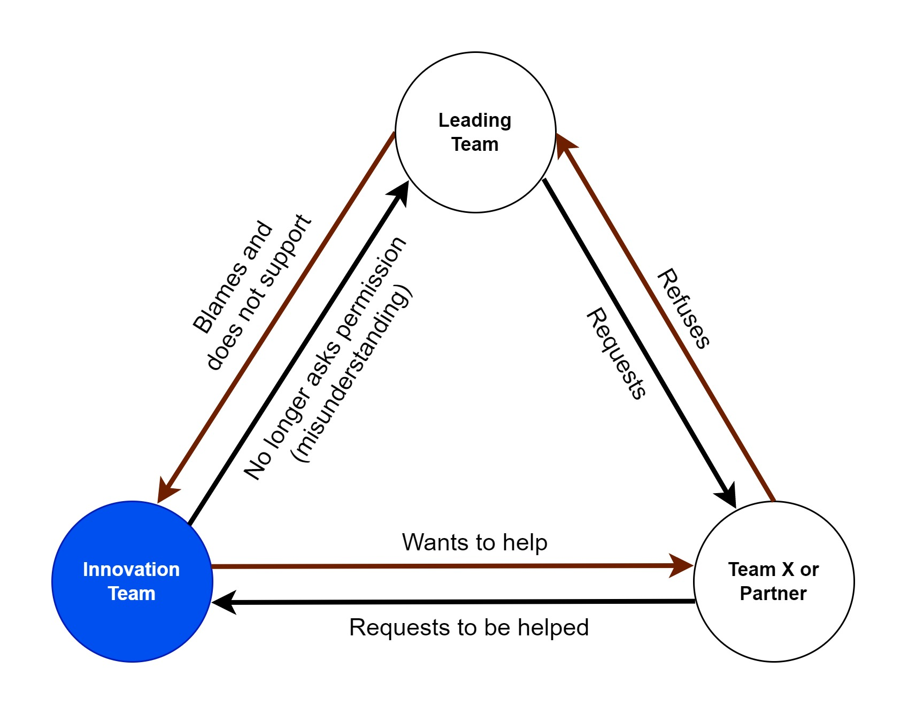

\newpage

The problem is primarily cultural: the organization isn't trained to support innovation, making it challenging to innovate. Innovators must then find indirect ways to make a difference. On the flip side, innovators are often not well-versed in the structures where they are asked to innovate. This highlights the need to train these profiles so they better understand how the organization operates. By implementing the 5 pillars of DevOps, you will help your organization transform its culture and promote innovation (refer to chapter "[The five pillars of devops](#the-five-pillars-of-devops)")

Therefore, make sure you fully grasp the political dynamics between the leadership team and your initial experimenters before acting covertly, or you risk complicating your progress.

## Approaches in Facing Opposition

Keep in mind that if things are the way they are today, there are valid reasons for it: you might not necessarily have a comprehensive understanding of these past reasons (time allocated to projects, HR/financial resources, power plays, etc.) and it's not your role to blame those involved.

Also, be aware that during a transformation, leaders must continue to deliver the same services as before. Decision-makers then have to manage the transforming environment parallel to the current environment, ensuring the former doesn't overshadow the latter.

Furthermore, don't be disheartened by the first person who resists. Every innovation initially faces moral mockery and goes through three phases: ridicule, perceived as dangerous, and then seen as self-evident[^InnovationPhases]. Having experienced this firsthand, I can vouch for its accuracy, and there are historical examples:

- Women's suffrage: initially deemed ridiculous, then seen as dangerous as some [suffragettes](https://en.wikipedia.org/wiki/Suffragette) lost their lives in the 1910s, and now it's a given in our contemporary societies.
- Henry FORD had a vision that every American should own an affordable car. Back then, cars were seen as a luxury item for the wealthy: "it's not clear what it's for, but it looks nice." He created the first moving assembly line in 1913[^FordIndustryChain], and _Ford_ is still an industry leader today.
- Elon MUSK believed in creating reusable rocket launchers. Initially mocked[^ElonMuskBiography] or highly doubted[^MuskImpossibleQuote] by the Russian and American space industries, he's now respected by the latter and seen as a [threat](https://www.ft.com/content/24cca993-b249-45a5-8c42-b39c0ec30c5b) by the [European space industry](https://www.latribune.fr/entreprises-finance/industrie/aeronautique-defense/satellites-europeens-lances-par-spacex-la-terrible-defaite-de-l-europe-spatiale-937632.html).

If you face direct opposition, you may need to rethink your communication strategy (refer to the following chapter "[Tailoring your message](#tailoring-your-message)"). Start with understanding opposing viewpoints. If you feel that some are deliberately trying to end discussions, consider the following tactics:

- **Invoke shared values**: Even if you and your counterpart have different beliefs, you might still have common values. Show how your initiative aligns with them.
  - If both of you value innovation, explain how your approach promotes it and the new opportunities it offers ;
  - If both are keen on enhancing the day-to-day experience for a certain profession or user, provide use cases on how your solution can assist.
- **Put them in the spotlight**: Be it a decision-maker or a client, anyone will support your idea if it lets them shine. Identify how your project can help them achieve their goals and make this clear to them.
  - A misplaced ego often arises from a disconnect between the project's stated objectives and the individual's personal goals ;
  - If your counterpart seeks to stand out and gain influence in their organization, show them how your project could bolster their reputation as an innovative leader committed to improving the lives of their team.
- **Build a coalition**: Gather people who share your transformation vision (earlier mentioned _early adopters_). These individuals often agree with you on the organization's inefficiencies.
  - By creating a supporting community, you show stakeholders that your approach is legitimate and backed by many ;
  - Get official testimonials: a letter or email signed by a recognized leader from an entity you've worked with, vouching for your methods or services ;
  - Also, accept that you might not be a permanent fixture in the organization. If your initiative doesn't find its place there, it's the organization's loss! The same effort could have a different impact elsewhere. And only you set your own boundaries.

## Tailoring Your Message

Successful transformation requires impeccable communication from its initiator. It's crucial to know how to present based on the target audience, all the while keeping in mind certain common organizational phenomena.

> "Why don't they seem convinced?"

Perhaps after one of your presentations, you've found yourself in this situation. Validated by many of your peers and seemingly well-suited after rehearsals, it still didn't achieve the desired impact. The person you addressed didn't ask the right questions or seemed bored, or even irritated.

Presenting to different audiences requires tailoring your presentation style, examples, and arguments to their roles, constraints, and needs. Don't expect anyone to understand the _so what_[^SoWhat] of your presentation if you haven't first understood why it was beneficial for them to attend. Typically, two presentations suffice: one for professionals (or "clients") and another for senior officials (or "policy makers").

However, it's important to differentiate between senior officials (or _executives_) and immediate supervisors (or _managers_). The latter often have a stronger bond with their teams, making them more receptive to business-related arguments. Senior officials, on the other hand, operate at a strategic level[^MilitaryStrategy], where they set the organization's vision and major directions. Operational, tactical, and technical considerations are delegated. As such, messages passed up the hierarchy might get distorted or altered.

That's why you shouldn't assume that the leaders are always aware of what you observe at your level. Don't hesitate to remind your audience about the effort required for even the most common tasks. For instance, emphasize that 80% of _n_ individuals' work is dedicated to a certain task. With your approach, you could save _x_ hours per day for each employee, equating to _y_ euros in savings or _z_ times increased productivity.

Decision-makers seek arguments they can use to persuade others. Endeavor to grasp the mandates they must adhere to, providing them communication tools they can reuse. For instance, the CEO of a multinational might prioritize economic profitability, while a high-ranking politician might weigh social impact more heavily. However, both will be keen to align with their organization's strategy (corporate strategy or government/party priorities).

Just like you, a decision-maker newly introduced to a topic can only retain a few key pieces of information. Ensure you focus on a maximum of 2 or 3 main ideas you want to convey. Conclude your presentation with a call to action, guiding them on how they can support your project's realization.

Let's summarize the interests of our two profiles:

| Subject                   | Professionals                            | Decision-makers                                                                                                      |
| --------------------------| ---------------------------------------- | -------------------------------------------------------------------------------------------------------------------- |
| **Detail Level**          | Detailed practical information.          | Overview.                                                                                                            |
| **Terminology**           | Industry jargon and specific tools.      | Strategy-focused, emphasizing value to the organization or broader community.                                        |
| **Data and Evidence**     | Practical examples, case studies.        | Impact metrics in time, money, and influence.                                                                       |
| **Objective**             | Educate, inform, gather feedback.        | Persuade, gain approval.                                                                                             |
| **Presentation Style**    | Interactive, hands-on.                   | Formal, concise, direct. Aimed at the desired outcome.                                                              |

Take, for instance, a company whose employees need a high-performing translation software. A solution provider pitches to the organization's director. Here are the arguments for each profile:

| Subject                   | Employees                                                                                        | Director                                                                                                           |
| --------------------------| ------------------------------------------------------------------------------------------------ | ----------------------------------------------------------------------------------------------------------------- |
| **Detail Level**          | How the tool eases work, its usage, and unique features.                                         | Why the organization needs this tool and its impact.                                                               |
| **Terminology**           | Technical terms related to translation and tool operation.                                       | Focus on strategy, organizational efficiency, and performance improvement.                                         |
| **Data and Evidence**     | Tool demonstration, before/after comparisons, case studies.                                      | Overview of features. Productivity boost statistics, ROI, internal usage feedback.                                |
| **Objective**             | Discover the tool's value (speed & quality of translation). Usage instructions and limitations. | Understand the tool's positive impact on the organization and the investment required.                             |
| **Presentation Style**    | Practical, interactive with demos and Q&A.                                                       | Concise, focusing on organizational benefits. End with a call to action and a summary sheet.                       |

Lastly, you cannot completely rule out the possibility that your counterpart might have conflicts with other stakeholders in your organization. This could hinder them from making seemingly beneficial decisions, in a bid to maintain their status or protect their career. In such scenarios, try finding equally or higher-ranked influencers to champion your vision among decision-makers. Once multiple top executives back your message, it becomes challenging for anyone to reject what the rest of the organization sees as essential.

More often than not, lackluster communication results from misunderstandings rather than malintent. Unless you're sure, always assume the issue isn't with the person in front of you.

# Internal team model

By understanding the techniques to address common resistance to change situations, we can move forward with greater confidence. Let's now explore how to structure our approach and strengthen our arguments for effectively launching our initiative.

## In-house development as a real alternative

In the chapter "[Refusing technological lag](#refusing-technological-lag)", I discuss internal innovation as a means to prevent an organization's decline. However, it's crucial to clarify how in-house development, beyond being effective, becomes essential if a company wants to remain competitive.

Which company responsible for a major IT project would claim, "We don't need an IT expert"? Due to a lack of technical acculturation or previously mentioned psychological phenomena, decision-makers sometimes chronically turn to consulting firms.

Much like global organizations such as the World Health Organization (WHO) or the United Nations (UN), national entities like the National Center for Scientific Research (CNRS), the National Education, and the Public Health France agency have an internal scientific council[^ScientificCouncilSPF]. This ensures they stay updated on the latest scientific knowledge, enabling decision-makers to make informed choices. In the private sector, this role is filled by the Chief Technical Officer (CTO) and their senior managers (VPs in English).

While a scientific council can help an organization remain at the forefront of scientific knowledge, it isn't enough to make it innovative. Especially if its members aren't periodically refreshed. To innovate, practice is key.

If you want to effectively address the challenges facing your organization, only an internal team practicing the technologies related to your topics can help. Thus, boldly setting up your technical team offers numerous benefits. Daily contact with business sectors or clients enables the creation of tailor-made tools, finely tuned to meet their needs effectively.

This close proximity to the requester also facilitates real-time support service, eliminating the additional costs and delays usually associated with external support. This leads to shorter improvement cycles and faster delivery of requests.

Having the project roadmap under their direct control allows decision-makers to ensure developments perfectly match their needs and vision. This in-house management significantly reduces costs by pooling investments for several simultaneous projects.

One of the primary strengths of an internal team lies in data security, with data strictly confined to the organization's infrastructure, accessible only to authorized members. This minimizes the risk of data breaches.

Furthermore, an internal team has a unique ability to quickly and relevantly evaluate technological innovations, placing them in the organization's business challenges context. They are also positioned to promote the assimilation of these new technologies within the organization through presentations suitable for all levels.

Relying solely on an external resource for your IT projects will inevitably lead to prohibitive costs. Without internal expertise, you're at the mercy of talented sales teams from companies eager to sell you services your organization will never use.

The main reason decision-makers are cautious about in-house developments is maintenance. They're right: paying a service provider can be expensive, but they're contractually bound to deliver. This contract often comes with a maintenance provision. A single internal developer - poorly equipped due to limited support - might fail at the same task, ultimately calling the decision-maker's responsibility into question.

Therefore, hiring two or three engineers won't be enough to sustain your developments. To successfully offer a useful solution, which can be a viable, maintainable alternative and credible to your superiors, you'll need to assemble a much larger team.

By equipping this team with a proper development environment (see "[Software factory](#software-factory)") and incorporating best DevOps practices, they'll have time to focus on the quality of your software. While this requires a time investment and might be a challenging step with your superiors, they haven't yet realized how invaluable this advancement will be in the future! Stay the course.

At one of the companies I worked for, the in-house development of software by an engineer saved several million euros. Equivalent industrial programs were stagnating, and the business units remained helpless. It took just one engineer - albeit a brilliant one - to solve a problem that had persisted for over 6 years.

Thanks to DevOps rules demanding software quality standards, over ten developers in the last three years have contributed to this project to maintain and enhance it. It still receives numerous weekly updates today.

Beyond providing a pragmatic solution to a problem, this engineer especially succeeded in acclimating the entire hierarchy to modern development concepts and machine learning techniques. Invited to major strategic meetings alongside traditional external providers, he became the organization's machine learning reference. Without him, no one internally would be able to specify a need or evaluate a machine learning solution with full knowledge.

## "Innovative" Teams and Data Science

Many organizations have sought to invigorate their structures by creating "innovation teams." Yet, many have not truly managed to deploy into production what was developed therein.

Use cases often revolve around data and artificial intelligence. Buzzwords such as "data scientists", "deep learning", and "artificial intelligence" have led to numerous false hopes. Many organizations hired data science profiles only to find them unable to deploy their algorithms to interfaces designed for non-expert users.

The problem isn't with the data scientists but rather with decision-makers who, until recently, didn't understand what responding to business needs entails: a reliable development foundation, clean data, massive data, model tracking[^ModelsIA] (MLOps), and a deployment team. In essence, many thought (and continue to think) that "AI" could solve any problem with just a few lines of code. These individuals are unaware of the infrastructure and technical support required by these technologies.

A typical data science example concerning DevOps is the need for computational power, storage capacity, and services to develop and monitor the training of models. Yet, most data scientists aren't equipped to set up their machine, their GPU drivers[^DriversGPU], and their Jupyter Notebook environment[^JupyterNotebook], especially within the complex environments characteristic of large organizations (regulatory constraints).

## Staying close to business needs

What will set your team apart is the support you provide to your operators. Compared to traditional development teams or external service providers, your advantage is the potential to have close interactions with your organization's business operations.

This is the renowned "agile" methodology, in contrast to the "V-cycle" (or _waterfall_ methodology).

In many organizations, the "V" approach is still employed: the service provider meets the business team with a requirement, produces a PowerPoint presentation a month later, and unveils the development outcome between 6 months and 6 years later. In software, the delivered product is already outdated, and the teams that made the request might have changed by then.

In manufacturing—like designing a warship—it's legitimate to ensure that the vessel will float correctly and that its rudder will steer it properly before launching. The ship's features are often set: its range, missile capacity, service duration, etc. One wouldn't alter the hull composition at the last minute or adjust the shaft line bearing. The "V" cycle is appropriate here.

However, in software, a more agile approach is feasible. Software behavior can be assessed and simulated in near real-time. This flexibility ensures the software can be adapted at any point, ensuring it meets set objectives (fig. <spanc/>\ref{fig:cycle_v}).

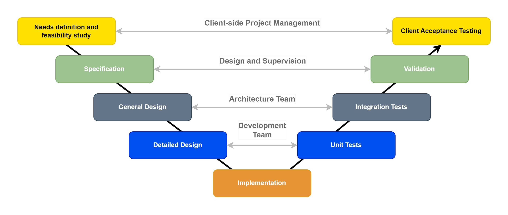

Within an armament program, the onboard computer systems of a ship (e.g., sensors, information systems) can follow agile methodology, while the carrier's production[^DefCarrier] can be governed by the "V" methodology. While the hull may undergo few changes, the software can be updated as rapidly as operations require[^WishesCEMA].

Beyond the technical solutions you offer, your business teams will notice that your more agile organizational mode is efficient for them. Consequently, they will support your initiative. As a team leader, your goal should be to have representatives from business teams that you've aided with your tools testify during crucial presentations. Such representations will bolster your credibility and prevent your teams from merely being seen as "technical development providers."

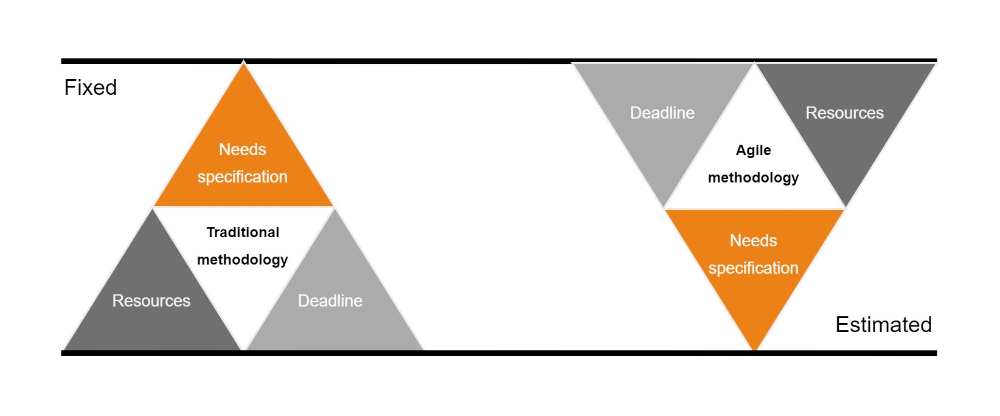

This proximity to business operations will enable your teams to feel more involved in your organization's missions. It's a win-win dynamic for both your engineers and clients. Both parties benefit from each other's expertise: the engineer gains a deeper understanding of the issue, and the operator specifies their need as precisely as possible.

Henrik KNIBERG's[^HenrikKNIBERG] illustration, an agile coach, effectively conveys the essence of the agile methodology: the preference is to deliver a functional (though incomplete) product at each stage, gather user feedback, and iterate (fig. <spanc/>\ref{fig:agile_illustration_henrik_kniberg}).

Throughout your career, you've likely noticed: clients often struggle to articulate their exact needs. Agile and ultimately DevOps methodologies allow for adaptation to the ever-evolving business realities, ensuring a deep understanding and delivery of a product truly aligned with their requirements.

By automating tedious processes, DevOps techniques will free up time, allowing you to spend more with your clients, understand their needs better, and effectively address their feedback and suggestions.

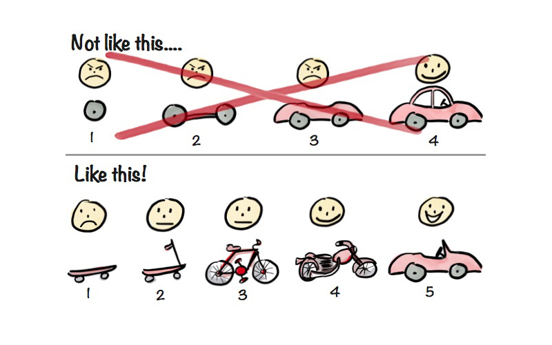

Bringing technical profiles and business teams together adds value by promptly and accurately addressing internal challenges. This is also a key to staff retention. Remember: your teams seek purpose. They don't merely come to work to follow orders but to employ their expertise to devise the best technical solution for a business problem. An engineer's work culmination is witnessing the business use the solution they've crafted.

\newpage

## Unleashing Communication and Breaking Down Data Silos

One of the cornerstones of DevOps is to break down silos, including access to data.

If you want your technical teams to best respond to your needs, they require privileged access to your company's data.

When the legal framework allows, forego "anonymized samples". Engineers need a precise understanding of the data they are supposed to process. Trying to develop a tool based on "anonymous" data is akin to developing a tool that only partially addresses a use case.

Otherwise, you can be sure a bug will occur as soon as an "unknown" data passes through the software (see _edge cases_). Provide your teams with production data intended to be used in the tools: you'll spend less time on bug fixes and improve the quality of service provided by your software.

If you don't have the necessary permissions, perhaps hiring in-house isn't essential. A service provider can just as effectively build the software from open-source data. However, consider the risks of proceeding this way (see [Staying close to the business needs](#staying-close-to-business-needs)).

# Security: a new paradigm with the DevOps approach

The idea that DevOps bridges different professions for collaboration is not easy to implement. Traditional roles in Information System Security (ISS) found themselves confronted with practices they weren't used to and sometimes didn't have the time to grasp.

In large organizations, company rules or even the law itself require specific versions of a software to be defined for it to be qualified[^ANSSIQualifiedSoftware] or approved. Imagine having the responsibility to enforce these conditions when DevOps methods involve dozens of software updates daily: it's quite daunting! Therefore, understanding the makeup of a cloud infrastructure to correctly define its "security" is essential.

Security affects all [pillars of DevOps](#the-pillars-of-devops-in-practice). This chapter focuses on a high-level description of security concepts within a DevOps approach.

In this organizational mode, security practices are automated to be systematically verified. The aim is to minimize so-called "documentary" security in favor of programmed rules. Indeed, using standardized technologies (e.g., containers, Kubernetes) facilitates implementing security rules, ensuring they are applied.

## Culture of Security

The DORA report[^DORAWebsite] "_State of DevOps 2022_"[^DORAStateOfDevops2022Announcement] focuses on security challenges in corporate DevOps transformation initiatives. It states that a company promoting trust and [psychological safety](#embracing-failure) is 60% more likely to adopt innovative security practices. This culture reduces the number of burnouts[^Burnout] by 40% and increases the likelihood of an employee recommending the company.

Security has always been a matter of culture. However, the DevOps methodology introduces all the techniques that will allow an organization not to overlook good practices, previously neglected or lost in voluminous and cumbersome archives.

The key is to understand that in DevOps mode, we operate on a principle of [iterative improvement cycles](#staying-close-to-business-needs). Projects are never set in terms of technology used, and deployments are continuous without human interaction. This ensures that innovation remains agile and always addresses the client's needs most accurately.

But it's not a free-for-all: there are technological standards and procedures that control what's deployed, according to the security standards your organization demands.

We'll delve deeper into the cultural aspects of the DevOps methodology in the chapter "[Embracing failure](#embracing-failure)".

## Qualification, Certification, and Approval

There are three ways to manage risk when making a technical choice concerning the security features of a technology. In France, ANSSI defines the following terms in this way:

- Qualification: It is the recommendation by the French state for proven and approved cybersecurity products or services[^QualificationANSSI]. It attests to their compliance with regulatory, technical, and security requirements promoted by ANSSI, providing a guarantee of product robustness. It allows the product to access regulated markets.
- Certification: It is an attestation of a product's robustness, based on a compliance analysis and penetration tests performed by a third-party evaluator[^PASSI] under the authority of ANSSI[^CertificationANSSI]. It allows access to regulated markets and ensures a level of trust for users wishing to adopt it. The process takes between 2 months (first level security certification) and 18 months (common criteria certification).

Certification/qualification concerns a product. Approval concerns the deployment of this product in an environment (an information system). While certification is not a legal requirement, approval can be, depending on your IT security rules or the law (e.g., if you are an OIV[^OIV]). It represents the acceptance of risk versus the benefits the installation brings. In this sense, it can be validated by an IT security authority regardless of a product's certification/qualification.

Qualifications, certifications, and approvals are currently not well-suited to continuous deployment practices, as they freeze risk at a specific moment. Yet, threats emerge daily: a vulnerability in a library, for example, could be detected a day after approval is granted. Even though the approval is temporary, the vulnerability might persist during this time, with a risk of exploitation. It remains to be detected, and for someone who has undergone the administrative ordeal of approval, to consider repeating the experience.

Securing an information system is better if one assumes that a security flaw might emerge or be deployed at any moment, but that implemented procedures can quickly respond to this threat. For this, it's recommended to adopt continuous integration techniques.

## Continuous Integration and Security

Continuous integration allows automatic monitoring of changes made to software or infrastructure.

Whenever even a single line of code is altered, tests are triggered. If a code modification doesn't meet the defined security standards, the contribution[^contribution] is rejected. The developer is automatically notified in their [software factory](#software-factory) (e.g., GitLab). They can see an error message explaining the issue, enabling them to immediately make the necessary adjustments.

This is where the expertise of security managers is needed. These professionals must explain to DevOps engineers and SREs what specifically needs to be monitored. These rules are then translated into code, forming automated tests, within a continuous integration pipeline used by all company projects.

These versioned rules [in the form of code](#infrastructure-as-code-iac) become automated tests. They can be updated as needed, instantly impacting all projects.

They might consist of antivirus checks, vulnerability scans in used Docker images, or ensuring that no passwords are inadvertently left in a public file.

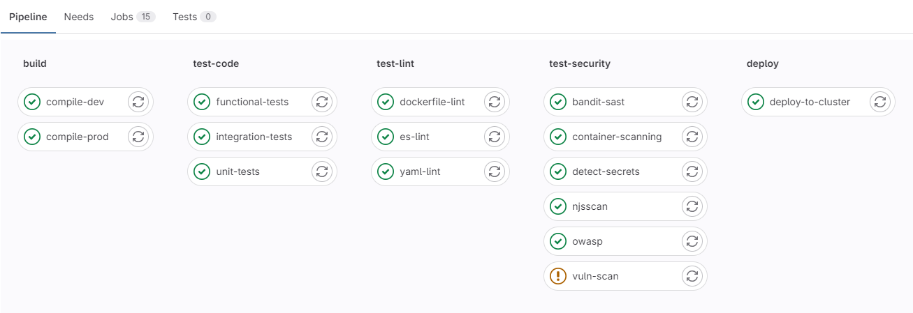

In the illustration above (fig. <spanc/>\ref{fig:ci-pipeline-gitlab-security}), you can observe a 5-stage continuous integration chain (_build_, _test-code_, _test-lint_, _test-security_, and _deploy_). The column of interest is _test-security_. It contains various security tests that are initiated. They can either pass (green checkmark), fail (red cross), or fail with a simple warning (yellow exclamation mark).

> An exclamation point means the test did not pass but was not deemed critical (e.g., an outdated software dependency with no security flaws).

For engineers, the ultimate goal is to see their project accompanied by a green checkmark, signifying all tests have been successfully passed.


In a DevOps approach, developers don't start from scratch. They begin with a template[^GitLabCustomTemplate] that they copy, which integrates - in addition to development files - all security rules. Ensure that security teams co-contribute to these templates so every new project incorporates your security standards (see chapter "[Continuous Integration and Security](#continuous-integration-and-security)") to save time for everyone.

Continuous integration chains aren't limited to security tests. Consider them as scripts automatically triggered with each code modification. Although the traditional trigger is "code modification", cloud hosts like AWS might offer their triggers (e.g., adding a file to an S3 bucket)[^AWSCodePipeline]. We'll delve deeper into the workings of continuous integration in the chapter "[Continuous Integration (CI)](#continuous-integration-ci)".

## Code Reviews

In an ideal world, all verification is automated. However, it's sometimes challenging to "code" advanced security checks, and you might not have the human resources to develop them.

In DevOps, the [GitOps](#gitops) methodology is practiced: everything is based on code (software, infrastructure, architecture diagrams, presentations, etc.).

Each developer works on their own branch and develops their feature. They test if everything works as expected, then creates a "merge request" (commonly known as _merge request_ or _pull request_) into the main branch. This process is detailed in the "[Git Workflows](#workflows-git)" chapter.

Code review takes place at this juncture. It's an opportunity for engineers to approve others' changes, providing an external perspective before it gets merged into the main branch. This is the time when various stakeholders involved in reviewing the quality of a contribution can write their comments (fig. <spanc/>\ref{fig:gitlab-review-comment}).

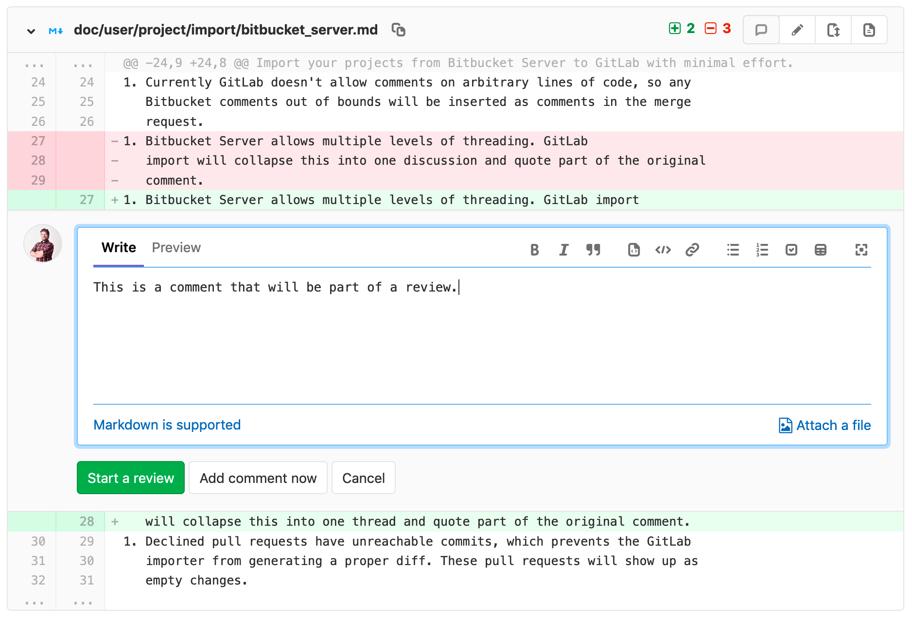

The goal is to ensure the developer hasn't made significant errors in the code's functionality or is not adding technical debt. For instance, at Google, a _merge request_ requires approval from at least two engineers before it can be validated.

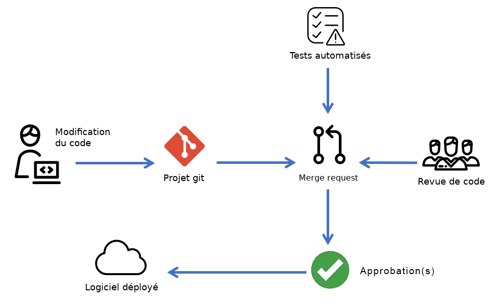

Releasing a new version of software in production is the ideal time for security teams to audit the code. This practice is known as "security review". Every new software release is subject to previously mentioned continuous integration rules with additional automated security tests and optionally the validation from the security team.

For security teams, the code review aims to ensure that the maximum security criteria are met, such as:

- Presence of activity logs documenting user actions ;
- Access to authorized data sources (see "[Service mesh](#service-mesh)" chapter to enforce these security policies) ;
- No data being sent to an unauthorized service (see "[Service mesh](#service-mesh)" chapter to enforce these security policies) ;
- Password/cookie storage techniques ;
- GDPR functionality compliance.

GitLab, for example, allows you to mandate the approval of a _merge request_ by specific teams[^GitLabRequiredApprovals] (e.g., the security team) before a contribution can be merged into the main branch (fig. <spanc/>\ref{fig:gitlab-review-approval}).


Tools like [_ReviewDog_](https://github.com/reviewdog/reviewdog), [_Hound_](https://houndci.com/), and [_Sider Scan_](https://siderlabs.com/scan/en/) assist engineers during code reviews. For instance, these tools run _linters_[^linter] and automatically add comments on the relevant line.

## Securing your software supply chain

In May 2021, the White House released a decree describing new strategies for "improving the country's cybersecurity". Among the 7 described priorities[^FactSheetUSASecurity], enhancing the security of the software supply chain is mentioned. It states there's an "urgent need to implement stricter techniques, allowing for quicker anticipation, to ensure products (software purchased by governments) operate securely and as intended"[^USAExecOrderImproveCybersec]. This commitment was renewed in January 2022 with Joe BIDEN's signing of the U.S. National Security Memorandum[^NSM2022].

DevSecOps Maturity Models (_DevSecOps * Models_) like those from OWASP[^DSOMM], DataDog[^DSOMMDatadog], AWS[^DSOMMAWS], or GitLab[^DSOMMGitLab] offer general techniques to enhance DevSecOps practices. They help in breaking down an organization's maturity progression into more accessible steps, aiming to achieve better security practices.

First, we'll explore the techniques and tools used to secure the software supply chain. Then, we'll see how they're integrated through _frameworks_. The vast majority of tools mentioned in this chapter are run within continuous integration chains, serving to validate an organization's entire security rules with every code change.

### Techniques and Tools

#### Software Component Analysis (SCA)

Information Security practices within large organizations often require that any deployed software be accredited. The accreditation document must list the dependencies used in the software: the third-party libraries it relies on. This list is called the _Software Bill of Materials_ (SBOM[^SBOM]).

The SBOM allows for quick answers to questions like "Are we affected?" or "Where is this library used in our software?", when a new vulnerability is discovered. In a DevOps approach, the libraries used in software change over time. A library or technology used today might be replaced tomorrow. Hence, developers cannot be asked to manually list these hundreds (or even thousands) of dependencies used in their software.

SBOM is part of the techniques of _Software Component Analysis_ (SCA) or "Analysis of software components". SCA encompasses techniques and tools to determine the components of third-party software of a software (e.g., the dependencies, their code, and their licenses) to ensure they do not introduce security risks or bugs.

The advantage of the DevOps methodology is that all code is centralized within the software factory. This allows us to use tools to analyze the composition of each project and prevent security vulnerabilities.

It's possible to generate the SBOM of software using tools like [_Syft_](https://github.com/anchore/syft), [_Tern_](https://github.com/tern-tools/tern), or [_CycloneDX_](https://github.com/CycloneDX). The standard format of an SBOM file is [SPDX](https://spdx.dev/spdx-specification-is-now-an-iso-standard/), but some tools like CycloneDX have their own. The common practice is to store this file in an [artifact](https://docs.gitlab.com/ee/ci/jobs/job_artifacts.html) signed by your software forge with each new version of the software you wish to deploy.

The goal remains to determine if a used library is vulnerable, to update or replace it. Apart from meeting regulatory constraints, just leaving this file as a simple document isn't very useful. That's why it's now necessary to analyze the SBOM.

A lightweight analysis tool like [_OSV-Scanner_](https://github.com/google/osv-scanner) can be easily integrated into your continuous integration pipelines and provide a first level of protection. However, it won't provide an overview of all the affected software within your infrastructure. Tools like _[Dependency Track](https://github.com/DependencyTrack/dependency-track)_ (fig. <spanc/>\ref{fig:2023_dependency_track}), [_Faraday_](https://github.com/infobyte/faraday), or _[Snyk Open Source](https://snyk.io/product/open-source-security-management/)_ are then required. They can ingest multiple SBOM files and display an overview of threats to alert engineers if necessary.


Softwares like [_Renovate_](https://github.com/renovatebot/renovate) or [_GitHub Dependabot_](https://github.com/dependabot) allow detecting dependencies with vulnerabilities and automatically propose an update in the software forge by opening a _merge request_ (see chapter "[Code Reviews](#code-reviews)").

> In summary: Instead of just listing dependencies, the aim is to set up continuous detection of used libraries for all projects. It's essential to alert about threats as early as possible and refuse contributions that could bring risks before they are deployed in production.

#### Static Application Security Testing (SAST)

While SCA tools allow you to analyze the composition of your project (its dependencies and software used), SAST tools aim to analyze the software code you develop. However, SAST tools also cover SCA features. Both fall under the domain of _Source code analysis_.

_Static Application Security Testing_ (SAST), focuses on techniques and tools intended to find vulnerabilities in your source code before it's run. They represent a form of white box testing. For instance, SAST tools will identify insecure configurations, SQL injection risks, memory leaks, [path traversal risks](https://owasp.org/www-community/attacks/Path_Traversal), and [race conditions](https://stackoverflow.com/a/34550/4958081).

Here's a list of SAST tools with their descriptions to understand their variety:

- [_Sonarqube_](https://github.com/SonarSource/sonarqube): Detects vulnerabilities and bad practices in +20 programming languages, assigns a technical debt score, and allows for code reviews in a dedicated interface ;
- [_HuskyCI_](https://github.com/globocom/huskyCI): Detects code vulnerabilities by launching multiple sub-tools of SAST and can integrate reports to SonarQube ;
- [_Horusec_](https://github.com/ZupIT/horusec): Similar to HuskyCI but also searches the complete git history, and has a dedicated web interface for centralizing and visualizing vulnerabilities. It can be [easily integrated](https://docs.horusec.io/docs/extensions/visual-studio-code/) into a developer's IDE ;
- [_Semgrep_](https://github.com/returntocorp/semgrep): Finds bugs, code bad practices, and detects vulnerabilities in dependencies. An interface is available with [their commercial offer](https://semgrep.dev/products/cloud-platform) ;
- [_Dockle_](https://github.com/goodwithtech/dockle): Detects bad practices and vulnerabilities in containers following _CIS Benchmarks_ rules[^CISBenchmarks] ;
- [_Trivy_](https://trivy.dev): Detects vulnerabilities, configuration errors, secrets, and SBOM in containers, Kubernetes, and codebases ;
- [_Trufflehog_](https://github.com/trufflesecurity/trufflehog): Detects publicly exposed secrets in Git repositories.

A comprehensive list of open-source and commercial code analysis tools is available on the OWASP foundation website[^SCAToolsOWASP].

While SAST significantly improves software supply chain security, it doesn't replace other security practices. Indeed, static analyses can produce false positives or miss vulnerabilities that only manifest during software execution. Therefore, complementing SAST with techniques like DAST (_Dynamic Application Security Testing_) or IAST (_Interactive Application Security Testing_) is recommended. We will cover these in the following chapters.

> In summary: SAST is a so-called "proactive" security approach, allowing for the identification and rectification of vulnerabilities before they can be exploited. Integrated within the development process, it reduces security risks and ensures better code quality. The aim is to keep a keen eye on the security of the source code throughout its lifecycle, avoiding errors that could be exploited in production by malicious actors.

#### Dynamic Application Security Testing (DAST)

_Dynamic Application Security Testing_ (DAST), is an analysis technique that focuses on detecting vulnerabilities in a running application.

Essentially, it's an automated _black box_ intrusion test that identifies potential vulnerabilities attackers might exploit once the software is in production. These vulnerabilities can be SQL injections, _Cross-Site Scripting_ (XSS) attacks, or issues with authentication mechanisms.

One advantage of DAST is that it doesn't require access to the application's source code. When used in conjunction with SAST, it provides more comprehensive security coverage. Indeed, DAST can detect vulnerabilities that might go unnoticed in a static analysis and vice versa.

Numerous products with overlapping features exist. They generally allow for automated vulnerability scanning that includes: _fuzzing_ (random inputs), traffic analysis between a browser and API, brute force attacks, and vulnerability analysis in JavaScript code. The go-to DAST tool is [_OWASP ZAP_](https://github.com/zaproxy/zaproxy) (fig. <spanc/>\ref{fig:2023_owasp_zap_juice_shop}), but others include [_Burp Suite_](https://portswigger.net/burp), [_W3af_](https://github.com/andresriancho/w3af), [_SQLMap_](https://github.com/sqlmapproject/sqlmap), [_Arachni_](https://github.com/Arachni/arachni), [_Nikto_](https://github.com/sullo/nikto), and [_Nessus_](https://www.tenable.com/products/nessus).

.\label{fig:2023_owasp_zap_juice_shop}](./images/2023_owasp_zap_juice_shop.png)

An extensive list of open-source and commercial code analysis tools is available on the OWASP foundation website[^DASTToolsOWASP].

However, DAST isn't a magic solution: tests can sometimes produce false positives or negatives, it cannot detect vulnerabilities or poor practices at the source code level, and advanced knowledge might be needed to configure the tests. Therefore, DAST tools should be used in conjunction with other security techniques, such as SAST and IAST.

> In summary: DAST encompasses tools that analyze applications in real-time to detect potential vulnerabilities. It complements static analysis (SAST). By integrating DAST into one's software pipeline, it's possible to ensure the security of applications throughout the software lifecycle: in development and in production.

#### Interactive Application Security Testing (IAST)

_Interactive Application Security Testing_ (IAST), encompasses tools that identify and diagnose security issues in applications, whether they're running or during the development phase.

According to OWASP[^IASTOWASP], IAST tools are mainly designed for analyzing web applications and web APIs. However, some IAST products can also analyze non-web software.

IAST tools have access to the application's entire codebase - just like SAST tools - but can also monitor the application's behavior during execution - like DAST tools. This gives them a more comprehensive view of the application and its environment, allowing them to identify vulnerabilities that might be missed by SAST and DAST.

> "IAST tools are fantastic! Can I just throw away my SAST and DAST tools?"

Of course not. Each has its pros and cons:

- **SAST** tools are generally easier to set up than DAST and IAST. They're smaller, faster programs that are simpler to integrate into the development cycle. They quickly improve the security level of your software pipeline ;
- **DAST** tools operate in a black box mode, allowing them to analyze applications without source code access. They can also be run intermittently, without the integration cost that IAST tools require (to access source code). Moreover, your organization's security policies might prohibit tool access to software source code. DAST still allows you to evaluate the security of third-party software in such cases ;
- **IAST** tools connect to both the source code and the running application. They can combine SAST and DAST analyses but might be slower. Running an IAST tool isn't trivial; it impacts application performance in production. Some prefer these tests in an isolated environment. However, the tested software might not represent the version available to attackers (in production), potentially missing some vulnerabilities.

Whether DAST or IAST, tools typically require a solid understanding of the application to perform and interpret tests effectively. This often relies on engineers with deep expertise in the software being tested and, more broadly, solid security knowledge. Lastly, open-source solutions are rare in this domain, inevitably incurring costs. Both tool types are valuable but demand investment in time, human resources, and money.

In a mature DevSecOps infrastructure, SAST, DAST, and IAST approaches combine. All-in-one software dedicated to securing the development cycle and integrated within software repositories exists. Examples include _Snyk_, _Acunetix_, _Checkmarx_, _Invicti_, and _Veracode_.

### Security Frameworks

Today, standards describe how one can properly secure their software pipeline. These are grouped under what's known as _security frameworks_[^SecurityFramework].

Each of the _frameworks_ presented in this chapter (SLSA, SSCSP, SSDF) contains a list of recommendations on security techniques to implement in one's software pipeline. They advocate for the use of SCA, SAST, IAST, and DAST techniques.

#### Supply-chain Levels for Software Artifacts (SLSA)

The _Supply-chain Levels for Software Artifacts_ framework (SLSA[^SLSA], pronounced "salsa") focuses on the integrity of data and artifacts throughout the software development and deployment cycle.

SLSA originated from Google's internal practices. The company developed techniques to ensure that employees, acting individually, cannot directly or indirectly access or manipulate user data in any way without appropriate authorization and justification[^BinaryAuthorizationForBorg].

In software development, you use and produce artifacts. These can represent a development library used in your code, a machine learning binary, or the product of compiling your software (a `.bin`, `.exe`, `.whl`, etc.). SLSA operates on the principle that each stage of software creation involves a different vulnerability and that these artifacts are a prime vector of threats (fig. <spanc/>\ref{fig:slsa-supply-chain-threats}).

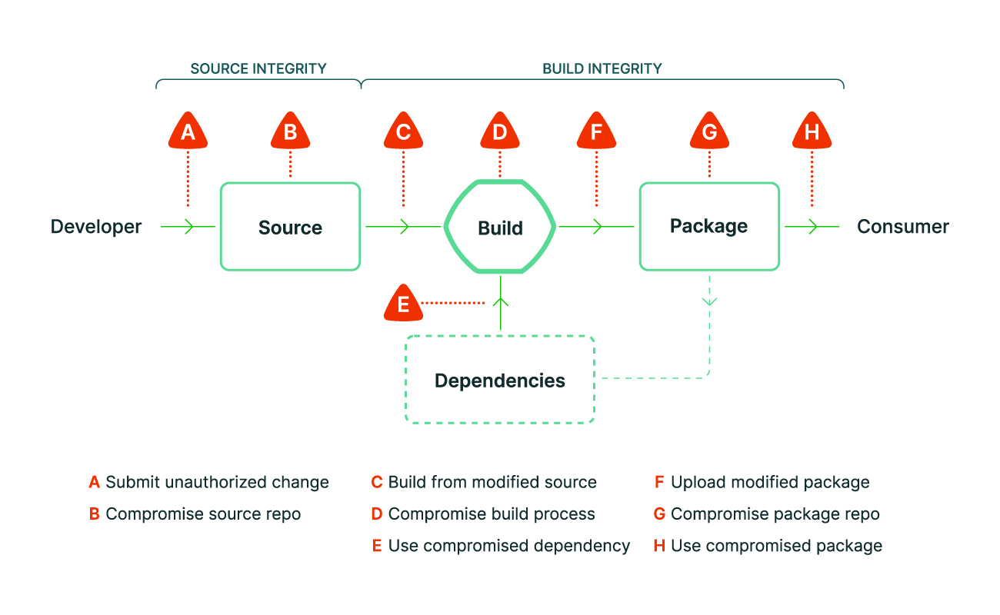

Its rules revolve around the automatic verification of the integrity of the handled data. Some examples of vulnerabilities addressed by SLSA include:

- ensuring that the source code used in software compiling scripts (CI) has not been altered ;
- verifying the origin of development dependencies ;
- ensuring that the software factory has minimal network connectivity.

Based on a team's technical maturity, it's possible to apply SLSA rules across four levels of security and complexity. The idea is to progressively enhance the security of one's software chain over time.

SLSA consists of two parts:

- [requirements](https://slsa.dev/spec/v0.1/requirements): a set of security rules, varying in complexity depending on the desired SLSA level (1 to 4) that an organization aims to achieve
- [threats and mitigations](https://slsa.dev/spec/v0.1/threats): detailing threat scenarios, known public examples, and ways to mitigate them

The FRSCA project[^FRSCAGithub] is a pragmatic example of a software factory implementing SLSA prerequisites. Integrations within GitHub's continuous integration chains, like the "_SLSA Build Provenance Action_", are also available.

SLSA documentation is regularly updated by the community[^GitHubSLSA] and available on its [official website](https://slsa.dev).

#### Software Supply Chain Security Paper (SSCSP)

The _Software Supply Chain Security Paper_ specifications (SSCSP or SSCP) from the renowned _Cloud Native Computing Foundation_ (CNCF) complement the SLSA. Historically, they cover a broader range of topics, but many recommendations overlap today.

Although SLSA offers more interactive, well-illustrated documentation (with examples of tools to use or threats for each rule) and is almost gamified with its "security level badges", SSCSP appears - at the time of this book's writing - to provide a more high-level view of threats within a software chain.

> Author's note: For beginners, I recommend starting your software factory security project with SSCSP, then advancing with SLSA.

This document is also collaborative[^CNCFSSCSPGithub] and broadly belongs to the standards[^CNCFTAGGithub] adopted by the CNCF's Technical Advisory Group (TAG). The TAG writes various reference documents aimed at enhancing the security of the cloud ecosystem[^CNCFTAGAnnouncement].

#### Secure Software Development Framework (SSDF)

The _Secure Software Development Framework_ (SSDF[^SSDF]) is a document drafted by the _National Institute of Standards and Technology_ (NIST) of the _US Department of Commerce_ for all software publishers and buyers, regardless of their affiliation with a government entity.

NIST deserves recognition for the variety and quality of their reports on cutting-edge technologies and techniques. Their works often result from collaboration with numerous institutions and private companies, such as Google, AWS, IBM, Microsoft, the _Naval Sea Systems Command_, and the _Software Engineering Institute_.

More comprehensive than the previous two, SSDF acts as a directory consolidating recommendations from dozens of other _frameworks_ (e.g., SSCSP, OWASP SAMM, MSSDL, BSIMM, PCI SSLC, OWASP SCVS[^SCVS]). It categorizes them into four major themes: preparing the organization, protecting software, producing securely developed software, and addressing vulnerabilities.

The framework lists general concepts progressively associated with more concrete rules. Each theme encompasses broad practices to follow, which in turn include tasks with examples linked to the relevant _frameworks_.

For example, under the "protect software" theme, the "protect all forms of code from unauthorized access and tampering" practice suggests using "commit signing"[^Commit], referencing the SSCSP in its "Secure Source Code" chapter.

This document [can be found](https://nvlpubs.nist.gov/nistpubs/SpecialPublications/NIST.SP.800-218.pdf) on the NIST website. The online library of the Chief Information Officer[^CIOLibrary] (CIO) from the _US Department of Defense_ is also an excellent source of inspiration.

#### The Example on GitHub

GitHub is the most popular code-sharing platform on the Internet. It hosts over 100 million projects with more than 40 million developers contributing to it. As a pillar in the open-source field, it offers security tools natively integrated into its platform.

GitHub's aim is to ensure that securing one's code requires just a few clicks to activate the appropriate tools.

The company made a strategic move by acquiring _Semmle_ in 2019, a tool for analyzing vulnerabilities in code. Since then, it offers several means to secure its codebase:

- **SCA and SAST**: Automated vulnerability analysis tools for the source code and its dependencies (e.g., SQL injections, XSS flaws, configuration errors, and other common vulnerabilities). GitHub also has a _marketplace_ that allows adding code analyzers from third parties. You can add your custom rules by writing _CodeQL_ files. You can deploy these tools on your infrastructure, for instance with _GitHub Code Scanning_ (fig. <spanc/>\ref{fig:code-scanning-github}), _Klocwork_, or _Checkov_.

    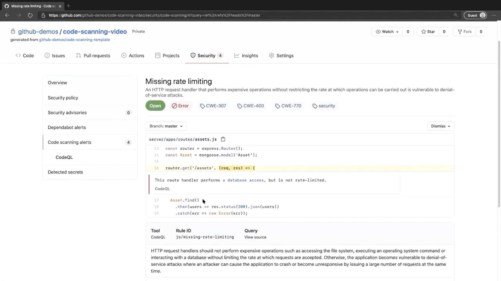

- **Secret Analyzer**: Analyzes, detects, and alerts on potential passwords or _tokens_ inadvertently left in the source code. Open-source alternative: [_Gitleaks_](https://owasp.org/www-community/Free_for_Open_Source_Application_Security_Tools).

- **_Dependabot_**: A dynamic analysis tool for risks associated with used dependencies (e.g., [vulnerabilities, unmaintained libraries, legal risks](https://github.blog/2020-12-17-shifting-supply-chain-security-left-with-dependency-review)). _Dependabot_ automatically opens a code modification proposal (_pull-request_) on the project and suggests updating the dependency or an alternative (fig. <spanc/>\ref{fig:2020_github-dependabot}).

    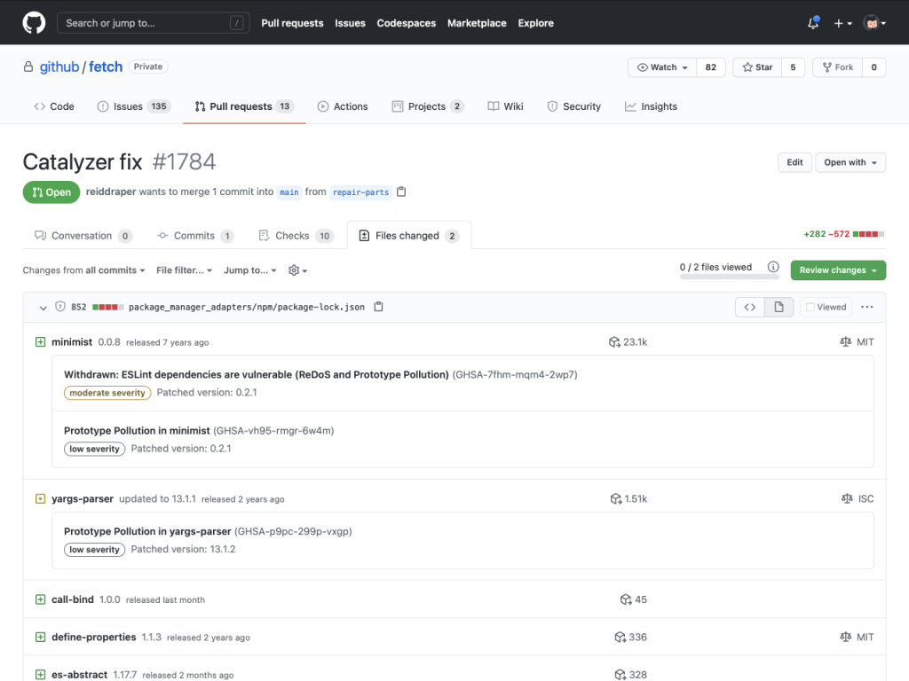

All security flaws related to a project are centralized in an overview, allowing threats to be easily detected and addressed (fig. <spanc/>\ref{fig:2021_github-screenshot-of-security-overview}).


GitHub relies on the international CVEs[^CVE] repository (_Common Vulnerabilities and Exposures_) to recognize vulnerabilities, a list of identified vulnerabilities in IT systems described in a specific format. You can add additional verification mechanisms using _GitHub Actions_, GitHub's continuous integration mechanism.

## Pre-Approved Resources

To mitigate risks, it is possible to base the software developed on pre-approved resources made available to developers. Every external component of the software is checked. This might include Python packages, NPM, Go, or even Docker images that have been analyzed, ensuring no vulnerabilities are present.

This is exemplified by the _Iron Bank_[^IronBankPresentation] service set up by the _U.S. Department of Defense_ within _Platform One_[^PlatformOnePresentationWebsite]. Docker images must undergo a rigorous validation process before approval. These steps [combine manual checks](https://docs-ironbank.dso.mil/hardening/overview/) [with automated ones](https://docs-ironbank.dso.mil/hardening/justifications/), but initially, only automated procedures may be employed. Manual actions are necessary to justify adding a new image. This is what _Platform One_ teams call "continuous accreditation of approved images"[^IronBankHardeningOverview] (fig. <spanc/>\ref{fig:continuous-accreditation-approved-images}).

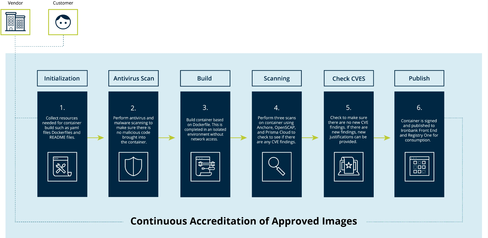

In organizations dealing with highly sensitive data (i.e., data that can jeopardize a country's security or credibility if disclosed), the default policy is to authorize only the use of pre-approved libraries and images (_hardened images_). However, consider the impact of such a choice on development velocity. Ensure your security and SRE teams can keep up with the provision of libraries.

Since it's nearly impossible to manually analyze each development library to ensure it's flawless, software factories can rely on file signatures. Trusted editors sign each of their libraries[^GitlabSigningProcess], so continuous integration pipelines or system administrators can verify it hasn't been altered during transfer. Each trusted editor issues a certificate that the SRE team can integrate into its continuous integration pipelines to ensure downloaded packages haven't been tampered with.

A simpler method is to use only the hash key of files. Each file is identified by a character string called a _hash_, which the computer can easily compute.

> Example of a _hash_: _a21c218df41f6d7fd032535fe20394e2_.

If, during installation, the downloaded dependency has a different _hash_ from the reference one (obtained online from the publisher's website), the software launch is denied. This mechanism is mostly already implemented by programming language package managers (e.g., `package-lock.json` for NPM, `poetry.lock` for Python).

## Managing Infrastructure through Code

Humans are the primary vector for security risks[^HumanErrors]. To minimize errors or deliberate system compromises, modern infrastructures are deployed as "code".

This means that for everyday infrastructure operation (except in emergencies), every administrative action is coded, published, and verified in the software factory before deployment. This allows for standardizing, documenting, replaying, and optimizing administrative actions over time.

The field encompassing production management techniques through code is commonly called _Infrastructure as Code_ (IaC). This concept and its relevance are described in the "[Infrastructure as Code](#infrastructure-as-code-iac)" chapter.

Figure <spanc/>\ref{fig:ansible-iac-playbook-example} shows an example of a configuration in code form, which updates the time zone and time of machine `prod-fr-zone-c-server-18`.

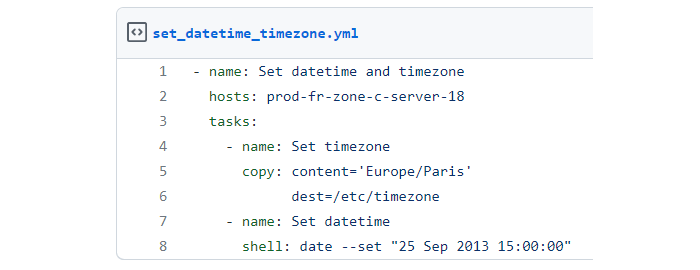

The above example is simple, but IaC can describe how machines can be instantiated and configured. An IaC setup can fully configure a machine from scratch (network settings, security certificates, adding users, printer drivers installation, browser favorites setup, etc.). The idea, once again, is to minimize human intervention to avoid mistakes.

## Fundamentals of _Zero Trust_ Network Architecture

The _zero trust_ concept can be summarized in one phrase: "Never trust, always verify." This practice has become imperative, with 55% of companies reporting having implemented a _zero trust_ initiative in 2022, up from 24% in 2021[^OKTAZeroTrustStudy].

Traditionally, network security was based on defining a "trusted perimeter" drawn around an organization's software and data. Various tools and technologies were then implemented to protect them. This network architecture, also known as "_castle-and-moat_"[^CloudflareCastleAndMoat] or "perimeter-based," assumed that any activity inside the perimeter was trustworthy and by reciprocity, any activity outside it was not (e.g., network access via a VPN or based on a machine's MAC address).

_Zero trust_ assumes that no user is "trusted" by default, whether inside or outside the perimeter. Users must be authenticated and authorized to access data and software. Their activity should be monitored and recorded. This approach is more effective at defending information systems against sophisticated attacks, as it doesn't assume that all activities inside the perimeter are trustworthy. This network security model has especially evolved due to the massive shift to remote work[^BCPANDRHStudyTeleworking].

Consider an example: Sophie is a colleague you've known for 3 years. She badges in every day and settles at her workstation. Days later, you learn Sophie was terminated a month ago. She might have accessed strategic company information, which she could use at her new job in a competitor company. Merely being "used to" seeing an employee allowed the company's precious information to be stolen. With _zero trust_ technologies providing centralized access management, Sophie couldn't have logged in.

Three pillars constitute a _zero trust_ network architecture (fig. <spanc/>\ref{fig:zero_trust_schema_msft}):

1. **Identity**: Identify the user
   - _Identification_: Who are you?
   - _Authentication_: Are you who you claim to be? (e.g., two-factor authentication _2FA_)
   - _Authorization_: Are you allowed to access this resource?
2. **Context**: How the user tries to access the resource
   - _Least Privilege Principle_ or _need-to-know_: Grant resource access only as necessary (e.g., hide inaccessible apps/data sources, set access expiration dates)
3. **Security**: The hardware through which the user connects
   - Machine Security: Ensure the connecting machine meets security requirements (e.g., an active antivirus or an updated OS)

.\label{fig:zero_trust_schema_msft}](./images/zero_trust_schema_msft.jpg)

In _zero trust_, each request involves a fresh security check. The trust broker or CASB[^CASB] verifies these criteria (e.g., _OpenID_, _Active Directory_, _PKI_, _SAML_).

CASBs are integral to technologies known as "_Zero Trust Network Access_" (ZTNA) in implementing _zero trust_ architecture. _Cloudflare_, _Cato_, _Fortinet_, and _Palo Alto_ are examples of ZTNA technologies[^ZTNA]. Think of them as advanced proxy servers that continuously check multiple security criteria set by your organization. If you're looking to adopt _zero trust_, refer to the SASE framework[^SASE].

Because of the many tools involved, setting up a _zero trust_ model is less straightforward than perimeter-based security but overcomes its limitations[^ANSSIZeroTrust].

Beyond the pressing need to bolster resource access security, _zero trust_ architecture offers peace of mind from a secured infrastructure. It simplifies device and network equipment administration (centralized management of network flows and access rather than configuring each device), reduces costs (maintenance time, shared machines), and standardizes identity and user rights management interfaces.

Technological innovation demands swift adaptation. _Zero trust_ enables organizations to quickly and securely adapt to environmental changes without revisiting their security stance.

Reference documents such as Google's _Beyondcorp_ research paper[^Beyondcorp], NIST's publications[^NISTZeroTrust], or the _US Department of Defense_'s papers[^CNAPDod] provide specifications for deploying state-of-the-art zero trust networks.

## _Zero Trust_ Based Development

In the context of a Research & Development (R&D) environment, the topic becomes more intricate. To remain innovative, your teams require flexibility. They make use of cutting-edge libraries, install the latest GPU drivers for _machine learning_ experiments, and even test the performance of their software, fully utilizing the resources of their machines.

In essence, your teams need complete access to their machine's configuration for effective development.

However, as mentioned earlier, the third rule of a _zero trust_ architecture is to ensure the user's machine is secure. If you grant a developer administrative rights, they might be tempted to disable their machine's security settings. So, what's the solution?

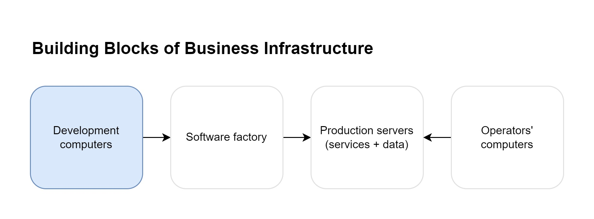

<!-- markdownlint-disable MD037 -->
Development workstations (fig. <spanc/>\ref{fig:security_parts_software_delivery}) are a unique component of our _zero trust_ infrastructure. They entail integrating external resources into the company's infrastructure. At the same time, the software factory's source code or the company's data is copied onto these machines. With libraries downloaded carelessly or code editors with unchecked extensions, there's an added risk of data leakage outside.
<!-- markdownlint-enable MD037 -->

We are faced with a dilemma here. We can choose to grant our developers full permissions, but risk them disabling our security measures. Alternatively, we can limit these permissions, potentially slowing down their development velocity and ability to innovate, while also needing to invest more time in training them for an unconventional work environment (since it's controlled).

Several factors should be considered:

- Is the physical security of your installations guaranteed? (Are machines intended to leave your offices? Do outsiders have access to these machines?)
- Have your staff undergone a security clearance?
- Is your infrastructure connected to the Internet?
- Does your infrastructure have high bandwidth?
- Is your infrastructure prone to frequent disconnections?
- Is the data being handled massive in volume?
- Could the data harm the organization if disclosed?
- Can you provide machines for your employees?
- Do you have teams capable of administering these machines? (Favor Cloud solutions over _on-premise_ solutions)

There are several ways to address development environment challenges. Here are 6, categorized by user flexibility, implementation complexity, and associated risk:

1. _BYOD_: _Bring Your Own Device_. The user uses their computer and means for development. You have no control over the machine.
   - Case 1: You hire a remote freelancer.
   - Case 2: You lack the resources or time to manage a fleet of machines.
   - Note: Only give the user the bare minimum access they need to work effectively (e.g., limited access to codebase, data).
2. Semi-controlled machines. A specific user has administrative rights on their machine, while others don't.
   - Case: You provide workstations, have taken initial security steps, but can't offer an alternative.
   - Note: Preferably, always keep the machine within the company premises.
3. Fully controlled machines with ephemeral cloud development environments like CodeSpace[^CodeSpace], Coder[^CoderCloud], or Eclipse Che[^EclipseChe].
   - Case: You provide and configure network-connected workstations.
4. Fully controlled machines with remote development VMs (e.g., Shadow[^Shadow], Azure VM).
   - Case: You have access to a remotely manageable cloud infrastructure by a trusted third party.
   - Example: In 2014, Sogeti announced the creation of OneShare: a DevOps platform allowing engineers to create development and testing environments on VMs based on templates (including development tools)[^SogetiDevOpsMicrosoft].
   - Note: Ideally, these VMs should include development tools. This method is suitable if your VMs have internet access for data transfers and if your stations are fiber-connected. Otherwise, this setup is strongly discouraged.
5. Fully controlled machines with local development VM.
   - Case: Your activity requires engineers to have high autonomy (e.g., latest GPU libraries, IoT, R&D), but the company handles critical data with high-security needs.
   - Note: Aim to create VM images pre-configured with development tools, preventing your team from wasting time on setup. Ensure a shared folder exists between the host and VM for faster data transfers.
6. Fully controlled and equipped machines.
   - Case: Your activity requires engineers to have high autonomy (e.g., latest GPU libraries, IoT, R&D), without being constrained by intermediary tech layers (VM), but the company deals with critical data and has high-security needs.
   - Note: This practice is not recommended unless you have a dedicated, sizable team to maintain this infrastructure regularly (e.g., Google). In terms of security, consider, among other things, controlling the extensions used by your IDE[^IDE].

| Method                                                  | Flexibility  | Complexity                  | Risk        |
| ------------------------------------------------------- | ------------ | --------------------------- | ----------- |
| _Bring Your Own Device_                                 | Maximum      | None                        | High        |
| Semi-controlled machines                                | Maximum      | Rather Low                  | Medium      |
| Fully controlled machines with cloud dev. environment   | Medium       | Medium (_Codespaces_) to High (_Coder_) | Low        |
| Fully controlled machines with remote dev. VM           | Medium       | Medium                      | Low         |
| Fully controlled machines with local dev. VM            | Fairly High  | High                        | Very Low    |
| Fully controlled and equipped machines                  | High         | Very High                   | Very Low    |

The more you want to reduce risk while increasing flexibility (boosting security while promoting innovation), the more your infrastructure teams will have work or incur costs (e.g., outsourcing). Consider the factors inherent to your organization and its operating mode to choose the solution that best fits it.

## Protecting Your Secrets

Administrators of an infrastructure regularly handle "secrets": passwords or _tokens_. It's common to exchange them among administrators. In other cases, we might need to share an account password with the relevant person. Password managers are a great way to centralize and share these resources.

You can manage your passwords in them and share them granularly with other users. Each user has their own account to access the secrets they have the right to see. It is recommended to use them as much as possible.

Working on a network allows you to use these tools. Here are some collaborative password management services: Vaultwarden, Bitwarden, Lastpass.

## A foundation for your resilience

The foundation of an IT infrastructure comprises the set of technologies that allow software to be deployed on it. Typically associated with it are core services essential for the proper functioning of the infrastructure: a PKI[^PKI], a centralized authentication server (e.g., LDAP), an NTP time server, or an _Active Directory_[^ActiveDirectory].

For engineers responsible for deploying software, the foundation provides common services to avoid deploying them with each piece of software. With these services centralized, administrative tasks are simplified. In a Cloud foundation, this concept is extended beyond a traditional foundation. This is made possible by the use of standardized technologies that simplify interactions with deployed software (e.g., Docker containers, Kubernetes).

Let's compare a traditional foundation with a Cloud foundation to better understand the latter's added value.

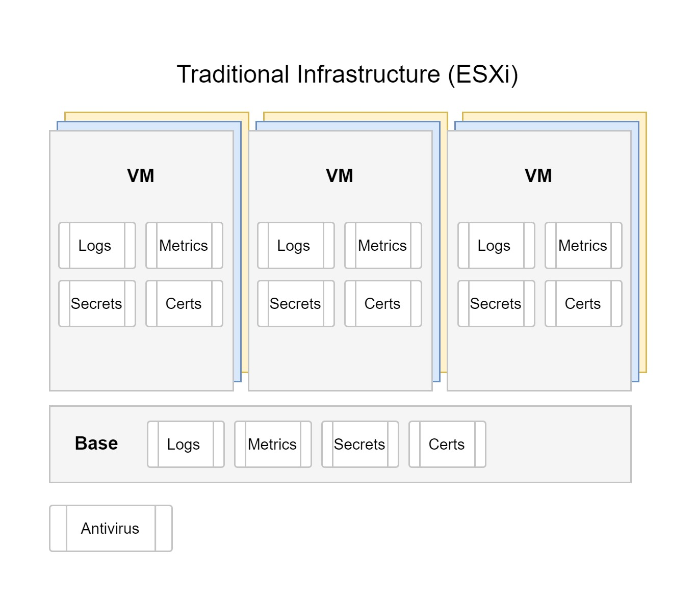

In a traditional foundation (fig. <spanc/>\ref{fig:illustration_socle_esxi}), a virtual machine (VM) is assigned to each software to logically isolate it. Each software manages its own logs, certificates, secrets, and generates its own metrics. The foundation might host services centralizing this data, but the software developer would then have to modify their code to comply with the foundation's services.

The robustness of this type of foundation is well-established and is still widely used today among major institutions. The isolation is highly effective.

However, the maintenance needs for this kind of foundation increase proportionally with the number of deployed software. Each software comes with its installation instructions, supplemented by foundation compliance documentation. Installation and configuration are often manual. As organizations tend to install more and more services over time, to continue meeting business needs.

In summary, here the deployed software is forced to adapt to the foundation. This generates technical debt. Moreover, centralized foundation services, like those for logs or metrics management, might not always exist.

This type of foundation is effective with a reasonable number of deployed services, but it doesn't scale easily without proportionally sized HR.

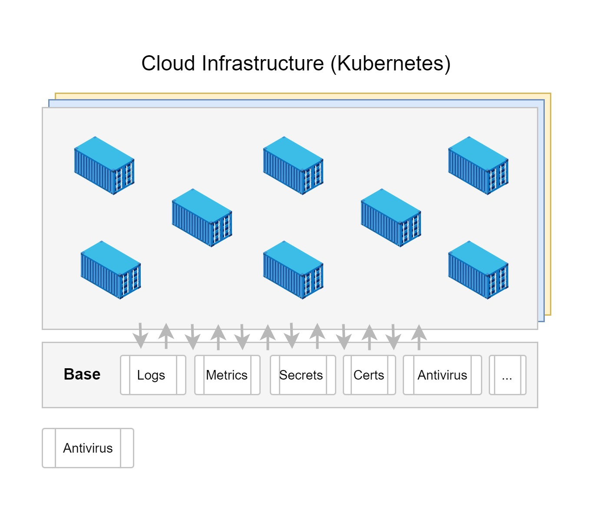

In a Cloud foundation (fig. <spanc/>\ref{fig:illustration_socle_kubernetes}), the interaction between deployed software and the foundation is inherently stronger. Standardized container interfaces allow foundation services of an orchestrator (e.g., Kubernetes) to "connect" to it, while still maintaining logical resource isolation[^ANSSIContainerRecommendation].

For instance, application logs or performance metrics can be automatically retrieved and stored in a centralized tool, then set up with alerts. An antivirus that continuously checks for threats in a container can be installed. Kubernetes' _sidecars_[^sidecars] mechanism makes these capabilities possible.

Data flows between containers can be encrypted by default (use case: two services running on different servers). Secrets (passwords, tokens) can be supplied by the foundation without an administrator seeing them. Persistent data (volumes) are managed uniformly, and backups can be automated.

The benefit of this kind of foundation is that it integrates all these services automatically, without ever touching the application code, nor even requiring the integrator to know about your infrastructure. Thus, you are guaranteed that all deployed software conforms to your monitoring and security requirements. It's the foundation that adapts to the deployed software.

Installation mechanisms standardized by Kubernetes (e.g., Kubernetes manifests, Helm[^Helm]) require just a few commands for software deployment. Kubernetes will automatically instantiate new containers or nodes if user load is too high. We will discuss the technical aspects of these technologies in the chapter "[Extensions to simplify infrastructure](#extensions-to-simplify-infrastructure)".

If your organization consists of staff already trained in ESXi technologies, or if your organization's SSI rules are not ready for a Cloud foundation, it's still possible to set up a Kubernetes cluster on your traditional ESXi infrastructure. This could be considered in a transformation plan, at the cost of temporarily increased technical debt while your historic teams get trained in Cloud technologies.

In terms of security, containerized technology interfaces are standardized. It's no longer about checking the container's contents since the infrastructure takes care of it. It's about ensuring the security of containerization technology (e.g., Docker, CRI-O), as well as orchestration technologies (e.g., Kubernetes, Rancher, OpenShift).

For example, have you ensured that _Microsoft Word_ is secure through [certification](#qualification-certification-and-approval)? However, every _Word_ file doesn't need to be certified separately. It's the same for a containerized application: whether coded in Python, Go, PHP, or embedding the latest libraries, it's the container running it that needs certification.

In conclusion, treat your foundation as a product serving your engineers. The more you centralize and automate the use of this foundation's services, the less technical debt you'll have to maintain (see chapter "[Leveraging automation](#leveraging-automation)"). Ultimately, this effort results in better service availability for your customers.

## Abandoning VMs?

With microservices at the heart of Cloud DevOps infrastructures, containers seem like the ultimate deployment solution. Virtual machines become redundant, as orchestrators (e.g., Kubernetes) can be installed directly onto the machine. This is referred to as a "_baremetal_" installation. However, during a transformation, it's imprudent to outright discard VMs.

There are rare cases where you can overnight shift from your existing production infrastructure to a cloud setup. If your teams are accustomed to managing VMs, they need time to familiarize themselves with these new technologies. Similarly, applications require time to migrate to a compatible format.

To progress, set a goal to reduce VM usage. For example: "In 1 year, at least 80% of our software should run in containers" Or: "Any new software must be containerized for deployment". This involves setting up the prerequisites mentioned in the "[Prerequisites](#prerequisites)" chapter, as well as implementing DevOps tools: a software factory, container image registries, and a containerized deployment environment.

Here are several complementary situations where VMs remain valuable:

- Legacy or critical software of your company cannot be deployed as containers ;
- The industry partners you work with aren't yet using containers ;
- Your IT security rules force you to use a specific operating system[^OS]. To save time on making your installation compatible with this OS, you might install virtualization software (e.g., KVM) to use the OS of your choice and kickstart your DevOps infrastructure setup in a familiar environment ;
- Infrastructure installation scripts are intended to be shared with various entities. In some cases, these entities may have strict security rules demanding the use of VMs ;
- If you don't have a dedicated machine to deploy your infrastructure, VMs can be helpful to separate new software from existing installations. Similarly, if you have limited resources, VMs can isolate the workload brought by your DevOps software chain ;
- As long as your teams aren't ready for a 100% cloud shift, the backup/restore process for a VM might be simpler to handle.

However, remember that maintaining this abstraction layer (VMs) to solely manage Kubernetes on top adds complexity to your infrastructure. As practices evolve in your organization, consider removing these layers. But maintain the flexibility to instantiate them when necessary.

Within a Cloud DevOps infrastructure, tools like _KubeVirt_ or _Virtlet_ can be used to spin up VMs within a Kubernetes cluster. This can facilitate a smooth migration of your legacy applications while getting your teams hands-on with cloud technologies. More visual tools like _OpenStack_ can also assist the transition to this ecosystem, more seamlessly than the traditional command lines in a terminal.

## Open-source: Risks and Strategic Advantages

Open-source technologies represent 77% of the libraries used in proprietary (or "_closed-source_") software[^SoOSS2022]. Among the top 100,000 websites, Linux - an open-source operating system - is used in nearly 50% of cases.

A European Union report[^EUOSSReport] states that in 2018, contributions from Europeans to GitHub - the world's largest open-source contribution platform - equated to 16,000 full-time positions. That's close to a billion euros for companies in Europe. These contributions offer a cost/benefit ratio of 1 to 4, allowing businesses to remain cutting-edge, develop quality code, and reduce maintenance efforts.

For instance, software like the _Firefox_ browser, the _Python_ programming language, or the _Android_ operating system wouldn't exist without open-source. Even the proprietary software icon, Microsoft, began its open-source contributions to the Linux kernel in 2009. In 2014, its new CEO, Satya Nadella, proclaimed, "Microsoft loves Linux"[^MicrosoftLovesLinux]. Despite criticism[^GithubMsftAcquisitionCritics], the company even acquired _GitHub_ in 2018 and seems to continue delivering satisfaction to the community[^GithubFollowingMsftAcquisition]. They continue contributing to numerous open-source projects listed on _opensource.microsoft.com_.

However, where the use of open-source in the private sector is a no-brainer, technical teams in large organizations sometimes face skepticism from wary project managers. These teams are challenged regarding their use of open-source technologies based on security concerns.

Such skepticism isn't without merit. The idea of importing a third-party library into one's IT system without examining its contents can seem risky. Potential risks include:

- A library that arbitrarily deletes data ;
- A library transmitting data to a remote server (software data, telemetry) ;
- An updated library that no longer works (due to bugs or deliberate sabotage: see _protestwares_[^Protestware]) ;
- Legally, the use of open-source tech might be governed by license terms (e.g., prohibiting selling software developed using the library).

So, it's about striking a balance between the productivity provided by open-source libraries/software and the trust we place in them (security).

Yet, it's a mistake to believe that simply buying software will ensure its security[^DependencyConfusion]. Although responsibility is outsourced, the damage, if it occurs, is done. Google's engineering heads predict that by 2025, 80% of businesses will use open-source technologies maintained by salaried individuals[^CuratedOpenSource] (e.g., _[GitHub Sponsors](https://github.com/sponsors)_).

Historically, the official policy for approving certain libraries went through a certification cycle, aimed at mapping the risks associated with using a technology to decide whether to accept it. This decision could be supported by a code audit.

For proper protection, maintain an active and systematic watch for security threats introduced into the code. In DevOps mode, your software factory is equipped with tools to detect dependencies or malicious code. You minimize risks by securing your software chain (see chapter "[Securing Your Software Chain](#securing-your-software-chain)" and job sheet "[IT Security Engineer](#devops-security-engineer)").

For example, if you can't set up a secure software forge yourself, you can use _GitHub_ features (see chapter "[Example on GitHub](#example-on-github)"). More broadly, security practices at GitLab[^SecurityPracticesGitLab] are a great starting point.

Joining a _bug bounty_ platform is common among large enterprises, both to analyze their websites or the open-source software they use[^BugBountyLinuxKnl]. A _bug bounty_ system rewards individuals for identifying vulnerabilities, aiming to detect and fix vulnerabilities before they're exploited by malicious hackers. Popular platforms in this area include _Hackerone_, _Bugcrowd_, _Synack_, and _Open Bug Bounty_.

Finally, major tech companies often release new software as open-source. These quickly become standards used by tens of thousands of developers worldwide. This facilitates the onboarding of engineers to their technologies without incurring training costs. These companies thus find themselves with candidates already proficient in their technologies.

Far from benefiting only these companies, this practice benefits the entire sector, which now has a pool of candidates familiar with the same tools and practices.

## Assessing security and training

To excel in system resilience, as in any field, training is necessary. That's why one of the recommended practices in SRE (Site Reliability Engineering) is to train to handle incidents. The objectives are as follows:

1. Assess the quality of incident response (speed, detection tools, clear and easily accessible resolution guides, functional production tools) ;
2. Evaluate the resilience of the infrastructure (automatic infrastructure mechanisms to resolve production outages) ;
3. Train engineers to better understand their infrastructure and the tools at their disposal to respond to incidents.

To ensure that its teams are well organized in case of an incident, Google has designed two types of training[^SRETrainingsGoogle]. The goal is to reduce the _Mean Time To Mitigation_ (the average time to resolve an incident, cf. chapter "[Measuring the success of your transformation](#measuring-the-success-of-your-transformation)"), which would impact the company's service contracts.

1. DiRT (_Disaster Recovery Testing_): a group of engineers plans and causes an actual failure over a defined period to test the effectiveness of its incident response. It is recommended to perform these trainings at least once a year on your critical services ;
2. The Wheel of Misfortune: a fictional scenario drawn at random, in the form of a role-playing game similar to _Dungeons and Dragons_, where a team of engineers faces an operational emergency. They interact with a "game master" who invents consequences for the actions that the engineers announce they will take. Engineers take this opportunity to review their incident investigation procedures. This practice is particularly useful for newcomers but requires that the game master be particularly experienced (cf. Pavlos RATIS's GitHub project "[wheel of misfortune](https://dastergon.gr/wheel-of-misfortune)"[^pratiswomgithub]).

Amazon Web Services (AWS) offers a similar approach named _Game days_[^AWSGameday] to Google's _Wheel of Misfortune_. The company lists its critical services and the threats that can be associated with them (e.g., data loss, overload, unavailability) to determine a "disaster" scenario. Subsequently, the idea is to provision an infrastructure identical to the production and cause the desired failure. It then observes how its teams and production tools react to the incident.

These trainings are more commonly called _fire drills_. Again, their goal is to practice incident response in an urgent situation. During these trainings, someone should note any incomplete or missing elements in existing procedures or tools, with a view to improving them.

Netflix goes even further with its tool _Chaos Monkey_ which automatically, randomly, and at any time stops production services. The goal is to ensure that customers continue to have access to Netflix, even with one or more internal services down. Their tool _Chaos Gorilla_ even goes as far as simulating the shutdown of a complete AWS region (e.g., a datacenter that would be taken out of service) to observe its consequences on the platform's availability. These practices are part of what is called _chaos engineering_.

Finally, apart from [audit software](https://www.tecmint.com/scan-linux-for-malware-and-rootkits) that can detect some vulnerabilities (e.g., [_Lynis_](https://cisofy.com/lynis/), [_Kube Hunter_](https://github.com/aquasecurity/kube-hunter)), there are other exercises for your security and SRE teams to practice.

The most popular way to assess the security of your infrastructure is the "blue team / red team" exercise. Inspired by military training, it consists of a face-off between a team of cybersecurity experts trying to compromise an information system (the _red team_), and the incident response teams (the SREs, the _blue team_) who will identify, evaluate, and neutralize the threats. The idea is to avoid relying on the theoretical capabilities of your security systems, but to confront them with concrete threats to assess their usefulness and weaknesses. Variants exist with a _purple team_, a _white team_, or even a _gold team_. But start by setting up a simple scenario. For example: one of your developers who introduces a Docker image or tainted code.

This topic is vast and practices vary depending on the size of the organization you are employed in. This chapter gives you some references to start your training practices. Structure them subsequently according to your objectives and resources.

# The Pillars of DevOps in Practice

Here we reach the heart of the matter. In this chapter, we will discover the different pillars of DevOps, describing the various practices and technologies that can meet our challenges.

In terms of organization, see DevOps as a way to apply "healthy pressure" on your teams, encouraging everyone to move in the same direction. It is about optimally communicating everyone through standardized technical tools.

## Breaking Down Organizational Silos

The desire to eliminate silos within an organization is a common mistake. Let's see it differently: a silo is a concentration of knowledge; it's expertise.

It's fortunate that your organization has silos. For instance, they might consist of experts in organic chemistry, experts on the political science of a specific world region, or masters of a particular technology.

The creation of a silo is often essential to cater to an expertise requirement. This silo becomes necessary because this specialized expertise requires a structure tailored to its tasks (specialized tools and practices, advanced machinery, specific standard rooms). The key is to have tools and practices to let this silo communicate with the rest of your organization.

Undesirable silos emerge when the company doesn't provide teams with the tools they need to work effectively. Individuals then take initiatives to find more efficient alternatives. This is a predictable "immune" response when employees face deteriorating work conditions.

For instance, your expertise center is aging and doesn't renew its tools. Faced with an ever-increasing workload and the company's inaction, long-standing employees become frustrated. Some become disheartened at the thought of discussing issues with unresponsive managers. Others try introducing new practices but face outright refusals. Then, new employees join and find that their working conditions are below expectations. Knowing of an extremely efficient software, one new employee introduces it. Its compelling efficiency makes it popular and spreads throughout the center and then the company. Of course, the employee won't discuss this with the management, risking criticism and potentially having this new tool banned.

Due to the management's failure to anticipate decline or heed internal feedback, they initiate a transformation project. Concurrently, the isolated initiative, undertaken without informing management, leads to scope conflicts and unclear objectives. Management becomes increasingly disconnected from their teams, unaware that they've adopted new practices. The lack of communication with other employees and duplicated efforts become noticeable. This is the result of a lack of overall coherence—a fertile ground for resistance to change in the face of the leadership's belated reaction.

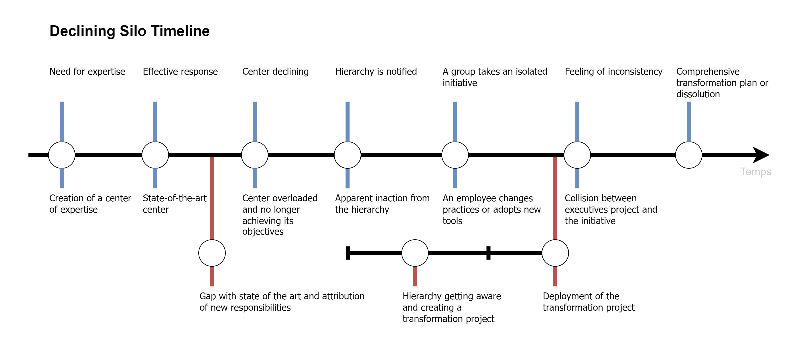

To prevent the decline of a silo that would spread company-wide (fig. <spanc/>\ref{fig:2023_cycle_silotage}), there needs to be effective communication among these silos (the Executive Committee, expertise centers, teams, etc.). Management must provide tools to ensure the entire company speaks the same language. They should also instill a shared vision, allowing teams to collaborate towards a unified goal.

The DevOps movement believes in using common methodologies and tools to facilitate these exchanges. This chapter outlines the methodologies to adopt to achieve this objective.

### Mapping the existing

To achieve a successful transformation, one must have a comprehensive view of the starting environment. Mapping it is a vital step that lets you understand the reality you're operating within and gauge the investments required.

Your environment's map should answer the following questions:

- **What are the company's mission(s)?**: This might seem basic, but not all organizations clearly define this goal. Ensure you understand the company's objectives, i.e., the problems it addresses. Clearly grasp its _business model_ to better formulate your transformation plan.
- **Is there an existing strategy?**: What directions were given during the last transformation, and what can you learn from them? You might need to adjust your plan according to an already-implemented strategy or start afresh or in isolation (see chapter "[How to convince and keep faith](#how-to-convince-and-keep-faith)").
- **Which teams are working on which mission?**: List the existing teams in the organization and their contacts: whom do they serve? Who do they need? Perhaps some teams aren't collaborating with those they should be or can't communicate effectively.
- **What kind of profiles exist in the teams?**: List the number of employees and their expertise. Maybe there's a _data scientist_ in one team who'd be more valuable elsewhere (but be careful with such moves, see chapter "[Chronic reorganizations](#chronic-reorganizations)"). Perhaps there are too many project managers and not enough software engineers. Maybe the company doesn't yet have the profile you need.
- **How do teams exchange information?**: List their communication tools. Some employees might be using the new internal cloud service implemented recently, while others might still rely on email.
- **Which teams have access to which data?**: List team data access. Are there silos where teams hoard information? Is there an inadequately monitored database risking data leaks? Is a data source especially used or strategic?

By having a clear, substantiated overview of how the company is organized, you'll pinpoint critical areas to address. Use this document as your starting point and iterate on actions to take.

### A Unified Network

Imagine for a moment data-scientist teams within each of your organization's offices. Fantastic! Every department has dedicated technical support to process their data. However, soon these teams of engineers begin communicating and realize they are working on the same topics. They notice they're developing the same things. This is frustrating for them, but it primarily means the company is wasting money.

If no one is aware of what the other is working on, efforts will naturally be duplicated. In large organizations, needs are often systemic: offices encounter the same problems with minor variations. Technical solutions can often address these problems in 90% of use cases.

By working on a unified network, all your documents and data are shared. Gone are the questions like "Has the Marketing department provided all the stats?", "Where's the latest version of this presentation?" or "Where is the procedure to apply for holidays?". Everyone virtually works in the same place. No more wondering whether a folder's content is up-to-date.

Engineers can share technical environments instead of redeploying infrastructure in every office. For instance, there's no need to duplicate a mirror of development libraries on two machines a few offices apart. For _machine learning_, a network allows for the shared computational power by utilizing resources from a central supercomputer.

In many large organizations, the main obstacle to adopting internally developed software is the network they're deployed on. Teams are forced to deploy on a different network from the departments due to information systems security concerns.

To make their software accessible on the departmental network, validation is often required. For any developed software, this process can take several months to a year. If these teams deploy dozens of updates every day, enduring such delays is impractical (see chapter "[Security: a new paradigm with the DevOps approach](#security-a-new-paradigm-with-the-devops-approach)"). In the end, the users you have the least time to assist will abandon your tools because the time irritant will become too significant for them.

Using a unified network is key in adopting your new tools. It allows your organization to save money, and your collaborators to be less frustrated by delays.

In the next chapter, we will see how a software factory is organized and how, thanks to a unified network, it greatly increases the productivity of the organization.

### The lifecycle of modern software

#### Software factory

The software factory is at the heart of your DevOps infrastructure. This is where your engineers will spend most of their time: if they're not coding in their IDE[^IDE], they will be managing their projects in the software factory.

A software factory consists of a software forge and services allowing your engineers to develop and deploy software on your infrastructure: container image registries, dependency mirrors, artifact/binary repositories (see Nexus[^Nexus], Artifactory[^Artifactory], Distribution[^Distribution]). Nowadays, most of these features are directly available within software forges.

The most popular software forges are GitLab and GitHub. GitLab is more commonly found in large organizations since it is simply and freely deployable on isolated networks. Other platforms like Froggit[^Froggit], Gitea, and Bitbucket also exist.

As we will see in the chapter "[GitOps](#gitops)", in DevOps, all software source code and all production configurations are stored as code within a software forge. It's thus said to be the "single source of truth" of your infrastructure.

Without a software forge, development teams would each work in their local folder and exchange code via network folders or USB sticks. This would waste significant time when merging code from multiple different contributors and would create numerous security issues. Needless to say, there's no way to trace actions or recover files in case of accidental deletion. Additionally, project management teams would be entirely left out of the software development cycle.

The most popular software forges rely on the _git_ technology[^git], allowing for tracking every contribution. Thanks to _git_, it's possible to know who made which change and when. You can track the history of contributions and easily manage merging these contributions. We will delve deeper into these mechanisms in the [next chapter](#gitops).

Today, development, sysadmin, InfoSec, and _management_ teams collaboratively work on such platforms, capitalizing on:

- The list of features to develop for software (tasks, priorities, deadlines... see agile methodology) ;
- Discussions on designing a feature (comments in tasks) ;
- User and technical documentation for software ;
- Software source code ;
- Infrastructure documentation ;
- Infrastructure administration scripts ;
- Security rules (see chapter "[Continuous integration and security](#continuous-integration-and-security)") ;
- Software quality rules.

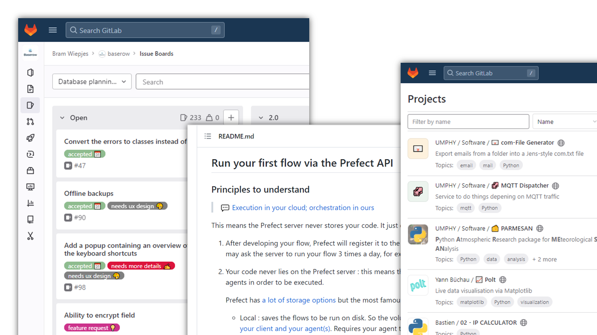

The goal is to store as much knowledge as possible in one place, ensuring the most up-to-date documentation is always consulted (fig. <spanc/>\ref{fig:gitlab_github_illustrations_screenshots}).

_git_ is a means to consider for capitalizing on guides, tutorials, and even administrative procedures for my teams. If someone spots an error or outdated information in documentation, they can directly suggest the modification in _git_ to keep the document current.

Teams adopting DevOps are replacing traditional _Word_ or _Excel_ with _Markdown_ (the format for documentation in _git_ projects). This format, designed to be intuitive for both humans and machines[^Markdown], is independent of any proprietary technology (e.g., _Microsoft Word_).

It's even possible to create presentations in code form. These can be viewed in a simple browser (e.g., [Markdown-Slides](https://github.com/dadoomer/markdown-slides)[^MarkdownSlides] (fig. <spanc/>\ref{fig:markdown-slides-browser}), [Slides](https://github.com/maaslalani/slides)[^SlidesProject], [Remark](https://github.com/gnab/remark)[^Remark], [reveal.js](https://github.com/hakimel/reveal.js)[^RevealJS]).

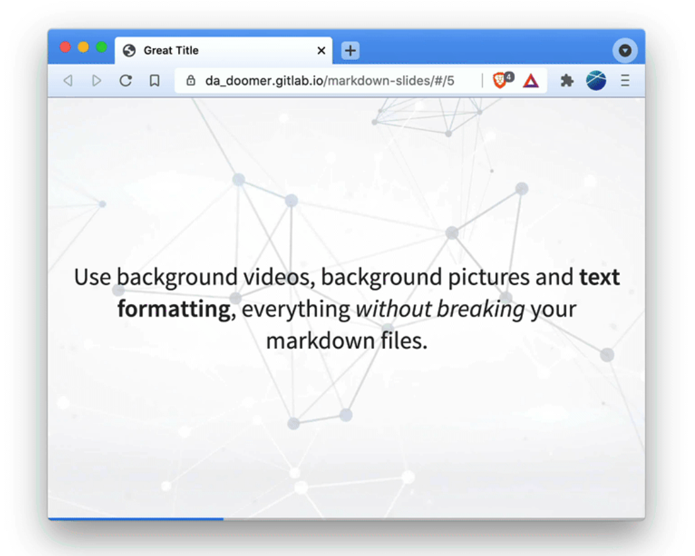

Conversely, _git_ is not designed to store large files. One should avoid storing large images, videos, binaries, or archives in it. Other technologies can store these types of files (see [Amazon S3](https://docs.aws.amazon.com/AmazonS3/latest/userguide/Welcome.html)[^AmazonS3], [Minio S3](https://min.io/)[^MinioS3], [HDFS](https://hadoop.apache.org/docs/r1.2.1/hdfs_design.html)[^HDFS], [CephFS](https://docs.ceph.com/)[^CephFS], [Longhorn](https://longhorn.io/)[^Longhorn]) with or without a reference to a _git_ project (e.g., [DVC](https://dvc.org/)[^DVC]).

However, the software factory is not just about capitalizing knowledge. It also serves as a control point for all contributions. An initial level of control is established by adding users to projects they have permission to contribute to.

But a second level of control can be set up: through continuous integration mechanisms (see chapter "[Continuous Integration](#continuous-integration-ci)"), automated scripts can validate a contribution based on rules defined by your organization (software quality, SSI compliance). If the contribution doesn't meet your standards, it's rejected. The contributor sees it instantly, knows why, and can suggest a correction within minutes.

Since software factories can manage access to resources based on a user's profile, it's entirely possible to open yours to external partners (e.g., contractors). They can then add their software following the rules established by your organization and will immediately know how to comply. These rules are defined internally by [security engineers](#devops-security-engineer).

This is already the case with _Platform One_[^PlatformOne], which opens its software factory to manufacturers contracting with the _U.S. Department of Defense_. Similarly, the [_NATO Software Factory_](https://nsf.dev.nato.int/) is NATO's software factory[^NatoSoftwareFactory].

However, transformation offers an opportunity to develop internal expertise before being able to define rules for others. You must master the technologies discussed in this chapter to ensure your platform's security. So, work first on your internal projects before overseeing external ones. Each organization is unique but should have [its internal experts to provide the best advice](#in-house-development-as-a-real-alternative).

As described in the chapter "[Code Reviews](#code-reviews)", these reviews offer an opportunity to provide feedback on a contribution before it's deployed. It's possible to set rules so that specific teams (e.g., SSI team) must approve the contribution before it can be accepted. This mechanism can be seen as a "seal of approval". Software factories contain all these contribution validation features to best ensure the software supply chain's security.

Lastly, the software factory is where software developed by your teams will be built (compiled, formatted for deployment) and then deployed on your infrastructure. Analogous to the [continuous integration](#continuous-integration-ci) principle, continuous deployment chains are responsible for deploying software according to rules defined in code (see chapter "[Continuous Deployment (CD)](#continuous-deployment-cd)").

Caution: under no circumstances does a software factory allow your teams to develop software per se. The software factory provides resources for engineers to develop their software (dependencies, packages, binaries) but doesn't allow for code writing or execution within it.

The software factory to a developer is what a brush set is to an artist: the set contains all the tools to paint, but the artist spends their time working on their easel. The developer's easel is their IDE[^IDE] on their computer: they code and run their code to test it as they write it. Options for setting up development environments are described in the chapter "[Zero Trust-Based Development](#zero-trust-based-development)".

All these technologies help to bring teams closer together and unify practices within the organization. In the next chapter, we will explore how technical teams can organize themselves to collaborate effectively within a software factory.

#### GitOps

GitOps is a methodology for Cloud applications based on continuous deployment (see [Continuous Deployment](#continuous-deployment-cd)). It uses _git_ projects as a "single source of truth" for infrastructure and application configurations. Once capitalized in this way, the configuration is termed "declarative". In other words, you "code" configuration files to define how to deploy your infrastructure.

The idea behind GitOps is to rely on code to determine the system's desired state.

Synchronizing the desired state is achieved through specific technologies (e.g., ArgoCD, FluxCD). This approach provides a single source of truth for the entire system, facilitating change tracking, configuration auditing, and ensuring the infrastructure meets the company's requirements.

Example: if you need to create a backup mechanism, you can code an Ansible playbook (see chapter "[Infrastructure as Code (IaC)](#infrastructure-as-code-iac)"), push it to a _git_ project, and a continuous deployment chain will deploy the change. The target end state is described by code.

You can start by writing manually launchable IaC scripts and then choose an automated solution after maturing on the topic (e.g., an Ansible script automated by a continuous integration (CI) chain with deployment handled by ArgoCD, see chapter "[Continuous Deployment](#continuous-deployment-cd)").

#### Git Workflows

A _git workflow_ is a method to organize contributions to a software's code.

_git_ allows for easy collaboration on code by providing a file history mechanism. But for effective collaboration, organization is essential.

Imagine several engineers working on a car on an assembly line. Robert works on the starter while Caroline ensures the headlights respond to commands. But when Robert turns off the car, Caroline can't measure the current. They can't work together simultaneously.

Due to a personal emergency, Robert has to leave quickly and is replaced by Marie. Unfortunately, Robert didn't have time to tell Marie his progress. So, she has to guess based on what she sees.

It's the same with software. Working in the same place at the same time leads to collisions. In _git_, when two people work on the same file and try to merge it, it causes a "conflict". Some structure is necessary when developing a project. Otherwise, there's a risk of accumulating technical debt and ending up with unmanageable software.

_git_ operates on a branching principle. By default, only the main branch, `main` or `master`, exists. It's considered "stable". If an integrator has to deploy software in production, they will choose the code from this branch.

A developer wanting to design a new feature will create a new branch from the main branch. This results in a copy of the code where changes (_commits_) are at their discretion, without disturbing others. Once the feature is finalized, the developer can make a "merge request" towards the main branch. Figure <spanc/>\ref{fig:classic_git_merge} illustrates the simplest possible _git workflow_.

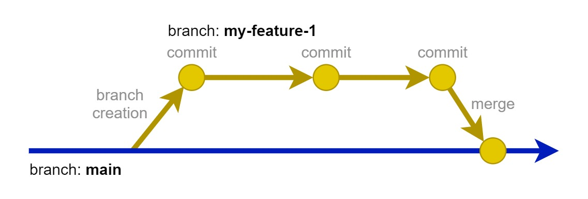

There are three questions to ask when determining a "good" _git workflow_:

1. Will this method adapt to the size of my team?
2. Does this method easily allow for reverting to a previous version of the code in case of an error?
3. Is this method not too complex to use on a daily basis?

Several methods have emerged over time[^TrunkBaseDevHistory], but there are 4 main ones:

- **_Release Branching_**: Suited for periodic software deployment (_release_), this method involves creating a new branch from the main branch and then stabilizing it with bug fixes and other changes before publishing.

    Here, a _release_ refers to a branch that evolves alongside the main branch for an extended period, eventually becoming obsolete.

    It allows groups of developers to collaborate on a particular _release_ or a customized version of the software for a client. This limits conflicts but complicates merging contributions between versions.

- **_Gitflow_**: An extension of the _Release Branching_ method, this uses 6 parallel branches[^gitflowgithub] addressing specific needs (_release_, _hotfix_, _feature_, _support_, _bugfix_, in addition to the main _master_ or _main_ branch). It's historically used for managing very large projects (fig. <spanc/>\ref{fig:gitflow}).

    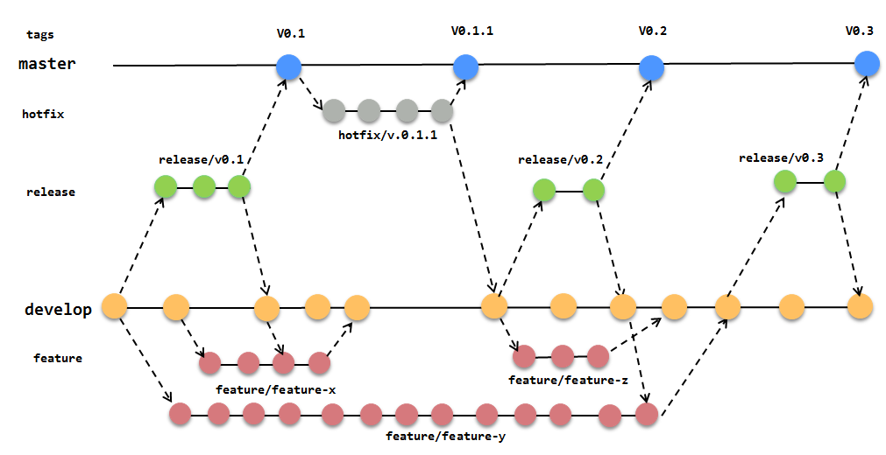

- **_GitHub flow_ / _GitLab flow_**: This method reduces the complexity brought by _Gitflow_ by eliminating its 5 parallel branches to the main one (fig. <spanc/>\ref{fig:gitlab-flow}).

    A developer should create a branch for each new feature from the main branch. A _release_ can be created at any time from the main branch. Beyond its simplicity, the benefit is having a branch that always contains functional code and knowing it's up-to-date at all times.

    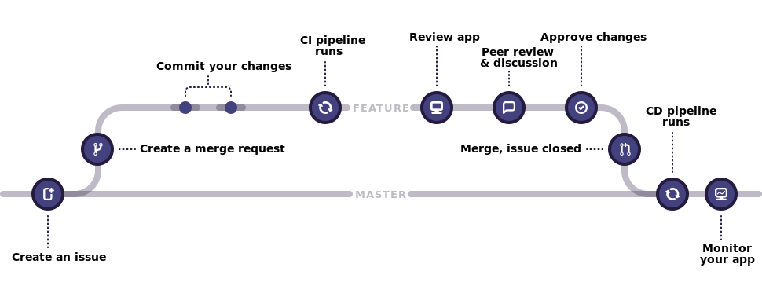

- **_Trunk-based_**: This method promotes continuous deployment of software (see the chapter "[Continuous Deployment](#continuous-deployment-cd)").

    Unlike _github flow_, there's only one branch here. Each developer pushes their code directly to the main branch (the _trunk_, fig. <spanc/>\ref{fig:trunkgit}). This encourages making small, easily reversible contributions in case of bugs, while reducing time spent on conflicts. Indeed, developers sync their code more frequently.

    This method heavily relies on CI/CD mechanisms because every contribution is checked (CI). If checks pass, the software can be automatically updated (CD) by creating a _release_. This ensures that the deployment mechanisms (CD) work at all times.

    At scale, it's advised to create very short-lived branches to benefit from code reviews (maximum 1 day).

    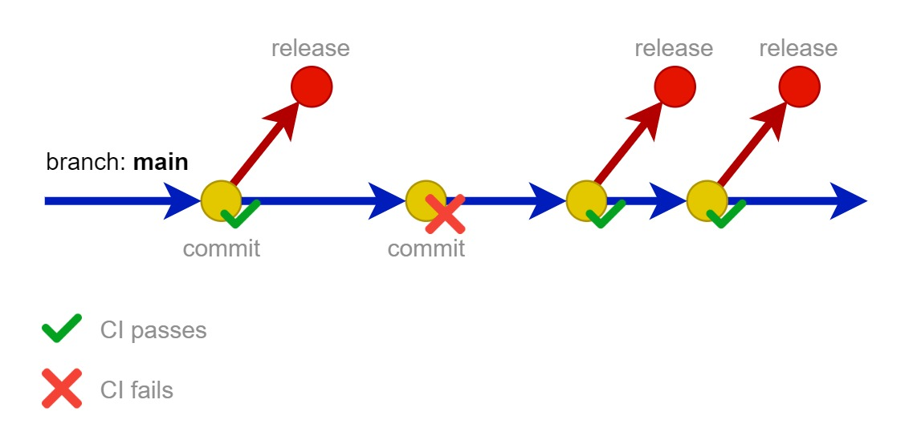

According to Atlassian, the state-of-the-art _git workflow_ today is _trunk-based development_[^AtlassianGitflow]. Google's codebase is a good example: despite tens of thousands of daily contributions, they chose this method[^GoogleSingleRepository].

However, you may not have Google's engineering teams. _Trunk-based development_ requires a specific rigor that only a seasoned technical team can handle. This method needs continuous integration chains that ensure the pushed code is valid (risking releasing a non-functional software version). It also involves creating optimized continuous deployment chains (as they're frequent). Writing these chains takes time and requires experience.

If you don't have a properly equipped team, it's recommended to stick to _github flow_[^WhyTrunkIsNotForEveryone].

But adhering to a common contribution methodology (branches, _commits_) isn't enough. While collaboration might now be easier, you're not equipped to understand everyone's status. In the next chapter, we'll explore a project management method.

#### _Flexible flow_: a balanced git workflow

You might not have a large team at hand but want to benefit from best organizational practices on your _git_ project. This chapter provides insights into a method suitable for most development teams. It's the one I use for the vast majority of my projects, whether professional or personal.

Drawing from the best of various Agile methodologies (_Scrum_[^Scrum], _Extreme Programming_, _Kanban_[^KanbanMethod]), it borrows their pragmatism without their organizational overhead. This methodology will be more suitable for a transforming hierarchy compared to the more demanding _trunk-based development_. IT managers also prefer it because it establishes software versions and facilitates long-term project maintenance. Finally, it allows both project managers and developers to easily track developments.

Named "_Flexible flow_" (fig. <spanc/>\ref{fig:flexible_flow_git}), it's based on _GitHub flow_ but adds a link between project management teams and technical teams.

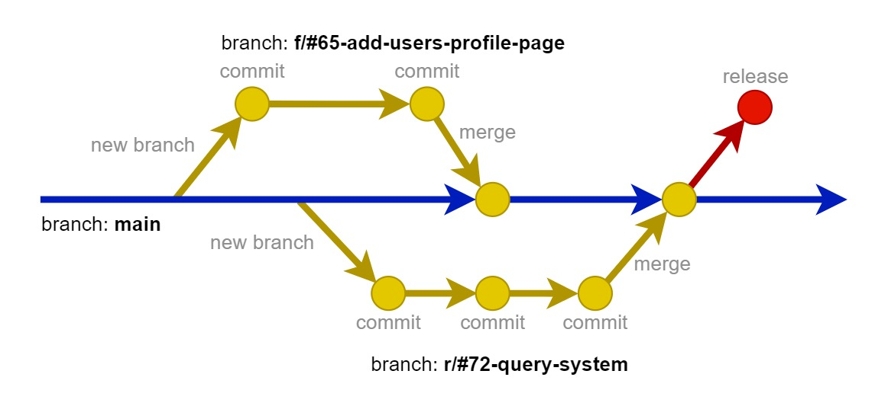

To bridge project management and technical contributions, GitLab or GitHub projects use _issues_. These are tasks assignable to a collaborator, describing which feature to develop or which bug to fix (fig. <spanc/>\ref{fig:figure_3}).

.")

With the _Flexible flow_, every contribution must refer to an _issue_ that describes the task's genesis, how it can be resolved, and centralizes stakeholders' thoughts. Anyone can create these tasks (project manager, developer, user). The project manager then prioritizes them. Any newly assigned developer should know: what to do, where to start, and why by consulting the _issue_. Each is automatically numbered by the software forge.

Project Management:

1. Use the Kanban view of your software forge
2. Create four columns: _Open_, _To do_, _Doing_, _Done_
3. Create and document the _issues_ (tasks) in the _Open_ column
4. Create contribution type _labels_: `type/bug`, `type/feature`, `type/iteration`, `type/refactor`, `type/documentation`, `type/discussion`

    > Helps teams understand the nature of the contribution to be made.

5. Create contribution domain _labels_: `area/backend`, `area/frontend`, `area/documentation`, `area/cloud` (Docker, Kubernetes, CI/CD), `area/infrastructure` (Ansible, Terraform, AWS/GCP/Azure configuration)

    > Allows specialized teams to know which task to handle. For instance, on GitLab, any team concerned by a label can "subscribe" to it to know when a new task is added.

6. Create commercial value _labels_: `business-value/p1`, `business-value/p2`, `business-value/p3`, `business-value/p4`

    > Enables prioritizing tasks based on the commercial value the task realization brings: `p1` indicates high commercial priority. `p4` denotes low commercial priority.

7. Create complexity _labels_: `complexity/1`, `complexity/2`, `complexity/3`, `complexity/4`

    > Allows for prioritizing tasks based on complexity and the time the task demands: `1` is for a simple task, while `4` is for a highly complex or lengthy task.

8. Create priority _labels_: `priority/low`, `priority/medium`, `priority/high`, `priority/critical`

    > Helps prioritize tasks based on the current project development context (political or client priorities).

9. For each _issue_, assign a _label_ from each category (domain, type, commercial value, complexity, priority)
10. Order the _issues_ by priority: the higher an _issue_ is in the _Open_ column, the more important it is
11. Assign an _issue_ to a team member and move it to _To do_

    > Limit assignments to 1 _issue_ per available team member: this helps focus efforts.

12. Optionally, create a _milestone_ to group _issues_ meant for a specific software version. A _milestone_ is often tied to a software release date (_deadline_).

Contribution Management:

1. _Trunk branch_: a singular `main`/`master` branch from which developers can branch off to add a contribution.
2. _Features branching_: code change = 1 branch = 1 _issue_.
    - Branch naming convention: `f/#65-add-users-profile-page` for _issue_ no. 65 of _feature_ type titled "_Add users profile page_" ;
    - Facilitates change tracking (GitHub/GitLab _Changes_ tab) ;
    - Do NOT address anything other than the _issue_'s topic in its branch.
3. Mention the _issue_ number in every _commit_.
    - Naming convention: _"#65 : Added page icon in sidebar"_.
4. Once the contribution is ready, create a _merge request_ to the _trunk branch_.
    - Use the _squash_ feature to keep the contribution history clean ;
    - Naming convention: _"#65 : Add users profile page"_ ;
    - Allows for automatically referencing the merge request in the issue.
5. _Release_: update the software version (in files like `package.json`) and make a _release_ from the _trunk branch_.

Other Recommendations:

1. Do not make a _merge request_ from the _trunk branch_ to a _feature branch_ ;
2. Limit the size of contributions, preferring to create multiple smaller tasks ;
3. Limit the time spent on a _review_ to avoid time-consuming conflicts (refer to code review best practices[^engpractices]) ;
4. Every contribution must pass a Continuous Integration (CI) pipeline ;
5. As your team matures, consider adding a Continuous Deployment pipeline for every contribution that passes CI on the _trunk branch_.

> Author's Note: This method has proven effective over time in the projects I've contributed to. Easy to grasp even for beginners, I've refined it over time to be less cumbersome, yet addressing software technical debt issues and team turnover.

To introduce this methodology to your teams and easily access references, view its [full-resolution illustration](https://links.berwick.fr/flexible-flow)[^FlexibleFlowCheatsheet].

### 12-Factor methodology

Cloud technologies offer undeniable flexibility and allow for serving an increasing number of clients compared to traditional technologies. However, transitioning from a monolithic software to a scalable application requires adhering to certain design principles.

The 12-factor methodology (_Twelve-Factor Methodology_) encompasses a list of best practices for creating applications suitable for Cloud platforms. It summarizes the experiences of Adam WIGGINS and his engineers at _Heroku_. The aim is to prevent "software erosion"[^SoftwareErosion], a phenomenon defined by the slow degradation of software over time, which eventually becomes faulty or unusable. In other words, it helps in creating applications that are easier to maintain, deploy, scale, and more resilient to failures.

The website _12factor.net_, created by Adam WIGGINS, lists and details these principles:

1. **Single Codebase**: Centralize the code in one place (e.g., git / GitLab / GitHub) and assign a unique directory/project for each software. It should be adaptable to different environments (development, pre-production, production). For instance, avoid creating separate "production" and "development" projects for the same software.
2. **Declared and Isolated Dependencies**: All dependencies should be declared in a file - not implicitly loaded based on their presence or absence in a machine's folder. For example, using `package.json` for NPM (Javascript) and `requirements.txt` for PIP (Python). They should be isolated during execution to ensure no dependencies are pre-installed on the machine. This can be achieved using Python's _virtualenv_, Ruby's _bundle exec_, or Docker for any language.
3. **Environment-based Configuration**: The software should adapt to the deployment environment, not the other way around. Utilize environment variables and avoid constants in your applications to tailor your software's behavior to its deployment setting.
4. **Access Third-party Services via Connection Credentials in Variables**: Databases, queue systems, SMTP-type emailing services, caching, or other APIs used by the application should be interchangeable based on the deployment environment. The software relies on URLs or credentials set as environment variables. For instance, the software should be able to connect to both `mysql://auth@host/db` and `mysql://auth@rds.amazonaws.com/db` without any code changes, as long as the technologies are the same.
5. **Distinct Build and Run Stages**: Freeze the code at runtime, making alterations impossible. Assign a unique identifier for each software release (e.g., a timestamp like `2022-05-07-21:33:18`) and make the code immutable for that version. Any code change necessitates a new release.
6. **Create Stateless Applications**: Every application should be self-sufficient and connect to an external service when it needs to interact with data (e.g., the databases mentioned in point 4). For example, each request to an API route shouldn't include a caching mechanism for a user session (refer to _sticky sessions_[^StickySessions]). The API should solely rely on parameters present in the request to respond. This also encompasses the concept of "microservices." The goal is to separate software functionalities into independent modules, each scalable on its own. This is referred to as horizontal scaling (_horizontal scaling_). This contrasts with "monolithic" architectures.
7. **Access Services through Port Binding**: An application shouldn't require adding a web server to operate. Each application should come with a means to serve its content and expose its port. It should be possible to assign a port for one specific environment and a different one in another environment.
8. **Concurrency**: Allowing application concurrency means having the ability to instantiate multiple clones without the need for coordination or shared state among them. This concept aligns with point 6, implying that various application instances rely on third-party services (like databases) to manage data. This facilitates scaling individual components of the application (microservices) independently based on user load (e.g., the _Unix Process Model_[^UnixProcessModel], _Horizontal Pod Autoscaling_ in Kubernetes).
9. **Disposability and Restart Control**: An unexpected application shutdown shouldn't impact its restart; it should continue to operate as before, adapting to the current infrastructure state. The application startup should be quick (within a few seconds). The software shutdown should be controlled upon receiving a `SIGTERM` signal (_graceful exit_).
10. **Environment Parity**: Different environments (development, pre-production, production) should be as similar as possible. Using platform services (e.g., databases, caching services) with different versions can lead to incompatibilities and errors once the software is in production.
11. **Treat Application Logs as Streams**: An application should never handle redirection or storage of activity logs (_logs_). It shouldn't attempt to write or manage log files. Instead, it should write logs to the standard output (`stdout`) as promptly as possible (without buffering). This enables the Cloud platform to easily process logs from deployed applications (see the chapter "[A foundation for your resilience](#a-foundation-for-your-resilience)").
12. **Execute Administrative Tasks with One-off Commands**: Applications should include scripts or tools for executing administrative actions. For instance, initiating a database migration with a Python script, accessing a console to investigate a production database with `psql`, or triggering a backup with a command. The idea is to facilitate script execution in the same environment where the software is deployed.

Implementing these criteria - particularly breaking software into microservices - combined with [continuous deployment pipelines](#continuous-deployment-cd), increases the chances of anticipating software incidents by 43% according to research[^DORACDLooselyCoupledArchitecture] (e.g., failures, vulnerabilities, or degraded service performance). Containerization is especially suited to these practices. Concepts of isolation are recurrent, and technology like Docker aptly addresses them.

Even though these are now standard practices in the industry, it might be beneficial to include them in a guide for newcomers.

### Instant messaging

A simple yet especially effective way to bridge the gaps between silos is to implement a shared instant messaging system. Through this medium, team members can quickly communicate without overloading their email inboxes, engage in group discussions about the next feature to develop, share snippets of code or documents effortlessly, foster cohesion by sharing memes, make general announcements, or even conduct polls to decide on a list of options. Beyond facilitating collaboration, messaging enables remote work or collaboration with decentralized teams (in other cities or countries).

In the context of system reliability improvement, messaging is the ideal location to centralize production alerts for SRE teams. System monitoring tools can be set up to raise alerts in a single location. SREs are immediately notified when an alert is issued. When set up properly, these alerts provide all the information the SRE needs to promptly address the issue. Production teams can also easily inform their users of actions they are taking on the production system.

Messaging platforms like _Mattermost_, _Element_, _Zulip_, and _Slack_ come with built-in _VoIP_ (calling) and video conferencing capabilities. Most also natively support integration with tools used in production (e.g., automatic notifications for every GitLab _release_, incident reports in chats, updates on the _status page_, postmortem timelines; see [Rootly](https://rootly.com)).

Several companies, like _Scaleway_, open their corporate messaging to their customers. This forms a community of mutual assistance and a knowledge base for new users. It fosters engagement and reassures potential users, knowing there will be someone to answer in case of problems. Users facing issues can ask their questions, to which another user or a company expert can respond. At _Canonical_ and _Prefect_, there are even "Community Engineers" whose specific role is to help the community with issues they may encounter[^PrefectCommunityEngineers]. Some companies opt to charge entirely for this user support.

#### Remote work

Large organizations are often hesitant about offering remote work to their employees. They fear that employees might not focus on company tasks.

If you need to convince your superiors, clearly list the objectives for the remote-working employee (with help from the [previous chapter](#continuous-training)). If that doesn't suffice, you might suggest the employee submits a daily work summary. However, this approach essentially tells the employee, "I don't trust you to be diligent." Think twice before proposing it.

Research[^DORAFlexibleWork] has shown that a flexible work environment is linked to a reduction in burnout and an increased likelihood of an employee recommending their company.

\newpage

### Software architectures and agility

Understanding different software architectures will help you grasp how software is deployed in cloud architectures.

Depending on your organizational maturity and team sizes, certain architectures will make your software easier to maintain, update, or ensure longevity.

This chapter introduces three renowned architectures and describes their pros and cons. Finally, we will explore how to progressively transition your legacy software into microservices.

#### Monolithic architecture and microservices

A monolithic application (designed as a monolith) is developed as a single, indivisible entity where every function or module is interconnected. The software components depend on each other.

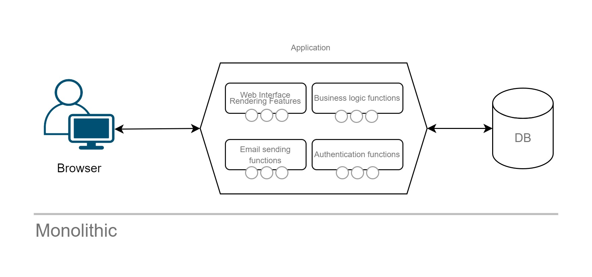

While initially easier to develop and use, software designed as monoliths complicates the addition of new features as they grow[^AddingFeaturesToMonolithsIsComplex].

Updates to one part of the system impact the entire application, necessitating extensive testing to ensure it functions as expected upon deployment. The potential "blast radius" of a bug is significant in such an architecture.

Many renowned software like _Wordpress_ and _Magento_ still employ a monolithic architecture today. However, the trend is shifting towards microservices architectures, which are more scalable and resilient[^MicroservicesResiliency].

An application designed with microservices breaks down each software functionality into isolated services (e.g., email sending management, login management, order management). Each operates independently. Every microservice communicates with others using a predefined exchange format (an API[^API]). Updates can be deployed without disrupting the whole system.

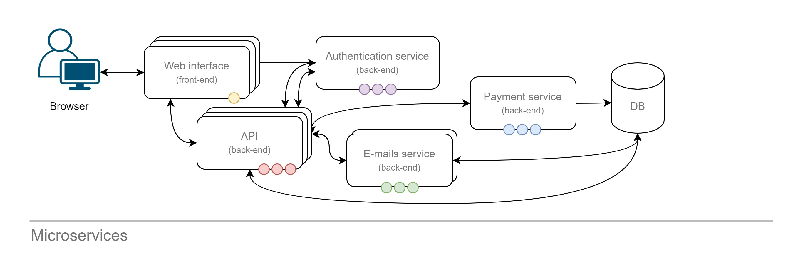

By splitting your software into microservices, you can parallelize team work on each part of your software. Each team develops and deploys independently.

But one of the major benefits of microservices is the ability to scale easily: the most in-demand services can be instantiated multiple times simultaneously to distribute the load. Some service orchestrators, like Kubernetes, allow automating this behavior[^HorizontalPodAutoscaling].

However, this architecture requires advanced tools to maintain hundreds of intercommunicating microservices. DevOps teams facilitate the implementation of such architectures. For instance, they provide developers with application templates (_boilerplates_) containing everything needed to kick-start a microservices application on its own infrastructure.

#### Serverless architectures and functions as a service

To enable fine scaling on isolated functionalities, so-called "serverless" architectures have emerged. The advantage of a _serverless_ architecture over traditional micro-services approaches is multifaceted:

- No longer having to manage the underlying infrastructure ;
- Only pay when the service is used ;
- Automatically provision resources during high traffic ;
- Automatically remove unused resources.

Included in this are _Function as a Service_ or _FaaS_ technologies[^TechFaaS], _Container as a Service_ (CaaS), _serverless compute platforms_ or _SCP_[^TechSCP], self-managed storage services[^TechDBmanaged], and self-managed messaging services[^ManagedQueues].

By only charging for resources when they are used, _serverless_ represents a significant economic and ecological argument. These technologies can reduce your bill from tens of euros to a few cents every month.

For instance, _Functions as a Service_ each represent an isolated feature of your microservice. If you know that only 10% of your functions are used 90% of the time, there's no need to pay for 100% of the resources constantly.

Consider a specific case: you decide to start an email marketing campaign. Precisely the email sending function will be highly solicited for a short moment. There's no need to scale the function that lists your products. The infrastructure will only provision instances for the email sending function.

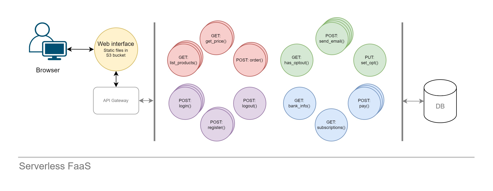

However, _serverless_ architectures require specific skills to maintain. They might also tie you to a Cloud provider's proprietary technologies (see proprietary lockdown or _vendor lock-in_[^VendorLockin]) or explode costs if the use case isn't suitable[^AmazonPrimeVideoMonoliths].

Let's summarize some advantages and disadvantages of each approach:

| Architecture       | Advantages                                                                                                      | Disadvantages                                                                                                                         |
| ------------------ | ---------------------------------------------------------------------------------------------------------------- | ------------------------------------------------------------------------------------------------------------------------------------- |
| **Monolithic**     | • Simplicity in development and deployment<br>• Centralized management<br>• Easy to test and debug               | • Difficult to scale<br>• An update affects the whole software<br>• Slower and less frequent deployments                              |
| **Micro-services** | • Scalable on-demand<br>• Quick deployments<br>• Isolated bugs and crashes<br>• Language-agnostic                | • Specific skills needed to manage<br>• Data format consistency to maintain (API)<br>• More difficult to debug                        |
| **FaaS**           | • No infrastructure management<br>• Targeted scalability<br>• Cost-effective for sporadic traffic                 | • Vendor lock-in<br>• Less control over the execution environment<br>• Start-up time if unused (_cold start_)<br>• Limited run duration |

#### From monolithic to microservices

The leap to switch from monolithic software to a microservices architecture is often significant. However, this approach provides unprecedented flexibility in development and makes scaling drastically more efficient. But how do you make this transition without disrupting your entire operation?

Deciding to switch to microservices is tempting but involves compromises. British software engineer and author Martin FOWLER enlightens us on the prerequisites your team must have before starting this journey[^MicroservicePrerequisites]:

- Ability to quickly provision machines (see chapter "[A foundation for your resilience](#a-foundation-for-your-resilience)")
- Ability to deploy quickly (see chapter "[Leveraging automation](#leveraging-automation)")
- Have the tools to monitor your services (see chapter "[Measure everything](#measuring-everything)")

In essence, we're talking about Cloud technologies and DevOps techniques. At this point, you just want to validate the development process of a microservice and deploy it automatically.

To practice creating microservices, decouple an initial feature that doesn't need to be modified throughout your software. For example, an app's authentication mechanism is often centralized in a class or function: create and interface this microservice.

<!-- markdownlint-disable MD029 -->
1. **Set up a development environment with automated tests, continuous deployment, and supervision tools, to grasp a generalizable first microservice.**
<!-- markdownlint-enable MD029 -->

The Battle of Alesia, fought during the Gallic War in 52 B.C., is often cited as an example of strategic military planning. Julius Caesar's Roman army faces off against Vercingetorix's Gallic army. Pushed back by the Germans - allies of the Romans - the Gallic military leader is forced to take refuge with 80,000 men in the oppidum of Alesia. Julius Caesar decides to build two fortified lines around the city to dislodge the Gallic army.

This stratagem allowed Julius Caesar to control the entries and exits from the area, to manage the number of soldiers arriving from the oppidum on one hand, and from the outside where reinforcements were pouring in on the other.

](./images/2023_illustration_bataille_alesia.jpg)

Without considering ourselves as great military leaders, we can still use this strategy to control, on one hand, the user load, and on the other, the flows either towards the monolith or towards the microservices we'll progressively create.

That's the second step in the journey: placing a proxy or a _service mesh_ around our application (see chapter "[Service mesh](#service-mesh)"). It will allow us to redirect each request either to the new microservices or to the monolith for functions that haven't been migrated yet. For example, if we choose to extract authentication functionalities to a microservice, we will redirect requests starting with `/auth` to the authentication microservice.

<!-- markdownlint-disable MD029 -->
2. **Implement a proxy around our application to control the flow.**
<!-- markdownlint-enable MD029 -->

A new rule should now be established alongside the transformation you're undergoing: every new feature should be developed as a microservice.

Former Director of Emerging Technologies at Thoughtworks, engineer Zhamak DEHGHANI offers valuable insights in her article "How to Decompose a Monolith into Microservices"[^ZDBreakMonolith]. Let's review a few of them.

One of her first pieces of advice is to avoid creating microservices that recall the monolith. Instead, prioritize calls from the monolith to the microservices.

<!-- markdownlint-disable MD029 -->
3. **Minimize callbacks to the monolith.**
<!-- markdownlint-enable MD029 -->

The goal is to prevent a vicious cycle of changes that only serve to enrich the monolith. That's why it's essential to tackle the software's core. Start by breaking down the most integrated functions that handle the main data of your project.

Prioritize the segmentation of functions hard to decouple by logical domain (e.g., product management followed by order management). Then focus on the most frequently updated parts of the software.

<!-- markdownlint-disable MD029 -->
4. **Segment the software by logical domain and prioritize the most complex functions at the beginning.**
<!-- markdownlint-enable MD029 -->

Lastly, consider rewriting a part of the code completely. Sometimes, legacy code is too complex, slow, outdated, or different from the current tech stack and needs a serious update. It might be more advantageous to rewrite it, especially if it lacks clarity.

<!-- markdownlint-disable MD029 -->
5. **Consider rewriting capabilities rather than extracting and reusing the code.**
<!-- markdownlint-enable MD029 -->

These insights and tips will allow you to confidently approach the task of rewriting your software to better integrate it into a Cloud infrastructure, taking advantage of the agility it offers your organization.

## Embracing failure

You should be prepared to see failure as an opportunity to correct your course toward a better direction. If you face significant failure, it indicates a lack of elements to control the situation.

Using indispensable tools and methodologies in the field, this chapter aims to make you understand the importance of a company culture that accepts failure. It will enable you to better anticipate risks, embrace them more confidently, and increase your velocity.

Instilling this mindset is a cultural shift that an organization must implement at all hierarchical levels.

### Psychological safety

> "Psychological safety is the shared belief that one will not be punished or humiliated for speaking up with ideas, questions, concerns, or mistakes." - Amy C. EDMONDSON, Professor of Leadership and Management at _Harvard Business School_.

An organization's culture is foundational to its potential. A positive culture promotes team collaboration and communication, essential for the successful implementation of a DevOps initiative. This idea isn't new and was theorized in 2004 by sociologist Ron WESTRUM in his article "_A Typology of Organizational Cultures_"[^RonWestrumTypologyOfOrganizationCulture].

By ensuring your employees' psychological safety, you encourage shared responsibility for successes and failures. Shared outcomes rather than attributing them to specific teams or individuals.

In a work environment that overlooks psychological safety, collaborators:

- Keep their concerns or ideas to themselves ;
- Fear appearing incompetent or ignorant ;
- Are scared of being ridiculed.

As mentioned by Kiran VARMA in her course on SRE culture at Google[^CourseraSRECourse], research[^ATheoryOfBlameResearch] identified two primary drivers fueling the human tendency to blame others: hindsight bias and "discomfort discharge."

Hindsight bias is when an individual overestimates their ability to have foreseen an event. People often struggle to grasp that something only seemed obvious after it happened. In a professional setting, this might lead to blaming a person responsible for a task, claiming they should've "seen the obvious thing" coming.

The concept of "discomfort discharge" refers to the neurobiological phenomenon where we blame others to alleviate mental pain. Sociologist Brené BROWN suggests that humans do this involuntarily but blaming hampers our ability to learn from mistakes[^BrenéBROWNVideoOnBlame].

In organizations uncomfortable with failure, team members might hide information or not report incidents for fear of punishment. Similarly, out of fear of appearing foolish, they might hesitate to ask questions that could identify a problem's root cause. However, mistakes only become opportunities for improvement if their true causes are identified. This can only happen in a psychologically safe work environment.

A psychologically safe organization believes:

- Failure should be seen as an opportunity for growth ;
- New ideas are welcomed and should be discussed ;
- Failure results from lacking methods and procedures, not from individual fault.

This mindset fosters trust. Organizations should shift from asking "Who did this?" to "What happened?" Focus on methods and procedures rather than on individuals. It's best to assume employees act in good faith, making decisions based on the most relevant information available. Investigating the source of misinformation is more beneficial for the company than blaming someone.

Innovation requires risk-taking. No product or strategy comes with a 100% guarantee of success. So, if everyone's afraid of taking risks, nobody will, and your organization will stagnate.

There are numerous other decision-making models[^DecisionMakingMindtools] and project management methods[^ProjectManagementMindtools] available. Don't hesitate to explore and adopt them.

### Responsibilities in a DevOps model

When discovering the plethora of experimental technologies to implement for operating in a DevOps mode, you might be intimidated by the idea of becoming responsible for this vast, new system.

This chapter aims to juxtapose a traditional responsibility model with the DevOps model. It also offers a tool to guide decision-makers, the DACI. It's up to you to pick and choose methodologies from each that seem most appropriate for your organization. However, be bold enough and try to avoid reverting to a traditional model, which would only give you the illusion of transformation.

#### The RACI model

One of the responsibility-sharing models is "RACI", which stands for _Responsible_ (Executor), _Accountable_ (Owner), _Consulted_ (Consulted), and _Informed_ (Informed). It ensures all stakeholders are aware of their roles and responsibilities in a project.

In the table below, we have five stakeholders for the development of a new website. A responsible, an executor, consultees, and informers are designated for each activity.

| Project Deliverable (or activity) | Project Leader | Archi -tect | Design -er | Front-end Developer | Back-end Developer |
| --------------------------------- | -------------- | ----------- | ---------- | ------------------- | ------------------ |
| Site plan design                  | C              | R           | A          | I                   | I                  |
| Artistic direction                | A              | C           | R          | C                   | I                  |
| Mockup design                     | C              | A           | R          | I                   | I                  |
| Code structure (template)         | A              | I           | C          | R                   | C                  |

- **R** (Executor): person who does the work to complete a deliverable
- **A** (Owner): person who delegates the work and inspects the finished tasks
- **C** (Consulted): person who contributes to a deliverable based on their expertise or responsibilities
- **I** (Informed): person who needs to be kept in the loop about the project's progress

An extension of RACI is RACI-VS[^RACI-VS], which includes a validator (the person in charge of the final deliverable validation, an authority) and a signer (the person in charge of the official approval of the deliverable, a higher authority).

The RACI model is built on a clear separation of roles and responsibilities. This can be counterproductive in a DevOps initiative, which seeks to foster collaboration among teams. Moreover, RACI doesn't consider the dynamic and ever-changing nature of project development.

In a DevOps model, everyone can contribute to a project. Everyone is accountable at the same level based on their expertise. A significant change—like launching a new software version—requires the approval of each team (from the design team to marketing, engineering, and security).

Of course, you wouldn't ask the IT security team for their opinion on changing a button's color... But the point is, there isn't just one owner or executor: everyone is responsible and can validate or invalidate a change based on current rules and constraints.

RACI, as used in large organizations, plays a referee role. A specific team is designated for specific tasks. However, DevOps is a collective set of practices that are interconnected. If you aim to evolve multiple organizational teams, RACI can have a discouraging, perverse effect. It might allow Team A to ignore Team B's issues under the pretense that it's not their responsibility.

To mitigate this, while still reassuring your managers, RACI's deliverables can initially be broadened. For instance, instead of referring to "a mechanism that collects application logs," you might refer to "a set of tools for observability." Specific sub-objectives can still be defined, but responsibilities should remain broad. If some don't play along, RACI can force them to do the work, but they might not be the right members for your project.

As a leader of an initiative involving new technologies and practices, your superiors will ask you to take on many of the roles in the table above. Take on this responsibility to reassure your authorities[^RadioDevOps12]. There's no need to fear since you know the methodology you want to implement is collective and iterative.

#### The DevOps model

Most of the time, it's not advisable to immediately abandon a RACI-like model. It's a matter of evolving culture and implementing tools. But that's the goal: a cultural shift in your organization so that authorities overcome their fears.

However, by assuming shared responsibilities without placing blame, you focus on improving the service to achieve the desired end result (e.g., a more stable infrastructure) rather than finding a culprit. With this principle in mind, let's analyze a common concern.

As you've realized, DevOps encourages not blaming stakeholders. It might seem logical to argue that if no one is personally accountable, teams might be less diligent in their daily duties. How can we imagine a production head deleting the entire client database without consequences? Leaders must realize their actions have repercussions. DevOps addresses this challenge in two ways:

1. If your procedures are sound, there's no reason the engineer could've executed that command. If a mistake was made, it indicates that the rules governing the security of your production infrastructure weren't robust enough (manual access to production machines, lack of command checks/validation, no backups, poorly described procedures, communication gaps...). (See chapter "[Leveraging Automation](#leveraging-automation)")
2. You hired an employee because they know their job (you did interview them, after all). If you're worried they won't take responsibility, speak with them or consider letting them go and revising your hiring policy. Trust your experts. If you have doubts, ask them to strengthen control rules (see point 1) and reassure you with typical scenarios (see chapter "[Postmortems](#postmortems)").

That's why you should start with available resources, but have the boldness to start small in your transformation journey. Your company should gradually implement procedures (in our case, IT system control technologies) based on available human and financial resources. Once these techniques have been tested, iterate on a larger scale.

#### The DACI model

DACI is not a means to define responsibilities for a project. Instead, it's a document and method to organize occasionally, aiming to make a group decision when faced with multiple options. It's typically used to ensure a decision is made by the end of a meeting. Consider it a tool that supports the approach of shared responsibilities in DevOps mode.

A meeting based on the DACI model involves defining four roles:

1. The **_driver_**: the person guiding the committee towards a decision. They ensure that everyone is well-informed about the meeting's progress and answer questions. While they ensure a decision is made, they don't necessarily influence the process. Often a program manager.
2. The **approver**: the individual with the final say during decision approval. Usually, a manager or a company executive with decision-making power. Consider inviting a stakeholder or a customer for whom the project was designed to take on this role.
3. The **contributors**: those with the knowledge needed to shed light on the decision-making process. These are the experts and professionals.
4. The **informed stakeholders**: individuals affected by the decision without being directly involved in making it. Those who might need to revise their work following the decision, like legal, sales, or logistics teams. Limit their number: perhaps just sending them a brief email at the end of the meeting with actions to take is sufficient.

Next, the goal is to collaboratively list the considered options in a few words. For each, indicate its cost, time required, and other pros or cons.

In the remaining 5 minutes, set a date for when the decision should be made (if not immediately). Based on these preliminary options, if any need further details, assign the task to the person responsible for fleshing them out.

Once the options are consolidated, the approvers make the decision, and tasks are delegated accordingly.

Example of a DACI, listing options considered for making a decision on the issue "How should we finalize our product specifications?":

| **Criteria**                                           | **Option 1:** Discussion Groups / Paid Target Persona[^Persona] Discussion Groups                | **Option 2:** Online Reviews / Internal Content Expert Team                                         | **Option 3:** Do not finalize / Take no action to address the issue at the moment         |
| ----------------------------------------------------- | ------------------------------------------------------------------------------------- | --------------------------------------------------------------------------------------------------- | ---------------------------------------------------------------------------------------- |
| Strategically reliable / _high priority_              | (+) Targets rooted in strategy = feedback rooted in strategy                          | (+) 2 new team members match the persona = some feedback rooted in strategy                        | (-) Risk of significant or costly mistake, (-) Risk of delays or confusion                |
| User-centered / _high priority_                       | (+) Precise customer feedback                                                         | (-) Expert bias                                                                                     | (-) Navigating blindly                                                                  |
| Cost / _medium priority_                              | (-) More expensive short-term, (-) Time-consuming                                     | (+) No additional cost, (+) Relatively quick to implement, (-) Takes team's time                  | (+) No additional cost, (+) Quickest option                                              |
| Opportunity to learn more / _low priority_            | (+) Chance to learn more about our targets                                            | (+) Opportunity to learn from feedback of our inter-team experts                                   |                                                                                        |

> An example of using the DACI model to weigh pros & cons and make a decision (in this case, option 1). Translated from English. Source: _atlassian.com_

Once your decision is made, it's time to communicate it so everyone is on the same page. Send the document to those who need to be informed and then archive it.

Once archived, it will help new stakeholders understand why specific decisions were made. By conducting this collective reflection, individual cognitive biases are also avoided.

### Investigating incidents

You receive an alert message from customer support on Slack. They inform you that your file-sharing platform is down.

This marks the beginning of the problem investigation. The most common technique is _root cause analysis_ (RCA), inspired by [quality control techniques in manufacturing](https://www.sciencedirect.com/topics/neuroscience/root-cause-analysis). It helps understand the factors behind the incident and determine its source. The goal then is to establish procedures to prevent the incident from happening again.

In RCA, your primary goal is to restore the services. This is followed by a solution to permanently resolve the issue. Lastly, preventative action is implemented to prevent future recurrence.

For instance, in the case of a faulty coffee maker:

- the immediate action is to replace the broken part ;
- the permanent solution is to redesign the coffee maker, accounting for manufacturing disparities ;
- the preventive (or "systemic") action is to change the design process, integrating a study of manufacturing disparities among suppliers.

To make upper management understand the value of this method, present it as an investment in saving time and money[^CloudRCA]. RCA reduces the risks of expensive software redesign and is time-efficient. Focus your RCA efforts on the incidents that cost your organization the most. Establishing procedures and preserving knowledge on incident resolution also improves team communication. Instead of merely applying patches, the idea is to find a lasting solution.

Here are the 5 steps of _Root Cause Analysis_:

- Identify the problem ;
- Contain and analyze the issue ;
- Determine the cause of the problem ;
- Resolve the issue permanently ;
- Validate the fix and ensure the incident does not happen again.

1. **Identify the problem**

    Analyze the situation to ensure that it's indeed an incident and not just a harmless alert. The company should set a threshold to classify an event as an incident, such as an anomaly lasting more than 1 minute. If the event threatens the stability of your [resilience indicators](#resilience-indicators), treat it as an incident.

    When in doubt, the best practice is to report incidents early and often. It's better to report an incident, quickly find a fix, and then close it, rather than allowing it to persist and worsen. If a major incident arises, you'll likely need to handle it as a team (see chapter "[Structuring your incident response](#structuring-incident-responses)"). You can distinguish a major incident from a minor one if you answer "yes" to any of these questions:

    - Do you need to call in a second team to solve the problem?
    - Is the outage visible to customers?
    - Does the problem still affect the system even after an hour of intense investigation?

    As soon as the incident starts, begin taking notes on what you observe and the actions you plan to undertake. This will be helpful for your postmortem. Next, classify the problem using the "5W2H" method (5 whats, 2 hows):

    | Question       | Description                                                                                           |
    | -------------- | ----------------------------------------------------------------------------------------------------- |
    | Who?           | People or customers affected by the issue                                                             |
    | What?          | Description or definition of the issue                                                                |
    | When?          | Date and time the issue was identified                                                                |
    | Where?         | Location of complaints (area, equipment, or affected customers)                                       |
    | Why?           | Any prior known explanations                                                                          |
    | How?           | How the issue arose (root cause) and how it will be addressed (corrective action)                     |
    | How much?      | Severity and frequency of the issue                                                                   |

    On mature infrastructures, problem identification is made easier by monitoring systems. They notify about detected anomalies. For example, these anomalies can be detected by tools like [Statping](https://github.com/statping/statping), which trigger an alert when a service goes down. But they can also be detected by machine learning mechanisms, revealing unusual trends. The advantage is that alerts are not just triggered when a simple threshold is breached, but when something unusual occurs.

    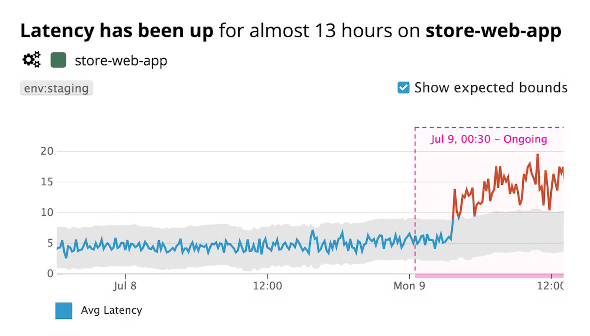

    Tools like [OpenRCA](https://openrca.io/), [OpenStack Vitrage](https://opendev.org/openstack/vitrage), and [Datadog](https://datadoghq.com) can help identify the root cause of a problem by highlighting anomalies within your infrastructure.

    At this stage, you only recognize the symptoms of the problem, not its severity.

2. **Contain and analyze the problem**

    Always start by resolving the problem. Restore service as soon as possible to prevent further escalation, even if the solution is temporary or not deemed "clean."

    The trust your users place in your service is linked to your responsiveness during incidents. Users don't expect 100% uptime but do expect clear communication during outages. Transparency is vital.

    A [service status page](https://github.com/ivbeg/awesome-status-pages) is an excellent way to inform your users about an incident's progress (fig. <spanc/>\ref{fig:2023_atlassian_statuspage}). You can also notify about upcoming maintenance.

    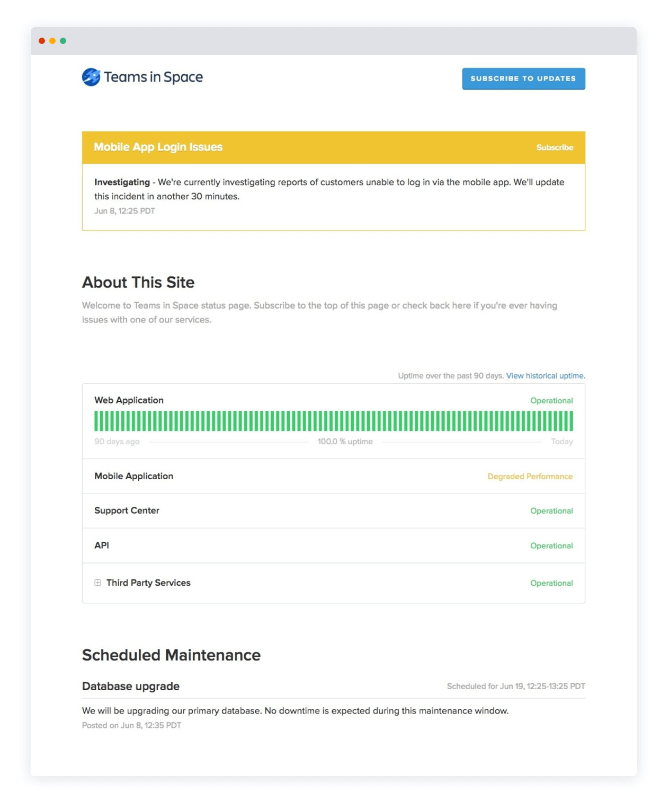

    With each update on the incident's status, communicate:

    - The current situation and the measured impact ;
    - What's known about the problem/what has changed ;
    - Ongoing affected services.

    To analyze the issue in more detail and locate the source of the malfunction, use your observability tools (activity logs, metrics).

    > The [_Beats_ suite from Elastic](https://www.elastic.co/fr/beats/) is an example of a tool that monitors infrastructure. We will explore these technologies further in the chapter "[Measure Everything](#measuring-everything)".

    At this stage, you must find an immediate action. For instance, a manufacturer could decide to re-inspect ready-to-ship parts, rework them, or issue a recall. For software, the idea is to find a way to restore service, often by pushing a quick fix (known as a "hotfix").

    Your SRE team must ensure deployed fixes work. They can do this by running pilot tests[^PilotTests] prepared in advance.

3. **Determine the cause of the problem**

    With the incident's impact now managed, it's time to investigate the root cause.

    As a team, list likely factors contributing to the problem. Structure your hypotheses using a cause and effect diagram (or _Ishikawa_ diagram, fig. <spanc/>\ref{fig:2023_ishikawa_diagramme}).

    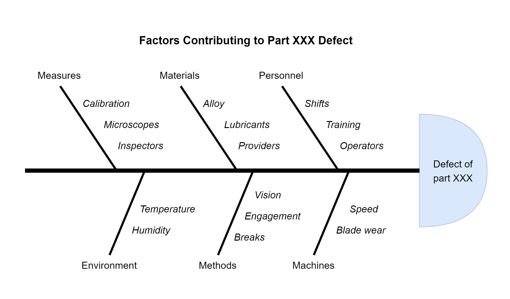

    Choose by majority vote the causes that seem most likely to reoccur. According to Pareto's principle, 80% of effects come from 20% of the problems. You now have a focus for your investigation.

    Use the "5 Whys" method. The idea is to identify cascading symptoms until the root cause of a problem is found. "5" is an arbitrary number; it can be less or more, depending on the situation.

    Here's an example for the identified problem "Our software crashes frequently":

    | Question | Answer                                                                                                  |
    | -------- | ------------------------------------------------------------------------------------------------------- |
    | Why?     | Because memory usage increases over time                                                                |
    | Why?     | Because there's a memory leak in the code                                                               |
    | Why?     | Because developers didn't properly free memory after allocating it                                       |
    | Why?     | Because they weren't aware that their program could have a memory leak                                   |
    | Why?     | Because there was no continuous integration chain checking for it                                        |

4. **Address the problem in a sustainable manner**

    After identifying the root cause of the issue, it's time to design a solution to address it.

    Validate that the solution works by performing a proof of concept before deploying it to production.

    Define and outline the steps to rectify the problem, assign responsibility, and set a timeline for completion.

    Determine how the solution's effectiveness will be measured, such as through telephone surveys, online polls, automated feedback, manual measurements, etc. Set a timeframe for monitoring the action, then implement the fix.

5. **Validate the fix and ensure the incident doesn't recur**

    Using the measures set in step 4, ensure that the actions taken have had the desired effect.

    The incident is now resolved and the cause understood. Now is the time to inform your users on the _status page_: "Root cause analysis complete, incident resolved, incident documented."

    All that remains is to draft your post-mortem, noting what measures you've put in place to prevent a recurrence (see chapter "[Postmortems](#postmortems)"). Use the notes from previous steps to structure this document.

    Publish and share this document internally or publicly. This keeps customers informed and satisfied, and recognizes the hard work of the operations teams.

Just as airplane pilots train for emergency scenarios, your SRE teams should practice to save time when an incident occurs (refer to the chapter "[Assessing security and training](#assessing-security-and-training)").

Your incident response procedure should be easily accessible and written for all audiences. It should provide guidance not just for SRE teams but also for non-SREs who might encounter an incident. Regardless of your organization's size, you need an incident response procedure.

### Postmortems

A postmortem is an incident investigation technique. Its purpose is to determine corrective actions to prevent recurrences. Your SRE team should draft this document based on information gathered during the [_root cause analysis_](#investigating-incidents) (see chapter "[Investigating Incidents](#investigating-incidents)").

In the military and aerospace fields, the AAR (After Action Review) or _debrief_ is systematically practiced following an event to learn from it. The postmortem, on the other hand, is only initiated when an incident or failure has occurred. That is what distinguishes them.

It's recommended to store these documents in a _git_ project to track changes over time (refer to the chapter ["GitOps"](#gitops)). My personal recommendation is to draft them in Markdown format.

Historically, the Latin term "_post mortem_" means "after death" and refers to investigations carried out by law enforcement to understand how a crime occurred. They analyze evidence, identify the cause of death (e.g., through an autopsy), then attempt to apprehend the perpetrator or amend the law to prevent future occurrences. The concept is similar for IT incidents.

#### Postmortem structure

The structure recommended by Google[^GooglePostmortems] serves as a good example. The document consists of two parts: one that describes what happened and another that details the steps to be taken following the incident.

Create a new Markdown document and name it in the following way:

- Format: `yyyymmdd_postmortem_summary-incident_duration.md`
- Example: `20230604_postmortem_file-sharing-outage_00d00h38m.md`

For the first part, set the following headings:

- **Title**
  - Ex: "File Sharing Platform Unavailable for 2 days on June 4, 2023".
- **Alert Date**
  - Ex: "07/04/2023 16:55 UTC".
- **Incident Start Date**
  - Ex: "07/04/2023 16:48 UTC" ;
  - May be unknown due to lack of information.
- **Incident End Date**
  - Ex: "07/04/2023 17:26 UTC".
- **Incident Duration**
  - Ex: "00d00h38m - 07/04/2023 16:48 UTC - 07/04/2023 17:26 UTC" ;
  - Use the alert date if the incident's start is undefined.
- **Authors**
  - Ex: "Elise DUPONT (@edupont) - Antoine MARTIN (@amartin)" ;
  - Postmortem authors. Ideally, include software forge username.
- **Status**
  - Possible values: in writing, under review, reviewed, published internally, published publicly.
- **Summary**
  - Summarize the incident, its duration, and its cause in no more than five sentences.
- **Impact**
  - Which users/clients were affected? To what extent? On which network (intranet or Internet)? Were there data losses, latency, an outage? Also, include revenue impact if relevant.
- **Detection**
  - How was the incident detected? (observability tools, service status page, customer call, company colleague, online news?)
- **Problem Source(s)**
  - This is where you include elements from your _root cause analysis_ detailing how the issue occurred. Add the time for each step of the investigation. Include screenshots as evidence and to better understand the situation.
  - Reminder: mistakes are never solely one person's fault but arise from poorly defined procedures or poorly designed infrastructures (see chapter "[Embracing failure](#embracing-failure)").
- **Triggering Event**
  - Describe the action that led to the incident ;
  - Ex: "An administrator mistakenly ran a command that deleted a critical file".
- **Resolution**
  - List immediate actions taken for short-term problem mitigation. Then list long-term actions addressing the problem's root cause.
- **Lessons Learned**
  - Describe what went well and what didn't.
    - Was the incident detected quickly or did it take a while for someone to notice? Was the team well-coordinated, or were there communication issues? Were procedures clear, or were engineers uncertain where to seek help?
  - Describe where we got lucky / surprises.
    - Sometimes, the incident doesn't turn out as bad as anticipated. And something might go right unexpectedly. Highlight it to establish new measures to not rely on "luck" in the future.

The second part describes what your team might do differently next time. As a conclusion to your postmortem, it lists actions to prevent recurrence of the issues. Focus not only on bug fixes but also include necessary procedure changes to mitigate similar future incidents.

Define a table with four columns and as many rows as desired:

- The **person responsible** for the action ;
- The **action(s)** to be taken ;
- The **priority** of this action ;
- The [_issue_](#flexible-flow-a-balanced-git-workflow) or associated **ticket**.

As your team or projects grow, a more formal structure for your postmortems might be needed. The postmortem model proposed by Atlassian is a good example[^AtlassianPostmortem].

For minor incidents or daily bugs, use a Q&A service like [_Scoold_](https://scoold.com/) or [_question2answer_](https://github.com/q2a/question2answer). This can address technical problems (e.g., "How to resolve a dependency conflict") or more general queries (e.g., Q: "I can't connect to service X". A: "Did you try registering at this URL?").

With such software, your SREs will have a list of problems that are easily solvable in the future. A private alternative to _StackOverflow_, it also allows your developers to ask questions to other company colleagues confidentially.

#### Postmortem for retention and attraction

As discussed in the chapter "[Investigating incidents](#investigating-incidents)", publicly sharing one's work allows it to be recognized by the community. This practice also enhances retention by enabling collaborators to build their reputation.

> Video creator Bastien MARÉCAUX (known by the pseudonym _Basti UI_) introduced the concept of "teletralive", a blend of "telework" and "live streaming". He broadcasts live work sessions on the Twitch platform, with permission from his clients[^Teletralive]. This underscores the significance of publicizing one's work—a trend that might gain traction in the future.

Beyond personal perception, [showcasing one's work](https://github.com/danluu/post-mortems) to an informed audience motivates the individual behind the published name to deliver quality work[^TransparencyPerformance]. Initially, it might just involve sharing internally with company colleagues. A mere notification about the postmortem in the company's messaging platform could suffice.

Transparency is also an excellent way to attract talent. In the industry, companies brave enough to document and publish their incidents are deemed trustworthy. This is because they are not hesitant, given their robust procedures and meticulous work, inspiring confidence and attracting talent.

[Many companies](https://github.com/kilimchoi/engineering-blogs) like [Spotify](https://engineering.atspotify.com/), [LinkedIn](https://engineering.linkedin.com/blog), [Meta](https://engineering.fb.com), [Airbnb](https://medium.com/airbnb-engineering), and [Capgemini](https://capgemini.github.io/) share articles on their respective blogs. Topics range from postmortems to best internal practices or overcome challenges.

For instance, Cloudflare is renowned for its high-quality postmortems regularly published on [its blog](https://blog.cloudflare.com/tag/postmortem/)[^PostmortemCloudflare]. Newsletters such as _SRE Weekly_ also list public incidents every week.

A public postmortem is typically less detailed than an internal one. The former often summarizes the latter, excluding sensitive parts.

### Organizing Incident Response

For significant incidents, effective organization is crucial. A productive technique is the 3 Commanders system (_3 Commanders_ or 3Cs). Initially theorized in 1968 by firefighters as the [Incident Command System](https://en.wikipedia.org/wiki/Incident_Command_System) (ICS)[^ICSFirefighters], it was later adapted for IT incidents. Today, it's employed by Google's SRE teams[^3CsGoogle].

When a major incident occurs, the immediate challenges are task coordination, incident resolution, and communication—all simultaneously. Imagine driving while navigating using a map.

_Ouch! The server handling employee authentication for the intranet just crashed._

To manage, designate 3 individuals for the following roles:

1. **Incident Commander (IC)**
   - Coordinates tasks and delegates roles, including designating the OL and CL ;
   - Initially, the IC is the one discovering the incident. If someone more experienced arrives, the role can be passed on, allowing the initial IC to return to work or become the new CL ;
   - If needed, the IC calls for backup and instructs the rest of the team on continuity.
2. **Communications Lead (CL)**
   - Manages the _status page_ and informs employees, customers, and management about the incident's progress ;
   - Creates a dedicated internal communication channel for the incident and invites stakeholders ;
   - Acts as the interface between the incident management team and external parties ;
   - Shields the OL from external interruptions.
3. **Operations Lead (OL)**
   - Resolves the issue and drafts notes for the postmortem ;
   - Refers to the IC when needing additional help ;
   - Updates the CL on the incident's progress.

In smaller teams, the IC often assumes all three roles. However, preparation for delegating these tasks during severe incidents is essential.

Defining and organizing roles should be a part of your incident response procedure. Ensure clarity in your knowledge base so teams know how to act. Regularly train your teams for potential incidents (see chapter "[Assessing security and training](#assessing-security-and-training)"). Setting a low alert threshold can help expose teams to your incident response procedures more frequently.

### The importance of communication

Communication is vital, whether with customers or internal teams. During a significant incident, Datadog emphasized in its postmortem[^DatadogMarch2023PM] the need for early communication about outages to both customers and internal teams. Here are some insights:

For incidents not fully identified and impacting clients differently (e.g., based on location or product used), the rule is to report the "worst symptoms". Instead of potentially frustrating clients or spending excessive time communicating for each region or product, decide to communicate promptly about the most affected area or product. For instance, if the "EU" region shows more severe symptoms than the "US" data centers, report the EU's issues, even if the exact scope of the outage is unclear. Clearly state that the "US" might be similarly affected as the "EU".

During major incidents, many customers might open tickets. Assigned "support" engineers then address these distressed clients. Without clear internal communication for support engineers, both your teams and customers can grow impatient. Ensure a dedicated internal communication channel (e.g., Slack channel, Google Docs) so support engineers can provide consistent responses to clients.

More broadly, the company learned over time that updating clients every 30 minutes was optimal. This frequency allows technical teams to focus on problem resolution without being interrupted too often for updates.

### Anticipating incidents

In this chapter, we will explore two techniques to proactively anticipate potential incidents: the premortem and the cause-and-effect analysis.

- The premortem answers the question: "What elements could cause this architecture/approach to fail?" ;
- The cause-and-effect analysis answers the question: "What incidents could arise from this architecture/approach?".

If multiple approaches are being considered, start with a DACI (refer to the chapter "[The DACI Model](#the-daci-model)"). Once a decision has been made, the team should have an intuition about which approach to pursue: this is the moment to test it with a premortem.

The cause-and-effect analysis (FMEA) focuses on technical considerations, taking place after the decision regarding which approach to use has been made.

#### Premortems

Before the start of a project, project managers and engineers should gather to list out potential reasons for its failure.

The premortem is also known as the "study of nonconforming cases". The military strategist Sun TZU already advocated in the year five before Christ for planning as many possible war scenarios as possible (or "nonconforming cases") before a battle, in his writing _The Art of War_.[^SunTzuArtOfWar].

The premortem is a project management methodology that involves imagining that the project has failed even before it has started. The result is a document listing the incidents the team needs to prepare for to ensure project success.

For example: "Our team currently manages its infrastructure using traditional methods. We want to establish a plan to work in a DevOps mode."

1. **Organize a meeting** with stakeholders. Ask them to imagine a year ahead and that the transformation plan failed.
2. Create a **collaborative document** (e.g., Google Docs) with the following headings:
    - Potential Failure Factors ;
    - Solutions ;
    - Most Dangerous Factors ;
    - Action Plan.
3. **Potential Failure Factors**
    - Reasons that might lead to project failure ;
    - E.g., lack of support from management, difficulty integrating DevOps practices with existing processes and systems, insufficient team training or expertise in Cloud technologies, resistance to change from certain members...
4. **Solutions**
    - For each failure factor, brainstorm solutions that could be implemented now to reduce the project's risk of failure ;
    - E.g., conduct awareness presentations, start with a proof of concept for a specific use case, prepare a training plan, identify early adopters...
5. **Most Dangerous Factors**
    - List out the riskiest factors that the team can still influence.
6. **Action Plan**
    - List solutions to the most dangerous factors and turn them into an action plan. Each solution becomes a task assigned to a member with a deadline.

Here's a more technical example: "Our team deploys its software using Docker Compose. They now want to deploy using Kubernetes."

1. **Organize a meeting** with stakeholders. Ask them to imagine a few months ahead and that Kubernetes ends up requiring a lot of effort without offering significant benefits.
2. Set up the **collaborative document**
3. Note down the **potential failure factors**
    - E.g., team's insufficient knowledge or expertise in Kubernetes, online documentation not sufficient for our use cases, complexity of integration into our development environment, security vulnerabilities due to maintenance complexity, increased HR costs during the transition...
4. List the **solutions**
    - E.g., prepare a training plan, invest in cloud-specialized consultants, set up an automatic cluster update service, hire an intern to create the initial cluster version...
5. Identify the **most dangerous factors**
    - E.g., team's insufficient knowledge of Kubernetes, security vulnerabilities due to maintenance complexity.
6. Create your **action plan**
    - E.g., prepare a training plan (to present in 1 week), contract with Company X for specialized cloud support (to finalize within 15 days).

#### Cause and effect analysis

While the [RCA](#investigating-incidents) is a "reactive" method employed after an issue has occurred, the failure modes and effects analysis (FMEA) is a "proactive" method to attempt to anticipate failures before they occur. Introduced by the U.S. military in 1949[^FMEAHistory] and later adopted by the automotive industry, it lists out product or software error states, prioritized by risk. Based on the potential consequences of a risk, design teams prioritize the development of mechanisms to prevent its occurrence.

In FMEA, one can visually represent a cause that might lead to an error situation (fig. <spanc/>\ref{fig:2023_fmea_simple}).

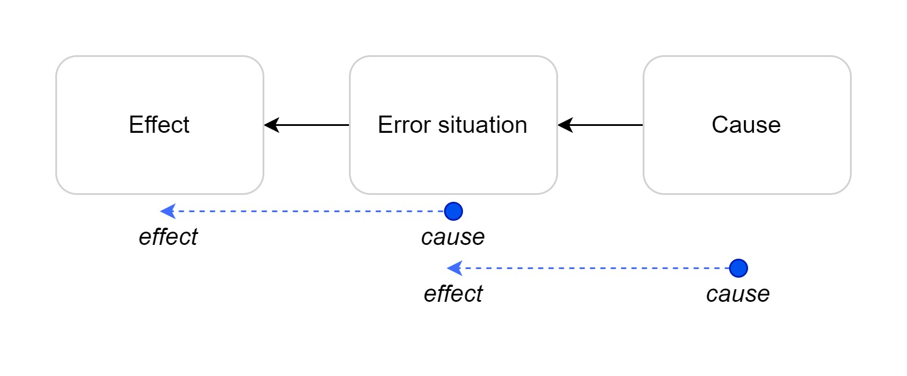

A chain of causes and effects can be established to better visualize the consequences of a problem. For instance, consider the figure <spanc/>\ref{fig:2023_fmea_printer_jam} depicting a malfunction scenario for an office printer.

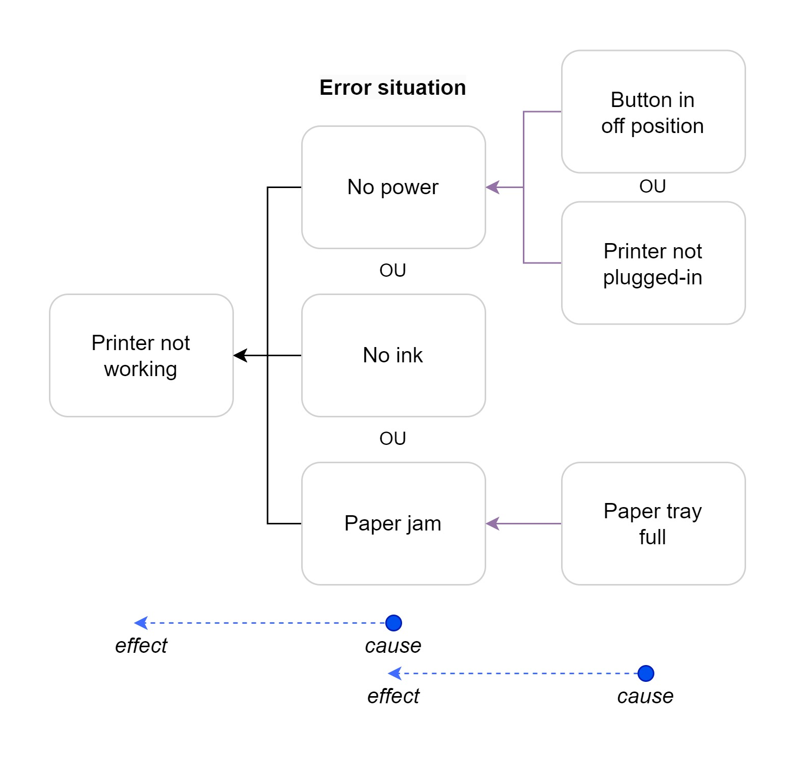

You can do the same with malfunction scenarios of software or infrastructure. Set up a table with 7 columns. For each hypothesized incident, the author should determine:

- **Error Situation**
  - E.g., "The software update failed on one of the servers".
- The **effects**
  - E.g., "Client requests reaching this server will fail. This represents 20% of our requests due to our load-balancing architecture".
- **Probability**
  - Rate from 1 to 10 the likelihood of the event happening ;
  - E.g., "3".
- **Severity**
  - Rate from 1 to 10 the severity of the problem should the event occur.
  - E.g., "7"
- **Detection Difficulty**
  - Rate from 1 to 10 the likelihood that the event won't be detected.
  - E.g., "1".
- **Risk Level**
  - Product of probability, severity, and detection difficulty ;
  - E.g., "(3\*7\*1) = 21".
- **Countermeasures**
  - Describe how to respond should the event happen ;
  - E.g., "Configure the load-balancer to exclude the server where the update failed. Roll back the software version. Restore the load-balancer to its initial configuration."

From this table, prioritize tasks for your teams to work on anticipating the most critical situations.

For infrastructure maintenance, a best practice is to create "incident sheets". Each includes a breakdown scenario, coupled with potential solutions. Typical breakdowns include running out of disk space, a poorly migrated database, or a failed backup export. Catalog them in your knowledge base (e.g., GitLab, Confluence).

### Structuring incident responses

If you are a small organization, start by formalizing your procedures to conduct an RCA and write postmortems. Then, gradually establish FMEAs and try to start your projects with premortems. Periodically, conduct FMEAs.

The decision to invest time in conducting premortems, FMEAs, or postmortems is governed by your priorities in terms of resilience. [Research](https://devops.com/real-cost-downtime/) shows that service downtime [can be costly](https://www.gremlin.com/ecommerce-cost-of-downtime/) for large organizations, averaging $500,000 to $1,000,000 per hour of unavailability[^CostDowntimeStudy].

## Reducing the cost of dhange

### Don't disrupt

DevOps is often portrayed as a disruptive organizational approach, meaning a paradigm shift in technologies and practices. To avoid intimidating the stakeholders of your transformation, instead present DevOps as an evolution of traditional technologies.

For instance, Windows 10 (released in 2015) is merely an [evolution of Windows NT](https://superuser.com/a/1744615/680804) 3.1 (released in 1993) and [still contains code](https://qr.ae/prvnxD) from the early days of the Windows NT architecture (designed in 1988)[^WindowsNT].

Here are some parallels concerning the Cloud:

- A container is just a more flexible tiny VM. It is managed with different commands, the nomenclature is different, but the concepts remain the same: an OS (image) from which the container is created, a configurable network, and the ability to add storage ;
- An orchestrator is just a hypervisor managed with different commands. But its components remain the same: configurable network policies between containers/VMs, storage management with VMWare's _datastores_ in place of Kubernetes' _PersistentVolumes_, or VMWare's _NSX Controller_ in place of Kubernetes' _Ingress Controller_ ;
- However, there are specific evolutions that one must simply accept (as with mathematical theorems). For instance, the use of good practices mentioned in the chapters "[A Foundation for Your Resilience](#a-foundation-for-your-resilience)" and "[12-Factor methodology](#12-factor-methodology)": favoring stateless services, using only micro-services, exposing one's activity logs differently... ;
- Micro-services are merely a division of traditional software into multiple independent blocks. Each block can be scaled according to user load.

Traditional VMs also have their place in a Cloud DevOps infrastructure; they can be part of it (see chapter "[Abandoning VMs?](#abandoning-vms)").

Along with these technological evolutions come methodologies to manage technical debt, accelerate deployments, and maintain a high level of resilience: a software forge, gitops, continuous integration, continuous deployment, postmortems... That's DevOps.

By implementing the methodologies covered in this book and using standardized administration technologies (e.g., Kubernetes), you will ultimately reduce administrative costs.

### Avoiding design mistakes

As discussed in the chapter "[Staying close to business needs](#staying-close-to-business-needs)", it's common to not meet the initially expressed need using traditional methods. Setting the requirement at a fixed point is not a reliable way to deliver the expected product. Needs continually evolve, and clients often can't articulate exactly what they need.

Agile methodology aims to reduce this risk by offering several short delivery cycles (_sprints_). After each cycle, the client provides feedback. This loop continues until the project suits the client or the contract ends. DevOps provides the tools for a company to streamline these interactions. In the most efficient companies, _sprints_ are merely a contractual detail to discuss progress: the software is already in production and ready to use.

On the contrary, this methodology avoids being trapped by clients too specific in their requests. Some are convinced of how software should be designed to best meet their needs. However, their suggestion might not be the most suitable option. Throughout your deliveries, the client will always have feedback or details they forgot to communicate. These details—big or small—accumulate over time and can lead to excessive delays.

If software is meant to deeply change its recipient's habits, delivering it early is necessary for them to gradually adapt to the imposed changes. They can, for instance, modify their internal procedures, hire the right profiles, and prepare their communication strategy. This will prevent frustrations and ensure a deliverable that closely meets business needs.

Avoiding this approach, especially with a very demanding client, can in extreme cases lead to projects that drag on for years. Or even worse, to abandoned projects. This will inevitably cause mutual frustrations among the team leader, the development team, and the client.

### Avoiding development errors

Human error is the primary cause of mistakes. That's why automation is a fundamental component of a DevOps mode organization. Continuous integration and deployment chains are particularly effective in streamlining the software delivery cycle.

If you currently feel friction in your production cycle, you likely need to invest time in automation. In mature companies, teams dedicated to developing automation tools for development teams exist. Their mission is to listen to developers to enhance their development experience. For example, they might develop internal tools that analyze added code to suggest readability or security improvements. At Google, an internal platform handles this kind of suggestion: if the code doesn't conform, a click is enough to reformat it. If a library is considered vulnerable, an alternative is suggested.

These tools generally speed up the development process and expedite code reviews to get the software into production as quickly as possible. These methods are especially effective when you regularly onboard new staff unfamiliar with your development practices. Inexperienced newcomers, without explicit and restrictive rules (like CI/CD pipelines), can quickly impact the quality of your codebase. A slight oversight, and a bug can quickly emerge.

Deployment techniques like _blue/green_ also reduce the risk of software regressions (see chapter "[Continuous deployment](#continuous-deployment-cd)").

### Design Thinking

Companies with a strong SRE/DevOps culture encourage innovations put forward by their team members. Thanks to techniques discussed in the previous chapter (CI, CD, _blue/green_, premortems, FMEA), it's fortunately possible to control the risks brought by these innovations.

To keep your employees motivated to achieve great things, it's crucial to avoid limiting their creativity or ideas. That's why _design thinking_ and the creation of prototypes are key techniques for an efficient organization.

_Design thinking_ is an innovation technique that merges creativity and method to try to solve complex problems. It comprises 5 phases:

1. **Empathize**: Start by meeting the end-user and immerse yourself in their environment to understand their challenges. This helps to set aside any preconceptions and gain an authentic perspective ;
2. **Define the Problem**: Clearly outline the problem you're trying to solve. Express it from the user's viewpoint, rather than describing what you'd like to achieve ;
3. **Ideate**: Now that the problem is identified, you can start brainstorming solutions ;
4. **Prototype**: Bring your idea to life with a prototype. Spot the weak points and find solutions, or move to another idea if the one you're testing isn't viable (refer to chapter "[Premortems](#premortems)") ;
5. **Test**: Evaluate your prototype in an environment that mirrors your target user's setting (refer to chapter "[Continuous Deployment](#continuous-deployment-cd)").

In summary, you need to put yourself in the user's shoes, and techniques like continuous deployment help streamline this process. When faced with reality, innovation isn't stifled by the organization.

If it fails, the organization learns more about its customer and environment. If it succeeds, it's a win for everyone: the innovation team, the organization, and the customer.

This prototype-driven culture is vital because a company that doesn't prototype launches fewer ideas, thus experiences fewer successes and takes longer to fail. Conversely, a company accustomed to testing its prototypes will fail faster and consequently achieve more successes.

You don't have to build the software from scratch before presenting it to the customer. You can create a mockup on Figma or Penpot, use a _low-code/no-code_ solution[^lownocode], or find someone to play the customer role.

### Continuous training

A good culture is nurtured by knowledge of cutting-edge techniques. The technical skills of your teams are the foundation of your organization and bolster your reputation as a resilient structure.

Continuous training is a straightforward way to prevent your organization from losing millions each year. Indeed, if your staff stays updated with the latest technologies, they're less likely to be deceived by third parties. These third parties often promise "the ideal solution" through impressive and ambitious presentations, which, more often than not, hide an underdeveloped or wholly deficient service. By staying updated, your team will make better decisions for your budget and the organization's future.

However, keeping pace isn't easy, especially considering how fast technology evolves. All the more reason to implement good training practices right from your employees' onset.

For instance, at Google, interns start with a full week dedicated to training. They get briefed on security best practices, administrative tasks they need to complete, and are introduced to internal technical tools. Later, like all employees, they must periodically complete awareness modules on a dedicated platform with written or video courses.

The _United States Air Force_ (USAF) has, since 2019, invested heavily in self-learning solutions. In a podcast[^DevSecOpsUSAirForce], its former Chief Software Officer, Nicolas CHAILLAN, explains how he deployed this system for over 100,000 developers. A web platform was launched with educational content specially selected or created by his teams. He added that an hour a day was allotted to employees to "catch up and stay updated on the latest technologies."

> "It _(training)_ is an investment for the company and for themselves. People who don't want to learn by themselves don't have much chance of succeeding in IT. Anyway, the industry moves so fast they don't have a choice." - Nicolas CHAILLAN

Following the USAF's footsteps, one successful approach I witnessed in one of my previous experiences was: we managed to get one day of remote work per week. It wasn't easy to get approval from our managers, but they finally granted it after understanding its benefits. This day was dedicated to our continuous training as AI, data, and DevOps experts. But we were equipped, and our progress was measurable: almost unlimited access to a Cloud service and an _e-learning_ platform. The latter allowed our management to see statistics on our training time and completed courses. The cost of these services was negligible compared to the knowledge they imparted.

If you already have technical teams, allow them to experiment and practice. From what I've observed, the most effective (hence profitable) approach for the organization is: invest time in training your staff. For instance, provide them access to machines or cloud hosting services to experiment with the latest innovations from the private sector or open-source projects. Your teams will be thrilled to have access to these services, while the management will be assured of receiving the best advice from updated employees.

It might be tempting to think that training staff in innovative technology - making them attractive to competitors - might encourage them to switch companies. Firstly, leaving just because of acquiring a new skill indicates limited prospects within their current company, reflecting already demotivated, thus less productive, personnel. Secondly, research suggests that staff training in their free time tend to look for other jobs more often[^TrainingTurnover]. The opposite is true when the company provides the training.

In any case, present your transformation as a career growth opportunity. And be honest with those who need to upscale: yes, it will require personal effort and time. But developing these new skills is worth it.

\newpage

## Leveraging automation

In increasingly complex information systems, it is essential to automate recurring tasks. Humans are the primary source of errors within an information system[^HumanErrorIS]. Any seasoned engineer will confirm this. That's why Google teams try to minimize operator interactions when managing their systems[^GoogleWorkbookEliminatingToil].

> « If a human operator needs to touch your system during normal operations, you have a bug. The definition of normal changes as your systems grow. » - Carla GEISSER, SRE at Google

If you want to make your IT system an integral tool within your company, you must first automate repetitive and time-consuming actions: manual tasks (or _toil_).

This notion of toil describes all manual, repetitive, and automatable tasks. Essentially, these are all the intellectually uninteresting tasks that a robot would be far better suited to do than your brilliant engineers.

Google's SRE teams aim to keep operational work (manual admin tasks) below 50% of the time for each SRE. At least 50% of each SRE's time should be devoted to engineering projects that will reduce the future amount of manual tasks or add functionalities to the infrastructure.

This process can begin with small things within your existing infrastructure. In this chapter, we'll categorize them based on organizational maturity levels. It's up to you to determine which level of automation is most suitable for your organization, based on the technological acculturation of your engineering teams and the time you want to allocate to implementing these technologies.

Keep this in mind: automation is the action that reduces technical debt. Make sure you give your teams enough time to work on it.

### Infrastructure as Code (IaC)

This popular term is easy to understand: it encompasses practices and technologies that make your infrastructure configuration explicit, in the form of computer code.

Here are some configuration examples:

- Setting the new time server for all your machines ;
- Updating software in production (see: chapter [continuous deployment](#continuous-deployment-cd)) ;
- Updating the wallpaper of all your machines ;
- Adding a new domain name.

Of course, when I mention "all your machines", IaC scripts allow you to specify which machines exactly, so changes are applied only to specific groups of machines.

This practice offers several benefits:

- **Documentation**: IaC scripts are written in programming languages or using standardized configuration files. The engineer reviewing the project can directly see how the configuration works and how to use or modify it.
- **Reliability**: IaC scripts can be executed by machines or humans, depending on the desired environment (development, staging, production) following algorithmic rules. There's nothing more reliable than code executed by a machine over a human. It's also possible to implement security checks depending on who runs these scripts.
- **Replayability**: every IaC script should be idempotent, meaning running the same script one or more times should produce the same effect on the infrastructure. This makes it faster to develop and modify compared to traditional scripts.
- **Versioning**: IaC scripts - like any other algorithm - can be versioned. This allows tracking their changes and being peer-reviewed by all technical teams over time.

Common technologies for these tasks include: Ansible, Terraform, Puppet, and SaltStack.

Each has its pros, cons, and community. Some complement each other. The key is to adopt a standardized format (not necessarily using only one technology) so your SRE teams can navigate it. A newcomer will greatly benefit from these practices, and your most seasoned engineers can incrementally improve these algorithms.

You can start by automating your infrastructures with basic scripts (bash, Powershell) and then move on to more advanced technologies like Ansible that will standardize your configurations.

Refer to the [GitHub project "ToDevOps"](https://github.com/flavienbwk/ToDevOps#2-deploying-infrastructure-services)[^ToDevOps] to see this technology in action.

For supervising and automating these admin tasks, advanced tools like _Ansible AWX_, _Ansible Tower_ (fig. <spanc/>\ref{fig:2020ansibletowerinterface}), _RedHat Satellite_, _Alcali_, _Uyuni_, or _Palantir Apollo_ might be worth considering, depending on your organization's maturity level.

![Interface displaying Ansible tasks launched in Ansible Tower. Extracted from the article by Stuart CUNLIFFE[^Ansible101] on IBM's blog.\label{fig:2020ansibletowerinterface}](./images/2020_ansible_tower_interface.png)

Remember that maintaining infrastructure is complex, so _keep it simple_! Don't rush to adopt the latest technology just because it's "sexy": the more technologies and abstraction layers you add, the larger and more experienced your team needs to be to maintain and fix it (see chapter "[Too big, too soon](#too-big-too-soon)").

### Test-driven development

Test-driven development (or _TDD_ for short) is a software development practice that dates back [to the early 2000s](https://en.wikipedia.org/wiki/Test-driven_development). The objective is to control software erosion[^SoftwareErosion], which means preventing regressions and managing technical debt over time. Put simply: it's about avoiding bugs as contributions accumulate.

The idea is to write tests before developing the actual functionality. The TDD development cycle is as follows[^BeckKentTDDBook]:

1. Add a test: Introducing a new feature begins with writing a test that passes if and only if the feature's specifications are met.
    - My personal recommendation: Write at least one passing test and one test that is supposed to fail. This helps understand the bounds of the use-case a test should cover.
2. Run all software tests: Your new test should fail at this point, since the responding function hasn’t been written yet.
3. Develop an initial version of the function: Whether crude or _hard-coded_, the goal is to have a function that meets the test as simply as possible. It will be refined in step 5.
4. Run all software tests: Every test, including yours, should pass at this point.
5. Refactor the code if needed, using tests after each change to ensure the functionality remains intact: Now that you’re confident the initial code (from step 3) meets the requirements, you can enhance it (e.g., breaking up the function, removing duplicated code, improving naming conventions).

This approach is common in tech companies, especially within giants like GAFA (Google, Apple, Facebook, Amazon). They rely on it to manage their technical debt, despite having thousands of developers contributing in parallel to their software daily. Most of the time, software is developed with few or no tests. It can be challenging to justify to non-technical superiors the time spent on test development instead of focusing on new features. While working with TDD might impact productivity, it significantly enhances code quality[^TDDStudy].

For legacy software, it's advisable to at least adopt the TLD (_test-last development_) approach, which means developing tests after the functionality has been created. Then, progressively transition to TDD to improve code quality and reduce complexity[^TDDoverTLD]. For new projects, prioritize TDD.

In all scenarios, the goal is to test your code to prevent unpleasant surprises in production. According to _Atlassian_[^WhatIsCodeCoverage], it's recommended to have 80% of your code covered by tests (referred to as _code coverage_).

TDD is recommended in certain scenarios but not all. For instance, if you operate in a regulated industry—like banking or healthcare—it’s imperative to test your code. Software malfunctions can impact your organization's legal liability. If your software is designed for long-term use and maintenance—as in defense—TDD is advised. However, if you're a start-up in the proof-of-concept phase, software malfunction consequences might be less severe, allowing you to prioritize productivity. As your organization grows and the number of contributors increases, testing becomes essential. For a new contributor, a test can serve as an example of how a function operates, aiding code understanding.

In essence, it's about striking a balance between productivity, functionality assurance, and technical debt control.

This chapter serves as an introduction to the importance of testing your code. Many complementary approaches and best practices concern software engineering more generally (see [YAGNI, KISS, DRY](https://henriquesd.medium.com/dry-kiss-yagni-principles-1ce09d9c601f)) rather than specifically DevOps. For instance, TDD can be supplemented with BDD (_behavior-driven development_) or ATTD (_acceptance test-driven development_)[^TDDBDDATTDComparativeStudy] if your organization's maturity and team size allow.

All these tests can be automatically verified before any production release. Let’s explore what this entails and how to implement it in the next chapter.

### Continuous Integration (CI)

Continuous Integration (CI) is a development practice within the software factory. The idea is as follows: with every code change, automated scripts are triggered to check the conformity of the contribution (fig. <spanc/>\ref{fig:ci-pipeline-gitlab}). This conformity can relate to security standards, verify software quality, or check prerequisites for production deployment.

For instance, your security teams may not have the time to validate the conformity of every contribution. They can then delegate part of these checks to scripts that will automatically and consistently ensure the codebase meets your security standards. The benefits are threefold:

- Your security engineers can work on higher value-added tasks
- The compliance with your security rules is no longer "dictated" but guaranteed by "coded" checks
- Developers see directly if their code is compliant and can immediately modify it if it's not

.\label{fig:ci-pipeline-gitlab}](./images/ci-pipeline-gitlab.png)

Thus, in a DevOps approach, security managers are no longer individuals setting rules on paper but [engineers "coding" security rules](#devops-security-engineer) in the form of automated scripts, within the software forge (fig. <spanc/>\ref{fig:2023_gitlab_job_example}). This ensures these rules are respected by developers and production.

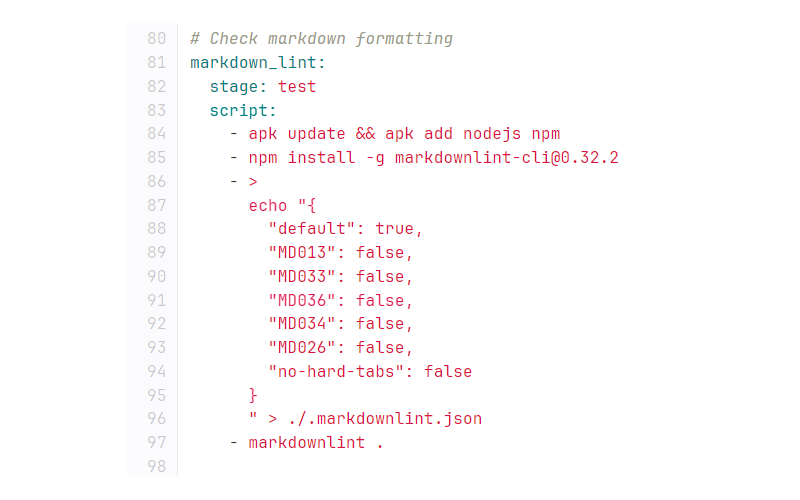

Here are some examples of algorithms that can be executed to automatically check rules or take actions upon a triggering event:

- Ensure the presence of documentation
- Ensure documentation follows the organization's defined formatting
- Verify that the documentation is up-to-date
- Ensure all environment variables are declared in the appropriate files
- Check that passwords haven't been mistakenly added
- Ensure the presence of a required configuration file
- Ensure code adheres to development and formatting standards (e.g., PEP8, black, pylint)

All these tasks contribute to reducing the technical debt of your codebase and facilitate the deployment of your projects, ensuring the effectiveness of the standards defined by your DevOps teams.

It's common to hear about a so-called continuous integration "pipeline", which accompanies other terms in the CI/CD tech universe. Let's define the most common ones:

- **Job**: a task/script triggered automatically upon an event ;
- **Pipeline**: a sequence of _jobs_ ;
- **Stages**: the three steps of a continuous integration _pipeline_ (_build_, _test_, _deploy_) ;
- **Build**: stage containing _jobs_ ensuring the code compiles correctly, and the Docker image builds properly with the directory contents ;
- **Test**: _jobs_ checking the code/contribution's conformity ;
  - Examples:
    - Ensure code maintainability: using tools like [_SonarQube_](https://www.sonarsource.com/products/sonarqube) or _linters_[^linter] such as [_black_](https://github.com/psf/black) for Python or [_KubeLinter_](https://github.com/stackrox/kube-linter) for Kubernetes configurations (cf. [OpenSSF Best Practices](https://bestpractices.coreinfrastructure.org/en/criteria/0), chapter ["Securing your software supply chain"](#securing-your-software-supply-chain)).
    - Check the contribution doesn't introduce security vulnerabilities: with software like _Quay Clair_, _Jfrog X-Ray_, _ClamAV_, or the OpenSSF _Scorecards_.
    - Ensure the code passes unit tests (cf. chapter ["Test-driven development"](#test-driven-development)).
    - Verify documentation conformity: As software evolves over time, code snippets in documentation might become outdated and dysfunctional. _Istio_ developed a tool[^IstioTestDocumentationTool] to automatically ensure these snippets are updated. It extracts them from the documentation's _Markdown_ files and converts them into testable executables.
    - Check the composition of a Docker container.
- **Deploy**: _jobs_ executing actions impacting the infrastructure or production (cf. chapter ["Continuous Deployment](#continuous-deployment-cd)").
  - Examples:
    - Deploy a software update ;
    - Add a compliant development dependency ;
    - Execute administrative actions.

As mentioned earlier, the advantage of a continuous integration pipeline is also to test the pushed code across multiple environments automatically: your development and pre-production environments before deploying to production. However, these multi-environment pipelines introduce additional complexity, which requires a larger technical team to manage.

Within a software factory, technologies such as _GitLab Runners_, _GitHub Actions_, or services like [_Circle CI_](https://circleci.com) are used to execute continuous integration tasks.

### Continuous deployment (CD)

Continuous deployment (CD) is a DevOps practice that allows the triggering of administrative actions or the deployment and updating of software in production. The triggering is not necessarily automated, but the applied actions are coded. This means they are predictable, traceable, and replicable. This reduces the time to provide a new feature to its users, minimizing manual intervention and the risk of errors by administrators.

This practice aligns with the principle of "continuous delivery", which encompasses steps prior to deployment. For instance, publishing the binaries or images of the software's latest version, or creating the latest _release_ of the project in the software factory.

Most of the time, continuous deployment pipelines are technically similar to continuous integration pipelines. For example, they replay tasks from continuous integration pipelines before deploying the software. However, they might require more specific parameters, such as environment variables or secrets (e.g., _Hashicorp Vault_, _Akeyless_, _Keywhiz_, _Conjur_). Indeed, deployed software often relies on environment variables to run correctly on a target infrastructure.

It is common to encounter different qualification/pre-production (_staging_) and production environments. These validate the proper functioning of software before its production release. Continuous deployment pipelines automate all or part of this process, optionally adding _smoke tests_ or functional tests (see chapter "[Test-driven development](#test-driven-development)").

Initially, the goal is to at least automate the update of your software in production. You can do this similarly to continuous integration pipelines, using _GitLab Runners_ or _GitHub Actions_.

More advanced practices exist for seasoned users. As discussed in the "[GitOps](#gitops)" chapter, our _git_ repository is the "single source of truth" for software. Therefore, infrastructure should ideally rely on it to determine the expected state of software in production. For instance, _ArgoCD_ continually checks for changes in a _git_ repository on a specific branch (often _main_ or _master_). When ArgoCD detects a change, it attempts to deploy the very latest version of the monitored software.

Tools like _ArgoCD_ (fig. <spanc/>\ref{fig:2022_argocd_interface}), _Flux_, _Spinnaker_, or _Jenkins X_ allow visual tracking of software deployment status. They shine in a Cloud environment, observing the state of each micro-service.

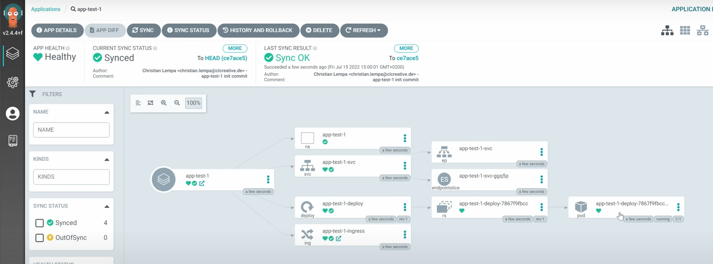

Built on the same mechanics, it's possible to deploy multiple instances of software simultaneously. For instance, during a code review in a _merge request_, you can [configure _ArgoCD_](https://www.youtube.com/watch?v=cpAaI8p4R60) to temporarily and independently deploy this "under evaluation" version of the software. This technique allows engineers to quickly test software, rather than deploying it themselves. The URLs often look like this: `wxyz.staging.myapp.com`.

Using these same tools, you can [adopt and automate a blue/green deployment strategy](https://dev.to/stack-labs/canary-deployment-with-argo-cd-and-istio-406d). This technique gradually shifts users to a new software version, ensuring it functions properly. The idea is to instantiate the new software version (green) alongside the current one (blue). The system then directs a limited proportion of users to the new software (e.g., 10%). This proportion is gradually increased over a set period, while measuring the error rate for each request. If the rate is the same or lower than the previous deployment, the software is rolled out to all users. Otherwise, deployment is canceled, and the old version remains in production.

Even more advanced tools exist to address large-scale deployment challenges. We'll explore Palantir's Apollo as an example in the chapter "[Deploying simultaneously in different environments](#deploying-simultaneously-in-different-environments)".

Moreover, continuous deployment pipelines are not limited to software deployment or administrative task launches. They can be the starting point for monitoring your software. For instance, a continuous deployment pipeline can set up a _Prometheus / Grafana_ instance and start sending its activity logs. Deploying your software doesn't mark the end of your infrastructure's resilience cycle: now you need to monitor it. We'll delve into these techniques in the chapter "[Measure Everything](#measuring-everything)".

\newpage

## Measuring everything

In the previous chapter - "[Leveraging automation](#leveraging-automation)" - we saw how automation greatly saves time in managing our infrastructure and enhances its security and resilience.

In this chapter, we'll discuss a significant dimension of automation: observability. It's through measurements that systems can be massively automated, and better decisions can be made organization-wide. Measuring everything achieves three objectives:

1. Technical and commercial teams can know the state of a service at any time (operational, partially accessible, down) ;
2. Technical teams can analyze data to pinpoint issues and attempt to resolve them (see chapter "[Organizing incident response](#organizing-incident-response)") ;
3. With these data insights, technical teams can assist commercial teams in making better decisions for the organization.

Trusting decisions based on its own data marks the culmination of a successful DevOps transformation. The industry calls this "data-driven decision making."

### The 3 pillars of observability

Activity logs (_logs_), metrics (_metrics_), and traces (_traces_) are regarded as the three pillars of observability. These three types of data can be generated by software to identify and address issues that might arise once deployed.

Observability is a vast topic in the realm of system reliability[^DistributedSystemsObservabilityBook]. In this chapter, we will only touch upon the essentials.

The field of observability can be summarized as the set of tools and practices that allow engineers to detect, diagnose, and resolve system issues (bugs, latencies, availability) as swiftly as possible. Beyond the need for resilience, the collection of some of this data is sometimes legally required[^ANSSIGuideJournalisation].

Let's delve deeper into what each of these data types can tell us:

- _logs_: Immutable and timestamped records describing specific events over time. For instance, "_[MySoftware] jdupont accessed the URL /users/login at 18h55m14s_". The code generating a log entry is usually manually added by a developer within the software ;
- _metrics_: Numerical representations of phenomena measured over time, such as the number of requests, response times, or resource usage (RAM, CPU, disk, network) ;
- _traces_: A kind of _log_ that follows the path of an operation (e.g., a request). A trace is a set of _logs_ with additional information to trace an operation across the various services it traverses. Each stage and sub-operation traversed is termed a span (_span_). Logs for a trace are typically generated automatically.

Let's focus on traces to better grasp their implications. Consider an application (a client) sending a request to a REST API (a server). A trace consists of _spans_ and metrics, associated with a unique identifier. This ID differentiates the path of our request as it moves through all the services it touches. Figure <spanc/>\ref{fig:2023_trace_basic_example} illustrates an example.

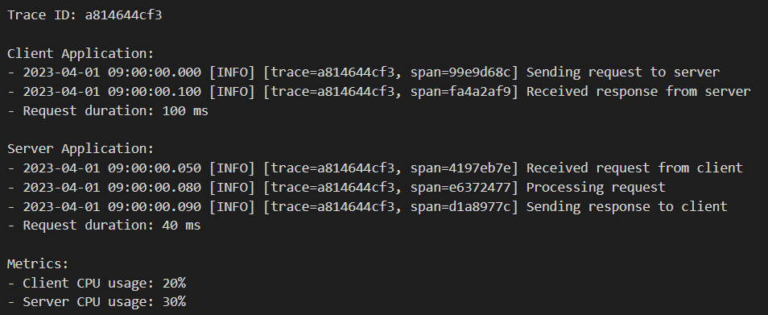

To better visualize the request's timing, the _logs_ of a _trace_ are often displayed in a diagram. Each _span_ is represented by a rectangle including a name (on the left) and a duration (within the rectangle), as depicted in figure <spanc/>\ref{fig:2022_jaeger_trace}.


<!--
```txt
Trace ID: a814644cf3

Client Application:
- 2023-04-01 09:00:00.000 [INFO] [trace=a814644cf3, span=99e9d68c] Sending request to server
- 2023-04-01 09:00:00.100 [INFO] [trace=a814644cf3, span=fa4a2af9] Received response from server
- Request duration: 100 ms

Server Application:
- 2023-04-01 09:00:00.050 [INFO] [trace=a814644cf3, span=4197eb7e] Received request from client
- 2023-04-01 09:00:00.080 [INFO] [trace=a814644cf3, span=e6372477] Processing request
- 2023-04-01 09:00:00.090 [INFO] [trace=a814644cf3, span=d1a8977c] Sending response to client
- Request duration: 40 ms

Metrics:
- Client CPU usage: 20%
- Server CPU usage: 30%
```
-->

Traces are independently relayed by libraries like OpenTelemetry's SDK. These are then sent to a trace collector such as Jaeger, Tempo, or Zipkin for validation, cleansing, and/or enrichment. They are subsequently stored in centralized log servers like Prometheus or Elasticsearch. The trace identifier allows us to retrieve the chronology of the operations it underwent.

The biggest challenge of tracing is its integration within an existing infrastructure. To fully utilize traces, every component the request goes through must emit a log and propagate the tracing info. Tracing via a _service mesh_ might be a quick way to avail tracing features without altering the software code[^ServiceMeshTraces]. We'll explore what a _service mesh_ is and how this technology works in the chapter "[Service Mesh](#service-mesh)".

Within vast infrastructures, logs and traces might be too extensive for timely ingestion by their log server. Data can then be lost. To avert this, it's common to use services that stagger the indexing. A server like Kafka can be positioned in front of the log server to gradually absorb logs. Then, a tool like the [_Jaeger Ingester_](https://www.jaegertracing.io/docs/1.42/architecture/#ingester) steadily indexes them. For _rsyslog_ logs, protocols like RELP[^RELP] might be necessary to ensure proper storage.

Whether using [Logstash](https://www.elastic.co/logstash/) or [Loki](https://grafana.com/oss/loki/) for logs, or [Jaeger](https://www.jaegertracing.io/) or [Tempo](https://grafana.com/oss/tempo) for traces, normalizing your data is crucial for proper storage and processing. To address this challenge, the [OpenTelemetry library](https://opentelemetry.io/docs/concepts/what-is-opentelemetry/) defines semantic conventions[^OTSemanticConventions]. It's commonly used.

By implementing observability mechanisms, you'll be better equipped to answer questions like "_what caused this bug to happen?_". Your engineers can rely on comprehensive data to fix bugs faster. This data will enable us to construct our [resilience indicators](#resilience-indicators), leading to more informed decisions.

### Knowing When to Innovate and When to Stop

At first glance, it's not clear where to draw the line between resilience and innovation. The idea is to measure the state of services to determine when it's appropriate to innovate.

Measurement is one step, but it's crucial to measure the right things, at the right level. In a distributed infrastructure, one of the servers can fail without necessarily affecting the availability of software for your customers. Measuring a server's availability might be interesting for your technicians, but it may not be the right metric to determine the impact of a malfunction on the user. This is something your organization needs to define:

- What metrics indicate a service that is functioning "properly"?
- What downtime percentage do you allow?

For the second question, you can't answer "100%". If you put all your efforts into keeping the service available 100% of the time, you'll slow down the release of new features. And it's these features that propel your project forward. That's where the concept of an "error budget" comes in.

The error budget is the amount of time within a given period that your company allows for your teams, during which your services can be unavailable. As long as your service availability exceeds the allowed downtime, you can take the opportunity to deploy a significant new service, highly interactive with others, or even update a critical system. But this budget is crucial for addressing hardware malfunctions requiring replacement or for intervening in a system during a planned outage.

For instance, if your error budget is 54 minutes per week, and you haven't exceeded 10 minutes in the past three weeks, allow yourself to take more risks. If it's the opposite, work on making your infrastructure more resilient.

In short, the error budget is an agreement between management and the technical teams, helping to prioritize innovative efforts versus work to enhance infrastructure resilience.

It enables engineering teams to reassess goals that might be too ambitious concerning the acceptable risk. This way, they can set realistic goals. The error budget allows teams to share responsibility for a service's resilience: infrastructure failures impact developers' error budget. Conversely, software failures affect the SRE teams' error budget.

Be mindful of your error budget consumption peaks: if an engineer spends ten hours instead of one to fix an incident, it's advisable to open a ticket with someone more experienced. This will prevent consuming the entire error budget.

To answer the first question, let's look at the possible indicators to monitor in the next chapter.

### Resilience indicators

#### The 4 golden signals

Monitoring distributed systems presents a real dilemma. SRE teams need to monitor them effortlessly - allowing quick interventions - even though their architecture is often complex. Indeed, various technologies make up these systems. The 4 key signals offer a unified method of characterizing the most vital phenomena to watch.

Let's explore the four metrics that will allow us to create our resilience indicators:

1. Latency: the time the system takes to respond to a request.
    - It's essential to distinguish between successful requests and failed ones. For instance, if your systems return server errors quickly (e.g., HTTP 500 code), it doesn't mean your system is healthy. Therefore, you should filter your latency measurements by excluding error responses.
2. Traffic: the number of requests coming into a system.
    - Usually expressed in requests per second or MB/s for data streams.
3. Errors: the rate of failed requests.
    - Requests can fail "explicitly" or "implicitly". Explicit errors might return an HTTP 500 code, for example. Implicit errors could return an HTTP 200 code, but the content is not as expected.
4. Saturation: the extent to which your system's resources are used.
    - Resource utilization rate compared to the maximum load your system can handle. It helps answer questions like "_Can my server handle client requests if the traffic doubles?_" or "_When is my hard drive likely to be full?_". It's based on measurements of RAM, CPU, network, and I/O usage.

Within a Cloud infrastructure, a _service mesh_ automates the collection of these measurements. We'll explore this technology in the "[Service mesh](#service-mesh)" chapter. We'll also discuss tools available to gather and visualize these metrics. But before that, let's see how to create our resilience indicators in the next chapter.

#### SLI, SLO, and SLA

The value of your error budget stems from your _Service Level Objectives_ (SLO).

An SLO defines a target resilience level for a system. It is represented as a ratio of "good" events to be honored, out of all monitored events, over a specific time period. For instance, your SRE team may set the following objective: "_99% of pages should load in under 200ms over 28 days_."

The "right" objective of an SLO is determined by the threshold of tolerance your customer can bear against an annoying issue. For example, quantify what it means for them to experience a "slow" website (e.g., through an SEO study[^SEO]). If your clients typically leave your pages after waiting more than 200ms, set your SLO to "_99.9% of responses should be returned in under 200ms, over 1 month_."

A good SLO should always be close to 100% without ever reaching it; we discussed the reasons for this in the chapter "[Knowing When to Innovate and When to Stop](#knowing-when-to-innovate-and-when-to-stop)." As for how often you should achieve this target (99.9% over 1 month), there's no initial rule to define it. You can base it on the average of your past measurements or experiment. This value should match the workload your team can handle.

SLOs are built upon one or more "Service Level Indicators" (_Service Level Indicator_ or SLI). The SLI is the current rate of good events measured, from all considered events, over a given period. Built on one or more measurements, it measures one aspect of a system's resilience. It characterizes a phenomenon that can negatively impact your user: response time to a query, the number of up-to-date returned data, or even read and write latency for data storage.

Here are some examples to clearly differentiate which SLI an SLO is based on, and which measurement(s) an SLI relies upon:

- **Phenomenon: Page load time**
  - SLO: 99% of pages should load in under 200ms over 28 days (objective).
  - SLI: Rate of pages loaded in under 200ms over 28 days (percentage).
    - Good event criterion: Any page loaded in under 200ms ;
    - Event consideration criterion: Any page loaded after 0ms and not exceeding the timeout duration.
  - Measurement: Page load time for each request (in milliseconds).
- **Phenomenon: Visitor conversion**
  - SLO: 10% of unique visitors should click the registration button on the homepage each quarter (objective).
  - SLI: Conversion rate of visitors out of all visitors over a quarter (percentage).
    - Good event criterion: A unique visitor (IP) clicked the registration button ;
    - Event consideration criterion: Unique visitors (IP) of the homepage.
  - Measurement: Visitor page visits and clicks.
- **Phenomenon: Valid HTTP responses**
  - SLO: 99.9% of HTTP responses should have a code < 500 over 1 week (objective).
  - SLI: Rate of HTTP responses with code < 500 out of all HTTP responses over 1 week (percentage).
    - Good event criterion: Any HTTP response with a code < 500 ;
    - Event consideration criterion: Any HTTP response with a code not between 300 and 499.
  - Measurement: Count of HTTP responses < 500 every 5 minutes.
- **Phenomenon: Server operational state**[^UptimeVsAvailability]
  - SLO: 99.9% of ICMP requests should be < 100ms over 1 week (objective).
  - SLI: Rate of responses < 100ms to ICMP requests over 1 week (percentage).
    - Good event criterion: Any request completed in under 100ms ;
    - Event consideration criterion: Any duration over 0ms and not exceeding the timeout duration.
  - Measurement: Response durations to ICMP requests (in milliseconds).
- **Phenomenon: File upload speed**
  - SLO: 99% of files under 10Ko should be uploaded in under 100ms over 1 week (objective).
  - SLI: Rate of files under 10Ko uploaded in under 100ms over 1 week.
    - Good event criterion: Any file under 10ko uploaded in under 100ms ;
    - Event consideration criterion: Any uploaded file under 10ko that didn't fail.
  - Measurement 1: Uploaded file sizes (in Ko).
  - Measurement 2: File upload durations (in milliseconds).

An SLI can be composed of one or more measurements. However, avoid creating overly complex SLIs or SLOs, as they might represent vague or misleading phenomena.

An SLO sets a service quality to maintain, which means a certain value for an SLI. An SLO takes a format like: "_SLI X should be maintained Y% of the time over Z days/months/years_." Here's a table correlating resilience rate and maximum allowable downtime (the "Z days/months/years" part of the previous example):

| Resilience Rate    | Per year   | Per quarter  | Per month (28 days)  |
| ------------------ | ---------- | -------------| -------------------- |
| 90%                | 36d 12h    | 9d           | 2d 19h 12m           |
| 95%                | 18d 6h     | 4d 12h       | 1d 9h 36m            |
| 99%                | 3d 15h 36m | 21h 36m      | 6h 43m 12s           |
| 99.5%              | 1d 19h 48m | 10h 48m      | 3h 21m 36s           |
| 99.9%              | 9h 45m 36s | 2h 9m 36s    | 40m 19s              |
| 99.99%             | 52m 33.6s  | 12m 57.6s    | 4m 1.9s              |
| 99.999%            | 5m 15.4s   | 1m 17.8s     | 24.2s                |

If SLOs should primarily represent your users' pain points, you can also establish them for your internal teams. For instance, your infrastructure could ensure each server responds "_99% of the time in under 500ms to ICMP requests over 1 week_." In this case, determine your SLOs based on your historical measurements (see fig. <spanc/>\ref{fig:2023_grafana_slo_eb}). For instance, if 99% of your ICMP requests responded in under 300ms last month, set the SLO to "_99% of ICMP requests should respond in under 300ms over one month_."

.\label{fig:2023_grafana_slo_eb}](./images/2023_grafana_slo_eb.png)

SLOs should be defined in collaboration with decision-makers. Their involvement in this definition is essential for them to understand how their decisions (e.g., prioritizing tasks, workload demands) impact the resilience of the infrastructure. If a decision-maker wants engineers to frequently and quickly roll out new features, SLOs help understand when the imposed pace is too demanding. Conversely, consistently exceeding SLOs suggests that your company can move faster without compromising service quality. The participation of decision-makers is all the more critical as they sometimes stake the company's reputation on the line. It's the SLA that is the root cause of this.

The Service Level Agreement (SLA) is a contract between your organization and a client. If your service quality falls below what your SLAs dictate, your organization faces penalties. An SLA is built on one or more SLOs, setting intentionally lower resilience rates for safety. Here are some examples:

- Below 99.9% availability, Google starts refunding its [_Google Workspace_](https://workspace.google.com/terms/sla.html) clients. Between 99.9% and 99% availability, 3 extra access days are added to the client's account. Below 95%, it's 15 days ;
- Below 99.5% availability, AWS begins refunding its [EC2 instance](https://aws.amazon.com/compute/sla) clients. Between 99.9% and 99% availability, the client is refunded 10% of their expenses. Below 95%, they're refunded in full (100%) ;
- Below 99.9% availability, Microsoft starts refunding its [_Teams_ customers](https://www.microsoft.com/licensing/docs/view/Service-Level-Agreements-SLA-for-Online-Services?lang=13). Below 99.9%, the client receives a credit amounting to 25% of their expenses. Below 95%, they get a credit for 100% of their expenses.

SLAs are not mandated by law. However, they can be part of your service contract to clarify your commitments and avoid disputes. Indeed, it's always preferable to list clear terms both you and your client have agreed to. SLAs also serve as a competitive edge: your company commits to a certain quality of service, whereas your competitors might not. Implementing an SLA in your governance approach holds stakeholders (developers, SRE, decision-makers) accountable and shares expectations. The company now pivots based on the metrics it gathers and interprets as SLOs. This is referred to as being _data-driven_.

Within an institution, you can use SLO/SLA as a means to gain credibility among your superiors or specific teams. An SLA might justify hiring necessary personnel to maintain a certain service level. Or it could warrant a budget increase to enhance the team's operations. Conversely, superiors might demand a certain service quality level from your teams, reflecting in the annual objectives of staff members. For pilot projects, establishing SLOs is sufficient. Setting reliable SLOs is a challenge in itself. Maintaining those objectives is another.

#### Alerts and percentile aggregation

Your alerting mechanisms must continuously monitor your SLIs to ensure they don't exceed your SLOs. And most importantly, that they don't surpass your SLAs! But how do you raise an alert before your SLOs/SLAs are breached?

Take this SLO as an example: _99% of pages must load in under 200ms over 28 days_.

The simplest method is to calculate the average page load time over a short period. For instance, the average load time over 5 minutes. When set to this approach, your alerting mechanism triggers if, over the past 5 minutes, the average load time exceeds 200ms.

However, basing alerts on averages or medians is not ideal. This approach might miss widespread failures. Google recommends another method[^SLOSREBook] using percentiles. This distribution method highlights trends among the top X% of gathered measurements.

Imagine your infrastructure serving millions of users, handling billions of requests. A faulty page, affecting only a few hundred users on your site, might go unnoticed if you rely on averages or medians. But with percentile aggregation, you can spot these anomalies more clearly (fig. <spanc/>\ref{fig:2023_percentiles}).

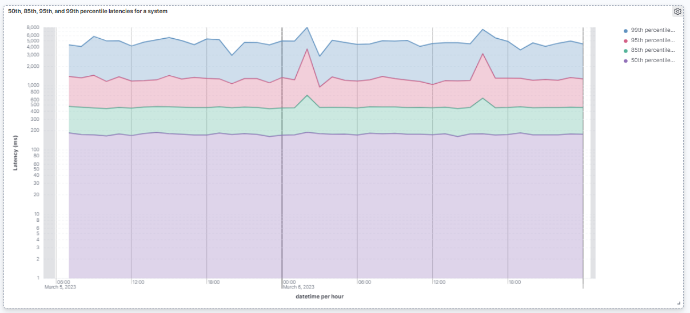

With this depiction, we can deduce that, on average, request latency is at or below 200ms (the 50th percentile, purple section, represents the median). More intriguingly, it allows us to understand that 5% of requests (starting from the 95th percentile, red section) are 2.5 times slower (~500ms) than average. Your SRE team can now investigate why latency is high for these requests.

Now, let's focus on another phenomenon: on March 6th, shortly after midnight, the top 1% of the slowest requests (99th percentile, blue section) spike to 8000ms latency compared to the usual 5000ms. Something is amiss: your alert system can detect this anomaly more easily, and your SRE team can better isolate and investigate the affected requests. When observing just the median (50th percentile), these trend changes appear smoothed out, almost imperceptible.

Given these insights, we can enhance one of the indicators from the previous chapter:

- **Phenomenon: Page load duration**
  - Measurement: Load duration of a page for each request (in milliseconds) ;
  - Classic SLI: Percentage of pages loaded in under 200ms over 28 days ;
  - Classic SLO: 99% of pages must load in under 200ms over 28 days ;
  - Advanced SLI: Percentage of pages loaded in under 1000ms in the 95th percentile over 28 days ;
  - Advanced SLO: 99% of pages in the 95th percentile must load in under 1000ms over 28 days.

To develop your intuition regarding these indicators, start with classic SLIs and SLOs. Once your infrastructure matures – especially in user count – you can shift to advanced SLIs and SLOs.

#### MTTx

MTTx refers to metrics that qualify the average time it takes for an event to occur or conclude. The "x" in the acronym MTTx represents the multiplicity of these types of metrics. For instance, MTTR (_mean time to recovery_ or average time to restore) is used to track how long a team takes to restore a failing system.

Monitoring these metrics over time allows you to gauge the effectiveness of your resilience efforts. It also helps in assessing the efficiency of your teams in responding to incidents. If the metrics deteriorate, you will need to examine the reasons and possibly reshuffle your priorities so as not to compromise your SLOs. The advantage is that you will know what to focus on.

There are numerous MTTx in literature, each with their particularities and nuances (fig. <spanc/>\ref{fig:2023_MTTx_timeline}). Let's look at the most popular MTTx:

| Metric  | Full Name                                                            | Explanation                                                                                                                                                                                                                                                                                                                                                                                                                                                                                                                   |
| ------------------------ | ------------------------------------------------------ | ------------------------------------------------------------------------------------------------------------------------------------ |
| **MTTD** | _mean time to detect_ or average detection time                     | The average time between the onset of an incident and when your systems trigger the alert. Detecting an incident may take a few seconds when a significant issue arises. But it might take several weeks if it affects only a solitary user who does not report the problem... until they can't manage it anymore.                                                                                                                          |
| **MTTA** | _mean time to acknowledge_ or average time to acknowledge           | The average time between an alert trigger and assigning personnel to address the incident.                                                                                                                                                                                                                                                                                                                                                                          |
| **MTTI** | _mean time to investigation_ or average investigation time          | Once the incident is acknowledged, the average time required for the designated person to genuinely understand the problem and how to fix it. A high MTTI suggests that your infrastructure or application is too complex, or your observability mechanisms are lacking. It might also indicate that your engineers are swamped, making it difficult for them to address an incident promptly.                                                                           |
| **MTTR** | _mean time to recovery_ or average recovery time                   | The average time between the alert and the problem resolution.                                                                                                                                                                                                                                                                                                                                                                                                    |
| **MTTP** | _mean time to production_ or average time to production            | The average time for the service affected by an incident to be operational and accessible to users in production. Unlike MTTR, which measures the repair time of a service, MTTP measures the service restoration time after its repair. For instance, during a breakdown, your website might display a "We are under maintenance" message even if you've just fixed the failing service.                                                           |
| **MTBF** | _mean time before failure_ or average time between failures        | The average time between the last detected failure and the current one. This metric helps predict a service's availability.                                                                                                                                                                                                                                                                                                                                      |

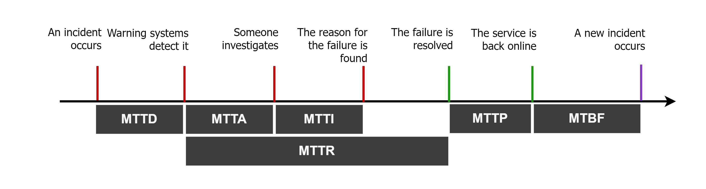

\newpage

You can begin tracking your MTTx using collaborative spreadsheets (e.g., _Baserow_, _NocoDB_, _Google Sheets_) and later transition to more integrated tools like _Jira Service Management_ or [_Odoo_](https://www.odoo.com/fr_FR/app/maintenance). The idea is to be able to compute and visualize the trend of your MTTx over time.

If you choose a spreadsheet, you can use the following structure:

<!-- markdownlint-disable MD034 -->
| Metric | Start Date          | End Date            | Incident                |
| ------ | -------------------- | -------------------- | ----------------------- |
| TTD    | 04/07/2024 16h45 UTC | 04/07/2024 16h50 UTC | abcd.com/C4D5E6         |
| TTA    | 04/07/2024 16h50 UTC | 04/07/2024 17h00 UTC | abcd.com/C4D5E6         |
| TTI    | 04/07/2024 17h00 UTC | 04/07/2024 17h20 UTC | abcd.com/C4D5E6         |
| TTR    | 04/07/2024 17h00 UTC | 04/07/2024 18h30 UTC | abcd.com/C4D5E6         |
| TTD    | 02/06/2024 13h30 UTC | 02/06/2024 13h34 UTC | abcd.com/A1B2C3         |
| ...    | ...                  | ...                  | ...                     |
<!-- markdownlint-enable MD034 -->

- The **metric** denotes the MTTx name ;
- The **start date** indicates when the event began ;
- The **end date** represents when the event ended ;
- The **incident** column can reference an incident ID or link to the postmortem.

Calculate your MTTx by averaging the differences between start and end dates for each incident. Sample over a calendar month period.

As you can see, most of the metrics can be derived from your postmortem. They are intrinsically linked to it and complement it. Ensure to keep your MTTx updated to quantify your resilience level and pinpoint critical areas affecting it.

### Service mesh

Despite its very tangible and practical application, the _service mesh_ or "service grid of services" can seem complex at first glance.

Let's approach it through some challenges that illustrate its significance:

- "Our software is written in 6 different languages, and we don't have a unified way to gather telemetry (application logs, error logs, metrics)." (topic: observability) ;
- "We have 70 system administration teams, and getting them to implement TLS between all their services would be an organizational nightmare." (topic: security, encrypted flows) ;
- "We have hundreds of containers running on multiple geographically distributed machines with no unified way to analyze network latencies." (topic: observability) ;
- "We're experiencing slowness in our service usage and can't determine if it's a network or software issue." (topic: observability) ;
- "We have no means of assessing if a newly deployed software version introduces slowdowns." (topic: observability, _canary_ or _blue/green_ deployments).

Thanks to the standardized deployment mechanisms offered by container orchestration systems (e.g., Kubernetes), a _service mesh_ can address these challenges by "plugging into" your orchestration system. It can enhance the security, stability, and observability of your infrastructure by:

- Managing security certificates in one place ;
- Handling advanced authorizations in the administration of network flows ;
- Controlling network flows with rules (_A/B testing_, _canary_ or _blue/green_ deployments, [request rate limits](https://istio.io/latest/docs/tasks/policy-enforcement/rate-limit/#rate-limits)) ;
- Distributing network load equally among services (_load balancing_) ;
- Automatically gathering network metrics based on the "[4 golden signals](#the-4-golden-signals)" (latency, traffic, errors, and saturation), regardless of where the pods are deployed (see _Istio Dashboard_[^IstioDashboard]) ;
- Collecting application access logs (see _Istio access logs_[^IstioAccessLogs]) ;
- Providing details on the routing of requests across pods distributed over multiple nodes (see _Istio distributed traces_[^IstioDistributedTraces]).

As these metrics are standardized, most _service meshes_ allow for their use in setting up automatic rules based on the network activity of the infrastructure (fig. <spanc/>\ref{fig:figure-6}).

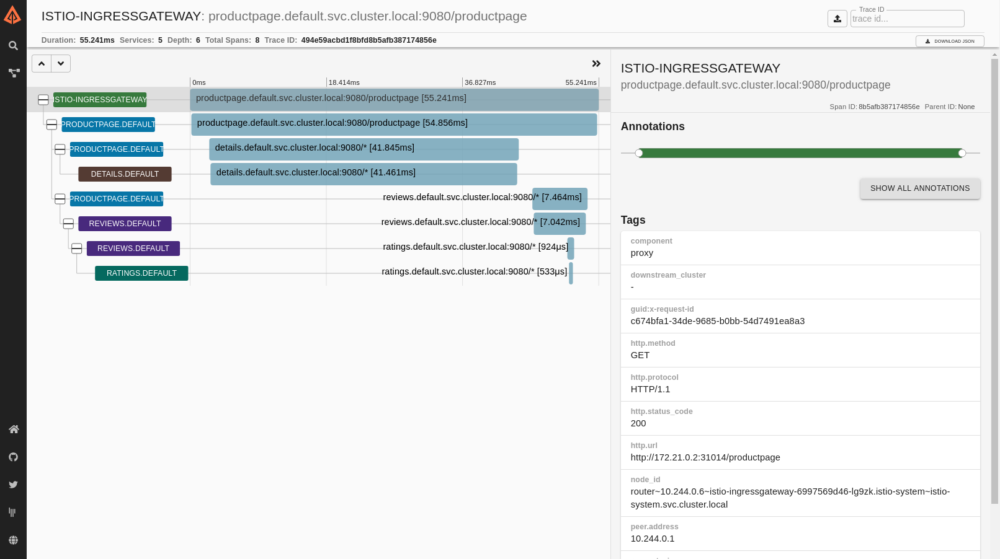

In summary, a _service mesh_ manages all or part of the following aspects: network traffic management, flow security, and network observability (fig. <spanc/>\ref{fig:figure-5}). This leads to better infrastructure security, improved auditability, and reduced service disruption.

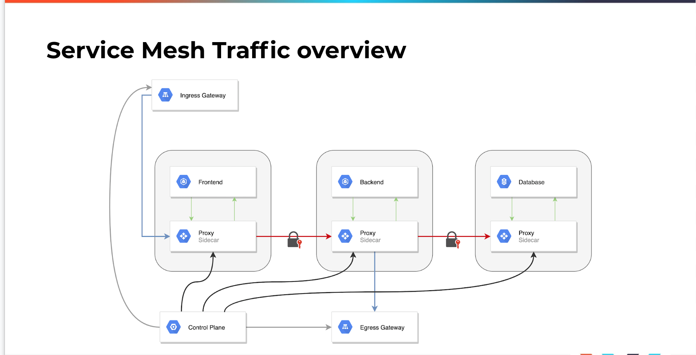

> An overview of the workings of a service mesh: "proxy" containers are added to each pod to manage interactions with the _service mesh_.[^WeaveWorksServiceMeshArticle]

Technically, a _service mesh_ will install on your orchestration software (e.g., Kubernetes) and attach a container called _sidecar_ to each _pod_ (group of containers/application). This sidecar acts as a network proxy, managing the above-mentioned interactions with the _service mesh_.

However, a _service mesh_ is not lightweight technology: it requires internal administration and training (for both developers and administrators) before you can reap its benefits. Don't expect a technology that reduces your system administrators from 50 to 5 to be manageable by only 2 people. Service meshes are undoubtedly beneficial, but ensure you're sized to manage them.

Several _service meshes_ are available, each with its strengths and weaknesses. Take your time to compare them before selecting one. For instance, Linkerd[^Linkerd] is easier to deploy than Istio but offers fewer features. Consul[^Consul] is another alternative.

### Extensions to simplify infrastructure

As described in the chapter "[A Foundation for Your Resilience](#a-foundation-for-your-resilience)", Cloud platforms offer the advantage of including a variety of services that cater to common security and monitoring needs. These services automatically handle features that historically were tedious to develop individually for each software or for the infrastructure itself.

Using CRDs[^CRD] or by deploying the Helm[^Helm] configurations of _Cloud native_[^CloudNative] tools, it is possible to easily "install" foundational services within a Kubernetes cluster. Here's a non-exhaustive list of services that can be natively supported in your cluster and managed centrally:

1. Centralization of application and network logs and traces (see [Filebeat](https://www.elastic.co/beats/filebeat), [Fluentd](https://www.fluentd.org/) (fig. <spanc/>\ref{fig:kibana_logs}), [Loki](https://grafana.com/oss/loki/), [OpenTelemetry](https://opentelemetry.io/), [Jaeger](https://github.com/jaegertracing/jaeger), [Tempo](https://grafana.com/oss/tempo/), [Zipkin](https://zipkin.io/))

    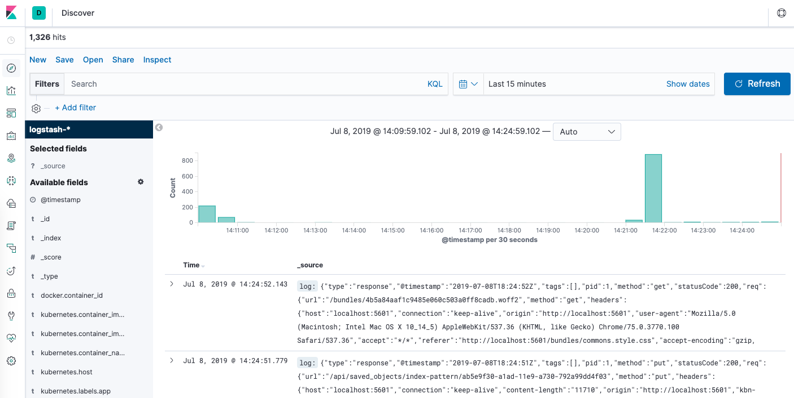

2. Centralization of performance metrics of cluster nodes and containers (see [Mimir](https://grafana.com/oss/mimir/), [Metricbeat](https://www.elastic.co/beats/metricbeat), fig. <spanc/>\ref{fig:grafana_loki_metrics})

    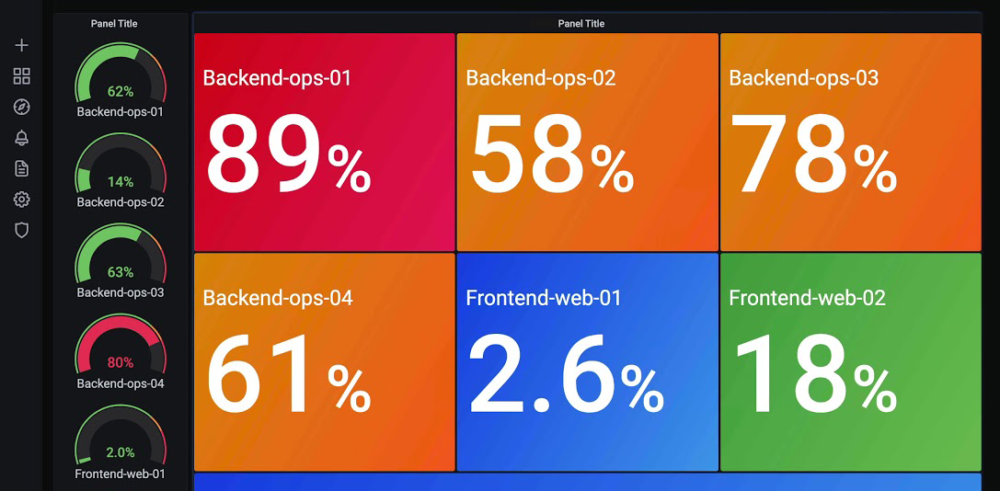

3. Antivirus analysis of node and container content (see [Docker Antivirus Exclusions](https://docs.docker.com/engine/security/antivirus/), [Kubernetes ClamAV](https://cloud.google.com/community/tutorials/gcp-cos-clamav))

4. Detection of suspicious Linux system call behaviors (see [Sysdig Falco](https://github.com/falcosecurity/falco))

5. Control and audit of cluster configurations (see [Gatekeeper](https://github.com/open-policy-agent/gatekeeper) (fig. <spanc/>\ref{fig:gatekeeper_k8s_resource_refusal}), [OpenSCAP](https://www.open-scap.org))

    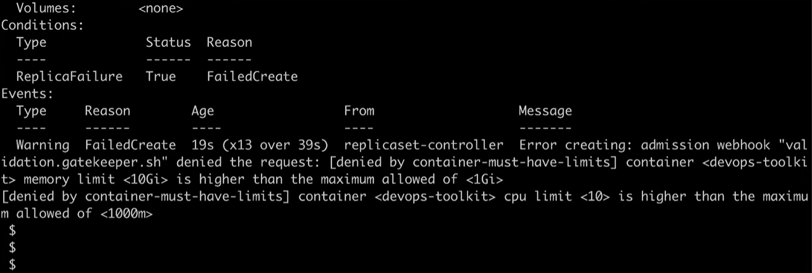

6. Management of application secrets (passwords, tokens) (see [Vault](https://www.vaultproject.io/) (fig. <spanc/>\ref{fig:hashicorp_vault_ui}), [Sealed Secrets](https://github.com/bitnami-labs/sealed-secrets)[^SealedSecrets])

    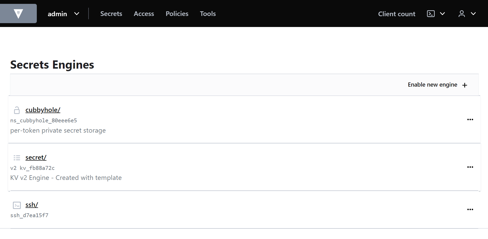

7. Automated backup of persistent volumes (see [Velero](https://velero.io/docs/v1.10/))

8. Encryption of network traffic between containers (see chapter "[Service Mesh](#service-mesh)", fig. <spanc/>\ref{fig:istio_kiali_tls_communication))

    

9. Management of security certificates (see chapter "[Service Mesh](#service-mesh)")

10. Management of web service authentication (see [Istio Ingress Gateway](https://medium.com/@senthilrch/api-authentication-using-istio-ingress-gateway-oauth2-proxy-and-keycloak-a980c996c259), [Keycloak](https://www.keycloak.org))

Integration and automation are the fundamental characteristics of a Cloud foundation. Once again, in DevOps, it's believed that something not automated won't be used.

The technologies mentioned above automatically interface with the deployed software. In the Cloud, it's not the software's job to interface with the foundation's technologies, but rather the foundation interfaces with the software.

# Leveraging available resources

## Finding ambassadors for your project

The project manager is responsible for doing everything necessary to ensure the project meets its objectives. They often play the role of a _product owner_ - a term defined in the Agile methodology - who acts as a liaison between technical and business teams. They are the one who "sells" your project to its users.

It's vital for this role to be close to both the end-users, to understand business challenges, and to the technical team to grasp engineering stakes.

Sometimes, project managers tend to "over-promise" timelines. This practice creates stress for teams and ultimately leads to client frustration. Indeed, clients are promised a tool that will only be delivered later. Thus, it's essential to manage expectations.

> "Under-promise, over-deliver"

To accelerate the adoption of your solutions, invite a business representative to your presentations. If this person is convinced by your product, they might be inclined to present it themselves, explaining its significance in their daily work.

Getting clients to vouch for you is the best way to gain credibility. It proves that your solution meets a current need. By illustrating a use case, your audience can quickly envision how they might use your tool. If you want to convince a hard-to-reach audience, a client testimonial is your best ally.

Try to establish a strong network of a few "ambassadors" (product advocates) within your organization to assert your legitimacy and support your initiative. Besides this support, the ambassador will help capture user feedback or provide it themselves to refine your value proposition.

## Reservists or "20% project"

In the private sector, especially among the GAFAM[^GAFAM], it's common for employees to get one day a week dedicated to participating in a different project within the company. One day out of five, they choose to work for another team. This option benefits both the employee and the company: the employee explores different technologies and practices, enhances skills in those areas, and then leverages this knowledge for other projects they handle.

Another example is the ["10% program"](https://www.10pourcent.etalab.gouv.fr/) by DINUM[^DINUM] and INSEE[^INSEE]. Based on volunteering, the aim is for public service agents to dedicate 10% of their working time to common interest projects[^Programme10p].

Try to offer your hierarchy this possibility so that each employee can benefit from this program: this will encourage exchanges, bring the teams closer together and build loyalty among your employees by allowing them to discover and work on new subjects.

To take advantage of all the resources at your disposal, consider employing reserve personnel within your team if your organization allows it. Even if they are only present a few days a year, they can support you on specific tasks. For example, an information systems security reservist will help you complete certification. A data scientist to evaluate an artificial intelligence solution or provide one-off support on a complex dataset to process.

## Public/private synergy: a win-win approach

Major organizations today primarily rely on services provided by industrial partners for their technical projects. This might be due to a lack of in-house experts, a lack of human resources, or both. It's a mistake to simply trust the industrial partner thinking, "they are the experts, everything will work, I just need to pay." Anyone who has led an industrial program has faced challenges with stakeholders understanding the business stakes (project managers vs. business vs. industrial partners) and has seen that a project never goes 100% according to the planned blueprint.

It's a strategic error to believe that merely paying a service provider will get you the solution you expect. If you're not a technical expert in the field who has practiced recently, you'll never be at a level to effectively challenge your provider's proposals. You risk either not addressing your business challenges, losing money, or likely both.

This is why it's crucial to have in-house, within your own teams, experts who are practitioners on the topic you want to develop. They are the only ones capable of critically assessing your service provider's proposals to save you time and prevent you from being tricked with features that have exorbitant costs or unrealistic promises.

Every DevOps and SRE engineer knows: it's impossible for a system to function 100% of the time. That's why you cannot expect from a service provider, regardless of the price you pay, to deliver something 100% functional.

For instance, even Google [does not promise more than 99.9% availability (SLA)](https://workspace.google.com/terms/sla.html)[^GoogleWorkspaceSLA] with its capitalization of over 1.6 trillion dollars and its approximately 150,000 rigorously selected employees. Amazon (AWS) with its capitalization of more than 1.4 trillion dollars does not guarantee [more than 99.5%](https://aws.amazon.com/compute/sla)[^AWSSLA].

### Better organization to avoid failure

The traditional approach of institutions working with industrial partners resembles "waterfall" developments: a major meeting is set up to gather requirements, a technical and functional specification document is drafted to structure the contract, developments are then undertaken, and the final product is delivered, concluding the contract.

Given the intense dynamics of the digital realm, this method is suboptimal. The average lifespan of software doesn't exceed 3 to 5 years[^TimeToOutdatedSoftware], even if periodic updates are provided.

Consider this scenario: you are tasked with equipping your organization with a new digital tool.

- If you've reached the point of initiating this project, it's likely the need for this tool arose several months or even years ago ;
- You then gear up to compare existing solutions in the market and engage with an industrial partner, which can take between 1 to 3 months ;
- Once you've chosen your industrial partner, you arrange a meeting between stakeholders and the industry experts to help them understand the challenges and your expectations ;
- Drafting the specification takes an additional month. Some back-and-forths to refine it: +1 month ;
- You'll likely need to get approval for this new tool to comply with your organization's IT security policies: even if conducted concurrently, this will likely add another month ;
- Contract finalization also takes 1 month. Development lasts between 3 to 6 months (potentially more, depending on the specifications) ;
- Presentations and operational verification: 1 month ;
- Deployment: an additional 2 weeks to 2 months, depending on your IT security policies and available networks.

In the end, the entire process might take roughly a year, and you've yet to place the tool in the users' hands. At this point, you can't even be sure it meets the need, considering that the stated requirement often differs from the actual requirement.

Finally, when the users get their hands on the tool, unfortunately, it might not fully meet the needs, might be impractical, and your colleagues might prefer the old tools they are familiar with.

Such an approach is untenable today. One of the tenets of DevOps is the ability to "fail fast," iterate frequently, and swiftly arrive at a version that meets requirements. In this context, the DevOps methodology advises against rushing into a "fully fleshed out" specification. Start with an initial version, fail, iterate, and perfect the tool alongside your customer.

Remember this principle? "Break down organizational silos by involving everyone": it's vital to engage your customers throughout the project lifecycle. If you don't frequently consider their feedback, the end product might be misaligned. Even if it does meet their needs, it might be too complex and thus unappealing.

Thus, if you aim to work efficiently with an external company, you should bring all project-related stakeholders closer. Ensure everyone's voice is heard by establishing an easy and practical communication tool for feedback and suggestions. For instance, you could ask the industrial partner to grant access to their software factory (e.g., GitLab, BitBucket, GitHub) for your teams to provide comments, and for engineers to address them in a feedback loop.

GitLab also supports continuous deployment, allowing the industrial partner to provide clients with a URL to access the latest version of the software. This way, you avoid lengthy meetings and achieve flexibility. The goal is met: you iterate, quickly.

.")

> The figure <spanc/>\ref{fig:figure_3} showcases the Kanban view in GitLab, where comments on software (tasks, feedback, bugs...) are consolidated.

If you can't influence your collaboration practices with the industrial partner, at the very least, internally organize to have a collaborative project management tool. For instance, use software like _Atlassian Confluence_ (see fig. <spanc/>\ref{fig:figure_4}) to create an internal knowledge base.

.")

> Kanban view in Atlassian Confluence showing consolidated comments on software (tasks to be done, feedback, bugs...).

For instance, the _ITZBund_ (German Federal Center for Information Technology, akin to France's ANSSI[^ANSSI]) has been using the open-source software _Nextcloud_[^NextcloudITZBund] in its _Bundescloud_ (inter-ministerial cloud) since 2018. It enables file sharing and collaboration on a unified platform. Roughly 300,000 institutional and industrial users employ it. A year later, the French Ministry of the Interior also adopted it[^NextCloudMinint].

This practice is a win-win for everyone: clients experience shorter delivery times, end-users get a tool that better fits their needs, the industrial partner sees the potential for renewed contracts with satisfied clients, and taxpayers get value for their money. Overall, everyone saves time, is pleased with the outcomes, and feels more engaged in every interaction.

# Measuring the success of your transformation

It is crucial to measure the efforts you invest in your initiative. This allows for a factual assessment of the effectiveness of your decision-making. Of course, initially, it's not uncommon to witness a degradation in performance since you are altering routines, meaning the organization's equilibrium. If you notice a decline in the metrics over time, you know you need to adopt a different strategy to reverse the trend (see chapter "[Knowing when to innovate and when to stop](#knowing-when-to-innovate-and-when-to-stop)").

According to research, an organization's technical maturity can quadruple its team's performance[^DORATechnicalCapabilities]. Let's explore some indicators used in the industry. These indicators are frequently debated but still seem to be the widely accepted reference.

The success of a DevOps initiative is measured using 4 theorized measures (_4 key metrics_[^DORAsFourKeyMetrics]). An additional fifth measure reflects the organization's operational performance. These metrics showcase results at the overall scale of your IT systems and your organization rather than just software measures. The latter might stem from local improvements, compromising overall performance. Let's dive into them:

- **Deployment Frequency** (_deployment frequency_): For the primary software or service you are working on, how often does your organization deploy code to production or make it available to its users?
- **Lead Time for Changes** (_lead time for changes_): For the primary software or service you're working on, how long does it take to get it into production (i.e., the time from validated code to functioning code in production)?
- **Time to Restore Service** (_time to restore service_): For the primary software or service you are focusing on, how long does it typically take to restore the service when an incident or fault impacting users occurs (e.g., an unplanned outage or degraded service)?
- **Change Failure Rate** (_change failure rate_): For the primary software or service you're working on, what percentage of production updates or new version releases lead to service degradation (e.g., deterioration or service interruption) and subsequently require fixes (e.g., a _hotfix_, a _rollback_, a fix delay, a _patch_)?

All these measures are based on the infrastructure's availability rather than its resilience. DORA report researchers subsequently posed a new question to organizations in 2021[^DORA2021Summary]. This led to the introduction of a fifth metric:

- **Operational Performance** or Resilience (_operational performance_ or _reliability_): Evaluating the ability to meet or exceed resilience targets. The expected responses regarding resilience goals for this measure are: "often meets them", "meets them most of the time", "always exceeds them". This can be gauged, among other things, by SLOs (see chapter "[Resilience Indicators](#resilience-indicators)") or a user satisfaction rate.

If you are starting your initiative from scratch, comparing yourself to industry performance might not be relevant. Keep them in mind to know what goals to aim for but don't judge your success based on them. Gauge it based on the progression of your own measures over time. Everyone starts from an initial state with the aim to improve it.

The DORA 2022 report classified the surveyed organizations into three performance categories (low, medium, and high) for its four key measures:

| Measure                          | Low                          | Medium               | High                              |
| -------------------------------- | ---------------------------- | -------------------- | --------------------------------- |
| Deployment Frequency             | Between 1 and 6 every 6 months | Between 1 and 4 per month | On-demand (multiple times a day) |
| Lead Time for Changes            | < 6 months                   | < 1 month            | < 1 week                          |
| Time to Restore Service          | < 1 month                    | < 1 week             | < 1 day                           |
| Change Failure Rate              | 46% - 60%                    | 16% - 30%            | 0% - 15%                          |

GitLab even allows for [real-time visualization of these metrics](https://gitlab.com/gitlab-org/gitlab/-/value_stream_analytics) starting from version _12.3_ (fig. <spanc/>\ref{fig:2023_gitlab-value-stream-analytics}).

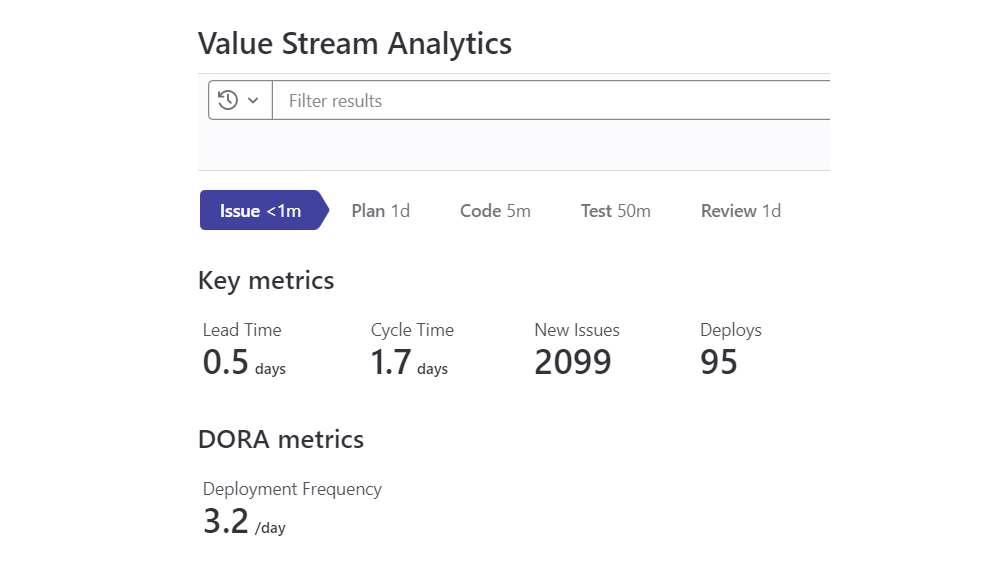

If you have a relatively recent version of GitLab or have set up continuous integration pipelines, you can measure most phenomena. Otherwise, ask your teams to record events on a collaborative interface (e.g., _Google Sheets_, _Airtable_, _Atlassian Confluence_, _Baserow_, _NocoDB_).

Added to these measurements is one I call the "**resilient collaboration trend**" (_resilient collaboration trend_ or RCT). It captures the essence of a DevOps initiative in my view: succeeding in continuous innovation while maintaining low technical debt and providing the most available service possible. The following factors are multiplied to total the value of the **resilient collaboration index** (RCI):

1. Number of days since the software's creation (number) ;
2. Number of contributors to the software since its creation (number): These first two factors determine the company's ability to maintain software that is maintainable over time, easy to grasp and modify. That is, its ability to maintain low technical debt ;
3. Number of successful deployments in the quarter (number): This factor determines the company's ability to innovate regularly, from code writing to production ;
4. Quarterly software availability in production (%): This factor determines the company's ability to provide a stable service to its users.

We then observe and compare the trend of this index over time. It is this trend that can be compared to other projects.

For example, the GitLab project[^GitLabGitLab] - one of the largest collaborative open-source projects - displayed a resilient collaboration index of `155 711 413` in Q2 2022, `188 809 628` (+17.5%) in Q3, and `202 865 477` (+7%) in Q4. The latter, with `4102` days since the creation of the git project (October 9, 2011 - January 1, 2023), `2474` [contributors](https://gitlab.biterg.io/app/kibana#/dashboard/3e297c20-622c-11e9-8638-c11f0f1aa3fa), `20` software releases, and an average availability of `99.95%`[^GitLabAvailability]. The project was thus less agile in Q3 than in Q4 (-10.5%).

This index should be updated every quarter. This time interval can be shortened or extended depending on the maturity of your organization: the more confident you are in your ability to deploy regularly, the shorter your measurement interval can be. E.g., over a semester, a quarter, a month, or a week.

Unlike the SRE, which relies on specific measurements (e.g., "[The 4 golden signals](#the-4-golden-signals)", "[Resilience indicators](#resilience-indicators)"), the DevOps lead has some freedom to choose the measurements that seem most relevant to them. That is, those that best assess the service they provide to internal teams. However, the _modus vivendi_ between DevOps and SRE is the "deployment lead time": both strive to make this parameter as satisfactory as possible.

# Integrated DevOps platform

## Deploying simultaneously in different environments

Your organization is sometimes tasked with deploying software in environments as diverse as they are unique. If you're lucky, these environments are few and connected. But things get complicated when the number starts to grow and they're isolated. It becomes essential to find a standardized way to deploy updates while minimizing delays.

Built on Kubernetes, Apollo is the product used by Palantir to deploy and keep its services up to date across all its client bases. With hundreds of engineers, over 400 software products, and thousands of deployments every day, Palantir boasts deploying its services across a hundred different computing environments (AWS, GCP, Azure, classified private clouds disconnected from the internet, edge servers with intermittent connections...)[^GregDeArmentInterviewApollo].

Driven by the constraint of regularly deploying on varied infrastructures, work on Apollo began in early 2015. It was progressively rolled out to its clients from 2017 and has been commercially available since the start of 2022, powering Palantir's internal infrastructure. The product's philosophy is to interface with your existing infrastructure and services (software forge, continuous integration engine, artifact registry...)[^PalantirApolloWhitepaper].

The company operates under the belief that software engineers and SREs each have their areas of expertise. On one hand, software engineers have a better understanding of how and when the software they develop should be updated. On the other, SREs are more familiar with the specifics and constraints of the environments in which they deploy[^PalantirApolloBlogCD]. Thus, software engineers develop the code, Apollo deploys it, and the SREs monitor to ensure everything went as planned.

That's why Apollo's interface primarily showcases two menus: "Environments" (SRE-oriented) and "Products" (software engineer-oriented).

- The "Environments" menu allows connection to different environments, defining deployment strategies across multiple environments (e.g., GCP, AWS, Azure, on-premise) and channels (see _release channels_), setting software quality and security criteria, and approving infrastructure changes ;
- The "Products" menu ensures that a software's new version is correctly deployed: Apollo automatically manages _blue/green_ deployments (see chapter "[Continuous deployment](#continuous-deployment-cd)") and rollbacks. It enables the declaration of update strategies by specifying which service needs updating before another (see the following chapter "[Constraint-based deployment](#constraint-based-deployment)").

Connected to _git_ repositories, it allows tracking and approving any code modifications before deployment.

Lastly, Apollo offers centralized monitoring of the status of services deployed across all your environments from a single platform. Whether connected to your favorite observability service (e.g., _Datadog_, _Prometheus_, _Pagerduty_) or operating independently via the _Apollo Observability Platform_, it incorporates feedback of all sorts of measurements (_logs_, _metrics_, _traces_) to investigate incidents in detail.

## Constraint-based deployment

With Apollo, Palantir introduces the concept of constraint-based continuous deployment[^PalantirConstraintBasedCD]. Apollo deploys an agent in each environment, reporting the real-time status of that environment to determine how updates should be deployed. This means Apollo knows both the expected state of deployments on infrastructure and the real-time, up-to-date state of these deployments.

Considering modern applications often rely on external services, this mechanism helps avoid incompatibilities between different versions of an app deployed across varied environments.

For instance, if application `foo` version `1.1.0` requires the service `bar` to be deployed at version `1.1.0`, Apollo won't update `foo:1.1.0` until `bar:1.1.0` is available and deployed. The deployment of a new version of an application, dependent on a specific version of another, is often manually managed, even if continuous deployment is in place. Teams first ensure the dependent service (`bar:1.1.0`) is available and deployed before deploying its new version (`foo:1.1.0`). These dependencies are recorded in a specific file within the same project as the application's source code.

Another example is database schema migration. By declaring a database schema version compatible with a specific application version, Apollo prevents deploying an app incompatible with a database yet to be updated. For instance, if `foo:1.1.0` only supports the `V2` schema of `bdd:V1`, `foo:1.1.0` will only be deployed once `bdd:V1` has migrated to `V2`. This way, Apollo knows which version of an application is eligible for deployment in which environment.

# Distribution of initiatives

In 2016 surveys, 47% of organizations claimed to adopt a DevOps approach. This number rose to 74% in 2021[^RedGate2021Report].

From 2019 to 2022, the distribution of DevOps initiatives by industry remained roughly the same[^DORAIndustry]: primarily dominated by the tech sector (~40%), followed by the financial sector (~12%) and e-commerce (~8%). The institutional sector accounted for 2% to 4% of these initiatives, indicating ample room for innovation in this domain.

Here's a breakdown of companies practicing DevOps in 2022[^INSEECompanySizeDefinition]:

- Large enterprises (>= 5000 employees): ~30% ;
- Medium-sized enterprises (>= 250 and < 5000 employees): ~38% ;
- Between 20 and 250 employees: ~26% ;
- Less than 20 employees: ~6%.

The 2019 crisis accelerated digital transformation initiatives, leading to a 23% growth in DevOps team sizes[^GlobalUpskillingWorldwideDevopsSize] during that period.

In 2022, the geographical distribution of organizations adopting DevOps practices is still challenging to pinpoint. However, North America seems to be a major hub, accounting for about 33% of DevOps initiatives. Europe and Asia follow closely with approximately 33% each[^DORAGeoRepartition] (with India at 21%). In 2019, North America accounted for 50% of these initiatives, Europe 29%, and Asia 9%. This indicates a growing interest in the subject among Asian countries.

The average size of DevOps teams remains small, averaging around 8 members[^DORATeamSize].

This positions DevOps as a methodology primarily adopted by companies that have reached a critical mass and is yet to gain traction in non-tech businesses.

# Conclusion

Transforming an organization, regardless of its size, is a complex task involving significant political, technical, and human challenges. Should this transformation fail, the consequences can be severe. At the same time, it's crucial for your organization to consider the long-term implications of continuing with its current model. DevOps aims to minimize these risks through standardized methodologies and tools.

Research and the experience of thousands of businesses today allow us to understand the challenges related to transitioning organizations to the Cloud. Having proven its effectiveness, institutions are gradually shifting their focus to DevOps, although few have fully embraced it yet (see chapter "[Distribution of initiatives](#distribution-of-initiatives)"). One major hurdle remains in sourcing talent in this area, but the foremost challenge is to persuade the leadership.

Several strategies can be adopted depending on your hierarchical and technical position. The most common is to start with a pilot project that addresses internal needs (e.g., deploying software co-developed with your business teams). This can attract initial internal partners (see chapter "[Internal team model](#internal-team-model)").

Provide services promptly to demonstrate the efficiency of your approach compared to traditional methods (e.g., software better suited to needs, streamlined deployment, quick response to incidents...). Once the early adopters are convinced, have them testify during your presentations to decision-makers. Business teams often agree to do this, feeling indebted for the services you've provided. With such a powerful impact, you can gradually rally a community to elevate your vision (see chapter "[How to convince and keep faith](#how-to-convince-and-keep-faith)").

Facilitating change is primarily about minimizing risks undertaken. Starting small and iterating is the best approach to success. Moreover, by understanding the psychological and technical realities behind a transformation project, you'll have all the tools and arguments for a quicker and less perilous transition (see chapter "[Initiatives within organizations](#initiatives-within-organizations)"). Presenting Cloud technologies and DevOps as evolutionary rather than disruptive techniques is an effective way to persuade.

Like major corporations that constantly invest in new technologies, every organization must be willing to take risks to remain competitive. Your executive committee should remain open to surprising perspectives and encourage experimentation.

For instance, it's vital not to underestimate the potential of employees deemed challenging to manage. Some might be the visionaries that will define your future. Seriously considering the impact of their ideas is essential, lest you miss critical opportunities for the organization's future (see chapter "[Breaking down organizational silos](#breaking-down-organizational-silos)").

While business teams you assist see immediate benefits, this value is often more abstract for the leadership. As the instigator of a transformation, you need to invest time in familiarizing organizational decision-makers. Don't hesitate to start with basic Cloud concepts and gradually clarify the implications of DevOps for stakeholders. It's crucial to provide examples of how you've addressed internal dysfunctions with your approach.

The initiator should always be prepared to answer the following questions:

- Why do we need to change?
  - Provide specific examples of dysfunctions within the organization.
- What's the benefit of this approach for our organization and my mandate?
  - Quantify the amount of time or money this approach could save.
  - Explain how the image of the decision-maker could be enhanced by your project.
- What will this transformation cost us (in terms of equipment, HR, time) and what is its ROI?
  - Quantify the investment required for this transformation.
  - Present your transformation plan: training schedule, contracting plan, equipment purchasing plan.
- What does the rest of the organization think?
  - List the strengths and weaknesses of the approach. This requires having consulted internal teams for their perspectives.

With the leadership convinced and granting you both technical and political resources, the journey is only beginning! Don't advertise capabilities you don't yet master. Start by providing access only to a subset of willing users and establish your procedures (management, administration, incidents).

Your initiative will inevitably face challenges initially. Welcome feedback graciously and enhance your services. Once confident in the service reliability, expand its deployment and communicate extensively.

You'll soon notice that operational or business priorities often sideline infrastructure work (Cloud/DevOps) in favor of product developments (software). Yet, research shows that structuring around these proven methods enhances long-term efficiency (see chapter "[Why DevOps?](#why-devops)"). Ensure you allocate time for resilience work in your engineers' schedules.

A DevOps infrastructure realizes its full potential once connected to your organization's main network. This is when it can deploy frequent updates, respond quickly to incidents, and consolidate your teams' work. If your project began on an isolated platform, focus now on connecting where your users are present (see chapter "[The pillars of devops in practice](#the-pillars-of-devops-in-practice)").

Measuring the effectiveness of one's initiative over time is critical: both to ensure that one is moving in the right direction without dogmatism, and to provide quantifiable arguments to superiors or teams that still need convincing. Make sure to maintain a clear dashboard of these indicators (see chapter "[Measuring the success of your transformation](#measuring-the-success-of-your-transformation)").

Tools such as ChatGPT based on LLMs offer as many new opportunities (e.g., [GitLab Duo](https://about.gitlab.com/gitlab-duo/), [GitHub Copilot](https://github.com/features/copilot)) as they introduce new threats (internal skills, _deepfakes_). Concurrently, security standards will continue to evolve at a breakneck pace. This advocates for a transformation of organizations towards a more agile digital universe. The future is shaping today, and the companies that will succeed best are those that manage to leverage the latest technologies and integrate them into their software development cycle (see chapter "[Refusing the technological lag](#refusing-technological-lag)").

Beyond the speed at which technology evolves and as with any area of expertise, this type of infrastructure requires the maintenance of the skills necessary to administer it.

We can easily imagine that a fighter pilot maintains his or her flying skills. Why would it be any different for engineers who maintain critical software vital to the institution's operation? You and your teams must continue to stay ahead by training regularly (see chapter "[Continuous training](#continuous-training)").

In DevOps mode, organizations can afford to fail faster, with controlled risk, to innovate ahead of their competitors.

# "Ops" Terminology

Now that you understand the array of challenges in DevOps, it's insightful to explore some terms that one might come across in the field.

You've probably already heard numerous terms suffixed with "Ops": in industrial proposals, job offers, or online services. All these terms describe specialties in computer system operations using various techniques and methodologies. Let's define a few:

- **DevOps** (Development and Operations): A methodology aiming to bridge the gap between developers and the engineers handling production to expedite software deployment and enhance its resilience.
- **DevSecOps** (Development, Security, and Operations): A subset of DevOps focusing on integrating security principles from the onset of a new software or infrastructure design. The goal is to organize the company in such a way that the Security of IT Systems teams are involved in all project discussions with your development teams (see [Security: a new paradigm with the DevOps approach](#security-a-new-paradigm-with-the-devops-approach)).
- **ITOps** (IT Operations): A set of practices centered on the maintenance and management of IT systems. This is subtly distinct from DevOps, which concentrates more on improving the software development and deployment process. Synonymous with system administrator (sysadmin).
- **FinOps** (Financial Operations): A collection of practices to better understand and manage the financial costs of a cloud infrastructure. This includes monitoring and optimizing expenses, as well as managing billing and payments, possibly using dashboards or automated algorithms.
- **MLOps** (_Machine Learning Operations_): Practices for collaboration and communication between _datascience_ teams and production teams for effective development and deployment of _machine learning_ (ML) models. The aim is to enhance the speed, quality, and resilience of ML models by automating and standardizing used technologies. (See _MLOps: Overview, Definition, and Architecture_[^MLOpsPaper])
- **GitOps** (_Git Operations_): A set of guidelines for using _git_[^git] as the single source of truth to standardize development practices, deployment, and to bolster a company's IT resilience ([IaC](#infrastructure-as-code-iac), [CI/CD](#continuous-integration-ci), see [The lifecycle of modern software](#the-lifecycle-of-modern-software))
- **EmpOps** (_Employee Operations_): Tools to manage a company and its employees (projects, vacations, 1:1 interviews, knowledge base) on a unified platform (e.g., CRMs).
- **DataOps** (_Data Operations_): Practices[^DataOpsManifesto] that assist in managing data, considering it a strategic asset. They emphasize collaboration between "data" teams and other IT teams, automating data management processes (ETL), and regular feedback to ensure data meets business needs.
- **DevDataOps** (_Development and Data operations_): A variation of DataOps tailored for organizations adopting a DevOps approach for their software developments. In a DevDataOps approach, data management practices are integrated into the software development lifecycle, facilitating coordinated and efficient management of data and code. (See _From DevOps to DevDataOps_ [^DataOpsPaper])
- **EdgeOps** (_Edge Computing Operations_): _Edge computing_ (or "edge processing") is a decentralized IT architecture model where data management/transformation occurs close to where it's collected/generated. This contrasts with the traditional model where data is processed only on a remote server, optimizing network bandwidth. EdgeOps incorporates certain DevOps principles into this infrastructure (e.g., zero trust, air-gapped monitoring).
- **ChatOps** (_Chat Operations_): A domain advocating for the use of instant messaging tools to facilitate software development and maintenance. The idea is to quickly and easily converse with peers (e.g., easy-access messaging, file or image import capabilities, visibility of time flows...).
- **LiveOps** (_Live Game Operations_): Refers to all activities ensuring the smooth operation and maintaining excitement around a video game. Informally, it's about "keeping the hype" for the game. Activities include: monitoring player count, playtime or reviews, fostering customer engagement, organizing tournaments, and providing player support.

The emergence of these terms denoting specialties or practices in IT infrastructure administration is likely tied to the maturity the industry has achieved thanks to Cloud services. These services have greatly streamlined infrastructure administration, paving the way for advanced optimization discussions.

Each of these specialties is a way to optimize your DevOps practices and should adapt to the maturity of the company. Don't rush to implement all of them before you've thoroughly understood and practiced DevOps in your organization.

# Job Descriptions

This chapter lists examples of job descriptions in the field of DevOps.

To avoid wasting time and minimize poor hiring decisions, your organizational goal must be clearly defined.

If it's not well-defined, the job description may become a catch-all for technical tasks that could occupy an entire team of engineers. You then run the risk of appearing as an immature organization and may deter top candidates.

You need to make the effort to define the scope of the job you are looking to fill, or acknowledge the fact that your environment is so unique that it requires frequent (or even "tactical") adjustments. Except in the fields of security and defense, you should not consider your operation as such.

The sample job descriptions below are indicative and should be adapted to your situation (team and organizational maturity and size). Adjust the context and tasks you wish to assign to your future engineer. Also, tailor the skills you wish to highlight according to your current project.

The requirements for the positions are described based on the technical maturity of the company (beginner, intermediate, advanced) and the level of experience expected of the candidate (junior, intermediate, or senior).

A "Education or Experience" section is also provided to give you an idea of the courses the candidate might have taken to qualify for the position. However, consider in IT that a degree becomes irrelevant after 5 years of professional experience. It's the latter and the projects undertaken by the candidate that determine their expertise level.

<!-- Salary sources (Washington, DC, United-States): Glassdoor.com or Payscale.com -->

\newpage

## System Administrator DevOps or Cloud DevOps Engineer or "DevOps Engineer"

|                                                 |                                                                                                                    |
| ----------------------------------------------- | :----------------------------------------------------------------------------------------------------------------- |
| **Job Level**                                   | Intermediate to senior[^DORAProfileExperience] (depending on responsibilities assigned to the candidate). _Apprentice or junior possible if experienced personnel in the team_. |
| **Organizational Maturity**                     | Beginner to intermediate                                                                                           |
| **Approximate Remuneration** (October 2023)   | >90k$/year (beginner), >115k$/year (senior)                                                                          |

As part of our organization's digital transformation and supported by our management, you will help define new development, deployment, and administration processes.

You will implement tools and practices to benefit our developers' productivity and guide internal teams in adopting DevOps practices.

From the technologies currently in use by our teams, you will contribute to strategic discussions and decisions regarding technologies to be adopted for our organization's future.

Acting as a bridge between our development teams and within our SRE team of X members, you will be responsible for:

- Developing and maintaining software lifecycle automation tools (GitLab, CI/CD pipelines) ;
- Defining GitOps best practices and ensuring development consistency (_git workflow_, kanban project management, CI/CD pipelines, deployment standardization with Docker and Kubernetes...) ;
- Automating system administration through IaC (Terraform, Ansible) ;
- Developing application project templates to promote best practices (CI/CD, OpenTelemetry monitoring) ;
- Assisting various technical teams in containerizing their legacy applications ;
- Participating in discussions about our institution's digital transformation ;
- Educating and advising decision-makers on new practices ;
- Helping the HR teams identify relevant candidates.

Skills:

- Communication and adaptability ;
- Containerization (Docker, Kubernetes) ;
- Knowledge of micro-service architectures ;
- Technical administration of GitLab and GitLab Runners ;
- Advanced scripting knowledge in Bash, Ansible, Saltstack, and/or Terraform ;
- Proficiency in at least one programming language (Java, C++, Python, or Go) ;
- Column-oriented, object, or graph databases ;
- Knowledge of one or more Cloud services (AWS, GCP, Azure, Scaleway) ;
- DevOps culture ;
- Transformation culture (digital and business) ;
- TCP/IP networking.

Education or Experience:

_If you have at least 5 years of professional experience, we prioritize it and don't consider your degree._

- Master's in Computer Engineering ;
- Significant professional experience in the field.

This position can lead to roles such as System Engineer, SRE, or DevOps Security Engineer.

\newpage

## System Reliability Engineer (SRE)

|                                            |                                                                                                                                                                             |
| ------------------------------------------ | :-------------------------------------------------------------------------------------------------------------------------------------------------------------------------- |
| **Job Level**                              | Intermediate or Senior (depending on responsibilities to be assigned to the candidate). _Apprentice or Junior possible if there are experienced personnel on the team. Internship not considered (too short)._ |
| **Organization Maturity**                  | Intermediate to Advanced                                                                                                                                                   |
| **Approximate Compensation** (October 2023) | >95k$/year (beginner), >120k$/year (senior)                                                                                                                              |

At the core of our organization's smooth operation, you will be responsible for ensuring the availability, reliability, and resilience of our information systems. You will strive to sustain the infrastructures while balancing the velocity of developments and system stability.

Within our SRE team of _X_ individuals, your responsibilities will include:

- Administering our development, pre-production, and production environments (Docker, Kubernetes) ;
- Overseeing monitoring systems (e.g., defining [resilience indicators](#resilience-indicators) (SLIs, SLOs), maintaining dashboard indicators, and alert systems) ;
- Automating the lifecycle of infrastructure and software (CI/CD, IaC) ;
- Assisting in the automation of integrating and setting up physical servers ;
- Preparing and practicing incident management procedures following the 3Cs[^GoogleWorkbookIncidentResponse] (annual DiRT training[^DiRTTraining], documentation, tools) ;
- Diagnosing incidents and writing clear and illustrative postmortems to enrich our knowledge base ;
- Educating engineers on best production practices ;
- Advising and collaborating with application architects and other infrastructure architects.

Skills:

- Communication, autonomy, and adaptability ;
- Advanced knowledge of one or more Linux distributions ;
- Knowledge of TCP/IP networks ;
- Familiarity with Ansible, Saltstack, and/or Terraform ;
- Advanced Bash scripting skills ;
- Understanding of micro-service architecture principles ;
- Knowledge of a Cloud orchestration technology (Kubernetes or Openstack) ;
- Proficiency in at least one programming language (Java, C++, Python, or Go) ;
- Familiarity with at least one Cloud service (AWS, GCP, Azure, Scaleway).

Education or experience:

_If you have at least 5 years of professional experience, we prioritize that and do not focus on your degree._

- Bachelor's or Master's in software engineering with knowledge in system administration (Linux, networks, Cloud technologies) ;
- Bachelor's or Master's in network and system engineering ;
- Significant professional experience in the field.

This position can lead to roles such as Infrastructure Manager, DevOps Security Engineer, or System Engineer.

\newpage

## DevOps Security Engineer

|                                            |                                                                       |
| ------------------------------------------ | :-------------------------------------------------------------------- |
| **Job Level**                              | Junior to Senior (depending on responsibilities to be assigned to the candidate) |
| **Organization Maturity**                  | Intermediate to Advanced                                               |
| **Approximate Compensation** (October 2023) | >95k$/year (beginner), >125k$ (senior)                                                            |

As part of our organization's digital transformation and supported by management, you are the "Sec" in our "DevSecOps" mode. Your role is to ensure security best practices without hindering development velocity.

Integrated within our SRE team, you will be responsible for securing the entire software development and deployment chain. Based on our security policies and legal constraints, you will translate these documented rules into code (within CIs) or via tool implementation, ensuring their adherence. You will define security practices for the present and future of our organization.

Acting as the interface between our development teams and our SRE team, your tasks will be:

- Contributing to discussions on our institution's digital transformation ;
- Creating and maintaining continuous integration chains following our rules and legal constraints ;
- Participating in defining new security rules and practices for the organization ;
- Guiding various technical teams in securing their applications ;
- Implementing and maintaining practices of the SLSA framework[^SLSA] ;
- Staying updated on the latest threats and implementing countermeasures ;
- Organizing _blue team_ / _red team_ type exercises.

Skills:

- Communication and adaptability ;
- Understanding of containerization principles (Docker, Kubernetes) ;
- Knowledge of micro-service architecture principles ;
- Technical administration of GitLab ;
- Advanced Bash scripting knowledge ;
- Proficiency in at least one programming language (Java, C++, Python, or Go) ;
- At least theoretical knowledge of databases (column-oriented, object, or graph) ;
- DevOps culture ;
- Digital and business transformation culture ;
- Ideally, familiarity with one or more Cloud services (AWS, GCP, Azure, Scaleway).

Education or experience:

_If you have at least 5 years of professional experience, we prioritize that and do not focus on your degree._

- Bachelor's or Master's in software engineering with knowledge in system administration (Linux, networks, Cloud technologies) ;
- Bachelor's or Master's in network and system engineering ;
- Master's in cybersecurity (e.g., ANSSI's Master in Digital Security[^MasterSecNumANSSI]) ;
- Significant professional experience in the field.

This position can lead to roles such as System Engineer or SRE.

\newpage

## Platform Engineer

|                                                 |                                        |
| ----------------------------------------------- | :------------------------------------- |
| **Job Level**                                   | Intermediate to Senior                 |
| **Organization Maturity**                       | Advanced                               |
| **Approximate Compensation** (October 2023)   | >100k$/year (beginner), >130k$/year (senior) |

With a background in software engineering or system administration and proven skills in software engineering, you will be responsible for the development and maintenance of tools that enhance our software development and deployment cycle on a daily basis.

Within the SRE team, you will develop or integrate administrative tools to make the lives of our developers and SREs easier.

You will participate in the establishment of a data-lake as part of the government initiative _data.gov_.

Skills:

- Autonomy and adaptability ;
- Advanced knowledge of at least one programming language (Java, C++, Python, or Go) ;
- Advanced knowledge of column-oriented, object, and/or graph databases ;
- Familiarity with Ansible, Saltstack, and/or Terraform ;
- Knowledge of a Cloud orchestration technology (Kubernetes or Openstack) ;
- TCP/IP networks.

Education or Experience:

_Have at least 5 years of professional experience? We prioritize it and don't consider your degree._

- Bachelor's or master's degree in software engineering ;
- Bachelor's or master's degree in network and systems engineering with strong experience in software engineering ;
- Significant professional experience in the field.

<style>
    /*Inserting figure numbers to identify them better*/
    body { counter-reset: figureCounter spanCounter 1; }
    figure { counter-increment: figureCounter spanCounter; }
    figure figcaption:before {
        content: "Fig " counter(figureCounter) ": ";
    }
    spanc:before {
        content: counter(spanCounter);
    }
</style>

[^GDPR]: [GDPR: General Data Protection Regulation](https://eur-lex.europa.eu/legal-content/EN/TXT/?uri=CELEX%3A02016R0679-20160504&qid=1532348683434)

[^DevSecOpsUSAirForce]: PAUPIER, François; CHAILLAN, Nicolas. [Postmortem #19: DevSecOps at the U.S. Air Force](https://podcasters.spotify.com/pod/show/podcastmortem/episodes/19-Le-DevSecOps--lUS-Air-Force-e1mqvem). 2022.

[^AtlassianHistoryOfDevops]: [Buchanan, Ian. atlassian.com: _History of DevOps_](https://www.atlassian.com/devops/what-is-devops/history-of-devops)

[^TheDevopsHandbook]: KIM, Gene; DEBOIS, Patrick; WILLIS, John; HUMBLE, Jez; ALLSPAW, John. _The DevOps handbook: how to create world-class agility, reliability, and security in technology organizations_. 2015.

[^GoogleWorkBookEngagementModel]: [_Google SRE workbook (sre.google): Engagement model_](https://sre.google/workbook/engagement-model)

[^ModelsIA]: Artificial intelligence models: algorithms trained to solve a task, most of the time without supervision

[^JupyterNotebook]: Jupyter Notebook: popular development tool among data scientists

[^DriversGPU]: GPU Drivers: libraries allowing accelerated calculation on graphics card

[^GoogleWorkbookEliminatingToil]: [_Google SRE workbook (sre.google): Eliminating toil_](https://sre.google/sre-book/eliminating-toil)

[^ToDevOps]: [GitHub project](https://github.com/flavienbwk/ToDevOps#2-deploying-infrastructure-services) available at [links.berwick.fr/todevops-2](https://links.berwick.fr/todevops-2)

[^GoogleWorkspaceSLA]: Google begins to reimburse its [_Google Workspace_](https://workspace.google.com/terms/sla.html) customers below 99.9% availability. _workspace.google.com/terms/sla.html_.

[^TimeToOutdatedSoftware]: Procter & Gamble Co. [_2021 Form 10-K_](https://www.sec.gov/Archives/edgar/data/80424/000008042421000100/pg-20210630.htm), chapter _Property, Plant and Equipment_. 2021. <+> SPINELLIS, Diomidis; LOURIDAS, Panos; KECHAGIA, Maria. [_Software evolution: the lifetime of fine-grained elements_](https://www.ncbi.nlm.nih.gov/pmc/articles/PMC7959608/). 2021.

[^GoogleWorkbookIncidentResponse]: [_Google SRE workbook (sre.google): Incident response_](https://sre.google/workbook/incident-response/)

[^ANSSIQualifiedSoftware]: ANSSI's ["common criteria" certification](https://www.ssi.gouv.fr/administration/produits-certifies/cc/) requires the definition of a version of the audited software.

[^DataOpsPaper]: CAPIZZI, Antonio; DISTEFANO, Salvatore; MAZZARA, Manuel. [From DevOps to DevDataOps](https://arxiv.org/pdf/1910.03066.pdf). 2019.

[^DataOpsManifesto]: _18 DataOps principles of [The DataOps Manifesto](https://dataopsmanifesto.org/en/)_.

[^MLOpsPaper]: KREUZBERGER, Dominik; KÜHL, Niklas; HIRSCHL, Sebastian. [_MLOps: Overview, Definition, and Architecture_](https://arxiv.org/abs/2205.02302). 2022.

[^ArticlePSDuckSyndrome]: SILBERZAHN, Philippe. [_The duck syndrome: how declining organizations get used to mediocrity_ (FR)](https://philippesilberzahn.com/2022/09/19/le-syndrome-du-canard-comment-les-organisations-en-declin-s-habituent-a-la-mediocrite). 2022.

[^DefyingGravity]: DUNLAP, Preston. [_Defying gravity_](https://www.linkedin.com/posts/preston-dunlap_preston-dunlap-defying-gravity-activity-6921840269730443265-le7z/). 2022.

[^PlatformOne]: [_Platform One_](https://software.af.mil/team/platformone/) is a platform launched in 2018 by the _US Air Force_ allowing software collaboration in a DevSecOps approach, at scale of the United States Department of the Armed Forces.

[^DISAVulcan]: [DevSecOps Program _Vulcan_](https://defensescoop.com/2022/10/21/disa-to-launch-vulcan-devsecops-program/) of the American _Defense Information Systems Agency_ (DISA). 2022.

[^WeaveWorksServiceMeshArticle]: Weaveworks. [_Introduction to Kubernetes Service Mesh_](https://www.nginx.com/blog/what-is-a-service-mesh/). 2019.

[^WilliamMorganKubecon2018]: MORGAN, William. [_How to get a service mesh into production without getting fired_](https://www.youtube.com/watch?v=XA1aGpYzpYg&list=PLSIv_F9TtLlx8VW2MFONMRwS_-2rSJwdn&index=3&ab_channel=CNCF%5BCloudNativeComputingFoundation%5D) (conference). 2018.

[^IstioTestDocumentationTool]: Istio's [testing framework documentation](https://github.com/istio/istio.io/blob/3ecc5aeb4a6125374f1a5da18a2c4befeb5ae685/tests/README.md) on _github.com_. 2022.

[^IstioDashboard]: [Istio Dashboard documentation](https://istio.io/latest/docs/tasks/observability/metrics/using-istio-dashboard/). _istio.io_.

[^IstioDistributedTraces]: [Istio Distributed traces documentation](https://istio.io/latest/docs/concepts/observability/#distributed-traces). _istio.io_.

[^IstioAccessLogs]: [Istio access logs documentation](https://istio.io/latest/docs/concepts/observability/#access-logs). _istio.io_.

[^ANSSI]: [French National Agency for Information Systems Security](https://www.ssi.gouv.fr/en/)

[^NextcloudITZBund]: POORTVLIET, Jos. [_German Federal Administration relies on Nextcloud as a secure file exchange solution_](https://nextcloud.com/blog/german-federal-administration-relies-on-nextcloud-as-a-secure-file-exchange-solution/) . 2018.

[^NextCloudMinint]: POORTVLIET, Jos. [_EU governments choose independence from US cloud providers with Nextcloud_](https://nextcloud.com/blog/eu-governments-choose-independence-from-us-cloud-providers-with-nextcloud/). 2019.

[^SoftwareErosion]: WIGGINS, Adam. [_The New Heroku (Part 4 of 4): Erosion-resistance & Explicit Contracts_](https://blog.heroku.com/the_new_heroku_4_erosion_resistance_explicit_contracts). 2011.

[^NatoSoftwareFactory]: NATO. [_The NCI Agency's Software Factory: a new way to collaborate with industry_](https://www.ncia.nato.int/about-us/newsroom/the-nci-agencye28099s-software-factory-a-new-way-to-collaborate-with-industry.html). 2019.

[^RonWestrumTypologyOfOrganizationCulture]: WESTRUM, Ron. ["A typology of organizational culture", doi:10.1136/qshc.2003.009522](http://dx.doi.org/10.1136/qshc.2003.009522). 2004.

[^CourseraSRECourse]: Google Cloud. [Developing a Google SRE Culture](https://www.coursera.org/learn/developing-a-google-sre-culture-fr), module 4. _coursera.org_.

[^ATheoryOfBlameResearch]: MALLE, Bertram; GUGLIELMO, Steve; MONROE, Andrew. [_A Theory of Blame. Psychological Inquiry._ 25. 147-186. doi:10.1080/1047840X.2014.877340](https://www.researchgate.net/publication/266394032_A_Theory_of_Blame). 2014.

[^BrenéBROWNVideoOnBlame]: UK's Royal Society for Arts, Manufactures and Commerce. Video "[Brené Brown on Blame](https://www.youtube.com/watch?v=RZWf2_2L2v8)" on YouTube. 2015.

[^RACI-VS]: CLET, Étienne; MADERS, Henri-Pierre; LEBLANC, Jérôme; GOLDFARB, Marc. [The job of project manager, Éditions Eyrolles](https://books.google.fr/books?id=BtEiAgAAQBAJ&pg=PR21&dq=RACI+VS+validateur+signataire). 2013.

[^DecisionMakingMindtools]: [Decision making tools](https://www.mindtools.com/pages/main/newMN_TED.htm). _Mindtools.com_.

[^ProjectManagementMindtools]: [Project management tools](https://www.mindtools.com/pages/main/newMN_PPM.htm). _Mindtools.com_.

[^RadioDevOps12]: PIOT, Ludovic; [Les Compagnons du DevOps](https://www.compagnons-devops.fr/). [The DevOps System Administrator | In Aside #12, Radio DevOps](https://shows.acast.com/radio-devops), at 33 minutes and 30 seconds. 2022.

[^HenrikKNIBERG]: [Henrik Kniberg's blog](blog.crisp.se/author/henrikkniberg). _blog.crisp.se/author/henrikkniberg_.

[^DORAWebsite]: [DORA's research program website](https://www.devops-research.com/research.html)

[^DORAStateOfDevops2022Announcement]: Google Cloud. [Announcing the 2022 Accelerate State of DevOps Report: A deep dive into security](https://cloud.google.com/blog/products/devops-sre/dora-2022-accelerate-state-of-devops-report-now-out). 2022.

[^Burnout]: [Occupational burnout (chronic work-related stress)](https://en.wikipedia.org/wiki/Occupational_burnout).

[^GAFAM]: GAFAM: [Large American technology companies](https://fr.wikipedia.org/wiki/GAFAM) (Google, Facebook, Amazon, Apple, Microsoft). Synonyms: [FAANG](https://en.wikipedia.org/wiki/Big_Tech), NATU, MAMMA, [MANAMANA](https://www.fool.com/investing/2021/11/05/faang-is-dead-long-live-manamana/).

[^NATU]: NATU: [Other large American technology companies, more recent in use](https://fr.wikipedia.org/wiki/GAFAM) (Airbnb, Tesla, Uber, Netflix).

[^GoogleCloudDevopsLeaders]: Multiple use cases and testimonials from companies from all types of domains on [cloud.google.com/transform](https://cloud.google.com/transform/).

[^GitLabRequiredApprovals]: [_GitLab required approvals_](https://docs.gitlab.com/ee/user/project/merge_requests/approvals/index.html#required-approvals) documentation. _GitLab.com_.

[^GitLabCustomTemplate]: [_GitLab's custom instance-level projects templates_](https://docs.gitlab.com/ee/user/admin_area/custom_project_templates.html)

[^DORAsFourKeyMetrics]: [_Google Cloud DORA's 4 key metrics for measuring DevOps performance_](https://cloud.google.com/blog/products/devops-sre/using-the-four-keys-to-measure-your-devops-performance).

[^DORACDLooselyCoupledArchitecture]: Google Cloud. [DORA 2022 report](https://cloud.google.com/blog/products/devops-sre/dora-2022-accelerate-state-of-devops-report-now-out), chapter "Technical practices and CD" , page 33. 2022.

[^DORAFlexibleWork]: Google Cloud. [DORA 2022 report](https://cloud.google.com/blog/products/devops-sre/dora-2022-accelerate-state-of-devops-report-now-out), chapter "Burnout", page 40 .2022.

[^GitlabSigningProcess]: GLENN, Eddie. [How to secure your software build pipeline using code signing](https://about.gitlab.com/blog/2021/08/30/secure-pipeline-with-single-sign-in/). 2021.

[^DORAReportSREPRacticesFigures]: Google Cloud. [DORA 2022 report](https://cloud.google.com/blog/products/devops-sre/dora-2022-accelerate-state-of-devops-report-now-out), chapter "Acknowledge the J-Curve ", page 28. 2022.

[^DORAReportSREPractice]: Google Cloud. [DORA 2022 report](https://cloud.google.com/blog/products/devops-sre/dora-2022-accelerate-state-of-devops-report-now-out), chapter "Context matters", page 6. 2022.

[^IronBankPresentation]: _[Iron Bank](https://docs-ironbank.dso.mil/) [presentation](https://repo1.dso.mil/platform-one/bullhorn-delivery-static-assets/-/raw/master/p1/docs/Iron%20Bank%20Onboarding%20Presentation.pdf?inline=false) from Platform One's Big Bang. US department of defense._

[^PlatformOnePresentationWebsite]: Website of the [_Platform One_ project](https://p1.dso.mil/resources). _p1.dso.mil_.

[^IronBankHardeningOverview]: [Iron Bank Hardening guide overview](https://docs-ironbank.dso.mil/hardening/overview/). _docs-ironbank.dso.mil_.

[^SBOM]: [_National Telecommunications and Information Administration's SOFTWARE BILL OF MATERIALS_](https://ntia.gov/page/software-bill-materials). _ntia.gov_.

[^DORATechnicalCapabilities]: Google Cloud. [DORA 2022 report](https://cloud.google.com/blog/products/devops-sre/dora-2022-accelerate-state-of-devops-report-now-out), chapter "Technical DevOps Capabilities", page 30. 2022.

[^DORAGeoRepartition]: Google Cloud. [DORA 2022 report](https://cloud.google.com/blog/products/devops-sre/dora-2022-accelerate-state-of-devops-report-now-out), chapter "Region", page 63 .2022.

[^DORATeamSize]: Google Cloud. [DORA 2022 report](https://cloud.google.com/blog/products/devops-sre/dora-2022-accelerate-state-of-devops-report-now-out), chapter "Team size", page 65. 2022.

[^INSEECompanySizeDefinition]: Within the meaning of [French company categories](https://www.insee.fr/fr/statistiques/4277836?sommaire=4318291#documentation) defined by INSEE. 2020.

[^GlobalUpskillingWorldwideDevopsSize]: DevOps Institute. _Global Upskilling IT report_, chapter "_DevOps Remains a Driving Force in IT Transformation_" (page 16). 2022.

[^DORAIndustry]: DevOps Institute. _Global Upskilling IT report_, chapter "_Industry_" (page 162). 2022.

[^GartnerCloud2025]: Gartner. [_Gartner Says Cloud Will Be the Centerpiece of New Digital Experiences_](https://www.gartner.com/en/newsroom/press-releases/2021-11-10-gartner-says-cloud-will-be-the-centerpiece-of-new-digital-experiences). 2021.

[^AtlassianDevopsStudy]: Atlassian; CITE Research. "_2020 DevOps Trends Survey_". 2020.

[^RedGate2021Report]: In 2021, 74% of organizations reported adopting a DevOps approach. Statistics by Redgate. "[_The 2021 State of Database DevOps_](https://www.red-gate.com/solutions/database-devops/report-2021)". 2021.

[^DORAProfileExperience]: Google Cloud. [DORA 2022 report](https://cloud.google.com/blog/products/devops-sre/dora-2022-accelerate-state-of-devops-report-now-out), chapter "_Years of experience_", page 61. 2022.

[^DiRTTraining]: _Disaster and Recovery Testing_ (DiRT) is a [training for infrastructure teams at Google](https://cloud.google.com/blog/products/management-tools/shrinking-the-time-to-mitigate-production-incidents), aimed at pushing production systems to their limit and inflicting real failures. The objective is to see how the teams react and if they are correctly equipped to respond to an incident.

[^MasterSecNumANSSI]: [Presentation page of ANSSI's "Master of digital security"](ssi.gouv.fr/particulier/formations/secnumedu/formations-labellisees-secnumedu/master-securite-numerique/). _ssi.gouv.fr_ ("Training" tab).

[^SLSA]: _Supply chain Levels for Software Artifacts_ ([SLSA](https://slsa.dev), pronounced "salsa") is a set of security rules recommended to secure its software development and deployment chain.

[^BCPANDRHStudyTeleworking]: BCG; ANDRH. Study ["The future of work seen by HR managers - 2nd edition"](https://www.andrh.fr/uploads/files/attachments/622b046587abf003039119.pdf). 2022.

[^ZTNA]: _Zero Trust Network Access_ (ZTNA) is a category of technologies that provides secure remote access to applications and services based on defined access control policies. [Definition by paloaltonetworks.com](https://www.paloaltonetworks.com/cyberpedia/what-is-zero-trust-network-access-ztna).

[^NSM2022]: BIDEN Administration. [_National Security Memorandum_](https://www.whitehouse.gov/briefing-room/statements-releases/2022/01/19/fact-sheet-president-biden-signs-national-security-memorandum-to-improve-the-cybersecurity-of-national-security-department-of-defense-and-intelligence-community-systems). 2022.

[^USAExecOrderImproveCybersec]: BIDEN Administration. [_Executive Order on Improving the Nation's Cybersecurity_](https://www.whitehouse.gov/briefing-room/presidential-actions/2021/05/12/executive-order-on-improving-the-nations-cybersecurity/). 2021.

[^FactSheetUSASecurity]: BIDEN Administration. [_FACT SHEET: President Signs Executive Order Charting New Course to Improve the Nation's Cybersecurity and Protect Federal Government Networks_](https://www.whitehouse.gov/briefing-room/statements-releases/2021/05/12/fact-sheet-president-signs-executive-order-charting-new-course-to-improve-the-nations-cybersecurity-and-protect-federal-government-networks/). 2021.

[^CloudflareCastleAndMoat]: [_What is the castle-and-moat network security model?_](https://www.cloudflare.com/learning/access-management/castle-and-moat-network-security/) _cloudflare. com_.

[^ANSSIZeroTrust]: ANSSI. [The zero trust model](https://www.ssi.gouv.fr/en/publication/anssi-views-on-the-zero-trust-model). 2021.

[^OKTAZeroTrustStudy]: OKTA. [_State of zero trust report_](https://www.okta.com/blog/2022/08/state-of-zero-trust-report-2022-takeaways/). 2022.

[^CASB]: CASB / [Cloud Access Security Broker](https://www.gartner.com/en/information-technology/glossary/cloud-access-security-brokers-casbs): intermediary service authorizing or not access to an application by a user.

[^SASE]: SASE / [Secure Access Service Edge](https://blogs.gartner.com/andrew-lerner/2019/12/23/say-hello-sase-secure-access-service-edge/): combination of multiple network security features to enable dynamic access to an organization's resources

[^Mental Models]: Reference to the Theory of Mental Models introduced by JOHNSON-LAIRD in 1983 (cf. THEVENOT C, PERRET P. [The development of reasoning in problem solving: the contribution of the theory of mental models]( https://www.cairn.info/load_pdf.php?ID_ARTICLE=DEVEL_002_0049&download=1&from-feuilleteur=1). Développements. 2009).

[^SilberzhanModeleMental]: SILBERZAHN, Philippe. [Mental model strategy (FR)](https://philippesilberzahn.com/ouvrages/strategie-modele-mental/). 2022.

[^InnovationPhases]: Popular theory on innovation, [inspired by the speech of Nicholas KLEIN](https://en.wikipedia.org/wiki/Nicholas_Klein), lawyer for the first American textile union (the Amalgamated Clothing Workers of America), in 1918.

[^ElonMuskBiography]: VANCE, Ashlee. Elon Musk: Tesla, SpaceX, and the Quest for a Fantastic Future. page 83. 2016.

[^MuskImpossibleQuote]: Speech by Elon MUSK on the occasion of the controlled landing of _Falcon 9_, a reused rocket, on the SpaceX video replay "_It's been 15 years to get to this point... This is a great day... in proving that something could be done that many people said was impossible_" March 30, 2017.

[^SecurityFramework]: Not to be confused with software frameworks like _ReactJS_ or _Symfony_, a framework can designate simple documentation, bringing together a set of rules and specifications governing the use of technologies to respond to a problem (e.g. securing security). software supply chain).

[^SSDF]: NIST. _Secure Software Development Framework_ version 1.1, [doi:10.6028/NIST.SP.800-218](https://nvlpubs.nist.gov/nistpubs/SpecialPublications/NIST.SP.800-218.pdf). 2022.

[^CIOLibrary]: US Department of Defense Chief Information Officer Online Library: [_dodcio.defense.gov/library_](https://dodcio.defense.gov/library/)

[^GitHubSLSA]: GitHub project of the SLSA project. [_github.com/slsa-framework/slsa_](https://github.com/slsa-framework/slsa).

[^BinaryAuthorizationForBorg]: Google Cloud. [Binary Authorization for Borg (BAB)](https://cloud.google.com/docs/security/binary-authorization-for-borg). 2022.

[^CNCFTAGAnnouncement]: CNCF. [_Announcing the Refreshed Cloud Native Security Whitepaper_](https://www.cncf.io/blog/2022/05/18/announcing-the-refreshed-cloud-native-security-whitepaper/). 2022.

[^CNCFSSCSPGithub]: SSCSP GitHub Project: [_github.com/cncf/tag-security/blob/main/supply-chain-security/supply-chain-security-paper_](https://github.com/cncf/tag-security/blob/main/supply-chain-security/supply-chain-security-paper)

[^CNCFTAGGithub]: GitHub project of the CNCF _security technical advisory group_: [_github.com/cncf/tag-security_](https://github.com/cncf/tag-security)

[^FRSCAGithub]: FRSCA project GitHub project: [_github.com/buildsec/frsca_](https://github.com/buildsec/frsca).

[^MicrosoftDevOpsAbelWang]: WANG, Abel (_DevOps Lead_ at Microsoft). "[_Enterprise DevOps Transformation_](https://www.youtube.com/watch?v=WhRRGUmwoq4)" (YouTube video). 2020.

[^CodeSpace]: _Codespaces_ is a GitHub product allowing you to launch an ephemeral development environment directly in GitHub: [_github.com/features/codespaces_](https://github.com/features/codespaces).

[^CoderCloud]: _Coder_ is a tool similar to _Codespaces_ for _on-premise_, allowing you to instantiate a development environment running on a remote machine: [_github.com/coder/coder_](https://github.com/code/code).

[^SogetiDevOpsMicrosoft]: Microsoft; Sogeti. [_Securing Enterprise DevOps Environments_](https://azure.microsoft.com/mediahandler/files/resourcefiles/securing-enterprise-devops-environments/Secure%20DevOps%20Environments%20FINAL.pdf), chapter "_Control the developer environment with a cloud environment_" page 9. 2022.

[^IDE]: IDE: _Integrated Development Environment_. Code entry and management interface. E.g: Visual Studio Code (VSCode), Atom, JetBrains IDEs.

[^NISTZeroTrust]: NIST's [_Implementing a zero trust architecture website_](https://www.nccoe.nist.gov/projects/implementing-zero-trust-architecture): nccoe.nist.gov/projects/implementing-zero- trust-architecture

[^CNAPDod]: US Department of Defense. [_Cloud Native Access Point specifications_](https://software.af.mil/wp-content/uploads/2021/08/CNAP-RefDesign_ver-1.0-Approved-for-Public-Release.pdf). 2021.

[^Shadow]: OVH Shadow is a Cloud service allowing remote access to machines via the Internet. _shadow.tech_.

[^PKI]: The [_Public Key Infrastructure_](https://www.digicert.com/fr/what-is-pki) (PKI) or [Key Management Infrastructure](https://www.ssi.gouv.fr/uploads/2014/11/RGS_v-2-0_B2.pdf) (IGC) are technologies (software and/or hardware) making it possible to manage the life cycle (creation/revocation) of security certificates of a infrastructure. Non-exhaustive uses: electronic signature, data encryption, "HTTPS" certificates.

[^ActiveDirectory]: _Active Directory_ (AD) is a directory service in which system administrators can manage access controls to different infrastructure resources. It runs on _Microsoft Windows Server_.

[^sidecars]: A _sidecar_ is a separate container that runs alongside an application container in a Kubernetes pod.

[^ANSSIContainerRecommendation]: ANSSI. [Security recommendations for Docker container deployments](https://www.ssi.gouv.fr/uploads/2020/12/docker_fiche_technique.pdf). 2020.

[^CRD]: _Custom Resource Definition_ (CRD): mechanism for adding feature extensions within a Kubernetes cluster.

[^Helm]: Helm is a technology standardizing and simplifying the deployment of applications in Kubernetes. _helm.sh_.

[^SealedSecrets]: Sealed Secrets allows you to manipulate secrets without being able to access their content in plain text, allowing you to go so far as to "push" a secret. A security certificate manages the decryption of these secrets within the Kubernetes cluster. GitHub project: _github.com/bitnami-labs/sealed-secrets_.

[^CloudNative]: The term "Cloud Native" refers to an application that was designed from the ground up to be operated in the Cloud. _Cloud Native_ projects involve cloud technologies such as microservices, container orchestrators, and autoscaling.

[^Consul]: Official website of the Hashicorp Consul project: _consul.io_.

[^Linkerd]: Official website of the Buoyant Linkerd project: _linkerd.io_.

[^DVC]: Data Version Control (DVC) is a system for versioning massive data (e.g.: artificial intelligence models), based on Cloud storage technologies (e.g.: S3) and allowing it to be referenced in a git project. _dvc.org_.

[^git]: _git_ is a "version control" system created in 2005, tracking modifications made to files in a project (management of file history, merging of contributions, accountability of actions). It is the most used in the world. Historical and less popular alternatives exist: Apache Subversion (SVN), Mercurial.

[^Artifactory]: _JFrog Artifactory_ is a software platform to host and manage all artifacts, binaries, packages, files, containers and components used in its software supply chain. _jfrog.com/artifactory_.

[^Distribution]: _Distribution_ is software for storing and distributing container images. Formerly "_Docker Registry_". _github.com/distribution/distribution_.

[^Nexus]: _Sonatype Nexus_ is a software platform for hosting and managing its artifacts, binaries, packages and files used in its software supply chain. _sonatype.com/products/nexus-repository_.

[^CephFS]: _CephFS_ is a distributed file storage technology. _ceph.com_.

[^HDFS]: _Hadoop Distributed File System_ (HDFS) is a distributed file storage technology in the Hadoop ecosystem. _hadoop.apache.org_.

[^MinioS3]: _MinIO_ is a distributed S3 object file storage technology. _min.io_.

[^AmazonS3]: _S3_ (_Amazon S3_) is a distributed S3 object file storage technology created by Amazon. _aws.amazon.com/s3_.

[^MarkdownSlides]: _markdown-slides_ is a tool for creating presentations from Markdown files. _github.com/dadoomer/markdown-slides_.

[^SlidesProject]: _Slides_ is a tool for creating presentations in a terminal from Markdown files. _github.com/maaslalani/slides_.

[^Remark]: _Remark_ is a tool for creating presentations from Markdown files. _github.com/gnab/remark_.

[^Markdown]: "Markdown is a lightweight markup language created in 2004 by John GRUBER, with the help of Aaron SWARTZ, with the aim of providing an easy-to-read and easy-to-write syntax." Source: _fr.wikipedia.org/wiki/Markdown_.

[^RevealJS]: _Remark_ is a tool for creating presentations from HTML files. _github.com/hakimel/reveal.js_.

[^ChaillanDisaTweet]: [LinkedIn post from Nicolas CHAILLAN](https://www.linkedin.com/posts/nicolaschaillan_disa-to-launch-vulcan-devsecops-program-activity-6989560308302249984-tsvR) (creator of _Platform One_) declaring having proposed to DISA to collaborate on _Platform One_, in reaction to the [DISA announcement](https://defensescoop.com/2022/10/21/disa-to-launch-vulcan-devsecops-program/) saying they want to create a DevSecOps platform. 2022.

[^DISAVulcanDelays]: Breaking DEFENSE. Article "[_Learning from Ukraine, DISA extends Thunderdome to include classified SIPRNet_](https://breakingdefense.com/2022/07/learning-from-ukraine-disa-extends-thunderdome-to-include-classified-siprnet)". 2022.

[^AWSSLA]: AWS instance-level SLA. The first reimbursements start at 99.5% availability. _aws.amazon.com/compute/sla_.

[^GoogleSingleRepository]: POTVIN, Rachel. "[_Why Google stores billions of lines of code in a single repository_](https://cacm.acm.org/magazines/2016/7/204032-why-google-stores-billions-of-lines-of-code-in-a-single-repository/fulltext)". 2016.

[^AtlassianGitflow]: _"Gitflow has fallen in popularity in favor of trunk-based workflows, which are now considered best practices for modern continuous software development and DevOps practices."_ - [Atlassian Tutorials (atlassian.com)](https://www.atlassian.com/git/tutorials/comparing-workflows/gitflow-workflow)

[^TrunkBaseDevHistory]: HAMMANT, Paul. "[_Trunk based development: Game changers_](https://trunkbaseddevelopment.com/game-changers/index.html)". _trunkbaseddevelopment.com_.

[^gitflowgithub]: GitHub project of git-flow: _github.com/nvie/gitflow_.

[^WhyTrunkIsNotForEveryone]: MORRIS, Ben. "[_Why trunk-based development isn't for everyone_](https://www.ben-morris.com/why-trunk-based-development-isnt-for-everybody/)". 2019.

[^KanbanMethod]: Atlassian. "[_What is Kanban?_](https://atlassian.com/agile/kanban)". _atlassian.com/agile/kanban_.

[^Scrum]: Scrum.org. "[_What is Scrum? A better way to work together and get work done._](https://www.scrum.org/resources/what-is-scrum)". _scrum.org_.

[^engpractices]: Google. "_[Code Review Developer Guide](https://google.github.io/eng-practices/review)_". _google.github.io/eng-practices/review_.

[^CanadaGoal2020]: Government of Canada. "[Objective 2020](https://publications.gc.ca/site/eng/9.843397/publication.html)". 2013.

[^UKDefenceAIStrategy]: _Ministry of Defence_ (United Kingdom). "[_Defense AI strategy_](https://www.gov.uk/government/publications/defence-artificial-intelligence-strategy)". 2022.

[^CanadaCAS]: Government of Canada. "[_Government of Canada Cloud Adoption Strategy_](https://www.canada.ca/en/government/system/digital-government/digital-government-innovations/cloud-services/government-canada-cloud-adoption-strategy.html)". 2018.

[^SouthKorea2015CloudLaw]: _National Assembly Law Information_ (South Korea). "[_Cloud Computing Act_](https://likms.assembly.go.kr/law/lawsLawtInqyDetl1010.do)". 2015.

[^SouthKoreaMasterPlan2021]: Downloadable document: _links.berwick.fr/SPnDtI_

[^GIDCKorea]: _National Information Resource Service_ (South Korea). "[_History (of NIRS)_](https://www.nirs.go.kr/eng/about/about_02.jsp)". _nirs.go.kr_.

[^NELSON]: [Details of the call for tender and the NELSON program](https://www.digitalmarketplace.service.gov.uk/digital-outcomes-and-specialists/opportunities/6275) available on _digitalmarketplace.service.gov.uk_.

[^AUKUS]: For example, the affair of the [AUKUS defense pact](https://en.wikipedia.org/wiki/AUKUS)

[^InfluenceRussia]: AUDINET, Maxime; LEMONIER Kevin. "[Russia's informational influence system in French-speaking sub-Saharan Africa: a flexible and composite ecosystem](https://doi.org/10.4000/questionsdecommunication.29005), Questions de communication, 41 | 2022, 129-148" .

[^DoDITEnterpriseStrategyRoadmap]: _Department of Defense_ (United States). "[_DoD IT Enterprise Strategy and Roadmap_](https://dodcio.defense.gov/Portals/0/Documents/Announcement/Signed_ITESR_6SEP11.pdf)". 2011.

[^DoDEnterpriseDevSecOpsReferenceDesign]: _Department of Defense_ (United States). "[_DoD Enterprise DevSecOps Reference Design_](https://dodcio.defense.gov/Portals/0/Documents/DoD%20Enterprise%20DevSecOps%20Reference%20Design%20v1.0_Public%20Release.pdf)". 2019.

[^Protestware]: Techcrunch. "[_Protestware on the rise: Why developers are sabotaging their own code_](https://techcrunch.com/2022/07/27/protestware-code-sabotage)". 2022.

[^CuratedOpenSource]: BERWICK, Flavien. "[_Top 10 Cloud Technologies Predictions (according to Google VPs)_](https://www.linkedin.com/pulse/top-10-cloud-technologies-predictions-according-google-berwick), point 2". 2022.

[^EUOSSReport]: OpenForum Europe; Fraunhofer ISI. "[_Study on the impact of Open Source for the European Commission_](https://openforumeurope.org/open-source-impact-study/)". 2021.

[^SoOSS2022]: Open Source Initiative; Perforce. "[_State of Open Source survey_](https://blog.opensource.org/ten-takeaways-from-the-2022-state-of-open-source-survey-2/)". 2022.

[^DependencyConfusion]: BIRSAN, Alex. "[_Dependency Confusion: How I Hacked Into Apple, Microsoft and Dozens of Other Companies_](https://medium.com/@alex.birsan/dependency-confusion-4a5d60fec610)". 2021.

[^SecurityPracticesGitLab]: GitLab. "[_Security at GitLab_](https://about.gitlab.com/handbook/security/)". _about.gitlab.com/handbook/security_.

[^Beyondcorp]: RORY, Ward; BEYER, Betsy. "[_BeyondCorp: A New Approach to Enterprise Security_](https://research.google/pubs/pub43231)". 2014.

[^MicrosoftLovesLinux]: McALLISTER, Neil (The Register). "[_Redmond top man Satya Nadella: 'Microsoft LOVES Linux'_](https://www.theregister.com/2014/10/20/microsoft_cloud_event/)". 2014.

[^GithubFollowingMsftAcquisition]: LARDINOIS, Frederic (Techcrunch). "[_Four years after being acquired by Microsoft, GitHub keeps doing its thing_](https://techcrunch.com/2022/10/26/four-years-after-being-acquired-by-microsoft-github-keeps-doing-its-thing/)". 2022.

[^GithubMsftAcquisitionCritics]: WARREN, Tom (The Verge). "_Microsoft has some old bad habits the community needs to trust won't happen again_": [_Here's what GitHub developers really think about Microsoft's acquisition_](https://www.theverge.com/2018/6/18/17474284/microsoft-github-acquisition-developer-reaction). 2018.

[^CVE]: The CVE list is overseen by MITRE, an organization funded by the Cybersecurity and Infrastructure Security Agency (CISA) which is part of the United States Department of Homeland Security.

[^BugBountyLinuxKnl]: ARHIRE, Ionut. "[_Google Boosts Bug Bounty Rewards for Linux Kernel Vulnerabilities_](https://www.securityweek.com/google-boosts-bug-bounty-rewards-linux-kernel-vulnerabilities)". 2022.

[^WallofConfusion]: InfoQ. Podcast "[_Andrew Clay Shafer on Three Economies, the Wall of Confusion, and the Origin of DevOps_](https://www.infoq.com/podcasts/devops-origin-three-economics)". 2020.

[^SRETrainingsGoogle]: CLIMENT, Jesus (systems engineer at Google Cloud). [_Shrinking the time to mitigate production incidents_](https://cloud.google.com/blog/products/management-tools/shrinking-the-time-to-mitigate-production-incidents). 2019.

[^pratiswomgithub]: "A role-playing game for incident management training": _github.com/dastergon/wheel-of-misfortune_

[^AWSGameday]: "[_Fun, gamified, hands-on learning: AWS Gameday_](https://aws.amazon.com/gameday/)". _aws.amazon.com/gameday_.

[^StickySessions]: Sticky sessions, or "session affinities", are a technique used for load balancing to ensure that a client's requests are constantly sent to the same server during a session.

[^UnixProcessModel]: WIGGINS, Adam. "[_Applying the Unix Process Model to Web Apps_](https://adam.herokuapp.com/past/2011/5/9/applying_the_unix_process_model_to_web_apps/)". 2009.

[^PrefectCommunityEngineers]: GELLER, Anna (Prefect). "[_What is a Community Engineer in an Open-Source-Product Company_](https://www.prefect.io/guide/blog/what-is-a-community-engineer-in-an-open-source-product-company)". 2022.

[^DORA2021Summary]: SMITH, Dustin (DORA Research Lead). "[_2021 Accelerate State of DevOps report addresses burnout, team performance_](https://cloud.google.com/blog/products/devops-sre/announcing-dora-2021-accelerate-state-of-devops-report)" . 2021.

[^GitLabGitLab]: [github.com/kubernetes/kubernetes](https://gitlab.com/gitlab-org/gitlab)

[^GitLabAvailability]: _Historical Service Level Availability_: [about.gitlab.com/handbook/engineering/monitoring](https://about.gitlab.com/handbook/engineering/monitoring/#historical-service-level-availability)

[^PalantirConstraintBasedCD]: Palantir (blog.palantir.com). "[_Palantir Apollo Orchestration: Constraint-Based Continuous Deployment For Modern Architectures_](https://blog.palantir.com/palantir-apollo-orchestration-constraint-based-continuous-deployment-for-modern-architectures-cdf42da19ba4)". 2022.

[^contribution]: A contribution qualifies any modification made to a code base. This could be adding a line of code, documentation, deleting a file or even adding an _issue_.

[^linter]: Scripts that analyze source code to report programming errors, bugs, stylistic errors, and suspicious code constructs. The goal of _linting_ is to enforce a consistent code style and find potential errors before code execution.

[^Longhorn]: Distributed _Cloud-native_ block storage for Kubernetes. _longhorn.io_.

[^QualificationANSSI]: Source: _ssi.gouv.fr/administration/qualifications_

[^CertificationANSSI]: Source: _ssi.gouv.fr/administration/produits-certifies_

[^PASSI]: The third-party evaluator must be a PASSI (Information Systems Security Audit Service Providers).

[^OIV]: OIV: [_Operators of Vital Importance_](https://www.ssi.gouv.fr/en/cybersecurity-in-france/ciip-in-france/faq/) in France or [_Critical Infrastructures_](https://www.cisa.gov/topics/critical-infrastructure-security-and-resilience) in the United-States [and Canada](https://www.publicsafety.gc.ca/cnt/rsrcs/pblctns/srtg-crtcl-nfrstrctr/index-en.aspx). Operators are defined as "operator[s] whose unavailability could strongly threaten the economical or military potential, the security or the resilience of the Nation".

[^EclipseChe]: Development environment providing an IDE on a Kubernetes pod. _github.com/eclipse/che_.

[^BeckKentTDDBook]: Based on the book by Kent BECK. _Test-Driven Development by Example_. 2002.

[^TDDStudy]: _Dogša, T., Batič, D. "The effectiveness of Test-driven development: an industrial case study". Software Qual J 19, 643–661_, [doi:10.1007/s11219-011-9130-2](https://doi.org/10.1007/s11219-011-9130-2). 2011.

[^TDDoverTLD]: TDD reduces complexity by 31% and increases code quality by 21%, compared to TLD: KHANAM, Z; AHSAN, MN. _Evaluating the effectiveness of test driven development: Advantages and pitfalls_. _International Journal of Applied Engineering Research_. 2017.

[^WhatIsCodeCoverage]: Atlassian. "[_What is code coverage?_](https://www.atlassian.com/continuous-delivery/software-testing/code-coverage)". _atlassian.com_.

[^TDDBDDATTDComparativeStudy]: MOE, Myint Myint. "_Comparative Study of Test-driven development TDD, Behavior-Driven Development BDD and Acceptance Test–Driven Development ATDD_". _International Journal of Trend in Scientific Research and Development_. 2019.

[^Ansible101]: CUNLIFFE, Stuart. Illustration of the article "[_Red Hat Ansible: A 101 guide_](https://www.ibm.com/blogs/systems/red-hat-ansible-a-101-guide/)", _ibm.com/blogs_ . 2020.

[^Programme10p]: Official project web page: _10pourcent.etalab.gouv.fr_

[^TrainingTurnover]: SIEBEN, Inge. "[_Does training trigger turnover - or not?: The impact of formal training on graduates' job search behavior. Work, Employment and Society_](https://doi.org/10.1177/0950017007080004)". 2007.

[^OS]: Example operating system: Debian, Ubuntu, Alma Linux, Microsoft Windows 10, Apple MacOS. English: _operating system_ (OS).

[^WindowsNT]: History of the development of Windows NT: _en.wikipedia.org/wiki/Windows_NT_3.1_

[^InnovatorDilemmaBook]: CHRISTENSEN MAGLEBY, Clayton. Book "The innovator's dilemma: when new technologies cause the failure of large companies". 1997.

[^Bard]: PICHAI, Sundar. "[_An important next step on our AI journey_](https://blog.google/technology/ai/bard-google-ai-search-updates/)". 2023.

[^BardFails]: Reuters. "[_Alphabet shares dive after Google AI chatbot Bard flubs response in ad_](https://www.reuters.com/technology/google-ai-chatbot-bard-offers-inaccurate-information-company-ad-2023-02-08/)". 2023.

[^MarketShareSearchEngines]: Sources _statista.com_: _fr.statista.com/statistiques/559394_

[^CNNBingAI]: CNN. "[_Microsoft's Bing AI demo called out for several errors_](https://edition.cnn.com/2023/02/14/tech/microsoft-bing-ai-errors/index.html)". 2023.

[^FordIndustryChain]: "This technique was imagined by Louis Renault in 1898 and implemented by Henry Ford in 1913". Source: _fr.wikipedia.org/wiki/Ligne_de_montage_

[^MilitaryStrategy]: Levels of military strategy, defining different times and spaces of action. Source: _fr.wikipedia.org/wiki/Military_Strategy_

[^CloudRCA]: "(the RCA CloudRCA tool) saves SREs +20% of the time spent on troubleshooting over the last twelve months and significantly improves service reliability.". ZHANG, Yingying et al. "[_CloudRCA: A Root Cause Analysis Framework for Cloud Computing Platforms_](https://arxiv.org/abs/2111.03753)". 2021.

[^3CsGoogle]: Google. Chapter "[_Incident Command System_](https://sre.google/workbook/incident-response/)", _SRE Book_. _sre.google_.

[^PilotTests]: Pilot tests: "type of software test verifying all or part of a system under real operating conditions (in production)". Source: [_guru99.com_](https://www.guru99.com/pilot-testing.html)

[^Froggit]: Software forge developed and hosted in France. _froggit.fr_.

[^CostDowntimeStudy]: STEPHEN, Elliot. "_DevOps and the cost of downtime: Fortune 1000 best practice metrics quantified_", International Data Corporation (IDC). 2014.

[^Teletralive]: [Excelsior](https://www.youtube.com/@excelsior3838). YouTube video "[Le Canap' - Ui designer, youtuber and streamer: Basti UI launches "teletralive"](https://youtu.be/wthom1nsq5E?t=990)". 2022.

[^GooglePostmortems]: Google Cloud. [Developing a Google SRE Culture](https://www.coursera.org/learn/developing-a-google-sre-culture-fr), module 3. _coursera.org_.

[^AtlassianPostmortem]: Postmortem template to be found on _atlassian.com/incident-management/postmortem/templates_

[^TransparencyPerformance]: BERGGREN, Erik; BERNSHTEYN, Rob. "_Organizational transparency drives company performance_". Journal of management development 26, no. 5 411-417. 2007.

[^PostmortemCloudflare]: Blog where Cloudflare publishes its postmortems: _blog.cloudflare.com/tag/postmortem_

[^FMEAHistory]: US Department of Defense. "_MIL-P-1629 – Procedures for performing a failure mode effect and critical analysis. Department of Defense (US). MIL-P-1629_". 1949.

[^ICSFirefighters]: STAMBLER, Kimberly S; BARBERA, Joseph A. [_"Engineering the Incident Command and Multiagency Coordination Systems" Journal of Homeland Security and Emergency Management 8, no. 1_](https://doi.org/10.2202/1547-7355.1838). 2011.

[^HumanErrorIS]: Im, GHI PAUL; Richard, L. BASKERVILLE. [_"A longitudinal study of information system threat categories: the enduring problem of human error." ACM SIGMIS Database: the DATABASE for Advances in Information Systems 36.4 (2005): 68-79_](https://dl.acm.org/doi/abs/10.1145/1104004.1104010). 2005.

[^lownocode]: "No-code is an approach to software development that allows you to create and deploy software without writing computer code." Source: _fr.wikipedia.org_.

[^SEO]: _Search Engine Optimization_: Optimization techniques aimed at improving your website so that it rises in search results.

[^UptimeVsAvailability]: The uptime (_uptime_) is the time the service is on over a given period. Availability indicates whether the service is accessible and returns valid responses. For example, an API can be started (_uptime_) without being available to return a valid response (_availability_; service inaccessible, saturated or unwanted HTTP 500 errors).

[^SLOSREBook]: Google. Chapter "[_Service Level Objectives_](https://sre.google/sre-book/service-level-objectives/)", _SRE Book_. _sre.google_.

[^ANSSIGuideJournalisation]: ANSSI. ["Security recommendations for the architecture of a logging system"](https://www.ssi.gouv.fr/uploads/2022/01/anssi-guide-recommandations_securite_architecture_systeme_journalisation.pdf) version 2, Appendix D: legal and regulatory aspects. 2022.

[^RELP]: RELP (_Reliable Event Logging Protocol_) is a protocol developed to ensure that an emitted log has arrived at its destination. Source: [_connect.ed-diamond.com_](https://connect.ed-diamond.com/GNU-Linux-Magazine/glmfhs-042/rsyslog-et-picviz-supervision-de-logs-a-grande-ladder).

[^DistributedSystemsObservabilityBook]: SRIDHARAN, Cindy. "[_Distributed Systems Observability_](https://www.oreilly.com/library/view/distributed-systems-observability/9781492033431/)". 2018.

[^OTSemanticConventions]: "_OpenTelemetry defines semantic conventions [...] that specify common names for different types of operations and data._". Source: [_opentelemetry.io_](https://opentelemetry.io/docs/concepts/semantic-conventions/).

[^ServiceMeshTraces]: Thanks to its _service mesh_, [Lyft has rewritten the headers of requests that pass through its network to add or propagate tracing information](https://eng.lyft.com/scaling-productivity-on-microservices-at-lyft-part-3-extending-our-envoy-mesh-with-staging-fdaafafca82f).

[^GregDeArmentInterviewApollo]: Video from the Platform Engineering channel on YouTube. [_Palantir's GitOps Journey with Apollo_](https://youtu.be/T2gF8KJDy3w?t=128), with Greg DeArment. 2022.

[^PalantirApolloBlogCD]: Palantir Blog on _medium.com_. [_Why Traditional Approaches to Continuous Deployment Don't Work Today_](https://blog.palantir.com/why-traditional-approaches-to-continuous-deployment-dont-work-today-b5a6c33cc754). 2022.

[^PalantirApolloWhitepaper]: Palantir. [_Palantir Apollo Whitepaper_](https://www.palantir.com/assets/xrfr7uokpv1b/2MqgGhNYSZRmkYnnRAOi2E/0f8787169349fade4d6d9a9e5bb3c9fe/PalantirApolloWhitePaper.pdf). 2022.

[^ScientificCouncilSPF]: "(The Scientific Council) assists Public Health France in its mission of contributing to the development and implementation of national and European public health policies.". _santepubliquefrance.fr_. 2022.

[^WishesCEMA]: Wishes from Army Chief of Staff Thierry BURKHARD. ["...leaders must adapt to the acceleration of our world if necessary by taking calculated risks."](https://www.defense.gouv.fr/ema/actualites/voeux-du-chef-army-staff). 2022.

[^DefCarrier]: The "carrier" describes the structure, machinery and heavy equipment of a boat.

[^DatadogMarch2023PM]: Datadog. [_2023-03-08 Incident: A deep dive into our incident response_](https://www.datadoghq.com/blog/engineering/2023-03-08-deep-dive-into-incident-response/#the-communication-clock-is-inexorably-ticking). 2023.

[^MassInArmedConflicts]: Revue Défense Nationale. ["The challenges of "high intensity": strategic or capability issue?"](https://www.defnat.com/pdf/cahiers/CAH081/3.%20Pesqueur_Tenenbaum%20%28AdT%202020%29.pdf) . 2020.

[^AWSCodePipeline]: AWS CodePipeline. _aws.amazon.com/codepipeline_.

[^DSOMM]: [_OWASP DevSecOps Maturity Model (DSOMM)_](https://dsomm.owasp.org/). _dsomm.owasp.org_.

[^SCVS]: [_OWASP Software Component Verification Standard_](https://scvs.owasp.org/). _scvs.owasp.org_.

[^DSOMMDatadog]: [_DataDog DevSecOps Maturity Model_](https://www.datadoghq.com/resources/devsecops-maturity-model/). _datadoghq.com_.

[^DSOMMAWS]: [_AWS Security Maturity Model_](https://maturitymodel.security.aws.dev/en/). _maturitymodel.security.aws.dev_.

[^DSOMMGitLab]: [_GitLab DevSecOps Maturity Assessment_](https://about.gitlab.com/resources/devsecops-methodology-assessment/). _about.gitlab.com_.

[^SCAToolsOWASP]: [_Source Code Analysis Tools_](https://owasp.org/www-community/Source_Code_Analysis_Tools). _owasp.org_.

[^CISBenchmarks]: The [_CIS Benchmarks_](https://www.cisecurity.org/cis-benchmarks) are a set of rules and best practices for IT configurations. They are published by the American association _Center for Internet Security_ (CIS).

[^DASTToolsOWASP]: [_Vulnerability Scanning Tools_](https://owasp.org/www-community/Vulnerability_Scanning_Tools). _owasp.org_.

[^IASTOWASP]: [_Free for Open Source Application Security Tools_](https://owasp.org/www-community/Free_for_Open_Source_Application_Security_Tools). _owasp.org_.

[^SoWhat]: Central idea or main message that the speaker wishes to communicate to his audience, usually with the goal of them taking an action.

[^FlexibleFlowCheatsheet]: [Full resolution illustration](https://links.berwick.fr/flexible-flow) of _Flexible Flow_. _links.berwick.fr/flexible-flow_.

[^VendorLockin]: Proprietary lock-in is a situation where a supplier has created a deliberately non-standard feature in the software sold, preventing its customer from using it with another supplier's products. This also prevents him from modifying the software or accessing its features to modify it. [Source](https://fr.wikipedia.org/wiki/Enfermement_propri%C3%A9taire): _fr.wikipedia.org_.

[^MicroservicesResiliency]: AB Raharjo, PK Andyartha, WH Wijaya, Y. Purwananto, D. Purwitasari and N. Juniarta, "_Reliability Evaluation of Microservices and Monolithic Architectures_". 2022 International Conference on Computer Engineering, Network, and Intelligent Multimedia (CENIM), Surabaya, Indonesia, 2022, pp. 1-7, [doi: _10.1109/CENIM56801.2022.10037281_](https://ieeexplore.ieee.org/abstract/document/10037281).

[^AddingFeaturesToMonolithsIsComplex]: D. Kuryazov, D. Jabborov and B. Khujamuratov, "_Towards Decomposing Monolithic Applications into Microservices_" 2020 IEEE 14th International Conference on Application of Information and Communication Technologies (AICT), Tashkent, Uzbekistan, 2020, pp. 1-4, [doi: _10.1109/AICT50176.2020.9368571_](https://ieeexplore.ieee.org/abstract/document/9368571).

[^HorizontalPodAutoscaling]: The [_Horizontal Pod Autoscaling_](https://kubernetes.io/docs/tasks/run-application/horizontal-pod-autoscale/) feature of Kubernetes allows you to automatically adjust the number of microservices launched accordingly user load.

[^MicroservicePrerequisites]: FOWLER, Martin. [_Microservice prerequisites_](https://martinfowler.com/bliki/MicroservicePrerequisites.html). 2014.

[^TechFaaS]: Examples of FaaS technologies: _GCP Cloud Functions_, _AWS Lambda_, _Azure Functions_.

[^TechSCP]: Example of serverless computing technologies: _GCP Cloud Run_, _AWS Elastic Beanstalk_, _Azure App Service_

[^TechDBmanaged]: Example of database technologies managed by Cloud hosts: _AWS DynamoDB_, _GCP Firestore_, _Azure Cosmos DB_, _AWS S3_

[^ManagedQueues]: Example of queue technologies managed by Cloud hosts: _AWS SQS_, _GCP Pub/Sub_ and _Azure Service Bus_

[^API]: An API (_application programming interface_) is a set of rules that allow two applications to communicate with each other.

[^ZDBreakMonolith]: DEHGHANI, Zhamak. [_How to break a Monolith into Microservices_](https://martinfowler.com/articles/break-monolith-into-microservices.html). 2018.

[^AmazonPrimeVideoMonoliths]: Amazon Prime Video. [_Scaling up the Prime Video audio/video monitoring service and reducing costs by 90%_](https://www.primevideotech.com/video-streaming/scaling-up-the-prime-video-audio-video-monitoring-service-and-reducing-costs-by-90). 2023.

[^AR15]: The AR-15 is a lightweight semi-automatic rifle produced by the American company ArmaLite.

[^SujetSupposeSavoir]: Phenomenon of the _subject supposed to know_, according to which an individual will give credit to an external expert by the simple fact that he thinks him more legitimate than himself or than the internal expert, yet the only ones to know the real needs of the organization. Theory of [Jacques LACAN. "Seminar The four fundamental concepts of psychoanalysis. The foundations of psychoanalysis"](https://www.cairn.info/revue-ssaism-2006-2-page-65.htm#no1).

[^HumanErrors]: WITHOUT. _[SANS 2022 Security Awareness Report: "Human Risk Remains the Biggest Threat to Your Organization's Cybersecurity"](https://www.sans.org/press/announcements/sans-2022-security-awareness-report-human-risk-remains-biggest-threat-organizations-cybersecurity/)_. 2022.

[^WhatIsSREForAWS]: "_SRE is the practical implementation of DevOps._" (chapter "_SRE compared to DevOps_"). [_aws.amazon.com/what-is/sre_](aws.amazon.com/what-is/sre).

[^DevOpsDefinitionStudy]: See the micro-study "DevOps and SRE Definitions" of this project: [_github.com/flavienbwk/book-devops/studies/devops-sre_](github.com/flavienbwk/book-devops/studies/ devops-sre).

[^QualityAssuranceBasics]: BERWICK, Flavien. QA basics: Medium article ["_Keep your code and documentation fresh_"](https://medium.com/@flavienb/keeping-your-code-and-documentation-fresh-f102e4e85839). 2023.

[^HowSRERelatesToDevOps]: Google. Chapter "[_How SRE Relates to DevOps_](https://sre.google/workbook/how-sre-relates/#id-gm1cntzuncd)", _SRE Book_. _sre.google_.

[^DINUM]: French Interministerial Digital Department.

[^INSEE]: French National Institute of Statistics and Economic Studies.

[^Commit]: A _commit_ is a change made to a file in a codebase. This can be documentation, computer code, or even a configuration file.

[^Persona]: A "persona" is a fictional and detailed representation of a target user, created to help development and project management teams understand the needs, experiences, behaviors, and interests of potential customers.

[^SunTzuArtOfWar]: Yann COUDERC. ["_Did Sun Tzu invented the nonconforming cases ?_ (FR)"](https://suntzufrance.fr/sun-tzu-a-t-il-invente-les-cas-non-conformes/). 2013.
