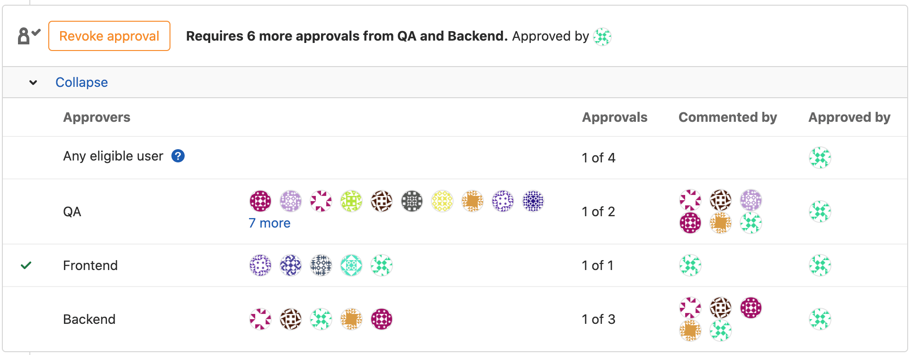

# Acknowledgments

Dear colleagues, dear friends,

There are those adventures that could not succeed without the rigor and dedication of a few. You have been those few. By agreeing to read and reread this manuscript, by sharing your constructive criticism, your informed suggestions and during our enriching discussions, you have largely contributed to its success.

Through your expert eyes, I was able to sharpen every line, polish every word. Your support has been a pillar, a silent and unwavering force. Many thanks for your time, expertise and camaraderie.

It is because this writing is also partly yours that I wanted to mark it with the names of the most tireless contributors. However, in order to preserve your anonymity, I have chosen to only include your initials. Thank you BA, FT, MR, FC, FP, NK, AB, AC, NP, NM, CH, EL, PB, AN and TF.

\newpage


\newpage

# Disclaimers

This book includes numerous references and web links to people, products, companies and organizations. The opinions expressed in this book are those of the author and do not in any way reflect the opinions of the entities mentioned.

The author has no affiliation with any companies mentioned in this book, whether by partnership, sponsorship, or any other arrangement. Any mention of a company or product is strictly informative and should not be construed as promotion in any way.

_Transparency seems essential to me in any research and writing work, and I wish my readers to be informed of my lack of affiliation with the organizations cited in my work._

\newpage

<!-- markdownlint-disable MD045 -->

<!-- markdownlint-enable MD045 -->

\newpage

# Introduction

The constant evolution of digital uses requires organizations to reinvent themselves. They find themselves forced to respond ever more quickly - and often without increasing resources - to their operational requirements. Strategists are mobilizing to stay ahead of the curve in the face of ever fiercer competition.

Many organizations have already begun their digital transformation to master the complexity of interdependent and fragmented information systems. DevOps is one of the approaches to achieving this goal and working more efficiently.

Appearing in 2007, this cultural and organizational movement allows an organization's stakeholders to work more effectively to achieve its objectives more quickly.

Thanks to several theorized methods, DevOps constitutes a means of responding to this efficiency challenge. Each aims to improve the relevance and reliability of the services offered by the organization. To enable it to be more agile, DevOps takes full advantage of _Cloud_ technologies: for the most part open, proven, standardized and attractive.

According to the consulting and research company Gartner, more than 85% of organizations will adopt a _Cloud_ strategy by 2025[^GartnerCloud2025]. For the software publisher Atlassian, 99% of the companies surveyed believe that DevOps has a positive impact on their organization[^AtlassianDevopsStudy].

Several initiatives to create sovereign _Cloud_ platforms are taking shape around the world. This is for example the case of [_MeghRaj_](https://www.nic.in/servicecontents/national-cloud) in India (2014), _Bundescloud_ in Germany (2015), _JEDI_ in the United States (2017) , _Nimbus_ in Israel (2020), _GAIA-X_ in Europe (2020), the _Riigipilv_ in Estonia (2020), _Outscale_, _Athea_, and _S3NS_ in France (2010, 2017 and 2021), the [_Government Cloud_](https:/ /www.nippon.com/en/in-depth/a07707) in Japan (2021), the _National Strategic Hub_ in Italy (2022). At the heart of these infrastructures, there is unanimous agreement on a mode of organization to unify practices and orchestrate these technologies: DevOps.

More widely used in the private sector, large Cloud service providers (_Amazon Web Services_, _Google Cloud Platform_, _Microsoft Azure_, _Alibaba Cloud_) practice this mode of organization internally, promote it and provide the technologies to adopt it.

South Korea [historically favors the use of private cloud technologies](https://news.bloomberglaw.com/privacy-and-data-security/south-koreas-new-cloud-computing-act-and-new- rules-on-outsourcing-of-data-processing-by-financial-institutions), in particular since its law in 2015 facilitating outsourcing[^SouthKorea2015CloudLaw]. Due to several duplicate investments, its aging information systems and the lack of cybersecurity experts on its territory, it was able to equip itself with national data centers in 2007. They now host the information systems of 45 government agencies[^GIDCKorea]. From 2021 and following the COVID-19 crisis, she will announce a massive digital transformation plan for her administration: the _Digital Government Master Plan 2021-2025_[^SouthKoreaMasterPlan2021]. This action plan provides a technical framework called "[_eGovFrame_](https://www.worldbank.org/en/events/2022/02/09/digital-the-door-to-a-better-world-digital -government-strategy-and-cases-in-korea)" used for the development and management of government information systems, with the aim of improving their interoperability. It inherently includes DevOps principles.

In a desire to regain sovereignty, other governments are displaying a clear desire to adopt these technologies and practices, without necessarily describing their initiatives in public. These wishes take shape in documents mentioning the countries' Cloud, AI or data strategy.

For example, Canada published its "Goal 2020"[^CanadaGoal2020] report in 2013 to modernize the way public services work. He will subsequently publish the "_Cloud Adoption Strategy_"[^CanadaCAS] in 2018.

In the United Kingdom, the Ministry of Defense announced in 2022 that it wanted to become an "AI-ready" organization, in its "Artificial Defense Intelligence Strategy"[^UKDefenceAIStrategy]. In the expression she makes of her transformation, she perfectly summarizes the goals of DevOps.

> « We must transform ourselves into a strongly software-oriented organization, organized and motivated to value and exploit data, ready to tolerate increased risks, learn by doing and quickly reorient to find successes and gains. 'efficiency. We must be able to develop, test and deploy new algorithms faster than our adversaries. We need to be agile and integrated (unified), [...] » - UK Ministry of Defence, chapter "Culture, Skills and Policies", page 17.

In 2018, the British Ministry of Defense launched the NELSON[^NELSON] program to equip itself with a [big-data platform](https://joinup.ec.europa.eu/collection/open-source-observatory -osor/news/open-source-royal-navy) for the benefit of the _Royal Navy_. This technical environment based on Cloud technologies once again includes DevOps practices.

Across the Atlantic, the United States already considered in 2011 the need to control information in a unified and agile way, accessible via a single access point (see chapter "[Zero trust](#development-based-on- le-zero-trust)"). The _Department of Defense_ (DoD) describes this vision in its "DoD Industrialized IT Systems Strategy and Roadmap"[^DoDITEnterpriseStrategyRoadmap].

> « 21st century military operations require an agile information environment to achieve strategic advantage for mission personnel and partners. [...] To address this challenge, DoD is undertaking a coordinated effort to unify its networks into a single IT environment that will improve both operational efficiency and security posture with respect to information systems. »
>
> - United States Department of the Armed Forces, chapter "Vision for more efficient and secure industrial information systems in the DoD", page 13.

In 2019, it will publish its first reference guide for the industrialization of DevSecOps practices[^DoDEnterpriseDevSecOpsReferenceDesign]: a methodology emphasizing security (see chapter "[DevSecOps](#devsecops)"). Intended for suppliers, purchasers and managers of modern information systems, this institutional guide describes good practices for the implementation and maintenance of this type of system. The stated objective is to deploy software at "operations speed". In the economic world, the parallel is that of the "speed of the stock markets".

In the private sector, Microsoft historically launched its new products every 3 to 4 years (e.g. Windows, Office). As early as 2014, its president and CEO Satya NADELLA warned his teams about the risk induced by the too long duration of this development cycle. By continuing with the same mode of organization, Microsoft would become obsolete. The teams responsible for developing each product worked independently of each other, with their own organizational methods and their own tools. NADELLA reorganized the company based on DevOps methodology. It will unify the teams' tools and practices, so that they can discuss with each other[^MicrosoftDevOpsAbelWang].

Faced with ever more offensive economic[^AUKUS] or military[^InfluenceRussie] competitors, transforming is an imperative necessity to stay in the race and prevail in future confrontations. For institutions, it is therefore no longer a question of knowing "if" but "when" they will have to embark on a transformation process, at the risk of finding themselves downgraded.

However, the majority of organizations still struggle to implement these new practices pragmatically. The main obstacle is finding the talents capable of implementing the techniques and tools appropriate for operating in DevOps mode.

There are numerous studies to refer to on DevOps, which is seen to be above all a subject of cultural transformation of technical teams and _management_. These studies refer to the experience of many stakeholders and allow us to avoid common errors in a transformation process.

For example, Google Cloud's DORA[^DORAWebsite] research program (_DevOps Research & Assessment_) has been conducted since 2014 with more than 33,000 professionals in the Cloud sector. Every year its report on the state of DevOps worldwide is published. This field is therefore far from being new, the initial risk is now much more moderate for new entrants. But the sector continues to find ever more effective ways to transform itself, to keep pace with the rapid pace of developments in the digital sector.

This book aims to popularize the organizational and technical aspects of DevOps. These concepts are accessible to everyone and will allow you to have an overview of the Cloud challenges for a successful transformation. It suggests a course of action to follow for a first DevOps experiment, or to refine a transformation already underway.

We will explore the reasons for the emergence of this methodology, its content and how to inspire your organization to transform itself. Each structure has its own needs, its own level of maturity and there is no single recipe. Nevertheless, successive experiences in the sector have resulted in the creation of standards which will be presented to you during this work.

The experience of pioneering companies now ensures that the efforts invested in DevOps will contribute to making your organization a more efficient, agile and sustainable structure.

# The five pillars of DevOps

According to the renowned American company [Atlassian](https://www.atlassian.com/devops/what-is-devops/history-of-devops)[^AtlassianHistoryOfDevops], the DevOps movement was born between 2007 and 2008, he time when the software development professions (those who develop) and those in system administration (those who deploy) were respectively concerned about their poor ability to collaborate. They considered this situation a fatal dysfunction, because of their lack of closeness.

Initially, DevOps focused on how to improve the efficiency of software development and deployment. More than ten years later, this methodology has evolved and now addresses several other areas such as security, Cloud infrastructures and even corporate culture. Around 2015, DevOps methodology was mainly used in large American technology companies (GAFAM[^GAFAM] and NATU[^NATU]) or companies already employing [agile methodology](#be-close -of career).

Widespread today, organizations of all sizes use the DevOps methodology all over the world and in all types of sectors[^GoogleCloudDevopsLeaders] (health, finance, transport, governments, heavy industries, etc.).

The term DevOps is attributed to the Belgian engineer Patrick DEBOIS. Consultant in 2007 for the Belgian government, he was entrusted with the migration of a data center. Having spent considerable time discussing with developers and system administrators, he observed what the renowned engineers Andrew CLAY SHAFER and Lee THOMPSON theorized two years later as the "wall of confusion"[^WallofConfusion]. A metaphor that can be summed up by stakeholders who do not understand each other.

The community was putting a word on a real phenomenon that hinders communication and collaboration between teams, leading to inefficiency and delays. This was followed by the writing of his book in 2015 "The DevOps Handbook: how to create agile, reliable and secure technological organizations"[^TheDevopsHandbook]. DEBOIS describes how organizations can increase their profitability, improve their corporate culture and exceed their objectives using DevOps practices.

Google defines the following five pillars of DevOps:

1. [**Reduce organizational silos**](#reduce-organizational-silos)
   - By cultivating commitment, by sharing the feeling of responsibility between stakeholders in both successes and failures (engineers, project managers, users/business lines). Everyone must feel involved and legitimate at their level.
2. [**Accept failure**](#accept-failure)
   - Assuming that failure is a consequence of the organization's lack of procedures and methods.
3. [**Reduce the cost of change**](#reduce-the-cost-of-change)
   - Implement little by little, deploy quickly, fail quickly to iterate.
4. [**Leveraging automation**](#leveraging-automation)
   - Automate to avoid wasting time and improve the maintainability of the infrastructure.
5. [**Measure everything**](#measure-everything)
   - With the implementation of performance and system reliability indicators, to better understand the behavior of the services deployed, react more quickly or even predict.

# DevOps vs Site Reliability Engineering

To fully understand how DevOps can help your organization, let's start by defining two of the most important terms to know in the field: DevOps and SRE.

## DevOps

It is the link that unites the world of development and production.

"Dev" means "development" when "Ops" refers to the administration of IT systems in production.

We call "DevOps" (_Development and Operations_) the organizational and cultural movement which aims to streamline the software development and deployment cycle.

To achieve this goal, engineers practicing DevOps are responsible for facilitating communication and collaboration between stakeholders (developers, system administrators, security teams, project managers and users).

They define the most relevant IT practices and tools for an organization and study their implementation. As a team, they guarantee the consistency of developments with deployment requirements. Today, these profiles are mainly oriented towards the use of _Cloud_ technologies.

DevOps practices are part of the entire panorama of the technical chain, favoring the use of automated mechanisms for development (see continuous integration), deployment (see continuous deployment) and maintenance (see supervision). ). The beneficiaries are both internal teams and customers. The former collaborate more efficiently and securely, while the latter obtain higher quality software more quickly.

This position involves the responsibility of agreeing all stakeholders on a common working method. It is therefore important to have excellent communication and teaching skills, especially in transforming organizations.

The role of DevOps engineering is to raise awareness throughout the organization of system reliability issues. The most experienced engineers manage to implement practices that meet resilience requirements without impacting the speed of developments.

The main challenge lies in the ability to find a balance between the complexity induced by reliability and security requirements, and the need to develop new functionalities.

In the remainder of this work, we will see that the implementation of DevOps is specific to each organization. To achieve these objectives, the methods and tools adapt according to the level of technical maturity of the organization. There is therefore no "single recipe" but "good practices" to know and follow.

Just as there is no single recipe, there is no single "DevOps engineer" job. We will discuss this subject in the chapter ["Between SRE and DevOps"](#entre-sre-et-devops).

If the term DevOps is becoming more and more popular and starting to become common in job offers, that of _Site Reliability Engineering_ (SRE) is less known, particularly in France.


## Site Reliability Engineering (SRE)

System Reliability Engineering (SRE) is an older discipline than DevOps. It dates back to 2003 when Ben TREYNOR SLOSS, then an engineer at Google, founded a team with this name. He will be the founding father of SRE and the first practices considered "DevOps".

The _Site Reliability Engineer_ or "Systems Reliability Engineer" is responsible for designing, deploying and maintaining the infrastructure that makes the company's services available. He ensures the proper functioning of the technical base on which the software is deployed. It ensures their security and guarantees their availability to customers.

The SRE team is therefore responsible for your IT infrastructure, often made up of several environments: development, qualification, pre-production (or _staging_) and production. It attempts to answer the question "what are the things (tools, procedures, machines) that we do not have, and that we need to achieve our resilience objective?".

SREs use practices from the world of software engineering to administer their infrastructures. They develop and deploy the tools to achieve a resilience objective. In this sense, SRE integrates many aspects of DevOps (see chapter ["The 5 pillars of DevOps"](#the-five-pillars-of-devops)) but focuses on the automation of administration, as well as measuring the reliability of systems.

The company uses them mainly to honor its service contract (_Service Level Agreement_, see chapter "[Resilience indicators](#resilience-indicators)"). In the private sector, if the availability of the service falls below the value stipulated in the contract (eg: below 99% monthly availability), the company is required to pay penalties.

In simplified terms, the company gives the SRE the mission of making its infrastructure more resilient. That is to say, always more available, more stable. The SRE attempts to answer the following question: "what are the things (tools, procedures, machines) that we do not have, and that we need to achieve our resilience objective?".

DevOps practices are a great way to achieve this goal. This is why SREs often use them on a daily basis.

## Between SRE and DevOps

Definitions differ depending on who you speak to. While some leaders like Google and AWS officially define DevOps as a "methodology" and the SRE profession as its "implementation"[^WhatIsSREForAWS], the majority of job offers on the market often remain titled "DevOps Engineer" : an incomplete title in the proper sense of the historical definition.

The fact is that the two disciplines have evolved and today overlap in many aspects: they share the objective of quickly deploying reliable and efficient software.

However, they do not completely focus on the same things. While DevOps is more focused on development efficiency and deployment speed (see CI/CD, automated testing, developer experience, inter-team collaboration, etc.), SRE focuses on system reliability by employing a more methodical approach (see SLI/SLO/SLA, error budget, _blue/green_ deployments, postmortems, etc.).

Today, you can therefore find "DevOps Engineers" who do not do SRE but the opposite remains rare. DevOps being a philosophy, this term should be used as an adjective. For example: "DevOps Software Engineer" or "DevOps System Administrator".

However, let's look at what the market says. By observing the job offers in the field [^DevOpsDefinitionStudy], we notice that those titled "DevOps Engineer" include very varied missions. They can be:

- Development oriented: software engineering, systems engineering, quality assurance engineering[^QualityAssuranceBasics].
- Operations oriented: system administration, Cloud engineering, network engineer.
- Oriented towards both: SRE, automation engineering, platform engineering; all professions in the software chain (see chapter "[Securing your software chain](#securing-your-software-chain)").

In reality, all of these roles allow DevOps to be put into practice. But the existence of each person within a structure depends on their maturity and their means (fig. <spanc/>\ref{fig:devopsjobsevolution}).


In summary, SRE is said to use DevOps[^HowSRERelatesToDevOps] methods. DevOps and SRE are therefore neither two opposing methods, nor two identical methods, but two disciplines that will help you break down the barriers between your teams. This will allow you to deploy higher quality services more quickly and more securely.

In this book you will discover the best practices of these two unified disciplines, described in an institution-friendly manner.

## DevSecOps

The term DevSecOps is gaining popularity. It describes a DevOps organizational mode integrating Information Systems Security (ISS) teams from the software design phase and throughout its life cycle.

More concretely, it is a question of guaranteeing compliance with the security standards imposed by the organization, by means of automated rules which verify the conformity of the software developed.

Perhaps you have already heard of "_shift left security_"? This expression refers to the fact of integrating security work into the software project as early as possible (best practices, vulnerability analyses, audits).


In organizational terms, this method involves the SSI teams at the heart of exchanges between developers and production teams. These teams will be responsible for supporting developers so that they can integrate the organization's security requirements into their software as easily as possible.

From the design phase, SSI DevSecOps teams define and provide the tools controlling the existence of confidentiality and security features in software. For example, they will check the existence of GDPR[^RGPD] functionalities in software, or the proper functioning of the "need to know" mechanism for access to data. This may also include implementing [automatic vulnerability detectors](#continuous-integration) in the code.

Nicolas CHAILLAN, former Director of Software Engineering within the _United States Air Force_ (USAF) [defines it](https://podcasters.spotify.com/pod/show/podcastmortem/episodes/19-Le-DevSecOps --lUS-Air-Force-e1mqvem)[^DevSecOpsUSAirForce] more generally with the following terms:

> « DevSecOps is the evolution of software engineering. It’s the balance between development velocity and time allocated for security considerations. We want security to be integrated to ensure that it is not forgotten but added to the software development cycle. It's using modern cybersecurity processes to make sure the software is both performant and built in a secure way to make sure it doesn't have problems over time. This is what will allow companies and organizations to remain competitive and advance in the future at the necessary speed against their competitors. »

Today, the term "DevSecOps" is regularly favored with the sole objective of making the discipline more attractive. However, it can help to better understand Information Systems Security (ISS) teams and their managers that they have a [concrete role](#SSI-devops engineer) to play in this type of organization. This is the "Sec" at the center of the term "DevSecOps".

> Word from the author: I consider security to be inherent to any information system and I therefore see the "Sec" of "DevSecOps" as implicit. This is why I will only rarely use this term throughout this work.

We will discuss the paradigm of this mode of organization and its security techniques in the chapter "[Security: a new paradigm with the DevOps approach](#security--a-new-paradigm-with-the-devops-approach)". But before that, let's learn more about the organizational challenges of DevOps.

# DevOps through practice

A DevOps initiative is a significant transformation across an organization. If the latter has not yet moved to [agile mode](#being-closest-to-the-business), it involves all strata of the company in order to bring together common synergies.

DevOps not only brings together "Dev" (engineer-developers) and "Ops" (system administrators), but above all the _management_ of the technical teams. The latter must be helped to grasp the perspectives offered by a change often experienced as difficult because it is unknown. In most cases, this transformation requires a significant evolution of the organization's IT systems in the long term, because it involves the use of new tools.

Empathy is the key skill for successful transformation. For some, these new working methods and tools constitute a model opposed to their traditional practices.

This is why it is important to acculturate your hierarchy as often as possible to the benefit of switching to DevOps mode: give them demonstrations, answer their slightest questions and support them until they fully understand the issues. .

Every organization benefits from knowing how to address new technological challenges. Faced with ever more modern and rapid competition, your structure will not dominate by remaining on what it has achieved.

## Why DevOps?

Research reports support the theory that the benefits of efforts invested in SRE are revealed in the medium term[^DORAReportSREPractice].

According to them, practicing SRE does not affect the resilience of the company before having acquired a certain level of maturity. This means that it is necessary to reach a critical mass before being able to reap the benefits of these tools and practices (fig. <spanc/>\ref{fig:adoption-of-safe-practices}).


The DORA 2022 report notes the need to adopt a substantial amount of SRE practices before reaping "significant" benefits in terms of resilience[^DORAReportSREPRacticesFigures]. This phenomenon can be an obstacle for decision-makers when considering the idea of ​​transforming into DevOps mode.

Where the interest is confirmed is that the benefits generated by DevOps exceed the costs generated once the initial investments have been made.

It is in this trend that DevOps finds its interest: even though traditional infrastructures initially require little investment to provide a service, the cost (HR, financial) of their maintenance increases proportionally to the number of services deployed. This makes their management unsustainable in the long term. DevOps offers a higher initial investment but offers the possibility of controlling exponential activity, with a cost with a logarithmic tendency (fig. <spanc/>\ref{fig:curbes_interest_devops}).


This method of organization aims to make infrastructures more reliable, reduce manual tasks to make better use of engineers' time, deploy your software more quickly and _ultimately_, provide better quality service.

DevOps is to traditional infrastructures what assembly line construction is to craftsmanship: by building assembly line, we reduce costs and meet demand. The additional advantage in the software field is that it is possible to adjust the product you want to deliver in a few hours. This action can be repeated several times a day!

If historical practices have all the honor of having made information systems work for years, other more agile methods exist today[^RedGate2021Report]. To militarize the point: bows and arrows were used, but since then armies have invented the AR-15[^AR15].

The whole challenge of a transformation is to succeed in getting your hierarchy to buy into this initial investment (not negligible but necessary), while the benefits may initially be difficult to see emerge. This is a common challenge that we will see how to address in the chapter ["How to convince and keep the faith"](#how-to-convince-and-keep-the-faith).

## Skeptics and over-optimistics

Companies are generally aware of the change they need to make. But they do not dare or cannot immediately make the efforts necessary to achieve this transformation.

The most skeptical or the most optimistic even think they can get out of it by starting an initiative at a lower cost:

> « I only need an SRE/Cloud/DevOps engineer »

Sorry, **no.**

Let's take an example to illustrate this scenario. You start with a team of 2 people developing software. Several problems have already been identified, particularly if you work in a regulated sector:

- Who sets up the infrastructure to properly develop this software? (software factory, dependency mirrors, library registers, etc.)
- Who secures this infrastructure?
- Who manages the backups?
- Who defines the development rules and their consistency to maintain the software over time?

If you only rely on your software engineers to manage the infrastructure, they will end up generating technical debt since that is not their job. This debt represents maintenance costs and effort, which will get worse as your team grows. Developers will not focus on development and will be spread out on SRE tasks. This situation already requires at least 1 SRE/DevOps engineer.

What if you were recruiting and your team now had 6 engineers? We now need to provide them with machines and configure them. Some encounter bugs, others ask you to update libraries... If you also have security requirements (e.g. approval, event logs), you must take the time to correctly configure the tools and infrastructure. This requires at least 1 additional SRE/DevOps engineer.

Two engineers are now leaving your structure? Unfortunately, you must always maintain the infrastructure that has evolved, to meet the needs of your 4 engineers and to maintain the X machines or servers that you have installed.

Understand that you must achieve a critical mass of SRE/DevOps profiles to maintain a robust foundation. The latter constitutes the foundations allowing your engineers to be equipped to work correctly. This critical mass must evolve according to the number of employees and you cannot remove it without experiencing serious operating difficulties.

We often come back to the debate "do we need quality or quantity?". The history of armed conflicts around the world demonstrates that it is often necessary to have both[^MassInArmedConflicts]. Armies must equip themselves with a critical mass of soldiers and equipment to impose favorable balance of power, and compensate for losses to continue to advance. Although quality hardware can do more, it won't be able to do everything at once. It's the same thing for a team of engineers. As brilliant as they are, there needs to be critical mass to meet the initial need for an efficient and resilient service.

> For example, Google - employing tens of thousands of engineers - maintains its SRE ratio towards developers at around 10%[^GoogleWorkBookEngagementModel]. This SRE/developer ratio and the costs incurred tend to be high at the start of your initiative, then smooth out as the number of services deployed increases. This is due to the high infrastructure requirements when building your initiative, which reduces administration tasks as they are automated.

It is proven that transforming a traditional structure into DevOps mode requires a substantial investment. Setting up the foundation to see the benefits also takes some time. But keep in mind that the point of DevOps practices is to succeed in controlling an exponential activity with a logarithmic cost (see chapter "[Why DevOps?](#why-devops-)").

## Too big, too soon

The failure of a project is often explained by poor definition of its scope, with objectives that are too demanding or confusing planning. This mismanagement results in an uncontrolled increase in delays and costs. It is then common to have to find an "intermediate solution" while waiting for the first to hypothetically come to light.

A DevOps initiative is built with what already exists within your institution: you must succeed in starting small to correctly grasp the needs of the professions and involve the entire organization in the adventure. This is the _Kaizen_ method, born in Japan in the 1950s within Toyota factories. It is known in France as the "small steps strategy".

Have the audacity to start small and iterate as you and your institution become acculturated to the issues and challenges of these new technologies. Make sure that each team is in turn an evangelizer of your initiative. We will discuss the theories behind this recommendation in the chapter "[How to convince and keep the faith](#how-to-convince-and-keep-the-faith)".

Changing the culture of an organization takes time, but taking shortcuts risks offending sensitivities, demotivating your teams and _ultimately_ causing your project to fail. Since DevOps is based on the principle of successive iterations, you will take fewer risks.

## Initiatives in organizations

Is your hierarchy convinced by your transformation initiative and grants you all the required resources? In this case, move on to the next chapter. If this is not the case, let's try to better understand why.

It may happen that newly assigned decision-makers ask their subordinates to "quickly" find turnkey solutions to the problems they discover. Instead of adopting an investigative approach, the urgency to obtain an immediate result encourages them to take a hasty direction. After all, the chef is expected to find an inexpensive and effective solution quickly and in any situation. Most of the time, however, initiatives - more or less mature - already exist within the organization.

Technical solutions are easy to design and delegate. Rather than considering historical propositions, purchasing technologies "off the shelf" or launching a completely new project may seem more efficient. But opting for a solution, ignoring the constraints inherent to the organization (organizational and technical maturity, human and material resources, technical debt, learning curve, etc.) can be risky.

Moreover, these constraints are often already known and expressed for years by internal expertise. They provoke the birth of projects taken on the initiative of employees, in response to the need they observe or the exasperation they experience. Instead of encouraging them to find a solution, they are often reprimanded for insubordination. In reality, these projects often get lost in the intermediate strata and rarely reach the decision-maker who has the power to make them sustainable.

Indeed, decision-makers rarely have the time to meet each of their teams. They therefore tend to [favor their own opinion](https://copyconstruct.medium.com/why-success-is-often-elusive-at-the-highest-echelons-3e02e4dd3e7f) or to seek that of their deputy , in place of that of their experts. The decision taken is therefore that of the sensitivity of a single person, isolated from business realities. The more hierarchical layers there are, the more pronounced the isolation. This phenomenon results in a concentration of efforts towards poorly studied and unifying projects. Accompanied by communication that has little impact by nature, it inevitably produces frustration in the company.

The example of the _U.S. Department of Defense (DoD) is a good illustration of this. This ministry launched a new DevSecOps initiative called _Vulcan_[^DISAVulcan] 4 years after the _Platform One_[^PlatformOne] initiative, the purpose of which was identical. Beyond causing frustration within the _Platform One_ teams[^ChaillanDisaTweet], the _Vulcan_ program is causing delays and additional costs[^DISAVulcanDelays].

In other cases, the distrust of certain managers leads them to question the proposals made by their internal experts. Excessively, this state of mind wipes out the interest in hiring experts in daily contact with the company's subjects. The external expert (e.g. a consulting company, a third-party authority) then appears essential, considered objective and impartial[^SubjectSupposeKnowledge].

Faced with leaders who do not have a vision aligned with ours, we can become indignant and leave. Or try to understand reactions and improve practices. As the leader of an internal initiative, you must understand the fear of decision-makers: entrusting an ambitious project that disrupts organizational practices has several risks.

If your organization is large and has been around for a long time, it has fulfilled a need until now. If leaders come to believe that it needs to transform (or if you anticipate it) and nothing has been done, the organization may be facing an innovator's dilemma.

Theorized by Clayton M. CHRISTENSEN[^InnovatorDilemmaBook] in 1997, this dilemma describes the situation in which a pioneering company, while trying to maintain its competitive advantage, is inevitably led to miss out on a major innovation. An unsuspected competitor then offers it and overturns market share. For example in 2023, Microsoft surprised everyone by releasing a ChatGPT integrated into its search engine before Google. Google was, however, at that time the pioneer of internet search and invested billions of euros each year in artificial intelligence research. How could Google let a competitor outsmart it?

The answer is simple: the risk that Google - 84% of market share on search engines[^MarketShareSearchEngines] - has in releasing an unfinished product - which returns false information for example[^BardFails] - is much greater important than that of a startup like OpenAI or Bing for Microsoft - 9% market share on search engines. Proof of this is that at the time of writing this chapter, few online articles question the launch of Bing Chat compared to Bard, despite identical problems[^CNNBingAI]. In summary: Microsoft has everything to gain when Google has everything to lose.

That said, Google has seen the pitfalls of not taking risks and has been working for a while on a competitor, Bard[^Bard]. To avoid facing this dilemma, the organization must:

- **Monitoring**: keeping an eye on emerging trends and new customer needs by organizing visits between partners, participating in trade fairs, or consulting experts to find out about market developments . For example, you can ask your experts to write a quarterly newsletter for management, covering the major technological trends of the moment.
- **Re-evaluate your strategy regularly** (your _business model_): based on this monitoring, look for new growth opportunities by addressing new use cases. Offer new products and use new technologies. In an institution, monitoring is also internal: you have to go see your professions to understand the obstacles to their daily work, and put into perspective the innovations that can respond to them.
- **Encourage risk-taking and experimentation**: encourage your teams to propose new ideas and test projects to explore new technologies. Reward risk-taking.
- **Invest in innovation**: allocate sufficient resources for research and development (R&D). For example, grant 1 day of teleworking per week to your experts so that they can explore an innovative technology. Grant funding to your teams to purchase equipment allowing them to experiment, or give them access to a Cloud host (see chapter "[Continuous training](#continuous-training)").

More pragmatically, if you decide to set up your own team, some members may leave your structure at any time. Given the maturity of the reflections they undertook, they then risk leaving behind tedious work to resume. This is why many organizations prefer to call on a third party, with well-defined specifications so that the decision-maker is certain of obtaining a result (through the contractual obligation of the third party). We will see in the chapter "[Being closest to the profession](#being-closest-to-the-business)" that this practice can have harmful long-term consequences for the organization.

Organizational developments always involve a cultural change that must be understood. This cultural gap is sometimes too difficult for the entire organization to overcome and indicates that it is probably still too early to outline your plan. Acculturate it through presentations and success stories. The decision-maker must clearly understand the impact that this transformation can have and the associated risks: disruption of service, change of HR strategy, staff training or even purchase of equipment. Help your managers plan ahead while you work to build your evidence.

We will see in the rest of this book how to understand the psychology of change to make your project successful.

## Chronic reorganizations

" One more ! » will exclaim your most loyal collaborators. How many reorganizations has your structure already undergone? When practiced excessively, they blur the message and fuel confusion for your teams.

In most cases, technical teams already exist within your structure. They already meet business needs that require their presence.

Managers with limited knowledge of business and technical issues are often tempted to want to change the activities of certain teams. They do this for the benefit of a new project, because of the skills currently present there. However, a team is always formed around a project which has shaped its culture, and which today makes it so effective for the company. Decision-makers must consider this aspect before considering breaking this hard-won culture by imposing a transformation.

The risk of significantly changing a team's missions requires you to be particularly willing to support it: this is rarely the case, you probably don't have the time. Their current method of operation is already the result of several restructurings, which have probably already impacted their ideals, as well as the reason they had for joining your organization.

Changing the missions of a team without considering its culture and its background means risking losing employees: either they will be demotivated by your project, or they will resign. You must offer them a clear vision, convince them with supported arguments but above all involve them.

Due to their involvement within your structure, the knowledge of your teams will allow you to grasp concepts that you have not yet fully understood. Be open to their recommendations and comments to understand how best to reorganize this team - and only if necessary - according to its aspirations. An excellent way to get buy-in from your team and better understand its challenges is to do your work for a few days. This can be done when the decision maker arrives in the structure.

If you feel you don't have the resources in-house, don't be afraid to recruit. It is risky to impact historical teams if they respond to a need expressed by your organization. The essence of a transformation is to ensure the continuity of the service while changing its practices.

Be more subtle than announcing a "big transformation plan." These practices undoubtedly frustrate many employees, do not allow you to obtain the support of all your teams and risk discrediting you. They can also make you hostage to your predecessor by associating you with previous failed transformations.

As discussed in the chapter "[Too big, too soon](#too-big-too-soon)", adopt the strategy of small steps and gradually develop your intuition about who you need to reorganize. Obtain team buy-in by illustrating the range of possibilities to make them want to do so. Then let them convince their peers for you. We will detail these strategies in the chapter "[How to convince and keep the faith](#how-to-convince-and-keep-the-faith)".

## Refuse technological delay

> « It’s normal, we will always be late here. »

If you feel like you've heard this before, these words probably left you feeling dismayed.

It is understandable to accumulate delays depending on the size, resources and security requirements of your company. But the organization must not tolerate delay. Under no circumstances should the statement "it’s normal here" become an acceptable response.

If the speaker is sincere, this state of mind only results from a lack of knowledge about the means to achieve the goal. Otherwise, it may be a lack of courage, or even intellectual laziness.

If the majority of a company's employees come to think that it is behind schedule, there is a serious problem. Maintaining the _status quo_ in this situation inevitably leads to the decline of the organization and the irremediable loss of credibility on the part of its employees and partners.

In one of his articles[^ArticlePSSyndromeCanard], speaker and transformation expert Philippe SILBERZAHN takes the example of a man who is waiting for his train scheduled for 9:30 a.m. The screen displays "On time" even though it is already 9:35 a.m. on his watch. The man considers taking a photo of the sign but wonders "what’s the point". Many observers would downplay this five-minute gap, show irritation, or simply attribute the fault to a display malfunction. "After all, no one can do anything about it," they would conclude. It is with this type of behavior that Philippe SILBERZAHN asserts that organizations decline: they become accustomed to mediocrity.

While at first the dysfunction is considered unacceptable, over time it becomes more and more acceptable to the organization, without it realizing that this situation is costing it time and money. The effort to correct the problem becomes less and less justifiable and silence becomes the default choice to conserve energy. Until an irremediable situation occurs (or a group of a few brave people shake the structure!).

But you also need to know _when_ to reveal your innovations. Preston DUNLAP, the USAF's first chief technical officer (CTO), describes in his public letter _Defying Gravity_ how "bureaucratic forces" can harm innovation if introduced too early.

> « Some have asked me what my recipe for success has been over the last 3 years. I didn't talk about it much because I knew that if I revealed things too far in advance, the natural forces of bureaucracy would come back with a vengeance, rejecting the full potential of innovation at every opportunity. » - Preston DUNLAP, Defying Gravity

To avoid technological lag, the leaders of an organization can adopt several practices:

- Continuously train its staff, including decision-makers (see chapter "[Train continuously](#train-continuously)").
- Maintain a capacity for internal innovation to remain able to criticize (see chapter "[Internal team model](#internal-team-model)")
- Accept controlled risk-taking and free speech (see chapter "[Accepting failure](#accepting-failure)")
- Measure and set up indicators to avoid getting used to it (see chapter "[Measure everything](#measure everything)")

# Prerequisites

Having designed the best service (a method, a software, a tool) will not allow you to shine as long as you do not provide easy access to it, without interruption of service and by providing support. DevOps will allow you to structure and maintain this source of value.

This book won't even require your team to be particularly large, or even for your managers to already be convinced. However, it will require that your team be convinced that it can carry out its project. Of course, over time, the support of other teams in your organization will constitute a valuable argument to illustrate the success of your initiative.

A manager only asks to be convinced by an initiative from his subordinates. Help him to project himself and understand the added value of what you are offering him.

This will require you to regularly present the progress of your project: both so that they remember and so that they understand. It is always risky to assume that a project is understood from the first presentation, especially when it concerns a new paradigm that we wish to introduce.

Plan to set up an internal team: there will always be bugs to resolve, configurations to adapt and features to add. Developed internally or by a service provider, you will experience the phenomenon of software erosion[^SoftwareErosion]. The latter describes the problems that software can suffer over time when it is left abandoned (critical security updates, full disk space, processes that stop working, etc.).

Do not believe that one service provider will be able to solve all your problems: you will lose money and you will not achieve your objectives. The result of a service provider will only be the product of your ability to synthesize your problems. However, in a transformation phase, you will become aware of new issues every week. Unlike you and your team, the service provider will probably not be able to be permanently present within your organization to capture all the stakeholder issues.

Starting your DevOps initiative requires planning to recruit several profiles:

- A team leader with recognized engineering skills and excellent communication skills
- Software engineers who will develop solutions to business or user needs
- SRE/DevOps who will develop your base and manage the software development/deployment cycle

Whether you are a senior manager or a project manager whose objective is to improve the services that your organization provides, you will need to motivate your initiative to your hierarchy and the rest of your organization. It is therefore necessary to understand how to communicate effectively so that everyone buys into your project. Let's see in the next chapter some ways to do this.

# How to convince and keep the faith

First, it's not about convincing. You can't stand in front of someone and say "you're wrong, I'm right." Rather, you must make your interlocutors want to adhere to your vision, your project. So they will convince themselves.

Getting your superiors or work colleagues to buy into an initiative is not always easy. William MORGAN - manager of a renowned technology startup - recommends 4 rules to follow[^WilliamMorganKubecon2018]:

1. Identify who is affected (the stakeholders)
2. Determine what the new solution will bring them (the advantages)
3. Understand what their fears (concerns) are
4. Alleviate concerns, promote benefits and communicate

According to William MORGAN, once you reach a certain level of technical engineering, the professions of "salesman" and "engineer" merge: "Sufficiently advanced engineering work is indistinguishable from salesmanship work" .

Here is how these rules could be applied to security and _management_ teams:

- For security teams, the proposed technology could [automatically manage and audit the encryption of flows between services](#service-mesh). Their concerns would rather be: "Will this technology make my infrastructure more secure?" or "What new attack vectors could this technology introduce?"
- For _management_ teams, the proposed technology could accelerate the pace of development and reduce service interruptions. Their concern would rather be to fully understand what equipment or human resources the company depends on, following the use of this new technology.

The theory of mental models[^MentalModels] allows us to better understand the decision-making process (e.g. whether someone adheres to an initiative or not). Each representation we have of things (i.e. a mental model) differs depending on the individual. But to transform means to agree together on an alternative mental model[^SilberzhanModeleMental].

Even though DevOps can be based on studies and is obvious in the private sector, institutional initiatives are not yet numerous enough[^DORAIndustry]. You are therefore in a situation where you are certain of the direction to take, but you are not entirely able to justify it with figures and/or examples. Faced with your avant-garde transformation proposal, the decision-maker is therefore faced with a risk. Now, question of survival:

> « It is better to be wrong with the group than to be right against the group. »

To help the decision maker make their decision, you must work to reduce this risk. But how ? The idea is to rally early adopters to your project to your cause, without announcing it to the collective.

> « The first person to take the step takes a huge risk. The 150th doesn't take any more. »

In addition to improving your value proposition, you will get examples to cite and support: you will no longer be the "first" to take the risk and neither will your organization.

## Act with finesse

> « Initiative is the most elaborate form of discipline. » - General LAGARDE

Operating behind the scenes (not announcing your project to the collective) involves understanding the hypothetical repercussions. Although you want to improve things in good faith, you may misperceive the overall situation in your organization. Thus, your project would disrupt established power games, making you undesirable in the eyes of some.

For example, a team lacking resources comes to you for help. Noting his distress, you design a brand new tool developed quickly using your DevOps platform. You fail to inform your superiors, because they might refuse this innovation (see previous chapter).

What you don't know is that the team you support has no longer been doing the work requested by management for several weeks. As the leaders try to rebalance the situation, a sudden protagonist (your team) comes to provide favors to the offending team.

Upon hearing the news, the leaders find themselves in an unpleasant situation: they understand the support you provide (it is virtuous in good faith) but are angry with you for having interfered in their affairs.

And now your initiative is locked in a vicious circle (fig. <spanc/>\ref{fig:power_games}). On the one hand, your team doesn't see the harm in helping and stops reporting to the management team. On the other hand, the management team gives up on the idea of ​​doing business with you and trusting you.


\newpage

The problem is above all cultural: the organization is not trained to support innovation and it is therefore difficult to innovate. Innovators must then find indirect ways to change things. On the other hand, innovators are often poorly acculturated to the structures where they are asked to innovate. This indicates the need to train these profiles so that they better understand how the organization works. By implementing the 5 pillars of DevOps, you will help your organization transform its culture and promote innovation (see chapter "[The five pillars of DevOps](#the-five-pillars-of-devops)")

So be sure to understand the political situation between the management team and your first experimenters before acting in the shadows, at the risk of complicating your progress.

## Approaches to opposition

Keep in mind that if things are as they are today, it is because there are many reasons: you do not necessarily have exhaustive knowledge of these past causes (time allocated to projects, HR resources /financial, power games...) and are not here to blame the actors.

Also remain aware that during a transformation, leaders must provide the same services as before. The decision-maker must then control the changing environment in parallel with the current environment, without the first killing the second.

Finally, don't be discouraged by the first reluctant person. Any innovation in its infancy is subject to moral mockery and goes through three phases: ridiculous, dangerous then obvious[^InnovationPhases]. Having experienced it, I can attest to the veracity of this phenomenon, but historical examples exist:

- Women's right to vote: first considered ridiculous, then dangerous because some [suffragettes](https://en.wikipedia.org/wiki/Suffragette) lost their lives (1910s), then this idea was become evident in our contemporary societies.
- Henri FORD who carried the vision that every American should have a personal car and that it should not cost much. At the time, the car was considered a gadget for the rich: "we don’t know what it’s for but it’s pretty". He created the industry's first moving assembly line (1913)[^FordIndustryChain] and _Ford_ is still one of the leaders in the automobile industry today.
- Elon MUSK who said he could create reusable rocket launchers: mocked[^ElonMuskBiography] or strongly doubted[^MuskImpossibleQuote] in his early days by the Russian and American space industry, now respected by the latter and [feared](https ://www.ft.com/content/24cca993-b249-45a5-8c42-b39c0ec30c5b) by [the European space industry](https://www.latribune.fr/entreprises-finance/industrie/aeronautique-defense/ european-satellites-launched-by-spacex-the-terrible-defeat-of-space-europe-937632.html).

If you encounter head-on opposition, you will have to rework your communication (see the following chapter "[Adapting your speech](#adapting-your-speech)"). Then start with the opposing points of view. If you sense that some people are deliberately cutting discussions short, consider the following approaches.

- **Elicit common values**: even if you and your interlocutor have different beliefs, you may share certain common values. Demonstrate how your initiative addresses this.
  - If you both value innovation, explain how your approach promotes it and how it offers new opportunities.
  - If you both have an interest in improving the daily life of a profession category or a user, give use cases on how your solution can help.
- **Put them in the spotlight**: decision-maker or client, anyone who will support your idea if it allows them to shine. Identify how your project can enable him to achieve his objectives and explain it to him.
  - The feeling of a misplaced ego is often synonymous with a gap between the stated objectives of the project and those of the individual.
  - If your interlocutor is looking to stand out and gain influence in their organization, show how your project could strengthen their reputation as an innovative leader, working to improve the daily lives of their subordinates.
- **Bring together a coalition**: attract people who share your vision of transformation (_early adopters_ mentioned earlier). These are often the same people who share your opinion on the inefficiency of the organization.
  - By creating a community that supports you, you demonstrate to your interlocutors that your approach is legitimate and that it is supported by a large number of stakeholders.
  - Request official testimonials: a letter or email signed by the recognized manager of an entity you have served, attesting to the usefulness of your methods or services.
  - Also accept that you are not eternal within the structure. If your initiative doesn't find its place here, too bad for your organization! Your efforts could have a completely different impact in another structure, with the same initiative. And you alone determine the limits you set for yourself.

## Adapt your speech

A successful transformation requires impeccable communication from its instigator. It is important to know how to present according to the target audience, while keeping in mind certain common organizational phenomena.

> « Why don’t they seem convinced?" »

After one of your presentations, perhaps you have already found yourself in this situation? Validated by many of your peers, after repetition, and even though it seemed perfectly suited to you, it clearly did not have the desired effect. The person in front of you was not asking the right questions, or seemed bored or even irritated.

Presenting to different audiences requires adapting your presentation style, examples and arguments according to their roles, constraints and needs. Don't expect anyone to understand the _so what_[^SoWhat] of your presentation, without having understood the interest in attending it yourself. In general, two presentations are enough: one for the business lines (or "clients") and the other for senior managers (or "politicians").

It is nevertheless important to distinguish senior managers (or _executives_) from local managers (or _managers_). The latter often have a stronger bond with their colleagues, allowing them to be sensitive to business arguments. Senior managers operate at the strategic level[^MilitaryStrategy], where they define the vision of the organization and set the main directions. Operational, tactical and technical considerations are delegated. The message then transmitted from below through the hierarchical levels may end up altered or distorted.

This is why you should not assume that those in charge are necessarily aware of everything you observe at your level. Don’t hesitate to remind your audience of the effort required for even the most common tasks. For example, remind him that 80% of the work of _n_ individuals is devoted to a certain task. And that thanks to your approach, you could save _x_ time per day for each employee, which represents _y_ euros in savings or _z_ times more production.

The decision-maker expects arguments that he can use to convince in turn. Try to clearly identify the directives that he must respond to in order to provide him with the communication keys that he can reuse. For example, the head of a multinational will be more sensitive to arguments of economic profitability, when the senior politician will consider the social impact more. But both will have a keen interest in aligning with their organization's politics (corporate strategy or party/government priorities).

Just like you, the decision-maker who discovers a subject can only retain a few key pieces of information. So be sure to limit the number of ideas you want to convey to him to 2 or 3 maximum. End the presentation with a call to action. It should allow him to understand how he can help you carry out this project.

Let’s summarize the respective interests of our two profiles:

| Object | Professions | Decision makers |
| ------------------------------------ | -------------------------------------------- | -------------------------------------------------- -------------------------------------------------- ------------------ |
| **Level of detail** | Detailed practical information. | Overview. |
| **Terminology** | Business jargon and specific tools. | Strategic, focused on added value for the organization itself or the community in which it is part. |
| **Data and evidence** | Practical examples, case studies. | Impact metrics in time, money, and outreach. |
| **Objective** | Educate, inform, solicit feedback. | Convince, obtain approval. |
| **Presentation style** | Interactive, practical. | Formal, concise, direct. Oriented towards the desired final effect. |

Let's take the example of a company whose employees need to acquire efficient translation software. The provider of a solution comes to present it to the director of the organization. Here are the arguments to address for each profile:

| Object | Employees | Director |
| ------------------------------------ | -------------------------------------------------- -------------------------------------------------- --------- | -------------------------------------------------- -------------------------------------------------- ------------------------------------ |
| **Level of detail** | How easy the tool makes work, how to use it and what its specific features are. | Why does the organization need this tool, what impact it will have. |
| **Terminology** | Technical terms related to translation and how the tool works. | Speech focused on strategy, organizational effectiveness and improving employee performance. |
| **Data and evidence** | Demonstration of the tool in action, before/after comparisons, case studies. | Feature overview. Productivity increase statistics, return on investment. RETEX for internal uses. |
| **Objective** | Discover business added value (speed and quality of translation). How to use the tool and its limitations. | Understand the positive impact of the tool on the organization and the investments it requires. |
| **Presentation style** | Practical, interactive with demonstrations and questions/answers. | Synthetic. Focused on organizational added value with call to action and summary sheet at the end. |

Finally, you cannot completely rule out the hypothesis that your interlocutor is in conflict with other actors in your organization. This would discourage him from making certain decisions of undeniable interest, with the aim of maintaining his status or protecting his career. In this case, try to find influencers of equivalent or higher level, who will carry your vision among decision-makers. Once your message is carried by several senior leaders, it will be difficult for the person concerned to refuse what the rest of the organization considers essential.

Communication with little impact is often the result of a person who has misunderstood, rather than a person acting in bad faith. If you can't be sure, assume that the problem is not the person in front of you.

# Internal team model

By knowing the techniques to deal with common situations of opposition to change, we can move forward with more confidence. Let's now examine how to structure our approach and strengthen our arguments to effectively launch our initiative.

## Internal development as a real alternative

In the chapter "[Refuse technological delay](#refuse-technological-delay)", I discuss internal innovation as a means to avoid the decline of an organization. But it is also important to specify how internal development, beyond being effective, is a condition if the company wishes to remain competitive.

What company responsible for a large IT project could afford to say "We don't need an IT expert"? Due to the lack of technical acculturation or the psychological phenomena mentioned above, decision-makers sometimes resort to consulting companies on a chronic basis.

Like global organizations such as the World Health Organization (WHO) or the United Nations (UN), national organizations such as the National Center for Scientific Research (CNRS), National Education and the French Public Health agency includes an internal scientific council[^SPFScientific Council]. They allow them to stay up to date with the latest scientific knowledge so that decision-makers can make informed decisions. In the private sector, this is the role of the Technical Director (_CTO_ in English) and his senior managers (_VPs_ in English).

Although a scientific council can help the organization stay at the forefront of scientific knowledge, it is not enough to make it innovative. Even more so if its members are not renewed periodically. To innovate, you have to practice.

If you want to respond effectively to the challenges facing your organization, only an internal team that practices the technologies related to your subjects will be able to help you. Therefore, having the audacity to set up your own technical team offers numerous advantages. Daily contact with businesses or customers makes it possible to design tailor-made and finely adapted tools to effectively meet their requirements.

This close proximity to the requester also facilitates the provision of real-time support, eliminating the additional costs and delays usually associated with external support. This allows for shorter improvement cycles and ensures faster delivery of requests.

By having the project roadmap under their direct control, decision-makers can ensure that developments perfectly match their needs and vision. This internal management makes it possible to significantly reduce costs, thanks to the pooling of investments for the benefit of several projects simultaneously.

One of the major strengths of an in-house team is data security, which remains strictly confined to the organization's infrastructure and is only accessible to authorized members. This limits the risk of data leaks.

In addition, an internal team has a unique ability to quickly and relevantly evaluate technological innovations, placing them in the context of the organization's business challenges. It is also able to promote the assimilation of these new technologies within the organization, thanks to presentations adapted to all levels.

Relying solely on an external resource to carry out your IT projects will inevitably lead to prohibitive costs. Without in-house expertise, you are at the mercy of talented corporate sales teams who will be sure to sell you services that your organization will never use - even if they can convince you to do so.

The main reason for decision-makers' reluctance towards internal developments is maintenance. They are right: paying a service provider can be expensive, but the latter is required to honor their service by a contract. This same contract is often accompanied by a maintenance service. A single internal developer - poorly equipped because little supported - would risk failing at the same task. This would ultimately call into question the responsibility of the decision-maker.

Therefore, hiring two or three engineers will not be enough to sustain your developments. To succeed in proposing a useful solution, which can be a real maintainable and credible alternative for your hierarchy, you will need to set up a larger team.

By equipping this team with a real development environment (see "[Software factory](#software-factory)") and by including good DevOps practices, they will have the time to focus on the quality of your software. Although this requires an investment of time and can be a trying step with your superiors, they do not yet realize how valuable this progress will be to them in the future! Stay the course.

In one of the companies I worked for, the internal development of software by an engineer saved several million euros. Equivalent industrial programs were not progressing and the trades remained helpless. It took a single - admittedly brilliant - engineer to solve a problem that had been going on for over 6 years.

Thanks to DevOps rules requiring software quality standards, more than ten developers over the last three years have been able to contribute to this project to maintain and improve it. It still receives numerous weekly updates today.

Beyond providing a pragmatic solution to a problem, this engineer above all made it possible to acculturate the entire hierarchy to the notions of modern development and _machine learning_ techniques. Invited in front of traditional external service providers to major strategic meetings, he became the organization's machine learning referent. Without it, no one internally would be able to specify a need or evaluate a _machine learning_ solution with full knowledge of the facts.

## "Innovative" teams and data science

Many organizations have wanted to stimulate their organizations by setting up "innovation teams". And many have not really succeeded in deploying what was developed there into production.

Use cases often revolve around data and artificial intelligence. The buzzwords "data-scientists", "deep learning" and "artificial intelligence" have given rise to many false hopes: many organizations have recruited data-science profiles who found themselves unable to put their algorithms into production in a interface for non-expert operators.

The problem is not the data scientists, but the decision-makers who until recently did not understand what the response to the business need entailed: a reliable development base, clean data, massive data, monitoring of models[^ModelsIA] (MLOps), a production team. In short, many believed (and continue to believe) that "AI" can solve any problem with a few lines of code. These people are unaware of the infrastructure and technical support that these technologies entail.

The typical example of data science vis-à-vis DevOps is the need for computing power, storage capacity and services to develop and monitor the training of these models. However, most data scientists will not be able to install their machine, their GPU drivers[^DriversGPU] and their Jupyter Notebook[^JupyterNotebook] environment on their own. Particularly in complex environments specific to large organizations (regulatory constraints).

## Being as close as possible to the profession

What will set your team apart is the support you provide to your operators. Compared to traditional development teams or external service providers, your advantage is the possibility of being in close proximity to the business lines of your organization.

This is the famous "agile" methodology as opposed to the "V-cycle" (or _waterfall_ methodology).

In many organizations, we still work in a "V" shape: the service provider comes to meet the business team who identified a need, produces a PowerPoint 1 month later, then reveals the result of the development between 6 months and 6 years. In the software field, the product delivered is already out of date and the teams that requested it have sometimes already changed.

In the manufacturing field - such as the design of a warship for example - it is legitimate to ensure that your vessel will float correctly and that its rudder will orient it correctly before putting it in the water. The characteristics of the ship are also often fixed: its autonomy, the range of its missiles, its service time... We are not going to change the composition of the hull at the last moment or modify the shaft line bearing. The "V" cycle is then adapted.

However in software, it is possible to adopt a more agile approach. The behavior of a computer program can be evaluated and can be simulated in near real time. This makes it possible to adapt software at any time, ensuring that it correctly fulfills the objectives set (fig. <spanc/>\ref{fig:cycle_v}).


Thus, within an armament program, the IT on board a ship (e.g.: sensors, information systems) can be controlled by the agile methodology, when the production of the carrier[^DefPorteur] can be governed by the "V" methodology. While the hull will undergo few changes, the software can be renewed at the speed required by operations[^VoeuxCEMA].

Beyond the technical solution that you will provide them, your businesses will see that your mode of organization - more agile - is effective for them. They will therefore support your initiative. As a team leader, your goal should be to be able to have representatives of business teams that you have helped with your tools testify during important presentations. These representations will help establish your credibility and prevent your teams from being recognized as simple "technical development providers".


This proximity to the professions will allow your teams to feel more involved in the missions of your organization. This is a winning dynamic for both your engineers and your customers. Each thus feeds on the knowledge of the other: the engineer discovers the substance of the subject, understands the problem better, while the operator specifies his needs as precisely as possible.

The illustration of Henrik KNIBERG[^HenrikKNIBERG], agile coach, allows us to clearly understand the interest of the agile methodology: we prefer to deliver at each stage something that works - although not completed - to collect user feedback and iterate (fig. <spanc/>\ref{fig:agile_illustration_henrik_kniberg}).

You must have probably realized this during your career: customers often have difficulty expressing what exactly they want. The agile methodology and ultimately the DevOps methodology make it possible to adapt to the realities of the business over time, to better understand them and deliver a product that truly meets its needs.

By automating boring processes, DevOps techniques will allow you to free up time to spend more with your customer, better understand their needs and better process their feedback or suggestions.


Bringing technical and professional profiles into contact is an issue of loyalty beyond the added value of a more rapid and precise response to internal problems. Remember: your teams are searching for meaning. They do not come to work in the morning to respond to their superior's order, but to design, using their expertise, the technical solution that will best respond to the profession's problem. The culmination of an engineer's work is to see the profession use the creation it has designed.

\newpage

## Free speech and unsilo access to data

One of the pillars of DevOps is reducing silos. This includes access to data.

If you want your technical teams to respond to your needs as best as possible, they need privileged access to your company's data.

When the legal framework allows it, abandon "anonymized samples". Engineers need to understand precisely what the data they are supposed to process is made of. Trying to develop a tool on "anonymous" data amounts to developing a tool that only partially responds to a use case.

Otherwise, you are certain that a bug will occur as soon as "unknown" data enters the software (see _edge cases_). Provide your teams with production data that is intended to be used in the tools: you will waste less time resolving bugs and improve the quality of service provided by your software.

If you don't have the necessary permissions, it may not be necessary to hire people in-house. A service provider could just as easily build the software from open source data. However, consider the risks of proceeding in this way (see [Being as close as possible to the profession](#being-closest-to-the-profession)).

# Security: a new paradigm with the DevOps approach

The idea that DevOps makes it possible to bring different professions together to collaborate is not easy to put into practice. Historical information systems security (ISS) professions have had practices imposed on them to which they were not accustomed and which they sometimes did not have time to understand.

In large organizations, company rules or the law itself require that very specific versions of software be defined for it to be qualified[^ANSSIQualifiedSoftware] or approved. Imagine then having the responsibility to enforce these conditions when DevOps methods involve dozens of software updates every day: it’s scary! It is therefore necessary to fully understand what a cloud infrastructure is made of, to correctly define what its "security" entails.

Security affects all [pillars of DevOps](#the-pillars-of-devops-in-practice). This chapter focuses on a high-level description of security concepts in a DevOps approach.

In this mode of organization, security practices are automated to be verified systematically. The objective is to avoid so-called "documentary" security as much as possible in favor of programmed rules. Indeed, using standardized technologies (see containers, Kubernetes) makes it easier to put security rules into practice to ensure that they are applied.

## Safety culture

The DORA[^DORAWebsite] "_State of DevOps 2022_"[^DORAStateOfDevops2022Announcement] report focuses on security challenges in enterprise transformation initiatives in DevOps mode. It reports that a company that promotes trust and [psychological safety](#accept-failure) is 60% more likely to adopt innovative security practices. He adds that this culture makes it possible to reduce the number of _burnouts_[^Burnout] by 40% and increases the chances that an employee will recommend his company.

Safety has always been a matter of culture. The DevOps methodology, however, provides all the techniques that will allow an organization to no longer miss good practices, previously neglected or forgotten in voluminous and indigestible archives.

The main thing is to understand that in DevOps mode, we work in a principle of [iterative improvement cycle](#being-close-to-the-business). Projects are never fixed in terms of technology used and deployments are continuous without human interaction. This makes it possible to avoid harming the speed of innovations and to always respond as accurately as possible to customer needs.

But it's not the law of the jungle: there are technological standards and processes that allow you to control what is deployed, according to the security standards required by your organization.

We will detail the cultural aspects of the DevOps methodology in more detail in the chapter "[Accepting failure](#accepting-failure)".

## Qualification, certification and approval

There are three ways to manage risk when making a technical choice regarding the security features of a technology. ANSSI defines the following terms in this way:

- Qualification: it is the recommendation by the French State of proven and approved cybersecurity products or services[^ANSSI Qualification]. It certifies their compliance with the regulatory, technical and safety requirements promoted by ANSSI by providing a guarantee of product robustness. It allows the product to access regulated markets.
- Certification: it is the attestation of the robustness of a product, based on a conformity analysis and penetration tests carried out by a third-party evaluator[^PASSI] under the authority of ANSSI[^CertificationANSSI]. It provides access to regulated markets and ensures a level of confidence among users wishing to equip themselves with it. The process lasts between 2 months (first level security certification) and 18 months (common criteria certification).

Certification/qualification concerns a product. Approval concerns the deployment of this product in an environment (an information system). While certification is not a legal obligation, approval may be required depending on whether your SSI rules or the law require it (e.g. if you are an OIV[^OIV]). It represents the acceptance of risk in the face of the benefits that the installation brings. In this sense, it can be validated by an SSI authority independently of the certification/qualification of a product.

Qualifications, certifications and approvals are currently not very suitable for continuous deployment practices, because they freeze the risk at the moment T. However, threats are imposed on a day-to-day basis: a flaw in a library can, for example, be detected one day after approval of an approval. Although the approval is temporary, the flaw will still persist during this time, at the risk of being exploited. It still has to be detected and the person who has undergone the administrative adventure that approval represents does not deign to repeat the experience.

Securing an information system is better if we start from the principle that a security breach risks occurring or being deployed at any time, but that the processes put in place make it possible to react quickly to this threat. to inhibit it. To do this, it is recommended to implement continuous integration techniques.

## Continuous integration and security

Continuous integration allows you to automatically control a change to software or infrastructure.

As soon as the slightest line of code is modified, tests are launched. If a modification of the code does not meet the defined security standards, the contribution[^contribution] is refused. The developer is automatically informed in his [software factory](#software-factory) (eg: GitLab). He may see an error message explaining the problem. This way, they are immediately able to make changes to comply.

This is where the expertise of security managers is expected. These profiles must explain to DevOps engineers and SREs what specifically needs to be controlled. These rules are then transcribed into code which will form automated tests, in a continuous integration chain used by all the company's projects.

These versioned rules [as code](#infrastructure-as-code-iac) become automated tests. They can be updated as desired and will immediately impact all projects.

They can consist of an antivirus scan, an analysis of flaws in the Docker images used, or even ensuring that there are no passwords left in a public file inadvertently.


In the illustration above (fig. <spanc/>\ref{fig:ci-pipeline-gitlab-security}), you can observe a continuous integration chain with 5 steps (_build_, _test-code_, _test-lint_, _test-security_ and _deploy_). The column that interests us is _test-security_. It includes different security tests that are launched. They can each pass (green check), fail (red cross), or fail with a simple warning (yellow exclamation mark).

> An exclamation point means that the test was not passed but was not considered critical (e.g. a deprecated software dependency but without a security vulnerability).

For engineers, the Holy Grail is to see your project accompanied by a green check mark, meaning that all the tests have been passed successfully.


In a DevOps approach, developers do not start with an empty project. They start from a template [^GitLabCustomTemplate] which they copy and which integrates - in addition to the files for development - all the security rules. Ensure that security teams co-contribute to these models so that any new project integrates your security standards (see chapter "[Continuous integration and security](#continuous-integration-and-security)") to save time for everyone.

Continuous integration chains are not limited to security testing. Think of them as scripts launched automatically each time you modify the code. Although the traditional trigger is "code modification", Cloud hosts like AWS can also offer their own triggers (eg: adding a file to an S3 bucket)[^AWSCodePipeline]. We will see in more detail how continuous integration works in the chapter "[Continuous Integration (CI)](#continuous-integration-ci)".

## Code reviews

In an ideal world, all verification is automated. However, it is sometimes complicated to "code" advanced security checks and it is possible that you do not have the HR resources to develop them.

In DevOps, we practice the [GitOps](#gitops) methodology: everything is based on code (software, infrastructure, architectural diagrams, presentations, etc.).

Each developer works on their own branch and develops their functionality. It tests if everything works as expected, then creates a "merge request" (commonly called _merge request_ or _pull request_) in the main branch. This process is detailed in the chapter "[git workflows](#workflows-git)".

The code review happens at this time. It is an opportunity for engineers to approve each other's modifications, providing an outside perspective before it is merged onto the main branch. This is when the different people involved in checking the quality of a contribution can write their comments (fig. <spanc/>\ref{fig:gitlab-review-comment}).


The objective is to verify that the developer has not made a big mistake in the operation of the code, or to ensure that it does not add technical debt. For example at Google, a _merge request_ requires the approval of at least two engineers before it can be validated.


Releasing a new version of software into production is the ideal time for security teams to audit the code. This practice is called "security review". Any new version of software is subject to the continuous integration rules mentioned above with additional automated security tests and optionally validation from the security team.

For security teams, the code review aims to verify that as many security criteria as possible are respected. For example :

- Presence of activity logs which record user actions
- Access to authorized data sources (see chapter "[Service mesh](#service-mesh)" to force these security policies)
- No sending of data to an unauthorized service (see chapter "[Service mesh](#service-mesh)" to force these security policies)
- Password/cookie storage technique
- Respect of GDPR functionalities

GitLab allows for example to require the approval of a _merge request_ by specific teams[^GitLabRequiredApprovals] (e.g. the security team), before a contribution can be merged into the main branch (fig. <spanc/>\ref{fig:gitlab-review-approval}).



Tools like [_ReviewDog_](https://github.com/reviewdog/reviewdog), [_Hound_](https://houndci.com/) or [_Sider Scan_](https://siderlabs.com/scan/en /) help engineers during code review. For example, these tools pass _linters_[^linter] and automatically add comments to the relevant line.

## Secure your software chain

> To simplify the understanding of the concepts covered, the term "software chain" is used instead of "software development and deployment chain" (_software supply-chain_ in English).

In May 2021, the White House issued an executive order describing new avenues to "improve the country’s cybersecurity." Among 7 priorities[^FactSheetUSASecurity] described, the desire to improve the security of the software chain is cited. It states that there is an "urgent need for more rigorous, faster-thinking techniques to ensure that products (software purchased by governments) operate securely and as intended"[^USAExecOrderImproveCybersec]. This desire was renewed in January 2022 when Joe BIDEN signed the _memorandum_ on United States national security[^NSM2022].

DevSecOps maturity guides (_DevSecOps * Models_) such as those from OWASP[^DSOMM], DataDog[^DSOMMDatadog], AWS[^DSOMMAWS] or GitLab[^DSOMMGitLab] present general techniques for improving DevSecOps practices. They make it possible to divide the organization's maturity into several more accessible stages, to achieve better security practices.

First, we will discover the techniques and tools used to secure your software chain. We will then see how they integrate using _frameworks_. The vast majority of tools cited in this chapter are launched within continuous integration chains, in the interest of validating all of the organization's security rules with each code modification.

### Techniques and tools

#### SCA

SSI practices within large organizations often require that any deployed software be approved. The approval document must list the dependencies used in the software: the third-party libraries on which it is based. This list is called the _Software Bill of Materials_ (SBOM[^SBOM]) or "Software Nomenclature" in French.

The SBOM allows you to quickly answer questions like "Are we affected?" or "Where is this library used in our software?", when a new flaw is discovered. In a DevOps approach, the libraries used in software change over time. A library or technology used one day may be replaced tomorrow. So you can't ask developers to manually list these hundreds (or even thousands) of dependencies used in their software.

SBOM is part of the _Software Component Analysis_ (SCA) techniques. SCA brings together the techniques and tools to determine which third-party software components of a software are (e.g. dependencies, their code and their licenses), to ensure that they do not introduce security risks or bugs.

The advantage of the DevOps methodology is that all code is centralized within the software factory. This allows us to use tools to analyze what each project is made of and prevent security breaches.

It is possible to generate the SBOM of your software using tools like [_Syft_](https://github.com/anchore/syft), [_Tern_](https://github.com/tern-tools/tern) or [_CycloneDX_](https://github.com/CycloneDX). The standard format for an SBOM file is [SPDX](https://spdx.dev/spdx-specification-is-now-an-iso-standard/), but some tools like CycloneDX have their own. The practice is that you store this file in an [artifact](https://docs.gitlab.com/ee/ci/jobs/job_artifacts.html) signed by your software forge, with each new version of the software that you wish to deploy .

The objective remains to know if a library used is vulnerable, to update or replace it. Except to meet regulatory constraints, leaving this file as a simple document is not very useful. This is why it is now necessary to analyze the SBOM.

A lightweight analysis tool like [_OSV-Scanner_](https://github.com/google/osv-scanner) can easily integrate into your continuous integration chains and provide a first level of protection. However, it will not provide an overview of all affected software within your infrastructure. Tools like _[Dependency Track](https://github.com/DependencyTrack/dependency-track)_ (fig. <spanc/>\ref{fig:2023_dependency_track}), [_Faraday_](https://github.com/infobyte/faraday) or _[Snyk Open Source](https://snyk.io/product/open-source-security-management /)_ are then necessary. They can ingest multiple SBOM files and display an overview of threats to alert engineers if necessary.


Software like [_Renovate_](https://github.com/renovatebot/renovate) or [_GitHub Dependabot_](https://github.com/dependabot) makes it possible to detect dependencies containing vulnerabilities, and automatically propose a update in the software forge by opening a _merge request_ (see chapter "[Code reviews](#code-reviews)").

> In summary: Instead of simply listing the dependencies, it is a question of setting up continuous detection of the libraries used, for all projects. We must be able to alert threats as early as possible and refuse contributions that could pose risks, before they are deployed in production.

#### SAST

While SCA tools will allow you to analyze what your project is made of (its dependencies and software used), SAST tools are intended to analyze the code of the software you are developing. However, SAST tools also support SCA functionality. Both come together in the area of ​​_Source code analysis_ or "Source code analysis".

_Static Application Security Testing_ (SAST) or "Static Application Security Testing" in French, concentrates the techniques and tools intended to find vulnerabilities in your source code before it is launched. They are a form of white box testing. For example, SAST tools will identify insecure configurations, risks of SQL injection, memory leaks, risks of [path traversal](https://owasp.org/www-community/attacks/Path_Traversal) or [race conditions](https://stackoverflow.com/a/34550/4958081).

Here is a list of SAST tools along with their description to understand their variety:

- [_Sonarqube_](https://github.com/SonarSource/sonarqube): detects vulnerabilities and bad practices in +20 programming languages, assigns a technical debt score and allows code reviews to be carried out in a dedicated interface.
- [_HuskyCI_](https://github.com/globocom/huskyCI): detects vulnerabilities in code by launching several SAST subtools and can integrate reports with SonarQube.
- [_Horusec_](https://github.com/ZupIT/horusec): similar to HuskyCI but also searches the complete git history, and includes a dedicated web interface allowing you to centralize and visualize vulnerabilities. It can be [easily integrated](https://docs.horusec.io/docs/extensions/visual-studio-code/) into a developer's IDE.
- [_Semgrep_](https://github.com/returntocorp/semgrep): finds bugs, bad code practices and detects dependency vulnerabilities. An interface is available with [their commercial offer](https://semgrep.dev/products/cloud-platform).
- [_Dockle_](https://github.com/goodwithtech/dockle): detects bad practices and flaws in containers while respecting the _CIS Benchmarks_[^CISBenchmarks] rules.
- [_Trivy_](https://trivy.dev): detects vulnerabilities, misconfigurations, secrets and SBOMs in containers, Kubernetes and codebases.
- [_Trufflehog_](https://github.com/trufflesecurity/trufflehog): detects publicly exposed secrets in Git repositories.

An extensive list of open-source and commercial code analysis tools is available on the OWASP Foundation website[^SCAToolsOWASP].

SAST allows you to significantly improve the security of your software chain, but it does not replace other security practices. This is because static scans can produce false positives or miss vulnerabilities that only become apparent during program execution. It is therefore recommended to complement SAST with other techniques such as DAST (_Dynamic Application Security Testing_) or IAST (_Interactive Application Security Testing_). We will see them in the following chapters.

> In summary: SAST is a so-called "proactive" approach to security, which makes it possible to identify and correct vulnerabilities before they can even be exploited. Integrated into the development process, it helps reduce security risks and ensure better code quality. The goal is to keep a close eye on the security of the source code, throughout its lifecycle, to avoid errors that could be exploited in production by malicious actors.

#### DAST

Dynamic Application Security Testing (DAST) is an analysis technique that focuses on detecting vulnerabilities in a running application.

This is a sort of automated intrusion test in _black box_ mode which makes it possible to identify potential vulnerabilities that attackers could exploit once the software is in production. These vulnerabilities can be SQL injections, Cross-Site Scripting (XSS) attacks, or problems with authentication mechanisms.

One of the advantages of DAST is that it does not require access to the application source code. Used in addition to SAST, it provides more comprehensive security coverage. Indeed, DAST can detect vulnerabilities that would have gone unnoticed during a static analysis, and vice versa.

Many products with overlapping functionality exist. They generally allow automated scanning of vulnerabilities, including: _fuzzing_ (random inputs), analysis of traffic between browser and API, brute force attacks or even analysis of vulnerabilities in Javascript code. The essential DAST tool is [_OWASP ZAP_](https://github.com/zaproxy/zaproxy) (fig. <spanc/>\ref{fig:2023_owasp_zap_juice_shop}), but others exist like [_Burp Suite_](https://portswigger.net/burp), [_W3af_](https://github.com/andresriancho/w3af), [_SQLMap_ ](https://github.com/sqlmapproject/sqlmap), [_Arachni_](https://github.com/Arachni/arachni), [_Nikto_](https://github.com/sullo/nikto) and [ _Nessus_](https://www.tenable.com/products/nessus).

.\label{fig:2023_owasp_zap_juice_shop} ](./images/2023_owasp_zap_juice_shop.png)

An extensive list of open-source and commercial code analysis tools is available on the OWASP Foundation website[^DASTToolsOWASP].

However, DAST is not a silver bullet: tests can sometimes produce false positives or false negatives, it cannot detect vulnerabilities or bad practices at the source code level, and it may require advanced knowledge to configure the tests. DAST tools should therefore be used in combination with other security techniques, such as SAST and IAST.

> In summary: DAST includes tools for analyzing applications in real time to detect potential vulnerabilities. It complements static analysis (SAST). By integrating DAST into its software chain, it is possible to ensure the security of its applications throughout the software life cycle: in development and in production.

#### IAST

_Interactive Application Security Testing_ (IAST) or "Interactive Application Security Testing" in French, brings together tools that identify and diagnose security problems in applications, whether they are running or during the development phase .

According to OWASP[^IASTOWASP], IAST tools today are primarily designed to analyze web applications and web APIs. But some IAST products can also scan non-web software.

IASTs have access to all application code - just like SAST tools - but can also monitor the behavior of the application while it is running - like DAST tools do. This gives them a more complete overview of the application and its environment, allowing them to identify vulnerabilities that might be missed by SAST and DAST.

> « The IASTs are fantastic! So can I put my SAST and DAST tools in the trash? »

Of course, no. Each have their advantages and disadvantages:

- **SAST** are generally simpler to set up than DAST and IAST. These are smaller programs, faster and easier to integrate into the development cycle. They allow you to quickly raise the security level of your software chain.
- **DAST** works in a black box, allowing them to analyze applications for which you do not have the source code. They can also be launched occasionally, without paying the cost of integration into the development cycle that IAST requires (to have access to the source code). Also, perhaps your organization's security policies prohibit a tool from accessing the source code of its software. The DAST will then still allow you to assess the security of third-party software.
- **IAST** are connected to both the source code and the application running in production. They can combine IAST and DAST analyzes but may be slower. Launching an IAST is not trivial either: it impacts the performance of the application in production. This is why some prefer these tests to be run in an isolated environment. But the software tested is then not really that available to attackers (in production) and you could miss something.

DAST or IAST tools generally require solid knowledge of the application to perform the right tests and interpret them. This often relies on engineers having extensive expertise in the software to be tested, and more generally good knowledge of security. Finally, there are very few open-source solutions in the field, which will necessarily generate costs. These two types of tools are therefore interesting but require a certain investment in time, human resources and money.

In a mature DevSecOps infrastructure, the approaches of SAST, DAST and IAST combine. All-in-one software dedicated to securing the development cycle and integrated into software forges exists. _Snyk_, _Acunetix_, _Checkmarx_, _Invicti_ or even _Veracode_ are examples.

### Security frameworks

Today, standards describe how it is possible to properly secure your software chain. They are grouped into what we call _security frameworks_[^SecurityFramework].

Each of the _frameworks_ presented in this chapter (SLSA, SSCSP, SSDF) contains a list of recommendations on the security techniques to be implemented within its software chain. They induce the use of SCA, SAST, IAST and DAST techniques and tools.

#### SLSA

The _Supply-chain Levels for Software Artifacts_ (SLSA[^SLSA], pronounced "salsa") framework focuses on data and artifact integrity throughout the software development and deployment lifecycle.

SLSA grew out of Google’s internal practices. The company has developed techniques to ensure that employees, acting alone, cannot directly or indirectly access user data - or otherwise manipulate it - without appropriate authorization and justification[^BinaryAuthorizationForBorg].

When developing software, you use and produce artifacts. These can qualify a development library used in your code, a machine learning binary or even the product of the compilation of your software (a `.bin`, `.exe`, `.whl`...). SLSA assumes that each stage of software creation involves a different vulnerability and that these artifacts are a preferred vector of threat (fig. <spanc/>\ref{fig:slsa-supply-chain-threats}).


Its rules revolve around automatic verification of the integrity of the data handled. Some examples of vulnerabilities that SLSA addresses:

- ensure that the source code used in the scripts compiling the software (CI) has not been altered
- ensure the origin of development dependencies
- ensure that the software factory has minimal network connectivity

Depending on the technical maturity of your team, it is possible to apply SLSA rules according to 4 levels of security and complexity. The idea is to be able to gradually improve the security of your software chain over time.

The SLSA consists of two parts:

- the [prerequisites](https://slsa.dev/spec/v0.1/requirements) (_requirements_): set of security rules that are more or less complex to implement depending on the SLSA level (1 to 4) that the organization wishes to achieve
- the [threats and countermeasures](https://slsa.dev/spec/v0.1/threats) (_threats and mitigations_): which give threat scenarios, known public examples and how it is possible to remediate

The FRSCA[^FRSCAGithub] project is a pragmatic example of a software factory implementing SLSA prerequisites. Integrations within GitHub continuous integration chains are also available such as with the "_SLSA Build Provenance Action_".

The SLSA documentation is regularly updated by the [^GitHubSLSA] community and available on its [official website](https://slsa.dev).

#### SSCSP

The _Software Supply Chain Security Paper_ (SSCSP or SSCP) specifications from the renowned _Cloud Native Computing Foundation_ (CNCF) are complementary to the SLSA. They historically cover a wider range of subjects, but many recommendations overlap today.

Although the SLSA offers more interactive documentation, well illustrated (with examples of tools to use or threats for each rule) and almost gamified thanks to its "security level badges", the SSCSP specifications seem to allow - at the moment of writing this book - to give a more high-level vision of the threats within a software chain.

> Word from the author: More concise to start with, I recommend starting your software factory security project with the SSCSP, then progressing with the SLSA.

This reference document is also contributory[^CNCFSSCSPGithub] and is more broadly part of the standards[^CNCFTAGGithub] adopted by the CNCF's team of technical security advisors (TAG). The latter write various reference documents aimed at improving the security of the cloud ecosystem[^CNCFTAGAnnouncement].

#### SSDF

The _Secure Software Development Framework_ (SSDF[^SSDF]) is a document written by the _National Institute of Standards and Technology_ (NIST) of the _US Department of Commerce_ for the attention of all software publishers and purchasers, regardless of their whether or not they belong to a government entity.

The work of NIST is to be commended by the variety and quality of the reports produced, on state-of-the-art technologies and techniques. Their work is most of the time the result of reflection carried out in consultation with numerous institutions and private companies. For example, we find Google, AWS, IBM, Microsoft, the _Naval Sea Systems Command_ and the _Software Engineering Institute_.

More complete than the two previous ones, the SSDF acts as a directory bringing together recommendations from dozens of other _frameworks_ (e.g.: SSCSP, OWASP SAMM, MSSDL, BSIMM, PCI SSLC, OWASP SCVS[^SCVS]). It classifies them into 4 main themes: preparing the organization, protecting software, producing secure software, responding to vulnerabilities.

The framework lists general notions gradually associated with more concrete rules. Each of the themes brings together major practices to follow, which themselves include tasks containing examples, associated with references to the _frameworks_ concerned.

For example for the theme "protect software", the practice "protect all forms of code against unauthorized access and tampering" suggests using the "signature of _commits_" in reference to the SSCSP in its chapter "Securing the source code".

This document can be found on the NIST website. The US Department of Defense's Chief Information Officer's (CIO) Online Library is also an excellent source of inspiration.

#### The example on GitHub

GitHub is the most popular code sharing platform on the Internet. It hosts over 100 million projects with over 40 million developers contributing to them. A pillar in the open-source field, it offers security tools natively integrated into its platform.

GitHub's goal is to ensure that protecting your code requires just a few clicks to activate the appropriate tools.

The company made a strategic shift by acquiring _Semmle_, a code vulnerability analysis tool, in 2019. Since then, it has offered several ways to secure its code base:

- **SCA and SAST**: tools for automated analysis of vulnerabilities in the source code and its dependencies (e.g.: SQL injections, XSS flaws, configuration errors and other common vulnerabilities). GitHub also includes a _marketplace_ for adding third-party code analyzers. You can add your own rules by writing _CodeQL_ files. You can implement these tools on your infrastructure, for example with _GitHub Code Scanning_ (fig. <spanc/>\ref{fig:code-scanning-github}), _Klocwork_ or even _Checkov_.

    

- **Secrets analyzer**: analyzes, detects and alerts on potential passwords or _tokens_ left by mistake in the source code. Open-source alternative: [_Gitleaks_](https://owasp.org/www-community/Free_for_Open_Source_Application_Security_Tools).

- **_Dependabot_**: tool for dynamic analysis of risks linked to dependencies used (e.g.: [vulnerabilities, unmaintained library, legal risks](https://github.blog/2020-12-17-shifting-supply- chain-security-left-with-dependency-review)). _Dependabot_ automatically opens a code modification proposal (_pull-request_) on the project and suggests updating the dependency or an alternative (fig. <spanc/>\ref{fig:2020_github-dependabot}).

    

All security vulnerabilities related to a project are centralized within an overview, making it easy to detect and remediate threats (fig. <spanc/>\ref{fig:2021_github-screenshot-of-security-overview}).


GitHub uses the international CVEs [^CVE] (_Common Vulnerabilities and Exposures_) repository to recognize vulnerabilities, a list of vulnerabilities identified in computer systems and described in a precise format. You can add additional verification mechanisms using _GitHub Actions_, GitHub's continuous integration mechanism.

## Pre-approved resources

To limit risks, it is possible to base the software developed on pre-approved resources made available to developers. Each external brick that constitutes the software is verified. These may be Python, NPM, Go packages or even Docker images which have been analyzed and for which the security teams have ensured that there are no vulnerabilities.

This is the case, for example, of the _Iron Bank_[^IronBankPresentation] service set up by the _U.S. Department of Defense_ within _Platform One_[^PlatformOnePresentationWebsite]. Docker images must go through a rigorous validation process before being approved. These steps [combine](https://docs-ironbank.dso.mil/hardening/overview/) [manual](https://docs-ironbank.dso.mil/hardening/justifications/) and automatic checks but can already be, initially, the subject of only automated procedures. Manual actions are necessary to justify the interest in adding a new image. This is what the _Platform One_ teams call "continuous certification of approved images"[^IronBankHardeningOverview] (fig. <spanc/>\ref{fig:continuous-accreditation-approved-images}).


In organizations dealing with very sensitive data (i.e. data that could jeopardize the security or credibility of a country if revealed), the default policy is to only allow the use of libraries and pre-approved images (_hardened images_). However, be sure to consider the impact of such a choice on the speed of developments. Be sure your security and SRE teams can keep pace with library provisioning.

As it is quite unthinkable to analyze each development library "by hand" to ensure that it does not contain any flaws, software factories can rely on file signatures. Trusted publishers sign each of their libraries[^GitlabSigningProcess], so that continuous integration chains or system administrators can verify that it has not been altered during the transfer. Each trusted publisher issues a certificate that the SRE team can integrate into its continuous integration chains to verify that downloaded packages have not been tampered with.

A simpler method is to just use the hash key of the files. Each file is identified by a character string called _hash_, which the computer can easily calculate.

> Example of _hash_: _a21c218df41f6d7fd032535fe20394e2_.

If during installation, the downloaded dependency has a _hash_ different from the reference one (retrieved from the Internet on the publisher's site), the launch of the software is refused. This mechanism is already implemented most of the time by the package managers of programming languages ​​(eg: `package-lock.json` for NPM, `poetry.lock` for Python).

## Manage your infrastructure with code

Humans are the primary vector of security risks[^HumanErrors]. To avoid errors or deliberate compromise of a system as much as possible, modern infrastructures are deployed in the form of "code".

This means that to operate the infrastructure on a daily basis (apart from an emergency), any administration action is coded, published and verified in the software factory before being deployed. This makes it possible to standardize, document, replay and optimize administration actions over time.

The field encompassing production management techniques in code is commonly referred to as _Infrastructure as Code_ (IaC). This notion and its relevance are described in the chapter "[Infrastructure as Code](#infrastructure-as-code-iac)".

The figure <spanc/>\ref{fig:ansible-iac-playbook-example} represents an example configuration in code form, for updating the time zone and machine time `prod-fr-zone-c-server-18 `.


The example above is simple but IaC can go so far as to describe how machines can be instantiated and configured. An Iac configuration can completely configure a machine from 0 (network parameters, security certificates, adding users, installing printer drivers, configuring browser favorites, etc.). The idea is once again to avoid human intervention as much as possible to avoid errors.

## The basics of _zero trust_ network architecture

The concept _zero trust_ can be summed up in one expression: "Never trust, always verify". This practice is essential today with 55% of companies responding to having implemented a _zero trust_ initiative in 2022 compared to 24% in 2021[^OKTAZeroTrustStudy].

Traditionally, network security has been based on defining a "trust perimeter" around an organization's software and data. It then implemented a variety of tools and technologies to protect them. This network architecture - also called "_castle-and-moat_"[^CloudflareCastleAndMoat] or "perimeter" - was based on the hypothesis that all activity inside the perimeter is trustworthy and by reciprocity, that all activity outside it is not (eg: network access via a VPN or based on the MAC address of a machine).

Zero trust assumes that no user is "trusted" by default, whether inside or outside the perimeter. To access data and software, users must be authenticated and authorized. Their activity must be monitored and recorded. This approach is more effective in protecting information systems against sophisticated attacks because it does not rely on the assumption that all activity inside the perimeter is trustworthy. This network security model has particularly developed due to the massive use of teleworking[^BCPANDRHStudyTeletravail].

Let's take an example: Sophie is an employee you have worked with for 3 years. She presents her badge at the entrance and sits down at her workstation like every day. You learn a few days later that Sophie has been laid off for 1 month. She may have had access to strategic information about your business. Information that she will use in her new job, with a competing company. Here, simply by being "used" to seeing this employee, the company was robbed of valuable information. Since _zero trust_ technologies provide centralized access management means, Sophie would not have been able to connect to her session.

Three pillars constitute a _zero trust_ network architecture (fig. <spanc/>\ref{fig:zero_trust_schema_msft}):

1. **Identification**: identify the user
     - _Identification_: Who are you?
     - _Authentication_: Are you who you say you are? (e.g. double authentication factor _2FA_)
     - _Authorization_: Are you authorized to access this resource?
2. **Context**: how the user tries to access the resource
     - _Principle of least privilege_ or _need to know_: grant access to a resource by only giving up the smallest amount of access possible (e.g. hiding applications/data sources to which the user does not have access , set an access deadline)
3. **Security**: the hardware with which the user connects to the network
     - Machine security: ensure that the connecting machine complies with security requirements (e.g.: check that an antivirus is running or that the OS is updated)

.\label{fig:zero_trust_schema_msft}](./images/zero_trust_schema_msft.jpg)

The idea is that in _zero trust_, each request involves a new verification of these security criteria. It is the trusted intermediary (_trust broker_ or CASB[^CASB]) which verifies these criteria (see _OpenID_, _Active Directory_, _PKI_, _SAML_).

CASBs are integrated with so-called "Zero Trust Network Access" (ZTNA) technologies to implement a zero trust architecture. _Cloudflare_, _Cato_, _Fortinet_ or even _Palo Alto_ are examples of ZTNA[^ZTNA] technologies. Think of them as advanced proxy servers, which constantly check multiple security criteria defined by your organization. If you want to implement a _zero trust_ initiative, refer to the SASE[^SASE] framework.

Due to the number of tools to configure, the _zero trust_ model is less simple to set up than perimeter security, but it allows its limits to be overcome[^ANSSIZeroTrust].

Beyond an imperative need to better secure access to resources, the _zero trust_ architecture provides the peace of mind of a secure infrastructure. It also makes it possible to simplify the administration of operating stations and network equipment (central administration of network flows and access, rather than configuring each station), to reduce costs (maintenance time, shared machines) and standardize identity and user rights management interfaces.

Technological innovation means adapting quickly. _Zero trust_ allows organizations to quickly and securely adapt to changes in their environment, without having to review their security posture.

Reference documents such as the research paper _Beyondcorp_ from Google[^Beyondcorp], those from NIST[^NISTZeroTrust] or the _US Department of Defense_[^CNAPDod] give the specifications for deploying a zero trust network in the state art.

## Development based on _zero trust_

In the context of a development environment (R&D), the subject becomes complicated. To stay innovative, your teams need flexibility. They use the latest generation libraries, install the latest GPU drivers to carry out machine learning experiments or even test the performance of their software, with total consumption of their machine's resources.

In summary, your teams need full access to their machine configuration to effectively develop.

However, as mentioned above, the 3rd rule of a _zero trust_ architecture is to ensure that the user's machine is secure. If you leave administrative rights to a developer, they will always be tempted to disable the security settings of their machine. So what to do?


<!-- markdownlint-disable MD037 -->
The development stations (fig. <spanc/>\ref{fig:security_parts_software_delivery}) are a special element of our _zero trust_ infrastructure. They involve the integration of resources external to the company within its infrastructure. Conversely, the software factory source code or company data is copied to these machines. With libraries downloaded without precaution or code editors with unverified extensions, we add the risk of data leaking to the outside world.
<!-- markdownlint-enable MD037 -->

We have a dilemma here. Either we agree to give full rights to our developers and they can deactivate our security measures, or we restrict these rights but reduce the speed and innovation of development by a significant portion, and agree to spend more time training the developers. personal to their atypical work environment.

It all depends on what you want to protect yourself from. The following factors must be taken into account:

- Is the physical security of your installations guaranteed? (are the machines intended to leave your offices? Do external parties have access to these machines?)
- Have your staff undergone a security investigation?
- Is your infrastructure connected to the Internet?
- Does your infrastructure have significant bandwidth?
- Is your infrastructure subject to recurring disconnections?
- Is the data manipulated massive?
- Is the manipulated data likely to harm the organization if it is revealed?
- Are you able to provide machines for your employees?
- Do you have teams capable of administering these machines? (favor Cloud solutions over _on-premise_ solutions)

There are several ways to address the problem of development environments. Here are 6 classified according to their flexibility for the user, their complexity of implementation and the risk they involve:

1. _BYOD_: _Bring Your Own Device_. The user uses his own computer and his own means to develop. You have no control over the machine.
   - Case 1: you hire a freelancer who works remotely
   - Case 2: you do not have the means or time to administer a fleet of machines
   - Note: Only give the user access to the bare minimum that they must have to work correctly (eg: limited access to the code base, to data).
2. Partially controlled machines. A specific user has administrative rights on their machine. Any other user does not have them.
   - Case: you provide workstations to your employees, have made initial security efforts, but do not have the means to offer an alternative.
   - Note: Prefer to keep the machine on company premises at all times.
3. Fully controlled machines with ephemeral cloud development environment such as CodeSpace[^CodeSpace], Coder[^CoderCloud] or Eclipse Che[^EclipseChe].
   - Case: you provide and configure networked workstations
4. Fully controlled machines with remote development VM (ex: Shadow[^Shadow], Azure VM)
   - Case: you have access to a cloud infrastructure that can be managed remotely by a trusted third party.
   - Example: In 2014, Sogeti announced the creation of OneShare: a DevOps platform allowing its engineers to create development and test environments, on VMs based on _templates_ (including development tooling)[^SogetiDevOpsMicrosoft].
   - Note: These VMs should ideally include development tools. This method may be sufficient if your VMs have access to the Internet to transfer data and if your workstations are connected to fiber. Otherwise, this environment is absolutely not recommended.
5. Fully controlled machines with local development VM
   - Case: your activity requires your engineers to have high autonomy (e.g. latest generation GPU libraries, IoT, R&D), but the company handles critical data and has high security needs.
   - Note: Aim to create pre-configured VM images with development tools. This will prevent your employees from wasting time configuring their tools. Make sure to mount a common folder between the host and the VM to save time on data transfers.
6. Fully controlled and tooled machines
   - Case: your activity requires that your engineers have high autonomy (e.g. latest generation GPU libraries, IoT, R&D), that they are not constrained by intermediate technical layers (VM), but the company manipulates data critical and has high security needs.
   - Note: This practice is not recommended if you do not have a dedicated team large enough to regularly maintain this infrastructure (eg: Google). In terms of security, consider, among other things, checking the extensions used by your IDE[^IDE].

| Method | Flexibility | Complexity | Risk |
| ----------------------------------- | ------------ | --------------------------- | ----------- |
| _Bring Your Own Device_ | Maximum | None | High |
| Partially controlled machines | Maximum | Rather weak | Medium |
| Fully controlled machines with approx. dev. cloud | Average | Medium (_Codespaces_) to High (_Coder_) | Low |
| Fully controlled machines with dev VM. distant | Average | Average | Low |
| Fully controlled machines with dev VM. local | Rather high | High | Very low |
| Fully controlled and tooled machines | High | Very high | Very low |

The more you want to reduce risk while increasing flexibility (increasing security while promoting innovation), the more work your infrastructure teams will have or will generate costs (e.g. outsourcing). Take into account the factors inherent to your organization and its method of operation in order to choose the solution that best suits it.

## Know how to protect your secrets

Infrastructure administrators regularly manipulate "secrets": passwords or tokens. It is common to have to exchange them between administrators. In other cases, we may need to share an account password with the individual. Password managers are a great way to centralize and share these resources.

There you can manage your passwords and share them granularly with other users. Everyone has their own account to access the secrets they have the right to see. It is recommended to use it as much as possible.

Working in a network allows you to make use of these tools. Here are some collaborative password management services: Vaultwarden, Bitwarden, Lastpass.

## A foundation serving your resilience

The foundation of an IT infrastructure constitutes all the technologies that make it possible to deploy software. Common and vital "core" services are often associated with the proper functioning of the infrastructure: a PKI[^PKI], a centralized authentication server (e.g.: LDAP), an NTP time server or even an _Active Directory_ [^ActiveDirectory].

For engineers responsible for deploying software, the base provides common services to avoid deploying them with each software. As these services are centralized, administration tasks are simplified. In a Cloud base, this idea is taken further than in a traditional base. This is made possible by the use of standardized technologies that simplify interaction with deployed software (e.g. Docker containers, Kubernetes).

Let's compare a traditional base to a Cloud base to better understand the added value of the latter.


In a traditional base (fig. <spanc/>\ref{fig:illustration_socle_esxi}), a virtual machine (VM) is assigned to each software to logically isolate it. Each software is responsible for managing its own logs, certificates, secrets and generating its own metrics. It is possible that the base hosts services centralizing this data, but the software developer will then have to make modifications to his code to comply with the base services.

The robustness of this type of base no longer needs to be proven and is still widely used today among large institutions. The insulation is very effective.

However, the maintenance requirements for this type of base increase proportionally to the number of software deployed. Each software has its installation instructions, to which are added documentation of compliance with the base. Installation and configuration are often manual. However, organizations tend to install more and more services over time, in order to continue to meet business needs.

In summary, here we force the deployed software to adapt to the base. Which generates technical debt. What's more, centralized core services, such as those for managing logs or metrics, do not always exist.

This type of base is effective with a reasonable number of services deployed, but it is difficult to scale without proportionally sized HR.


In a Cloud base (fig. <spanc/>\ref{fig:illustration_socle_kubernetes}), the interaction between the deployed software and the base is natively stronger. Standardized container interfaces allow the core services of an orchestrator (e.g. Kubernetes) to "connect" to them, while maintaining logical isolation of resources[^ANSSIContainerRecommendation].

For example, application logs or performance metrics can automatically be retrieved and capitalized in a central tool, to then configure alerts. An antivirus that continuously checks a container for threats can be installed. It is the _sidecars_[^sidecars] mechanism in Kubernetes that makes these capabilities possible.

Data flows between containers can be encrypted by default (use case: two services running on different servers). Secrets (passwords, token) can be provided by the base without an administrator having to see them. Persistent data (volumes) are managed in a unified manner and their backups can be automated.

The advantage of this type of base is that it allows you to integrate all these services automatically, without ever touching the application code, or even for the integrator to be aware of your infrastructure. This way you can be guaranteed that all deployed software complies with your supervision and security requirements. It is therefore the base that adapts to the deployed software.

Since the installation mechanisms are standardized by Kubernetes (see Kubernetes manifests, Helm[^Helm]), you only have to issue a few commands for your software to be deployed. Kubernetes will automatically take care of instantiating new containers or new nodes if the user load is too high. We will talk more technically about these technologies in the chapter "[Extensions to simplify the infrastructure](#extensions-to-simplify-the-infrastructure)".

If your organization is made up of staff already trained in ESXi technologies, or if your organization's SSI rules are not ready to accommodate a Cloud base, it is still possible to install a Kubernetes cluster on your traditional ESXi infrastructure. This can be considered in a transformation plan, at the cost of temporarily greater technical debt, while your historical teams are trained in Cloud technologies.

In terms of security, the interfaces of containerized technologies are standardized. It is therefore no longer a question of having to check the contents of the container because the infrastructure takes care of it itself. This involves ensuring the security of containerization technology (e.g.: Docker, CRI-O), as well as orchestration technologies (e.g.: Kubernetes, Rancher, OpenShift).

For example, perhaps you ensured that _Microsoft Word_ was secure via [approval](#qualification-certification-and-approval)? However, each _Word_ file does not need to be approved in turn. It's the same thing for a containerized application: whether it is coded in Python, Go, PHP or embeds the latest generation libraries, it is the envelope that runs it that must be approved: the container.

In conclusion, you must treat your base as a product serving your engineers. The more you pool and automate the use of the services of this base, the less technical debt you will have to maintain (see chapter "[Taking advantage of automation](#taking-advantage-of-automation)"). In the end, this work results in better service availability for your customers.

## Abandon VMs?

Micro-services being at the heart of Cloud DevOps infrastructures, the container seems like the ultimate solution for deployment. There is no longer any need for virtual machines, since the orchestrator (eg: Kubernetes) can be installed directly on the machine. This is what we call a "_baremetal_" installation. As part of a transformation, it is nevertheless inappropriate to put the VMs directly in the closet.

Rare are the cases where you will be able to transform your production infrastructure to a Cloud infrastructure overnight. If your teams are used to administering VMs, they need the time to train in these new technologies. For applications, it takes time for them to be migrated to a compatible format.

To move forward, set a goal to reduce the use of VMs. For example: "in 1 year, at least 80% of our software will have to run in the form of containers". Or again: "all new software must be containerized to be deployed".

Here are several additional situations where VMs remain useful:

- Historical software (_legacy_) or critical to your company cannot be deployed in container form.
- The manufacturers you work with do not yet work with containers.
- Your SSI rules force you to use a specific operating system[^OS]. To avoid spending time making your installation compatible with this OS, you could install virtualization software (eg: KVM) to use the OS of your choice and launch the installation of your DevOps infrastructure in the environment in which you are used to it.
- The infrastructure installation scripts are intended to be shared with several entities. In some cases, these entities may have strict SSI rules that require them to use VMs.
- You do not have a dedicated machine on which to deploy your infrastructure. The VM will then be useful for isolating new software from existing installations. Likewise, if you don't have many resources, the VM can be useful for isolating the workloads that your DevOps software chain will bring.
- Until your teams are ready to move to 100% cloud, the process of backing up/restoring a VM may be simpler to manage.

However, keep in mind that maintaining this abstraction layer (the VMs) to only administer Kubernetes on top adds complexity to your infrastructure. If practices are changing in your organization, consider removing these layers. But maintain the flexibility of being able to instantiate them as needed.

Within a Cloud DevOps infrastructure, it is possible to use tools like _KubeVirt_ or _Virtlet_ to instantiate VMs in your Kubernetes cluster. This can make it possible to smoothly migrate your historical applications, while allowing your teams to manipulate Cloud technologies. More visual tools like _OpenStack_ can also help make the transition to this ecosystem, more simply than through traditional command lines in a terminal.

## Open-source: risks and strategic advantage

Open-source technologies (in French: "technologies libre") represent 77% of the libraries used in proprietary software (or "_closed-source_")[^SoOSS2022]. Among the 100,000 most popular websites, Linux - an open-source operating system - is used in almost 50% of cases.

A report from the European Union[^EUOSSReport] indicates that in 2018, European contributions to GitHub - the largest open-source contribution platform in the world - represented the equivalent of 16,000 full-time equivalents. That is almost a billion euros for companies on the old continent. These contributions carry a cost/benefit ratio of 1 to 4, allowing companies to stay state-of-the-art, develop quality code or even reduce maintenance efforts.

For example, the _Firefox_ browser, the _Python_ programming language or the _Android_ operating system would not exist without open-source. Even the symbol of proprietary software, Microsoft, began its open-source contributions to the Linux kernel in 2009. In 2014, Satya NADELLA - its new CEO - announced "Microsoft loves Linux"[^MicrosoftLovesLinux]. Despite the criticism[^GithubMsftAcquisitionCritics], the company will even end up acquiring _GitHub_ in 2018 and seems to continue to be satisfactory[^GithubFollowingMsftAcquisition]. She continues her contributions to numerous free projects referenced on her site _opensource.microsoft.com_.

However, where the use of open-source in the private sector is obvious, technical teams within large organizations sometimes face the reluctance of suspicious project managers. These teams are challenged on their use of open-source technologies based on security concerns.

This doubt is not without meaning. The idea of ​​importing a third party's library into your information system and without even looking at what it contains may seem risky. The risks may be as follows:

- A library arbitrarily deleting data
- A library transmitting data to a remote server (software data, telemetry)
- A recently updated library no longer works (bug or deliberate sabotage: see _protestwares_[^Protestware])
- Legally, the use of an open-source technology can be conditional on rules described in a license (e.g. prohibition on selling software developed with said library)

It is therefore a question of finding the balance between the productivity provided by open-source libraries/software and the trust placed in them (security).

However, let's avoid the trap of letting ourselves believe that buying the software from a company will make it secure[^DependencyConfusion]. Although responsibility is delegated, the damage - if it occurs - will be done. Google engineering leaders believe that by 2025, 80% of companies will use open-source technologies maintained by people paid to do so[^CuratedOpenSource] (see _[GitHub Sponsors](https:// github.com/sponsors)_).

Until now, the official policy for approving the use of certain libraries went through an approval cycle. The latter aims to map the risks brought by the use of a technology, to know whether we accept it or not. The choice can be supported by a code audit.

To protect yourself properly, you must ensure active and systematic monitoring of security threats introduced into the code. In DevOps mode, your software factory is equipped with tools to detect dependencies or malicious code. You minimize risks by securing your software chain (see chapter "[Securing your software chain](#securing-your-software-chain)" and job description "[SSI Engineer](#ssi-devops-engineer)") .

For example, if you are not able to install a secure software forge by yourself, you can benefit from the functionalities of _GitHub_ (see chapter "[The example on GitHub](#the-example-on-github) "). More generally, the security practices at GitLab[^SecurityPracticesGitLab] are a great place to start getting organized.

Joining a _bug bounty_ platform is a common practice among large companies. They do this both to analyze their websites or free software they use[^BugBountyLinuxKnl]. A _bug bounty_ is a system aimed at rewarding individuals who find vulnerabilities. The goal is to identify and fix vulnerabilities before they can be exploited by malicious hackers. The most popular platforms in this area are _Hackerone_, _Bugcrowd_, _Synack_ or even _Open Bug Bounty_.

Finally, very large technology companies often release new software as open-source. These software are quickly becoming standards and are used by tens of thousands of developers around the world. This makes it easy to acculturate engineers to their own technologies, without having to finance the process. Companies thus find themselves with candidates who already master their own technologies.

Far from only benefiting these companies, this practice benefits the entire sector which finds itself with a mass of candidates with knowledge of the same tools and the same practices.

## Assess your safety and train

To excel in systems resilience, as in any field, you need to practice. This is why one of the recommended practices in SRE is to train to deal with incidents. The objectives are as follows:

1. Evaluate the quality of your incident response (speed and detection tools, clear and easy-to-find resolution guides, functional production tools)
2. Assess infrastructure resilience (automatic infrastructure mechanisms to resolve failures in production)
3. Train engineers to better understand their infrastructure and the tools available to them to respond to incidents

To ensure that its teams are well organized in the event of an incident, Google has designed two types of training[^SRETrainingsGoogle]. The objective is to reduce the _Mean Time To Mitigation_ (the average time to resolve an incident, see chapter "[Measuring the success of its transformation]") , which would impact the company's service contracts.

1. DiRT (_Disaster Recovery Testing_): a group of engineers plan and cause an actual outage during a defined period to test the effectiveness of their incident response. It is recommended to perform these workouts at least once a year on your critical services.
2. The Wheel of Misfortune: fictional scenario drawn at random, in the form of a Dungeons and Dragons type role-playing game where a team of engineers finds themselves faced with an operational emergency. She interacts with a "game master" who invents consequences for the actions that the engineers say they will take. On this occasion, engineers review their incident investigation procedure. This practice is particularly useful for newcomers but requires that the game master be particularly experienced (see GitHub project "[wheel of misfortune](https://dastergon.gr/wheel-of-misfortune)"[^pratiswomgithub] by Pavlos RATIS).

Amazon Web Services (AWS) offers an approach called _Game days_[^AWSGameday] similar to Google's _Wheel of misfortune_. The company lists its critical services and the threats that may be associated with them (e.g. data loss, overload, unavailability) to determine a "disaster" scenario. Subsequently, the idea is to provision an infrastructure identical to production and cause the desired outage. She then observes how her teams and production tools react to the incident.

These workouts are more commonly called _fire drills_. Once again, their objective is to practice incident response to an urgent situation. During these practices, someone should note incomplete or missing elements in existing procedures or tools, with a view to improving them.

Netflix is ​​going even harder with its _Chaos Monkey_ tool which automatically, randomly stops services in production at any time. The goal is to ensure that customers continue to have access to Netflix, even with one or more internal services down. Their _Chaos Gorilla_ tool even goes so far as to simulate the shutdown of an entire AWS region (e.g. a data center that would be taken out of service) to observe its consequences on the availability of the platform. These practices are part of what we call _chaos engineering_.

Finally, apart from [audit software](https://www.tecmint.com/scan-linux-for-malware-and-rootkits) which makes it possible to detect certain flaws (eg: [_Lynis_](https:/ /cisofy.com/lynis/), [_Kube Hunter_](https://github.com/aquasecurity/kube-hunter)), there are other exercises for your security and SRE teams to practice.

The most popular way to assess the security of your infrastructure is the "blue team / red team" exercise. Inspired by military training, it consists of a face-to-face meeting between a team of cybersecurity experts who attempt to compromise an information system (the _red team_), and the incident response teams (the SRE, the _blue team_) which will identify, evaluate and neutralize threats. The idea is to avoid relying on the theoretical capabilities of its security systems, but to confront them with concrete threats to assess their interest and their weak points. Variants exist with a _purple team_, a _white team_ or even a _gold team_. But start by setting up a simple scenario. For example: one of your developers who introduces a Docker image or corrupted code.

This topic is broad and practices differ depending on the size of the organization in which you are employed. This chapter gives you some references to begin your training practices. Then structure them according to your objectives and your resources.

# The pillars of DevOps in practice

That's it, we reach the heart of the matter. In this chapter, we will discover the different pillars of DevOps, describing the different practices and technologies that can meet our challenges.

In terms of organization, see DevOps as a way to apply "healthy pressure" to your teams, so as to encourage everyone to move in the same direction. It’s about getting everyone to communicate optimally, using standardized technical tools.

## Reduce organizational silos

Wanting to eliminate silos within your organization is a common mistake. Let's see it differently: a silo is a concentration of knowledge, it is expertise.

It is fortunate that your organization includes silos. They may, for example, include experts in organic chemistry, in political science from a certain region of the world, or mastering a specific technology.

The creation of a silo is often necessary to meet a need for expertise. This silo is necessary since this specialized expertise needs a structure adapted to its work (specialized tools and practices, cutting-edge machines, premises meeting specific standards). The key is to have the tools and practices to communicate this silo with the rest of your organization.

Unwanted silos are created when the company doesn't provide teams with the tools they need to work well. Individual initiatives are then created to find more effective alternatives. This is an "immune" reaction expected when employees experience a deterioration in their working conditions.

For example, your center of expertise is aging and is not renewing its tools. Faced with an ever-increasing workload and company inaction, legacy employees are starting to become exasperated. Some are discouraged by the idea of ​​discussing with unresponsive managers. Others try to introduce new practices, but face categorical refusals. Finally, new employees join teams and find that their working conditions are not up to what they expected. Having knowledge of a formidably effective software, the new employee installs a new one. The latter gains popularity thanks to its irresistible effectiveness and spreads in the center, then in the company. Of course, the employee will not talk about it to his superiors who might reproach him for his audacity and ban his new tool.

The hierarchy having neither anticipated the decline nor paid attention to internal comments, it launched a transformation project. At the same time, the isolated initiative launched without informing the hierarchy causes conflicts of scope and confused objectives. The hierarchy is gradually losing ground with its teams, not being aware that they have adopted new practices. The lack of communication with the rest of the employees and the duplication of efforts are then felt. This is the consequence of a lack of overall coherence. This is fertile ground for resistance to change, faced with the too late reaction of the governing entity.


To avoid the decline of a silo which will spread throughout the company (fig. <spanc/>\ref{fig:2023_cycle_silotage}), we must succeed in making these silos communicate with each other (the COMEX, the centers of expertise, the teams, etc.). The hierarchy must provide the tools so that the entire company speaks the same language. It will also have to instill a common vision, so that its teams can collaborate towards a single objective.

The DevOps movement believes in the use of common methodologies and tools to facilitate these exchanges. This chapter describes the methodologies to adopt to achieve this objective.

### Map the existing

To achieve a successful transformation, you must have an exhaustive vision of your initial environment. Mapping it is an essential step allowing you to fully understand the reality you are operating in and to realize the investments that will be required of you.

Mapping your environment should answer the following questions:

- **What are the mission(s) of the company?**: this may seem rudimentary, but this objective is not always clearly defined in all organizations. Be sure to clearly determine the objectives of the company, i.e. what problem it addresses. Have a clear vision of its _business model_ to better establish your transformation plan.
- **Is there already a strategy in place?**: What instructions were given during the last transformation and what lessons can be learned? Perhaps you will have to adapt your plan to a strategy already launched, or allow yourself to start from scratch, or in isolation (see chapter "[How to convince and keep the faith](#how-to-convince-and-keep- the faith)").
- **Which teams work on which mission?**: list the teams that exist within the organization and their contacts: who do they serve? Who do they need? Maybe some teams aren't working with the people they need to be effective. Maybe they just can't communicate.
- **What type of profile in the teams?**: list the number of employees and their expertise. Perhaps there is a _data scientist_ in one of the teams, who could be much more useful elsewhere (be careful, however, of this kind of reflex, see chapter "[Chronic reorganizations](#chronic-reorganizations)"). Maybe there are too many project managers and not enough software engineers. Maybe the company doesn't yet have the profile you need.
- **By what means do the teams exchange data?**: list their means of exchange. Perhaps a proportion of employees use the new internal cloud service recently implemented, but perhaps others continue to use email.
- **What data do which teams have access to?**: list the teams' access to the data. Are there silos with retention teams? Is there a poorly monitored database with a risk of data leakage? Is a data source particularly used or particularly strategic?

By having a clear and supported overview of the way the company is organized, you will identify the key points on which to act. Make this document your starting point and iterate on the actions to take.

### A unique network

Imagine for a moment teams of data scientists within each of the offices of your organization. Stunning ! All professions have dedicated technical support to process their data. But quickly, these teams of engineers discuss among themselves and realize that they are working on the same subjects. They realize that they are developing the same things. It's frustrating for them, but above all it means that the company loses money.

If no one has any idea what the other is working on, efforts will naturally be duplicated. In large organizations, the needs are often systemic: offices encounter the same problems, apart from a few details. Problems to which shared technical solutions can often respond for 90% of use cases.

By working on a single network, all of your documents and data are shared. No more questions like "Did the Marketing department provide me with all the statistics?", "Where is the latest version of this presentation?" or "Where is the procedure for applying for vacation?". Everyone works virtually in the same place as the other. There is no longer any need to wonder if the contents of a folder are up to date.

Engineers can pool technical environments instead of redeploying infrastructure in each office. For example, there is no point in duplicating a mirror of development libraries on two machines separated by a few desktops from each other. For _machine learning_, it is possible in a network to benefit from pooled computing power by sharing the resources of a central supercomputer.

In many large organizations, the biggest barrier to adoption of internally developed software is the network where it is deployed. The teams are forced to deploy them on a network different from that of the businesses for reasons of information systems security.

To make their software accessible on the professional network, the imperative is often approval. For any software developed, this process can take several months to a year. If these teams deploy dozens of updates every day, it is unthinkable to suffer these delays (see chapter "[Security: a new paradigm with the DevOps approach](#security--a-new-paradigm-with- the devops-approach)"). In the end, the users you have the least time to support will abandon your tools because the time irritant will become too important for them.

Using a single network is a key element in the adoption of your new tools. It allows your organization to save money and your employees to be less frustrated by deadlines.

In the following chapter, we will see how a software factory is organized and how it allows, thanks to a single network, to increase the productivity of the organization tenfold.

### The life cycle of modern software

#### Software Factory

The software factory is the heart of your DevOps infrastructure. This is where your engineers will spend the majority of their time: if they are not coding in their IDE[^IDE], they will be managing their projects in the software factory.

A software factory is made up of a software forge and services allowing your engineers to develop and deploy software on your infrastructure: container image registry, dependency mirrors, artifact/binary repositories (see Nexus[^ Nexus], Artifactory[^Artifactory], Distribution[^Distribution]). Now, most of these features are available directly within software forges.

The most popular software forges are GitLab and GitHub. You will tend to find GitLab more commonly within large organizations, because it is simply and freely deployable on isolated networks. Other platforms like Froggit[^Froggit], Gitea or Bitbucket exist.

As we will see in the chapter "[GitOps](#gitops)", in DevOps, all software source code and all production configurations are stored in code form within a software forge. It is therefore said to be the "single source of truth" for your infrastructure.

Without software forging, the development teams would each work in their own local folder and exchange their code on a network folder or via USB key. This would waste significant time when merging code by several different contributors and would cause numerous security issues. Needless to say, there is no way to trace actions or find its files in the event of accidental deletion. What's more, project management teams would be completely sidelined from the software development cycle.

The most popular software forges rely on _git_[^git] technology, allowing any contribution to be traced. Thanks to _git_, it is possible to know who made which modification at what time. You can go back the history of contributions and simply manage the merging of contributions. We will detail these mechanisms in more detail in the [next chapter](#gitops).

Today, the development, system administration, SSI and _management_ teams work jointly on this type of platform by capitalizing on:

- The list of functionalities to be developed for software (tasks, priorities, deadlines, etc. cf. agile methodology)
- Discussions on the design of a feature (comments in tasks)
- User and technical documentation of the software
- Software source code
- Infrastructure documentation
- Infrastructure administration scripts
- Security rules (see chapter "[Continuous integration and security](#continuous-integration-and-security)")
- Software quality rules


The objective is to store as much knowledge as possible in one place, so as to be sure to consult the most up-to-date documentation (fig. <spanc/>\ref{fig:gitlab_github_illustrations_screenshots}]).

_git_ is a way to consider capitalizing on guides, tutorials and even administrative procedures for my teams. If someone observes an error or obsolete information in a documentation, they can directly propose the modification in _git_ to keep the document up to date.

Teams adopting DevOps replace traditional _Word_ or _Excel_ with _Markdown_ (format of documentation in _git_ projects). This format, designed to be intuitive for both humans and machines[^Markdown], is independent of any proprietary technology (eg: _Microsoft Word_).

It is even possible to create presentations designed in code form. These can be viewed in a simple browser (see [Markdown-Slides](https://github.com/dadoomer/markdown-slides)[^MarkdownSlides] (fig. <spanc/>\ref{fig:markdown-slides-browser}), [Slides](https://github.com/maaslalani/slides)[^SlidesProject], [Remark](https://github.com/gnab/remark) [^Remark], [reveal.js](https://github.com/hakimel/reveal.js)[^RevealJS]).


On the other hand, _git_ is not made for storing large files. We will avoid storing large images, videos, binaries or archives there. Other technologies allow these types of files to be stored (see [Amazon S3](https://docs.aws.amazon.com/AmazonS3/latest/userguide/Welcome.html)[^AmazonS3], [Minio S3] (https://min.io/)[^MinioS3], [HDFS](https://hadoop.apache.org/docs/r1.2.1/hdfs_design.html)[^HDFS], [CephFS](https: //docs.ceph.com/)[^CephFS], [Longhorn](https://longhorn.io/)[^Longhorn]) without or with a reference to a _git_ project (e.g. [DVC](https: //dvc.org/)[^DVC]).

But the software factory is not limited to the capitalization of knowledge. It is also a checkpoint for all contributions. A first level of control is done by adding users to the projects to which they have the right to contribute.

But a second level of control can be configured: thanks to continuous integration mechanisms (see chapter "[Continuous integration](#continuous-integration-ci)"), automated scripts can check the validity of a contribution depending on rules defined by your organization (software quality, SSI compliance). If the contribution does not meet your rules, it is refused. The contributor sees it immediately, knows why and can propose a correction within the next few minutes.

Since software factories can manage access to resources according to the user's profile, it is entirely possible to open yours to external partners (e.g. service providers). They will then be able to add their software according to the rules established by your organization and will immediately know how to comply with them. These are defined by internal [SSI engineers](#ssi-devops-engineer).

This is already the case of _Platform One_[^PlatformOne] which is opening its software factory to manufacturers contracting with the _U.S. Department of Defense_. Or the [_NATO Software Factory_](https://nsf.dev.nato.int/), the NATO software factory[^NatoSoftwareFactory].

However, a transformation is an opportunity to develop internal expertise before being able to define rules for others. You must master the technologies discussed in this chapter to master the security of your platform. So work on your internal projects first before controlling external projects. Each organization is different but must [have its own internal experts, to advise it as best as possible] (#internal-development-as-a-real-alternative).

As described in the chapter "[Code reviews](#code-reviews)", these are an opportunity to give your opinion on a contribution before it is deployed. It is possible to apply rules so that specific teams (eg: SSI team) must approve the contribution before it can be accepted. This mechanism can be seen as a "seal of approval". Software factories contain all these contribution validation functionalities, to best guarantee the security of the software chain.

Finally, it is in the software factory that the software developed by your teams will be built (compiled, put in a deployable format) then deployed on your infrastructure. Analogous to the principle of [continuous integration](#continuous-integration), continuous deployment chains are responsible for deploying software in production, according to rules defined in the form of code (see chapter "[Continuous Deployment ( CD)](#continuous-deployment-cd)").

Please note: under no circumstances does a software factory allow your teams to actually develop software. The software factory provides resources for engineers to develop their software (dependencies, packages, binaries) but does not allow writing or running code inside.

The software factory is to the developer what the brush kit is to the artist: the kit contains all the tools for painting, but it is on his easel that the artist spends his time completing his work. The developer's easel is his IDE[^IDE] on his computer: he codes and launches his code to test it, as he writes it. The options for setting up development environments are described in the chapter "[Zero trust-based development]".

All of these technologies help bring teams together and unify practices within the organization. We will discover in the next chapter how technical teams can organize themselves to collaborate effectively in a software factory.

#### GitOps

GitOps is a methodology for Cloud applications based on continuous deployment (see [Continuous Deployment](#continuous-deployment-cd)). It uses _git_ projects as a "single source of truth" for configuring infrastructure and applications. Capitalized in this way, the configuration is called "declarative". In other words, you "code" configuration files, to define how to deploy your infrastructure.

The idea behind GitOps is to use code to determine the desired state of the system.

Synchronization of the desired state is ensured by specific technologies (eg: ArgoCD, FluxCD). This approach provides a single source of truth for the entire system, making it easier to track changes, audit configuration, and help ensure the infrastructure complies with business requirements.

Example: if you need to create a backup mechanism, you can code an Ansible playbook (see chapter "[Infrastructure as Code (IaC)](#infrastructure-as-code-iac)"), push it into a _git_ project and a continuous deployment chain will be responsible for deploying the modification. The desired final state is described by code.

You can start by writing IaC scripts that can be launched manually, then opt for an automated solution after having matured on this subject (e.g. Ansible script automated by a continuous integration (CI) chain and whose deployment is entrusted to ArgoCD, see chapter "[Continuous deployment](#continuous-deployment-cd)").

#### Git workflows

A _git workflow_ is a method for organizing contributions to software code.

_git_ makes it easy to collaborate on code, by providing a file logging mechanism. But to collaborate effectively, you still need to get organized.

Imagine several engineers working on a car in an assembly line. Robert works on the starter while Caroline makes sure the headlights respond correctly to the commands. But when Robert turns off the car, Caroline can no longer measure the current. Robert and Caroline cannot work together at the same time.

Due to a personal emergency, Robert must leave quickly and he is replaced by Marie. Unfortunately, Robert did not have time to communicate to Marie where he was. She must therefore guess the situation, based on what is in front of her eyes.

It's the same in software. Working in the same place at the same time, we collide. In _git_, when two people work on the same file and try to merge it, it causes a "conflict". You need a minimum of structure when developing a project. Otherwise, the risk is to accrue technical debt and end up with software that is impossible to upgrade.

_git_ works with a branch principle. By default, only the main branch `main` or `master` exists. It is the branch considered "stable". If an integrator must deploy software in production, he will choose the code present in this branch.

A developer who wants to design a new feature will create a new branch from the main branch. He ends up with a copy of the code whose modifications (_commits_) are at his discretion, without disturbing others. Once the feature is finalized, the developer can make a "merge request" to the main branch. The figure <spanc/>\ref{fig:classic_git_merge} illustrates the simplest possible _git workflow_.


There are three questions to ask yourself to determine a "good" _git workflow_:

1. Will this method adapt to the size of my team?
2. Does this method make it easy to revert to an earlier version of the code in case of an error?
3. Isn’t this method too complex to use on a daily basis?

Several methods have emerged over time[^TrunkBaseDevHistory] but there are 4 main ones:

- **_Release Branching_**: Suitable for periodic deployment of software (_release_), this method consists of creating a new branch from the main branch, then stabilizing it with bug fixes and other changes before publication.

    Here, a _release_ corresponds to a branch that evolves for a long time in parallel with the main branch, then eventually becomes deprecated after a while.

    It allows groups of developers to work together on a particular _release_ or customized version of software for a customer. This limits conflicts but complicates the unification of contributions between versions.

- **_Gitflow_**: Extension of the _Release Branching_ method, this uses 6 branches[^gitflowgithub] living in parallel and addressing specific needs (_release_, _hotfix_, _feature_, _support_, _bugfix_ in addition to the main branch _master_ or _hand_). It is historically used to manage very large projects (fig. <spanc/>\ref{fig:gitflow}).

    

- **_GitHub flow_ / _GitLab flow_**: This method eliminates the complexity brought by _Gitflow_ by removing its 5 branches parallel to the main branch (fig. <spanc/>\ref{fig:gitlab-flow}).

    A developer must create a branch per new feature, from the main branch. A _release_ can be created at any time from the main branch. Beyond its simplicity, the advantage is to have a branch which contains permanently functional code and to know that it is up to date at all times.

    

- **_Trunk-based_**: This method promotes the continuous deployment of software (see chapter "[Continuous deployment](#continuous-deployment-cd)").

    Unlike the _GitHub flow_, there is only one branch here. Each developer pushes their code directly into the main branch (the _trunk_, fig. <spanc/>\ref{fig:trunkgit}). This encourages you to make small contributions that are easily canceled in the event of a bug, while reducing the time spent on conflicts. Indeed, developers are synchronizing their code more regularly.

    This method relies heavily on CI/CD mechanisms because each contribution is controlled (CI). If the checks are validated, the software can be automatically updated (CD) by creating a _release_. This ensures that the release mechanisms (CD) work at all times.

    At scale, it is nevertheless advisable to create branches of very short duration to take advantage of code reviews (maximum 1 day).

    

According to Atlassian, the state-of-the-art _git workflow_ is today _trunk-based development_[^AtlassianGitflow]. Google's codebase is a good example: despite tens of thousands of daily contributions, it chose this method[^GoogleSingleRepository].

However, you may not have Google's engineering teams. _trunk-based development_ implies a particular rigor that only an experienced technical team can assume. This method requires continuous integration chains that assure you that the code pushed is valid (at the risk of releasing a version of the software that doesn't work). It also involves the creation of optimized (because regular) continuous deployment chains. Writing these strings takes time and requires experience.

If you do not have a team equipped accordingly, it is recommended to stay on _GitHub flow_[^WhyTrunkIsNotForEveryone].

But respecting a common contribution methodology (branches, _commits_) is not enough. You can now collaborate more easily but are not able to fully understand where everyone stands. In the next chapter, we will discover an organizational method that takes project management into account.

#### _Flexible flow_: a balanced git workflow

You may not have a large team on hand but would like to benefit from good organizational practices on your _git_ project. This chapter is an opportunity to learn more about a method adapted to the majority of development teams. This is the one I use for the vast majority of my projects: professional or personal.

Inspired by the best of several Agile methodologies (_Scrum_[^Scrum], _Extreme Programming_, _Kanban_[^KanbanMethod]), it borrows their pragmatism without including their organizational heaviness. This methodology will be more suitable for a hierarchy in transformation, compared to the more demanding _trunk-based development_. SSI managers are also more favorable to it because it fixes software versions and facilitates the maintenance of projects of all sizes over the long term. Finally, it allows project managers as well as developers to simply follow developments.

Named "_Flexible flow_" (fig. <spanc/>\ref{fig:flexible_flow_git}), it is based on the _GitHub flow_ but adds a link between the project management teams and the technical teams.


To link project management and technical contributions, GitLab or GitHub projects use _issues_. The latter are tasks assignable to a collaborator, allowing them to describe which functionality to develop or which bug to resolve (fig. <spanc/>\ref{fig:figure_3}).

 .)")

In _Flexible flow_, any contribution must refer to an _issue_ which describes the genesis of the task, how it can be resolved and centralizes the reflections of the stakeholders. Anyone can create these tasks (project manager, developer, user). It is the project manager who then prioritizes them. Any newly assigned developer should know: what to do, where to start and why, by consulting the _issue_. Each is numbered automatically by the software forge.

Project management :

1. Use the Kanban view of your software forge
2. Create four columns: _Open_, _To do_, _Doing_, _Done_
3. Create and document _issues_ (tasks) in the _Open_ column
4. Create the contribution type _labels_: `type/bug`, `type/feature`, `type/iteration`, `type/refacto`, `type/documentation`, `type/discussion`

    > Allows teams to understand the nature of the contribution to be made.

5. Create the _labels_ for the contribution areas: `area/backend`, `area/frontend`, `area/documentation`, `area/cloud` (Docker, Kubernetes, CI/CD), `area/infrastructure` ( Ansible, Terraform, AWS/GCP/Azure configuration)

    > Allows specialized teams to know which task to tackle. For example on GitLab, each team affected by a label can "subscribe" to it to know when a new task is added.

6. Create the business value _labels_: `business-value/p1`, `business-value/p2`, `business-value/p3`, `business-value/p4`

    > Allows you to prioritize tasks according to the commercial value that carrying out the task brings: `p1` corresponds to a high commercial priority. `p4` corresponds to low commercial priority.

7. Create the complexity _labels_: `complexity/1`, `complexity/2`, `complexity/3`, `complexity/4`

    > Allows you to prioritize tasks according to the complexity and time required for the task: `1` corresponds to a less complex task. `4` corresponds to a very complex or lengthy task.

8. Create priority _labels_: `priority/low`, `priority/medium`, `priority/high`, `priority/critical`

    > Allows tasks to be prioritized according to the current context of project development (political and/or customer priorities).

9. For each _issue_, assign a _label_ from each category (domain, type, business value, complexity, priority)
10. Order the _issues_ according to priority: the higher an _issue_ is in the _Open_ column, the more important it is
11. Assign an _issue_ to a collaborator and move it to _To do_

    > Limit the allocation to 1 _issue_ per available employee: allows efforts to be concentrated.

12. Optionally, create a _milestone_ to group the _issues_ that must be achieved for a specific version of the software. A _milestone_ is most of the time associated with a release date of a software version (_dead line_).

Contribution management:

1. _Trunk branch_: a unique `main`/`master` branch from which developers can add a contribution
2. _Features branching_: code modification = 1 branch = 1 _issue_
    - Branch nomenclature: `f/#65-add-users-profile-page` for _issue_ n°65 of type _feature_ and having the name "_Add users profile page_"
    - Makes it easier to track changes (_Changes_ tab in GitHub/GitLab)
    - Do NOT deal with anything other than the subject of the _issue_ in its branch
3. Mention the _issue_ number at each _commit_
    - Nomenclature: _"#65: Added page icon in sidebar"_
4. Once the contribution is ready, create a _merge request_ to the _trunk branch_
    - Use the _squash_ functionality to avoid polluting the contribution history
    - Nomenclature: _"#65: Add users profile page"_
    - Allows you to automatically reference the merge request in the issue
5. _Release_: update the software version (in `package.json` type files) and create a _release_ from the _trunk branch_

Other recommendations:

1. Do not make a _merge request_ from the _trunk branch_ to a _feature branch_
2. Limit the size of contributions by preferring to create several small tasks
3. Limit the time spent on a _review_ to avoid time-consuming conflicts (see good code review practices[^engpractices])
4. Each contribution must be validated by a continuous integration (CI) chain
5. If your team becomes more mature, you can add a continuous deployment chain to each contribution that passes CI on the _trunk branch_

> Word from the author: This method has demonstrated its effectiveness over time for the projects to which I have contributed. Easy to use even for beginners, I have refined it over time so that it is less cumbersome to use, while making it possible to respond to the problems of technical debt of software and _turn-over_ of teams.

To present this methodology to your teams and easily find the references, access its [full resolution illustration](https://links.berwick.fr/flexible-flow)[^FlexibleFlowCheatsheet].

### 12-criteria methodology

Cloud technologies provide undeniable flexibility and give the possibility of serving more and more customers compared to traditional technologies. But moving from monolithic software to an application capable of scaling requires respecting a few rules during its design.

The 12-criteria methodology (_Twelve-Factor Methodology_) brings together a list of best practices for creating applications adapted to Cloud platforms. It constitutes the synthesis of the experience lived by Adam WIGGINS and his engineers at _Heroku_. The goal is to prevent "software erosion", a phenomenon defined by the slow deterioration of software over time, eventually becoming defective or unusable. In other words, it helps create applications that are easier to maintain, easier to deploy, easier to scale, and more resilient to failures.

The website _12factor.net_, created by Adam WIGGINS, lists and details these rules:

1. **A single code base**: centralize the code in one place (eg: git / GitLab / GitHub) and assign a unique directory/project per software. The latter must be able to adapt to different environments (development, pre-production, production). For example, you should avoid creating a "production" project and a "development" project for the same software.
2. **Declared and Isolated Dependencies**: All dependencies must be declared in a file - not implicitly loaded whether or not they are detected in a folder on the machine. For example one using the `package.json` files for NPM (Javascript) and the `requirements.txt` for PIP (Python). They must be isolated during execution to ensure that you do not have dependencies already installed on the machine. For example using the _virtualenv_ Python, the _bundle exec_ in Ruby or Docker for any language.
3. **Environment-based configuration**: The software should adapt to the deployment environment, not the other way around. Use environment variables and avoid constants in your applications to adapt the behavior of your software to its deployment environment.
4. **Access third-party services using connection information entered in a variable**: the databases, queuing systems, SMTP-type emailing services, caching or other API used by the application must be interchangeable in depending on the deployment environment. The software uses URLs or identifiers declared in environment variables to know who to contact. For example, the software must be able to address both `mysql://auth@host/db` and `mysql://auth@rds.amazonaws.com/db` without changing the code, as long as the technologies are the same.
5. **Waterproof _build_ and _run_ steps**: freeze the code at the time of software execution by making modifications impossible. Assign each _release_ of the software a unique identifier (e.g.: a _timestamp_ in the format `2022-05-07-21:33:18`) and make the code for this version immutable. Any modification to the code requires a new _release_.
6. **Create stateless applications** (_stateless_): any software must be self-sufficient and connect to an external service if it needs to interact with data (eg: databases cited in point 4). For example, each request sent to an application API route must not include a cache mechanism for a user's session (see _sticky sessions_[^StickySessions]). The API must be able to use only the parameters present in the request to make its response. We also talk about "microservices". The objective is to dissociate the functionalities of software into several small independent blocks. These can be scaled independently. This is called horizontal scaling. This type of architecture is contrasted with so-called "monolithic" architectures.
7. **Access services by _port binding_**: An application should not require the addition of a web server to function. Each application must include a way to serve its content and expose its own port. It must be possible to assign one port for a specific environment and another in a different environment.
8. **Simultaneity** (_concurrency_): Allowing application concurrency means being able to instantiate several clones, without them needing to coordinate with each other or share a state. This notion is similar to point 6, assuming that the different instances of the application rely on third-party services (such as databases) to manage data. This makes it possible to scale the different components of the application (the microservices) independently depending on the user load (eg: the _Unix Process Model_[^UnixProcessModel], the _Horizontal Pod Autoscaling_ in Kubernetes).
9. **Restart resistance and control** (_disposability_): The unexpected shutdown of the application must not impact its restart: it must continue to function as before and adapt to the current state of the infrastructure . The application must start quickly (no more than a few seconds). The extinction of the software must be controlled upon receipt of a `SIGTERM` (_graceful exit_).
10. **Parity of environments**: The different environments (development, pre-production, production) should be as similar as possible. Using platform services (e.g. databases, cache services) with different versions promotes incompatibilities and errors once the software is in production.
11. **Treat application logs as a stream**: an application should never be responsible for redirecting or storing activity logs (_logs_). It should not attempt to write or manage _log_ files. Instead, it should write the _logs_ to standard output (`stdout`) as soon as possible (without buffering). This allows the Cloud platform to easily process the _logs_ of deployed applications (see chapter "[A base at the service of your resilience](#a-base-at-the-service-of-your-resilience)").
12. **Execute administration/management tasks with one-off commands**: Applications must include scripts or tools to initiate administration actions. For example, launching the migration of a database with a Python script, accessing a console to investigate the production database with `psql` or even triggering a backup with a command). The idea is to allow the execution of scripts, in the same environment as that where the software is deployed.

These criteria - and in particular the division of software into microservices - coupled with [continuous deployment chains](#continuous-deployment-cd), increase the chances of anticipating software incidents by 43% according to research[^DORACDLooselyCoupledArchitecture] (e.g. outages, vulnerabilities or degraded service performance). Containerization is particularly suited to these practices. Indeed, the notions of isolation are recurrent and a technology like Docker can easily respond to them.

Although these are standard practices in the industry today, it can be useful to include them in a guide for your newcomers.

### Instant messaging

A simple but particularly effective way to bring silos closer together is to establish common instant messaging. In this way, collaborators can exchange quickly instead of overloading their mailbox, hold group discussions on the next functionality to be developed, exchange pieces of code or documents easily, promote cohesion by sharing memes, make general announcements or even carry out surveys to decide on a list of choices. Beyond making collaboration more fluid, messaging makes it possible to work on the move or with decentralized teams (in other cities or countries).

As part of improving system reliability, messaging is the perfect place to centralize production alerts for the attention of SRE teams. System monitoring tools can be configured to raise alerts in a single location. SREs are immediately notified when an alert is issued. Properly configured, these alerts contain all the information so that the SRE can correct the problem as quickly as possible. Production teams can also easily communicate with their users the actions they perform on production.

Messaging services such as _Mattermost_, _Element_, _Zulip_ or _Slack_ integrate _VoIP_ (calls) and videoconferencing by default. Most also natively integrate the connection to software used by production (e.g.: automatic notification for each GitLab _release_, incident report in chats, updates on the _status page_, postmortem chronology; cf. [Rootly](https:/ /rootly.com)).

Many companies like _Scaleway_ open their corporate messaging to their customers. They then constitute a mutual aid community and a knowledge base for new users. This promotes engagement and reassures those who have not yet taken the plunge, knowing that there will be someone to answer them if they have any problems. Users experiencing a problem ask their question, which a user or an expert from the company can answer. At _Canonical_ and _Prefect_, there are even "community engineers" whose role is precisely to help the community with any problems it may encounter[^PrefectCommunityEngineers]. Some companies prefer to charge for this user support entirely.

#### Telework

Large organizations are often reluctant to offer teleworking to their employees. The risk, according to them, is that the employee does not work on company matters.

If you need to convince your superiors, clearly list the objectives of the teleworking employee (with the help of [previous chapter](#continuously-train)). If this is not enough, you can, for example, suggest that the employee write a report on their work at the end of the day. But this amounts to saying to the employee "I don’t trust your seriousness". Think twice.

Research[^DORAFlexibleWork] showed that a flexible work environment was associated with reduced burnout and an increased chance of an employee recommending their company.

\newpage

### Software architectures and agility

Knowing the different software architectures will help you fully understand how software is deployed in Cloud architectures.

Depending on your organizational maturity and the size of your teams, some will make your software easier to maintain, update or more resilient over time.

This chapter presents three famous architectures and describes their advantages and disadvantages. Finally, we will see how to gradually redesign your historical software into microservices.

#### Monolithic architecture and microservices

A monolithic application (designed as a monolith) is developed as a single and indivisible whole, where each function or module is interconnected. The software components are dependent on each other.


Simpler to develop and use at first, software designed as monoliths makes it complex to add new features as they grow[^AddingFeaturesToMonolithsIsComplex].

Updates to one part of the system affect the entire application, requiring extensive testing to ensure it works as expected during deployment. The "blast radius" of a bug is very important in this type of architecture.

Many well-known software programs such as _Wordpress_ and _Magento_ still use a monolithic architecture today. But the trend is towards microservices architectures, more adapted to scalability and more resilient[^MicroservicesResiliency].

An application designed in microservices, breaks down each functionality of a software into isolated services (e.g.: management of sending emails, management of the connection, management of orders). Each runs independently. Each microservice communicates with the others using a predefined exchange format (an API[^API]) and updates can be deployed without disrupting the entire system.


By dividing your software into microservices, you can parallelize the work of teams on each part of your software. Each develops and deploys independently.

But one of the great advantages of microservices is that they can be scaled simply: the most requested services can be instantiated several times and simultaneously to distribute the load. Some service orchestrators like Kubernetes allow you to automate this behavior[^HorizontalPodAutoscaling].

However, this architecture requires advanced tools to maintain hundreds of microservices communicating with each other. DevOps teams make it easier to implement this type of architecture. For example, they equip developers with application templates (_templates_ / _boilerplates_) including everything needed to properly start a microservices application, on its own infrastructure.

#### Serverless architectures and functions as a service

To enable fine scaling of isolated functionalities, so-called "serverless" architectures have emerged. The advantage of a _serverless_ architecture compared to traditional micro-services approaches is multiple:

- No longer having to manage the underlying infrastructure
- Pay only when the service is used
- Automatically provision resources in case of high traffic
- Automatically delete unused resources

We find _Function as a Service_ or _FaaS_[^TechFaaS] technologies, _Container as a Service_ (CaaS), _serverless compute platforms_ or _SCP_[^TechSCP], self-managed storage services[^TechDBmanaged] or even self-managed messaging services[^ManagedQueues].

By only charging for resources when they are used, _serverless_ represents a major economic and ecological argument. These technologies can take you from a bill of tens of euros to a few cents each month.

For example, _Functions as a Service_ each represent an isolated functionality of your microservice. If you know that only 10% of your functions are used 90% of the time, there is no point paying for 100% of the resources all the time.

Let's take a specific case: you decide to start an email marketing campaign. It is then precisely the email sending function that will be overused for a short time. There is no need to scale the function that lists your products. The infrastructure will only provision instances of the email sending function.


However, serverless architectures require specific skills to maintain them. They can also tie you to the proprietary technologies of a Cloud provider (see proprietary lock-in or _vendor lock-in_[^VendorLockin]) or cause costs to explode if the use case is not appropriate[^AmazonPrimeVideoMonoliths].

Let's summarize some advantages and disadvantages of each approach:

| Architecture        | Advantages                                                                                                          | Disadvantages                                                                                                                                                    |
| -------------------------------------- | ------------------------------------------------------------------------------------------------------------------- | ----------------------------------------------------------------------------------------------------------------------------------------------------------------- |
| **Monolithic**       | • Simplicity of development and deployment<br>• Centralized management<br>• Easy to test and debug                  | • Difficult to scale<br>• An update affects the entire software<br>• Slower and less frequent deployments                                                        |
| **Micro-services**  | • Scalable on demand<br>• Rapid deployments<br>• Isolated bugs and crashes<br>• Agnostic to programming language    | • Specific skills required to manage<br>• Consistency of data formats to maintain (API)<br>• More difficult to debug                                            |
| **FaaS**            | • No infrastructure management<br>• Targeted scalability<br>• Cost-effective for sporadic traffic                   | • Vendor lock-in<br>• Less control over the runtime environment<br>• Startup time if unused (_cold start_)<br>• Limited execution time                           |

#### From monolith to microservices

The step to take is often high to move from monolithic software to a microservices architecture. However, this approach brings unprecedented flexibility in developments and makes scaling up drastically more efficient. But how can you make this transition without disrupting your entire business?

Making the decision to move to microservice is tempting but involves compromises. British software engineer and author Martin FOWLER sheds light on the prerequisites your team must have before starting the adventure[^MicroservicePrerequisites]:

- Be able to quickly provision machines (see chapter "[A base in the service of your resilience](#a-base-in-the-service-of-your-resilience)")
- Be able to deploy quickly (see chapter "[Taking advantage of automation](#taking advantage-of-automation)")
- Be equipped to monitor your services (see chapter "[Measure everything](#everything-measure)")

In short, we are talking here about Cloud technologies and DevOps techniques. At this stage, you only want to validate the process of developing a microservice and knowing how to deploy it automatically.

To practice building microservices, decouple a feature first that doesn't need to be changed everywhere in your software. For example, an application's authentication mechanism is often centralized in a class or function: create and interface this microservice.

<!-- markdownlint-disable MD029 -->
1. **Build a development environment with automated tests, continuous deployment and monitoring tools, to support a first generalizable microservice.**
<!-- markdownlint-enable MD029 -->

The Battle of Alesia, fought during the Gallic Wars in 52 BC, is often cited as an example of strategic military planning. The Roman army of Julius Caesar then opposed the Gallic army of Vercingétorix. Repulsed by the Germans - allies of the Romans - the Gallic military leader was forced to take refuge with 80,000 men in the oppidum of Alésia. Julius Caesar decides to erect two fortified lines around the city to dislodge the Gallic army.

This stratagem allowed Julius Caesar to control entries and exits from the area, to control the quantity of soldiers arriving from the oppidum on the one hand, and from outside where reinforcements were flowing in on the other.

](./images/2023_illustration_bataille_alesia.jpg)

Without considering ourselves great military leaders, we can nevertheless use this strategy to control on the one hand the user load, and on the other hand the flows either towards the monolith, or towards the microservices that we will gradually create.

This is the second step of the adventure: putting a proxy or a _service mesh_ around our application (see chapter "[Service mesh](#service-mesh)"). It will allow us to redirect each request either to the new microservices, or to the monolith for functions that have not yet been migrated. For example, if we choose to extract authentication functionality to a microservice, we will redirect requests starting with `/auth` to the authentication microservice.

<!-- markdownlint-disable MD029 -->
2. **Put a proxy around our application to control flows.**
<!-- markdownlint-enable MD029 -->

A new rule must now be introduced in parallel with the transformation you are carrying out: any new functionality must be developed in the form of a microservice.

Former director of emerging technologies at Thoughtworks, engineer Zhamak DEHGHANI offers us valuable feedback in her article "How to decompose a monolith into microservices[^ZDBreakMonolith]". Let's go over a few of them.

One of his first pieces of advice is to avoid creating microservices that are reminiscent of the monolith. On the contrary, we must favor calls from the monolith to microservices.

<!-- markdownlint-disable MD029 -->
3. **Minimize calls to the monolith.**
<!-- markdownlint-enable MD029 -->

The objective is to avoid a vicious circle of modifications which will only enrich the monolith. This is why we must quickly attack the heart of the software. Start by breaking down the most integrated functions that process the main data of your project.

Prioritize the division of functions that are difficult to decouple by logical domain (e.g. product management then order management). Then focus on the most frequently updated parts of the software.

<!-- markdownlint-disable MD029 -->
4. **Cut the software by logical domain and prioritize the most complex functions at the beginning.**
<!-- markdownlint-enable MD029 -->

Finally, consider completely rewriting some of the code. Sometimes the historical code is too complex, too slow, too different from the technical stack currently used and requires a good update. It is then appropriate to consider whether it would not be better to rewrite it. Do not hesitate, especially if it lacks clarity.

<!-- markdownlint-disable MD029 -->
5. **Consider rewriting capabilities rather than extracting code for reuse.**
<!-- markdownlint-enable MD029 -->

These few notions and advice will allow you to confidently approach your work on rewriting your software to better integrate it into a Cloud infrastructure and benefit from the agility it provides for your organization.

## Accept failure

You must organize yourself to welcome failure as an opportunity to correct your trajectory, towards a better direction. If you suffer a major failure, it is because you did not have enough elements to control the situation.

Using essential tools and methodologies in the field, this chapter aims to help you understand the benefit of a corporate culture that accepts failure. It will allow you to better anticipate risks, to take more with complete peace of mind and increase your speed.

This state of mind is a cultural change that an organization must instill within itself, in all hierarchical strata.

### Psychological safety

> « Psychological safety is the culture where a person will not be punished or humiliated for expressing their ideas, questions, concerns or mistakes. » - Amy C. EDMONDSON, professor of management and leadership at _Harvard Business School_.

An organization's culture is the foundation of its potential. A good culture helps promote collaboration and communication between teams, a fundamental asset for the successful implementation of a DevOps initiative. This idea is not new, and was theorized in 2004 by sociologist Ron WESTRUM in his article "_A typology of organizational cultures_"[^RonWestrumTypologyOfOrganizationCulture].

By taking care of the psychological safety of your employees, you promote a shared sense of responsibility for success and failures. Shared successes and failures, rather than attributed to teams or individual actors.

In a work environment that does not take psychological safety into account, employees:

- Keep their concerns or ideas to themselves
- Are afraid of appearing incompetent or ignorant
- Are afraid of being ridiculed

As Kiran VARMA notes in her SRE Culture course at Google[^CourseraSRECourse], research[^ATheoryOfBlameResearch] has demonstrated that there are two main factors fueling the tendency of individuals to blame others: hindsight bias and "discomfort relief".

Hindsight bias is the tendency of an individual to overestimate their ability to have been able to predict an event. Humans often have difficulty realizing that an idea only became obvious from the moment it occurred. For example, you could say at the end of the match that you knew full well that a football team was going to lose only because you announced it at the start of the match. In the professional world, this can lead to blaming the person in charge of carrying out a task, saying that they "could have predicted the obvious thing" that was going to happen.

The notion of "discomfort discharge" refers to the neurobiological phenomenon where we blame people to relieve us of mental pain. Sociologist Brené BROWN says humans do it against their will, naturally, but blaming hinders our ability to learn from our mistakes[^BrenéBROWNVideoOnBlame].

In an organization that is not comfortable with failure, employees will tend to hide information or not report an incident because they fear being punished. For the same reason or for fear of being considered ridiculous, they will be afraid to ask questions that could lead to identifying the causes of a problem. However, errors are only opportunities to improve if their true causes are identified. This is only possible in a psychologically safe working environment.

An organization that takes psychological safety into account considers that:

- Failure should be treated as an opportunity to improve
- New ideas are welcome and should be discussed
- Failure is the result of a lack of methods and procedures, not the fault of an individual

This mindset helps build trust. The idea is to replace questions like "Who did this?" with "What happened?". The organization must focus on its methods and procedures, not on individuals. Best practice is to assume that employees act in good faith and make decisions based on the most relevant information available to them. Investigating the source of incorrect information is more beneficial to the business than attributing the error to someone.

Innovation requires a certain degree of risk-taking. There is no new product or strategy that has a 100% chance of success. So if everyone is afraid to take a risk, no one will take a risk and your organization will no longer be able to innovate.

A lot of other decision[^DecisionMakingMindtools] and project management[^ProjectManagementMindtools] models exist, don't hesitate to take inspiration from them.

### Responsibilities in a DevOps model

By discovering the multitude of experimental technologies to be implemented to achieve DevOps mode, you might be afraid of the idea of ​​becoming the manager of this large new system.

This chapter aims to put a traditional responsibility model into perspective with the DevOps model. It also offers a tool to inform the decision-maker, the DACI. You are free to select from each the methodologies that seem most appropriate for your organization. However, be bold enough and try to avoid falling back into a traditional model, which would only give you the illusion of transforming yourself.

#### The RACI model

One of the models for sharing responsibilities is the "RACI", for _Responsible_ (Executor), _Accountable_ (Responsible), _Consulted_ (Consulted) and _Informed_ (Informed). It helps ensure that all stakeholders are aware of their roles and responsibilities in a project.

In the following table, we have five stakeholders for the development of a new website. A manager, an executor (person in charge of carrying out), those consulted and those informed are designated for each activity.

| Project deliverable (or activity) | Project manager | Architect -te | Design -er | Front-end developer | Back-end developer |
| -------------------------------- | --------------------- | ------------ | ---------- | --------------------- | -------------------- |
| Sitemap Design | C | R | A | I | I |
| Artistic direction | A | C | R | C | I |
| Design of models | C | A | R | I | I |
| Code structure (template) | A | I | C | R | C |

- **R** (Performer): person who does the work to complete a deliverable
- **A** (Responsible): person who delegates the work and carries out the inspection of the finished work
- **C** (Consulted): person who contributes to a deliverable based on their area of ​​expertise or the tasks for which they are responsible
- **I** (Informed): person who must be kept in the loop regarding the progress of the project

An extension of the RACI is the RACI-VS[^RACI-VS] which includes a validator (the person in charge of the final validation of the deliverable, an authority) and a signatory (person in charge of the official approval of the deliverable and who commits his signature, a high authority).

The RACI model is based on a clear separation of roles and responsibilities. This can be counterproductive in a DevOps initiative, which seeks to promote collaboration between teams. Additionally, RACI does not take into account the dynamic and ever-changing nature of project development.

In a DevOps model, everyone can contribute to a project. Everyone is responsible at the same level according to their area of ​​expertise. A significant change - for example for the launch of a new version of software - requires the approval of each team (from the _design_ team, through _marketing_, engineering and security).

Of course, we will avoid asking the SSI team to give us their opinion on changing the color of a button... But the idea is that there is not a single person responsible or a single performer: everyone is responsible and can validate or invalidate a modification according to the rules and constraints of the moment.

The RACI as used in large organizations plays the role of arbiter. A specific team is designated to carry out specific tasks. However, DevOps is a common set of practices that do not work without each other. And if you aim to develop several teams in the organization, RACI can have a perverse and discouraging effect. It can be the pretext for team A not to be interested in the subject of team B, under the pretext that it is not within their responsibilities.

To compensate for this phenomenon while continuing to reassure your managers, the RACI deliverables can initially be expanded. For example, we will not refer to "a mechanism which recovers application logs" but to a "set of tools for carrying out observability". This does not prevent the definition of more precise sub-objectives, but the responsibility must remain broad. If some people don't play the game, the RACI can force them to do the work, but they are probably not the right members to associate with your project.

As the leader of an initiative involving new technologies and practices, your hierarchy will ask you to commit to many lines in the table above. Take this responsibility to reassure your authorities[^RadioDevOps12]. You have nothing to fear since you know that the methodology you want to implement is collective and iterative.

#### The DevOps model

Most of the time, it is not desirable to immediately part with a RACI model. It's a question of culture to evolve and tools to put in place. But this is what you must aim for: a cultural change in your organization so that the authorities overcome their fears.

However, by assuming shared responsibilities without attributing them, you focus on improving the service in order to achieve the desired end effect (e.g. a more stable infrastructure). And this, rather than finding a culprit. With this principle in mind, let us analyze a thought that may come to mind.

You will have understood, DevOps encourages not to blame the stakeholders. It is natural to respond that if no one is personally responsible, teams risk being less attentive in their daily responsibilities. How can you imagine a production manager who would delete the entire customer database without consequence? Those in charge must at some point understand that their actions have consequences. DevOps responds to this challenge in two ways:

1. If your procedures are valid, there is no reason the engineer could have executed this command. If he made a mistake, it is because the rules governing the security of your production infrastructure were not strong enough (access to production machines by manual commands, absence of control/validation of orders, absence of backups, poorly described procedure, lack of communication...). (see chapter "[Taking advantage of automation](#taking-advantage-of-automation)")
2. You hired an employee because he knows his job (you interviewed him well). If you are concerned that he is not fulfilling his responsibilities, talk with him or separate from him and review your hiring policy. Trust your experts. If you are in doubt, ask them to reinforce the control rules (see point 1) and to reassure you with typical scenarios (see chapter "[Postmortems](#postmortems)").

This is why you have to start with means, but have the audacity to start small in your transformation initiative. Your company must gradually implement procedures (in our case, IT system control technologies) according to its HR and financial resources. Once you have tested these techniques, iterate on a larger scale.

#### The DACI model

The DACI is not a way to define responsibilities for a project. It is a document and a method for organizing punctually, with the objective of making a group decision faced with several options. It is generally used to ensure that a decision is made at the end of the meeting. Consider it as a tool, supporting the process of sharing responsibilities in DevOps mode.

A meeting under the DACI model involves the designation of four roles:

1. The **_driver_** (leader): the one who directs the committee towards a decision. He is responsible for ensuring that everyone is well informed about the progress of the meeting and for answering questions. It ensures that a decision is made but does not necessarily influence the process. Often a program manager.
2. The **approver**: person who has the final word when approving the decision. Often a manager or director of the company with decision-making power. Be innovative by inviting a profession or a client for whom the project was designed to take on this role.
3. **Contributors**: people with the knowledge to inform the decision-making process. Experts and professions.
4. **Informed stakeholders**: people affected by the decision without being directly involved in making this decision. Those who will hypothetically have to review their work following the decision taken. For example legal, commercial or logistics services. Limit their number: it may be sufficient to send them a simple email at the end of the session with the actions to take.

Then, the objective is to discuss together to list in a few words the options considered. Indicate for each their cost, the time it will require and other advantages or disadvantages.

In the remaining 5 minutes, set the date by which the decision should be made (if not right away). Armed with these draft options, if there are any left to develop, distribute the task to the person responsible for completing it.

Once the options are grouped, the approvers make the decision and the authority distributes the tasks at the end.

Example of DACI, listing the options considered for decision-making on the issue "How should we finalize the specifications of our product?" :

| **Criteria** | **Option 1:** Focus Groups / Paid Target Persona Focus Groups | **Option 2:** Internet Reviews / In-house team of content experts | **Option 3:** Do not finalize / Do nothing to address the problem at this time |
| -------------------------------------------------- - | -------------------------------------------------- ----------------------------------- | -------------------------------------------------- -------------------------------------------------- ---- | -------------------------------------------------- --------------------------------------- |
| Strategically reliable / _high priority_ | (+) Targets anchored in the strategy = returns anchored in the strategy | (+) 2 new team members match the persona = some feedback anchored in the strategy | (-) Risk of significant or costly error, (-) Risk of delays or confusion |
| User-centric / _high priority_ | (+) Accurate customer feedback | (-) Expert bias | (-) Navigate blindly |
| Cost / _medium priority_ | (-) More expensive in the short term, (-) Time-consuming | (+) No additional cost, (+) Relatively quick to set up, (-) Takes the team time | (+) No additional cost, (+) Fastest option |
| Opportunity to learn more / _low priority_ | (+) Opportunity to learn more about our targets | (+) Opportunity to learn from feedback from our cross-team experts | |

> Example of using the DACI model to sort advantages & disadvantages and make a decision (in this case option 1). Translated from English. Source: _atlassian.com_

Once you have made your decision, it is time to communicate it so that everyone is on the page. Send the document to the people who need to read it and then archive it.

Once archived, it will allow new project stakeholders to understand why a particular decision was taken. By carrying out this collective reflection, you also avoid individual cognitive biases.

### Investigate incidents

You receive an alert message from customer support on Slack. It informs you that your file sharing platform is unavailable.

It is from this moment that the investigation of the problem begins. The most common technique is _root cause analysis_ (RCA): a method inspired by [quality control techniques in the manufacturing industry](https://www.sciencedirect.com/topics/neuroscience/root-cause-analysis) . It makes it possible to understand what factors caused the incident and to determine its source. The objective is then to put in place procedures so that this incident does not happen again.

In CAR, you must restore the state of services as a priority. This is followed by action to resolve the problem in a lasting manner. Finally, preventive action is put in place so that the problem does not recur in the future.

For example, in the case of a defective coffee maker:

- the immediate action is to replace the broken part
- the long-term action is to re-design the coffee maker to take into account machining disparities
- the preventive (or "systemic") action is to change the design process, to integrate a study of the machining disparity depending on the suppliers

To make your superiors understand the benefits of this method, present it as an investment to save time and money[^CloudRCA]. RCA reduces the risk of time-consuming software redesign. Prioritize your RCA efforts on incidents that cost your organization the most. Implementing procedures and retaining knowledge on incident resolution also helps improve communication between your teams. Instead of reacting by applying simple patches, the idea is to find a lasting solution.

Here are the 5 steps of _Root Cause Analysis_:

- Identify the problem
- Contain and analyze the problem
- Define the cause of the problem
- Solve the problem permanently
- Validate the fix and ensure that the incident does not recur

1. **Identify the problem**

    Analyze the situation to ensure that it is indeed an incident, not a simple alert without consequences. The company must determine a threshold to qualify an incident, for example an anomaly that lasts more than 1 minute. If the event threatens the stability of your [resilience indicators](#resilience-indicators), consider it an incident.

    When in doubt, the best practice is to report incidents early and often. It's better to report an incident, then quickly find a fix and close it, than to let it continue and get worse. If a major incident occurs, you will probably have to manage it as a team (see chapter "[Organize your incident response](#organize-your-incident-response)"). You can distinguish a major incident from a more minor one if you answer "yes" to one of these questions:

    - Do you need to call in a second team to resolve the problem?
    - Is the fault visible to customers?
    - Does the problem still impact the system, even after an hour of intense investigation?

    As soon as the incident begins, start taking notes on what you will observe and the actions you will take. This will be helpful for your postmortem. You can then qualify the problem using the "5W2H" method (5 quoi/_what_, 2 comment/_how_):

    | Question | Description |
    | --------------------------- | -------------------------------------------------- ------------------------------------------------- |
    | Who ? | People or customers affected by the problem |
    | What ? | Description or definition of the problem |
    | When ? | Date and time the problem was identified |
    | Or ? | Location of complaints (area, equipment or customers in question) |
    | For what ? | Any previously known explanation |
    | How ? | How the problem occurred (root cause) and how it will be corrected (corrective action) |
    | How much ? | Severity and frequency of the problem |

    On mature infrastructures, identifying a problem is made easier by the presence of platform monitoring systems. They report the anomalies they detect in the form of notifications. For example, these anomalies can be detected by tools like [Statping](https://github.com/statping/statping), which trigger an alert when a service becomes unavailable. But they can also be detected by machine learning mechanisms, which reveal abnormal trends. The advantage is that the alert is not only launched when a simple threshold is crossed, but when an unusual phenomenon occurs.

    

    Tools like [OpenRCA](https://openrca.io/), [OpenStack Vitrage](https://opendev.org/openstack/vitrage) or [Datadog](https://datadoghq.com) can help you to identify the cause of a problem by highlighting anomalies within your infrastructure.

    At this stage, you don't know the severity of the problem, only its symptoms.

2. **Contain and analyze the problem**

    Always start by solving the problem. Restore the service as soon as possible to prevent it from degenerating, even if the solution is temporary or not considered "clean".

    The trust your users have in your service is linked to your responsiveness in your incident response. Your users don't expect 100% uptime, but they do expect clear communication in the event of an incident. This transparency is fundamental.

    A [service status page](https://github.com/ivbeg/awesome-status-pages) (_status page_ in English), is a great way to inform your users of the progress of an incident (fig. <spanc/>\ref{fig:2023_atlassian_statuspage}). You can also indicate maintenance operations in advance.

    

    Each time the incident status is updated, communicate on:

    - The current situation and the measured impact
    - What we know about the problem / what has changed
    - Services still impacted

    To analyze the problem in more detail and find the source of the malfunction, use its observability tools (activity logs, metrics).

    > The [_Beats_ suite from Elastic](https://www.elastic.co/fr/beats/) is an example of a tool for monitoring your infrastructure. We will discover the extent of these technologies in the chapter "[Measure everything](#measure-everything)".

    At this stage, you need to find immediate action. For example, a manufacturer manufacturing parts could decide to re-inspect those ready for shipment, rework them or issue a recall. For software, the idea is to find a way to restore service, often by pushing a hotfix.

    Your SRE team must ensure that the deployed patches work. They can do this by launching pilot tests[^PilotTests] that they will have prepared beforehand.

3. **Define the cause of the problem**

    With the impact of the incident controlled, we can now investigate the root cause of the problem.

    As a team, list the likely factors contributing to the problem. Then structure your hypotheses with a cause and effect diagram (or _Ishikawa_ diagram, fig. <spanc/>\ref{fig:2023_ishikawa_diagram}).

    

    Choose by majority vote the causes that seem most likely to recur. According to Pareto's law, 80% of the effects are produced by 20% of the problems. You have now identified an area of ​​reflection.

    Use the "5 Why’s" method. The idea is to identify several symptoms in a cascade, until you find the root cause of a problem. "5" is an arbitrary value, it can be reduced or enlarged as appropriate.

    Here is an example for the problem identified as "Our software crashes frequently":

    | Question | Answer |
    | --------------------------- | -------------------------------------------------- -------------------------------------------------- -- |
    | For what ? | Because the memory used increases over time |
    | For what ? | Because there is a memory leak in the code |
    | For what ? | Because the developers were not properly freeing memory after allocating it |
    | For what ? | Because they weren't aware that their program might have a memory leak |
    | For what ? | Because there was no continuous integration chain verifying it |

4. **Solve the problem permanently**

    Having determined what the root cause of the problem was, we now need to design a solution to resolve it.

    Verify that the solution can work by carrying out a proof of concept before applying it in production.

    Define and write down the actions that will be taken to correct the problem, who is responsible and when it will be done.

    Define how the effectiveness of the solution will be measured: by telephone survey, online survey, measurements reported automatically, measurements taken manually, etc. Define a time during which to measure the action, then apply the correction.

5. **Validate the fix and ensure that the incident does not recur**

    Based on your measures defined in step 4, ensure that the actions taken have had the desired effect.

    The incident is now resolved and you know why the problem happened. This is the time to inform your users on the _status page_: "the analysis of the cause of the problem is completed, the incident has been resolved, the incident is documented".

    All that remains is to write your postmortem, writing down what you have done to ensure that the problem does not happen again (see chapter "[Postmortems](#postmortems)"). Take the notes taken in the previous points here and formalize this document.

    Publish and communicate this document (internally within the company or to the public). This will allow customers to be satisfied by being informed, and the teams managing production to see their work recognized.

Just like airplane pilots who train to deal with an emergency situation, your SRE teams must train so as not to waste time when an incident occurs (see chapter "[Assessing your safety and s 'train](#assess-your-safety-and-train)").

Their incident response procedure must be easy to find and written for the general public. It both includes instructions for SRE teams, but also for any non-SRE who finds themselves faced with an incident. Regardless of the size of your organization, you need to have an incident response procedure in place.

### Postmortems

Postmortem is an incident investigation technique. It allows conclusions to be drawn about the actions to be taken so that they do not recur. The postmortem results in a document formalized by your SRE team, which writes it based on the information collected during the [_root cause analysis_](#investigate-the-incidents) (see chapter "[Investigate the incidents](#investigate- incidents)").

It is recommended to store these documents in a _git_ project to be able to edit them and view their modifications over time (see chapter ["GitOps"](#gitops)). My personal recommendation is to write them in Markdown format.

Historically, the Latin term "_post mortem_" means "after death" and defines the investigative process carried out by law enforcement to understand how a crime could have occurred. To do this: they analyze the evidence, identify the cause of death (e.g. via an autopsy), then try to imprison the culprit or adapt the law so that the problem does not happen again. The idea is similar for computer incidents.

#### Structure of the postmortem

The structure that Google recommends[^GooglePostmortems] is a good example. The document is made up of two parts: one which describes what happened and another describing the measures to be put in place following this incident.

Open a new Markdown document and name it like this:

- Format: `yyyymmdd_postmortem_summary-incident_duration.md`
- Example: `20230604_postmortem_ptg-file-indispo_00j00h38m.md`

For the first part, set the following titles:

- **Title**
  - E.g: "File sharing platform unavailable for 2 days on June 4, 2023"
- **Alert date**
  - E.g: "07/04/2023 4:55 p.m. UTC"
- **Date of start of the incident**
  - E.g: "07/04/2023 4:48 p.m. UTC"
  - May be unknown due to lack of information
- **End date of the incident**
  - E.g: "07/04/2023 5:26 p.m. UTC"
- **Duration of the incident**
  - E.g: "00d00h38m - 07/04/2023 4:48 p.m. UTC - 07/04/2023 5:26 p.m. UTC"
  - Take the alert date if the start of the incident is undefined
- **Authors**
  - E.g: "Élise DUPONT (@edupont) - Antoine MARTIN (@amartin)"
  - Authors of the postmortem. Ideally indicate the nickname of the software forge.
- **State**
  - Possible values: currently being written, currently being proofread, reread, published internally, published publicly
- **Summary**
  - Summarize the incident, its duration and its cause in five sentences maximum.
- **Impact**
  - Which users/customers were impacted? In what proportion? On which network (intranet or Internet)? Was there data loss, latency, downtime? Also include the impact on revenue if applicable.
- **Detection**
  - How was the incident detected? (observability tools, service status page, customer call, company employee, online news?)
- **Source(s) of the problem**
  - This is where you include elements of your _root cause analysis_ that describe how the problem occurred. Add the time for each stage of the investigation. Add screenshots as evidence and to help better understand the situation.
  - Reminder: the error is never that of a single person, but that of poorly described procedures or poorly designed infrastructures (see chapter "[Accepting failure](#accepting-failure)").
- **Trigger event**
  - Describe the action leading to the incident
  - E.g: "An administrator launched a command that deleted a critical file by mistake"
- **Resolution**
  - List the immediate actions taken to resolve the problem in the short term. Then list the lasting actions taken to address the source of the problem.
- **Lessons learned**
  - Describe what went well and what went wrong
    - Was the incident detected quickly or did it take a while for a human to notice? Was the team organized well, or were there communication problems? Were the procedures clear, or did the engineers not know where to find help?
  - Describe what we were lucky about / the surprises
    - Sometimes the incident didn't go as badly as you might have thought. And something may have gone well without having planned it. Indicate this to put new arrangements in place so as not to rely on "luck" in the future.

The second part describes what your team could do differently next time. Conclusion of your postmortem, it lists the actions to take so that the problems do not recur. Don't just focus on fixing bugs. Also include procedural changes necessary to reduce the impact of similar incidents.

Define a table with four columns and as many rows as desired:

- The **responsible** for the action to be taken
- The **action(s)** to carry out
- The **priority** of this action
- The [_issue_](#flexible-flow--a-balanced-git-workflow) or the associated **ticket**

If your team or projects begin to grow, it may be necessary to more formally structure your postmortems. The postmortem model proposed by Atlassian is a good example[^AtlassianPostmortem].

For minor incidents or bugs you encounter on a daily basis, use a question and answer (Q&A) service like [_Scoold_](https://scoold.com/) or [_question2answer_](https://github.com/ q2a/question2answer). It can reference technical problems (e.g.: "How to resolve a dependency conflict") or more general questions (e.g.: Q: "I can't connect to service register at this URL?").

With this type of software, your SREs will have a list of problems that can be easily resolved in the future. A private alternative to _StackOverflow_, it also allows your developers to ask questions to other company employees, in complete confidentiality.

#### The postmortem to retain and attract

As mentioned in the chapter "[Investigate incidents](#investigate-incidents)", publishing your work publicly allows your work to be recognized by the community. This practice also improves loyalty by allowing employees to develop their reputation.

> The videographer Bastien MARÉCAUX (known under the pseudonym _Basti UI_) introduces the notion of "teletralive", a mix of "teleworking" and "live". He publicly broadcasts live work sessions on the Twitch platform, for his clients who have accepted it[^Teletralive]. This demonstrates the importance that publishing your work can bring. A trend that could gain momentum in the future.

Beyond personal perception, [broadcasting one's work](https://github.com/danluu/post-mortems) to an informed public encourages the person behind the published name to provide quality work[^TransparencyPerformance]. The first step is to publish it only internally to the company's employees. A simple message mentioning the existence of the postmortem in the company email can be enough.

Transparency is also a great way to attract talent. In the industry, companies with the courage to document and publish their incidents are recognized as reliable. Indeed, they are not afraid to do so because their procedures are serious and their work is done with care. It gives confidence and inspires talent.

From [many companies](https://github.com/kilimchoi/engineering-blogs) such as [Spotify](https://engineering.atspotify.com/), [LinkedIn](https://engineering.linkedin. com/blog), [Meta](https://engineering.fb.com), [Airbnb](https://medium.com/airbnb-engineering) or [Capgemini](https://capgemini.github.io /) share articles on their respective blogs. It can be the subject of postmortems, but also of good internal practices or challenges overcome.

For example, Cloudflare is known for its quality postmortems which it regularly publishes on [its blog](https://blog.cloudflare.com/tag/postmortem/)[^PostmortemCloudflare]. Newsletters like _SRE Weekly_ also list public incidents each week.

A public postmortem is often less detailed than an internal postmortem. In the first case, we will only summarize the second, removing the sensitive parts.

### Organize your incident response

When the incident is large, it is imperative to organize yourself to deal with it effectively. An effective technique is that of the 3 Commanders (_3 Commanders_ or 3Cs). Theorized in 1968 by firefighters under the name of [incident command system](https://fr.wikipedia.org/wiki/Incident_Command_System) (_Incident Command System_, ICS)[^ICSFirefighters], it was adapted to incidents computers. Today, it is used by Google's SRE teams[^3CsGoogle].

When a major incident occurs, you must urgently succeed in: coordinating tasks, resolving the incident and communicating. All at the same time. Imagine having to drive a car at the same time as finding your way on a map.

_Ouch! The server managing the authentication of your employees on the intranet has just broken down._

To manage the situation, designate 3 people for the following 3 roles:

1. The **Incident Commander** (_Incident Commander_, **IC**)
   - It coordinates who does what by delegating the tasks to be done. It designates the 2 other roles: OL and CL.
   - The IC is initially the one who discovers the incident. If someone more experienced arrives, they can pass on their role to them and then return to work or become the new CL.
   - He calls for reinforcements if necessary and explains to the rest of the team how they can continue to work.
2. The **communications lead** (_Communications Lead_, **CL**)
   - He is responsible for managing the _status page_ and informing employees or customers as well as management of the progress of the incident.
   - It creates an internal communication channel reserved for the incident and invites stakeholders.
   - He is the interface between the team managing the incident and the outside world.
   - Its objective is to protect OL from external demands.
3. The **Operations Lead_, **OL**
   - He solves the problem and writes the notes for the postmortem.
   - He refers to the IC to request reinforcements.
   - He communicates the progress of the incident to the CL.

In small teams, the IC often fills all 3 roles. But you must be prepared to delegate these tasks in the event of a serious incident.

Defining and organizing roles should be part of your incident response procedure. Make sure it is clearly defined in your knowledge base so that your teams know how to react. Be sure to train your teams to respond effectively to potential incidents (see chapter "[Assess your safety and train](#assess-your-safety-and-train)"). You can ensure that your teams are regularly trained by setting a low alert threshold. They will then be more exposed to your incident response procedures.

### The importance of communication

Communicating is essential, whether with your customers or your internal teams. On the occasion of a large-scale incident, Datadog highlights in its postmortem[^DatadogMarch2023PM] the importance of communicating outages early, both to its customers and its internal teams. Here are some lessons they learned:

In the case of an incident that is not yet fully identified and affects your customers differently (e.g. depending on their location or the product used), the rule is to communicate about the problem having the "worst symptoms". To avoid frustrating your customers and spending too much time communicating on each area or each product, you must decide to communicate as early as possible on the area or product most impacted. For example, if the "EU" zone has more serious symptoms than the "US" zone of your data centers, communicate about the symptoms of the "EU" zone: you do not yet know if the failure is global, if it will spread or if it only impacts a single area. Clearly indicate that the "US" zone is possibly impacted in the same way as the "EU" zone.

During a large incident, many customers may open tickets. "Support" engineers are then assigned to these tickets to respond to customers in distress. Without clear communication internally so that your support engineers know what to say to your customers, your teams and your customers will each start to get impatient. Make sure you have an internal communication channel to which all your support engineers have access (e.g. Slack channel, Google Docs document) so that they know what to respond to their customers and without contradictory speech.

More generally, the company discovered over time that informing its customers once every 30 minutes was the ideal frequency. This allows technical teams to focus on solving the problem without being distracted too often from communicating.

### Anticipate incidents

In this chapter we will see two techniques for anticipating incidents as much as possible: premortem and cause and effect analysis.

- The premortem allows us to answer the question: "What elements could cause this architecture/approach to be a failure?"
- Cause and effect analysis helps answer the question: "What incidents can occur with this architecture/approach?"

If several approaches are possible, first carry out a DACI (see chapter "[The DACI model](#the-daci-model)"). Once you have made your choice, the team has an intuition about the approach to take: it's time to put it to the test with the premortem.

The cause and effect analysis (FMEA) intervenes on the technical considerations, once the decision on the approach to adopt has been made.

#### Premortems

Before launching a project, your project managers and engineers must meet to list the hypotheses for its failure.

The premortem is a project management methodology that involves imagining that the project has failed, before it even begins. It results in a document listing the incidents for which the team must prepare for the project to succeed.

Let's take an example: "Our team today administers its infrastructures using traditional methods. We want to establish a plan to work in DevOps mode."

1. **Organize a meeting** with stakeholders. Ask them to imagine 1 year from now and this transformation plan has failed.
2. Create a **collaborative document** (ex: Google Docs) and define the following titles:
    - Potential failure factors
    - Solutions
    - Most dangerous factors
    - Action plan
3. **Potential failure factors**
    - Reasons that could lead to the project failing.
    - E.g: lack of support from management, difficulty integrating DevOps practices into existing processes and systems, insufficient training or expertise of teams in Cloud technologies, resistance to change from certain members, etc.
4. **Solutions**
    - For each failure factor, imagine solutions that you could implement now to reduce the risk of project failure.
    - E.g: make awareness presentations, start with a proof of concept on a specific use case, prepare a training plan, find first experimenters, etc.
5. **Most dangerous factors**
    - List the riskiest factors that the team can still influence.
6. **Action plan**
    - List the solutions to the most dangerous factors and make an action plan. Each solution becomes a task and must be assigned to a member, with a deadline.

Here's another more technical example: "Our team deploys its software with Docker Compose. Now it wants to deploy it with Kubernetes."

1. **Organize a meeting** with stakeholders. Ask them to imagine a few months from now and Kubernetes ends up requiring a lot of effort without providing more benefits.
2. Create the **collaborative document**
3. Write down the **potential failure factors**
    - E.g: insufficient training or expertise of the team in Kubernetes, insufficient online documentation for our use cases, complexity of integration into our development environment, security vulnerabilities due to the complexity of maintenance, additional HR costs for maintenance of the old system during the transition...
4. Write down the **solutions**
    - E.g: prepare a training plan, pay for the support of consultants specializing in the Cloud, install an automatic cluster update service, hire an apprentice to create a first version of the cluster, etc.
5. Write down the **most dangerous factors**
    - E.g: insufficient training or expertise of the team in Kubernetes, security vulnerabilities due to the complexity of maintenance.
6. Create your **action plan**
    - E.g: prepare a training plan (to be presented in 1 week), contract with company X to obtain specialized Cloud support (to be carried out within 15 days).

#### Cause and effect analysis

[RCA](#investigate-incidents) is a so-called "reactive" method: it is carried out after a problem occurs. To try to anticipate failures before they occur, it is possible to carry out a failure modes and effects analysis (FMEA). Created in 1949 by the American army[^FMEAHistory] then taken up in the automobile industry, it is a so-called "proactive" method.

The result of this analysis is a table listing the error states of a product or software, prioritized by risk. Depending on the consequences that a risk can produce, design teams prioritize the development of mechanisms to prevent it from occurring.

In FMEA, it is possible to visually represent a cause likely to cause an error situation (fig. <spanc/>\ref{fig:2023_fmea_simple}).


We can thus establish a chain of causes and effects, to better represent the consequences of a problem. Let us take as an example the figure\ref{fig:2023_fmea_printer_jam}: a desktop printer malfunction scenario.


You can do the same with software or infrastructure malfunction scenarios. Create a table with 7 columns. For each incident hypothesis, the author must determine:

- **The error situation**
  - E.g: "Software update failed on one of the servers"
- The effect(s)
  - E.g: "Client requests reaching this server will fail. This represents 20% of our requests due to our load-balancing architecture."
- The probability**
  - Indicate from 1 to 10 the probability that the event will occur.
  - E.g: "3"
- Severity**
  - Indicate from 1 to 10 the severity of the problem in case the event occurs.
  - E.g: "7"
- The impossibility of **detection**
  - Indicate from 1 to 10 the probability that the event cannot be detected.
  - E.g: "1"
- The **risk level**
  - Product of probability, severity and detection.
  - E.g: "(3\*7\*1) = 21"
- **countermeasures**
  - Describe how to react if the event were to occur.
  - E.g: "Configure the load-balancer to exclude the server where the update failed. Restore the software version to an earlier version. Restore the load-balancer configuration to its initial version."

From this table, prioritize the tasks of your teams so that they work to anticipate the most critical situations.

For the maintenance of an infrastructure, one of the best practices is to create "incident sheets". Each includes a failure scenario, associated with the avenues to explore to resolve it. Typical examples of failures: lack of disk space, poorly migrated database, poorly exported backup. Capitalize on them in your knowledge base (eg: GitLab, Confluence).

### Educate your incident response

If you are a small structure, start by formalizing your procedures for conducting an RCA and by writing postmortems. Then, gradually establish FMEAs and try to start your projects with premortems. Finally, periodically carry out FMEAs.

The choice to invest time in carrying out premortems, FMEAs or postmortems remains governed by your priorities in terms of resilience. [Research](https://devops.com/real-cost-downtime/) nevertheless demonstrates that the unavailability of a service [can be costly](https://www.gremlin.com/ecommerce-cost- of-downtime/) to large organizations, averaging $500,000 to $1,000,000 per hour of downtime[^CostDowntimeStudy].

## Reduce the cost of change

### Do not disrupt

DevOps is often presented as a disruptive mode of organization, that is to say a paradigm shift in technologies and practices. To avoid intimidating stakeholders in your transformation, instead present DevOps as an evolution of traditional technologies.

For example, Windows 10 (released in 2015) is just an [evolution of Windows NT](https://superuser.com/a/1744615/680804) 3.1 (released in 1993) and [still has code] (https://qr.ae/prvnxD) dating from the early days of the Windows NT architecture (designed in 1988)[^WindowsNT].

Here are some parallels regarding the Cloud:

- A container is just a small, more flexible VM. It is managed with different commands, the nomenclature is not the same, but the concepts remain the same: an OS (image) from which the container is created, a configurable network or even the possibility of adding storage.
- An orchestrator is just a hypervisor managed with different commands. But its components remain identical: configurable network policies between containers/VMs, storage management with _datastores_ on VMWare in place of _PersistentVolumes_ on Kubernetes or even the _NSX Controller_ on VMWare in place of the _Ingress Controller_ on Kubernetes.
- There are, however, particular developments, which should only be admitted (as with mathematical theorems): cf. chapter "[A base at the service of your resilience](#a-base-at-the-service-of-your-resilience)".
- Microservices are just a division of traditional software into several independent bricks. Each brick can be scaled based on user load.

Traditional VMs also have their place in a Cloud DevOps infrastructure, they can be part of it (see chapter "[Abandoning VMs?](#abandon-the-vms-)").

To these technological developments are added methodologies to control technical debt, accelerate deployments and maintain a high level of resilience: a software forge, gitops, continuous integration, continuous deployment, postmortems... It is DevOps.

By defining the methodologies seen in this book and using technologies whose administration is standardized (e.g. Kubernetes), you will ultimately divide administration costs.

### Avoid design mistakes

As mentioned in the chapter "[Being as close as possible to the profession](#being-close-to-the-profession)", it is common not to respond to the need initially expressed with traditional methods. Freezing the need at a given moment is not a reliable way to deliver the expected product. The need continually evolves and the customer often does not know how to express exactly what he needs.

The Agile methodology aims to reduce this risk by offering several short delivery cycles (_sprints_). At each cycle, the customer provides feedback. This loop is replayed until the project is suitable for the client or the contract ends. DevOps equips the company to streamline interactions. In the most successful companies, _sprints_ are no more than a contractual detail for discussing progress: the software is already in production and ready to be used.

On the contrary, this methodology makes it possible to avoid being trapped by customers who are too specific in their requests. Some people believe in how software should be designed so that it best meets their need. However, the suggestion made may not be the most suitable option. During your various deliveries, the customer will always have a suggestion to make or a detail that he forgot to communicate to you. These details - more or less extensive - accumulate over time and can lead to excessive delays.

If software is intended to profoundly change the habits of its recipient, delivering it early is necessary so that it gradually acculturates to the changes that will be imposed on it. For example, it will be able to develop its internal procedures, recruit suitable profiles and prepare its communication strategy. This will avoid frustration and ensure a deliverable that is as close as possible to the business need.

Doing without this approach if your client is too demanding can, in extreme cases, lead to projects lasting years. Even abandoned projects. This is sure to cause mutual frustration between the team leader, the development team and the client.

### Avoid development errors

Humans are the primary cause of error. This is why automation is a fundamental element of an organization in DevOps mode. Continuous integration and deployment chains are particularly effective in streamlining the software delivery cycle.

If you are currently feeling a stickiness in your production cycle, you probably need to invest time to automate. In mature companies, teams dedicated to the development of automation tools for the benefit of development teams exist. Their mission is to listen to developers to streamline their development experience. For example, they will develop internal tools that analyze the added code to propose modifications improving the readability or security of the contribution. At Google, an internal platform is responsible for making this type of suggestion: if a code is not compliant, one click is enough to reformat it. If a library is considered vulnerable, an alternative is offered.

These tools generally speed up the development process and speed up code reviews to deliver the software to production as quickly as possible. These methods are particularly effective when you regularly receive new staff who are not trained in your development practices. Inexperienced newcomers, without explicit and binding rules (CI/CD chains), can quickly impact the quality of your code base. Inattention and a bug can quickly arise.

The _blue/green_ deployment techniques previously mentioned also make it possible to reduce the risks of software regression (see chapter "[Continuous deployment](#continuous-deployment-cd)").

### Design thinking

Companies with a strong SRE/DevOps culture promote innovations proposed by their employees. Thanks to the techniques mentioned in the previous chapter (CI, CD, _blue/green_, premortems, FMEA), it is fortunately possible to control the risk brought by these new developments.

To keep your employees motivated to do great things, you must avoid limiting their creativity or ideas at all costs. This is why _design thinking_ and prototyping are key techniques for effective organization.

_Design thinking_ is an innovation technique that combines creativity and method to try to solve complex problems. It is made up of 5 phases:

1. **Compassion**: go meet the end user and immerse yourself in their environment to understand their challenges. This allows you to put aside your pre-suppositions to discover an authentic point of view.
2. **Define the problem**: Clearly define the problem you are trying to solve. Express it from the user's point of view, rather than describing what you would like to achieve.
3. **Develop Ideas**: Now that the problem is focused, you can start brainstorming solutions.
4. **Create a model**: make your idea a reality through a prototype. Identify the weak points and find solutions, or move on to another idea if the one tested is not viable (see chapter "[Premortems](#premortems)").
5. **Evaluate**: test your prototype in an environment faithful to that of your target user (see chapter "[Continuous deployment](#continuous-deployment-cd)").

In short, you need to put yourself in the user's shoes, and techniques like continuous deployment help streamline this process. By being confronted with reality, innovation is not slowed down by the organization.

If it fails, the organization will have learned more about its customer and its environment. If it succeeds, it is a success for everyone: the team in charge of innovation, the organization and the customer.

This prototype culture is important because a company that does not prototype launches fewer ideas, therefore causes less success and takes more time to fail. On the contrary, a company that has gotten into the habit of testing its prototypes will fail more quickly and automatically achieve more success.

It is not obligatory to create the software from A to Z before presenting it to the client. You can create a mock-up on Figma or Penpot, use a _low-code/no-code_[^lownocode] solution, or find someone to play the role of the customer.

### Train continuously

A good culture is maintained through knowledge of state-of-the-art techniques. The technical skills of your teams form the basis of your organization and build their confidence in your resilience.

Continuing education is a simple way to save your organization from losing millions of dollars each year. Indeed, if your staff remains trained in state-of-the-art technologies, they will be less likely to be duped by third parties. The latter often manage to promise "the ideal solution" through flattering and particularly ambitious presentations. Presentations which do not fail to hide, most of the time, an unsuccessful or completely deficient service. By staying up to date, your employees will make better decisions for your wallet and the future of your organization.

But keeping pace isn't easy, especially with the speed at which technology evolves. All the more reason to implement good training practices as soon as your employees arrive.

For example at Google, interns start with a full week dedicated to training. They receive instructions on good security practices, the administrative formalities they must complete and are made aware of internal technical tools. Subsequently, and as for all employees, they will have to periodically validate awareness modules on a dedicated platform with written or video courses.

Since 2019, the United States Air Force (USAF) has put itself in battle gear by investing massively in self-learning solutions. In a podcast [^DevSecOpsUSAirForce], its former Director of Software Engineering (_Chief Software Officer_) Nicolas CHAILLAN explains how he implemented this system for more than 100,000 developers. A web platform has been deployed with educational content specially selected or created by its teams. He adds that one hour per day was given to employees to "catch up and continue to be up to date on the latest technologies".

> « It is _(training is)_ an investment for the company and for themselves. People who don't want to learn on their own don't have much chance of succeeding in computer science. Either way, the industry is moving so fast that they have no choice. » - Nicolas CHAILLAN

Like the USAF, the following solution worked well in one of my last experiences: we managed to get one teleworking day per week. Getting our managers to accept it was not easy, but they ended up granting it after some time making them understand its merits. This day was dedicated to our continuing education as experts in AI, data and DevOps. But we were equipped and our progress could be measured: almost unlimited access to a Cloud service and an _e-learning_ platform. The latter allowed our hierarchy to view statistics on time spent training and courses completed. The cost of these two services was minimal compared to all the knowledge they gave us.

If you already have technical teams on hand, give them the opportunity to experiment and practice. This is what I have observed to be most effective (and therefore profitable) for the organization: invest time in training your staff. For example, give them access to machines or Cloud hosts to experiment with the latest private or open-source innovations. Your teams will be delighted to have access to these services, while management will be assured of receiving the best advice, thanks to up-to-date employees.

It may be tempting to think that training staff on an innovative technology - that is, making them attractive to the competition - can encourage them to change companies. Firstly, leaving simply because you acquire a new skill indicates a lack of prospects within your company. This reveals staff who are already poorly motivated and therefore not very productive. Second, research indicates that staff training on their own time are more likely to seek other work[^TrainingTurnover]. It's the opposite when the company is responsible for training them.

In all cases, present your transformation as an opportunity for career development. And be honest with the people who will have to improve their skills: yes, it will require personal effort and time. But developing these new skills is worth the effort.

\newpage

## Leveraging automation

Within increasingly complex information systems, it becomes fundamental to automate recurring tasks. Humans represent the main factor in errors within an information system[^HumanErrorIS]. Any experienced engineer will be able to confirm this for you. This is why Google teams try to minimize the interactions of their operators to administer their systems as much as possible[^GoogleWorkbookEliminatingToil].

> « If a human operator has to touch your system during normal day-to-day operation, you have a bug. The definition of "normal" changes as your systems grow. » - Carla GEISSER, SRE at Google

If you want to make your IT system an integrated tool within your company, you must first automate repetitive and time-consuming actions: manual actions (or toil).

This notion of toil describes all manual, repetitive and automatable tasks. Overall, these are all the intellectually uninteresting tasks that a rebot would be much better at doing than your brilliant engineers.

Google's SRE teams aim to keep operational work (manual admin tasks) below 50% of the time for each SRE. At least 50% of each SRE's time should be spent on engineering projects that will reduce the future amount of manual tasks or add functionality to the infrastructure.

This work can start with small things within your existing infrastructure. In this chapter we will list them according to several levels of organizational maturity. You should determine what level of automation is most acceptable for your organization, depending on the level of technological acculturation of your engineering teams and the time you want to allocate to implementing these technologies.

Keep this element in mind: automating is the action that reduces technical debt. Make sure you allocate enough time for your teams to work on it.

### Infrastructure as Code (IaC)

This popular term is easy to understand: it brings together practices and technologies that make the configuration of your infrastructure explicit, in the form of computer code.

Here are some configuration examples:

- Set the new time server for all your machines
- Update software in production (see: chapter [continuous deployment](#continuous-deployment-cd))
- Update the wallpaper of all your machines
- Add a new domain name

Of course, when I mention "all you machines", IaC scripts allow you to define which exactly these machines are so as to only apply changes to this or that group of machines.

This practice has several advantages:

- **Documentation**: IaC scripts are written in programming languages ​​or using standardized configuration files. The engineer consulting the project can directly see how the configuration behaves and how he can use or modify it.
- **Reliability**: IaC scripts can be launched by machines or humans, depending on the desired environment (development, staging, production) by following algorithmic rules. There is nothing more reliable than code executed by a machine rather than a human. It is also possible to apply a security check depending on the user who launches these scripts.
- **Replays**: any IaC script must be idempotent, that is to say that launching the same script one or more times must produce the same effect on the infrastructure. It is therefore faster to develop and modify this type of script compared to traditional scripts.
- **Versioning**: IaC scripts – like any other algorithm – can be versioned. This makes it possible to track their modifications and to be criticized by all the technical teams over time.

Common examples of technologies allowing these actions to be carried out are: Ansible, Terraform, Puppet or SaltStack.

Each has its advantages, its disadvantages, its community. Others are complementary. The key is to adopt a standardized format (not necessarily using only one technology) so that your SRE teams can find their way around it. A newcomer will be greatly helped by these practices and your most experienced engineers will be able to incrementally improve these algorithms.

You can first start automating your infrastructures using classic scripts (bash, Powershell) then move on to more advanced technology like Ansible which will standardize your configurations.

Refer to the [GitHub project "ToDevOps"](https://github.com/flavienbwk/ToDevOps#2-deploying-infrastructure-services) [^ToDevOps] to see this technology in practice.

To supervise and automate these administration tasks, advanced tools like _Ansible AWX_, _Ansible Tower_ (fig. <spanc/>\ref{fig:2020ansibletowerinterface}), _RedHat Satellite_, _Alkali_, _Uyuni_ or _Palantir Apollo_ may be interesting to consider, if the maturity of your organization allows it.

![Interface displaying Ansible tasks launched in Ansible Tower. Excerpt from the article by Stuart CUNLIFFE[^Ansible101] on the IBM blog.\label{fig:2020ansibletowerinterface}](./images/2020_ansible_tower_interface.png)

Keep in mind that maintaining an infrastructure is a complex task, so _keep it simple_! Don't go adopting the latest technology just because it's "sexy": the more technologies and levels of abstraction you add, the more extensive and experienced your team needs to be to maintain and repair it (cf. chapter "[Too big, too soon](#too-big-too-soon)").

### Test-driven development

Test-driven development (TDD) is a software development practice that dates back to the early 2000s. The objective is to control the erosion of software[^SoftwareErosion], that is to say avoid its regression and control its technical debt over time. Or put more simply: avoid bugs as contributions accumulate.

The idea is to code the tests before developing its functionality. The development cycle in TDD is as follows[^BeckKentTDDBook]:

1. Add a test: Adding a new feature starts with writing a test that passes if and only if the feature specifications are met.
    - My personal recommendation: write at least one test that passes and one test that is not supposed to pass. This allows you to understand the limits of the use case that a test must cover.
2. Run all software tests: your new test should fail at this step, since the function that responds to it has not yet been written.
3. Develop a first version of the function: inelegant or _hard-coded_, the idea is to have a function that responds to the test as simply as possible. It will be improved in step 5.
4. Run all software tests: all tests, including yours, must go to this step.
5. Readapt the code if necessary, using tests after each development, to ensure that functionality is preserved: now that you are sure that the initial code (step 3) meets the need, you can improve it (e.g. : cut out the function, remove duplicate code, improve naming).

This is a common practice in technology companies, in particular among GAFAM. The latter rely on it to control technical debt, despite the thousands of developers who contribute in parallel and every day to their software. Most of the time, software is developed with little or no testing. It can be complicated to justify to a non-technical hierarchy the time spent developing tests, rather than focusing on a new feature. Working in TDD indeed impacts productivity, but significantly improves code quality[^TDDStudy].

For historical software, it is recommended to at least adopt the TLD (_test-last development_) approach. That is to say, develop the tests after the functionality is created. Then gradually move to TDD to improve the quality and reduce the complexity of the code[^TDDoverTLD]. For new projects, favor TDD.

In all cases, the idea is to test your code to avoid unpleasant surprises in production. According to _Atlassian_[^WhatIsCodeCoverage], it is recommended to cover 80% of your code with tests (_code coverage_ in English).

TDD is recommended in some cases, but not all. For example, if your industry is regulated - such as banking or healthcare - it is imperative to test your code. The consequence of the malfunction of your software may impact the legal liability of your organization. If your software is intended to be used and maintained for many years - such as in defense - it is recommended to adopt TDD. On the other hand, if you are a start-up in the proof of concept stage, a software malfunction may have less consequence and you can afford to prioritize your productivity. The more your structure grows, the more developers contributing to your software, the more necessary it becomes to test your code. For example, for a new contributor, a test provides an example of how a function is used, making it easier to understand the code.

In short, it is about finding the balance between productivity, guarantee of proper functioning and control of technical debt.

This chapter is only an introduction to show you the benefit of testing your code. There are many complementary approaches and good development practices that are more relevant to software engineering (see [YAGNI, KISS, DRY](https://henriquesd.medium.com/dry-kiss-yagni-principles-1ce09d9c601f) ) and less specifically DevOps. For example, TDD can be replaced by BDD (_behavior-driven development_) or ATTD (_acceptance test-driven development_)[^TDDBDDATTDComparativeStudy] if the maturity of your structure and the size of your teams can allow it.

All of these tests can be verified automatically before being put into production. Let's find out what this means and how to put it into practice in the next chapter.

### Continuous Integration (CI)

Continuous integration (_continuous integration_ or _CI_ in English) is a development practice within the software factory. The idea is as follows: each time the code is modified, automated scripts are launched to check the conformity of the contribution (fig. <spanc/>\ref{fig:ci-pipeline-gitlab}). This compliance can be of an SSI nature, checking software quality or checking the prerequisites for putting into production.

For example, your SSI teams probably don't have the time to check the compliance of each contribution. They can then delegate part of these checks to scripts which will automatically and systematically check that the code base meets your security standards. The advantage is threefold:

- Your SSI engineers can work on higher value-added tasks
- The conformity of your SSI rules is no longer "decreed" but guaranteed by "coded" checks
- Your developers see directly if their code is compliant and can immediately modify it if it is not

.\label{fig:ci-pipeline-gitlab}](./images/ci-pipeline-gitlab.png)

Thus, in DevOps mode, SSI managers are no longer people issuing rules in paper format, but [engineers "coding" SSI rules](#engineer-SSI-devops) in the form of automated scripts, in the software forge (fig. <spanc/>\ref{fig:2023_gitlab_job_example}). This guarantees compliance with these rules by developers and production.


Here are some examples of algorithms that can be launched to automatically check rules or take actions during a triggering event:

- Ensure the presence of documentation
- Ensure that documentation follows the formatting defined by the organization
- Ensure documentation is up to date
- Check that all environment variables are declared in the appropriate files
- Ensure that passwords have not been added by mistake
- Ensure the presence of a required configuration file
- Ensure that the code meets development and formatting standards (e.g. PEP8, black, pylint)

All these tasks contribute to reducing the technical debt of your code base and facilitate the deployment of your projects, by guaranteeing the effectiveness of the standards defined by your DevOps teams.

It is common to hear about a continuous integration pipeline, which accompanies other terms in the world of CI/CD technologies. Let's define the most common:

- **Job**: a task/script launched automatically during the triggering event
- **Pipeline**: sequence of _jobs_
- **Stages**: the three stages of a continuous integration pipeline (_build_, _test_, _deploy_)
- **Build**: step containing the _jobs_ ensuring that the code compiles correctly, that the Docker image is built correctly with the elements present in the directory
- **Test**: _jobs_ to check the conformity of the code / contribution
  - Examples:
    - Check that the code is maintainable: using tools like [_SonarQube_](https://www.sonarsource.com/products/sonarqube) or _linters_[^linter] like [_black_](https://github.com /psf/black) for Python or [_KubeLinter_](https://github.com/stackrox/kube-linter) for Kubernetes configurations (see [OpenSSF Best Practices](https://bestpractices.coreinfrastructure.org/en /criteria/0), chapter ["Securing your software chain"](#securing-your-software-chain)).
    - Check that the contribution does not introduce a security vulnerability: with software like _Quay Clair_, _Jfrog X-Ray_, _ClamAV_ or the _Scorecards_ of OpenSSF.
    - Check that the code respects unit tests (see chapter ["Test-driven development"](#test-driven-development)).
    - Check the conformity of the documentation: As software evolves over time, code snippets in the documentation can become obsolete and no longer work. _Istio_ has developed a tool[^IstioTestDocumentationTool] to automatically ensure that these code snippets are up to date. It extracts these from the documentation _Markdown_ files and converts them into executables to test.
    - Check the composition of a Docker container.
- **Deploy**: _jobs_ taking actions affecting infrastructure, production (see chapter "[Continuous Deployment](#continuous-deployment-cd)").
  - Examples:
    - Deploy a software update.
    - Add a compliant development dependency.
    - Perform administrative actions.

As mentioned above, the benefit of a continuous integration pipeline is also to test the code pushed to several environments automatically: your development and pre-production environment before deploying it in production. However, these multi-environment pipelines introduce additional complexity that must be able to absorb during its implementation, by a larger technical team.

Within a software factory, technologies such as _GitLab Runners_, _GitHub Actions_ or [_Circle CI_](https://circleci.com) services are used to launch continuous integration tasks.

### Continuous Deployment (CD)

Continuous deployment (_continuous deployment_ or _CD_ in English) is a DevOps practice for triggering administrative actions or deploying and updating software in production. Triggering is not necessarily automated but the actions applied are coded. That is to say predictable, traceable and replicable. This reduces the time it takes to make a new feature available to its users, minimizing manual intervention and the risk of error by administrators.

This practice is combined with the principle of "continuous delivery", which brings together preliminary stages for deployment. For example, releasing the binaries or images of the latest software version, or creating the latest _release_ of the project in the software factory.

Most of the time, continuous deployment chains are technically similar to continuous integration chains. For example, they will replay the tasks of the continuous integration chains before deploying the software. On the other hand, they may require more specific parameters, such as environment variables or secrets (see _Hashicorp Vault_, _Akeyless_, _Keywhiz_, _Conjur_). Indeed, deployed software commonly relies on environment variables to run correctly on a target infrastructure.

It is usual to find different qualification/pre-production (_staging_) and production environments. These make it possible to validate the correct functioning of software before it is put into production. Continuous deployment chains automate all or part of this process, adding _smoke tests_ or functional tests if desired (see chapter "[Test-driven development](#test-driven-development)").

Firstly, it is about at least automating the updating of your software in production. You can do this in the same way as with continuous integration chains, using _GitLab Runners_ or _GitHub Actions_.

Other practices exist for more advanced users. As we mentioned in the chapter "[GitOps](#gitops)", our _git_ directory is the "single source of truth" for software. Therefore, the infrastructure should ideally be based on it to define the expected state of software in production. For example, the _ArgoCD_ tool will constantly check the presence of modifications in a _git_ directory, on a specific branch (often _main_ or _master_). As soon as ArgoCD detects a change, it attempts to deploy the latest version of the monitored software.

Tools like _ArgoCD_ (fig. <spanc/>\ref{fig:2022_argocd_interface}), _Flux_, _Spinnaker_ or _Jenkins X_ allow you to visually monitor the status of software deployment. They reveal their full potential in a Cloud environment, by being able to observe the state of each micro-service.


Based on the same mechanics, it is possible to simultaneously deploy several instances of software. For example during a code review in a _merge request_, you can [configure _ArgoCD_](https://www.youtube.com/watch?v=cpAaI8p4R60) so that it temporarily and isolatedly deploys this version " in evaluation" of the software. This technique allows engineers to quickly test software, instead of deploying it on their own. URLs often have this form: `wxyz.staging.monapp.com`.

With these same tools, you can [adopt a blue/green deployment strategy and automate it](https://dev.to/stack-labs/canary-deployment-with-argo-cd-and-istio-406d) . This technique gradually switches customers to the new version of software, ensuring that it works correctly. The idea is to instantiate the new version of the software (green), in parallel with the current one (blue). The system then directs a limited proportion of customers to the new software (eg: 10%). This proportion is gradually increased over a defined period, while measuring the error rate obtained for each request. If the rate is the same or lower than the previous deployment, we let the software be deployed for all clients. Otherwise, the deployment is canceled and the old version is left in production.

Even more advanced tools exist to address the challenges of very large-scale deployment. We will discover the example of Palantir and its Apollo product in the chapter "[Deploy in parallel in different environments](#deploy-in-parallel-in-different-environments)".

Furthermore, continuous deployment chains are not limited to deploying software or launching administrative tasks. They can be a starting point for monitoring your software. For example, a continuous deployment chain can configure a _Prometheus/Grafana_ instance and start sending its activity logs. Deploying your software does not mean the end of your infrastructure's resilience cycle: you must now monitor it. We will discover these techniques in the chapter "[Measure everything](#measure-everything)".

\newpage

## Measure everything

In the previous chapter - "[Leveraging automation](#leveraging-automation)" - we saw how automation saves considerable time in the administration of our infrastructure, as well as to increase its security and resilience.

In this chapter, we will address an important dimension of automation: observability. It is thanks to measurements that it is possible to massively automate systems and make better decisions across the organization. Measuring everything does three things:

1. The technical and commercial teams can know the status of a service at any time (operational, partially accessible, down)
2. Technical teams can analyze data to identify the problem and try to resolve it (see chapter "[Organize your incident response](#organize-your-incident-response)")
3. Technical teams, armed with this data, can help sales teams make better decisions for the organization

Having confidence in your decisions, based on your own data, is the outcome of a successful DevOps transformation. The industry calls this "data-driven decision making".

### The 3 pillars of observability

Logs, metrics, and traces are considered the three pillars of observability. These three types of data can be generated by software, to identify and resolve problems that may arise once deployed.

Observability is a very broad topic in the field of systems reliability[^DistributedSystemsObservabilityBook]. We will only cover the essentials in this chapter.

The field of observability can be summarized as the set of tools and practices allowing engineers to detect, diagnose and resolve problems in a system (bugs, slowness, availability), as quickly as possible. Beyond the need for resilience, the collection of some of this data is sometimes required by law[^ANSSIGuideJournalisation].

Let's take a closer look at what each of these data can tell us:

- _logs_: immutable and time-stamped records describing specific events over time. For example, "_[MySoftware] jdupont accessed the URL /users/login at 6:55:14 p.m._". The code producing a _logs_ line is usually added manually by a developer into software.
- _metrics_: digital representations of phenomena measured over time. For example, the number of requests, response time or resource usage (RAM, CPU, disk, network).
- _traces_: type of _logs_ allowing you to follow the progress of an operation (e.g. a request). A trace is a group of _logs_ which includes additional information allowing an operation to be traced through the different services through which it passes. Each step and sub-operation crossed is named span (_span_). The _logs_ of a trace are generally generated automatically.

Let's focus on the traces to fully understand what they imply. Let's take the example of an application (a client) that sends a request to a REST API (a server). A trace is composed of _spans_ and metrics, associated with a unique identifier. This identifier makes it possible to discriminate the path of our request through all the services it will pass through. The figure <spanc/>\ref{fig:2023_trace_basic_example} shows us an example.


<!--
```txt
Trace ID: a814644cf3

Client Application:
- 2023-04-01 09:00:00.000 [INFO] [trace=a814644cf3, span=99e9d68c] Sending request to server
- 2023-04-01 09:00:00.100 [INFO] [trace=a814644cf3, span=fa4a2af9] Received response from server
- Request duration: 100 ms

Server Application:
- 2023-04-01 09:00:00.050 [INFO] [trace=a814644cf3, span=4197eb7e] Received request from client
- 2023-04-01 09:00:00.080 [INFO] [trace=a814644cf3, span=e6372477] Processing request
- 2023-04-01 09:00:00.090 [INFO] [trace=a814644cf3, span=d1a8977c] Sending response to client
- Request duration: 40 ms

Metrics:
- Client CPU usage: 20%
- Server CPU usage: 30%
```
-->

To better represent the temporality of the query, the _logs_ of a _trace_ are often displayed in the form of a diagram. Each _span_ is then represented by a rectangle including a name (on the left) and a duration (at the rectangle) as illustrated in figure\ref{fig:2022_jaeger_trace}.


The traces are independently reported by libraries such as the OpenTelemetry SDK. The latter sends them to a trace collector like Jaeger, Tempo or Zipkin so that they can be validated, cleaned and/or enriched. They are then stored in centralized log servers, such as Prometheus or Elasticsearch. The trace identifier allows us to find the chronology of the operations it went through.

The biggest challenge with tracing is its integration into existing infrastructure. Indeed, for traces to be fully useful, each component through which the request passes must emit a log and propagate the tracing information in turn. Less precise than if it were directly integrated into software, tracing via _service mesh_ can be a quick way to have tracing functionalities without having to modify the code of your software[^ServiceMeshTraces]. We will see what a _service mesh_ is and how this technology works in the chapter "[Service mesh](#service-mesh)".

Within very large infrastructures, logs and traces are sometimes too massive to be ingested by its log server in time. Data may then be lost. To avoid this problem, it is common to use services that delay indexing. A server like Kafka can be placed in front of the log server to gradually absorb them. Then a program like [_Jaeger Ingester_](https://www.jaegertracing.io/docs/1.42/architecture/#ingester) gradually indexes them. For _rsyslog_ logs, the use of protocols like RELP[^RELP] may be necessary to ensure that they are properly saved.

Whether using [Logstash](https://www.elastic.co/logstash/) or [Loki](https://grafana.com/oss/loki/) for logs, or with [ Jaeger](https://www.jaegertracing.io/) or [Tempo](https://grafana.com/oss/tempo) for traces, standardizing your data is essential to be able to correctly store and process them. To address this issue, the [OpenTelemetry library](https://opentelemetry.io/docs/concepts/what-is-opentelemetry/) defines semantic conventions[^OTSemanticConventions]. It is the one that is used most of the time.

By implementing observability mechanisms, you will be able to more easily answer the question "_what happened to cause this bug to occur?_". Your engineers will be able to use exhaustive data to correct bugs more quickly. This data will allow us to better construct our [resilience indicators](#resilience-indicators), to make informed decisions more quickly.

### Know when to innovate and when to stop

At first glance, it is not obvious where to place the cursor between resilience and innovation work. The idea is therefore to measure the state of services to know when we allow ourselves to innovate.

Measuring is one thing, but you still have to measure the right things, at the right level. In a distributed infrastructure, one of the servers can fail without necessarily impacting the availability of software to your customers. Measuring the availability of a server may be interesting for your technicians, but it may not be the right measure to know the impact of the malfunction on the user. This is what your organization must define:

- What are the measures that indicate a service that is working "properly"?
- What rate of unavailability do you allow yourself?

For the second question, you cannot answer "100%". If you put all your effort into making the service available 100% of the time, you will slow down the launch of new features. But this is what moves your project forward. It is to answer this question that the notion of "error budget" comes into play.

The error budget is the amount of time over a given period that your company gives to your teams, during which your services can be unavailable. As long as the availability of your service exceeds the tolerated unavailability, you can take the opportunity to deploy a major new service, with strong interaction with others, or even update a critical system. But this budget is essential to deal with hardware malfunctions requiring replacement, or to intervene on a system during a planned interruption.

For example, if your error budget is 54 minutes per week and you haven't exceeded 10 minutes for 3 weeks, allow yourself to take more risks. If it's the other way around, work on making your infrastructure more resilient.

In short, the error budget is an agreement between management and technical teams, helping to prioritize innovation work over work improving the resilience of the infrastructure.

It allows engineering teams to reassess for themselves objectives that are too ambitious in relation to the tolerated risk. They can thus define realistic objectives. The error budget allows teams to share responsibility for the resilience of a service among themselves: infrastructure failures impact the developers' error budget. Conversely, software failures impact the error budget of SRE teams.

Pay attention to your error budget consumption peaks: if an engineer spends ten hours instead of one to correct an incident, it is recommended that they open a ticket with someone more experienced. It will thus avoid consuming the entire error budget.

To answer the first question, let's see what indicators it is possible to follow in the next chapter.

### Resilience indicators

#### The 4 key signals

Monitoring distributed systems presents a real dilemma. SRE teams must be able to monitor them easily - to allow rapid intervention - even though their architecture is often complex. In fact, there are many technologies that make up these systems. The 4 key signals provide a unified way to characterize the most important phenomena to monitor.

Let's discover the 4 quantities which will then allow us to create our own resilience indicators:

1. Latency: time it takes for the system to respond to a request.
    - It is important to differentiate between successful requests and unsuccessful requests. For example, if your systems quickly return server errors (e.g. HTTP code 500), this does not mean that your system is in good health. You must therefore filter your latency measurements by excluding requests that resulted in an error.
2. Traffic: the amount of requests flowing into a system.
    - Generally expressed in requests per second, or in MB/s in the case of data flows.
3. Errors: the rate of requests that fail.
    - Requests can fail "explicitly" or "implicitly". Explicit errors are those which can, for example, return an HTTP 500 code. Implicit errors are those which can return an HTTP 200 code but whose content is not what was expected.
4. Saturation: how much your system resources are consumed.
    - Resource utilization rate compared to the maximum load your system is able to handle. It allows you to answer questions such as "_Is my server capable of processing client requests if traffic doubles?_" or "_When is my hard drive likely to be full?_" . It is based on measurements of RAM, CPU, network and I/O usage.

These four measures are already a good starting point for monitoring your infrastructure. These are the main measurements that will allow you to define your SLIs, SLOs and SLAs.

Within a Cloud infrastructure, a _service mesh_ automates the acquisition of these measurements. We will discover this technology in the "[Service mesh](#service-mesh)" chapter. We will also see what tools exist to collect and visualize these metrics. But before that, let's find out how to create our resilience indicators in the next chapter.

#### SLI, SLO and SLA

The value of your error budget comes from your "Service Level Objective" (SLO).

An SLO qualifies a target resilience objective for a system. It is represented as a proportion of "good" events to honor, out of all the events monitored, for a given period of time. For example, your SRE team can define the following objective: "_99% of pages must load in less than 200ms over 28 days_".

The "right" objective of an SLO is determined by the tolerance threshold that your customer can tolerate in the face of an irritating phenomenon. For example, quantify what having a "slow" website means to him (e.g. through an SEO[^SEO] study). If your customers generally leave your pages after more than 200ms of waiting, define your SLO as "_99.9% of responses must be returned in less than 200ms, over 1 month_".

A good SLO should always have a value close to 100% without ever reaching it; we discussed the reasons for this in the chapter "[Knowing when to innovate and when to stop](#knowing-when-to-innovate-and-when-to-stop)". As for the frequency with which to achieve this objective (99.9% over 1 month), there is no rule to define it initially. You can base it on an average of your measurement history, or experiment. This value must be adapted to the workload that your team is able to absorb.

SLOs are built from one or more "service level indicators" (_Service Level Indicator_ or SLI). The SLI is the current rate of good events measured, out of all the events taken into account, for a given period. Based itself on one or more measures, it makes it possible to measure one of the aspects of the resilience of a system. It describes a phenomenon that can negatively impact your user: the response time to a request, the number of data returned that are up to date, or even the read and write latency for data storage.

Here are some examples to clearly distinguish on which SLI an SLO is based, then on which measure(s) an SLI is based:

- **Phenomenon: page loading time**
  - SLO: 99% of pages must load in less than 200ms over 28 days (objective)
  - SLI: rate of pages loaded in less than 200ms over 28 days (in percent)
    - Good event criterion: any page loaded in less than 200ms
    - Criterion for taking an event into account: any page loaded in more than 0ms and not having exceeded the waiting time (_timeout_)
  - Measurement: page loading time for each request (in milliseconds)
- **Phenomenon: visitor conversion**
  - SLO: 10% of unique visitors must click the registration button on the homepage every quarter (target)
  - SLI: rate of visitors converted over all visitors over a quarter (in percent)
    - Good event criterion: a unique visitor (IP) clicked on the registration button
    - Criterion for taking an event into account: unique visitors (IP) to the home page
  - Measurement: visits and clicks of visitors on the pages of the site
- **Phenomenon: valid HTTP responses**
  - SLO: 99.9% of HTTP responses must have a code < 500 over 1 week (objective)
  - SLI: rate of HTTP responses to code < 500 on all HTTP responses over 1 week (in percent)
    - Good event criterion: any HTTP response whose code is < 500
    - Criterion for taking an event into account: any HTTP response whose code is not between 300 and 499
  - Measurement: sum of HTTP responses < 500 over 5 minutes
- **Phenomenon: operating state of a server**[^UptimeVsAvailability]
  - SLO: 99.9% of ICMP requests must be < 100ms over 1 week (objective)
  - SLI: response rate < 100ms for ICMP requests over 1 week (in percent)
    - Good event criterion: any request successful in less than 100ms
    - Criterion for taking an event into account: any duration of more than 0ms and not having exceeded the waiting period (_timeout_)
  - Measurement: duration of responses to ICMP requests (in milliseconds)
- **Phenomenon: file upload speed** (_upload_)
  - SLO: 99% of files less than 10KB must be uploaded in less than 100ms over 1 week (objective)
  - SLI: rate of files less than 10KB uploaded in less than 100ms over 1 week
    - Good event criterion: any file less than 10kb uploaded in less than 100ms
    - Criterion for taking an event into account: any uploaded file of less than 10kb and which has not failed
  - Measure 1: size of uploaded files (in KB)
  - Measurement 2: file upload time (in milliseconds)

An SLI may consist of one or more measures. However, avoid building SLIs or SLOs that are too complex at the risk of representing vague or misleading phenomena.

An SLO sets a quality of service to be maintained, i.e. a certain value for an SLI. An SLO adopts a format of this type: "_the SLI X must be maintained Y% of the time on Z days/month/year_". Here is a table corresponding to the resilience rate and the maximum authorized outage duration ("Z days/month/year" part of the previous example):

| Resilience rate | By year | Per quarter | Per month (28 days) |
| ------------------ | ---------- | ------------- | ------------------- |
| 90%                | 36d 12h    | 9d            | 2d 19h 12m          |
| 95%                | 18d 6h     | 4d 12h        | 1d 9h 36m           |
| 99%                | 3d 15h 36m | 21h 36m       | 6h 43m 12s          |
| 99.5%              | 1d 19h 48m | 10h 48m       | 3h 21m 36s          |
| 99.9%              | 9h 45m 36s | 2h 9m 36s     | 40m 19s             |
| 99.99%             | 52m 33.6s  | 12m 57.6s     | 4m 1.9s             |
| 99.999%            | 5m 15.4s   | 1m 17.8s      | 24.2s               |

If SLOs should primarily represent the irritants for your users, you can also create them for your internal teams. For example, your infrastructure can verify that each server responds "_99% of the time in less than 500ms to ICMP requests over 1 week_". In this case, define your SLOs based on your measurement history (fig. <spanc/>\ref{fig:2023_grafana_slo_eb}). For example, if 99% of your ICMP requests responded in less than 300ms last month, set the SLO "99% of ICMP requests should respond in less than 300ms in a month".

.\label{fig:2023_grafana_slo_eb}](./images/2023_grafana_slo_eb.png)

SLOs must be defined in conjunction with decision-makers. Their involvement in this definition is necessary so that they can understand how their decisions (e.g.: prioritization of tasks, quantity of work requested) impact the resilience of the infrastructure. If a decision-maker wants his engineers to develop new products often and quickly, SLOs help to understand when the imposed pace is too demanding. On the other hand, achieving your SLOs too widely indicates that your company can move forward faster without impacting its quality of service. The involvement of decision-makers is all the more important as they sometimes put the company's responsibility at stake. It is SLA which is at the origin.

The Service Level Agreement (SLA) is a contract between your organization and a customer. If your quality of service is lower than that defined by your SLAs, your organization suffers penalties. An SLA is based on one or more SLOs, defining lower resilience rates as a precaution. Here are some examples :

- Below 99.9% availability, Google begins to reimburse its [_Google Workspace_](https://workspace.google.com/terms/sla.html) customers. Between 99.9% and 99% availability, 3 additional days of access are added to the customer's account. Below 95%, it's 15 days.
- Below 99.5% availability, AWS begins to reimburse its customers [of _EC2_ instances](https://aws.amazon.com/compute/sla). Between 99.9% and 99% availability, the customer is reimbursed up to 10% of expenses. Below 95%, it is refunded 100%.
- Below 99.9% availability, Microsoft begins to reimburse its [_Teams_ customers](https://www.microsoft.com/licensing/docs/view/Service-Level-Agreements-SLA-for-Online-Services?lang=13). Below 99.9%, the customer obtains a credit worth 25% of their expenses. Below 95%, he obtains a credit for 100% of his expenses.

SLAs are not made compulsory in France by law. However, they can be part of your service contract, to clarify your commitments and avoid disputes. Indeed, it is always better to list clear conditions to which you and your client have agreed. SLAs are also a competitive advantage: your company commits to providing a certain quality of service, where your competitors do not necessarily bother. Establishing an SLA in your governance method empowers stakeholders (developers, SREs, decision-makers) and shares expectations. The company now orients itself thanks to the measurements it collects, then interprets in the form of SLO. It is said to be _data-driven_.

Within an institution, you can use an SLO/SLA as a way to gain credibility with your hierarchy or certain teams. A fulfilled SLA can justify the hiring of personnel necessary to maintain a certain level of service. Or justify a budget increase to develop the team's activity. Conversely, the hierarchy can demand from your teams a certain level of quality of service, reported on the annual staff objectives. As part of an experiment, establishing SLOs is enough. Building reliable SLOs is already a major challenge. Maintaining goals is another.

#### Alerts and aggregation by percentile

Your alert mechanisms should constantly monitor your SLIs to verify that they do not exceed your SLOs. And above all, that they do not exceed your SLAs! But how can you raise an alert before your SLOs/SLAs are exceeded?

Let's take the example of this SLO: _99% of pages must load in less than 200ms over 28 days_.

The simplest method is to calculate the average page load time over a short period of time. For example, average loading times over 5 minutes. Configured on this approach, your alert mechanism is triggered when during the last 5 minutes, the average loading time exceeds 200ms.

However, basing your alerts on the average or median of measurements is not the best option. This approach does not allow failures to be identified on a large scale. Google recommends another approach[^SLOSREBook], using percentiles. This distribution method makes it possible to highlight changes in trend among the top X% of measurements collected.

Imagine your infrastructure serving millions of users. You receive billions of requests. A faulty page, affecting just a few hundred users on your site, may go completely unnoticed if you use the average or median as your measurement method. On the other hand, if you use aggregation by percentile, you will be able to distinguish these anomalies more precisely (fig. <spanc/>\ref{fig:2023_percentiles}).


With this representation, it is possible to deduce that on average, the query latency is less than or equal to 200ms (the 50th percentile, purple part, represents the median). But even more interesting, it allows us to understand that 5% of requests (from the 95th percentile, red part) are 2.5 times slower (~500ms) than the average. Your SRE team will be able to work to discover why the latency is so high for these requests.

Let's focus on another phenomenon: on March 6 shortly after 12:00 a.m., the top 1% of the slowest requests (99th percentile, blue part) reached a peak of 8000ms latency compared to 5000ms on average. Something is happening: your alert system can more easily detect this anomaly, and your SRE team can better isolate the affected requests for investigation. By observing only the median (50th percentile), we realize that these trend changes are smoothed, almost imperceptible.

Based on this observation, we can improve one of the indicators from the previous chapter:

- **Phenomenon: page loading time**
  - Measurement: page loading time for each request (in milliseconds)
  - Classic SLI: rate of pages loaded in less than 200ms over 28 days (in percent)
  - Classic SLO: 99% of pages must load in less than 200ms over 28 days
  - Advanced SLI: rate of pages loaded in less than 1000ms in the 95th percentile over 28 days (in percent)
  - Advanced SLO: 99% of pages in the 95th percentile must be loaded in less than 1000ms over 28 days (in percent)

To develop your intuition on these indicators, start with classic SLIs and SLOs. Once your infrastructure has gained maturity - and particularly in number of users - you can move towards advanced SLIs and SLOs.

#### MTTx

MTTx are measurements describing the average time for an event to occur or end. The "x" in the acronym MTTx qualifies the plurality of this category of measures. For example, MTTR (_mean time to recovery_) is used to track how long it takes a team to restore a failed system to state.

Tracking these metrics over time allows you to evaluate the effectiveness of your resilience work. This also allows you to gauge the effectiveness of your teams in responding to incidents. If the measurements deteriorate, you will need to study why and possibly reorganize your priorities so as not to threaten your SLOs. The advantage is that you will know what to focus on.

There are numerous MTTx in the literature, each with their own specificities and nuances (fig. <spanc/>\ref{fig:2023_MTTx_timeline}). Let's see the most popular MTTx:

| Measurement | Full name | Meaning |
| ------------------------ | ------------------------------------------------ | ------------------------------------------------------------------------------------------------------------------------------------ |
| **MTTD** | _mean time to detect_ | Average time between the incident triggering and the moment your systems raise the alert. Detecting an incident can take a few seconds when a significant problem occurs. But it can take several weeks when it only concerns an isolated user who doesn't report the problem... until they can no longer handle it. |
| **MTTA** | _mean time to acknowledge_ | Average time between triggering an alert and assigning personnel to resolve this incident. |
| **MTTI** | _mean time to investigation_ | Once the incident has been taken into account, the average time required for the person who has been designated to actually know what is wrong and how to fix it. An MTTI that is too high suggests that your infrastructure or application is too complex, or that your observability mechanisms are insufficient. This may also indicate that your engineers are overwhelmed and have difficulty freeing up time to respond quickly to an incident. |
| **MTTR** | _mean time to recovery_ | Average time from alert to problem resolution |
| **MTTP** | _mean time to production_ | Average time for the service affected by an incident to be operational again and accessible to production users. Unlike MTTR which measures the time to repair a service, while MTRS measures the time to restore the service after the service has been repaired. For example, in the event of an outage, your site can display a warning "We are under maintenance" even if you have just repaired the faulty service. |
| **MTBF** | _mean time before failure_ | Average time between the last detected failure and the current one. This metric helps predict the availability of a service. |


\newpage

You can start tracking your MTTx in a collaborative spreadsheet (e.g. _Baserow_, _NocoDB_, _Google Sheets_) then move on to more integrated tools like _Jira Service Management_ or [_Odoo_](https://www.odoo.com/fr_FR/app /maintenance). The idea is to be able to calculate and visualize the trend that your MTTx takes over time.

If you opt for a spreadsheet, you can use for this structure:

<!-- markdownlint-disable MD034 -->
| Measurement | Start date | End date | Incident |
| ------ | -------------------- | -------------------- | ----------------------- |
| TTD | 07/04/2024 4:45 p.m. UTC | 07/04/2024 4:50 p.m. UTC | abcd.com/C4D5E6 |
| TTA | 07/04/2024 4:50 p.m. UTC | 07/04/2024 5:00 p.m. UTC | abcd.com/C4D5E6 |
| TTI | 07/04/2024 5:00 p.m. UTC | 07/04/2024 5:20 p.m. UTC | abcd.com/C4D5E6 |
| TTR | 07/04/2024 5:00 p.m. UTC | 07/04/2024 6:30 p.m. UTC | abcd.com/C4D5E6 |
| TTD | 06/02/2024 1:30 p.m. UTC | 06/02/2024 1:34 p.m. UTC | abcd.com/A1B2C3 |
| ... | ... | ... | ... |
<!-- markdownlint-enable MD034 -->

- The **measurement** mentions the name of the MTTx
- The **start date** is the time the event started
- The **end date** is the time when the event ended
- The **incident** column can reference an incident ID or the link to the postmortem

Calculate your MTTx by averaging the differences between start date and end date for each incident. Sample over a period of one calendar month.

As you can see, the majority of measurements can be taken from your postmortem. They are in all cases intimately linked to the latter and complete it. Be sure to keep your MTTx up to date to quantify your level of resilience and identify the hotspots that affect it.

### Service mesh

Despite its very concrete and practical application, the _service mesh_ or "service mesh service" is a concept that may seem complex at first glance.

Let’s approach it through some issues that illustrate its interest:

- "Our software is written in 6 different languages ​​and we do not have a unified way to collect telemetry (application logs, error logs, metrics)." (subject: observability)
- "We have 70 sysadmin teams and getting them to add TLS between all their services would be an impossible organizational task." (subject: security, flow encryption)
- "We have hundreds of containers running on multiple machines distributed geographically and have no unified way to analyze network latencies" (subject: observability)
- "We are experiencing slowness in our service and cannot tell if it is a network or software problem." (subject: observability)
- "We have no way of assessing whether the new version of deployed software introduces slowdowns" (subject: observability, _canary_ or _blue/green_ deployments)

Thanks to the standardized deployment mechanisms offered by container orchestration systems (e.g. Kubernetes), a _service mesh_ makes it possible to address these issues by "connecting" to your orchestration system. It can improve the security, stability and observability of your infrastructure by:

- Managing security certificates in one place
- Managing permissions pushed in the administration of network flows
- Controlling network flows with rules (_A/B testing_, _canary_ or _blue/green_ deployments, [request limits per minute](https://istio.io/latest/docs/tasks/policy-enforcement/rate-limit /#rate-limits))
- Distributing network load equally between services (_load balancer_)
- Automatically collecting network metrics according to the "[4 key signals](#the-4-key-signals)" (latency, traffic, errors and saturation), regardless of where the pods are deployed (see _Istio Dashboard_[^ IstioDashboard])
- Collecting application access _logs_ (see _Istio access logs_[^IstioAccessLogs])
- Allowing you to detail the routing of requests between pods distributed on several nodes (see _Istio distributed traces_[^IstioDistributedTraces])

The metrics being standardized, most _service mesh_ allow them to be used to configure automatic rules according to the network activity of the infrastructure (fig. <spanc/>\ref{fig:figure-6}).


In summary, a _service mesh_ manages all or part of the following aspects: network traffic management, flow security and network observability (fig. <spanc/>\ref{fig:figure-5}). This makes it possible to better secure the infrastructure, to better audit it and to reduce service disruption.


> Overview of how a service mesh service works: "proxy" containers are added in each pod to manage interactions with the _service mesh_.[^WeaveWorksServiceMeshArticle]

Technically, a _service mesh_ will be installed on your orchestration software (eg: Kubernetes) and attach a container called _sidecar_ to each _pod_ (set of containers / application). The latter will act as a network proxy and will manage the interactions mentioned above with the _service mesh_.

On the other hand, a _service mesh_ is not a lightweight technology: it requires internal administration and training (for both developers and administrators) before you can benefit from its benefits. Don't expect a technology that allows you to go from 50 to 5 system administrators to be manageable by only 2 people. The _service mesh_ is of certain interest but make sure that you are sized to administer it.

Several _service meshes_ exist, each with its own strengths and weaknesses. Take the time to compare them before choosing one. For example, Linkerd[^Linkerd] will be simpler to deploy than Istio, but will contain fewer features. Consul[^Consul] is another alternative.

### Extensions to simplify the infrastructure

As described in the chapter "[A base at the service of your resilience](#a-base-at-the-service-of-your-resilience)", Cloud platforms have the advantage of including a whole bunch of services ensuring common security and supervision needs. These services automatically manage functionalities that have historically been tedious to develop individually for each software, or for the infrastructure.

Thanks to CRDs[^CRD] or by deploying Helm[^Helm] configurations of _Cloud native_[^CloudNative] tools, it is possible to easily "install" core services within a Kubernetes cluster. Here is a non-exhaustive list of services that can be provided natively in your cluster and administered centrally:

1. Centralization of application and network logs and traces (see [Filebeat](https://www.elastic.co/beats/filebeat), [Fluentd](https://www.fluentd.org/) (fig. <spanc/>\ref{fig:kibana_logs}), [Loki](https://grafana.com/oss/loki/), [OpenTelemetry](https://opentelemetry.io/), [Jaeger](https://github .com/jaegertracing/jaeger), [Tempo](https://grafana.com/oss/tempo/), [Zipkin](https://zipkin.io/))

    

2. Centralization of performance metrics for cluster nodes and containers (see [Mimir](https://grafana.com/oss/mimir/), [Metricbeat](https://www.elastic.co/beats /metricbeat), fig. <spanc/>\ref{fig:grafana_loki_metrics})

    

3. Antivirus scanning of node and container contents (see [Docker Antivirus Exclusions](https://docs.docker.com/engine/security/antivirus/), [Kubernetes ClamAV](https://cloud.google .com/community/tutorials/gcp-cos-clamav))

4. Detection of suspicious behavior of Linux system calls (see [Sysdig Falco](https://github.com/falcosecurity/falco))

5. Control and audit of cluster configurations (see [Gatekeeper](https://github.com/open-policy-agent/gatekeeper) (fig. <spanc/>\ref{fig:gatekeeper_k8s_resource_refusal}), [OpenSCAP](https://www.open-scap.org))

    

6. Management of secrets (passwords, tokens) of applications (see [Vault](https://www.vaultproject.io/) (fig. <spanc/>\ref{fig:hashicorp_vault_ui}), [Sealed Secrets](https://github.com/bitnami-labs/sealed-secrets)[^SealedSecrets])

    

7. Automatic backup of persistent volumes (see [Velero](https://velero.io/docs/v1.10/))

8. Encryption of network flows between containers (see chapter "[Service mesh](#service-mesh)", fig. <spanc/>\ref{fig:istio_kiali_tls_communication})

    

9. Management of security certificates (see chapter "[Service mesh](#service-mesh)")

10. Management of authentication to web services (see [Istio Ingress Gateway](https://medium.com/@senthilrch/api-authentication-using-istio-ingress-gateway-oauth2-proxy-and-keycloak- a980c996c259), [Keycloak](https://www.keycloak.org))

Integration and automation are the fundamental characteristics of a Cloud foundation. Again, in DevOps, it is believed that something that is not automated will not be used.

The technologies mentioned above automatically interface with the deployed software. In the Cloud, it is no longer up to the software to interface with the base technologies, it is the base which interfaces with the software.

# Take advantage of the resources at your disposal

## Find ambassadors for your project

The project manager is responsible for doing everything possible to ensure that the project achieves its objectives. He often plays the role of _product owner_ - a term defined in the Agile method - whose role is to act as a link between the technical and business teams. It is he who "sells" your project to your users.

It is important that this profile is close to both end users and technical teams. For the first with the objective of understanding business issues and for the second in order to fully understand the engineering issues.

Sometimes, the project manager will tend to "oversell" deadlines. This practice generates stress for teams and ultimately causes frustration among customers. In fact, the latter will have been promised a tool which will ultimately only arrive later. So it’s about controlling expectations.

> « Under-promise, over-deliver »

To accelerate the adoption of your solutions, invite a business speaker to your presentations. If this person is convinced by your product, they will be tempted to present it themselves to your meeting, to explain how valuable it has been to them in their daily work.

Getting your customers to testify on your behalf is the best way to gain credibility. This proves that your solution meets a current need. By illustrating a use case, your guests will quickly imagine how they can use your tool. If you want to convince an audience who has difficulty projecting themselves, a customer's testimony is your best ally.

Try to establish a solid network of a few "ambassadors" (product advocates) within your organization to establish your legitimacy and support your initiative. In addition to this support, the ambassador will allow you to capture user feedback or provide it itself to refine your value proposition.

## Reservists or "20%" project

In the private sector and in particular among GAFAM[^GAFAM], it is common for employees to obtain a dedicated weekly day to participate in a different project within the company. One day out of five, they choose to work for the benefit of another team. This option is interesting because it benefits both the employee and the company: the employee discovers other technologies and practices, improves their skills and can reinvest their knowledge for the benefit of the rest of the projects they manage. .

It is also possible to cite the ["10% Program"](https://www.10pourcent.etalab.gouv.fr/) of DINUM and INSEE. Based on volunteering, the objective is to offer public sector agents the opportunity to devote 10% of their working time to projects of common interest[^Program10p].

Try to offer your hierarchy this possibility so that each employee can benefit from this program: this will encourage exchanges, bring the teams closer together and build loyalty among your employees by allowing them to discover and work on new subjects.

To take advantage of all the resources at your disposal, consider employing reserve personnel within your team if your organization allows it. Even if they are only present a few days a year, they can support you on specific tasks. For example, an information systems security reservist will help you complete certification. A data scientist to evaluate an artificial intelligence solution or provide one-off support on a complex dataset to process.

## Public/private synergy: a winning approach

Large organizations today mainly rely on services provided by manufacturers for their technical projects. Either due to lack of in-house experts, lack of HR or both. The mistake is to abandon oneself to the industrialist and say to oneself "he’s the expert, everything will work, I just have to pay". Anyone who has led an industrial program has faced the problems of understanding business issues by stakeholders (project managers vs. business vs. industrialists) and has only been able to note that a project never runs 100% according to the planned plan.

It is a strategic error to say that the simple fact of paying a service provider will bring us the solution we expect. If you are not an expert technician in the field who has practiced recently, you will never be at the level to effectively challenge your service provider's proposals. You risk either not addressing your business issues, or losing money, or probably both.

This is why it is important to have internal experts, in your own teams, practicing the subject you want to develop. They are the only ones who will be able to criticize the proposals of your service providers to save you time and prevent you from being duped with features with exorbitant costs or unrealistic promises.

Every DevOps and SRE engineer knows: it is impossible for a system to work 100% of the time. This is why you cannot expect a service provider, no matter how much you pay, to deliver something 100% functional.

For reference, even Google [does not promise more than 99.9% uptime](https://workspace.google.com/terms/sla.html) (SLA)[^GoogleWorkspaceSLA] with its capitalization of over $1.3 trillion and its +150,000 rigorously selected employees. Amazon (AWS) and its almost trillion dollars in capitalization does not guarantee [no more than 99.5%](https://aws.amazon.com/compute/sla)[^AWSSLA].

### Get better organized so as not to fail

The traditional method of institutions for working with manufacturers can be compared to "waterfall" type developments: a large meeting is organized to gather the need, technical and functional specifications are drawn up to structure the contract, the developments are carried out immediately and the final product is delivered, closing the contract.

With the intense dynamics of the digital domain, this method is not optimal. The average lifespan of software does not exceed 3 to 5 years[^TimeToOutdatedSoftware], even if periodic updates are made.

Let's take an example: you are responsible for equipping your organization with a new digital tool.

- If you have come to the point of launching this project, it is likely that the need for this tool arose several months or years ago.
- You then get ready to compare existing solutions on the market and get in touch with a manufacturer: this will take you between 1 to 3 months.
- You have found your manufacturer: you organize a meeting between the trades and the manufacturers to make them understand the problem and your expectations.
- Formalizing the specifications takes 1 additional month. A few back and forths to adjust it: +1 month.
- You will probably have to approve this new tool to comply with the SSI policy of this organization: even if this procedure is carried out in parallel, it will probably cost you at least 1 additional month.
- The formalization of the contract also takes 1 month. Development takes 3 to 6 months (and may be delayed or spread over longer periods depending on the specifications).
- Presentations and validation of proper functioning: 1 month.
- Production start-up 2 additional weeks to 2 months depending on your SSI policy and the networks at your disposal.

As a result, the process will have taken you around 1 year without ever having put the tool in the hands of the trade. At this stage you are not even sure that it meets the need: remember that the expressed need is never really the actual need.

The profession finally has the tool in its hands: bad luck, it does not fully meet the need, is not practical to use and your colleagues prefer to stay on the old tools that they master.

It is not conceivable to work in this way today. One of the practices of DevOps is to allow "fail fast", to iterate more regularly and reach the version that meets the need more quickly. In this sense, the DevOps methodology recommends that you do not start headlong with a "perfectly completed" version of the specifications: start with a first version, fail, iterate and build the perfect tool with your client.

Do you remember this pillar? "Reduce organizational silos by involving everyone": you must involve your clients throughout the project cycle. If you don't regularly take their feedback into account, the final product may not be useful to them. Even if it were useful, it might be too complex to use and therefore unattractive.

In this sense, if you want to work effectively with a company external to your organization, you must bring together all the stakeholders linked to this project. Make sure everyone’s voice can be heard by setting up a simple and convenient means of communication to use to provide feedback and suggestions. For example, you could ask the manufacturer to share access to its software factory (eg: GitLab, BitBucket, GitHub) to add comments from your teams and so that the engineers can respond to them in a short loop.

GitLab also allows continuous deployment: the manufacturer can then provide its customers with a URL at which the latest version of the software is accessible. You thus avoid meetings lasting several hours and gain flexibility. The objective has been achieved: you iterate, quickly.

 .)")

> The figure <spanc/>\ref{fig:figure_3} represents the Kanban view in GitLab, where comments on software are centralized (tasks to be completed, feedback, bugs, etc.).

In the event that you cannot change your practices with the manufacturer, organize yourself at least internally to have a collaborative project management tool. For example, with the _Atlassian Confluence_ software (fig. <spanc/>\ref{fig:figure_4}) which makes it possible to build an internal knowledge base.

")

> Example of Kanban view in Atlassian Confluence where comments on software are centralized (tasks to be completed, feedback, bugs, etc.).

For example, the _ITZBund_ (German Federal Center for Information Technologies, the German equivalent of ANSSI[^ANSSI]) has been using open-source software within its _Bundescloud_ (inter-ministerial cloud) since 2018. source _Nextcloud_[^NextcloudITZBund]. The latter allows you to share files and collaborate on a unified platform. Around 300,000 institutional and industrial users use it. A year later, the French Ministry of the Interior adopted it[^NextCloudMinint].

This practice is a win-win approach for everyone: the customer sees delivery times reduced, the business obtains a tool that better meets its needs, the manufacturer promotes the opportunity for a new contract with a satisfied customer and the taxpayer in turn. value for money. Overall, everyone saves time, is satisfied with the result and gains loyalty by being more involved in each interaction.

# Measure the success of your transformation

It is imperative to measure the efforts you invest in your initiative. This allows you to factually see the effectiveness of your decision-making. Of course, at the beginning, it is not uncommon to observe a deterioration in performance since you change habits, that is to say the balance of the organization. If you observe a deterioration of the indicators over time, you know that you will have to adopt another strategy to correct the trend (see chapter "[Knowing when to innovate and when to stop](#knowing-when-to-innovate-and- when-to-stop)").

According to research, the technical maturity of an organization can quadruple the performance of its teams[^DORATechnicalCapabilities]. Let’s take a look at some indicators used in the industry. These are regularly the subject of numerous debates, but still seem to be the consensus reference.

The success of a DevOps initiative is measured using 4 theorized measures (_4 key metrics_[^DORAsFourKeyMetrics]). To these measures is added a fifth which reveals the operational performance of the organization. They report results across your entire IT systems and organization rather than just software metrics. The latter can result from local improvements, to the detriment of overall performance. Let's discover them:

- **Deployment frequency** : For the primary software or service you are working on, how often does your organization deploy the code to production or make it available to its users?
- **Lead time for changes** : For the main software or service you are working on, how quickly do you put it into production (i.e., how many how long does it take to go from validated code to code working correctly in production)?
- **Time to restore service** : For the primary software or service you are working on, how long does it typically take to restore service when an impacting incident or defect occurs? on users occurs (e.g. an unplanned outage or degraded service)?
- **Change failure rate** : For the main software or service you are working on, what percentage of production updates or new version releases result in a degradation of the service (e.g.: deterioration or interruption of the service) and which subsequently require fixes (e.g.: a _hotfix_, a _rollback_, a postponement of a fix, a _patch_)?

All of these measures are based on the availability of the infrastructure rather than its resilience. The DORA report researchers therefore posed a new question to organizations in 2021[^DORA2021Summary]. This gave rise to a fifth measure:

- **Operational performance** or Resilience (_operational performance_ or _reliability_): evaluation of the capacity to achieve or exceed its resilience objectives. Here are the expected responses regarding the resilience goals for this measure: "meets them often", "meets them most of the time", "always exceeds them". This can be measured, among other things, using SLOs (see chapter "[Resilience indicators](#resilience-indicators)") or a user satisfaction rate.

If you are building your initiative from scratch, comparing yourself to industry performance is of little interest. Keep them in mind so you know what goal to aim for, but don't judge your success based on them. Estimate it based on the progression of your own measurements over time. Everyone starts from an initial situation whose objective is to improve it.

The DORA 2022 report ranked surveyed organizations into three performance categories (low, medium and high) for its four key metrics:

| Measurement | Low | Medium | High |
| ------------------------------- | ---------------------------- | --------------------- | --------------------------------- |
| Frequency of deployments | Between 1 and 6 every 6 months | Between 1 and 4 per month | On demand (several per day) |
| Production lead time | < 6 months | < 1 month | < 1 week |
| Duration to restore a service | < 1 month | < 1 week | < 1 day |
| Deployment failure rates | 46% - 60% | 16% - 30% | 0% - 15% |

GitLab even allows you to [visualize these measurements in real time](https://gitlab.com/gitlab-org/gitlab/-/value_stream_analytics) since version _12.3_ (fig. <spanc/>\ref{fig:2023_gitlab-value-stream-analytics}).


If you have a fairly recent version of GitLab or have continuous integration chains in place, you can measure most phenomena. Otherwise, ask your teams to note events on a collaborative interface (eg: _Google Sheets_, _Airtable_, _Atlassian Confluence_, _Baserow_, _NocoDB_).

Added to these measures is one that I call "**resilient collaboration trend_ or RCT". It captures the essence of a DevOps initiative in my opinion: succeeding in continuous innovation, while maintaining low technical debt and providing the most available service possible. The following factors are multiplied to total the **Resilient Collaboration Index** (RCI) value:

1. Number of days since software creation (number)
2. Number of contributors to the software since the creation of the software (number): these first two factors determine the company's ability to maintain software that is maintainable over time, easy to understand and modify. That is to say its ability to maintain low technical debt.
3. Number of deployments successfully completed in the quarter (number): factor determining the company's ability to innovate with regularity, from writing code to putting it into production.
4. Quarterly availability of software in production (%): factor determining the company's ability to provide a stable service to its users.

We then observe and compare the trend of this index over time. It is this trend that can be compared to other projects.

For example, the GitLab[^GitLabGitLab] project - one of the largest collaborative open-source projects - displays in the 2nd quarter of 2022 the resilient collaboration index `155 711 413`, `188 809 628` (+17.5% ) in the 3rd quarter and `202,865,477` (+7%) in the 4th quarter. The latter, with `4102` days since the creation of the git project (October 9, 2011 - January 1, 2023), `2474` [contributors](https://gitlab.biterg.io/app/kibana#/dashboard/3e297c20- 622c-11e9-8638-c11f0f1aa3fa), `20` software publications (_release_) and an average availability of `99.95%`[^GitLabAvailability]. The project was therefore less rapid in the 3rd than in the 4th quarter (-10.5%).

This index must be updated every quarter. This time interval can be contracted or extended depending on the maturity of your organization: the more confident you are in your ability to deploy regularly, the shorter your measurement interval can be. E.g: over a semester, a quarter, a month or a week.

Unlike the SRE which is based on very specific measures (e.g. the "[The 4 key signals](#the-4-key-signals)", the "[Resilience indicators](#resilience-indicators) "), the DevOps manager has a certain freedom to choose the measures that seem most relevant to him. That is to say those which best evaluate the service it provides to internal teams. However, the _modus vivendi_ between DevOps and SRE is the "production time": everyone works to ensure that this parameter is as satisfactory as possible.

# Integrated DevOps platform

## Deploy in parallel in different environments

Your organization is sometimes required to deploy software in environments that are as varied as they are unique. If you're lucky, these environments are few and connected. But it gets complicated when the numbers start to grow and they become isolated. We need to find a standardized way to deploy updates while minimizing delays.

Based on Kubernetes, Apollo is the product used by Palantir to deploy and keep its services up to date among all of its customers. With its hundreds of engineers, more than 400 software programs and thousands of deployments every day, Palantir boasts the deployment of its services on around a hundred different IT environments (AWS, GCP, Azure, classified private clouds disconnected from the Internet, edge-servers with intermittent connection...)[^GregDeArmentInterviewApollo].

Driven by this constraint of regular deployment on various infrastructures, work around Apollo began at the beginning of 2015. It was gradually deployed among its customers from 2017 and has now been put on sale since the beginning of 2022, and runs the Palantir's internal infrastructure. The product philosophy is to interface with your existing infrastructures and services (software forge, continuous integration engine, artifact registry, etc.)[^PalantirApolloWhitepaper].

The company assumes that software engineers and SREs each have their own areas of expertise. On the one hand, software engineers know better how and when the software they develop needs to be updated. On the other hand, SREs know better the particularities and constraints of the environments in which they deploy[^PalantirApolloBlogCD]. So software engineers develop the code, Apollo deploys it, and SREs monitor that everything went according to plan.

This is why Apollo mainly presents two menus in its interface: "Environments" (SRE oriented) and "Products" (software engineer oriented).

- The "Environments" menu allows you to connect to different environments, define your deployment strategy across several environments (e.g.: GCP, AWS, Azure, on-premise) and channels (see _release channels_), define release criteria. software quality and security or to approve changes to the infrastructure.
- The "Products" menu ensures that the new version of software is correctly deployed: Apollo automatically manages _blue/green_ deployments (see chapter "[Continuous deployment](#continuous-deployment-cd)") and rollbacks. It allows you to describe your update strategy by declaring which service must be updated before which other (see the following chapter "[Deployment based on constraints](#deployment-based-on-constraints)").

Connected to _git_ directories, it allows you to track and approve any changes made to the code before deployment.

Finally, Apollo allows centralized monitoring of the status of services deployed in all your environments, from the same platform. Connected to your favorite observability service (eg: _Datadog_, _Prometheus_, _Pagerduty_) or independently via the _Apollo Observability Platform_, it includes the reporting of all kinds of measurements (_logs_, _metrics_, _traces_) to investigate incidents in detail.

## Constraint-based deployment

With Apollo, Palantir introduces the concept of constraint-based continuous deployment[^PalantirConstraintBasedCD]. Apollo deploys an agent in each environment which reports the real state of this environment to know how to deploy updates. Apollo thus knows the expected state of deployments on an infrastructure and the actual - up to date - state of these deployments.

As modern applications use external services, this mechanism makes it possible to avoid incompatibilities between different versions of an application deployed on different environments.

For example, if the application `foo` in version `1.1.0` requires the existence of a `bar` service deployed with version `1.1.0`, Apollo will not update `foo:1.1. 0` until `bar:1.1.0` is available and deployed. The deployment of a new version of an application dependent on a specific version of another is often managed manually, even if a continuous deployment mechanism is put in place. Indeed, the teams must first ensure that the service on which the application depends (`bar:1.1.0`) is available and deployed, before deploying its new version (`foo:1.1.0`). These dependencies are registered within a specific file, in the same project as the application source code.

Migrating a database schema is another example. By declaring the version of a database schema compatible with a specific version of an application, Apollo avoids deploying an application incompatible with a database that has not yet been updated. For example, if `foo:1.1.0` only supports `V2` of the `bdd:V1` schema, `foo:1.1.0` will only be deployed when `bdd:V1` has migrated to `V2` `. Apollo thus knows which version of an application is eligible to be deployed in which environment.

# Distribution of initiatives

In surveys, 47% of organizations said they were adopting a DevOps approach. It's 74% in 2021[^RedGate2021Report].

Between 2019 and 2022, the distribution of DevOps initiatives by area of ​​activity remained in the same order of magnitude[^DORAIndustry]: largely dominated by the technology sector (~40%), followed by the financial sector (~12%) and e-commerce (~8%). The institutional sector represents between 2% and 4% of these initiatives, leaving a lot of room for innovation in this environment.

Here is a breakdown of companies practicing DevOps in 2022[^INSEECompanySizeDefinition]:

- Large companies (>= 5000 employees): ~30%
- Mid-sized companies (>= 250 and < 5000 employees): ~38%
- Between 20 and 250 employees: ~26%
- Less than 20 employees: ~6%

The 2019 crisis accelerated digital transformation initiatives, increasing the size of DevOps teams by 23%[^GlobalUpskillingWorldwideDevopsSize] during the period.

The geographic distribution of organizations adopting DevOps practices is still complex to estimate, but seems to be particularly concentrated in the North American region. The latter represents nearly 33% of DevOps initiatives. Around 33% also for Europe and 33% for Asia[^DORAGeoRepartition] (with India at 21%). In 2019, North America represented 50% of these initiatives, Europe 29% and Asia 9%. We are therefore observing a strong increase in interest in the subject by Asian countries.

The average size of DevOps teams is still limited and is around 8 people[^DORATeamSize].

This makes DevOps a methodology mainly adopted in companies that have reached a critical mass and still little in non-technological companies.

# Conclusion

The transformation of an organization, whatever its size, is a complex task involving significant political, technical and human issues. In case of failure, the consequences can be serious. At the same time, it is crucial for your organization to consider the long-term consequences if it continues with its current model. DevOps aims precisely to minimize these risks through standardized methodologies and tools.

Research and the experience of thousands of companies now allow us to understand the challenges linked to the transformation of organizations to the Cloud. Having demonstrated its effectiveness, institutions are gradually starting to turn their attention to DevOps, although few have yet taken the step to adopt it (see chapter "[Distribution of initiatives](#distribution-of-initiatives)"). If one of the great difficulties is still finding talent in this field, the first remains to convince the governing body.

Several strategies are then possible depending on your hierarchical and technical level. The most common is to start with a pilot project that meets internal needs (eg: the deployment of software co-built with your businesses). You will thus be able to attract the first internal partners (see chapter "[Internal team model](#internal-team-model)").

Provide services as early as possible to demonstrate the effectiveness of your approach compared to traditional approaches (e.g. software better adapted to needs, simplified deployment, rapid response to incidents, etc.). Once the first adopters are convinced, have them testify during your presentations to decision-makers. Businesses often agree to do this because they feel indebted for the services you provide. With a formidable impact, you will be able to gradually unite a community, to take your vision higher (see chapter "[How to convince and keep the faith](#how-to-convince-and-keep-the-faith)").

Accepting change is above all about minimizing the risks undertaken. Starting small and iterating is the best way to succeed. What's more, by being aware of the psychological and technical realities behind a transformation project, you will have all the keys and arguments to achieve a faster and less dangerous transition (see chapter "[Initiatives in organizations](#the -initiatives-in-organizations)"). Presenting Cloud technologies and DevOps as an evolution rather than disruptive techniques is an effective way to convince.

Just like large companies that constantly invest in new technologies, every organization must be willing to take risks to remain competitive. Your executive committee must remain attentive to points of view that surprise it and encourage experimentation.

For example, it is important not to underestimate the potential of employees considered difficult to supervise. Some may be the visionaries who will allow you to exist tomorrow. Seriously studying the impact of their ideas is essential, at the risk of missing out on crucial opportunities for the future of the organization (see chapter "[Reducing organizational silos](#reducing-organizational-silos )")).

While the professions you will serve see an immediate interest in it, this interest is often more abstract for the management team. As the instigator of a transformation, you must therefore invest time in acculturating the decision-makers in your organization. Do not hesitate to start from the basic notions of the Cloud to gradually make stakeholders understand the challenges of DevOps. It is essential to find examples of how you were able to resolve internal dysfunctions using your approach.

The instigator must always remain ready to answer the following questions:

- Why do we need to change?
  - Give specific examples of dysfunctions within the organization.
- What is the benefit of this approach for our organization, for my mandate?
  - Quantify the amount of time or money this approach would save.
  - Explain how the image of the decision-maker can be enhanced thanks to your project.
- What will this transformation cost us (materials, HR, time), what is its return on investment?
  - Quantify the investment required to carry out this transformation.
  - Propose your transformation plan: training plan, contractualization plan, equipment purchasing plan.
- What does the rest of the organization think?
  - List the strong points and weak points of the approach. This requires confronting your vision with internal teams to know their points of view.

The governing body is now convinced and gives you the technical and political means to implement your project. The adventure has only just begun! Do not communicate too early about abilities that you have not yet mastered. Start giving access only to a fraction of voluntary users and build your procedures (management, administration, incidents).

Your initiative will necessarily encounter pitfalls in its early stages. Welcome feedback kindly and improve your services. Once you are confident about the reliability of the services, deploy them on a larger scale and then communicate widely.

You will quickly notice that operational or commercial priorities often prevent us from devoting ourselves to infrastructure work (Cloud/DevOps), in favor of product development (software). However, research shows that structuring yourself around these proven methods makes it possible to gain efficiency in the long term (see chapter "[Why DevOps?](#why-devops-)"). So be sure to leave time for resilience work in your engineers’ schedules.

A DevOps infrastructure reveals its full potential once connected to your organization's main network. This is where it will allow you to deploy frequent updates, respond quickly to incidents and pool the work of your teams. If your project started on an isolated platform, now focus on connecting where your users are present (see chapter "[The pillars of DevOps in practice](#the-pillars-of-devops-in-practice) ").

Measuring the effectiveness of your initiative over time is critical: both to ensure that you are moving forward without dogmatism in the right direction, but also to provide quantified arguments to your hierarchy or to teams that still need to be convinced. Be sure to keep a clear dashboard of these indicators (see chapter "[Measuring the success of your transformation](#measuring-the-success-of-your-transformation)").

Tools such as ChatGPT based on LLMs offer many new opportunities (e.g.: [GitLab Duo](https://about.gitlab.com/gitlab-duo/), [GitHub Copilot](https://github.com /features/copilot)) that they open up to new threats (internal skills, _deepfakes_). At the same time, security standards will continue to evolve at a rapid pace. This calls for a transformation of organizations towards a more agile digital universe. The future is taking shape today and the companies that will be most successful will be those that manage to appropriate the latest technologies to integrate them into their software development cycle (see chapter "[Refuse technological delay](#refuse it -technological-delay)").

Beyond the speed at which technology evolves and as with any area of ​​expertise, this type of infrastructure requires the maintenance of the skills required to administer it.

We can easily imagine that a fighter pilot maintains his ability to fly. Why would this be different for engineers who maintain software critical to the proper functioning of the company? You and your teams must continue to be at the cutting edge by training (see chapter "[Train continuously](#train-continuously)").

In DevOps mode, organizations can afford to fail more quickly, with controlled risk, to innovate before their competitors.

# "Ops" terminology

Now that you understand the variety of DevOps issues, it is interesting to discover some terms that we can hear here and there in the field.

You've probably already heard a multitude of terms suffixed with "Ops": in industrial proposals, job offers or online services. All of these terms describe specialties in the operation of computer systems through different techniques and methodologies. Let's define a few:

- **DevOps** (Development and Operations): methodology aimed at bringing together developers and engineers responsible for production to accelerate the launch of software and the resilience of software.
- **DevSecOps** (Development, Security and Operations): part of DevOps aimed at integrating security concepts from the design phase of new software or new infrastructure. This involves organizing the company in such a way that the Information Systems Security (ISS) teams are involved in all the discussions at the heart of your development teams' projects (see [Security : a new paradigm with the DevOps approach](#security--a-new-paradigm-with-the-devops-approach)).
- **ITOps** (IT Operations): Set of practices focusing on the maintenance and management of IT systems. To be subtly distinguished from DevOps which focuses more on improving the software development and deployment process. Synonym for system administrator (sysadmin).
- **FinOps** (Financial Operations): set of practices to better understand and manage the financial costs of a cloud infrastructure. This includes tracking and optimizing expenses, as well as managing billing and payments. For example using dashboards or automated algorithms.
- **MLOps** (_Machine Learning Operations_): set of practices for collaboration and communication between _datascience_ and production teams for the effective development and deployment of _machine learning_ (ML) models. The goal is to improve the speed, quality and resilience of ML models by automating and standardizing. (see _MLOps: Overview, Definition, and Architecture_[^MLOpsPaper])
- **GitOps** (_Git Operations_): set of rules aimed at using _git_[^git] as a single source of truth to standardize development and release practices and make a company's IT department more resilient ( [IaC](#infrastructure-as-code-iac), [CI/CD](#continuous-integration-ci), see [The life cycle of modern software](#the-life-cycle -dun-modern-software))
- **EmpOps** (_Employees Operations_): tools that allow you to manage a company and its employees (projects, vacations, 1:1 interviews, knowledge base) on a unified platform (ie: CRMs).
- **DataOps** (_Data Operations_): Set of practices[^DataOpsManifesto] helping to manage data and considering it as a strategic asset. They emphasize collaboration between data teams and other IT teams, automation of data management processes (ETL), and regular feedback to ensure that data meets business needs.
- **DevDataOps** (_Development and Data operations_): Variant of DataOps adapted for organizations that follow a DevOps approach for their software development. In a DevDataOps approach, data management practices are integrated into the software development lifecycle, allowing data and code to be managed in a more coordinated and efficient manner. (see _From DevOps to DevDataOps_ [^DataOpsPaper])
- **EdgeOps** (_Edge Computing Operations_): _edge computing_ (or "edge processing") is a decentralized architectural model of its IS where the management/transformation of data happens next to where it is stored are collected/generated. This is opposed to the traditional model where data is processed only on a remote server, and helps optimize network bandwidth. EdgeOps integrates some principles of DevOps into this type of infrastructure (e.g. zero trust, air-gapped monitoring).
- **ChatOps** (_Chat Operations_): Field favoring the use of instant messaging as a tool to facilitate development and maintenance in software production. The idea is to be able to quickly and easily chat with your peers (e.g. easy-to-access messaging, possibility of importing files or images, visibility of time feeds, etc.).
- **LiveOps** (_Live Game Operations_): domain referring to all activities allowing the proper functioning and maintenance of enthusiasm around a video game. More colloquially, it is "maintaining the hype" around the game. These activities include: monitoring the number of players, playing time or even reviews, developing customer engagement, organizing tournaments and assistance provided to players.

The emergence of these terms describing specialties or practices in IT infrastructure administration is probably linked to the maturity that the industry has gained thanks to Cloud services. The latter have greatly simplified the administration of infrastructures, allowing more advanced thinking to be carried out to optimize them.

Each of these specialties is a way to optimize your DevOps practices and must adapt to the maturity of the company. Don't set out to implement them all before you have fully understood and put DevOps into practice in your organization.

# Job descriptions

This chapter lists examples of job descriptions in the field of DevOps.

To avoid wasting time and limit bad recruitment, your organizational objective must be clearly defined.

If it is not well defined, the job description risks becoming a catch-all of technical tasks that could occupy an entire team of engineers. You then risk coming across as an immature organization and risk rejecting the best candidates.

You must make the effort to define the scope of the position you are looking for, or accept the fact that your environment is so unique that it requires very regular (or even "tactical") readjustment. Except in the security and defense sectors, you should not consider your activity as such.

The examples of job descriptions below are indicative and must be adapted to your situation (maturity and size of the teams, of the organization). Modify the context and the missions that you wish to entrust to your future engineer. Also edit the skills you want to highlight according to your current project.

The requirement levels of the positions are described according to the technical maturity of the company (beginner, intermediate, advanced) and the level of experience expected by the candidate (junior, intermediate or senior).

A "Training or Experience" section is also available, to give you an idea of ​​the courses that the candidate may have followed to qualify for the position. However, consider in IT that the diploma is no longer of any importance after 5 years of professional experience. It is the latter and the projects that the candidate carries out which define their level of expertise.

<!-- Source des salaires (France, Paris) : Glassdoor.com ou Payscale.com -->

\newpage

## DevOps System Administrator or Cloud DevOps Engineer or "DevOps Engineer"

|                                                 |                                                                                            |
| ----------------------------------------------- | :----------------------------------------------------------------------------------------- |
| **Position level** | Intermediate to senior[^DORAProfileExperience] (depending on responsibilities to be entrusted to the candidate). _Apprenticeship or junior possible if experienced staff in the team_. |
| **Maturity of the organization** | Beginner to intermediate |
| **Approximate remuneration** (September 2023) | >42k€/year (beginner), >60k€/year (senior) |

As part of the digital transformation of our organization and supported by our hierarchy, you will help define the new development, deployment and administration processes of our organization.

You will implement tools and practices to benefit the productivity of our developers and support internal teams in the adoption of DevOps practices.

Based on the technologies currently used in our teams, you will participate in strategic reflections and the technologies to adopt for the future of our organization.

At the interface between our development teams and within our SRE team of X people, you will be responsible for:

- Develop and maintain software lifecycle automation tools (GitLab, CI/CD chains)
- Define GitOps best practices and ensure the consistency of developments (git workflow, kanban project management, CI/CD chains, standardization of deployments with Docker and Kubernetes, etc.)
- Automate the administration of systems in IaC (Terraform, Ansible)
- Develop models (_template_) of application projects to encourage good practices (CI/CD, OpenTelemetry supervision)
- Support the various technical teams in the containerization of their historical applications
- Participate in discussions on the digital transformation of our institution
- Acculturate and advise decision-makers on new practices
- Help HR teams identify relevant candidates

Skills :

- Communication and ability to adapt
- Containerization (Docker, Kubernetes)
- Knowledge of micro-services architectures
- Technical administration of GitLab and GitLab Runners
- Advanced knowledge of Bash, Ansible, Saltstack and/or Terraform scripting
- Knowledge of at least one programming language (Java, C++, Python or Go)
- Column, object or graph oriented databases
- Knowledge of one or more Cloud services (AWS, GCP, Azure, Scaleway)
- DevOps culture
- Culture of transformation (digital and business)
- TCP/IP networks

Training or experience:

_Do you have at least 5 years of professional experience? We favor it and do not take your diploma into account._

- Master in computer engineering
- Significant professional experience in the field

This position can lead to the position of Systems Engineer, SRE or SSI DevOps Engineer.

\newpage

## Systems Reliability Engineer (SRE)

|                                                 |                                                                                            |
| ----------------------------------------------- | :----------------------------------------------------------------------------------------- |
| **Position level** | Intermediate or senior (depending on responsibilities to be entrusted to the candidate). _Apprenticeship or junior possible if experienced staff in the team. No internship (too short)._ |
| **Maturity of the organization** | Intermediate to advanced |
| **Approximate remuneration** (September 2023) | >€54k/year (intermediate), >€72k/year (senior) |

At the foundations of the proper functioning of our organization, you will be responsible for guaranteeing the availability, reliability and resilience of our information systems. You will ensure the sustainability of the infrastructures by ensuring a balance between the speed of developments and the stability of the systems.

Within our SRE team of _X_ people, you will be responsible for:

- Administer our development, pre-production and production environments (Docker, Kubernetes^)
- Administer supervision systems (e.g.: define [resilience indicators](#resilience-indicators) (SLIs, SLOs), maintain indicator dashboards and alert systems)
- Automate the lifecycle of infrastructure and software (CI/CD, IaC)
- Participate in the automation of the integration and installation of physical servers
- Prepare and practice incident management procedures according to the 3Cs[^GoogleWorkbookIncidentResponse] (annual DiRT[^DiRTTraining] training, documentation, tools)
- Diagnose incidents and write clear and illustrated postmortems to feed our knowledge base
- Raise engineers' awareness of good production implementation practices
- Advise and collaborate with application architects and other infrastructure architects

Skills :

- Communication, autonomy and ability to adapt
- Advanced knowledge of one or more Linux distributions
- Knowledge of TCP/IP networks
- Knowledge of Ansible, Saltstack and/or Terraform
- Advanced knowledge of Bash scripting
- Mastery of micro-services architecture principles
- Knowledge of Cloud orchestration technology (Kubernetes or Openstack)
- Knowledge of at least one programming language (Java, C++, Python or Go)
- Knowledge of at least one Cloud service (AWS, GCP, Azure, Scaleway)

Training or experience:

_Do you have at least 5 years of professional experience? We favor it and do not take your diploma into account._

- License/bachelor's or master's degree in software engineering with knowledge of systems administration (Linux, networks, Cloud technologies)
- License/bachelor’s or master’s degree in network and systems engineering
- Significant professional experience in the field

This position can lead to the position of Infrastructure Manager, SSI DevOps Engineer or Systems Engineer.

\newpage

## SSI DevOps Engineer

|                                                 |                                                                                            |
| ----------------------------------------------- | :----------------------------------------------------------------------------------------- |
| **Position level** | Junior to senior (depending on responsibilities to be entrusted to the candidate) |
| **Maturity of the organization** | Intermediate to advanced |
| **Approximate remuneration** (September 2023) | >€52k/year |

As part of the digital transformation of our organization, supported by the hierarchy, you are the "Sec" of our organization in "DevSecOps" mode. Your role is to ensure good security practices without impacting the speed of developments.

Integrated into our SRE team, you will be responsible for securing the entire software development and deployment chain. Based on the security policies and legal constraints imposed on our organization, you will translate these documentary rules into code (in CIs) or through the implementation of tools, to guarantee their application. You will define the security practices to adopt for the present and future of our organization.

At the interface between our development teams and our SRE team, you will be responsible for:

- Participate in discussions on the digital transformation of our institution
- Create and maintain continuous integration chains according to our rules and legal constraints
- Participate in the definition of the organization's new security rules and practices
- Support the various technical teams in securing their applications
- Implement and maintain SLSA[^SLSA] framework practices
- Monitor the latest threats and implement countermeasures
- Organize _blue team_ / _red team_ type exercises

Skills :

- Communication and ability to adapt
- Knowledge of containerization principles (Docker, Kubernetes)
- Knowledge of micro-services architecture principles
- Technical administration of GitLab
- Advanced knowledge of Bash scripting
- Knowledge of at least one programming language (Java, C++, Python or Go)
- At least theoretical knowledge of databases (column, object or graph oriented)
- DevOps culture
- Culture of transformation (digital and business)
- Ideally, knowledge of one or more Cloud services (AWS, GCP, Azure, Scaleway)

Training or experience:

_Do you have at least 5 years of professional experience? We favor it and do not take your diploma into account._

- License/bachelor's or master's degree in software engineering with knowledge of systems administration (Linux, networks, Cloud technologies)
- License/bachelor’s or master’s degree in network and systems engineering
- Master in cybersecurity (e.g. Master in Digital Security from ANSSI[^MasterSecNumANSSI])
- Significant professional experience in the field

This position can lead to the position of Systems Engineer or SRE.

\newpage

## Platform engineer

|                                                 |                                                                                            |
| ----------------------------------------------- | :----------------------------------------------------------------------------------------- |
| **Position level** | Intermediate to senior |
| **Maturity of the organization** | Advanced |
| **Approximate remuneration** (September 2023) | >44k€/year (beginner), >48k€/year (intermediate) |

Trained as a software engineer or system administrator with proven skills in software engineering, you will be responsible for the development and maintenance of tools that improve the daily development and deployment cycle of our software.

As part of the SRE team, you will develop or integrate administration tools to make the lives of our developers and SREs easier.

You will participate in the establishment of a data-lake as part of the government initiative _data.gouv.fr_.

Skills :

- Autonomy and ability to adapt
- Advanced knowledge of at least one programming language (Java, C++, Python or Go)
- Advanced knowledge of column, object and/or graph oriented databases
- Knowledge of Ansible, Saltstack and/or Terraform
- Knowledge of Cloud orchestration technology (Kubernetes or Openstack)
- TCP/IP networks

Training or experience:

_Do you have at least 5 years of professional experience? We favor it and do not take your diploma into account._

- License/bachelor’s or master’s degree in software engineering
- Bachelor's or master's degree in network and systems engineering with strong experience in software engineering
- Significant professional experience in the field


[^GDPR]: [GDPR: General Data Protection Regulation](https://www.cnil.fr/fr/reglement-europeen-protection-donnees)

[^DevSecOpsUSAirForce]: PAUPIER, François; CHAILLAN, Nicolas. [Postmortem #19: DevSecOps at the US Air Force](https://podcasters.spotify.com/pod/show/podcastmortem/episodes/19-Le-DevSecOps--lUS-Air-Force-e1mqvem). 2022.

[^AtlassianHistoryOfDevops]: [Buchanan, Ian. atlassian.com: _History of DevOps_](https://www.atlassian.com/devops/what-is-devops/history-of-devops)

[^TheDevopsHandbook]: KIM, Gene; DEBOIS, Patrick; WILLIS, John; HUMBLE, Jez; ALLSPAW, John. _The DevOps handbook: how to create world-class agility, reliability, and security in technology organizations_. 2015.

[^GoogleWorkBookEngagementModel]: [_Google SRE workbook (sre.google): Engagement model_](https://sre.google/workbook/engagement-model)

[^ModelsIA]: Artificial intelligence models: algorithms trained to solve a task, most of the time without supervision

[^JupyterNotebook]: Jupyter Notebook: popular development tool among data scientists

[^DriversGPU]: GPU Drivers: libraries allowing accelerated calculation on graphics card

[^GoogleWorkbookEliminatingToil]: [_Google SRE workbook (sre.google): Eliminating toil_](https://sre.google/sre-book/eliminating-toil)

[^ToDevOps]: [GitHub project](https://github.com/flavienbwk/ToDevOps#2-deploying-infrastructure-services) available at [links.berwick.fr/todevops-2](https://links. berwick.fr/todevops-2)

[^GoogleWorkspaceSLA]: Google begins to reimburse its [_Google Workspace_](https://workspace.google.com/terms/sla.html) customers below 99.9% availability. _workspace.google.com/terms/sla.html_.

[^TimeToOutdatedSoftware]: Procter & Gamble Co. [_2021 Form 10-K_](https://www.sec.gov/Archives/edgar/data/80424/000008042421000100/pg-20210630.htm), chapter _Property, Plant and Equipment_. 2021. <+> SPINELLIS, Diomidis; LOURIDAS, Panos; KECHAGIA, Maria. [_Software evolution: the lifetime of fine-grained elements_](https://www.ncbi.nlm.nih.gov/pmc/articles/PMC7959608/). 2021.

[^GoogleWorkbookIncidentResponse]: [_Google SRE workbook (sre.google): Incident response_](https://sre.google/workbook/incident-response/)

[^ANSSIQualifiedSoftware]: ANSSI's ["common criteria" certification](https://www.ssi.gouv.fr/administration/produits-certifies/cc/) requires the definition of a version of the audited software.

[^DataOpsPaper]: CAPIZZI, Antonio; DISTEFANO, Salvatore; MAZZARA, Manuel. [From DevOps to DevDataOps](https://arxiv.org/pdf/1910.03066.pdf). 2019.

[^DataOpsManifesto]: _18 DataOps principles of [The DataOps Manifesto](https://dataopsmanifesto.org/en/)_.

[^MLOpsPaper]: KREUZBERGER, Dominik; KÜHL, Niklas; HIRSCHL, Sebastian. [_MLOps: Overview, Definition, and Architecture_](https://arxiv.org/abs/2205.02302). 2022.

[^ArticlePSDuckSyndrome]: SILBERZAHN, Philippe. [_The duck syndrome: how declining organizations get used to mediocrity_](https://philippesilberzahn.com/2022/09/19/le-syndrome-du-canard-comment-les-organizations-en-declin -get-used-to-mediocrity/). 2022.

[^DefyingGravity]: DUNLAP, Preston. [_Defying gravity_](https://www.linkedin.com/posts/preston-dunlap_preston-dunlap-defying-gravity-activity-6921840269730443265-le7z/). 2022.

[^PlatformOne]: [_Platform One_](https://software.af.mil/team/platformone/) is a platform launched in 2018 by the _US Air Force_ allowing software collaboration in a DevSecOps approach, at scale of the United States Department of the Armed Forces.

[^DISAVulcan]: [DevSecOps Program _Vulcan_](https://defensescoop.com/2022/10/21/disa-to-launch-vulcan-devsecops-program/) of the American _Defense Information Systems Agency_ (DISA). 2022.

[^WeaveWorksServiceMeshArticle]: Weaveworks. [_Introduction to Kubernetes Service Mesh_](https://www.nginx.com/blog/what-is-a-service-mesh/). 2019.

[^WilliamMorganKubecon2018]: MORGAN, William. [_How to get a service mesh into production without getting fired_](https://www.youtube.com/watch?v=XA1aGpYzpYg&list=PLSIv_F9TtLlx8VW2MFONMRwS_-2rSJwdn&index=3&ab_channel=CNCF%5BCloudNativeComputingFoundation%5D) (conference). 2018.

[^IstioTestDocumentationTool]: Istio's [testing framework documentation](https://github.com/istio/istio.io/blob/3ecc5aeb4a6125374f1a5da18a2c4befeb5ae685/tests/README.md) on _github.com_. 2022.

[^IstioDashboard]: [Istio Dashboard documentation](https://istio.io/latest/docs/tasks/observability/metrics/using-istio-dashboard/). _istio.io_.

[^IstioDistributedTraces]: [Istio Distributed traces documentation](https://istio.io/latest/docs/concepts/observability/#distributed-traces). _istio.io_.

[^IstioAccessLogs]: [Istio access logs documentation](https://istio.io/latest/docs/concepts/observability/#access-logs). _istio.io_.

[^ANSSI]: [National Agency for Information Systems Security](https://www.ssi.gouv.fr/en/)

[^NextcloudITZBund]: POORTVLIET, Jos. [_German Federal Administration relies on Nextcloud as a secure file exchange solution_](https://nextcloud.com/blog/german-federal-administration-relies-on-nextcloud-as-a-secure-file-exchange-solution/) . 2018.

[^NextCloudMinint]: POORTVLIET, Jos. [_EU governments choose independence from US cloud providers with Nextcloud_](https://nextcloud.com/blog/eu-governments-choose-independence-from-us-cloud-providers-with-nextcloud/). 2019.

[^SoftwareErosion]: WIGGINS, Adam. [_The New Heroku (Part 4 of 4): Erosion-resistance & Explicit Contracts_](https://blog.heroku.com/the_new_heroku_4_erosion_resistance_explicit_contracts). 2011.

[^NatoSoftwareFactory]: NATO. [_The NCI Agency's Software Factory: a new way to collaborate with industry_](https://www.ncia.nato.int/about-us/newsroom/the-nci-agencye28099s-software-factory-a-new-way- to-collaborate-with-industry.html). 2019.

[^RonWestrumTypologyOfOrganizationCulture]: WESTRUM, Ron. ["A typology of organizational culture", doi:10.1136/qshc.2003.009522](http://dx.doi.org/10.1136/qshc.2003.009522). 2004.

[^CourseraSRECourse]: Google Cloud. [Developing a Google SRE Culture](https://www.coursera.org/learn/developing-a-google-sre-culture-fr), module 4. _coursera.org_.

[^ATheoryOfBlameResearch]: MALLE, Bertram; GUGLIELMO, Steve; MONROE, Andrew. [_A Theory of Blame. Psychological Inquiry._ 25. 147-186. doi:10.1080/1047840X.2014.877340](https://www.researchgate.net/publication/266394032_A_Theory_of_Blame). 2014.

[^BrenéBROWNVideoOnBlame]: UK's Royal Society for Arts, Manufactures and Commerce. Video "[Brené Brown on Blame](https://www.youtube.com/watch?v=RZWf2_2L2v8)" on YouTube. 2015.

[^RACI-VS]: CLET, Étienne; MADERS, Henri-Pierre; LEBLANC, Jérôme; GOLDFARB, Marc. [The job of project manager, Éditions Eyrolles](https://books.google.fr/books?id=BtEiAgAAQBAJ&pg=PR21&dq=RACI+VS+validateur+signataire). 2013.

[^DecisionMakingMindtools]: [Decision making tools](https://www.mindtools.com/pages/main/newMN_TED.htm). _Mindtools.com_.

[^ProjectManagementMindtools]: [Project management tools](https://www.mindtools.com/pages/main/newMN_PPM.htm). _Mindtools.com_.

[^RadioDevOps12]: PIOT, Ludovic; [Les Compagnons du DevOps](https://www.compagnons-devops.fr/). [The DevOps System Administrator | In Aside #12, Radio DevOps](https://shows.acast.com/radio-devops), at 33 minutes and 30 seconds. 2022.

[^HenrikKNIBERG]: [Henrik Kniberg's blog](blog.crisp.se/author/henrikkniberg). _blog.crisp.se/author/henrikkniberg_.

[^DORAWebsite]: [DORA's research program website](https://www.devops-research.com/research.html)

[^DORAStateOfDevops2022Announcement]: Google Cloud. [Announcing the 2022 Accelerate State of DevOps Report: A deep dive into security](https://cloud.google.com/blog/products/devops-sre/dora-2022-accelerate-state-of-devops-report-now -out). 2022.

[^Burnout]: [Professional burnout syndrome, or _burnout_ in English](https://fr.wikipedia.org/wiki/Syndrome_d%27%C3%A9puisement_professionnel).

[^GAFAM]: GAFAM: [Large American technology companies](https://fr.wikipedia.org/wiki/GAFAM) (Google, Facebook, Amazon, Apple, Microsoft). Synonyms: [FAANG](https://en.wikipedia.org/wiki/Big_Tech), NATU, MAMMA, [MANAMANA](https://www.fool.com/investing/2021/11/05/faang-is -dead-long-live-manamana/).

[^NATU]: NATU: [Other large American technology companies, more recent in use](https://fr.wikipedia.org/wiki/GAFAM) (Airbnb, Tesla, Uber, Netflix).

[^GoogleCloudDevopsLeaders]: Multiple use cases and testimonials from companies from all types of domains on [cloud.google.com/transform](https://cloud.google.com/transform/).

[^GitLabRequiredApprovals]: [_GitLab required approvals_](https://docs.gitlab.com/ee/user/project/merge_requests/approvals/index.html#required-approvals) documentation. _GitLab.com_.

[^GitLabCustomTemplate]: [_GitLab's custom instance-level projects templates_](https://docs.gitlab.com/ee/user/admin_area/custom_project_templates.html)

[^DORAsFourKeyMetrics]: [_Google Cloud DORA's 4 key metrics for measuring DevOps performance_](https://cloud.google.com/blog/products/devops-sre/using-the-four-keys-to-measure-your- devops-performance).

[^DORACDLooselyCoupledArchitecture]: Google Cloud. [DORA 2022 report](https://cloud.google.com/blog/products/devops-sre/dora-2022-accelerate-state-of-devops-report-now-out), chapter "Technical practices and CD" , page 33. 2022.

[^DORAFlexibleWork]: Google Cloud. [DORA 2022 report](https://cloud.google.com/blog/products/devops-sre/dora-2022-accelerate-state-of-devops-report-now-out), chapter "Burnout", page 40 .2022.

[^GitlabSigningProcess]: GLENN, Eddie. [How to secure your software build pipeline using code signing](https://about.gitlab.com/blog/2021/08/30/secure-pipeline-with-single-sign-in/). 2021.

[^DORAReportSREPRacticesFigures]: Google Cloud. [DORA 2022 report](https://cloud.google.com/blog/products/devops-sre/dora-2022-accelerate-state-of-devops-report-now-out), chapter "Acknowledge the J-Curve ", page 28. 2022.

[^DORAReportSREPractice]: Google Cloud. [DORA 2022 report](https://cloud.google.com/blog/products/devops-sre/dora-2022-accelerate-state-of-devops-report-now-out), chapter "Context matters", page 6. 2022.

[^IronBankPresentation]: _[Iron Bank](https://docs-ironbank.dso.mil/) [presentation](https://repo1.dso.mil/platform-one/bullhorn-delivery-static-assets/ -/raw/master/p1/docs/Iron%20Bank%20Onboarding%20Presentation.pdf?inline=false) from Platform One's Big Bang. US department of defense._

[^PlatformOnePresentationWebsite]: Website of the [_Platform One_] project (https://p1.dso.mil/resources). _p1.dso.mil_.

[^IronBankHardeningOverview]: [Iron Bank Hardening guide overview](https://docs-ironbank.dso.mil/hardening/overview/). _docs-ironbank.dso.mil_.

[^SBOM]: [_National Telecommunications and Information Administration's SOFTWARE BILL OF MATERIALS_](https://ntia.gov/page/software-bill-materials). _ntia.gov_.

[^DORATechnicalCapabilities]: Google Cloud. [DORA 2022 report](https://cloud.google.com/blog/products/devops-sre/dora-2022-accelerate-state-of-devops-report-now-out), chapter "Technical DevOps Capabilities", page 30. 2022.

[^DORAGeoRepartition]: Google Cloud. [DORA 2022 report](https://cloud.google.com/blog/products/devops-sre/dora-2022-accelerate-state-of-devops-report-now-out), chapter "Region", page 63 .2022.

[^DORATeamSize]: Google Cloud. [DORA 2022 report](https://cloud.google.com/blog/products/devops-sre/dora-2022-accelerate-state-of-devops-report-now-out), chapter "Team size", page 65. 2022.

[^INSEECompanySizeDefinition]: Within the meaning of [French company categories](https://www.insee.fr/fr/statistiques/4277836?sommaire=4318291#documentation) defined by INSEE. 2020.

[^GlobalUpskillingWorldwideDevopsSize]: DevOps Institute. _Global Upskilling IT report_, chapter "_DevOps Remains a Driving Force in IT Transformation_" (page 16). 2022.

[^DORAIndustry]: DevOps Institute. _Global Upskilling IT report_, chapter "_Industry_" (page 162). 2022.

[^GartnerCloud2025]: Gartner. [_Gartner Says Cloud Will Be the Centerpiece of New Digital Experiences_](https://www.gartner.com/en/newsroom/press-releases/2021-11-10-gartner-says-cloud-will-be-the- centerpiece-of-new-digital-experiences). 2021.

[^AtlassianDevopsStudy]: Atlassian; CITE Research. "_2020 DevOps Trends Survey_". 2020.

[^RedGate2021Report]: In 2021, 74% of organizations reported adopting a DevOps approach. Statistics by Redgate. "[_The 2021 State of Database DevOps_](https://www.red-gate.com/solutions/database-devops/report-2021)". 2021.

[^DORAProfileExperience]: Google Cloud. [DORA 2022 report](https://cloud.google.com/blog/products/devops-sre/dora-2022-accelerate-state-of-devops-report-now-out), chapter "_Years of experience_", page 61. 2022.

[^DiRTTraining]: _Disaster and Recovery Testing_ (DiRT) is a [training for infrastructure teams at Google](https://cloud.google.com/blog/products/management-tools/shrinking-the-time-to -mitigate-production-incidents), aimed at pushing production systems to their limit and inflicting real failures. The objective is to see how the teams react and if they are correctly equipped to respond to an incident.

[^MasterSecNumANSSI]: [Presentation page of the ANSSI "Master digital security"](ssi.gouv.fr/particulier/formations/secnumedu/formations-labellisees-secnumedu/master-securite-numerique/). _ssi.gouv.fr_ ("Training" tab).

[^SLSA]: _Supply chain Levels for Software Artifacts_ ([SLSA](https://slsa.dev), pronounced "salsa") is a set of security rules recommended to secure its software development and deployment chain.

[^BCPANDRHStudyTeleworking]: BCG; ANDRH. Study ["The future of work seen by HR managers - 2nd edition"](https://www.andrh.fr/uploads/files/attachments/622b046587abf003039119.pdf). 2022.

[^ZTNA]: _Zero Trust Network Access_ (ZTNA) is a category of technologies that provides secure remote access to applications and services based on defined access control policies. [Definition by paloaltonetworks.com](https://www.paloaltonetworks.com/cyberpedia/what-is-zero-trust-network-access-ztna).

[^NSM2022]: BIDEN Administration. [_National Security Memorandum_](https://www.whitehouse.gov/briefing-room/statements-releases/2022/01/19/fact-sheet-president-biden-signs-national-security-memorandum-to-improve- the-cybersecurity-of-national-security-department-of-defense-and-intelligence-community-systems). 2022.

[^USAExecOrderImproveCybersec]: BIDEN Administration. [_Executive Order on Improving the Nation's Cybersecurity_](https://www.whitehouse.gov/briefing-room/presidential-actions/2021/05/12/executive-order-on-improving-the-nations-cybersecurity/). 2021.

[^FactSheetUSASecurity]: BIDEN Administration. [_FACT SHEET: President Signs Executive Order Charting New Course to Improve the Nation's Cybersecurity and Protect Federal Government Networks_](https://www.whitehouse.gov/briefing-room/statements-releases/2021/05/12/fact-sheet -president-signs-executive-order-charting-new-course-to-improve-the-nations-cybersecurity-and-protect-federal-government-networks/). 2021.

[^CloudflareCastleAndMoat]: [_What is the castle-and-moat network security model?_](https://www.cloudflare.com/learning/access-management/castle-and-moat-network-security/) _cloudflare. com_.

[^ANSSIZeroTrust]: ANSSI. [The zero trust model](https://www.ssi.gouv.fr/agence/publication/le-modele-zero-trust/). 2021.

[^OKTAZeroTrustStudy]: OKTA. [_State of zero trust report_](https://www.okta.com/blog/2022/08/state-of-zero-trust-report-2022-takeaways/). 2022.

[^CASB]: CASB / [Cloud Access Security Broker](https://www.gartner.com/en/information-technology/glossary/cloud-access-security-brokers-casbs): intermediary service authorizing or not access to an application by a user.

[^SASE]: SASE / [Secure Access Service Edge](https://blogs.gartner.com/andrew-lerner/2019/12/23/say-hello-sase-secure-access-service-edge/): combination of multiple network security features to enable dynamic access to an organization's resources

[^Mental Models]: Reference to the Theory of Mental Models introduced by JOHNSON-LAIRD in 1983 (cf. THEVENOT C, PERRET P. [The development of reasoning in problem solving: the contribution of the theory of mental models]( https://www.cairn.info/load_pdf.php?ID_ARTICLE=DEVEL_002_0049&download=1&from-feuilleteur=1). Développements. 2009).

[^SilberzhanModeleMental]: SILBERZAHN, Philippe. [Mental model strategy](https://philippesilberzahn.com/oeuvres/strategie-modele-mental/). 2022.

[^InnovationPhases]: Popular theory on innovation, [inspired by the speech of Nicholas KLEIN](https://en.wikipedia.org/wiki/Nicholas_Klein), lawyer for the first American textile union (the Amalgamated Clothing Workers of America), in 1918.

[^ElonMuskBiography]: VANCE, Ashlee. Elon Musk: Tesla, SpaceX, and the Quest for a Fantastic Future. page 83. 2016.

[^MuskImpossibleQuote]: Speech by Elon MUSK on the occasion of the controlled landing of _Falcon 9_, a reused rocket, on the SpaceX video replay "_It's been 15 years to get to this point... This is a great day... in proving that something could be done that many people said was impossible_" March 30, 2017.

[^SecurityFramework]: Not to be confused with software frameworks like _ReactJS_ or _Symfony_, a framework can designate simple documentation, bringing together a set of rules and specifications governing the use of technologies to respond to a problem (e.g. securing security). software chain).

[^SSDF]: NIST. _Secure Software Development Framework_ version 1.1, [doi:10.6028/NIST.SP.800-218](https://nvlpubs.nist.gov/nistpubs/SpecialPublications/NIST.SP.800-218.pdf). 2022.

[^CIOLibrary]: US Department of Defense Chief Information Officer Online Library: [_dodcio.defense.gov/library_](https://dodcio.defense.gov/library/)

[^GitHubSLSA]: GitHub project of the SLSA project. [_github.com/slsa-framework/slsa_](https://github.com/slsa-framework/slsa).

[^BinaryAuthorizationForBorg]: Google Cloud. [Binary Authorization for Borg (BAB)](https://cloud.google.com/docs/security/binary-authorization-for-borg). 2022.

[^CNCFTAGAnnouncement]: CNCF. [_Announcing the Refreshed Cloud Native Security Whitepaper_](https://www.cncf.io/blog/2022/05/18/announcing-the-refreshed-cloud-native-security-whitepaper/). 2022.

[^CNCFSSCSPGithub]: SSCSP GitHub Project: [_github.com/cncf/tag-security/blob/main/supply-chain-security/supply-chain-security-paper_](https://github.com/cncf/ tag-security/blob/main/supply-chain-security/supply-chain-security-paper)

[^CNCFTAGGithub]: GitHub project of the CNCF _security technical advisory group_: [_github.com/cncf/tag-security_](https://github.com/cncf/tag-security)

[^FRSCAGithub]: FRSCA project GitHub project: [_github.com/buildsec/frsca_](https://github.com/buildsec/frsca).

[^MicrosoftDevOpsAbelWang]: WANG, Abel (_DevOps Lead_ at Microsoft). "[_Enterprise DevOps Transformation_](https://www.youtube.com/watch?v=WhRRGUmwoq4)" (YouTube video). 2020.

[^CodeSpace]: _Codespaces_ is a GitHub product allowing you to launch an ephemeral development environment directly in GitHub: [_github.com/features/codespaces_](https://github.com/features/codespaces).

[^CoderCloud]: _Coder_ is a tool similar to _Codespaces_ for _on-premise_, allowing you to instantiate a development environment running on a remote machine: [_github.com/coder/coder_](https://github.com /code/code).

[^SogetiDevOpsMicrosoft]: Microsoft; Sogeti. [_Securing Enterprise DevOps Environments_](https://azure.microsoft.com/mediahandler/files/resourcefiles/securing-enterprise-devops-environments/Secure%20DevOps%20Environments%20FINAL.pdf), chapter "_Control the developer environment with a cloud environment_" page 9. 2022.

[^IDE]: IDE: _Integrated Development Environment_. Code entry and management interface. E.g: Visual Studio Code (VSCode), Atom, JetBrains IDEs.

[^NISTZeroTrust]: NIST's [_Implementing a zero trust architecture website_](https://www.nccoe.nist.gov/projects/implementing-zero-trust-architecture): nccoe.nist.gov/projects/implementing-zero- trust-architecture

[^CNAPDod]: US Department of Defense. [_Cloud Native Access Point specifications_](https://software.af.mil/wp-content/uploads/2021/08/CNAP-RefDesign_ver-1.0-Approved-for-Public-Release.pdf). 2021.

[^Shadow]: OVH Shadow is a Cloud service allowing remote access to machines via the Internet. _shadow.tech_.

[^PKI]: The [_Public Key Infrastructure_](https://www.digicert.com/fr/what-is-pki) (PKI) or [Key Management Infrastructure](https://www.ssi. gouv.fr/uploads/2014/11/RGS_v-2-0_B2.pdf) (IGC) are technologies (software and/or hardware) making it possible to manage the life cycle (creation/revocation) of security certificates of a infrastructure. Non-exhaustive uses: electronic signature, data encryption, "HTTPS" certificates.

[^ActiveDirectory]: _Active Directory_ (AD) is a directory service in which system administrators can manage access controls to different infrastructure resources. It runs on _Microsoft Windows Server_.

[^sidecars]: A _sidecar_ is a separate container that runs alongside an application container in a Kubernetes pod.

[^ANSSIContainerRecommendation]: ANSSI. [Security recommendations for Docker container deployments](https://www.ssi.gouv.fr/uploads/2020/12/docker_fiche_technique.pdf). 2020.

[^CRD]: _Custom Resource Definition_ (CRD): mechanism for adding feature extensions within a Kubernetes cluster.

[^Helm]: Helm is a technology standardizing and simplifying the deployment of applications in Kubernetes. _helm.sh_.

[^SealedSecrets]: Sealed Secrets allows you to manipulate secrets without being able to access their content in plain text, allowing you to go so far as to "push" a secret. A security certificate manages the decryption of these secrets within the Kubernetes cluster. GitHub project: _github.com/bitnami-labs/sealed-secrets_.

[^CloudNative]: The term "Cloud Native" refers to an application that was designed from the ground up to be operated in the Cloud. _Cloud Native_ projects involve cloud technologies such as microservices, container orchestrators, and autoscaling.

[^Consul]: Official website of the Hashicorp Consul project: _consul.io_.

[^Linkerd]: Official website of the Buoyant Linkerd project: _linkerd.io_.

[^DVC]: Data Version Control (DVC) is a system for versioning massive data (e.g.: artificial intelligence models), based on Cloud storage technologies (e.g.: S3) and allowing it to be referenced in a git project. _dvc.org_.

[^git]: _git_ is a "version control" system created in 2005, tracking modifications made to files in a project (management of file history, merging of contributions, accountability of actions). It is the most used in the world. Historical and less popular alternatives exist: Apache Subversion (SVN), Mercurial.

[^Artifactory]: _JFrog Artifactory_ is a software platform to host and manage all artifacts, binaries, packages, files, containers and components used in its software chain. _jfrog.com/artifactory_.

[^Distribution]: _Distribution_ is software for storing and distributing container images. Formerly "_Docker Registry_". _github.com/distribution/distribution_.

[^Nexus]: _Sonatype Nexus_ is a software platform for hosting and managing its artifacts, binaries, packages and files used in its software chain. _sonatype.com/products/nexus-repository_.

[^CephFS]: _CephFS_ is a distributed file storage technology. _ceph.com_.

[^HDFS]: _Hadoop Distributed File System_ (HDFS) is a distributed file storage technology in the Hadoop ecosystem. _hadoop.apache.org_.

[^MinioS3]: _MinIO_ is a distributed S3 object file storage technology. _min.io_.

[^AmazonS3]: _S3_ (_Amazon S3_) is a distributed S3 object file storage technology created by Amazon. _aws.amazon.com/s3_.

[^MarkdownSlides]: _markdown-slides_ is a tool for creating presentations from Markdown files. _github.com/dadoomer/markdown-slides_.

[^SlidesProject]: _Slides_ is a tool for creating presentations in a terminal from Markdown files. _github.com/maaslalani/slides_.

[^Remark]: _Remark_ is a tool for creating presentations from Markdown files. _github.com/gnab/remark_.

[^Markdown]: "Markdown is a lightweight markup language created in 2004 by John GRUBER, with the help of Aaron SWARTZ, with the aim of providing an easy-to-read and easy-to-write syntax." Source: _fr.wikipedia.org/wiki/Markdown_.

[^RevealJS]: _Remark_ is a tool for creating presentations from HTML files. _github.com/hakimel/reveal.js_.

[^ChaillanDisaTweet]: [LinkedIn post from Nicolas CHAILLAN](https://www.linkedin.com/posts/nicolaschaillan_disa-to-launch-vulcan-devsecops-program-activity-6989560308302249984-tsvR) (creator of _Platform One_) declaring having proposed to DISA to collaborate on _Platform One_, in reaction to the [DISA announcement](https://defensescoop.com/2022/10/21/disa-to-launch-vulcan-devsecops-program/) saying they want to create a DevSecOps platform. 2022.

[^DISAVulcanDelays]: Breaking DEFENSE. Article "[_Learning from Ukraine, DISA extends Thunderdome to include classified SIPRNet_](https://breakingdefense.com/2022/07/learning-from-ukraine-disa-extends-thunderdome-to-include-classified-siprnet)". 2022.

[^AWSSLA]: AWS instance-level SLA. The first reimbursements start at 99.5% availability. _aws.amazon.com/compute/sla_.

[^GoogleSingleRepository]: POTVIN, Rachel. "[_Why Google stores billions of lines of code in a single repository_](https://cacm.acm.org/magazines/2016/7/204032-why-google-stores-billions-of-lines-of-code- in-a-single-repository/fulltext)". 2016.

[^AtlassianGitflow]: _"Gitflow has fallen in popularity in favor of trunk-based workflows, which are now considered best practices for modern continuous software development and DevOps practices."_ - [Atlassian Tutorials (atlassian.com)](https: //www.atlassian.com/git/tutorials/comparing-workflows/gitflow-workflow)

[^TrunkBaseDevHistory]: HAMMANT, Paul. "[_Trunk based development: Game changers_](https://trunkbaseddevelopment.com/game-changers/index.html)". _trunkbaseddevelopment.com_.

[^gitflowgithub]: GitHub project of git-flow: _github.com/nvie/gitflow_.

[^WhyTrunkIsNotForEveryone]: MORRIS, Ben. "[_Why trunk-based development isn't for everyone_](https://www.ben-morris.com/why-trunk-based-development-isnt-for-everybody/)". 2019.

[^KanbanMethod]: Atlassian. "[_What is Kanban?_](https://atlassian.com/agile/kanban)". _atlassian.com/agile/kanban_.

[^Scrum]: Scrum.org. "[_What is Scrum? A better way to work together and get work done._](https://www.scrum.org/resources/what-is-scrum)". _scrum.org_.

[^engpractices]: Google. "_[Code Review Developer Guide](https://google.github.io/eng-practices/review)_". _google.github.io/eng-practices/review_.

[^CanadaGoal2020]: Government of Canada. "[Objective 2020](https://publications.gc.ca/site/eng/9.843397/publication.html)". 2013.

[^UKDefenceAIStrategy]: _Ministry of Defence_ (United Kingdom). "[_Defense AI strategy_](https://www.gov.uk/government/publications/defence-artificial-intelligence-strategy)". 2022.

[^CanadaCAS]: Government of Canada. "[_Government of Canada Cloud Adoption Strategy_](https://www.canada.ca/en/government/system/digital-government/digital-government-innovations/cloud-services/government-canada-cloud-adoption-strategy. html)". 2018.

[^SouthKorea2015CloudLaw]: _National Assembly Law Information_ (South Korea). "[_Cloud Computing Act_](https://likms.assembly.go.kr/law/lawsLawtInqyDetl1010.do)". 2015.

[^SouthKoreaMasterPlan2021]: Downloadable document: links.berwick.fr/SPnDtI

[^GIDCKorea]: _National Information Resource Service_ (South Korea). "[_History (of NIRS)_](https://www.nirs.go.kr/eng/about/about_02.jsp)". _nirs.go.kr_.

[^NELSON]: [Details of the call for tender and the NELSON program](https://www.digitalmarketplace.service.gov.uk/digital-outcomes-and-specialists/opportunities/6275) available on _digitalmarketplace.service.gov.uk_.

[^AUKUS]: For example, the affair of the [AUKUS defense pact](https://en.wikipedia.org/wiki/AUKUS)

[^InfluenceRussia]: AUDINET, Maxime; LEMONIER Kevin. "[Russia's informational influence system in French-speaking sub-Saharan Africa: a flexible and composite ecosystem](https://doi.org/10.4000/questionsdecommunication.29005), Questions de communication, 41 | 2022, 129-148" .

[^DoDITEnterpriseStrategyRoadmap]: _Department of Defense_ (United States). "[_DoD IT Enterprise Strategy and Roadmap_](https://dodcio.defense.gov/Portals/0/Documents/Announcement/Signed_ITESR_6SEP11.pdf)". 2011.

[^DoDEnterpriseDevSecOpsReferenceDesign]: _Department of Defense_ (United States). "[_DoD Enterprise DevSecOps Reference Design_](https://dodcio.defense.gov/Portals/0/Documents/DoD%20Enterprise%20DevSecOps%20Reference%20Design%20v1.0_Public%20Release.pdf)". 2019.

[^Protestware]: Techcrunch. "[_Protestware on the rise: Why developers are sabotaging their own code_](https://techcrunch.com/2022/07/27/protestware-code-sabotage)". 2022.

[^CuratedOpenSource]: BERWICK, Flavien. "[_Top 10 Cloud Technologies Predictions (according to Google VPs)_](https://www.linkedin.com/pulse/top-10-cloud-technologies-predictions-according-google-berwick), point 2". 2022.

[^EUOSSReport]: OpenForum Europe; Fraunhofer ISI. "[_Study on the impact of Open Source for the European Commission_](https://openforumeurope.org/open-source-impact-study/)". 2021.

[^SoOSS2022]: Open Source Initiative; Perforce. "[_State of Open Source survey_](https://blog.opensource.org/ten-takeaways-from-the-2022-state-of-open-source-survey-2/)". 2022.

[^DependencyConfusion]: BIRSAN, Alex. "[_Dependency Confusion: How I Hacked Into Apple, Microsoft and Dozens of Other Companies_](https://medium.com/@alex.birsan/dependency-confusion-4a5d60fec610)". 2021.

[^SecurityPracticesGitLab]: GitLab. "[_Security at GitLab_](https://about.gitlab.com/handbook/security/)". _about.gitlab.com/handbook/security_.

[^Beyondcorp]: RORY, Ward; BEYER, Betsy. "[_BeyondCorp: A New Approach to Enterprise Security_](https://research.google/pubs/pub43231)". 2014.

[^MicrosoftLovesLinux]: McALLISTER, Neil (The Register). "[_Redmond top man Satya Nadella: 'Microsoft LOVES Linux'_](https://www.theregister.com/2014/10/20/microsoft_cloud_event/)". 2014.

[^GithubFollowingMsftAcquisition]: LARDINOIS, Frederic (Techcrunch). "[_Four years after being acquired by Microsoft, GitHub keeps doing its thing_](https://techcrunch.com/2022/10/26/four-years-after-being-acquired-by-microsoft-github-keeps-doing -its-thing/)". 2022.

[^GithubMsftAcquisitionCritics]: WARREN, Tom (The Verge). "_Microsoft has some old bad habits the community needs to trust won't happen again_": [_Here's what GitHub developers really think about Microsoft's acquisition_](https://www.theverge.com/2018/6/18/17474284/microsoft -github-acquisition-developer-reaction). 2018.

[^CVE]: The CVE list is overseen by MITRE, an organization funded by the Cybersecurity and Infrastructure Security Agency (CISA) which is part of the United States Department of Homeland Security.

[^BugBountyLinuxKnl]: ARHIRE, Ionut. "[_Google Boosts Bug Bounty Rewards for Linux Kernel Vulnerabilities_](https://www.securityweek.com/google-boosts-bug-bounty-rewards-linux-kernel-vulnerabilities)". 2022.

[^WallofConfusion]: InfoQ. Podcast "[_Andrew Clay Shafer on Three Economies, the Wall of Confusion, and the Origin of DevOps_](https://www.infoq.com/podcasts/devops-origin-three-economics)". 2020.

[^SRETrainingsGoogle]: CLIMENT, Jesus (systems engineer at Google Cloud). [_Shrinking the time to mitigate production incidents_](https://cloud.google.com/blog/products/management-tools/shrinking-the-time-to-mitigate-production-incidents). 2019.

[^pratiswomgithub]: "A role-playing game for incident management training": github.com/dastergon/wheel-of-misfortune

[^AWSGameday]: "[_Fun, gamified, hands-on learning: AWS Gameday_](https://aws.amazon.com/gameday/)". _aws.amazon.com/gameday_.

[^StickySessions]: Sticky sessions, or "session affinities", are a technique used for load balancing to ensure that a client's requests are constantly sent to the same server during a session.

[^UnixProcessModel]: WIGGINS, Adam. "[_Applying the Unix Process Model to Web Apps_](https://adam.herokuapp.com/past/2011/5/9/applying_the_unix_process_model_to_web_apps/)". 2009.

[^PrefectCommunityEngineers]: GELLER, Anna (Prefect). "[_What is a Community Engineer in an Open-Source-Product Company_](https://www.prefect.io/guide/blog/what-is-a-community-engineer-in-an-open-source-product -company)". 2022.

[^DORA2021Summary]: SMITH, Dustin (DORA Research Lead). "[_2021 Accelerate State of DevOps report addresses burnout, team performance_](https://cloud.google.com/blog/products/devops-sre/announcing-dora-2021-accelerate-state-of-devops-report)" . 2021.

[^GitLabGitLab]: [github.com/kubernetes/kubernetes](https://gitlab.com/gitlab-org/gitlab)

[^GitLabAvailability]: _Historical Service Level Availability_: [about.gitlab.com/handbook/engineering/monitoring](https://about.gitlab.com/handbook/engineering/monitoring/#historical-service-level-availability)

[^PalantirConstraintBasedCD]: Palantir (blog.palantir.com). "[_Palantir Apollo Orchestration: Constraint-Based Continuous Deployment For Modern Architectures_](https://blog.palantir.com/palantir-apollo-orchestration-constraint-based-continuous-deployment-for-modern-architectures-cdf42da19ba4)". 2022.

[^contribution]: A contribution qualifies any modification made to a code base. This could be adding a line of code, documentation, deleting a file or even adding an _issue_.

[^linter]: Scripts that analyze source code to report programming errors, bugs, stylistic errors, and suspicious code constructs. The goal of _linting_ is to enforce a consistent code style and find potential errors before code execution.

[^Longhorn]: Distributed _Cloud-native_ block storage for Kubernetes. _longhorn.io_.

[^QualificationANSSI]: Source: _ssi.gouv.fr/administration/qualifications_

[^CertificationANSSI]: Source: _ssi.gouv.fr/administration/produits-certifies_

[^PASSI]: The third-party evaluator must be a PASSI (Information Systems Security Audit Service Providers).

[^OIV]: OIV: Organization of Vital Importance

[^EclipseChe]: Development environment providing an IDE on a Kubernetes pod. _github.com/eclipse/che_.

[^BeckKentTDDBook]: Based on the book by Kent BECK. _Test-Driven Development by Example_. 2002.

[^TDDStudy]: _Dogša, T., Batič, D. "The effectiveness of test-driven development: an industrial case study". Software Qual J 19, 643–661_, [doi:10.1007/s11219-011-9130-2](https://doi.org/10.1007/s11219-011-9130-2). 2011.

[^TDDoverTLD]: TDD reduces complexity by 31% and increases code quality by 21%, compared to TLD: KHANAM, Z; AHSAN, MN. _Evaluating the effectiveness of test driven development: Advantages and pitfalls_. _International Journal of Applied Engineering Research_. 2017.

[^WhatIsCodeCoverage]: Atlassian. "[_What is code coverage?_](https://www.atlassian.com/continuous-delivery/software-testing/code-coverage)". _atlassian.com_.

[^TDDBDDATTDComparativeStudy]: MOE, Myint Myint. "_Comparative Study of Test-Driven Development TDD, Behavior-Driven Development BDD and Acceptance Test–Driven Development ATDD_". _International Journal of Trend in Scientific Research and Development_. 2019.

[^Ansible101]: CUNLIFFE, Stuart. Illustration of the article "[_Red Hat Ansible: A 101 guide_](https://www.ibm.com/blogs/systems/red-hat-ansible-a-101-guide/)", _ibm.com/blogs_ . 2020.

[^Programme10p]: Official project web page: _10pourcent.etalab.gouv.fr_

[^TrainingTurnover]: SIEBEN, Inge. "[_Does training trigger turnover - or not?: The impact of formal training on graduates' job search behavior. Work, Employment and Society_](https://doi.org/10.1177/0950017007080004)". 2007.

[^OS]: Example operating system: Debian, Ubuntu, Alma Linux, Microsoft Windows 10, Apple MacOS. English: _operating system_ (OS).

[^WindowsNT]: History of the development of Windows NT: _en.wikipedia.org/wiki/Windows_NT_3.1_

[^InnovatorDilemmaBook]: CHRISTENSEN MAGLEBY, Clayton. Book "The innovator's dilemma: when new technologies cause the failure of large companies". 1997.

[^Bard]: PICHAI, Sundar. "[_An important next step on our AI journey_](https://blog.google/technology/ai/bard-google-ai-search-updates/)". 2023.

[^BardFails]: Reuters. "[_Alphabet shares dive after Google AI chatbot Bard flubs response in ad_](https://www.reuters.com/technology/google-ai-chatbot-bard-offers-inaccurate-information-company-ad-2023-02- 08/)". 2023.

[^MarketShareSearchEngines]: Sources _statista.com_: _fr.statista.com/statistiques/559394_

[^CNNBingAI]: CNN. "[_Microsoft's Bing AI demo called out for several errors_](https://edition.cnn.com/2023/02/14/tech/microsoft-bing-ai-errors/index.html)". 2023.

[^FordIndustryChain]: "This technique was imagined by Louis Renault in 1898 and implemented by Henry Ford in 1913". Source: _fr.wikipedia.org/wiki/Ligne_de_montage_

[^MilitaryStrategy]: Levels of military strategy, defining different times and spaces of action. Source: _fr.wikipedia.org/wiki/Military_Strategy_

[^CloudRCA]: "(the RCA CloudRCA tool) saves SREs +20% of the time spent on troubleshooting over the last twelve months and significantly improves service reliability.". ZHANG, Yingying et al. "[_CloudRCA: A Root Cause Analysis Framework for Cloud Computing Platforms_](https://arxiv.org/abs/2111.03753)". 2021.

[^3CsGoogle]: Google. Chapter "[_Incident Command System_](https://sre.google/workbook/incident-response/)", _SRE Book_. _sre.google_.

[^PilotTests]: Pilot tests: "type of software test verifying all or part of a system under real operating conditions (in production)". Source: [_guru99.com_](https://www.guru99.com/pilot-testing.html)

[^Froggit]: Software forge developed and hosted in France. _froggit.fr_.

[^CostDowntimeStudy]: STEPHEN, Elliot. "_DevOps and the cost of downtime: Fortune 1000 best practice metrics quantified_", International Data Corporation (IDC). 2014.

[^Teletralive]: [Excelsior](https://www.youtube.com/@excelsior3838). YouTube video "[Le Canap' - Ui designer, youtuber and streamer: Basti UI launches "teletralive"](https://youtu.be/wthom1nsq5E?t=990)". 2022.

[^GooglePostmortems]: Google Cloud. [Developing a Google SRE Culture](https://www.coursera.org/learn/developing-a-google-sre-culture-fr), module 3. _coursera.org_.

[^AtlassianPostmortem]: Postmortem template to be found on _atlassian.com/incident-management/postmortem/templates_

[^TransparencyPerformance]: BERGGREN, Erik; BERNSHTEYN, Rob. "_Organizational transparency drives company performance_". Journal of management development 26, no. 5 411-417. 2007.

[^PostmortemCloudflare]: Blog where Cloudflare publishes its postmortems: _blog.cloudflare.com/tag/postmortem_

[^FMEAHistory]: US Department of Defense. "_MIL-P-1629 – Procedures for performing a failure mode effect and critical analysis. Department of Defense (US). MIL-P-1629_". 1949.

[^ICSFirefighters]: STAMBLER, Kimberly S; BARBERA, Joseph A. [_"Engineering the Incident Command and Multiagency Coordination Systems" Journal of Homeland Security and Emergency Management 8, no. 1_](https://doi.org/10.2202/1547-7355.1838). 2011.

[^HumanErrorIS]: Im, GHI PAUL; Richard, L. BASKERVILLE. [_"A longitudinal study of information system threat categories: the enduring problem of human error." ACM SIGMIS Database: the DATABASE for Advances in Information Systems 36.4 (2005): 68-79_](https://dl.acm.org/doi/abs/10.1145/1104004.1104010). 2005.

[^lownocode]: "No-code is an approach to software development that allows you to create and deploy software without writing computer code." Source: _fr.wikipedia.org_.

[^SEO]: _Search Engine Optimization_: Optimization techniques aimed at improving your website so that it rises in search results.

[^UptimeVsAvailability]: The uptime (_uptime_) is the time the service is on over a given period. Availability indicates whether the service is accessible and returns valid responses. For example, an API can be started (_uptime_) without being available to return a valid response (_availability_; service inaccessible, saturated or unwanted HTTP 500 errors).

[^SLOSREBook]: Google. Chapter "[_Service Level Objectives_](https://sre.google/sre-book/service-level-objectives/)", _SRE Book_. _sre.google_.

[^ANSSIGuideJournalisation]: ANSSI. ["Security recommendations for the architecture of a logging system"](https://www.ssi.gouv.fr/uploads/2022/01/anssi-guide-recommandations_securite_architecture_systeme_journalisation.pdf) version 2, Appendix D: legal and regulatory aspects. 2022.

[^RELP]: RELP (_Reliable Event Logging Protocol_ or reliable event logging protocol in French) is a protocol developed to ensure that an emitted log has arrived at its destination. Source: [_connect.ed-diamond.com_](https://connect.ed-diamond.com/GNU-Linux-Magazine/glmfhs-042/rsyslog-et-picviz-supervision-de-logs-a-grande- ladder).

[^DistributedSystemsObservabilityBook]: SRIDHARAN, Cindy. "[_Distributed Systems Observability_](https://www.oreilly.com/library/view/distributed-systems-observability/9781492033431/)". 2018.

[^OTSemanticConventions]: "_OpenTelemetry defines semantic conventions [...] that specify common names for different types of operations and data._". Source: [_opentelemetry.io_](https://opentelemetry.io/docs/concepts/semantic-conventions/).

[^ServiceMeshTraces]: Thanks to its _service mesh_, [Lyft has rewritten the headers of requests that pass through its network to add or propagate tracing information](https://eng.lyft.com/scaling-productivity-on- microservices-at-lyft-part-3-extending-our-envoy-mesh-with-staging-fdaafafca82f).

[^GregDeArmentInterviewApollo]: Video from the Platform Engineering channel on YouTube. [_Palantir's GitOps Journey with Apollo_](https://youtu.be/T2gF8KJDy3w?t=128), with Greg DeArment. 2022.

[^PalantirApolloBlogCD]: Palantir Blog on _medium.com_. [_Why Traditional Approaches to Continuous Deployment Don't Work Today_](https://blog.palantir.com/why-traditional-approaches-to-continuous-deployment-dont-work-today-b5a6c33cc754). 2022.

[^PalantirApolloWhitepaper]: Palantir. [_Palantir Apollo Whitepaper_](https://www.palantir.com/assets/xrfr7uokpv1b/2MqgGhNYSZRmkYnnRAOi2E/0f8787169349fade4d6d9a9e5bb3c9fe/PalantirApolloWhitePaper.pdf). 2022.

[^Scientific CouncilSPF]: "(The Scientific Council) assists Public Health France in its mission of contributing to the development and implementation of national and European public health policies.". _santepubliquefrance.fr_. 2022.

[^WishesCEMA]: Wishes from CEMA Thierry BURKHARD. ["...chefs must adapt to the acceleration of our world if necessary by taking calculated risks."](https://www.defense.gouv.fr/ema/actualites/voeux-du-chef -army staff). 2022.

[^DefCarrier]: The "carrier" describes the structure, machinery and heavy equipment of a boat.

[^DatadogMarch2023PM]: Datadog. [_2023-03-08 Incident: A deep dive into our incident response_](https://www.datadoghq.com/blog/engineering/2023-03-08-deep-dive-into-incident-response/#the- communication-clock-is-inexorably-ticking). 2023.

[^MassInArmedConflicts]: Revue Défense Nationale. ["The challenges of "high intensity": strategic or capability issue?"](https://www.defnat.com/pdf/cahiers/CAH081/3.%20Pesqueur_Tenenbaum%20%28AdT%202020%29.pdf) . 2020.

[^AWSCodePipeline]: AWS CodePipeline. _aws.amazon.com/codepipeline_.

[^DSOMM]: [_OWASP DevSecOps Maturity Model (DSOMM)_](https://dsomm.owasp.org/). _dsomm.owasp.org_.

[^SCVS]: [_OWASP Software Component Verification Standard_](https://scvs.owasp.org/). _scvs.owasp.org_.

[^DSOMMDatadog]: [_DataDog DevSecOps Maturity Model_](https://www.datadoghq.com/resources/devsecops-maturity-model/). _datadoghq.com_.

[^DSOMMAWS]: [_AWS Security Maturity Model_](https://maturitymodel.security.aws.dev/en/). _maturitymodel.security.aws.dev_.

[^DSOMMGitLab]: [_GitLab DevSecOps Maturity Assessment_](https://about.gitlab.com/resources/devsecops-methodology-assessment/). _about.gitlab.com_.

[^SCAToolsOWASP]: [_Source Code Analysis Tools_](https://owasp.org/www-community/Source_Code_Analysis_Tools). _owasp.org_.

[^CISBenchmarks]: The [_CIS Benchmarks_](https://www.cisecurity.org/cis-benchmarks) are a set of rules and best practices for IT configurations. They are published by the American association _Center for Internet Security_ (CIS).

[^DASTToolsOWASP]: [_Vulnerability Scanning Tools_](https://owasp.org/www-community/Vulnerability_Scanning_Tools). _owasp.org_.

[^IASTOWASP]: [_Free for Open Source Application Security Tools_](https://owasp.org/www-community/Free_for_Open_Source_Application_Security_Tools). _owasp.org_.

[^SoWhat]: Central idea or main message that the speaker wishes to communicate to his audience, usually with the goal of them taking an action.

[^FlexibleFlowCheatsheet]: [Full resolution illustration](https://links.berwick.fr/flexible-flow) of _Flexible Flow_. _links.berwick.fr/flexible-flow_.

[^VendorLockin]: Proprietary lock-in is a situation where a supplier has created a deliberately non-standard feature in the software sold, preventing its customer from using it with another supplier's products. This also prevents him from modifying the software or accessing its features to modify it. [Source](https://fr.wikipedia.org/wiki/Enfermement_propri%C3%A9taire): _fr.wikipedia.org_.

[^MicroservicesResiliency]: AB Raharjo, PK Andyartha, WH Wijaya, Y. Purwananto, D. Purwitasari and N. Juniarta, "_Reliability Evaluation of Microservices and Monolithic Architectures_". 2022 International Conference on Computer Engineering, Network, and Intelligent Multimedia (CENIM), Surabaya, Indonesia, 2022, pp. 1-7, [doi: _10.1109/CENIM56801.2022.10037281_](https://ieeexplore.ieee.org/abstract/document/10037281).

[^AddingFeaturesToMonolithsIsComplex]: D. Kuryazov, D. Jabborov and B. Khujamuratov, "_Towards Decomposing Monolithic Applications into Microservices_" 2020 IEEE 14th International Conference on Application of Information and Communication Technologies (AICT), Tashkent, Uzbekistan, 2020, pp. 1-4, [doi: _10.1109/AICT50176.2020.9368571_](https://ieeexplore.ieee.org/abstract/document/9368571).

[^HorizontalPodAutoscaling]: The [_Horizontal Pod Autoscaling_](https://kubernetes.io/docs/tasks/run-application/horizontal-pod-autoscale/) feature of Kubernetes allows you to automatically adjust the number of microservices launched accordingly user load.

[^MicroservicePrerequisites]: FOWLER, Martin. [_Microservice prerequisites_](https://martinfowler.com/bliki/MicroservicePrerequisites.html). 2014.

[^TechFaaS]: Examples of FaaS technologies: _GCP Cloud Functions_, _AWS Lambda_, _Azure Functions_.

[^TechSCP]: Example of serverless computing technologies: _GCP Cloud Run_, _AWS Elastic Beanstalk_, _Azure App Service_

[^TechDBmanaged]: Example of database technologies managed by Cloud hosts: _AWS DynamoDB_, _GCP Firestore_, _Azure Cosmos DB_, _AWS S3_

[^ManagedQueues]: Example of queue technologies managed by Cloud hosts: _AWS SQS_, _GCP Pub/Sub_ and _Azure Service Bus_

[^API]: An API (_application programming interface_) is a set of rules that allow two applications to communicate with each other.

[^ZDBreakMonolith]: DEHGHANI, Zhamak. [_How to break a Monolith into Microservices_](https://martinfowler.com/articles/break-monolith-into-microservices.html). 2018.

[^AmazonPrimeVideoMonoliths]: Amazon Prime Video. [_Scaling up the Prime Video audio/video monitoring service and reducing costs by 90%_](https://www.primevideotech.com/video-streaming/scaling-up-the-prime-video-audio-video-monitoring- service-and-reducing-costs-by-90). 2023.

[^AR15]: The AR-15 is a lightweight semi-automatic rifle produced by the American company ArmaLite.

[^SujetSupposeSavoir]: Phenomenon of the _subject supposed to know_, according to which an individual will give credit to an external expert by the simple fact that he thinks him more legitimate than himself or than the internal expert, yet the only ones to know the real needs of the organization. Theory of [Jacques LACAN. "Seminar The four fundamental concepts of psychoanalysis. The foundations of psychoanalysis"](https://www.cairn.info/revue-ssaism-2006-2-page-65.htm#no1).

[^HumanErrors]: WITHOUT. _[SANS 2022 Security Awareness Report: "Human Risk Remains the Biggest Threat to Your Organization's Cybersecurity"](https://www.sans.org/press/announcements/sans-2022-security-awareness-report-human-risk- remains-biggest-threat-organizations-cybersecurity/)_. 2022.

[^WhatIsSREForAWS]: "_SRE is the practical implementation of DevOps._" (chapter "_SRE compared to DevOps_"). [_aws.amazon.com/what-is/sre_](aws.amazon.com/what-is/sre).

[^DevOpsDefinitionStudy]: See the micro-study "DevOps and SRE Definitions" of this project: [_github.com/flavienbwk/book-devops/studies/devops-sre_](github.com/flavienbwk/book-devops/studies/ devops-sre).

[^QualityAssuranceBasics]: BERWICK, Flavien. QA basics: Medium article ["_Keep your code and documentation fresh_"](https://medium.com/@flavienb/keeping-your-code-and-documentation-fresh-f102e4e85839). 2023.

[^HowSRERelatesToDevOps]: Google. Chapter "[_How SRE Relates to DevOps_](https://sre.google/workbook/how-sre-relates/#id-gm1cntzuncd)", _SRE Book_. _sre.google_.
