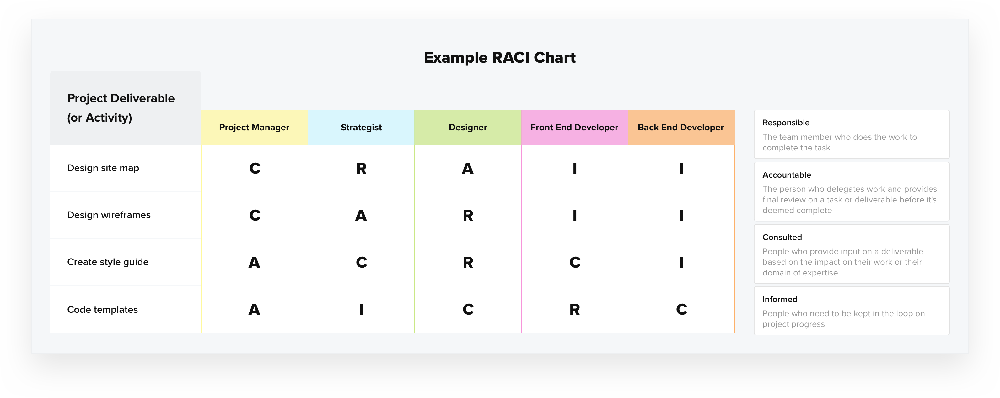

# Pré-face

_Pré-face auto-générée par intelligence artificielle[^OpenAIGPT3] puis traduite et adaptée par l'auteur. Ce chapitre illustre l'intérêt de mettre en place de nouvelles structures d'organisation face à la rapidité des innovations numériques. Considérez que cette capacité peut être maîtrisée par l'un de vos concurrents : vous devez être en mesure de déployer vos innovations au moins aussi vite que lui pour rester compétitif._

_Entrée fournie à GPT3 : "Write the preface of a book whose title is "Transforming institutions thanks to DevOps" explaining the benefits of a DevOps transformation and how organizations are succeeding in their digital transformation."_

La transformation numérique est un sujet d'actualité pour les institutions. Elles cherchent des moyens d'améliorer leur efficacité à l'ère numérique. Pour ce faire, elles adoptent notamment les pratiques DevOps.

Le DevOps est un ensemble de principes et de pratiques qui aide les organisations à améliorer leurs pratiques de développement et de déploiement logiciels. Cela les aide à être plus agiles, à déployer des logiciels plus fréquemment et à obtenir plus rapidement des retours de la part des clients.

Les organisations qui ont adopté la méthodologie DevOps ont constaté des avantages significatifs : un délai de mise sur le marché plus rapide, une satisfaction cliente accrue et une efficacité opérationnelle améliorée.

Ce livre vous décrira comment le DevOps peut aider votre organisation à transformer ses pratiques de développement et de livraison de logiciels. Il fournira également des exemples de pratiques employées dans des grandes organisations, qui ont mis en œuvre avec succès la méthodologie et listera les leçons apprises.

Si votre organisation cherche des moyens d'améliorer son processus de développement et de déploiement de logiciels, ce livre est fait pour vous.

# Introduction

De nombreuses organisations ont déjà entamé leur transformation dans le but d'atteindre un fonctionnement en mode "DevOps".

TODO(flavienbwk): GCHQ [going DevOps](https://www.gov.uk/government/publications/defence-artificial-intelligence-strategy)

TODO(flavienbwk): Department of Defense going DevSecOps :
- https://dodcio.defense.gov/Portals/0/Documents/DoD%20Enterprise%20DevSecOps%20Reference%20Design%20v1.0_Public%20Release.pdf
- https://breakingdefense.com/2021/05/dod-publishes-devsecops-2-0-docs-for-accelerating-apps/

TODO(flavienbwk): Devops Institute, [report 2022 (p16)](https://cloud.berwick.fr/apps/files/?dir=/LIVRES/Others&openfile=184076) : chiffres sur la DevOps comme méthodologie conduisant les transformations numériques

Le DevOps étant avant tout un sujet de transformation culturelle des équipes informatiques et du _management_, il existe déjà de nombreuses études sérieuses auxquelles se référer, pour ne pas faire d'erreur dans son initiative de transformation. A titre d'exemple, le programme de recherche DORA[^DORAWebsite] de Google Cloud (_DevOps Research & Assessment_) s'est conduit depuis 2014 avec plus de 33 000 professionnels du secteur. Chaque année, un rapport sur l'état du DevOps dans le monde est publié. Ce domaine est donc loin d'être nouveau. Mais le secteur ne cesse de trouver des manières toujours plus efficaces de se transformer, afin d'être en mesure de rivaliser face aux enjeux d'un monde numérique en perpétuelle évolution.

Ce livre concentre à la fois les aspects organisationnels et les aspects techniques, pour illustrer chaque notion de la méthodologie DevOps. Comprenez par là que vous n'avez pas besoin d'être ingénieur pour comprendre ces notions. Néanmoins si vous souhaitez les mettre en pratique, une bonne partie nécessitera des experts en ingénierie. Dans tous les cas, en tant que responsable d'une initiative DevOps, vous vous devez de maîtriser les aspects technique pour prendre les meilleures décisions et rester crédible face à vos subordonnés et votre hiérarchie.

L'idée est de vous donner une ligne directrice pour vous orienter vers une première expérimentation DevOps, ou d'affiner celle que vous soutenez.

Comme vous le comprendrez par la suite, chaque organisation a ses propres besoins et il n'y a pas de recette unique. Néanmoins, des standards éprouvés existent. C'est ceux-là qui vous seront présentés.

Soyez assuré que les efforts que vous déploierez à faire du DevOps dans votre organisation, seront récompensés par une organisation plus efficace, agile et pérenne.

# DevOps vs Site Reliability Engineering

Si le terme DevOps devient de plus en plus populaire et commence à devenir courant dans les offres d'emploi, celui de _Site Reliability Engineering_ (SRE) est moins connu, en particulier en France.

Pour bien débuter et comprendre comment le DevOps peut aider votre organisation, commençons par définir deux des termes les plus importants à connaître dans le domaine.

## DevOps

C'est le lien entre le monde du développement et de la production.

« Dev » signifie « développement » pendant que « Ops » désigne l'exploitation des systèmes informatiques en production.

On qualifie de « DevOps » (_Development and Operations_) le mouvement organisationnel et culturel qui a pour but de fluidifier le cycle de développement logiciel, les déployer plus rapidement et améliorer leur fiabilité en production. Il atteint cet objectif en facilitant la communication, la collaboration et l'intégration des parties-prenantes (développeurs, ingénieurs d'exploitation, équipes de sécurité, responsables projet et utilisateurs). Le tout au travers de techniques et d'outils informatiques.

L'ingénieur « DevOps » est celui en charge de définir et d'implémenter ces techniques au sein de votre organisation. En équipe, il garantit la cohérence des développements avec les exigences du déploiement. Il le fait le plus en amont possible, souvent avec des [scripts automatisés](#continuous-integration-ci) au sein d'une [usine logicielle](#usine-logicielle).

Ce poste impliquant de mettre d'accord toutes les parties prenantes sur une méthode de travail commune, il est exigé de disposer d'excellentes compétences en communication et en pédagogie.

## Site Reliability Engineering (SRE)

Le _Site Reliability Engineer_ ou _Ingénieur de la Résilience des Systèmes_ a la charge de concevoir, déployer et maintenir l'infrastructure qui met à disposition les services de l'entreprise. Il s'assure du bon fonctionnement du socle technique sur lequel sont déployés les logiciels, assure la sécurité et garantit leur disponibilité.

L'équipe SRE a donc la responsabilité de votre infrastructure informatique. Cette dernière est souvent composée de plusieurs environnements : développement, pré-production (également appelé _staging_), production.

## En deux phrases

En résumé, l'ingénieur DevOps est responsable de la mise en place de l'ensemble des prérequis nécessaires à la mise en production rapide d'un logiciel, selon les standards de qualité des équipes SRE. Le SRE est lui responsable de la mise en production effective des logiciels et garantit leur disponibilité.

## DevSecOps

Le terme DevSecOps est également populaire. Il qualifie les procédures DevOps intégrant nativement les considérations de sécurité dans le cycle de développement du logiciel et son exploitation en production.

En terme organisationnel, il s'agit principalement d'intégrer les équipes de Sécurité des Systèmes d'Information (SSI) dans tous les échanges entre les développeurs et les équipes de production. Ces équipes auront la charge de définir et contrôler l'existence des fonctionnalités de confidentialité et de sécurité dans les logiciels, dès la phase de conception.

Par exemple, l'existence des fonctionnalités rendant le logiciel conforme au RGPD[^RGPD] ou aux politiques de besoin d'en connaître de votre organisation. Cela peut également être la mise en place de [détecteurs automatiques de vulnérabilités](#continuous-integration-ci) dans le code.

Nicolas CHAILLAN, ancien Directeur de l'Ingénierie Logicielle au sein de l'Armée de l'Air américaine [le définit](https://podcast.ausha.co/postmortem/19)[^DevSecOpsUSAirForce] de cette manière :

> « Le DevSecOps est l'évolution de l'ingénierie logicielle. C'est l'équilibre entre la vélocité de développement et le temps alloué aux considérations de sécurité. On veut que la sécurité soit intégrée pour être sûr qu'elle ne soit pas oubliée mais ajoutée au cycle de développement logiciel. C'est utiliser les procédés de cybersécurité modernes pour être sûr que le logiciel est à la fois performant et construit d'une manière sécurisée pour être sûr qu'il n'ait pas de problème au fil du temps. C'est ce qui va permettre aux sociétés et organisations de rester concurrentielles et d'avancer à l'avenir à la vitesse nécessaire face à leurs concurrents. »

Nous n'en parlerons pas davantage en ce terme car le DevSecOps est à mon sens analogue à la méthodologie DevOps et plus généralement à l'ingénierie logicielle moderne : la sécurité est un prérequis indiscutable de toute organisation et ses bonnes pratiques s'intègrent nativement avec les techniques DevOps qui vont vous être présentées.

Les paradigmes de sécurité dans un modèle d'organisation DevOps seront abordés dans le chapitre "[Sécurité : un nouveau paradigme dans l'approche DevOps](#sécurité--un-nouveau-paradigme-dans-lapproche-devops)".

# Les cinq piliers du DevOps

Selon la réputée entreprise américaine [Atlassian](https://www.atlassian.com/devops/what-is-devops/history-of-devops
)[^AtlassianHistoryOfDevops], le mouvement DevOps a commencé à prendre forme entre 2007 et 2008, lorsque les métiers de l'ingénierie système (ceux qui déploient) et du développement logiciel (ceux qui développent) se sont inquiétés de ce qu'ils considéraient comme un dysfonctionnement fatal avec leurs pratiques opposées dues à leur manque de proximité.

Initialement, le DevOps se concentrait sur la manière d'améliorer l'efficacité du développement et du déploiement des logiciels. En 2022, c'est une méthodologie qui a évolué et regroupe un nombre de domaines bien plus vaste comme l'administration système, la sécurité ou encore la garantie de qualité (systèmes et logiciels). Autour de 2015, la méthodologie DevOps était principalement employée dans les grandes entreprises américaines de la technologie (GAFAM[^GAFAM] et NATU[^NATU]) ou des entreprises employant déjà la [méthodologie agile](#être-au-plus-proche-du-métier). Bien répandue aujourd'hui, des organisations de toute taille l'utilisent partout dans le monde, au sein de tout type de secteur[^GoogleCloudDevopsLeaders] (santé, finances, transports, gouvernements, industrie lourde...) et même si elles ne travaillaient pas encore en mode agile.

Le terme DevOps est attribué à l'ingénieur français Patrick DEBOIS qui a écrit en 2015 le livre « Le manuel du DevOps : comment instaurer une agilité, une fiabilité et une sécurité de référence dans les organisations technologiques [^TheDevopsHandbook]». Il y décrit la manière dont les organisations peuvent augmenter leur rentabilité, améliorer leur culture d'entreprise et dépasser les objectifs grâce aux pratiques DevOps.

La SRE est une discipline beaucoup plus ancienne du temps où Ben TREYNOR SLOSS, ingénieur chez Google, fonda en 2003 une équipe de ce nom. Il sera le père fondateur de la SRE et des premières pratiques DevOps.

Selon Google, voici les cinq piliers du DevOps :

1. [**Réduire les silos organisationnels**](#réduire-les-silos-organisationnels)
   - En cultivant l'engagement, le sentiment du partage de responsabilité des succès et des échecs entre les parties-prenantes (ingénieurs, responsables projet, utilisateurs/métiers). Chacun est davantage impliqué et se sent légitime à son niveau.
2. [**Accepter l'échec comme normal**](#accepter-léchec)
   - En partant du principe que l'échec est une conséquence du manque de procédures et de méthodes de la part de l'organisation.
3. [**Réduire le coût du changement**](#réduire-le-coût-du-changement)
   - Implémenter petit à petit, déployer rapidement, échouer rapidement pour itérer.
4. [**Tirer parti de l'automatisation**](#tirer-parti-de-lautomatisation)
   - Automatiser pour ne pas perdre de temps et améliorer la maintenabilité de l'infrastructure.
5. [**Tout mesurer**](#tout-mesurer)
   - Avec la mise en place d'indicateurs de performance, de fiabilité des systèmes, pour mieux comprendre le comportement des services déployés, réagir plus rapidement voire prédire.

# Le DevOps, d'expérience

Une initiative DevOps est une transformation radicale à l'échelle d'une organisation. Si cette dernière n'est pas encore passée au [mode agile](#être-au-plus-proche-du-métier), elle bouscule tous les niveaux de l'entreprise pour arriver à faire travailler chacun ensemble. Le DevOps ne rapproche pas que les "Dev" (ingénieurs-développeurs) et les "Ops" (ingénieurs systèmes) mais également et surtout le _management_. Cette dernière doit accepter un changement souvent vécu comme difficile car inconnu. La plupart du temps, cette transformation nécessite également une modification importante de l'architecture des systèmes informatiques de l'organisation, car elle implique l'usage de nouveaux outils.

L'empathie est aptitude clé pour faire aboutir une transformation. Pour certains, ces nouvelles méthodes de travail et ces outils constituent un modèle à l'opposé de ce qu'ils ont toujours appris et fait.

Voilà pourquoi il est important d'acculturer aussi souvent que possible sa hiérarchie à l'intérêt de passer en mode DevOps, lui faire des démonstrations, répondre à ses moindres questions et l'accompagner jusqu'à ce qu'elle comprenne bien les enjeux. Votre organisation doit être en mesure de répondre aux défis technologiques toujours plus modernes et rapides. Elle ne le fera pas en restant sur ses acquis.

## Préjugé

> « Je n'ai besoin que d'un ingénieur SRE/DevOps »

**Non.**

Prenons un exemple. Vous commencez avec une équipe de 2 personnes qui développent un logiciel. Vous avez déjà plusieurs problèmes, particulièrement si vous travaillez hors internet :

- Qui met en place l'infrastructure pour correctement développer ce logiciel ? (usine logicielle, miroirs de dépendances, registres de librairies…)
- Qui sécurise cette infrastructure ?
- Qui gère les sauvegardes ?
- Qui définit les règles de développement et leur cohérence pour maintenir les logiciels dans le temps ?

Si vous ne comptez que sur vos ingénieurs logiciels, ils finiront par générer de la dette technique qui empirera au fur et à mesure que votre équipe grandira. Ils ne se concentrerons pas sur le développement et s'éparpilleront sur des tâches de SRE. Cette situation nécessite déjà au moins 1 ingénieur SRE/DevOps.

Maintenant que vous avez recruté, votre équipe grandit à 6 ingénieurs : il faut leur fournir des machines, les configurer, certains rencontrent des bugs, d'autres vous demandent de mettre à jour des librairies… Si en plus vous avez des impératifs en termes de sécurité (ex : homologation, journaux d'évènements), il faut prendre le temps de correctement configurer les outils et l'infrastructure. Cela vous fait donc au moins 1 ingénieur SRE/DevOps supplémentaire.

Admettons que vous perdiez 2 ingénieurs. Il s'avère que vous devez toujours maintenir l'infrastructure qui est passée à l'échelle pour répondre aux besoins de vos 6 ingénieurs et les X machines que vous avez installées.

Comprenez que vous avez besoin d'une masse critique de profils SRE/DevOps dans votre équipe. Cette masse critique doit évoluer en fonction du nombre de collaborateurs et vous ne pouvez pas en retirer facilement.

Des rapports[^DORAReportSREPractice] appuient cette théorie : pratiquer le SRE n'affecte pas la résilience de l'entreprise avant d'avoir acquis un certain niveau de maturité. C'est à dire qu'il vous faudra atteindre une masse critique avant d'être en mesure de tirer les bénéfices de ces outils et pratiques.

![Ratio des bénéfices de résilience pour l'organisation par rapport aux efforts d'adoption des pratiques SRE. On constate qu'il faut un certain nombre d'équipes SRE pour obtenir des bénéfices significatifs[^DORAReportSREPRacticesFigures].](./images/adoption-of-sre-practices.png)

A titre d'exemple, avec sa taille Google maintient son ratio de SRE/développeurs à environ 10%[^GoogleWorkBookEngagementModel]. Ce ratio doit néanmoins avoir une [tendance logarithmique](https://en.wikipedia.org/wiki/Logarithm#/media/File:Binary_logarithm_plot_with_grid.png) quand vous débutez.

## Too big, too soon

Au sein des organisations que j'ai côtoyées, j'ai pu être témoin d'un tas de projets qui ont échoué. Les causes étaient souvent un périmètre mal définit ou des objectifs trop exigeants. De mauvaises planifications qui augmentaient les délais et les coûts sans fin, pour devoir en cours de route trouver une « solution intermédiaire » en attendant que la première vienne hypothétiquement au jour.

Une initiative DevOps se bâtit avec l'existant au sein de votre institution : il faut réussir à commencer petit pour correctement saisir les besoins des métiers et embarquer toute l'organisation dans l'aventure.

Ayez l'audace de commencer petit et d'itérer à mesure que vous et votre institution vous acculturez aux enjeux et défis de ces nouvelles technologies. Veillez à ce que chaque équipe que vous convainquiez soit à son tour un évangélisateur de votre initiative.

Changer la culture d'une institution prend du temps, mais prendre des raccourcis risquera de vous mettre du monde à dos, de démotiver vos équipes et de faire échouer votre projet.

## Les initiatives dans les organisations

Parmi les organisations avec lesquelles j'ai pu travailler, j'observe que les nouveaux décideurs - averses au changement - demandent à leurs subordonnés de trouver "dans les plus brefs délais" des solutions aux problèmes qu'ils découvrent.

La plupart du temps, il s'agit de trouver des solutions techniques, faciles à concevoir et à déléguer. Des initiatives - plus ou moins matures - existent souvent déjà au sein de l'organisation. Elles peuvent même parfois suggérer des pratiques s'approchant d'un fonctionnement en mode DevOps.

Ces nouveaux responsables aiment se mettre en ordre de marche pour acheter des technologies "sur l'étagère", ou lancer un tout nouveau projet. Leur volonté est d'obtenir un effet immédiat - à différencier d'un résultat immédiat. Mais ils se lancent en faisant fi des contraintes inhérentes à l'organisation : maturité de l'environnement organisationnel et technique, volume ou type de données supportés par les outils, matériel et RH disponible, dette technique, courbe d'apprentissage... Ces contraintes sont déjà souvent connues depuis des années par les experts internes. Contraintes ayant justement mené à des initiatives pour y répondre : soit ignorées, soit négligées, soit seulement inconnues.

Malheureusement, ces décideurs ont rarement l'habitude d'aller faire le tour de l'organisation et oser poser des questions. Ils ont la plupart du temps l'irrésistible tentation de privilégier leurs propres réflexions, en faignant demander conseil à leurs experts. Cela résulte en une concentration des efforts vers des projets peu étudiés et peu fédérateurs, une mauvaise communication et donc de la frustration pour les employés comme pour les métiers.

Une parfaite illustration est celle du Ministère des Armées américain qui a souhaité lancer une nouvelle initiative DevSecOps nommée _Vulcan_[^DISAVulcan] 4 ans après l'initiative _Platform One_[^PlatformOne] de l'Armée de l'Air américaine, dont la finalité était identique.

Néanmoins, en tant que meneur d'une initiative, vous devez comprendre la crainte des décideurs vis-à-vis d'une initiative interne : confier un projet ambitieux disruptant les pratiques organisationnels a plusieurs risques. Premièrement si vous décidez de monter votre propre équipe, il se peut que ces personnes partent à n'importe quel moment, laissant derrière elle un travail qu'il n'est souvent pas possible de reprendre au vu de la maturité des réflexions qu'elle entreprenait. Voilà pourquoi beaucoup d'organisations préfèrent payer un tiers-partie, avec un cahier des charges pour que le décideur soit certain d'obtenir un résultat (au vu de l'obligation contractuelle du tiers-partie). Nous verrons dans le chapitre "[Être au plus proche du métier](#être-au-plus-proche-du-métier)" que cette pratique est obsolète. Deuxièmement, cela implique un changement culturel qu'il faut être capable d'appréhender. Peut-être qu'il est encore trop tôt pour l'organisation, qu'il faut encore acculturer au travers de présentations et d'exemples de réussites. En effet, il faut que le chef comprenne l'impact de cette transformation sur l'organisation : l'achat de matériel, la transformation de la stratégie RH ou encore la formation des personnels historiques. Aidez vos responsables à se projeter pendant que vous travaillez à changer les choses.

De votre côté, soyez un décideur audacieux, honnête intellectuellement[^BiaisCognitifs] et à l'écoute de vos experts : vous perdrez moins de temps, d'argent et de crédibilité.

## Réorganisations chroniques

« Une de plus ! » s'exclameront vos plus fidèles collaborateurs. Combien de réorganisations a déjà subi votre organisation ? Lors de ma dernière expérience, j'ai pu être témoin de trois réorganisations en trois ans. Une pratique qui brouille le message et ajoute de la confusion pour les équipes.

Dans la plupart des cas, des équipes techniques existent déjà au sein de votre organisation. Elles répondent déjà probablement à des besoins métier qui nécessitent leur présence.

Les responsables avec une mauvaise connaissance des enjeux métiers et techniques sont souvent tentés de vouloir immédiatement convertir les activités de certaines équipes au profit d'un nouveau projet, les compétences y étant présentes. Une équipe se constitue toujours autour d'un projet et a su former sa propre culture. Culture que leurs responsables seraient bien avisés de considérer avant de la rompre.

Le risque de changer considérablement les missions d'une équipe implique que vous soyez particulièrement disposé à la soutenir : c'est rarement le cas, vous n'en avez probablement pas le temps. Leur méthode de fonctionnement actuelle est déjà le fruit de plusieurs restructurations qui ont probablement déjà impacté leurs idéaux et la raison pour laquelle ils ont rejoint votre organisation.

Changer les missions d'une équipe sans considérer sa culture et son passif revient à risquer de perdre des collaborateurs : soit ils seront démotivés par votre projet, soit ils démissionneront. Vous devez leur proposer une vision claire, les convaincre avec des arguments techniques mais surtout écouter leurs remarques.

Du fait de leur passif au sein de votre organisation, les connaissances de ces équipes vous permettront de saisir des notions que vous n'avez pas encore totalement bien appréhendées, qu'importe votre niveau hiérarchique. Soyez ouvert à leurs recommandations et leurs remarques pour comprendre comment réorganiser au mieux cette équipe en fonction de ses aspirations, voire « si » il est nécessaire de la changer.

Piller les ressources RH d'équipes internes pour constituer votre équipe de rêve sans convaincre chacune des parties-prenantes fera échouer votre projet : personne ne serait prêt à suivre un responsable autoritaire démontrant son incapacité à composer avec les ressources dont il dispose. Ce responsable demandera donc probablement à ses équipes des efforts au-delà des missions convenues dans leur emploi du temps.

Si vous estimez ne pas avoir les ressources en interne, ne craignez pas de recruter. Ces équipes ont fait l'effort RH avant vous et ne devraient pas être impactées si elles répondent à un besoin exprimé par votre organisation. Ne cédez pas à la facilité d'imposer une réorganisation : vous frustreriez bon nombre de collaborateurs, perdriez du temps et seriez décrédibilisé.

## Refuser le retard technologique

> "C'est normal, nous aurons toujours du retard ici."

Combien de fois ais-je entendu cette affirmation... Après le fait d'être anéanti devant tant de désinvolture, c'est à chaque fois un véritable sentiment d'indignation qui vient à moi.

Certes il peut y avoir un délais, raisonnable selon l'environnement (exigences de sécurité, taille des équipes), mais sûrement pas un retard. Et en aucun cas cette affirmation ne doit devenir la réponse par défaut.

Si le locuteur est sincère, cet état d'esprit ne résulte que d'un manque de connaissance sur les moyens d'atteindre l'objectif. Dans le cas contraire, il s'agit d'un manque de courage, voire pire peut-être pour certains, de fainéantise. Ces comportements n'ont pas leur place en entreprise.

Si la majorité des collaborateurs d'une entreprise en viennent à penser qu'elle a du retard, il y a un sérieux problème. Maintenir le _statu quo_ sur cette situation mène inévitablement au déclin de l'organisation et en la perte totale de crédibilité, de la part de ses employés et de ses partenaires.

Dans l'un de ses articles[^ArticlePSSyndromeCanard], le conférencier et expert en transformation Philippe SILBERZAHN prend l'exemple d'un homme attendant un train qui devait arriver à 9h30. Le panneau d'affichage affiche "A l'heure" malgré qu'il soit 9h35 à sa montre. L'homme songe à prendre une photo du panneau mais se demande "à quoi bon". La majorité des gens trouveraient qu'il chipote pour 5 minutes, seraient agacés, ou diraient que c'est une erreur d'affichage. "Après tout, personne n'y peut rien". C'est avec ce genre de comportement que Philippe SILBERZAHN affirme que les organisations déclinent : elles s'habituent à la médiocrité.

Alors qu'au début le dysfonctionnement est considéré inadmissible, il devient avec le temps de plus en plus acceptable par l'organisation, sans qu'elle se rende compte que cette situation lui coûte du temps et de l'argent. L'effort pour corriger le problème devient de moins en moins justifiable et le silence devient le choix par défaut pour conserver son énergie. Jusqu'à ce qu'une situation irrémédiable se produise (ou qu'un groupe de quelques courageux secouent la structure!).

Mais il faut également savoir communiquer à temps sur ses innovations. Preston DUNLAP, premier directeur technique (CTO) de l'Armée de l'Air américaine, décrit dans sa lettre publique _Défier la Gravité_ combien les "forces bureaucratiques" peuvent nuire à l'innovation si on les présente trop tôt.

> "Certains m'ont demandé quelle fut ma recette pour réussir durant ces 3 dernières années. Je n'en ai pas beaucoup parlé parce-que je savais que si je révélais les éléments trop à l'avance, les forces naturelles de la bureaucratie reviendraient de plus belle, pour rejeter à chaque occasion tout le potentiel de l'innovation." - Preston DUNLAP, Défier la Gravité (_Defying Gravity_) [^DefyingGravity]

Pour éviter le retard technologique, une organisation peut adopter plusieurs pratiques :

- Former de manière continue son personnel, en particulier les décideurs (cf. chapitre "[Former de manière continue](#former-de-manière-continue)").
- Mesurer et mettre en place des indicateurs pour éviter de s'habituer (cf. chapitre "[Tout mesurer](#tout-mesurer)")
- Accepter les réalités et libérer la parole (cf. chapitre "[Accepter l'échec comme normal](#accepter-léchec)", _How SRE creates a blameless culture_[^SREBlamelessCulture])
- Conserver une capacité d'innovation interne pour rester en mesure de critiquer (cf. chapitre "[Modèle d'équipe interne](#modèle-déquipe-interne)", _Comment l’entreprise peut sortir de la spirale du déclin_[^ArticlePSSortirSpiraleDeclin])

# Prérequis

Vous avez beau avoir le meilleur des logiciels, si vous n'arrivez pas à le déployer (sans bug, sans interruption de service, sans assistance), personne n'en sera témoin.

Ce livre n'exigera même pas de votre équipe qu'elle soit particulièrement grande ni même que vos responsables soient déjà convaincus. Néanmoins il exigera que votre équipe, elle, soit convaincue qu'elle peut porter son projet. Bien entendu au cours du temps, l'appui d'autres équipes de votre organisation dans vos expérimentations DevOps sera un argument précieux pour illustrer le succès de votre initiative.

Un responsable ne demande qu'à être convaincu par une initiative de ses subordonnés. Aidez-le à se projeter et à comprendre la plus-value de ce que vous lui proposez.

Cela nécessitera des présentations constantes de l'avancée de votre projet : à la fois pour qu'il se souvienne et pour qu'il comprenne. Il est toujours risqué d'estimer qu'un projet est compris dès la première présentation, surtout quand il s'agit d'un nouveau paradigme que l'on souhaite introduire.

Vous avez besoin d'équipes internes : il y aura toujours des bugs à résoudre, des configurations à adapter et des fonctionnalités à ajouter. Développés en interne ou en externe, vous subirez le phénomène d'érosion des logiciels[^SoftwareErosion]. Ce dernier qualifie les problèmes qu'un logiciel peut subir au cours du temps quand il est laissé à l'abandon : mises à jour de sécurité critiques, espace disque plein, processus qui cessent de fonctionner...).

Ne croyez pas que « l'industriel » pourra résoudre tous vos problèmes : vous allez perdre beaucoup d'argent et vous n'atteindrez pas les objectifs. L'industriel ne peut pas être en permanence dans votre organisation et comprendre chacun de vos enjeux.

Pour amorcer votre initiative DevOps, vous avez besoin :

- D'un responsable d'équipe avec d'excellentes compétences en communication
- De plusieurs ingénieurs logiciels qui développeront vos solutions aux besoins métiers
- De plusieurs profils SRE/DevOps qui développeront votre socle et géreront le cycle de développement/déploiement des logiciels

# Comment convaincre

Convaincre des collègues de travail ou sa hiérarchie n'est pas toujours chose aisée. Si vous souhaitez le faire, je trouve intéressant de suivre les 4 règles données par William MORGAN - directeur général d'une entreprise de technologies - pendant l'une de ses conférences[^WilliamMorganKubecon2018].

Quand vous souhaitez que quelqu'un adhère à votre projet, utilisez ces 4 règles :

1. Identifier qui est affecté (les parties-prenantes)
2. Déterminer ce que la nouvelle solution va leur apporter (les avantages)
3. Comprendre quelles sont leurs craintes (les préoccupations)
4. Atténuer les préoccupations, promouvoir les avantages et communiquer

Selon William, arrivé à un certain niveau d'ingénierie technique, les métiers de commercial et d'ingénieur se confondent : "Un travail d'ingénierie suffisamment avancé est indiscernable d'un travail de commercial".

Par exemple pour une équipe de sécurité, une technologie pourrait [gérer et auditer automatiquement le chiffrement des flux entre les services](#service-mesh). Leurs préoccupations à l'égard de cette technologie sont : "Est-ce qu'elle va rendre la plateforme plus sécurisée ?" ou "Quels sont les nouveaux vecteurs d'attaque qu'elle pourrait introduire ?".

Pour les équipes de _management_, une technologie pourrait accélérer le rythme de développement et réduire les interruptions de service. Leur préoccupation sera de connaître les dépendances qui seront introduites par l'emploi de cette nouvelle technologie.

Gardez toujours en tête que si les choses sont telles qu'elles le sont aujourd'hui, c'est qu'il y a des raisons, qu'il y a eu des contraintes qui vous échappent encore (temps alloué, moyens RH, moyens financiers, appui politique...) et que vous n'êtes pas là pour blamer les acteurs du passé. Une fois que vous semblez avoir les enjeux et les acteurs de l'organisation en tête, passez à l'action !

# Modèle d'équipe interne

## Le développement interne comme véritable alternative

Dans le chapitre "[Refuser le retard technologique](#refuser-le-retard-technologique)", j'évoque l'innovation interne comme moyen pour éviter le déclin d'une organisation. Mais je me dois de préciser en quoi le développement interne au delà d'être utile et pratique, s'avère être une condition si l'entreprise souhaite rester compétitive.

Quelle entreprise responsable d'un gros projet informatique dans le privé (c'est à dire quasiment toutes en 2022), pourrait se permettre de dire "Nous n'avons pas besoin d'expert informatique" ? Le recours aux sociétés de conseil est chronique dans les grandes entreprises. Cela est dû principalement au manque d'audace des décideurs à l'idée de monter leurs propres équipes techniques.

Les différentes forces d'une équipe interne vis-à-vis d'équipes externes :

- Une compréhension au jour le jour des enjeux de l'entreprise
- Une meilleure compréhension des forces et des faiblesses de l'entreprise
- Une meilleure compréhension des produits et des clients/métiers de l'entreprise
- Un meilleur contrôle sur la feuille de route des projets
- Des outils qui répondent mieux au client / aux besoins métiers
- Des coûts de développement réduits
- Une source d'expertise pour orienter les décideurs (capacité de critique)
- Un support de proximité pour les utilisateurs, sans surcoût
- Des mises à jour plus rapides, en lien direct avec le besoin exprimé
- Si votre entreprise manipule des données confidentielles ou classifiées : moins de risques de fuite et des coûts limités

Compter uniquement sur une ressource externe (des industriels) pour effectuer vos projets informatiques mènera inévitablement à des coûts prohibitifs. Sans expertise interne, vous êtes à la merci des talentueuses équipes commerciales de ces entreprises qui ne manqueront pas de vous vendre un tas de services dont vous n'aurez jamais l'usage.

La raison principale de la frilosité des décideurs à l'égard des développements internes est la maintenance. Ils ont raison : payer un industriel leur coûte cher mais ce dernier est tenu d'honorer sa prestation par un contrat. Voire de maintenir le logiciel, pourvu qu'on le paye. Un seul développeur interne - peu outillé car peu soutenu - risque d'échouer. Cela mettrait en cause la responsabilité du décideur.

Ainsi, embaucher deux ou trois ingénieurs ne suffira pas pour pérenniser vos développements. Pour réussir à proposer une solution utile, qui puisse être une véritable alternative maintenable et crédible pour votre hiérarchie, vous devrez monter une équipe plus conséquente.

En outillant cette équipe d'un véritable environnement de développement (cf. "[Usine logicielle](#usine-logicielle)") et en incluant de bonnes pratiques DevOps, elle aura le temps de s'attarder sur la qualité de vos logiciels. C'est un investissement en temps, un moment difficile à passer avec votre hiérarchie, mais elle ne sait pas encore que ce sera prochainement une véritable aubaine !

Dans l'une des entreprises pour laquelle j'ai travaillé, le développement interne d'un logiciel par un ingénieur a permis d'économiser plusieurs millions d'euros. Les programmes industriels équivalents n'avançaient pas et les métiers restaient démunis. Il a fallu un seul ingénieur - certes brillant - pour résoudre un problème qui durait depuis plus de 6 ans.

Grâce aux règles DevOps exigeant des standards de qualité logiciels, plus de 10 développeurs au cours des 3 dernières années ont pu contribuer à ce projet pour le maintenir et l'améliorer. Il reçoit encore aujourd'hui de nombreuses mises à jour hebdomadaires.

Au delà d'apporter une solution concrète à un problème, cet ingénieur a surtout permis d'acculturer l'ensemble de la hiérarchie aux notions de développement moderne et de techniques de _machine learning_. Devant les industriels et convié aux grandes réunions stratégiques, il est devenu le référent _machine learning_ de l'organisation. Sans qui personne en interne ne serait en mesure de spécifier un besoin _machine learning_ en toute connaissance de cause.

## Équipes « innovantes » et « intelligence artificielle »

Nombreuses sont les organisations qui ont voulu stimuler leurs organisations en créant des « équipes innovation » au sein de leur structure. Et nombreuses sont celles qui n'ont pas vraiment réussi à déployer en production ce qui y était développé.

Les cas d'usages tournent souvent autour de la data et de l'intelligence artificielle. Les buzz-words « data-scientists », « deep learning » et « intelligence artificielle » ont procuré de nombreux faux espoirs : beaucoup d'organisations ont recruté des profils data-science qui se sont retrouvés incapables de mettre en production leurs algorithmes dans une interface à l'attention d'opérateurs non-experts.

Le problème n'est pas les data-scientists, mais bien les décideurs qui jusqu'à récemment ne comprenaient pas ce qu'impliquait la réponse au besoin métier : un socle de développement fiable, des données propres, des données massives, du suivi de modèles[^ModelsIA] (MLOps), une équipe de mise en production. En somme, beaucoup pensaient (et continuent de penser) que « l'IA » peut résoudre n'importe quel problème avec quelques lignes de code. Ces personnes n'ont pas conscience de ce que ces pratiques impliquent en termes d'infrastructure et de soutien technique.

L'exemple typique de la data-science vis-à-vis du DevOps est le besoin de puissance de calcul, de capacité de stockage et de services pour développer et suivre l'entraînement de ces modèles. La plupart des data-scientists ne seront pas en mesure d'installer seul leur Jupyter Notebook[^JupyterNotebook] et drivers GPU[^DriversGPU].

En résumé, ils ne sont pour la plupart pas en mesure d'installer leur environnement de développement, surtout dans des environnements singuliers, inhérents aux grandes organisations.

## Être au plus proche du métier

Ce qui permettra à votre équipe de se différencier, c'est l'appui que vous fournissez à vos opérateurs. Votre avantage par rapport aux équipes de développement traditionnelles ou aux industriels est que vous pouvez être en forte proximité avec les métiers de votre organisation.

C'est la fameuse méthodologie « agile » à l'apposé du « cycle en V » (ou méthodologie _waterfall_): les techniques DevOps vous permettent d'être tellement réactif que vous pourrez passer plus de temps avec votre client, pour mieux comprendre son besoin et traiter ses retours ou suggestions.

Dans de nombreuses organisations, on travaille encore en « V » : l'industriel vient voir l'équipe métier qui a émis un besoin - cette équipe propose d'ailleurs souvent une solution technique plutôt que d'exposer les problématiques qu'elle rencontre – puis un PowerPoint est créé 1 mois après pour voir le résultat du développement 4 mois après. Sur des problématiques techniques, le logiciel produit est déjà périmé et les équipes ayant fait la demande ont même déjà changé.

Au-delà de la solution que vous apporterez en elle-même, vos métiers constateront que votre modèle de fonctionnement est efficace et soutiendront par conséquent votre initiative. Votre objectif en tant que chef d'équipe doit être de pouvoir faire témoigner des représentants d'équipes métiers que vous avez aidé grâce à vos outils lors de présentations importantes. Ces représentations permettront d'asseoir votre crédibilité et d'éviter que votre équipe ait une image de simple « prestataire de développement technique ».

Cette proximité avec les métiers permettra à vos équipes de se sentir davantage impliquées dans les missions de votre institution. C'est une dynamique gagnante à la fois pour vos ingénieurs et les opérateurs. Chacun se nourrit ainsi de la connaissance de l'autre : l'ingénieur découvre le fond du sujet, comprend mieux le problème, pendant que l'opérateur spécifie son besoin le plus précisément possible.

L'illustration de Henrik KNIBERG[^HenrikKNIBERG], coach agile, nous permet de bien cerner l'intérêt de la méthodologie agile : on préfère livrer à chaque étape quelque chose qui fonctionne - bien que non abouti - pour récolter les retours utilisateur et itérer.

Vous avez dû probablement vous en rendre compte au cours de votre carrière : le client ne sait souvent pas exprimer ce qu'il veut exactement. La méthodologie agile et ultimement la méthodologie DevOps permettent de s'adapter aux réalités du métier au cours du temps, pour mieux le comprendre et livrer un produit qui répond réellement à ses besoins.

Mettre au contact profils techniques et opératifs est un enjeu de fidélisation au-delà de la plus-value de répondre plus rapidement et précisément aux problématiques internes. Rappelez-vous : vos équipes sont en quête de sens. Elles ne viennent au travail le matin pour répondre à l'ordre de leur supérieur de développer un logiciel mais pour concevoir avec leurs compétences d'expert la solution technique qui répondra le mieux au problème du métier. L'aboutissement du travail d'un ingénieur étant de voir le métier pour lequel son travail a été conçu utiliser ses créations.

## Libérer la parole et dé-siloter l'accès aux données

Vous vous en souvenez, l'un des piliers du DevOps est de dé-siloter l'accès aux données. Si vous souhaitez que vos équipes techniques répondent le mieux à votre besoin, elles ont besoin d'un accès privilégié aux données de votre entreprise.

Abandonnez les « échantillons anonymisés ». Les ingénieurs ont besoin de comprendre précisément de quoi est composée la donnée qu'ils sont censés traiter. Tenter de développer un outil sur des données « anonymes » revient à développer un outil qui ne répond que partiellement au cas d'usage. Autrement dit, vous êtes certain qu'un bug se produira dès lors qu'une donnée « inconnue » passera dans le logiciel. Fournissez à vos équipes les données de production qui ont vocation à être utilisées dans les outils : vous perdrez moins de temps en résolution de bugs et améliorerez la qualité du service fournit par vos logiciels. Si vous ne leur permettez pas, autant faire appel à un prestataire externe ! (cf. [Être au plus proche du métier](#être-au-plus-proche-du-métier)).

# Sécurité : un nouveau paradigme dans l'approche DevOps

L'idée selon laquelle le DevOps permet de rapprocher les différents métiers pour collaborer ensemble n'est pas simple à appliquer. Les métiers historiques de la sécurité des systèmes d'information (SSI) se sont vu imposer des pratiques auxquelles ils n'étaient pas habitués et qu'ils n'ont parfois pas eu le temps d'appréhender.

Dans les grandes organisations, les règles de l'entreprise ou la loi elle-même imposent que des versions bien arrêtées soient définies pour que le logiciel soit qualifié[^ANSSIQualifiedSoftware] ou homologué. Imaginez alors avoir la charge de faire respecter ces conditions quand les méthodes DevOps impliquent des dizaines de mise à jour logicielles chaque jour : il y a de quoi prendre peur ! Il est donc nécessaire de bien comprendre de quoi est composée une infrastructure cloud, pour correctement redéfinir ce qu'implique sa "sécurité".

La sécurité affecte tous les [piliers du DevOps](#les-piliers-du-devops-en-pratique). Ce chapitre se concentre sur une description haut-niveau des notions de la sécurité dans une méthodologie DevOps, mais citera tous les chapitres où les techniques abordées seront détaillées. Il s'agit de faire de la sécurité proactive (donc automatisée) et d'éviter au maximum la sécurité "documentaire", souvent synonyme de peu d'efficacité.

## Culture de la sécurité

Le rapport DORA[^DORAWebsite] "État du DevOps 2022"[^DORAStateOfDevops2022Announcement] se concentre sur les enjeux de sécurité dans les transformations des entreprises en mode DevOps. Il fait état du fait qu'une entreprise favorisant la confiance et la [sécurité psychologique](#accepter-léchec), est 1.6 fois plus susceptible d'adopter des pratiques de sécurité innovantes. Il ajoute que cette culture permet de réduire de 1.4 fois le nombre de _burnout_[^Burnout] et augmente les chances qu'un collaborateur recommande son entreprise.

La sécurité a toujours été une affaire de culture. La méthodologie DevOps vient cependant apporter toutes les techniques qui permettront à une organisation de ne plus passer à côté des bonnes pratiques, autrefois négligées ou oubliées dans une paperasse longue et indigeste.

L'essentiel est de comprendre qu'en mode DevOps, nous travaillons dans un principe de [cycle itératif d'amélioration](#être-au-plus-proche-du-métier). Les projets ne sont jamais figés en terme de technologie utilisée et les déploiements sont continus sans interaction humaine. Cela permet de ne pas nuire à la vélocité des innovations et de toujours répondre le plus justement possible au besoin du client. Mais ce n'est pas la jungle : il existe des standards technologiques et des procédés qui permettent de contrôler ce qui est déployé, selon les standards de sécurité de votre organisation.

Nous détaillerons plus en détails les aspects culturels de la méthodologie DevOps dans le chapitre "[Accepter l'échec](#accepter-léchec)".

## Intégration continue et sécurité

Vous le découvrirez en détails dans le chapitre "[Continuous integration (CI)](#continuous-integration-ci)", l'intégration continue permet de contrôler automatiquement une modification apportée à un logiciel.

Dès que la moindre ligne de code est modifiée, des tests se lancent. Si une modification du code ne satisfait pas les standards de sécurité définis, elle est refusée. Le développeur est automatiquement informé dans sa usine logicielle (ex: GitLab) que sa contribution ne répond pas à la politique de l'organisation et dispose du message d'erreur expliquant le problème. Il peut ainsi immédiatement effectuer les modifications pour se conformer.

C'est ici qu'on attend l'expertise des responsables de la sécurité. Ces profils doivent expliquer aux ingénieurs DevOps et aux SRE ce qui concrètement doit être contrôlé. Ces règles sont ensuite transcrites en code qui formera des tests automatisés, dans une chaîne d'intégration continue utilisée par tous les projets de l'entreprise.

Ces règles étant versionnées [sous forme de code](#infrastructure-as-code-iac) deviennent des tests automatisés. Elles pourront être mises à jour à souhait et impacteront immédiatement l'ensemble des projets.

Ces tests peuvent se composer : d'une analyse antivirus, de l'analyse de failles dans les images Docker du projet ou encore de s'assurer qu'il n'y ait pas de secrets poussés par inadvertance.

![Exemple de chaîne d'intégration continue dans GitLab[^KilalaGitlabPipelineExample]](./images/ci-pipeline-gitlab-security.png)

Dans la capture d'écran ci-dessus, vous pouvez observer une chaîne d'intégration continue à 5 étapes (Build, Test, Release, Preprod, Integration). La colonne qui nous intéresse est "Test". Elle comporte différents tests de sécurité qui sont lancés et qui ont dans ce cas soit réussi (coche verte), soit comporte des avertissements (point d'exclamation jaune). Si un test avait échoué, nous aurions vu une croix rouge. Un point d'exclamation signifie que le test en question n'est pas passé mais qu'il n'était pas critique (ex: une dépendance logicielle dépréciée mais sans faille de sécurité).

Dans une approche DevOps, les développeurs ne partent pas d'un projet vide. Ils partent d'un modèle (ou _template_)[^GitLabCustomTemplate] qu'ils copient et qui intègrent toutes les règles de sécurité, en plus d'autres fichiers utiles pour démarrer. Veillez à ce que les équipes de sécurité co-contribuent à ces modèles pour que tout nouveau projet intègre vos standards de sécurité. Cela permettra de faire gagner du temps à tout le monde.

## Dépendances externes

Les pratiques SSI au sein des grandes organisation, requièrent que tout logiciel déployé soit homologué. Le document d'homologation doit lister les dépendances utilisées dans le logiciel : les librairies tiers-partie sur lesquelles ils se basent. Cela se nomme en anglais le _Software Bill of Materials (SBOM[^SBOM])_, en français "Nomenclature du logiciel".

Cette pratique est fastidieuse, mais permet lorsqu'une nouvelle faille est découverte de facilement et rapidement répondre aux questions "Sommes-nous affecté ?" ou encore "Où est utilisée cette librairie dans nos logiciels ?" pour rapidement pouvoir la mitiger.

Néanmoins dans une approche DevOps, l'usage de ces librairies évolue au cours du temps. Une technologie utilisée un jour sera peut-être remplacée demain. Vous ne pouvez donc pas demander aux développeurs de mettre à jour la liste de ces centaines (voire milliers) de dépendances utilisées dans leurs logiciels.

L'avantage de la méthodologie DevOps est d'utiliser une technologie de déploiement standardisée : le conteneur. Cela nous permet d'utiliser des outils pour analyser de quoi ils sont composés et prévenir les failles de sécurité. Le SBOM peut donc être remplacé par deux choses :

- Des chaînes d'intégration continue qui détectent et refusent l'utilisation de librairies spécifiques automatiquement (ex: analyse des `package.json` en Javascript, `requirements.txt` en Python)
- Des chaînes d'intégration continue qui intègrent de l'analyse de vulnérabilités dans les containers (ex: Trivy[^Trivy], Quay Clair[^QuayClair])

Au lieu de lister les dépendances, il s'agit de mettre en place une détection continue des librairies utilisées, pour tous les projets. Il faut pouvoir alerter au plus tôt des menaces et refuser au plus vite les modifications apportant des risques.

## Ressources pré-approuvées

Pour limiter les risques, il est possible de baser les logiciels développés sur des ressources pré-approuvées mises à disposition des développeurs. Chaque brique externe qui constitue le logiciel est pré-approuvée. Il peut s'agir de paquets Python, NPM, Go ou encore d'images Docker qui ont été analysés et pour lesquels les équipes de sécurité se sont assurés qu'il n'y avait pas de faille.

C'est le cas par exemple du service _Iron Bank_ mis en place par le Ministère des Armées américain au sein de _Platform One_[^IronBankPresentation]. Les images Docker  doivent passer par une rigoureuse procédure de sécurité avant d'être approuvées. Ces étapes [combinent des vérifications](https://docs-ironbank.dso.mil/hardening/overview/) [manuelles](https://docs-ironbank.dso.mil/hardening/justifications/) et automatiques mais peuvent déjà faire, dans un premier temps, l'objet de procédures seulement automatisées. Les actions manuelles sont nécessaires pour justifier de l'intérêt d'ajouter une nouvelle image. C'est ce que les équipes de _Platform One_ appellent "l'homologation continue d'images approuvées"[^IronBankHardeningOverview].

![Processus d'homologation continue des images de Iron Bank.[^PlatformOnePresentationWebsite]](./images/continuous-accreditation-approved-images.png)

Dans les organisations traitant des données très sensibles, la politique par défaut est de n'autoriser que l'utilisation de librairies et d'images pré-approuvées (_hardened images_). Veillez néanmoins à considérer l'impact d'un tel choix sur la vélocité des développements. Soyez certain que votre équipe de sécurité et SRE puissent suivre le rythme de la mise à disposition des librairies.

Comme il est assez inenvisageable d'analyser chaque librairie de développement pour s'assurer qu'il n'y a pas de faille, les usines logicielles peuvent se baser sur la signature des fichiers. Les éditeurs de confiance signent chacune de leur librairie[^GitlabSigningProcess], pour que les chaînes d'intégration continue ou les administrateurs systèmes puissent vérifier qu'elle n'a pas été altérée au cours du transfert. Chaque éditeur de confiance émet un certificat que l'équipe SRE peut intégrer dans ses chaînes d'intégration continue pour vérifier que les paquets téléchargés n'ont pas été altérés.

Une méthode plus simple est de n'utiliser que la clé de hashage des fichiers. Chaque fichier est identifié par une chaîne de caractères nommée _hash_, que l'ordinateur peut facilement calculer. Cette chaîne de caractère ressemble à cela : _52dd368c0ed9714f9b84fb885c925da4_. Si lors de l'installation, la dépendance téléchargée dispose d'un _hash_ différent de celui de référence (récupéré depuis Internet sur le site de l'éditeur), le lancement du logiciel est refusé. Ce mécanisme est déjà la plupart du temps implémenté par les gestionnaires de paquets des langages de programmation (ex: `package-lock.json` pour NPM, `poetry.lock` pour Python).

## Revues de code

Dans un monde idéal, toute vérification est automatisée. Néanmoins, il est parfois compliqué de "coder" des vérifications de sécurité avancées, ou vous n'êtes tout simplement peut-être pas dimensionné en RH pour le faire.

En DevOps, on pratique la méthodologie [GitOps](#gitops-et-git-flow) : chaque développeur travaille sur sa propre branche et implémente sa fonctionnalité. Il teste si tout fonctionne comme attendu, puis crée une "demande de fusion" dans la branche principale (plus communément : une _merge request_ ou _pull request_). Ce processus est détaillé dans le chapitre "[GitOps et git flow](#gitops-et-git-flow)".

La revue de code se passe à ce moment-là. Elle est l'occasion pour les ingénieurs d'approuver les modifications des autres, en apportant un regard extérieur avant qu'elle soit fusionnée sur la branche de développement principale.

L'objectif est de vérifier que le développeur n'ait pas fait de grosse erreur dans le fonctionnement du code, ou de s'assurer qu'il n'ajoute pas de dette technique. Par exemple chez Google, une _merge request_ requiert l'approbation de deux ingénieurs avant de pouvoir être fusionnée.

La publication d'une nouvelle version d'un logiciel en production est le moment idéal pour que les équipes de sécurité auditent le code. Cette pratique s'appelle la "revue de sécurité". Toute nouvelle version d'un logiciel est soumise aux règles d'intégration continue précédemment citées avec des tests automatisés de sécurité supplémentaires et optionnellement la validation de l'équipe de sécurité.

Pour les équipes des sécurité, la revue de code a pour objectif de vérifier que le maximum de critères de sécurité sont respectés. Par exemple :

- Présence de journaux d'activité qui recensent les actions utilisateur
- Accès à des sources de données autorisées (cf. chap. "[Service mesh](#service-mesh)" pour forcer ces politiques)
- Pas d'envoi de données vers un service non autorisé (cf. chap. "[Service mesh](#service-mesh)" pour forcer ces politiques)
- Technique de stockage des mots de passe / des cookies
- Respect des fonctionnalités RGPD

GitLab permet par exemple d'obliger l'approbation d'une _merge request_ par des équipes spécifiques[^GitLabRequiredApprovals] (ex: l'équipe de sécurité), avant qu'elle puisse être fusionnée dans une branche principale.

TODO(flavienbwk): Faire le lien avec le [SSDF](https://nvlpubs.nist.gov/nistpubs/SpecialPublications/NIST.SP.800-218.pdf) ?

## Production as code

TODO(flavienbwk): Développer le sujet : pas 1 action qui n'est pas codée et automatisée. [1 action manuelle = 1 bug](#infrastructure-as-code-iac).

## SLSA

https://slsa.dev/get-started

## Développement basé sur le zéro-trust

TODO(flavienbwk): https://software.af.mil/wp-content/uploads/2021/08/CNAP-RefDesign_ver-1.0-Approved-for-Public-Release.pdf

## Compromission

TODO(flavienbwk): Développer le sujet : DevOps pour tracer les actions, centraliser/gérer/analyser les logs via des technologies standardisées (Fluentd, [Istio](https://medium.com/@senthilrch/api-authentication-using-istio-ingress-gateway-oauth2-proxy-and-keycloak-a980c996c259))...

# Les piliers du DevOps en pratique

Ca y est, nous atteignons le cœur du sujet. Dans ce chapitre, nous allons découvrir les différents piliers du DevOps en décrivant les différentes technologies qui peuvent répondre à nos enjeux.

En terme d'organisation, voyez le DevOps comme un moyen d'appliquer une "saine contrainte" à vos équipes, de sorte à inciter chacun à avancer dans la même direction. C'est faire communiquer tout le monde de manière optimale, au moyen d'outils techniques standardisés.

## Réduire les silos organisationnels

TODO(flavienbwk): Développer le sujet. Besoin de remettre tout le monde à la table des discussions. Cartographier. Ordonner une décision forte. Besoin de travailler sur un réseau commun.
<!-- Reduce organizational silos : increase and fasten collaboration breaking barriers around teams, share ownership (engagement) -->

Si vous travaillez pour une institution, vous n'avez peut-être pas la contrainte de la rentabilité mais celle du réseau. Et donc celle de l'adoption. Travaillez à rendre votre outil accessible au plus grand nombre, sur le réseau de travail de vos utilisateurs cibles.

### Le cycle de vie d'un logiciel moderne

L'un des enjeux du DevOps est de fluidifier le cycle de vie d'un logiciel. Vous découvrirez dans ce chapitre les différentes techniques pour atteindre cet objectif.

#### Un réseau unique

TODO(flavienbwk): Développer le sujet

Imaginez quelques instants des data-scientists dans chacun des bureaux de votre organisations. Superbe, tous les métiers ont un appui technique pour traiter leurs données rapidement. Mais rapidement, ces ingénieurs discutent et se rendent compte qu'ils travaillent sur les mêmes sujets, qu'ils développent la même chose. C'est très frustrant pour eux, mais cela veut surtout dire que vous perdez de l'argent.

Si personne n'a idée de ce sur quoi l'autre travaille, les efforts seront naturellement dupliqués. En effet dans les grandes organisations, les besoins sont souvent systémiques : les bureaux rencontrent tous les mêmes - ou quasiment les mêmes - problèmes. Problèmes auxquelles des solutions techniques mutualisées peuvent répondre pour 90% des cas d'usage.

De plus, en travaillant sur un réseau unique, les ingénieurs peuvent mutualiser les environnements techniques au lieu de les re-déployer des services dans chaque silo. Par exemple, il est inutile de dupliquer un miroir de librairies sur une machine à deux bureaux d'une autre. Pour le _machine learning_, il est possible en réseau de bénéficier d'une puissance de calcul mutualisée avec des super-ordinateurs partagés.

Dans l'une de mes précédentes expériences, le principal frein à l'adoption de nos logiciels était le réseau de déploiement. Nous étions contraints de le déployer sur un réseau différent de celui des métiers pour répondre au besoin opérationnel. Pour rendre nos logiciels accessibles sur le réseau des métiers, l'impératif était l'homologation. Pour tout logiciel développé, ce processus mettait en moyenne un an. Déployant des dizaines de logiciels chaque trimestre, homologuer nos logiciels était inenvisageable pour nous (cf. "[Sécurité : un nouveau paradigme dans l'approche DevOps](#sécurité--un-nouveau-paradigme-dans-lapproche-devops)"). Pour les utilisateurs que nous avions le moins le temps d'accompagner, ils délaissaient les outils car l'irritant était trop fort.

Utiliser un réseau unique est un élément clé dans l'adoption de vos nouveaux outils. Il permet à votre organisation de faire des économies et à vos collaborateurs d'être moins frustrés.

Ce chapitre est une introduction à l'un des piliers du DevOps décrit dans ce livre : "[Réduire les silos organisationnels](#réduire-les-silos-organisationnels)". Nous détaillerons le sujet à ce moment-là.

#### Usine logicielle

TODO(flavienbwk): Développer le sujet

TODO(flavienbwk): Le contenu de cette usine logicielle pour employer des pratiques DevOps sera développé

L'étape d'après serait d'ouvrir cette plateforme à des partenaires industriels, afin que chacun puisse ajouter son logiciel selon les règles de l'organisation. Ces dernières seraient définies par des ingénieurs en interne. C'est déjà le cas de _Platform One_[^PlatformOne] qui ouvre son usine logicielle à des industriels contractualisant avec le Ministère des Armées américain. Ou encore de la [_NATO Software Factory_](https://nsf.dev.nato.int/) l'usine logicielle de l'OTAN[^NatoSoftwareFactory].

Néanmoins, je rappelle ici qu'il s'agit de pouvoir développer une expertise en interne avant d'être capable de définir des règles pour les autres. Chaque organisation est différente et se doit [d'avoir ses propres experts en interne pour la conseiller au mieux](#le-développement-interne-comme-véritable-alternative).

#### GitOps et git flow

TODO(flavienbwk): Développer le sujet + schéma

#### Méthodologie à 12 critères

TODO(flavienbwk): Si on veut une plateforme Cloud avec des techniques DevOps efficaces, il y a quelques règles d'ingénierie logicielle à respecter. [Développer](https://12factor.net/) le [sujet](https://cloud.berwick.fr/apps/files/?dir=/PERSO/Flavien/Livres/Me/Transformer%20les%20institutions%20gr%C3%A2ce%20au%20DevOps/3-Reliable%20GCloud%20Infrastructure%3A%20Design%20and%20Process&openfile=171870)

Ces critères - et en particulier le découpage des logiciels en microservices - couplés à des [chaînes de déploiement continue](#continuous-delivery-cd), augmentent de 43%[^DORACDLooselyCoupledArchitecture] les chances d'anticiper les incidents logiciels (ex: pannes, vulnérabilités ou performances de service dégradées).

## Accepter l'échec

Vous devez vous organiser pour accueillir l'échec comme une opportunité de corriger votre trajectoire, vers une meilleure direction. Si vous subissez un échec important, c'est que vous n'aviez pas assez d'éléments pour contrôler la situation.

A l'aide d'outils et de méthodologies incontournables dans le domaine, ce chapitre vise à vous faire comprendre l'intérêt d'une culture d'entreprise qui accepte l'échec. Elle vous permettra de mieux anticiper les risques, pour en prendre davantage en toute sérénité et augmenter votre vélocité.

Cet état d'esprit est un changement culturel qu'une organisation doit instiller en son sein, dans toutes les strates hiérarchiques.

### Sécurité psychologique

> "La sécurité psychologique est la culture selon laquelle une personne ne sera pas punie ou humiliée pour avoir exprimé ses idées, questions, préoccupations ou erreurs." - Amy C. Edmondson, professeure en gestion et leadership à la _Harvard Business School_.

La culture d'une organisation est le fondement de son potentiel. Une bonne culture aide à promouvoir la collaboration et la communication entre les équipes, atout fondamental pour une mise en œuvre réussie d'une initiative DevOps. Cette idée n'est pas nouvelle, et fut théorisée en 2004 par le sociologue Ron WESTRUM dans son article "_Une typologie des cultures organisationnelles_"[^RonWestrumTypologyOfOrganisationCulture].

En prenant soin de la sécurité psychologique de vos employés, vous favorisez les sentiments de responsabilité et d'appropriation partagées du succès et des échecs. Des succès et des échecs partagés, plutôt qu'attribués à des équipes ou acteurs individuels.

Dans un environnement de travail ne tenant pas compte de la sécurité psychologique, les collaborateurs :

- Gardent leurs préoccupations ou leurs idées pour eux
- Ont peur de paraître incompétents ou ignorants
- Ont peur d'être ridiculisés

Comme l'indique Kiran VARMA dans son cours sur la culture SRE chez Google[^CourseraSRECourse], la recherche[^ATheoryOfBlameResearch] a démontré qu'il existe deux facteurs principaux alimentant la tendance des individus à blâmer les autres : le biais rétrospectif et la "décharge d'inconfort".

Le biais rétrospectif est la tendance d'un individu à surestimer sa capacité d'avoir été capable de prédire un évènement. Ce, quand bien même il n'aurait pas pu être prédit. Les humains ont souvent du mal à réaliser qu'une idée est devenue évidente seulement à partir du moment où elle s'est produite. Par exemple : dire en fin de match que vous saviez pertinemment qu'une équipe de foot allait perdre, seulement parce-que vous l'avez annoncé en début du match. Dans le monde professionnel, cela peut mener à blamer la personne en charge de réaliser une tâche, en disant qu'elle aurait "bien pu prévoir la chose évidente" qui allait se passer.

La notion de "décharge d'inconfort" fait référence au phénomène neurobiologique, selon lequel nous blâmons les gens pour nous décharger d'une douleur mentale. La sociologue Brené BROWN déclare que les humains le font contre leur gré, naturellement, mais que blâmer entrave notre capacité à apprendre de nos erreurs[^BrenéBROWNVideoOnBlame].

Dans une organisations qui n'est pas à l'aise avec l'échec, vos collaborateurs auront tendance à cacher des informations ou ne pas déclarer d'incident car ils auront peur d're puni. Pour la même raison ou par peur d'être considérés ridicules, ils auront peur de poser des questions pouvant mener à identifier les causes d'un problème. Or, les erreurs ne sont des opportunités de s'améliorer que si leurs causes véritables sont identifiées. Chose qui n'est possible que dans un environnement de travail psychologiquement sûre.

Une organisation qui tient compte de la sécurité psychologique considère que :

- L'échec doit être traité comme une opportunité pour s'améliorer
- Les nouvelles idées sont les bienvenues et doivent être discutées
- L'échec est le résultat d'un manque de méthodes et de procédures, pas la faute d'un individu

Cet état d'esprit permet d'établir la confiance. L'idée est de remplacer les questions du genre "Qui a fait ça ?" par "Qu'est-ce qu'il s'est passé ?". L'organisation doit se concentrer sur ses méthodes et ses procédures, pas sur les individus. La meilleure pratique consiste à supposer que les collaborateurs agissent de bonne foi et prennent leurs décisions à partir des informations les plus pertinentes dont ils disposent à l'instant T. Enquêter sur la source d'une information erronée est bien plus profitable pour l'entreprise que d'attribuer l'erreur à quelqu'un.

L'innovation requiert un certain degré de prise de risque. Il n'y a pas de nouveau produit ou de nouvelle stratégie ayant 100% de chance de réussir. Donc si tout le monde a peur à l'idée de prendre un risque, personne n'en prendra et votre organisation ne sera plus en mesure d'innover.

Un tas d'autres modèles de décision[^DecisionMakingMindtools] et de gestion de projet[^ProjectManagementMindtools] existent, n'hésitez pas à vous en inspirer.

### Les responsabilités dans un modèle DevOps

En découvrant la multitude de technologies expérimentales à mettre en place au sein de votre organisation pour atteindre un fonctionnement en mode DevOps, vous pourriez naturellement prendre peur à l'idée de devenir le responsable de ce grand et nouveau système.

Ce chapitre vise à mettre en perspectives deux modèles de responsabilité traditionnels avec le modèle DevOps. Libre à vous de piquer dans chacun les méthodologies qui vous semblent les plus opportunes pour votre organisation. Néanmoins, soyez assez audacieux et tentez d'éviter de retomber dans un modèle traditionnel, qui ne vous donnerait que l'illusion de vous transformer.

#### Le modèle RACI

L'un des modèles de partage des responsabilités est le "RACI", pour _Responsible_ (Exécutant), _Accountable_ (Responsable), _Consulted_ (Consulté) et _Informed_ (Informé). Il permet de s'assurer que toutes les parties-prenantes sont conscientes de leurs rôles et de leurs responsabilités dans un projet.

Dans l'illustration suivante, nous avons cinq parties-prenantes pour le développement d'un nouveau site web. Un responsable, un exécutant (personne en charge de la réalisation), des consultés et des informés sont désignés pour chaque activité.

TODO(flavienbwk): Remettre en forme le [tableau](https://assets-global.website-files.com/5a690960b80baa0001e05b0f/5b7198a6ebc80005a6898d46_blog_post_img_Example-RACI-Matrix%402x.png) en français

|   |   |
|---|---|
|   |   |

Une extension du RACI est le RACI-VS[^RACI-VS] qui inclut un validateur (la personne en charge de la validation finale du livrable, une autorité) et un signataire (personne en charge de l'approbation officielle du livrable et qui engage sa signature, une haute autorité).

Le modèle RACI repose sur une séparation claire des rôles et des responsabilités. Cela peut être contre-productif dans une initiative DevOps, qui cherche à promouvoir la collaboration entre les équipes. De plus, le RACI ne tient pas compte de la nature dynamique et en constante évolution du développement logiciel.

Dans un modèle DevOps, tout le monde peut contribuer à un projet. Tout le monde est responsable au même niveau selon son domaine d'expertise. Une modification significative - par exemple pour le lancement d'une nouvelle version d'un logiciel - nécessite l'approbation de chaque équipe (de l'équipe de _design_, en passant par le _marketing_, l'ingénierie et la sécurité).

Bien sûr, si la modification ne concerne pas toutes les parties-prenantes, on évitera de demander à l'équipe sécurité de nous donner son avis sur le changement de couleur de la page d'accueil... Mais l'idée est qu'il n'y a pas qu'un seul responsable ou qu'un seul exécutant : tout le monde est responsable et peut valider ou invalider une modification selon les règles et contraintes du moment.

Bien que - du fait de sa simplicité - le RACI-VS soit souvent le modèle employé par les grandes organisations, il n'est pas un outil efficace dans le cadre d'une transformation DevOps.

Si vous menez une initiative DevOps au sein de votre organisation, votre hiérarchie vous demandera de vous engager sur de nombreuses lignes du tableau ci-dessus. En effet, cette dernière ne connaît probablement pas les nouvelles techniques et technologies que vous citerez. Prenez cette responsabilité pour rassurer vos autorités[^RadioDevOps12]. Vous n'avez rien à craindre puisque vous savez que la méthodologie que vous voulez implémenter est collective et itérative.

#### Le modèle DACI

Le modèle DACI permet de structurer la prise de décision. On l'emploie généralement en réunion pour faire en sorte qu'une décision soit prise à la fin de cette dernière.

Une réunion sous modèle DACI implique la désignation de quatre rôles :

1. Le **_driver_** (meneur) : celui qui oriente le comité vers une décision. Il est en charge de veiller à ce que chacun soit bien informé de l'avancée de la réunion et de répondre aux questions. Il s'assure qu'une décision est prise mais n'influence pas nécessairement le processus. Souvent un responsable de programme.
2. L'**approbateur** : personne qui a le dernier mot lors de l'approbation de la décision. Souvent un responsable ou un dirigeant de l'entreprise ayant un pouvoir de décision. Soyez innovant en invitant un métier ou un client pour qui le projet a été conçu, à endosser ce rôle.
3. Les **contributeurs** : les personnes possédant les connaissances pour éclairer le processus décisionnel. Les experts et les métiers.
4. Les **intervenants informés** : personnes concernées par la décision sans être directement impliquées dans la prise de cette décision. Ceux qui vont hypothétiquement devoir revoir leur travail à la suite de la décision prise. Par exemple les services juridiques, commerciaux ou de support.

Ensuite, l'objectif est de discuter ensemble pour lister en quelques mots les options envisagées. Indiquer pour chacune leur coût, le temps qu'elle nécessitera et autres avantages on inconvénients.

Dans les 5 minutes restantes, définissez la date à laquelle la décision doit être prise (si ce n'est pas tout de suite). Fort de ces ébauches d'options, s'il en reste à étayer, distribuez la tâche à celui en charge de la compléter.

Une fois les options regroupées, les approbateurs prennent la décision et l'autorité distribue les tâches.

Dans un modèle DevOps, les "intervenants informés" sont pleinement impliqués en tant que "contributeurs". Ils ont voix dans la prise de décision car ils possèdent une expertise qui impacte le produit. Sinon, il n'y a aucune raison de leur faire perdre leur temps et un e-mail récapitulatif avec les actions à prendre est suffisant.

TODO(flavienbwk): Remettre en forme le [tableau](https://wac-cdn.atlassian.com/dam/jcr:c9128f95-3430-4ba2-8893-97801feb24f9/Modal-EXAMPLE1new.jpg?cdnVersion=610)

|   |   |
|---|---|
|   |   |

![Exemple d'emploi du modèle DACI pour trier avantages & inconvénients et prendre une décision (dans leur cas, l'option 1). Traduction de l'anglais depuis l'illustration _Atlassian.com_[^AtlassianDACIMethod]](./images/figure-8.jpg)

Une fois votre décision prise, il est temps de communiquer votre décision pour que tout le monde soit à la page. Envoyez le document aux personnes qui doivent en prendre connaissance puis archivez-le.

Une fois archivé, ce document permettra aux nouvelles parties-prenantes du projet de comprendre pourquoi telle ou telle décision a été prise. En menant cette réflexion collective, vous évitez également les biais cognitifs individuels.

#### Le modèle DevOps

Certes, il n'est peut-être pas directement souhaitable de se séparer instantanément d'un modèle type RACI. C'est une question d'outillage que vous devez mettre en place et de culture. Cette dernière prend du temps à changer. Mais c'est bien cela que vous devez viser : un changement de culture dans votre organisation pour que les autorités surpassent leur peur.

En plus des notions évoquées dans les deux derniers chapitres sur la responsabilité dans un modèle DevOps, analysons une réflexion que je retrouve régulièrement.

Vous l'aurez compris, le DevOps incite à ne pas blamer les parties-prenantes. Il est naturel de rétorquer alors que si personne n'est personnellement responsable, les équipes risquent d'être moins attentives dans leurs responsabilités quotidiennes. Comment imaginer un responsable de la production qui supprimerait l'ensemble de la base de données client sans conséquence ? Les responsables doivent bien à un moment comprendre que leurs actions ont des conséquences. Le DevOps répond de deux manières à cet enjeu :

1. Si vos procédures sont valides, il n'y a pas de raison que l'ingénieur ait pu exécuter cette commande. S'il a fait une erreur, c'est que les règles gouvernant la sécurité de votre infrastructure de production n'étaient pas assez fortes (accès aux machines de production par commandes manuelles, absence de contrôle/validation des commandes, absence de sauvegardes, procédure mal décrite, manque de communication...). (cf. chapitre "[Tirer parti de l'automatisation](#tirer-parti-de-lautomatisation)")
2. Vous avez embauché un employé car il connaît son métier (vous l'avez bien eu en entretien). Si vous craignez qu'il n'assume pas ses responsabilités, parlez avec lui ou séparez-vous de lui et révisez votre politique d'embauche. Faites confiance à vos experts. Si vous doutez, demandez-leurs de renforcer les règles de contrôle (cf. point 1) et de vous rassurer avec des scénarios type (cf. chapitre "[Postmortems et premortems](#postmortems-et-premortems)").

Voilà pourquoi il faut commencer avec des moyens, mais avoir l'audace de commencer petit dans son initiative de transformation. Votre entreprise doit progressivement mettre en place les procédures (dans notre cas, les technologies de contrôle des systèmes informatiques) selon ses moyens RH et financiers. Une fois que vous avez éprouvé ces techniques, itérez à plus large échelle.

### Postmortems et premortems

TODO(flavienbwk): Un accélérateur de fidélisation. Réduction du [burnout](https://cloud.berwick.fr/apps/files/?dir=/LIVRES/Others&openfile=183262). Bonne communication pour réduire les burnouts.

TODO(flavienbwk): Postmortem [template](https://cloud.berwick.fr/f/169842).

Quand le postmortem définit un document qui fait suite à un incident, le premortem est un document permettant de savoir quoi faire si tel incident venait à se produire. En amont du lancement d'un projet et tout au long de la gestion de votre production, demandez à vos équipes de rédiger des premortems. Vos chefs de projets et ingénieurs doivent travailler conjointement pour écrire ces "fiches scénario". Cela doit devenir une habitude au cours de l'exploitation et une obligation avant le lancement d'un projet, d'un produit ou d'un nouveau service. Atlassian propose une méthode en 8 points[^AtlassianPremortemMethod] pour effectuer ce type d'analyse.

Il est recommandé de stocker ces documents dans un projet _git_ pour être en mesure de les éditer et de visualiser leurs modifications au cours du temps (cf. chapitre ["GitOps et git flow"](#gitops-et-git-flow)).

### Accélérer la fidélisation

TODO(flavienbwk): [Spotify engineering culture](https://www.youtube.com/watch?v=4GK1NDTWbkY). [HR-Ops](https://cloud.berwick.fr/apps/files/?dir=/LIVRES/Others&openfile=183262).

### Design thinking

TODO(flavienbwk): [Design thinking](https://www.coursera.org/learn/developing-a-google-sre-culture/lecture/bmXLx). [HR-Ops](https://cloud.berwick.fr/apps/files/?dir=/LIVRES/Others&openfile=183262).

## Réduire le coût du changement

TODO(flavienbwk): Développer le [sujet](https://software.af.mil/training/devops/) (Agile vs DevSecOps)

## Tirer parti de l'automatisation

Au sein de systèmes d'informations de plus en plus complexes, il devient fondamental d'automatiser les tâches récurrentes. Les erreurs produites par des machines représentent une fraction infime de celles des humains. Tout ingénieur confirmé pourra vous le confirmer : l'erreur vient 99.9% du temps de l'humain. C'est pour cela que les équipes de Google tentent de minimiser au maximum les interactions de leurs opérateurs pour administrer leurs systèmes[^GoogleWorkbookEliminatingToil].

> "Si un opérateur humain doit toucher votre système durant le fonctionnement normal du quotidien, vous avez un bug. La définition du terme "normal" change au fur et à mesure que vos systèmes se développent." - Carla GEISSER, SRE chez Google

Si vous souhaitez faire de votre système informatique un outil intégré au sein de votre entreprise, vous devez d'abord automatiser les actions répétitives et coûteuses en temps : les actions manuelles (ou _toil_ en anglais).

Cette notion de pénibilité qualifie toutes les tâches manuelles, répétitives et automatisables. Globalement, il s'agit de toutes les tâches peu intéressantes intellectuellement qu'un rebot serait bien plus à même de faire que vos brillants ingénieurs.

Les équipes SRE de Google ont pour objectif de maintenir le travail opérationnel (tâches d'administration manuelles) en dessous de 50% du temps pour chaque SRE. Au moins 50% du temps de chaque SRE doit être consacré à des projets d'ingénierie qui permettront de réduire la quantité future de tâches manuelles ou d'ajouter des fonctionnalités à l'infrastructure.

Ce travail peut commencer par de petites choses au sein de votre infrastructure existante. Nous allons dans ce chapitre les lister selon plusieurs niveaux de maturité organisationnelle. Il vous convient de déterminer quel niveau d'automatisation est le plus acceptable pour votre organisation, selon le niveau d'acculturation technologique de vos équipes d'ingénieurs et le temps que vous voulez accorder à la mise en place de ces technologies.

Gardez cet élément en tête : automatiser est l'action qui permet de réduire la dette technique. Veillez à allouer assez de temps à vos équipes pour qu'elles travaillent dessus.

### Infrastructure as Code (IaC)

Ce terme populaire est simple à appréhender : il s'agit des pratiques et des technologies permettant de rendre la configuration de votre infrastructure explicite sous forme de code informatique.

Voici quelques exemples de configuration :

- Définir le nouveau serveur de temps de toutes vos machines
- Mettre à jour un logiciel en production (cf. : Continuous Delivery)
- Mettre à jour le fond d'écran de toutes vos machines
- Ajouter un nouveau nom de domaine

Bien entendu, quand j'évoque « toutes vous machines », les scripts d'IaC permettent de définir quelles sont exactement ces machines de telle sorte à n'appliquer les modifications que sur tel ou tel groupe de machines.

Cela a plusieurs avantages très importants :

- **Documentation** : les scripts d'IaC sont écrits dans des langages de programmation ou à l'aide de fichiers de configuration standardisés. L'ingénieur consultant le projet peut directement voire comment se comporte la configuration et comment il peut l'utiliser ou la modifier.
- **Fiabilité** : les scripts d'IaC peuvent être lancés par des machines ou des humains, selon l'environnement souhaité (développement, staging, production) en suivant des règles algorithmiques. Il n'y a rien de plus fiable qu'un code exécuté par une machine plutôt qu'un humain. Il est également possible d'appliquer un contrôle de sécurité selon l'utilisateur qui lance ces scripts.
- **Rejeux** : tout script d'IaC se doit d'être idempotent, c'est-à-dire que lancer un ou plusieurs fois le même script doit produire le même effet sur l'infrastructure. Il est donc plus rapide de développer et modifier ce genre de scripts vis-à-vis de scripts traditionnels.
- **Versionnage** : les scripts d'IaC – comme tout autre algorithme – peuvent être versionnés. Cela permet de traquer leurs modifications au cours du temps et d'être critiqués par l'ensemble des équipes techniques au cours du temps.

Des exemples courants de technologies permettant de réaliser ces actions sont : Ansible, Terraform, Puppet ou encore SaltStack.

Chacun a ses avantages et inconvénients, sa communauté. D'autres sont complémentaires. Le tout est d'adopter un format standardisé (pas forcément en n'utilisant qu'une seule technologie) pour que vos équipes SRE s'y retrouvent. Un nouvel arrivant sera grandement aidé par ces pratiques et vos ingénieurs les plus confirmés pourront améliorer incrémentalement ces algorithmes.

Vous pouvez tout d'abord commencer à automatiser vos infrastructures à l'aide de scripts classiques (bash, Powershell) puis passer sur une technologie plus avancée comme Ansible qui standardisera vos configurations.

Reportez-vous au [projet GitHub « ToDevOps »](https://github.com/flavienbwk/ToDevOps#2-deploying-infrastructure-services) [^ToDevOps] pour voir cette technologie en pratique.

### Continuous Integration (CI)

L'intégration continue (continuous integration - CI en anglais) est un ensemble de pratiques permettant de faire tourner des algorithmes automatiquement.

L'évènement déclenchant ces algorithmes est le plus souvent l'apport d'une modification à la base de code mais il peut être également être périodique avec d'autres technologies que nous détaillerons dans cette section.

Voici quelques exemples d'algorithmes qu'il est possible de lancer pour vérifier automatiquement des éléments ou prendre des actions lors d'un évènement déclencheur :

- S'assurer de la présence d'une documentation
- S'assurer que la documentation suit le formatage définit par l'organisation
- S'assurer que la documentation est à jour
- Vérifier que toutes les variables d'environnement sont bien déclarées dans les fichiers appropriés
- S'assurer que des mots de passe n'ont pas été poussés par erreur
- S'assurer de la présence d'un fichier de configuration requis
- S'assurer que le code respecte les standards de développement et de formatage (ex: PEP8, black, pylint...)

Toutes ces tâches contribuent en la réduction de la dette technique de votre base de code et en la plus grande facilité du déploiement de vos projets en garantissant l'implémentation des standards définis par vos équipes DevOps.

Il est courant d'entendre parler de _pipeline_ d'intégration continue (en français "chaîne d'intégration continue") et d'autres termes utilisés lorsque nous pratiquons les technologies de CI/CD. Nous allons définir plusieurs de ces termes.

- Job : une tâche lancée automatiquement lors de l'évènement déclencheur
- Pipeline : enchaînement de jobs
- Stages : les trois étapes d'une _pipeline_ d'intégration continue
- Build : étape contenant les jobs s'assurant que le code compile correctement, que l'image Docker se construit correctement avec les éléments présents dans le répertoire
- Test : TODO(flavienbwk): Développer
  - Exemples :
    - Tester sa documentation : Au cours de l'évolution d'un logiciel dans le temps, les extraits de code dans les documentations peuvent devenir obsolètes et ne plus fonctionner. Istio a développé un outil[^IstioTestDocumentationTool] permettant de s'assurer automatiquement que ces extraits de code soient à jour. Il extrait ces derniers à partir des fichiers _Markdown_ de la documentation et les convertit en exécutables à tester.
- Deploy : TODO(flavienbwk): Développer

.](./images/ci-pipeline-gitlab.png)

Comme cité plus haut, l'intérêt d'une pipeline d'intégration continue est également de tester le code poussé sur plusieurs environnements automatiquement : votre environnement de développement et de préproduction avant de le déployer en production. Néanmoins, ces pipelines multi-environnement introduisent une complexité supplémentaire qu'il faut être en mesure d'absorber lors de sa mise en place par une équipe technique plus importante.

### Continuous Delivery (CD)

TODO(flavienbwk): Développer {From simple CD to complex ArgoCD deployments with [blue/green deployment](https://dev.to/stack-labs/canary-deployment-with-argo-cd-and-istio-406d)}

### Développement piloté par tests

TODO(flavienbwk): Développer le sujet

### Une pratique extrême pour réduire les risques

<!-- English title : Extreme risk management practices -->

TODO(flavienbwk): [Développer (Chaos Monkey)](https://software.af.mil/training/devops/) et changer le titre

## Tout mesurer

Dans le chapitre précédent - "[Tirer parti de l'automatisation](#tirer-parti-de-lautomatisation)" - nous avons vu en quoi l'automatisation permettait de gagner un temps considérable dans l'administration de notre infrastructure, ainsi que d'augmenter sa sécurité et sa résilience.

Dans ce chapitre, nous allons aborder une dimension importante de l'automatisation : l'observabilité. C'est grâce aux mesures que l'on peut massivement automatiser nos systèmes pour prendre de meilleures décisions à l'échelle de l'organisation.

### Savoir quand innover et quand s'arrêter

TODO(flavienbwk): [Développer](https://cloud.berwick.fr/apps/files/?dir=/PERSO/Flavien/Livres/Me/Transformer%20les%20institutions%20gr%C3%A2ce%20au%20DevOps/2-Developing%20a%20Google%20SRE%20Culture&fileid=169084).

<!--
Mesurer le travail manuel (toil):

Measure toil by : identifying it (often are stakeholders that don't want to do much work), selecting an appropriate unit of measure (the amount of effort : time for example), track continuously the measurements.

Example : count the number of tickets, alerts and collect statistics to identify source of toils.It allows to trigger a toil reduction effort. It empowers teams to think about toil to best invest their time and efforts.

Error budget:

Reliability : error budget (what is deem acceptable level of unreliability that you allocate to other engineering work), SLIs and SLOs.

Ex: SLO could be "Is the website slow ?" with a threshold. SLIs are "CPU utilization", "memory usage"... SLO is SLIs over that to materialize a problematic.

Google recommends monitoring on error budget burns. Ex: spending 10h instead of 1h on a task. In this case, create a ticket for a lower burn rate.

Google recommends monitoring these 4 golden signals : latency, traffic, errors and saturation.

Sharing monitoring tools including its KPIs (OKRs at Google (60/70% is good OKR)) is key to make your employees more responsible and more happy so they can work more effectively. It allows sharing communications and feedback loops.

For example, Google uses an internal tool accessible by everyone : bugganizer.
-->

### Indicateurs de résilience

Les indicateurs de résilience sont des métriques vous permettant d'évaluer la santé de votre infrastructure.

TODO(flavienbwk): [Développer SLI/SLO/SLA](https://cloud.berwick.fr/apps/files/?dir=/PERSO/Flavien/Livres/Me/Transformer%20les%20institutions%20gr%C3%A2ce%20au%20DevOps/2-Developing%20a%20Google%20SRE%20Culture&fileid=169084).

### Les 4 signaux clé

TODO(flavienbwk) Développer le sujet (4 golden signals).

Au sein d'une infrastructure containérisée, un _service mesh_ automatise l'acquisition de ces métriques. Découvrons cette technologie dans le prochain chapitre.

### Service mesh

Malgré leur application très concrète et pratique, un _service mesh_ ou "service de maillage de services" sont une notion qui peut paraître complexe.

Abordons-la au travers de quelques problématiques qui illustrent son intérêt :

- "Nos logiciels sont écrits dans 6 langages différents et nous n'avons pas de moyen unifié pour récolter la télémétrie (logs applicatifs, logs d'erreur, métriques)." (sujet : observabilité)
- "Nous avons 70 équipes d'administration système et les amener à ajouter du TLS entre tous leurs services serait un travail d'organisation impossible." (sujet : sécurité, chiffrement des flux)
- "Nous avons des centaines de conteneurs tournant sur plusieurs machines réparties géographiquement et n'avons aucun moyen unifié d'analyser les latences réseau" (sujet : observabilité)
- "Nous ressentons des lenteurs sur notre service à l'usage et ne pouvons dire s'il s'agit d'un problème réseau ou logiciel." (sujet : observabilité)
- "Nous n'avons aucun moyen d'évaluer si la nouvelle version d'un logiciel déployé introduit des ralentissements" (sujet : observabilité, déploiements _canary_ ou _blue/green_)

Grâce aux mécanismes de déploiement standardisés que proposent les systèmes d'orchestration des containers (ex: Kubernetes), un _service mesh_ permet d'adresser ces problématiques en se "branchant" à votre système d'orchestration. Il peut améliorer la sécurité, la stabilité et l'observabilité de votre infrastructure en :

- Gérant les certificats de sécurité à un seul endroit
- Gérant les autorisations poussées dans l'administration des flux réseau
- Contrôlant les flux réseau avec des règles (_A/B testing_, déploiements _canary_ ou _blue/green_, [limites de requêtes par minutes](https://istio.io/latest/docs/tasks/policy-enforcement/rate-limit/#rate-limits))
- Répartissant la charge réseau de manière égale entre les services (_load balancer_)
- Récoltant automatiquement des métriques réseau selon les "[4 signaux clés](#les-4-signaux-clé)" (latence, traffic, erreurs et saturation), indépendamment d'où les pods sont déployés (cf. _Istio Dashboard_[^IstioDashboard])
- Récoltant les _logs_ d'accès aux applications (cf. _Istio access logs_[^IstioAccessLogs])
- Permettant de détailler le cheminement des requêtes entre des pods distribués sur plusieurs nœuds (cf. _Istio distributed traces_[^IstioDistributedTraces])

Les métriques étant standardisées, la plupart des _service mesh_ permettent de les utiliser pour configurer des règles automatiques selon l'activité réseau de l'infrastructure.

![Cheminement réseau d'une seule requête via Istio[^IstioDistributedTracesIllustration]](./images/figure-6.png)

En résumé, un _service mesh_ gère tout ou partie des aspects suivants : gestion du traffic réseau, sécurité des flux et observabilité réseau. Cela permet de mieux sécuriser l'infrastructure, de mieux pouvoir l'auditer et de réduire la rupture de service.

> Vue d'ensemble du fonctionnement d'un service de maillage de services : des conteneurs "proxy" sont ajoutés dans chaque pod pour gérer les interactions avec le _service mesh_. _(Weaveworks : Introduction to Kubernetes service mesh ?)_[^WeaveWorksServiceMeshArticle]

Techniquement, un _service mesh_ va s'installer sur votre logiciel d'orchestration (ex: Kubernetes) et attacher dans chaque _pod_ (conteneur / application) un conteneur appelé _sidecar_. Ce dernier agira en tant que proxy réseau et gérera les interactions citées plus haut avec le _service mesh_.

En revanche, un _service mesh_ n'est pas une technologie légère : elle nécessite de l'administration et de la formation en interne (à la fois pour les développeurs et les administrateurs) avant que vous ne puissiez bénéficier de ses avantages. Ne vous attendez pas d'une technologie qui vous permet de passer de 50 à 5 administrateurs systèmes, qu'elle soit administrable par seulement 2 personnes. Les _service mesh_ ont un intérêt certain mais assurez-vous que vous soyez dimensionné pour l'administrer.

# Tirer parti de toutes les ressources à sa disposition

## Trouvez des ambassadeurs pour votre projet

L'importance du responsable de projet n'est pas à considérer comme une simple plus-value. C'est lui qui est responsable du fait que le projet atteigne ses objectifs. Il joue aussi souvent le rôle de product owner, un terme défini dans la méthode Agile dont le rôle est de faire le lien entre les équipes techniques et métiers. C'est lui qui « vend » votre projet à vos utilisateurs.

Il est important que se profil soit assez proche des utilisateurs pour comprendre les problématiques des métiers mais également assez proche des équipes techniques pour comprendre les enjeux d'ingénierie. Souvent, le chef de projet va avoir tendance à « sur-vendre » les délais auprès des métiers. Cette pratique génère du stress pour les équipes internes et de la frustration pour les clients, qui se sont vus promettre un nouvel outil qui prendra finalement plus de temps à être disponible.

Annoncez un calendrier réaliste discuté au préalable avec vos équipes techniques. Imposer un calendrier est le meilleur moyen d'échouer. Vos ingénieurs voudront peut-être faire de leur mieux pour respecter les délais mais le résultat ne sera qu'un produit de frustration pour tout le monde : risque de bugs élevés, de fonctionnalité mal évaluées… Si vous doutez du temps que peut prendre l'un des développements, posez des questions. Ne prenez pas de décision arbitraire car vous « pensez » que telle ou telle fonctionnalité peut être développée rapidement.

> « Under-promise, over deliver »

Afin d'accélérer l'adoption de vos solutions, conviez un métier à vos présentations. Si cette personne est convaincue par votre produit, elle sera tentée de le présenter elle-même à votre assemblée pour expliquer à quel point il lui a été précieux pour son travail de tous les jours.

Arriver à faire parler un métier à votre place est le meilleur moyen de gagner en crédibilité et prouver que votre solution répond à un besoin d'actualité. En illustrant un cas d'usage, vos invités se projetteront bien plus vite sur l'utilisation qu'ils peuvent faire de votre outil. Si vous avez des utilisateurs récalcitrants ou qui ont du mal à se projeter, un métier qui témoigne sur l'intérêt de votre projet est votre meilleur allié.

Tentez d'établir un réseau solide de quelques « ambassadeurs » (product advocates) au sein de votre organisation pour asseoir votre légitimité et soutenir votre initiative. En plus de ce soutien, l'ambassadeur vous permettra de capter les retours utilisateur ou d'en émettre lui-même pour affiner votre proposition de valeur.

## Réservistes ou projet « 20% »

Dans le privé et en particulier chez les GAFAM[^GAFAM], il est courant pour les employés d'avoir une journée dédiée dans leur semaine pour travailler sur un projet différent au sein de l'entreprise. En ce sens, ils choisissent de travailler au profit d'une autre équipe 1 jour sur 5. Cette possibilité est intéressante car elle profite à la fois à l'employé et à l'entreprise : l'employé peut voir autre chose et monter en compétence dans un autre domaine tout en aidant quand même l'entreprise.

Tentez de proposer à votre hiérarchie cette possibilité afin que chaque collaborateur puisse bénéficier de ce programme : cela favorisera les échanges, rapprochera les équipes et fidélisera vos collaborateurs en leur permettant de découvrir et travailler sur de nouveaux sujets.

Afin de tirer parti de toutes les ressources à votre disposition, considérez l'emploi de personnels réservistes au sein de votre équipe si votre organisation le permet. Quand bien même ils ne sont présents que quelques jours dans l'année, ils peuvent vous décharger d'un bon nombre de tâches que vous n'auriez pas le temps de faire en temps normal. Par exemple, un réserviste en sécurité des systèmes d'information vous aidera à boucler une homologation. Un data-scientist à évaluer une solution d'intelligence artificielle ou effectuer un appui ponctuel sur un jeu de données complexe à traiter.

## Synergie public / privé : un win-win-win-win

Les grandes organisations se basent majoritairement aujourd'hui sur des prestations fournies par des industriels pour leurs projets techniques. Soit en raison du manque d'experts en interne, du manque de RH ou des deux. L'erreur est de s'abandonner à l'industriel et se dire « c'est l'expert, tout va fonctionner, il suffit que je paye ». Toute personne ayant mené un programme industriel s'est confrontée aux problématiques de compréhension des enjeux métiers par les parties-prenantes (chefs de projets vs métiers vs industriels) et n'a pu que constater qu'un projet ne se déroule jamais 100% selon le plan prévu.

Il est une erreur stratégique de se dire que le simple fait de payer un prestataire va nous apporter la solution qu'on attend. Si vous n'êtes pas un technicien expert du domaine qui a pratiqué depuis récemment, vous ne serez jamais au niveau pour challenger efficacement les propositions de votre prestataire. Vous risquez soit de ne pas répondre à vos problématiques métier, soit de perdre de l'argent, soit probablement les deux.

Voilà pourquoi il est important d'avoir en interne, dans vos propres équipes, des experts pratiquants du sujet que vous voulez développer. Ce sont les seuls qui seront capables de critiquer les propositions de vos prestataires pour vous faire gagner des délais et éviter qu'on vous dupe avec des fonctionnalités au coût exorbitants ou aux promesses irréalistes.

Chaque ingénieur DevOps et SRE le sait : il est impossible qu'un système fonctionne 100% du temps. C'est pourquoi vous ne pouvez pas attendre d'un prestataire, qu'importe le prix que vous paierez, que ce qu'il livre fonctionne à 100%. Même Google [ne promet pas plus de 99.9% de disponibilité](https://workspace.google.com/terms/sla.html) (SLA)[^GoogleWorkspaceSLA] avec sa capitalisation de plus de 1.49 trillions de dollars et ses +150 000 employés rigoureusement sélectionnés.

### Mieux s'organiser pour ne pas échouer

La méthode traditionnelle des institutions pour travailler avec des industriels peut s'assimiler aux développements de type « waterfall » : une grande réunion est organisée pour recueillir le besoin, un cahier des charges technique et fonctionnel est rédigé pour structurer le contrat, les développements sont réalisés sans retour des métiers et le produit final est livré, clôturant le contrat.

Cette méthode ne fonctionne plus aujourd'hui avec la dynamique du développement logiciel. La durée de vie moyenne d'un logiciel ne dépasse pas 3 à 5 ans[^TimeToOutdatedSoftware] et ce quand bien même en incluant des mises à jour régulières.

Prenons un exemple : vous avez la charge d'équiper votre organisation d'un nouvel outil numérique.

- Si vous en êtes venu à devoir lancer ce projet, il est probable que le besoin pour cet outil se soit manifesté il y a déjà quelques mois ou années.
- Vous vous mettez alors en ordre de bataille pour comparer les solutions existantes sur le marché et entrer en contact avec un industriel : cela vous prendra entre 1 à 3 mois.
- Vous avez trouvé votre industriel : vous organisez une réunion entre les métiers et les industriels pour leur faire comprendre la problématique et vos attendus.
- La formalisation du cahier des charges prend 1 mois supplémentaire. Quelques aller-retours pour l'ajuster : +1 mois.
- Vous allez devoir probablement homologuer ce nouvel outil pour respecter la politique SSI de cette organisation : même si cette procédure est réalisée en parallèle, elle vous coûtera probablement au moins 1 mois supplémentaire.
- La formalisation du contrat prend aussi 1 mois. Le développement prend 3 à 6 mois (et peut prendre du retard ou s'étaler sur des périodes plus grandes selon le cahier des charges).
- Les présentations et validation du bon fonctionnement : 1 mois.
- La mise en production 2 semaines à 2 mois supplémentaires selon votre politique SSI et les réseaux à votre disposition.

Résultat : le processus vous aura pris environ 1 an tout en n'ayant jamais mis l'outil entre les mains du métier. Vous n'êtes à cette étape même pas sûr qu'il réponde au besoin : rappelez-vous que le besoin exprimé n'est jamais vraiment le besoin effectif.

Le métier a enfin l'outil entre les mains : manque de chance, il ne répond pas pleinement au besoin, n'est pas pratique à utiliser et vos collaborateurs préfèrent rester sur les anciens outils qu'ils maîtrisent.

Il n'est pas concevable de travailler de cette manière en 2022. L'une des pratiques du DevOps est de permettre « d'échouer rapidement », pour itérer plus régulièrement et atteindre plus rapidement l'outil qui répond au besoin. En ce sens, la méthodologie DevOps vous recommande de ne pas partir tête baissée sur une version « parfaitement aboutie » du cahier des charges : partez sur une première version, échouez, itérez et construisez l'outil parfait pour vos métiers avec vos métiers. Vous vous souvenez de ce pilier ? « Réduire les silos organisationnels en impliquant chacun » : vous devez inclure les utilisateurs finaux tout au long du cycle du projet. Si vous les mettez de côté, le produit final risque de ni faciliter le travail du métier pour lequel il a été conçu, ni d'obtenir la volonté de ces métiers pour l'utiliser.

En ce sens si vous souhaitez travailler efficacement avec une entreprise externe à votre organisation, vous devez rapprocher toutes les parties-prenantes liées à ce projet. Faites en sorte que la voix de chacun puisse être entendue en mettant en place un moyen de communication simple et pratique à utiliser pour faire des retours et des suggestions. Par exemple, vous pourriez demander à l'industriel de vous partager l'accès à sa usine logicielle (ex : GitLab, BitBucket, GitHub) pour y ajouter les commentaires de vos équipes et que les ingénieurs puissent y répondre en boucle courte. GitLab permettant aussi de réaliser du déploiement continu, l'idée est que l'industriel puisse mettre à disposition de ses clients un accès à la dernière version du logiciel. De cette manière, vous évitez les réunions de plusieurs heures et gagnez en flexibilité : vous itérez, rapidement.

.")

> Exemple de vue Kanban dans GitLab où sont centralisés les commentaires sur un logiciel (tâches à réaliser, feedbacks, bugs…).

Dans le cas où vous ne pouvez pas agir sur vos pratiques avec l'industriel, organisez-vous au moins en interne pour avoir un outil de gestion de projet collaboratif comme Atlassian Confluence, qui agit comme une base de connaissance pour votre équipe.

.")

> Exemple de vue Kanban dans Atlassian Confluence où sont centralisés les commentaires sur un logiciel (tâches à réaliser, feedbacks, bugs…).

A titre d'exemple, le _ITZBund_ (Centre Fédéral Allemand des Technologies de l'Information, l'équivalent allemand de l'ANSSI[^ANSSI]) emploie depuis 2018 au sein de son _Bundescloud_ (cloud inter-ministériel) le logiciel open-source _Nextcloud_[^NextcloudITZBund]. Ce dernier permet de partager des fichiers et collaborer sur une plateforme unifiée. Environ 300 000 utilisateurs institutionnels et industriels l'utilisent. Un an après, c'est le Ministère de l'Intérieur français qui l'adopte[^NextCloudMinint].

Cette pratique est un win-win-win-win : le client réduit les délais de livraison, le métier obtient un outil qui répond mieux à ses besoins, l'industriel favorise la possibilité d'une nouvelle contractualisation en ayant satisfait son client et le contribuable en a pour son argent. Globalement, tout le monde gagne du temps, est satisfait du résultat et se voit fidélisé en étant davantage impliqué dans chacune des interactions.

# Former de manière continue

Une bonne culture s'entretient par la connaissance des techniques à l'état de l'art. Les compétences techniques de vos équipes constituent le terreau de votre organisation et forgent leur confiance à l'égard de votre résilience.

La formation continue est un moyen simple d'éviter à votre organisation de perdre des millions d'euros chaque année. En effet, si votre personnel reste formé à l'état de l'art des technologies, ils sera moins susceptibles de se faire duper par des tiers-parties. Ces derniers arrivent souvent promettre "la solution idéale" au travers de présentations flatteuses et très ambitieuses, qui cachent la plupart du temps un service non abouti ou complètement non fonctionnel. En restant à jour, vos collaborateurs prendront de meilleures décisions pour votre porte monnaie et le futur de votre organisation.

Mais garder le rythme n'est pas simple, surtout à la vitesse à laquelle les technologies évoluent. Raison de plus pour mettre en place de bonnes pratiques de formation dès l'arrivée de vos collaborateurs.

Par exemple chez Google, les stagiaires commencent par une semaine complète dédiée à la formation. Ils reçoivent des instructions sur les bonnes pratiques de sécurité, les formalités administratives qu'ils doivent remplir et sont sensibilisés aux outils techniques internes. Par la suite et comme pour tous les employés, ils devront valider périodiquement des modules de sensibilisation sur une plateforme dédiée avec des cours écrits ou vidéo.

L'Armée de l'Air américaine s'est mise depuis 2019 en ordre de bataille en investissant massivement dans des solutions d'auto-apprentissage. Dans un podcast[^DevSecOpsUSAirForce], son ancien Directeur de l'Ingénierie Logicielle (_Chief Software Officer_) Nicolas CHAILLAN explique comment il a mis en place ce système pour plus de 100 000 développeurs. Une plateforme web a été déployée avec du contenu pédagogique spécialement sélectionné ou créé par ses équipes. Il ajoute qu'une heure par jour a été accordé aux collaborateurs pour "rattraper le retard et continuer d'être à jour sur les dernières technologies".

> "C'est _(la formation)_ de l'investissement pour l'entreprise et en eux-mêmes. Les gens qui ne veulent pas apprendre d'eux-même n'ont pas beaucoup de chance de réussir en informatique. De toute façon, l'industrie bouge tellement vite qu'ils n'ont pas le choix." - Nicolas CHAILLAN

A l'instar de l'Armée de l'Air américaine, une méthode avait bien fonctionné dans mes précédentes expériences. Nous avions réussi à obtenir un jour de télétravail par semaine, après un temps certain à faire de la pédagogie à des responsables qui n'en comprenaient pas bien l'intérêt. Ce jour était dédié à notre formation continue en tant qu'expert en IA, data et DevOps. Mais nous étions outillé et nos progrès pouvaient être mesurés : un accès quasi-illimité à un service Cloud et à une plateforme de _e-learning_. Cette dernière fournissait des statistiques sur le temps passé à se former et nos succès à la hiérarchie. Le coût de ces deux services était minime par rapport à toutes les connaissances à l'état de l'art qu'elle nous conférait.

Si vous avez la chance de déjà avoir des équipes techniques à votre main, donnez leur la possibilité d'expérimenter, d'innover. C'est ce que j'ai observé de plus rentable pour l'organisation. Donnez-leur accès à des machines ou des hébergeurs Cloud pour expérimenter les dernières innovations du privé ou issues de l'open-source. Vos équipes seront ravies d'avoir accès à ces services pendant que la direction sera assurée d'être conseillée au mieux, grâce à des collaborateurs à jour.

## Télétravail (aparté)

Les grandes organisations sont souvent frileuses à l'idée de proposer du télétravail à leurs employés. Le risque selon eux, est que l'employé ne travaille pas sur les sujets de l'entreprise.

Si vous devez convaincre votre hiérarchie, listez clairement les objectifs de l'employé en télétravail (avec l'aide du [chapitre précédent](#former-de-manière-continue)). Si cela ne suffit pas, vous pouvez par exemple lui proposer que l'employé écrive un compte rendu sur son travail en fin de journée. Mais cela revient à dire au collaborateur "je ne te fais pas confiance sur ton sérieux". Réfléchissez-y à deux fois.

La recherche[^DORAFlexibleWork] a démontré qu'un environnement de travail flexible était associé à une baisse de _burnout_ et une augmentation des chances que l'employé recommande son entreprise.

# Mesurer le succès de sa transformation

Selon la recherche, la maturité technique d'une organisation permet de quadrupler[^DORATechnicalCapabilities] les performance de ses équipes.

TODO(flavienbwk): [Les métriques](https://www.youtube.com/watch?v=uzdtwSRC0hg&list=PLIivdWyY5sqIcFlX94XzycCzssTEkyQ1Q&index=10) pour mesurer le succès de son initiative DevOps.

TODO(flavienbwk): DORA's [4 key metrics](https://cloud.google.com/blog/products/devops-sre/using-the-four-keys-to-measure-your-devops-performance) | [Schéma](https://devops.games/pages/stateOfDevOps.html)

Le succès d'une initiative DevOps se mesure grâce à 4 métriques théorisées (_4 key metrics_[^DORAsFourKeyMetrics]). A ces métriques s'ajoutent une cinquième qui révèle les performances opérationnelles de l'organisation. Elles font état des résultats obtenus à l'échelle globale de vos systèmes informatiques et de votre organisation plutôt 
que seulement sur des métriques logicielles. Ces dernières peuvent résulter d'amélioration locales, au détriment des performances globales. Découvrons-les :

TODO(flavienbwk): Décrire les 5 métriques

TODO(flavienbwk): Illustration page 14 du DORA 2022, traduit en français et résumé

TODO(flavienbwk): D'autres MTTx [existent](https://thenewstack.io/key-metrics-for-devops-teams-dora-and-mttx/)

# Conclusion

TODO(flavienbwk): 1 réseau unique avec développeurs + exploitation, 1 usine logicielle outillée, des technologies standardisées (K8S, Docker) = former, des techniques à mettre en place (CI/CD, SRE). Soyez [ouvert au changement](#accepter-léchec), soyez [audacieux](#modèle-déquipe-interne) et [tenez vous à jour](#former-de-manière-continue).

# Terminologie "Ops"

Maintenant que vous commencez à comprendre la variété des enjeux du DevOps, il est intéressant de découvrir les nombreux termes que l'on peut entendre ci et là dans l'industrie.

Vous avez probablement déjà entendu une multitude de termes terminant par "Ops" : dans les propositions industrielles, les offres d'emploi ou les services en ligne. Tous ces termes décrivent des spécialités de l'exploitation des systèmes informatiques au travers de techniques et de méthodologies. Définissons en quelques-uns :

- **DevOps** (Development and Operations) : méthodologie visant le rapprochement entre les développeurs et les ingénieurs s'occupant de la production pour accélérer la mise en production et la résilience des systèmes.
- **DevSecOps** (Development, Security and Operations) : partie du DevOps visant à intégrer les notions de sécurité dès la phase de conception d'un nouveau logiciel ou d'une nouvelle infrastructure. Il s'agit d'organiser l'entreprise de telle sorte à ce que les équipes de Sécurité des Systèmes d'Information (SSI) soient associées à l'ensemble des réflexions au cœur des projets de vos équipes de développement. (cf. [Sécurité : un nouveau paradigme dans l'approche DevOps](#sécurité--un-nouveau-paradigme-dans-lapproche-devops))
- **FinOps** (Financial Operations) : ensemble de pratiques pour mieux comprendre et gérer les coûts financiers d'une infrastructure cloud. Cela comprend le suivi et l'optimisation des dépenses, ainsi que la gestion de la facturation et des paiements. Par exemple à l'aide de tableaux de bord ou d'algorithmes automatisés.
- **MLOps** (Machine Learning Operations) : ensemble de pratiques pour la collaboration et la communication entre les équipes de _datascience_ et de production pour le développement et le déploiement efficace de modèles de _machine learning_ (ML). L'objectif est d'améliorer la rapidité, la qualité et la résilience des modèles de ML en automatisant et standardisant. (cf. _MLOps: Overview, Definition, and Architecture_[^MLOpsPaper])
- **GitOps** (Git Operations) : ensemble de règles visant à utiliser _git_[^Git] comme unique source de vérité pour standardiser les pratiques de développement, de mise en production et rendre le département informatique d'une entreprise plus résiliente ([IaC](#infrastructure-as-code-iac), [CI/CD](#continuous-integration-ci), cf. [Le cycle de vie d'un logiciel moderne](#le-cycle-de-vie-dun-logiciel-moderne))
- **EmpOps** (Employees Operations) : outils qui permettent de gérer une entreprise et ses employés (projets, vacances, entretiens 1:1, base de connaissance) sur une plateforme unifiée (i.e: CRMs, OfficeLife...).
- **DataOps** (Data Operations) : Ensemble de pratiques[^DataOpsManifesto] aidant à gérer les données et la considérant comme un actif stratégique. Elles mettent l'accent sur la collaboration entre les équipes "data" et les autres équipes informatiques, l'automatisation des processus de gestion des données (ETL) et les retours réguliers pour garantir que les données répondent aux besoins de l'entreprise.
- **DevDataOps** (Development and Data operations) : Variante du DataOps adaptée pour les organisations qui suivent une approche DevOps pour leurs développements logiciel. Dans une approche DevDataOps, les pratiques de gestion des données sont intégrées au cycle de vie du développement logiciel, permettant de gérer les données et le code de manière plus coordonnée et efficace. (cf. _From DevOps to DevDataOps_ [^DataOpsPaper])

L'émergence de ces termes qualifiant des spécialités ou des pratiques de l'administration d'infrastructures informatiques, est probablement liée à la maturité qu'a gagnée l'industrie grâce aux services Cloud. Ces derniers ont fortement simplifié l'administration des infrastructures, permettant de mener des réflexions plus avancées pour les optimiser.

Chacune de ces spécialités est un moyen d'optimiser vos pratiques DevOps et doit s'adapter à la maturité de l'entreprise. Ne vous mettez pas en tête de toutes les implémenter avant d'avoir bien appréhendé et mis en pratique le DevOps dans votre organisation.

# Fiches de poste (avec exemples)

Pour éviter de perdre de temps et limiter les mauvais recrutements, le pré-requis à votre fiche de poste est votre besoin qui doit être clairement défini.

Si votre besoin n'est pas bien défini, la fiche de poste risque d'être un fourre-tout de tâches techniques qui pourraient occuper une équipe d'ingénieurs complète plutôt qu'un seul poste. Vous risquez alors de passer pour une organisation peu mature sur le sujet et de repousser par conséquent les meilleurs candidats.

Vous devez faire l'effort de définir le périmètre du poste que vous rédigez ou bien assumer le fait que votre environnement est si singulier qu'il nécessite une réadaptation très régulière (ou "tactique"). Hormis dans les secteurs de la sécurité et de la défense, vous ne devriez pas considérer votre activité comme telle.

Les exemples de fiches de poste ci-dessous sont indicatives et doivent être adaptées à votre situation (maturité et taille des équipes, de l'organisation). Modifiez le contexte et les missions que vous souhaitez confier à votre futur ingénieur DevOps ou SRE. Modifiez également les compétences que vous souhaitez mettre en avant selon votre projet du moment.

## Ingénieur DevOps

|||
|---|:---|
| **Niveau du poste** | Medium ou Senior (selon les responsabilités à confier au candidat) |
| **Maturité de l'organisation** | Débutante à intermédiaire |
| **Rémunération approximative** (août 2022) | >50k€/an |

Dans le cadre de la transformation numérique de notre organisation, appuyé(e) par la hiérarchie, vous définirez les nouveaux processus de développement, mettrez en place les outils et accompagnerez les équipes internes dans leur réorganisation pour employer ces nouvelles techniques.

A partir des technologies actuellement utilisées dans nos équipes, vous participerez aux réflexions stratégiques et aux technologies à adopter pour le futur de notre organisation.

Avec les équipes d'ingénieurs au contact régulier des métiers vous exposant leurs activités opérationnelles, vous devrez être en mesure d'adapter la vélocité de la stratégie de transformation de notre organisation en fonction des interlocuteurs que vous rencontrerez.

A l'interface entre nos équipes de développement et au sein notre équipe SRE de X personnes, vous aurez la charge de :

- Participer aux réflexions sur la transformation numérique de notre institution
- Acculturer et orienter les décideurs sur les nouvelles pratiques
- Entretenir les bonnes pratiques de développement, assurer leur cohérence pour faciliter le travail des ops (git flow, kanban, pipelines CI, standardisation Docker et Kubernetes)
- Développer et maintenir des outils d'automatisation du cycle de vie de logiciels (CI, CD)
- Accompagner les différentes équipes techniques dans la conteneurisation de leurs applicatifs historiques

Compétences :

- Conteneurisation (Docker, Kubernetes)
- Connaissance des architectures micro-services
- GitLab et GitLab Runners
- Shell, Ansible, Terraform
- Langage de programmation orienté objet : Python, Go, C++, Java
- Bases de données orientées colonne, objet ou graphe
- Connaissance d'un ou plusieurs services Cloud (AWS, GCP, Azure, Alicloud, Scaleway)
- Culture DevOps
- Culture de la transformation (numérique et métier)
- Réseaux TCP/IP

Ce poste peut mener au poste d'ingénieur Systèmes ou de SRE.

## Ingénieur Résilience des Systèmes (SRE)

|||
|---|:---|
| **Niveau du poste** | Medium ou Senior (selon les responsabilités à confier au candidat). Apprentissage ou débutant possible si un personnel expérimenté est disponible. Pas de stage. |
| **Maturité de l'organisation** | Débutante à intermédiaire |
| **Rémunération approximative** (août 2022) | >50k€/an (medium), >42k€/an (débutant) |

Aux fondements du bon fonctionnement de notre organisation, vous aurez la charge de garantir la fiabilité et la résilience des systèmes que vous administrerez. Vous veillerez à pérenniser les infrastructures.

Au sein de notre équipe SRE de X personnes, vous aurez la charge de :

- Administrer nos réseaux de développement, pré-production et production
- Garantir la disponibilité de nos logiciels et services
- Définir les [indicateurs de résilience](#indicateurs-de-résilience) (SLIs, SLOs), maintenir les tableaux de bords d'indicateurs et les systèmes d'alertes
- Développer et documenter les configurations des systèmes d'information (Ansible)
- Maintenir et administrer les sauvegardes de nos systèmes
- Préparer (s'entraîner) et appliquer des procédures d'urgence selon les 3Cs[^GoogleWorkbookIncidentResponse]
- Sensibiliser les ingénieurs à la mise en production
- Rédiger des postmortems clairs et illustrés pour alimenter notre base de connaissance

Compétences :

- Connaissance d'un ou plusieurs services Cloud (AWS, GCP, Azure, Alicloud, Scaleway)

TODO(flavienbwk): Finaliser les "compétences"

## Ingénieur Systèmes ou Ingénieur Plateforme

|||
|---|:---|
| **Niveau du poste** | Débutant à Senior |
| **Maturité de l'organisation** | Avancée |
| **Rémunération approximative** (août 2022) | >50k€/an (medium), >45k€/an (débutant) |

De formation ingénieur logiciel ou administrateur système avec des compétences avérées en ingénierie logicielle, vous serez responsable du développement et de la maintenance des outils qui améliorent au quotidien le cycle de développement de nos logiciels.

Au sein de l'équipe SRE, vous développerez les outils d'administration ou en intégrerez pour faciliter la vie de nos développeurs et de nos SRE.

Vous participerez à la mise en place d'un data-lake dans le cadre de l'initiative gouvernementale _data.gouv.fr_.

Compétences :

- Langage de programmation orienté objet : Python, Go, C++, Java
- Ansible, Terraform
- Bases de données orientées colonne, objet et/ou graphe
- Réseaux TCP/IP

TODO(flavienbwk): Réviser/compléter la fiche si besoin

# Quatrième de couverture

Devant l'impérieuse nécessité de se transformer pour être capable de maintenir le rythme opérationnel, de nombreuses organisations ont entamé leur transformation numérique. Néanmoins, elles peinent à établir une stratégie claire ou efficace.

Elles tentent alors de faire appel à de coûteux experts dans l'espoir de réussir à trouver le bon modèle d'organisation. Ce qu'elles cherchent depuis tant d'années et dont elles n'arrivaient pas à trouver le nom, se voit décrit dans ce livre : le DevOps.

Avec plus d'une centaine de ressources référencées, vous découvrirez dans ce livre un mouvement prenant ses racines chez les plus grandes et plus prospères organisations du monde.

Accessible, pratique et illustré, il vous permettra de découvrir l'étendu des possibilités qu'offrent les technologies DevOps à l'état de l'art, quels prérequis organisationnels elles nécessitent et comment les implémenter, à votre échelle.

ℹ️ Bonus : Exemple de fiches de postes dans ce livre.

ℹ️ Ce livre s'améliore en continu, retrouvez-le sur _[github.com/flavienbwk/book-devops](github.com/flavienbwk/book-devops)_.

[^RGPD]: [RGPD : Règlement Général sur la Protection des Données](https://www.cnil.fr/fr/reglement-europeen-protection-donnees)

[^DevSecOpsUSAirForce]: PAUPIER, François; CHAILLAN, Nicolas. [Postmortem #19 : Le DevSecOps à l'US Air Force](https://podcast.ausha.co/postmortem/19). 2022.

[^AtlassianHistoryOfDevops]: [Buchanan, Ian. Atlassian.com: History of DevOps](https://www.atlassian.com/devops/what-is-devops/history-of-devops)

[^TheDevopsHandbook]: KIM, Gene; DEBOIS, Patrick; WILLIS, John; HUMBLE, Jez; ALLSPAW, John. The DevOps handbook: how to create world-class agility, reliability, and security in technology organizations. 2015.

[^GoogleWorkBookEngagementModel]: [Google SRE workbook (sre.google) : Engagement model](https://sre.google/workbook/engagement-model)

[^ModelsIA]: Modèles d'intelligence artificielle : algorithmes entraînés pour résoudre une tâche, la plupart du temps sans supervision

[^JupyterNotebook]: Jupyter Notebook : outil de développement très populaire chez les data-scientists

[^DriversGPU]: Drivers GPU : librairies permettant de faire du calcul accéléré sur carte graphique

[^GoogleWorkbookEliminatingToil]: [Google SRE workbook (sre.google) : Eliminating toil](https://sre.google/sre-book/eliminating-toil)

[^ToDevOps]: [Projet GitHub](https://github.com/flavienbwk/ToDevOps#2-deploying-infrastructure-services) disponible à [links.berwick.fr/todevops-2](https://links.berwick.fr/todevops-2)

[^GoogleWorkspaceSLA]: [Google Workspace SLA](https://workspace.google.com/terms/sla.html) is available at workspace.google.com/terms/sla.html

[^TimeToOutdatedSoftware]: Procter & Gamble Co. [2021 Form 10-K](https://sec.report/Document/80424/000008042421000100/R23.htm). 2021. <+> SPINELLIS, Diomidis; LOURIDAS, Panos; KECHAGIA, Maria. [Software evolution: the lifetime of fine-grained elements](https://www.ncbi.nlm.nih.gov/pmc/articles/PMC7959608/). 2021.

[^GoogleWorkbookIncidentResponse]: [Google SRE workbook (sre.google) : Incident response](https://sre.google/sre-book/incident-response)

[^ANSSIQualifiedSoftware]: La [certification "critères communs"](https://www.ssi.gouv.fr/administration/produits-certifies/cc/) de l'ANSSI requiert la définition d'une version du logiciel audité.

[^Git]: [Page Wikipédia de Git](https://fr.wikipedia.org/wiki/Git)

[^DataOpsPaper]: CAPIZZI, Antonio; DISTEFANO, Salvatore; MAZZARA, Manuel. [From DevOps to DevDataOps](https://arxiv.org/pdf/1910.03066.pdf). 2019.

[^DataOpsManifesto]: 18 DataOps principles of [The DataOps Manifesto](https://dataopsmanifesto.org/en/).

[^MLOpsPaper]:  KREUZBERGER, Dominik; KÜHL, Niklas; HIRSCHL, Sebastian. [MLOps: Overview, Definition, and Architecture](https://arxiv.org/abs/2205.02302). 2022.

[^ArticlePSSyndromeCanard]: SILBERZAHN, Philippe. [_Le syndrome du canard: comment les organisations en déclin s’habituent à la médiocrité_](https://philippesilberzahn.com/2022/09/19/le-syndrome-du-canard-comment-les-organisations-en-declin-s-habituent-a-la-mediocrite/). 2022.

[^SREBlamelessCulture]: devops.com, [_How SRE creates a blameless culture_](https://devops.com/how-sre-creates-a-blameless-culture/). 2019.

[^ArticlePSSortirSpiraleDeclin]: SILBERZAHN, Philippe. [_Le canard était toujours vivant: comment l’entreprise peut sortir de la spirale du déclin_](https://philippesilberzahn.com/2022/09/26/le-canard-etait-toujours-vivant-comment-lentreprise-peut-sortir-de-la-spirale-du-declin/). 2022.

[^DefyingGravity]: DUNLAP, Preston. [_Defying gravity_](https://www.linkedin.com/posts/preston-dunlap_preston-dunlap-defying-gravity-activity-6921840269730443265-le7z/). 2022.

[^PlatformOne]: [Platform One](https://software.af.mil/team/platformone/) is a DoD-wide DevSecOps Managed Service.

[^BiaisCognitifs]: HUSSLER, Caroline; RONDÉ, Patrick. [« Biais cognitifs et choix technologiques : une analyse des priorités des experts français »](https://www.cairn.info/revue-economie-et-prevision-1-2006-4-page-65.htm), Économie & prévision, vol. 175-176, no. 4-5, 2006, pp. 65-77.

[^DISAVulcan]: [DISA 'Vulcan' DevSecOps program](https://defensescoop.com/2022/10/21/disa-to-launch-vulcan-devsecops-program/). 2022.

[^WeaveWorksServiceMeshArticle]: NGINX Blog. [What is a service mesh ?](https://www.nginx.com/blog/what-is-a-service-mesh/). 2018.

[^WilliamMorganKubecon2018]: MORGAN, William. [How to get a service mesh into production without getting fired](https://www.youtube.com/watch?v=XA1aGpYzpYg&list=PLSIv_F9TtLlx8VW2MFONMRwS_-2rSJwdn&index=3&ab_channel=CNCF%5BCloudNativeComputingFoundation%5D). 2018.

[^IstioTestDocumentationTool]: Istio's [testing framework documentation](https://github.com/istio/istio.io/blob/3ecc5aeb4a6125374f1a5da18a2c4befeb5ae685/tests/README.md) on _github.com_. 2022.

[^IstioDashboard]: [Istio Dashboard documentation](https://istio.io/latest/docs/tasks/observability/metrics/using-istio-dashboard/). _Istio.io_.

[^IstioDistributedTraces]: [Istio Distributed traces documentation](https://istio.io/latest/docs/concepts/observability/#distributed-traces). _Istio.io_.

[^IstioAccessLogs]: [Istio access logs documentation](https://istio.io/latest/docs/concepts/observability/#access-logs). _Istio.io_.

[^IstioDistributedTracesIllustration]: [Distributed traces schema](https://istio.io/latest/docs/concepts/observability/#distributed-traces). _Istio.io_.

[^ANSSI]: [Agence Nationale de la Sécurité des Systèmes d'Information](https://www.ssi.gouv.fr/en/)

[^NextcloudITZBund]: POORTVLIET, Jos. [German Federal Administration relies on Nextcloud as a secure file exchange solution](https://nextcloud.com/blog/german-federal-administration-relies-on-nextcloud-as-a-secure-file-exchange-solution/). 2018.

[^NextCloudMinint]: POORTVLIET, Jos. [EU governments choose independence from US cloud providers with Nextcloud](https://nextcloud.com/blog/eu-governments-choose-independence-from-us-cloud-providers-with-nextcloud/). 2019.

[^SoftwareErosion]: WIGGINS, Adam. [The New Heroku (Part 4 of 4): Erosion-resistance & Explicit Contracts](https://blog.heroku.com/the_new_heroku_4_erosion_resistance_explicit_contracts). 2011.

[^NatoSoftwareFactory]: [The NCI Agency's Software Factory: a new way to collaborate with industry](https://www.ncia.nato.int/about-us/newsroom/the-nci-agencye28099s-software-factory-a-new-way-to-collaborate-with-industry.html). 2019.

[^RonWestrumTypologyOfOrganisationCulture]: WESTRUM, Ron. ["A typology of organisation culture", doi:10.1136/qshc.2003.009522](http://dx.doi.org/10.1136/qshc.2003.009522). 2004.

[^CourseraSRECourse]: Google Cloud. [Developing a Google SRE Culture](https://www.coursera.org/learn/developing-a-google-sre-culture-fr), module 4. coursera.org.

[^ATheoryOfBlameResearch]: MALLE, Bertram; GUGLIELMO, Steve; MONROE, Andrew. [A Theory of Blame. Psychological Inquiry. 25. 147-186. 10.1080/1047840X.2014.877340](https://www.researchgate.net/publication/266394032_A_Theory_of_Blame). 2014.

[^BrenéBROWNVideoOnBlame]: UK's Royal Society for Arts, Manufactures and Commerce. Vidéo "[Brené Brown on Blame](https://www.youtube.com/watch?v=RZWf2_2L2v8)" sur YouTube. 2015.

[^AtlassianPremortemMethod]: Atlassian. [Réalisation d'un pre-mortem de projet](https://www.atlassian.com/fr/team-playbook/plays/pre-mortem). _Atlassian.com_.

[^RACI-VS]: CLET, Étienne; MADERS, Henri-Pierre; LEBLANC, Jérôme; GOLDFARB, Marc. [Le métier de chef de projet, Éditions Eyrolles](https://books.google.fr/books?id=BtEiAgAAQBAJ&pg=PR21&dq=RACI+VS+validateur+signataire). 2013.

[^AtlassianDACIMethod]: Atlassian. [Modèle de framework décisionnel DACI](https://www.atlassian.com/fr/team-playbook/plays/daci). _Atlassian.com_.

[^DecisionMakingMindtools]: [Decision making tools](https://www.mindtools.com/pages/main/newMN_TED.htm). _Mindtools.com_.

[^ProjectManagementMindtools]: [Project management tools](https://www.mindtools.com/pages/main/newMN_PPM.htm). _Mindtools.com_.

[^RadioDevOps12]: PIOT, Ludovic; [Les Compagnons du DevOps](https://www.compagnons-devops.fr/). [L'administrateur système DevOps | En Aparté #12, Radio DevOps](https://shows.acast.com/radio-devops), à 33 minutes et 30 secondes. 2022.

[^HenrikKNIBERG]: [Blog de Henrik Kniberg](blog.crisp.se/author/henrikkniberg).

[^DORAWebsite]: [DORA's research program website](https://www.devops-research.com/research.html)

[^DORAStateOfDevops2022Announcement]: Google Cloud. [Announcing the 2022 Accelerate State of DevOps Report: A deep dive into security](https://cloud.google.com/blog/products/devops-sre/dora-2022-accelerate-state-of-devops-report-now-out). 2022.

[^Burnout]: [Syndrome d'épuisement professionnel, ou _burnout_ en anglais](https://fr.wikipedia.org/wiki/Syndrome_d%27%C3%A9puisement_professionnel).

[^GAFAM]: GAFAM : [Grandes entreprise technologiques américaines](https://fr.wikipedia.org/wiki/GAFAM) (Google, Facebook, Amazon, Apple, Microsoft). Synonymes : [FAANG](https://en.wikipedia.org/wiki/Big_Tech), NATU[^NATU], MAMMA, [MANAMANA](https://www.fool.com/investing/2021/11/05/faang-is-dead-long-live-manamana/).

[^NATU]: NATU : [Autres grandes entreprises technologiques américaines, plus récentes dans l'usage](https://fr.wikipedia.org/wiki/GAFAM) (Airbnb, Tesla, Uber, Netflix).

[^GoogleCloudDevopsLeaders]: [Multiple cas d'usage et témoignages d'entreprises de tout type de domaines sur cloud.google.com/transform](https://cloud.google.com/transform/).

[^GitLabRequiredApprovals]: [GitLab required approvals](https://docs.gitlab.com/ee/user/project/merge_requests/approvals/index.html#required-approvals) documentation. _GitLab.com_.

[^GitLabCustomTemplate]: [GitLab's custom instance-level projects templates](https://docs.gitlab.com/ee/user/admin_area/custom_project_templates.html)

[^KilalaGitlabPipelineExample]: SLUIJTER-STEK, Tess. [Security testing OWASP Juice Shop in Gitlab CI/CD](https://www.kilala.nl/index.php?id=2510). 2021.

[^DORAsFourKeyMetrics]: [Google Cloud DORA's 4 key metrics for measuring DevOps performances](https://cloud.google.com/blog/products/devops-sre/using-the-four-keys-to-measure-your-devops-performance).

[^OpenAIGPT3]: [OpenAI's GPT3 on text-davinci-002 model](https://beta.openai.com/). _beta.openai.com_.

[^DORACDLooselyCoupledArchitecture]: Google Cloud. [DORA 2022 report](https://cloud.google.com/blog/products/devops-sre/dora-2022-accelerate-state-of-devops-report-now-out), chapter "Technical practices and CD", page 33. 2022.

[^DORAFlexibleWork]: Google Cloud. [DORA 2022 report](https://cloud.google.com/blog/products/devops-sre/dora-2022-accelerate-state-of-devops-report-now-out), chapter "Burnout", page 40. 2022.

[^Trivy]: [Trivy GitHub repository](https://github.com/aquasecurity/trivy). _github.com/aquasecurity/trivy_.

[^QuayClair]: [Quay Clair GitHub repository](https://github.com/quay/clair). _github.com/quay/clair_.

[^GitlabSigningProcess]: GLENN, Eddie. [How to secure your software build pipeline using code signing](https://about.gitlab.com/blog/2021/08/30/secure-pipeline-with-single-sign-in/). 2021.

[^DORAReportSREPRacticesFigures]: Google Cloud. [DORA 2022 report](https://cloud.google.com/blog/products/devops-sre/dora-2022-accelerate-state-of-devops-report-now-out), chapter "Acknowledge the J-Curve", page 28. 2022.

[^DORAReportSREPractice]: Google Cloud. [DORA 2022 report](https://cloud.google.com/blog/products/devops-sre/dora-2022-accelerate-state-of-devops-report-now-out), chapter "Context matters", page 6. 2022.

[^IronBankPresentation]: [Iron Bank](https://docs-ironbank.dso.mil/) [presentation](https://repo1.dso.mil/platform-one/bullhorn-delivery-static-assets/-/raw/master/p1/docs/Iron%20Bank%20Onboarding%20Presentation.pdf?inline=false) from Platform One's Big Bang. U.S. department of defense.

[^PlatformOnePresentationWebsite]: [Platform One's website](https://p1.dso.mil/resources). _p1.dso.mil_.

[^IronBankHardeningOverview]: [Iron Bank Hardening guide overview](https://docs-ironbank.dso.mil/hardening/overview/). _docs-ironbank.dso.mil_.

[^SBOM]: [National Telecommunications and Information Administration's SOFTWARE BILL OF MATERIALS](https://www.ntia.gov/SBOM). _ntia.gov_.

[^DORATechnicalCapabilities]: Google Cloud. [DORA 2022 report](https://cloud.google.com/blog/products/devops-sre/dora-2022-accelerate-state-of-devops-report-now-out), chapter "Technical DevOps Capabilities", page 30. 2022.
