# Préface


# Avertissements

Ce livre inclut de nombreuses références et de nombreux liens vers des personnes, produits, entreprises et organisations. Les opinions exprimées dans ce livre sont celles de l'auteur et ne reflètent en aucun cas les opinions des organisations mentionnées.

L'auteur n'a aucune affiliation avec les entreprises mentionnées dans ce livre, que ce soit sous forme de partenariat, de parrainage ou de tout autre arrangement. Toute mention d'une entreprise ou d'un produit dans ce livre est purement pour des fins d'information et ne doit pas être interprétée comme une promotion ou une publicité.

_Je crois que la transparence est essentielle dans tout travail de recherche et d'écriture, et je souhaite que mes lecteurs soient informés de mon absence d'affiliation avec les organisations qui sont citées._

# Introduction

L'incessante évolution des usages du numérique impose aux organisations de se réinventer. Elles se retrouvent contraintes de répondre toujours plus vite - et souvent sans augmentation des moyens - à leurs exigences opérationnelles. Les stratèges se mobilisent pour trouver comment conserver une longueur d'avance, face à une concurrence toujours plus féroce.

Un grand nombre d'organisations ont déjà entamé leur transformation numérique pour maîtriser la complexité de systèmes interdépendants et fractionnés. Le DevOps constitue l'une des approches permettant d'atteindre cet objectif et de travailler plus efficacement.

Apparu dès 2007, ce mouvement culturel et organisationnel permet aux parties prenantes d'une organisation de travailler de manière plus efficace, de sorte à atteindre plus rapidement ses objectifs.

Le DevOps propose grâce à ses méthodologies un moyen de répondre à cet enjeu d'efficacité. Chacune vise à améliorer la pertinence et la fiabilité des services proposés par l'organisation. Pour lui permettre d'être plus agile, le DevOps tire pleinement bénéfice des technologies _Cloud_ : pour la plupart ouvertes, éprouvées, normalisées et attractives.

Selon la société de conseil et de recherche Gartner, plus de 85% des organisations vont adopter une stratégie _Cloud_ d'ici 2025[^GartnerCloud2025]. Pour l'éditeur logiciel Atlassian, 99% des entreprises questionnées estiment que le DevOps a un impact positif sur leur organisation[^AtlassianDevopsStudy].

Plusieurs initiatives pour créer des plateformes _Cloud_ souveraines prennent forme dans le monde. C'est par exemple le cas du [_MeghRaj_](https://www.nic.in/servicecontents/national-cloud) en Inde (2014), le _Bundescloud_ en Allemagne (2015), _JEDI_ aux États-Unis (2017),  _Nimbus_ en Israel (2020), _GAIA-X_ en Europe (2020), le _Riigipilv_ en Estonie (2020), _Outscale_, _Athea_, et _S3NS_ en France (2010, 2017 et 2021), le [_Government Cloud_](https://www.nippon.com/en/in-depth/a07707) au Japon (2021), le _National Strategic Hub_ en Italie (2022). Au cœur de ces infrastructures, un mode d'organisation fait l'unanimité pour unifier les pratiques et orchestrer ces technologies : le DevOps.

Plus largement employé dans le privé, les grands fournisseurs de services Cloud (_Amazon Web Services_, _Google Cloud Platform_, _Microsoft Azure_, _Alibaba Cloud_) pratiquent en interne ce mode d'organisation, le promeuvent et fournissent les technologies associées.

La Corée du Sud [favorise historiquement l'usage de technologies Cloud privées](https://news.bloomberglaw.com/privacy-and-data-security/south-koreas-new-cloud-computing-act-and-new-rules-on-outsourcing-of-data-processing-by-financial-institutions), en particulier depuis sa loi en 2015 facilitant la sous-traitance[^SouthKorea2015CloudLaw]. En raison d'investissements en doublon dans ses systèmes d'information, d'infrastructures informatiques de moindre qualité et du manque d'experts en cybersécurité sur son territoire, elle a su s'équiper dès 2007 de centres de données nationaux. Ils hébergent aujourd'hui les systèmes d'information de 45 agences gouvernementales[^GIDCKorea]. Dès 2021, elle annonce un plan de transformation numérique massif de son administration : le _Digital Government Master Plan 2021-2025_[^SouthKoreaMasterPlan2021], suite à la crise du COVID-19. Ce plan fournit un cadre technique nommé "[_eGovFrame_](https://www.worldbank.org/en/events/2022/02/09/digital-the-door-to-a-better-world-digital-government-strategy-and-cases-in-korea)". Ce-dernier est utilisé pour le développement et la gestion des systèmes d'information gouvernementaux, dans l'objectif d'améliorer leur interopérabilité. Il inclut par nature des principes DevOps.

Dans une volonté de regain de souveraineté, d'autres gouvernements affichent une volonté claire d'adopter ces technologies et pratiques, sans nécessairement afficher publiquement leurs initiatives. Ces volontés prennent forme au sein de documents mentionnant la stratégie Cloud, IA ou data des pays.

À titre d'exemple, le Canada a publié son rapport "Objectif 2020"[^CanadaObjectif2020] en 2013 pour moderniser la manière dont travaillent les services publics. Il publiera par la suite le "_Cloud Adoption Strategy_"[^CanadaCAS] en 2018.

Au Royaume-Uni, le Ministère de la Défense annonce en 2022 vouloir devenir une organisation "prête pour l'IA", dans sa "Stratégie d'Intelligence Artificielle de Défense"[^UKDefenceAIStrategy]. Dans l'expression qu'elle fait de sa transformation, elle résume parfaitement les finalités du DevOps.

> "Nous devons nous transformer en une organisation fortement orientée vers le logiciel, organisée et motivée à valoriser et exploiter les données, prête à tolérer des risques accrus, à apprendre par la pratique et à se réorienter rapidement pour trouver des succès et des gains d'efficacité. Nous devons être capables de développer, tester et déployer de nouveaux algorithmes plus rapidement que nos adversaires. Nous devons être agiles et intégrés (unifiés), [...]" - Ministère de la Défense du Royaume-Uni, chapitre "Culture, Compétences et Politiques", page 17.

Dès 2018, il lançait le programme NELSON[^NELSON] pour s'équiper d'une [plateforme big-data](https://joinup.ec.europa.eu/collection/open-source-observatory-osor/news/open-source-royal-navy) au profit de la _Royal Navy_. Cet environnement technique à base de technologies Cloud, inclut des pratiques DevOps.

Outre-Atlantique, les États-Unis considéraient déjà en 2011 la nécessité de maîtriser l'information de manière unifiée et agile, d'y accéder via un point d'accès unique (cf. chapitre "[Zero trust](#développement-basé-sur-le-zero-trust)"). Le _Department of Defense_ (DoD) décrit cette vision dans le document "Stratégie et feuille de route des systèmes informatiques industrialisés au DoD"[^DoDITEnterpriseStrategyRoadmap].

> "Les opérations militaires du XXIe siècle nécessitent un environnement informationnel agile afin d'obtenir un avantage stratégique pour les effectifs et les partenaires des missions. [...] Pour relever ce défi, le DoD entreprend un effort coordonné pour unifier ses réseaux dans un environnement informatique unique qui améliorera à la fois l'efficacité opérationnelle et la posture de sécurité vis-à-vis des systèmes d'information."
>
> - Ministère des Armées des États-Unis, chapitre "Vision pour des systèmes d'information industriels plus efficaces et sécurisés au DoD", page 13.

Elle a publié en 2019 son premier guide de référence pour l'industrialisation des pratiques DevSecOps[^DoDEnterpriseDevSecOpsReferenceDesign] : une méthodologie mettant l'accent sur la sécurité (cf. chapitre "[DevSecOps](#devsecops)"). Destiné aux fournisseurs, acquéreurs et responsables de systèmes d'information modernes, ce guide institutionnel décrit des bonnes pratiques pour la mise en œuvre et la maintenance de ce type de systèmes. L'objectif affiché est de déployer des logiciels à la "vitesse des opérations". Le parallèle dans le milieu économique est celui de la "vitesse des marchés".

Dans le privé, Microsoft lançait historiquement ses nouveaux produits tous les 3 à 4 ans (ex: Windows, Office). Dès 2014, son président-directeur général Satya NADELLA a mis en garde ses équipes sur le risque induit par la trop longue durée de ce cycle de développement. En poursuivant avec le même mode d'organisation, Microsoft allait devenir obsolète. Les équipes chargées du développement de chaque produit travaillaient indépendamment les unes des autres, avec leurs propres méthodes d'organisation et leurs propres outils. NADELLA a réorganisé l'entreprise en se basant sur la méthodologie DevOps. Il unifiera les outils et les pratiques des équipes, pour qu'elles rediscutent entre elles[^MicrosoftDevOpsAbelWang].

Face à des compétiteurs économiques[^AUKUS] ou militaires[^InfluenceRussie] toujours plus offensifs, se transformer relève d'une impérieuse nécessité pour rester dans la course et l'emporter lors des prochaines confrontations. Pour les institutions, il ne s'agit donc plus de savoir "si" mais "quand" elles devront se lancer dans une démarche de transformation, au risque de se retrouver déclassées face à des adversaires plus fragiles.

Néanmoins, la majorité des organisations a encore du mal à instaurer ces nouvelles pratiques de façon pragmatique. L'obstacle principal est de trouver les talents capables de mettre en place les techniques et les outils appropriés à un fonctionnement en mode DevOps.

Il existe de nombreuses études auxquelles se référer sur le DevOps, celui-ci étant avant tout un sujet de transformation culturelle des équipes techniques et du _management_. Ces dernières permettent de s'appuyer sur une expérience avérée de nombreux acteurs, pour ne pas faire d'erreurs dans sa démarche de transformation. À titre d'exemple, le programme de recherche DORA[^DORAWebsite] de Google Cloud (_DevOps Research & Assessment_) s'est conduit depuis 2014 avec plus de 33 000 professionnels du secteur Cloud. Chaque année, son rapport sur l'état du DevOps dans le monde est publié. Ce domaine est donc loin d'être nouveau, le risque initial est maintenant beaucoup plus modéré pour les nouveaux entrants. Mais le secteur ne cesse de trouver des manières toujours plus efficaces de se transformer, pour tenir le rythme face à la cadence élevée des évolutions du secteur du numérique.

Ce livre a pour vocation de vulgariser les aspects organisationnels et techniques du DevOps. Ces notions sont accessibles à tous et vous permettront d'avoir une vue d'ensemble des enjeux du Cloud pour une transformation réussie. Il propose une ligne de conduite à tenir pour une première expérimentation DevOps, ou pour affiner une transformation déjà entammée.

Nous explorerons les raisons de l'émergence de cette méthodologie, son contenu et comment inspirer votre organisation à se transformer. Chaque structure a ses propres besoins, son propre niveau de maturité sur le sujet et il n'y a pas de recette unique. Néanmoins, les expériences successives du secteur ont abouti à la création de standards qui vous seront présentés au cours de cet ouvrage.

L'experience des entreprises precurseurs permettent maintenant d'assurer que les efforts investis sur le DevOps contribuerons à faire de votre organisation une structure plus efficace, agile et perenne.

# Les cinq piliers du DevOps

Selon la réputée entreprise américaine [Atlassian](https://www.atlassian.com/devops/what-is-devops/history-of-devops)[^AtlassianHistoryOfDevops], le mouvement DevOps a commencé à prendre forme entre 2007 et 2008, lorsque les métiers de l'ingénierie système (ceux qui déploient) et du développement logiciel (ceux qui développent) se sont inquiétés de ce qu'ils considéraient comme un dysfonctionnement fatal avec leurs pratiques opposées dues à leur manque de proximité.

Initialement, le DevOps se concentrait sur la manière d'améliorer l'efficacité du développement et du déploiement des logiciels. En 2022, cette méthodologie a évolué et regroupe désormais un nombre bien plus vaste de domaines comme l'administration système, la sécurité ou encore la garantie de qualité système et logicielle. Autour de 2015, la méthodologie DevOps était principalement employée dans les grandes entreprises américaines de la technologie (GAFAM[^GAFAM] et NATU[^NATU]) ou des entreprises employant déjà la [méthodologie agile](#être-au-plus-proche-du-métier). Bien répandue aujourd'hui, des organisations de toute taille l'utilisent partout dans le monde, au sein de tout type de secteur[^GoogleCloudDevopsLeaders] (santé, finances, transports, gouvernements, industrie lourde...) et même si elles ne travaillaient pas encore en mode agile.

Le terme DevOps est attribué à l'ingénieur belge Patrick DEBOIS. Consultant en 2007, le gouvernement belge lui avait confié un projet de migration d'un centre de données. Ayant passé un temps considérable à discuter avec les développeurs et les administrateurs systèmes, il aura fait le constat de ce que les ingénieurs Andrew CLAY SHAFER et Lee THOMPSON décriront comme le "mur de la confusion"[^WallofConfusion]. Une métaphore pouvant se résumer par des parties-prenantes qui ne se comprennent pas. La communauté mettait un mot sur un vrai phénomène entravant la communication et la collaboration entre les équipes, ce qui entraîne un manque d'efficacité et des retards. En suivra la rédaction de son livre en 2015 « Le manuel du DevOps : comment créer des organisations technologiques agiles, fiables et sécurisées »[^TheDevopsHandbook]. Patrick y décrit la manière dont les organisations peuvent augmenter leur rentabilité, améliorer leur culture d'entreprise et dépasser les objectifs grâce aux pratiques DevOps.

La SRE est une discipline plus ancienne du temps où Ben TREYNOR SLOSS, ingénieur chez Google, fonda en 2003 une équipe de ce nom. Il sera le père fondateur de la SRE et des premières pratiques DevOps.

Google définit les cinq pilliers du DevOps suivants :

1. [**Réduire les silos organisationnels**](#réduire-les-silos-organisationnels)
   - En cultivant l'engagement, le sentiment du partage de responsabilité des succès et des échecs entre les parties-prenantes (ingénieurs, responsables projet, utilisateurs/métiers). Chacun est davantage impliqué et se sent légitime à son niveau.
2. [**Accepter l'échec**](#accepter-léchec)
   - En partant du principe que l'échec est une conséquence du manque de procédures et de méthodes de la part de l'organisation.
3. [**Réduire le coût du changement**](#réduire-le-coût-du-changement)
   - Mettre en place petit à petit, déployer rapidement, échouer rapidement pour itérer.
4. [**Tirer parti de l'automatisation**](#tirer-parti-de-lautomatisation)
   - Automatiser pour ne pas perdre de temps et améliorer la maintenabilité de l'infrastructure.
5. [**Tout mesurer**](#tout-mesurer)
   - Avec la mise en place d'indicateurs de performance, de fiabilité des systèmes, pour mieux comprendre le comportement des services déployés, réagir plus rapidement voire prédire.

# DevOps vs Site Reliability Engineering

Pour bien débuter et comprendre en quoi le DevOps peut aider votre organisation, commençons par définir deux des termes les plus importants à connaître dans le domaine.

## DevOps

C'est le lien qui unit le monde du développement et de la production.

« Dev » signifie « développement » quand « Ops » désigne l'exploitation des systèmes informatiques en production.

On qualifie de « DevOps » (_Development and Operations_) le mouvement organisationnel et culturel qui a pour but de fluidifier le cycle de développement logiciel, pour les déployer plus rapidement et améliorer leur fiabilité en production. Il atteint cet objectif en facilitant la communication, la collaboration et l'intégration des parties-prenantes (développeurs, ingénieurs d'exploitation, équipes de sécurité, responsables projet et utilisateurs). Le tout au travers de techniques et d'outils informatiques, aujourd'hui majoritairement orientés vers l'emploi des technologies _Cloud_.

L'ingénieur « DevOps » est celui en charge de définir et de mettre en place ces techniques au sein de votre organisation. En équipe, il garantit la cohérence des développements avec les exigences du déploiement. Il le fait le plus en amont possible, souvent avec des [scripts automatisés](#intégration-continue-ci) au sein d'une [usine logicielle](#usine-logicielle). Ses clients sont les équipes techniques internes : il fait en sorte que tout le monde puisse travailler ensemble de la manière la plus efficace possible.

Ce poste impliquant de mettre d'accord toutes les parties prenantes sur une méthode de travail commune, il est exigé de disposer d'excellentes compétences en communication et en pédagogie.

Si le terme DevOps devient de plus en plus populaire et commence à devenir courant dans les offres d'emploi, celui de _Site Reliability Engineering_ (SRE) est moins connu, en particulier en France.


## Site Reliability Engineering (SRE)

Le _Site Reliability Engineer_ ou "Ingénieur de la Résilience des Systèmes" a la charge de concevoir, déployer et maintenir l'infrastructure qui met à disposition les services de l'entreprise. Il s'assure du bon fonctionnement du socle technique sur lequel sont déployés les logiciels, assure leur sécurité et garantit leur disponibilité.

L'équipe SRE a donc la responsabilité de votre infrastructure informatique. Cette dernière est souvent composée de plusieurs environnements : développement, pré-production (également appelé _staging_), production.

L'entreprise l'emploie principalement pour honorer son contrat de service (_Service Level Agreement_, cf. chapitre "[Indicateurs de résilience](#indicateurs-de-résilience)") vis-à-vis de ses clients. Dans le privé, si la disponibilité du service tombe sous la valeur indiquée dans le contrat, l'entreprise doit généralement financer des pénalités.

## Collaboration entre DevOps et SRE

De manière simplifiée, l'entreprise donne la mission au SRE de rendre son infrastructure plus résiliente. C'est à dire plus disponible, plus stable. Il tente de répondre à la question "quelles sont les choses (outils, procédures, machines) que nous n'avons pas, et dont nous avons besoin pour atteindre notre objectif de résilience ?", en se basant sur des mesures qui lui sont rapportées par les outils qu'il aura mis en place.

Des sujets comme l'usage de techniques pour standardiser les développements, les déploiements ou encore instaurer des mécanismes d'observabilité se posent alors. Une fois ces outils en place, le SRE instruit aux équipes techniques d'employer des méthodologies et techniques communes à l'organisation, pour atteindre un objectif de résilience précis.

L'ingénieur DevOps intervient à ce moment alors qu'aux yeux des équipes de développement, la volonté est plutôt de sortir la dernière fonctionnalité le plus rapidement possible. Passer du temps à formatter ses journaux d'activités (_logs_) ou gérer des rapports d'erreur - ce que demande le SRE - est beaucoup plus ennuyant que de passer du temps à développer une innovation.

L'ingénieur DevOps a pour rôle de sensibiliser l'ensemble des équipes de l'organisation aux problématiques de résilience. Les plus expérimentés arrivent à instruire les procédures et les outils qui rempliront les exigences de résilience, sans impacter la vélocité des développement. Ces ingénieurs doivent donc trouver l'équilibre entre la complexité induite par les exigences SRE et le temps que les développeurs passent à produire de nouvelles fonctionnalités.

En résumé, l'ingénieur DevOps est responsable de la mise en place de l'ensemble des prérequis nécessaires à la mise en production rapide d'un logiciel, selon les standards de qualité des équipes SRE. Le SRE est lui responsable de la mise en production effective des logiciels et garantit leur disponibilité.

## DevSecOps

Le terme DevSecOps est également populaire. Il qualifie un mode d'organisation DevOps intégrant nativement les équipes de Sécurité des Systèmes d'Information (SSI) au sein du cycle de développement et de déploiement des logiciels. Il s'agit d'y imposer des règles automatisées qui garantissent l'application des règles et standards de sécurité de l'organisation.

En terme organisationnel, cette méthode implique les équipes SSI dans tous les échanges entre les développeurs et les équipes de production. Ces équipes auront la charge de définir et contrôler l'existence des fonctionnalités de confidentialité et de sécurité dans les logiciels, dès la phase de conception.

Par exemple, l'existence des fonctionnalités rendant le logiciel conforme au RGPD[^RGPD] ou aux politiques de besoin d'en connaître de votre organisation. Cela peut également être la mise en place de [détecteurs automatiques de vulnérabilités](#intégration-continue-ci) dans le code.

Nicolas CHAILLAN, ancien Directeur de l'Ingénierie Logicielle au sein de l'_United States Air Force_ (USAF) [le définit](https://podcast.ausha.co/postmortem/19)[^DevSecOpsUSAirForce] de manière plus générale avec les termes suivants :

> « Le DevSecOps est l'évolution de l'ingénierie logicielle. C'est l'équilibre entre la vélocité de développement et le temps alloué aux considérations de sécurité. On veut que la sécurité soit intégrée pour être sûr qu'elle ne soit pas oubliée mais ajoutée au cycle de développement logiciel. C'est utiliser les procédés de cybersécurité modernes pour être sûr que le logiciel est à la fois performant et construit d'une manière sécurisée pour être sûr qu'il n'ait pas de problème au fil du temps. C'est ce qui va permettre aux sociétés et organisations de rester concurrentielles et d'avancer à l'avenir à la vitesse nécessaire face à leurs concurrents. »

Le terme "DevSecOps" est fréquemment employé pour faire croire à une mode nouvelle face au "DevOps". Cependant, il permet parfois de mieux faire comprendre aux décideurs et aux équipes de Sécurité des Systèmes d'Information (SSI) que ces derniers un [rôle concret](#ingénieur-ssi-devops) à jouer dans ce mode d'organisation. Il s'agit du "Sec" au milieu du terme "DevSecOps". Néanmoins, la sécurité étant inhérente à tout système d'information, nous n'emploierons que rarement ce terme au cours de cet ouvrage.

Le paradigme et les techniques de sécurité dans un modèle d'organisation DevOps, seront abordés dans le chapitre "[Sécurité : un nouveau paradigme avec l'approche DevOps](#sécurité--un-nouveau-paradigme-avec-lapproche-devops)".

# Le DevOps par la pratique

Une initiative DevOps est une transformation importante à l'échelle d'une organisation. Si cette dernière n'est pas encore passée au [mode agile](#être-au-plus-proche-du-métier), elle implique toutes les strates de l'entreprise afin de développer des synergies communes. Le DevOps ne rapproche pas que les "Dev" (ingénieurs-développeurs) et les "Ops" (ingénieurs systèmes), mais avant tout le _management_. Cette dernière doit accepter de saisir les perspectives qu'offrent un changement souvent vécu comme difficile car inconnu. La plupart du temps, cette transformation nécessite également une modification importante de l'architecture des systèmes informatiques de l'organisation, car elle implique l'usage de nouveaux outils.

L'empathie est une aptitude clé pour faire aboutir une transformation. Pour certains, ces nouvelles méthodes de travail et ces outils constituent un modèle opposé à leurs pratiques traditionnelles.

Voilà pourquoi il est important d'acculturer aussi souvent que possible sa hiérarchie à l'intérêt de passer en mode DevOps, lui faire des démonstrations, répondre à ses moindres questions et l'accompagner jusqu'à ce qu'elle comprenne bien les enjeux. Votre organisation doit être en mesure de répondre aux défis technologiques, toujours plus modernes et rapides face à la concurrence. Elle ne le fera pas en restant sur ses acquis.

## Pourquoi le DevOps ?

Des rapports de recherche appuient la théorie selon laquelle les bénéfices des efforts investis en SRE se révêlent sur le moyen-terme[^DORAReportSREPractice].

Selon eux, pratiquer le SRE n'affecte pas la résilience de l'entreprise avant d'avoir acquis un certain niveau de maturité. C'est à dire qu'il est nécessaire d'atteindre une masse critique, avant d'être en mesure de tirer les bénéfices de ces outils et ces pratiques.

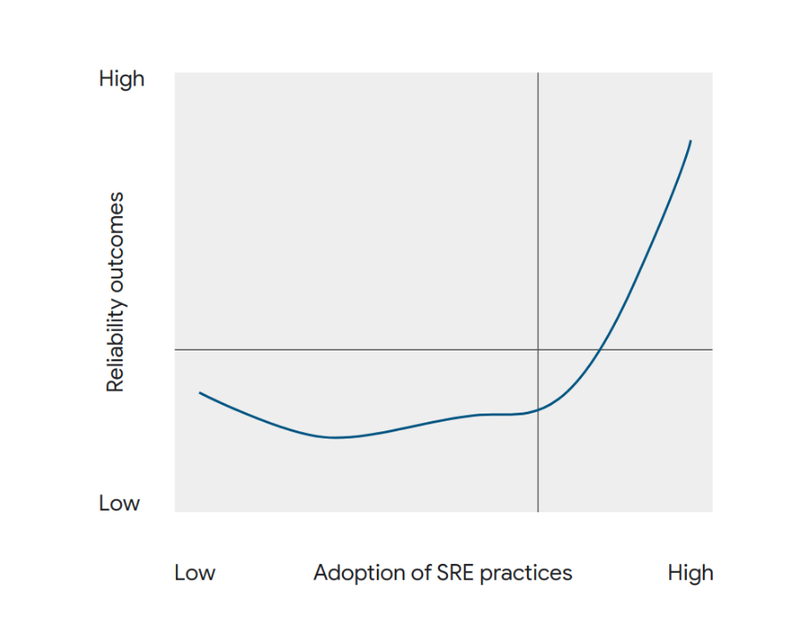

Le rapport DORA 2022 fait le constat qu'il est nécessaire d'adopter une quantité substantielle de pratiques SRE, avant d'en récolter des bénéfices significatifs en terme de résilience[^DORAReportSREPRacticesFigures]. Ce phénomène peut être un frein pour les décideurs, à l'idée de se transformer en mode DevOps.

Mais les bénéfices dépassent bien les coûts engendrés, au delà de cette période initiale d'investissement.

C'est bien dans cette tendance que le DevOps trouve tout son intérêt : alors que les infrastructures traditionnelles ne nécessitent que peu d'investissement initial pour rendre un service, le coût de leur maintenance augmente proportionnellement au nombre de services déployés. Cela rend leur gestion insoutenable à long terme. Le DevOps lui, propose un investissement initial supérieur mais offre la possibilité de maîtriser une activité exponentielle, avec un coût à tendance logarithmique.


Ce mode d'organisation vise à rendre les infrastructures plus fiables, réduire les tâches manuelles pour tirer meilleur parti du temps de ses ingénieurs et _in fine_, accélérer le cycle de déploiement logiciel.

Le DevOps est aux infrastructures traditionnelles ce que la construction à la chaîne est à l'artisanat : en construisant à la chaîne, on réduit les coûts et on répond à la demande. L'avantage supplémentaire dans le domaine logiciel est qu'il est possible d'ajuster en quelques heures le produit que l'on souhaite livrer. Cette action peut être réitérée plusieurs fois par jour !

Si les pratiques historiques ont tout l'honneur d'avoir fait fonctionner des systèmes d'informations pendant des années, d'autres méthodes plus agiles existent aujourd'hui[^RedGate2021Report]. Pour militariser le propos : les arcs et les flèches ont servi, mais depuis on a inventé l'AR-15.

Tout l'enjeu d'une transformation est de réussir à faire adhérer votre hiérarchie à cet investissement initial (non-négligeable mais nécessaire), alors que les bénéfices peuvent être au départ difficiles à voir émerger. C'est un défi courant que nous verrons comment adresser dans le chapitre ["comment convaincre et garder la foi"](#comment-convaincre-et-garder-la-foi).

## Sceptiques et trop-optimistes

Les entreprises sont généralement conscientes du changement qu'elles doivent opérer. Mais elles n'osent ou ne peuvent pas immédiatement conscentir aux efforts nécessaires pour réaliser cette transformation.

Les plus sceptiques ou les plus optimistes pensent même s'en sortir en démarrant une initiative à moindre frais :

> « Je n'ai besoin que d'un ingénieur SRE/Cloud/DevOps »

Navré, **non.**

Il est avéré que transformer une structure traditionnelle en mode DevOps demande un investissement substantiel. Et mettre en place les bases permettant de révéler les avantages de ce mode de travail prend un certain temps. Mais grâce à ce livre, vous aurez toutes les clés pour débuter avec des ressources adaptées à votre situation.

Prenons un exemple pour bien nous représenter ce scénario. Vous commencez avec une équipe de 2 personnes qui développent un logiciel. Plusieurs problèmes sont d'ores-et-déjà identifiés, en particulier si vous travaillez dans un secteur réglementé :

- Qui met en place l'infrastructure pour correctement développer ce logiciel ? (usine logicielle, miroirs de dépendances, registres de librairies…)
- Qui sécurise cette infrastructure ?
- Qui gère les sauvegardes ?
- Qui définit les règles de développement et leur cohérence pour maintenir les logiciels dans le temps ?

Si vous ne comptez que sur vos ingénieurs logiciels pour gérer l'infrastructure, ils finiront par générer de la dette technique. Des coûts et des efforts en maintenance qui empireront à mesure que votre équipe croît. Ils ne se concentreront pas sur le développement et s'éparpilleront sur des tâches de SRE. Cette situation nécessite déjà au moins 1 ingénieur SRE/DevOps.

Et si vous recrutiez et que votre équipe comptais désormais 6 ingénieurs ? Il faut à présent leur fournir des machines et les configurer. Certains rencontrent des bugs, d'autres vous demandent de mettre à jour des librairies… Si en plus vous avez des impératifs en termes de sécurité (ex : homologation, journaux d'évènements), il faut prendre le temps de correctement configurer les outils et l'infrastructure. Cela demande au moins 1 ingénieur SRE/DevOps supplémentaire.

Deux ingénieurs quittent maintenant votre structure ? Vous devez hélas toujours maintenir l'infrastructure qui a évolué, pour répondre aux besoins de vos 4 ingénieurs et pour maintenir les X machines ou serveurs que vous avez installés.

Comprenez que vous devez atteindre une masse critique de profils SRE/DevOps pour maintenir un socle robuste. Ce dernier constitue les fondations permettant à vos ingénieurs d'être outillés pour travailler correctement. Cette masse critique doit évoluer en fonction du nombre de collaborateurs et vous ne pouvez pas en retirer sans essuyer de lourdes difficultés d'exploitation.

> Par exemple, Google - employant plusieurs dizaines de milliers d'ingénieurs - maintient son ratio de SRE vis-à-vis des développeurs à environ 10%[^GoogleWorkBookEngagementModel]. Ce ratio SRE/développeurs et les coûts engendrés tendent à être élevés au début de votre initiative, puis se lissent à mesure que le nombre de services déployés croit. Cela est dû aux forts besoins en infrastructure lors de la constitution de votre initiative, qui réduisent à mesure les tâches d'administration soient automatisées.

## Too big, too soon

L'échec d'un projet s'explique souvent par une mauvaise définition de son périmètre, avec des objectifs trop exigeants ou une planification confuse. De cette mauvaise gestion découle une augmentation des délais et des coûts de manière incontrôlée. Il est alors courant de devoir trouver une « solution intermédiaire » en attendant que la première vienne hypothétiquement au jour.

Une initiative DevOps se bâtit avec l'existant au sein de votre institution : il faut réussir à commencer petit pour correctement saisir les besoins des métiers et embarquer toute l'organisation dans l'aventure. C'est la méthode _Kaizen_, née au Japon dans les années 50 au sein des usines Toyota. Elle est connue en France sous le nom de "stratégie des petits pas".

Ayez l'audace de commencer petit et d'itérer à mesure que vous et votre institution vous acculturez aux enjeux et défis de ces nouvelles technologies. Veillez à ce que chaque équipe soit à son tour un évangélisateur de votre initiative. Nous aborderons les théories derrière cette préconisation dans le chapitre "[Comment convaincre et garder la foi](#comment-convaincre-et-garder-la-foi)".

Changer la culture d'une institution prend du temps, mais prendre des raccourcis risquera de heurter les sensibilités, démotiver vos équipes et _in fine_, de faire échouer votre projet. Le DevOps étant basé sur le principe d'itérations successives, vous prendrez moins de risques.

## Les initiatives dans les organisations

Votre hiérarchie est convaincue par votre initiative de transformation et vous accorde tous les moyens requis ? Dans ce cas, passez au prochain chapitre. Si ce n'est pas le cas, tentons de mieux comprendre pourquoi.

Il peut arriver que des décideurs nouvellement affectés, demandent à leurs subordonnés de trouver "rapidement" des solutions clef-en-main aux problèmes qu'ils découvrent. Au lieu d'adopter une démarche investigatrice, l'urgence d'obtenir un résultat immédiat les incite à prendre une orientation précipitée. Après tout, on attend du chef qu'il trouve rapidement et en toute situation, une solution peu coûteuse et efficace. Néanmoins, des initiatives - plus ou moins matures - existent souvent déjà au sein de l'organisation.

Les solutions techniques sont faciles à concevoir et à déléguer. Par exemple, acheter des technologies "sur l'étagère" ou lancer un tout nouveau projet, peut aussi sembler plus efficace. Mais opter pour une solution, en faisant fi des contraintes inhérentes à l'organisation (maturité organisationnelle et technique, ressources humaines et matérielles, dette technique, courbe d'apprentissage...) peut être risqué. D'ailleurs, ces contraintes sont souvent déjà connues et exprimées depuis des années par l'expertise interne. Elles provoquent parfois la naissance de projets pris à l'initiative des employés, face au besoin qu'ils observent ou à l'exaspération qu'ils éprouvent. Au lieu de les encourager à trouver une solution, ils sont parfois réprimandés, au titre d'insubordination. En réalité, ces projets se perdent souvent dans les strates intermédiaires et ne remontant que rarement jusqu'au décideur pour les pérenniser.

En effet, les décideurs ont rarement le temps de rencontrer chacune de leurs équipes. Ils ont par conséquent tendance à [privilégier leur propre avis](https://copyconstruct.medium.com/why-success-is-often-elusive-at-the-highest-echelons-3e02e4dd3e7f) ou à solliciter celui de leur adjoint, en lieu et place de celui de leurs experts. La décision prise est donc celle relevant de la sensibilité d'une seule personne, isolée des réalités métiers. Plus il existe de strates hiérarchiques, plus l'isolation est prononcée. Ce phénomène résulte en une concentration des efforts vers des projets peu étudiés et peu fédérateurs. Accompagnés d'une communication par nature peu impactante, il produit inévitablement de la frustration dans l'entreprise.

L'exemple de l'_U.S. Department of Defense_ (DoD) en est une bonne illustration. Ce ministère a lancé une nouvelle initiative DevSecOps nommée _Vulcan_[^DISAVulcan] 4 ans après l'initiative _Platform One_[^PlatformOne], dont la finalité était identique. Au delà d'avoir provoqué des frustrations au sein des équipes de _Platform One_[^ChaillanDisaTweet], le programme _Vulcan_ accuse des retards et des surcoûts[^DISAVulcanDelays].

Dans d'autres cas, la méfiance de certains responsables les mènent à remettre en doute les propositions faites par leurs experts internes. À outrance, cela mène à considérer ses propres experts comme des acteurs externes à l'organisation, balayant l'avantage d'avoir des personnels qualifiés, au contact quotidien des sujets de l'entreprise.

Face à des responsables n'ayant pas une vision alignée avec la notre, on peut s'indigner et partir. Ou essayer de comprendre les réactions et d'améliorer les pratiques. En tant que meneur d'une initiative interne, vous devez comprendre la crainte des décideurs : confier un projet ambitieux disruptant les pratiques organisationnelles a plusieurs risques.

Si votre organisation est grande et qu'elle perdure depuis longtemps, c'est qu'elle a répondu à un besoin jusqu'à présent. Si les responsables en viennent à penser qu'elle doit se transformer (ou que vous l'anticipez) et que rien n'a été entamé, ses dirigeants se trouvent peut-être face au dilemme de l'innovateur. Théorisé par Clayton M. CHRISTENSEN[^DilemmeInnovateurLivre] en 1997, ce dilemme décrit la situation dans laquelle une entreprise leader dans son domaine, en essayant de maintenir son avantage concurrentiel, est inévitablement amenée à passer à côté d'une innovation majeure. Un concurrent insoupçonné la propose alors et renverse les parts de marché. Par exemple en 2023, Microsoft a surpris tout le monde en sortant avant Google un ChatGPT intégré à son moteur de recherche. Google est pourtant à ce temps le leader de la recherche sur internet et investit chaque année des milliards d'euros dans la recherche en intelligence artificielle. Comment est-ce que Google a pu laisser un concurrent lui damer le pion ?

La réponse est simple : le risque qu'a Google - 84% des parts de marché sur les moteurs de recherche[^MarketShareSearchEngines] - à sortir un produit non abouti - qui retourne de fausses informations par exemple[^BardFails] - est bien plus important que celui d'une startup comme OpenAI ou de Bing pour Microsoft - 9% des parts de marché sur les moteurs de recherche. Preuve en est qu'au moment de la rédaction de ce chapitre, peu d'articles en ligne remettent en cause le lancement de Bing Chat par rapport à Bard, malgré des problèmes identiques[^CNNBingAI]. En résumé : Microsoft a tout à gagner quand Google a tout à perdre.

Ceci dit, Google a perçu les écueils d'une absence de prise de risque et travaille depuis un moment sur un concurrent, Bard[^Bard]. Pour éviter de se retrouver devant ce dilemme, l'organisation doit :

- **Faire de la veille** : garder un œil sur les tendances émergentes et les nouveaux besoins de ses clients en en organisant des visites entre partenaires, en participant à des salons, ou en consultant des experts pour s'informer des évolutions du marché. Vous pouvez par exemple demander à vos experts de rédiger une newsletter trimestrielle à l'attentation de la direction, reprenant les grandes tendances technologiques du moment.
- **(Ré-)évaluer régulièrement sa stratégie** (son _business model_) : fort de cette veille, rechercher de nouvelles opportunités de croissance en adressant de nouveaux cas d'usage. Proposer de nouveaux produits et employer de nouvelles technologies. Dans une institution, la veille est aussi interne : il faut aller voir ses métiers pour comprendre les freins à leur travail quotidien, et mettre en perspective les innovations pouvant y répondre.
- **Encourager la prise de risque et l'expérimentation** : encourager ses équipes à proposer de nouvelles idées et à tester des projets pour explorer de nouvelles technologies. Récompenser la prise de risque.
- **Investir dans l'innovation** : allouer des ressources suffisantes pour la recherche et développement (R&D). Par exemple, accorder 1 jour de télétravail par semaine à ses experts, pour qu'ils explorent une technologie innovante. Accorder des financements à ses équipes pour acheter le matériel leur permettant d'expérimenter, ou bien leur donner accès à un hébergeur Cloud (cf. chapitre "[Former de manière continue](#former-de-manière-continue)").

Plus pragmatiquement, si vous décidez de monter votre propre équipe, il se peut que certains membres quittent votre structure à tout instant. Ils risquent alors de laisser derrière eux un travail fastidieux à reprendre, au vu de la maturité des réflexions qu'ils entreprenaient. Voilà pourquoi beaucoup d'organisations préfèrent payer un tiers-partie, avec un cahier des charges bien définit pour que le décideur soit certain d'obtenir un résultat (au travers de l'obligation contractuelle du tiers-partie). Nous verrons dans le chapitre "[Être au plus proche du métier](#être-au-plus-proche-du-métier)" que cette pratique peut avoir des conséquences néfastes à long terme pour l'organisation.

Les évolutions organisationnelles impliquent toujours un changement culturel qu'il faut savoir appréhender. Parfois trop difficile à surmonter pour l'organisation toute entière, ce fossé culturel indique qu'il est probablement encore trop tôt pour exposer votre plan. Cela peut être frustrant, mais vous devez encore pour l'instant continuer d'acculturer l'organisation. Faites-le au travers de présentations et d'exemples de réussites. Le décideur doit comprendre clairement l'impact que peut avoir cette transformation et les risques associés : rupture de service, changement de stratégie RH, formation du personnel ou encore achat de matériel. Aidez vos responsables à se projeter pendant que vous travaillez à construire vos preuves.

Nous verrons dans la suite de ce livre comment appréhender la psychologie du changement pour faire aboutir votre projet.

## Réorganisations chroniques

« Une de plus ! » s'exclameront vos plus fidèles collaborateurs. Combien de réorganisations a déjà subi votre structure ? Pratiquées à outrance, elles brouillent le message et ajoutent de la confusion pour vos équipes.

Dans la plupart des cas, des équipes techniques existent déjà au sein de votre organisation. Elles répondent déjà probablement à des besoins métier qui nécessitent leur présence.

Les responsables ayant une connaissance limitée des enjeux métiers et techniques sont souvent tentés de vouloir changer les activités de certaines équipes. Ils le font au profit d'un nouveau projet, en raison des compétences y étant actuellement présentes. Or, une équipe se constitue toujours autour d'un projet qui a su former sa culture, et qui aujourd'hui la rend si performante pour l'entreprise. Les décideurs doivent considérer cet aspect avant d'envisager de rompre cette culture durement acquise, en imposant une transformation.

Le risque de changer considérablement les missions d'une équipe implique que vous soyez particulièrement disposé à la soutenir : c'est rarement le cas, vous n'en avez probablement pas le temps. Leur méthode de fonctionnement actuelle est déjà le fruit de plusieurs restructurations, qui ont probablement déjà impacté leurs idéaux, ainsi que la raison qu'ils ont eu de rejoindre votre organisation.

Changer les missions d'une équipe sans considérer sa culture et son passif revient à risquer de perdre des collaborateurs : soit ils seront démotivés par votre projet, soit ils démissionneront. Vous devez leur proposer une vision claire, les convaincre avec des arguments étayés mais surtout les impliquer.

Du fait de leur passif au sein de votre structure, la connaissances de vos équipes vous permettra de saisir des notions que vous n'avez pas encore totalement bien appréhendées. Soyez ouvert à leurs recommandations et leurs remarques pour comprendre en quoi réorganiser au mieux cette équipe - et seulement si nécessaire - en fonction de ses aspirations. Un excellent moyen d'obtenir l'adhésion de son équipe et de mieux comprendre ses enjeux est d'effectuer pendant quelques jours son travail. Cela peut se faire au moment de l'arrivée du décideur dans la structure.

Si vous estimez ne pas avoir les ressources en interne, ne craignez pas de recruter. Il est risqué d'impacter les équipes historiques si elles répondent à un besoin exprimé par votre organisation. Le propre d'une transformation est d'assurer la continuité du service tout en changeant ses pratiques.

Soyez plus subtil que d'annoncer un "grand plan de transformation". Ces pratiques frustrent à coup sûr bon nombre de collaborateurs, ne permet pas d'obtenir l'adhésion de toutes vos équipes et risque de vous décrédibiliser. Elles peuvent également vous rendre otage de votre prédécesseur en associant votre personne aux précédentes transformations ayant échoué.

Comme évoqué dans le chapitre "[Too big, too soon](#too-big-too-soon)", adoptez la stratégie des petits pas et développez progressivement votre intuition sur qui vous devez réorganiser. Obtenez l'adhésion des équipes, en illustrant le champs des possibles pour leur donner envie. Puis laissez-les convaincre leurs pairs à votre place. Nous détaillerons ces stratégies dans le chapitre "[Comment convaincre et garder la foi](#comment-convaincre-et-garder-la-foi)".

## Refuser le retard technologique

> "C'est normal, nous aurons toujours du retard ici."

Si vous avez l'impression d'avoir déjà entendu cela et que vous lisez ce livre, ces paroles ont probablement suscité chez vous un sentiment de consternement.

Il est compréhensive d'avoir, selon la structure, des délais (exigences de sécurité, taille des équipes) mais l'organisation ne doit pas tolérer un retard. En aucun cas l'affirmation "c'est normal ici" ne doit devenir une réponse acceptable.

Si le locuteur est sincère, cet état d'esprit ne résulte que d'un manque de connaissance sur les moyens d'atteindre l'objectif. Dans le cas contraire, il s'agit d'un manque de courage, voire de paresse intellectuelle.

Si la majorité des collaborateurs d'une entreprise en viennent à penser qu'elle a du retard, il y a un sérieux problème. Maintenir le _statu quo_ sur cette situation mène inévitablement au déclin de l'organisation et en la perte irrémédiable de crédibilité, de la part de ses employés et de ses partenaires.

Dans l'un de ses articles[^ArticlePSSyndromeCanard], le conférencier et expert en transformation Philippe SILBERZAHN prend l'exemple d'un homme qui attend son train prévu à 9h30. L'écran affiche "A l'heure" bien qu'il soit déjà 9h35 à sa montre. L'homme songe à prendre en photo le panneau mais se demande "à quoi bon". De nombreux observateurs minimiseraient cet écart de cinq minutes, montreraient de l'irritation ou  attribueraient simplement la faute à un dysfonctionnement de l'affichage. "Après tout, personne n'y peut rien", concluraient-ils. C'est avec ce genre de comportement que Philippe SILBERZAHN affirme que les organisations déclinent : elles s'habituent à la médiocrité.

Alors qu'au début le dysfonctionnement est considéré inadmissible, il devient avec le temps de plus en plus acceptable par l'organisation, sans qu'elle se rende compte que cette situation lui coûte du temps et de l'argent. L'effort pour corriger le problème devient de moins en moins justifiable et le silence devient le choix par défaut pour conserver son énergie. Jusqu'à ce qu'une situation irrémédiable se produise (ou qu'un groupe de quelques courageux secouent la structure!).

Mais il faut également savoir _quand_ dévoiler ses innovations. Preston DUNLAP, premier directeur technique (CTO) de l'USAF, décrit dans sa lettre publique _Défier la Gravité_ combien les "forces bureaucratiques" peuvent nuire à l'innovation si on les présente trop tôt.

> "Certains m'ont demandé quelle fut ma recette pour réussir durant ces 3 dernières années. Je n'en ai pas beaucoup parlé parce-que je savais que si je révélais les éléments trop à l'avance, les forces naturelles de la bureaucratie reviendraient de plus belle, pour rejeter à chaque occasion tout le potentiel de l'innovation." - Preston DUNLAP, Défier la Gravité (_Defying Gravity_) [^DefyingGravity]

Pour éviter le retard technologique, une organisation peut adopter plusieurs pratiques :

- Former de manière continue son personnel, y compris les décideurs (cf. chapitre "[Former de manière continue](#former-de-manière-continue)").
- Mesurer et mettre en place des indicateurs pour éviter de s'habituer (cf. chapitre "[Tout mesurer](#tout-mesurer)")
- Accepter les réalités et libérer la parole (cf. chapitre "[Accepter l'échec](#accepter-léchec)", _How SRE creates a blameless culture_[^SREBlamelessCulture])
- Conserver une capacité d'innovation interne pour rester en mesure de critiquer (cf. chapitre "[Modèle d'équipe interne](#modèle-déquipe-interne)", _Comment l'entreprise peut sortir de la spirale du déclin_[^ArticlePSSortirSpiraleDeclin])

# Prérequis

Vous avez beau avoir le meilleur des logiciels, si vous n'arrivez pas à le déployer (sans bug, sans interruption de service, sans assistance), personne n'en sera témoin.

Ce livre n'exigera même pas de votre équipe qu'elle soit particulièrement grande ni même que vos responsables soient déjà convaincus. Néanmoins il exigera que votre équipe, elle, soit convaincue qu'elle peut porter son projet. Bien entendu au cours du temps, l'appui d'autres équipes de votre organisation dans vos expérimentations DevOps sera un argument précieux pour illustrer le succès de votre initiative.

Un responsable ne demande qu'à être convaincu par une initiative de ses subordonnés. Aidez-le à se projeter et à comprendre la plus-value de ce que vous lui proposez.

Cela nécessitera des présentations constantes de l'avancée de votre projet : à la fois pour qu'il se souvienne et pour qu'il comprenne. Il est toujours risqué d'estimer qu'un projet est compris dès la première présentation, surtout quand il s'agit d'un nouveau paradigme que l'on souhaite introduire.

Vous avez besoin d'équipes internes : il y aura toujours des bugs à résoudre, des configurations à adapter et des fonctionnalités à ajouter. Développés en interne ou en externe, vous subirez le phénomène d'érosion des logiciels[^SoftwareErosion]. Ce dernier qualifie les problèmes qu'un logiciel peut subir au cours du temps quand il est laissé à l'abandon (mises à jour de sécurité critiques, espace disque plein, processus qui cessent de fonctionner...).

Ne croyez pas que « l'industriel » pourra résoudre tous vos problèmes : vous allez perdre beaucoup d'argent et vous n'atteindrez pas les objectifs. L'industriel ne peut pas être en permanence dans votre organisation et comprendre chacun de vos enjeux.

Pour amorcer votre initiative DevOps, vous avez besoin :

- D'un responsable d'équipe reconnu en ingénierie et avec d'excellentes compétences en communication
- De plusieurs ingénieurs logiciels qui développeront vos solutions aux besoins métiers
- De plusieurs profils SRE/DevOps qui développeront votre socle et géreront le cycle de développement/déploiement des logiciels

# Comment convaincre et garder la foi

Premièrement, il ne s'agit pas de convaincre. Vous ne pouvez pas arriver devant quelqu'un et lui dire "vous avez tord, j'ai raison". Votre objectif doit être de donner envie à vos interlocuteurs d'adhérer à votre vision, votre projet. Ainsi, ils seront convaincus par eux-mêmes.

Faire adhérer sa hiérarchie ou des collègues de travail à une initiative n'est pas toujours simple. William MORGAN - directeur général d'une startup réputée dans les technologies - préconise 4 règles à suivre[^WilliamMorganKubecon2018] :

1. Identifier qui est affecté (les parties-prenantes)
2. Déterminer ce que la nouvelle solution va leur apporter (les avantages)
3. Comprendre quelles sont leurs craintes (les préoccupations)
4. Atténuer les préoccupations, promouvoir les avantages et communiquer

Selon William MORGAN, une fois qu'on atteint un certain niveau d'ingénierie technique, les métiers de "commercial" et "d'ingénieur" se confondent : "Un travail d'ingénierie suffisamment avancé est indiscernable d'un travail de commercial".

Voici comment ces règles pourraient être appliquées aux équipes de sécurité et de _management_ :

- Pour les équipes de sécurité, la technologie proposée pourrait [gérer et auditer automatiquement le chiffrement des flux entre les services](#service-mesh). Leurs préoccupations seraient alors les suivantes : "Est-ce que cette technologie va rendre mon infrastructure plus sécurisée ?" ou "Quels sont les nouveaux vecteurs d'attaque que cette technologie pourrait introduire ?".
- Pour les équipes de _management_, la technologie proposée pourrait accélérer le rythme de développement et réduire les interruptions de service. Leur préoccupation serait alors de bien comprendre de quel matériel ou ressource humaine l'entreprise dépend, suite à l'emploi de cette nouvelle technologie.

La théorie des modèles mentaux[^ModelesMentaux] nous permet de mieux comprendre le processus de prise de décision (ex: que quelqu'un adhère ou pas à une initiative). Chaque représentation que l'on se fait des choses (c'est à dire un modèle mental), diffère selon l'individu. Or se transformer, c'est se mettre d'accord ensemble sur un modèle mental alternatif[^SilberzhanModeleMental].

Quand bien même le DevOps peut s'appuyer sur des études et s'avère une évidence dans le privé, les initiatives institutionnelles ne sont pas encore assez nombreuses[^DORAIndustry]. Vous êtes donc dans une situation où vous avez la certitude de la direction à prendre, mais vous n'êtes pas entièrement capable de la justifier par des chiffres et/ou des exemples. Face à votre proposition de transformation avant-gardiste, le décideur est par conséquent face à un risque. Or, question de survie :

> "Il vaut mieux avoir tord avec le groupe, qu'avoir raison contre le groupe."

Pour aider le décideur à prendre sa décision, vous devez travailler à réduire ce risque. Mais comment ? L'idée est de ralier à votre cause de premiers expérimentateurs (_early adopters_) à votre projet, sans l'annoncer au collectif.

> "Le 1er qui fait le pas prend un risque énorme. Le 150ème n'en prend plus."

En plus d'améliorer votre proposition de valeur, vous obtiendrez des exemples à citer et du soutien : vous ne serez plus le "1er" à prendre le risque et votre organisation non plus.

Gardez en tête que si les choses sont telles qu'elles le sont aujourd'hui, c'est qu'il existe des raisons : vous n'avez pas obligatoirement une connaissance exhaustive de ces causes (temps alloué, moyens RH, moyens financiers, appui politique...) et n'êtes pas là pour blamer les acteurs du passé. Il faut aussi rester conscient que pendant la transformation, l'entreprise doit être en mesure de fournir les mêmes services qu'avant. Le décideur doit alors maîtriser l'environnement en transformation en parallèle de l'environnement actuel, sans que le premier tue le second.

Enfin, ne vous découragez pas devant la première personne réticente. Toute innovation à ses débuts fait objet d'une moquerie morale et passe par trois phase : ridicule, dangereuse puis évidente[^InnovationPhases]. L'ayant vécu, je peux attester de la véracité de ce phénomène, mais des exemples historiques existent :

- Le droit de vote des femmes : d'abord jugé ridicule, ensuite dangereux car certaines [suffragettes](https://en.wikipedia.org/wiki/Suffragette) y ont perdu la vie (années 1910), puis cette idée est devenue évidente dans nos sociétés contemporaines.
- Henri FORD qui portait la vision selon laquelle chaque Américain devait avoir une voiture personnelle et qu'elle ne coûte pas cher. À l'époque, la voiture était considérée comme un gadget pour les riches : "on ne sait pas à quoi ça sert mais c'est joli". Il a créé la première chaîne de montage en mouvement de l'industrie (1913)[^FordIndustryChain] et _Ford_ fait encore aujourd'hui partie des leaders de l'industrie automobile.
- Elon MUSK qui disait pouvoir créer des lanceurs de fusée réutilisables : moqué[^ElonMuskBiography] ou fortement mis en doute[^MuskImpossibleQuote] à ses débuts par l'industrie spatiale russe et américaine, désormais respecté par cette dernière et [craint](https://www.ft.com/content/24cca993-b249-45a5-8c42-b39c0ec30c5b) par [l'industrie spatiale européenne](https://www.latribune.fr/entreprises-finance/industrie/aeronautique-defense/satellites-europeens-lances-par-spacex-la-terrible-defaite-de-l-europe-spatiale-937632.html).

Si vous rencontrez une opposition frontale de personnes ayant l'oreille du décideur, commencez toujours par tenter de comprendre leur point de vue. Si vous estimez qu'ils veulent délibéremment couper court aux discussions (par exemple, pour des raisons politiques ou d'égo), tentez les approches suivantes :

- **Mettez l'accent sur vos valeurs communes** : même si vous et votre interlocuteur avez des convictions politiques différentes, vous pouvez partager certaines valeurs communes. Essayez de les mettre en avant et démontrez comment votre initiative y répond. Exemples :
  - Si vous et votre interlocuteur valorisez tous deux l'innovation, vous pouvez souligner comment votre approche la favorise et comment elle offre de nouvelles opportunités.
  - Si votre projet propose des fonctionnalités similaires à un outil existant mais qu'il se distingue par l'échelon où il permet d'agir (tactique, opératif, stratégique[^MilitaryStrategy]), expliquez comment, avec des exemples de cas d'usage.
- **Fédérez une coalition** : c'est l'idée des _early adopters_ évoquée plus tôt. Attirez des personnes qui partagent votre vision de la transformation. Ce sont souvent celles qui partagent avec vous les points sur l'inefficacité d'une partie de votre organisation.
  - En créant une communauté qui vous soutient, vous démontrez à votre interlocuteur que votre approche est légitime et qu'elle est soutenue par un grand nombre de parties prenantes.
  - Demandez des remerciements officiels : une lettre ou un e-mail signé par le responsable reconnu d'une entité que vous avez servi, attestant de l'utilité de vos méthodes ou de vos outils.
- **Soyez persévérant** : faire changer quelqu'un d'avis peut prendre du temps, surtout lorsque des raisons politiques sont en jeu. Soyez persévérant et continuez à faire valoir vos arguments, même si vous rencontrez de la résistance.
  - Restez ouvert à l'idée de continuer le dialogue avec votre interlocuteur, toujours de manière respectueuse et constructive. Si votre approche est la bonne et la sienne la mauvaise (vous pourriez avoir tord après tout!), vous parviendrez peut-être à le rallier à votre cause avec le temps.
  - Acceptez aussi que vous n'êtes pas éternel au sein de l'entreprise. Si votre initiative ne trouve pas sa place ici, tant pis pour votre entreprise! Vous pourriez avoir un tout autre impact dans une autre structure, avec la même initiative. Et vous-seul déterminez les limites que vous vous fixez.

Nous pouvons désormais avancer plus sereinement en tant que responsable d'une transformation, ayant en tête des pistes pour réagir face à des situations communes. Voyons alors plus en détail comment il est possible de s'organiser et d'accumuler des arguments, pour lancer son initiative.

# Modèle d'équipe interne

## Le développement interne comme véritable alternative

Dans le chapitre "[Refuser le retard technologique](#refuser-le-retard-technologique)", j'évoque l'innovation interne comme moyen pour éviter le déclin d'une organisation. Mais il est aussi important de préciser en quoi le développement interne, au delà d'être efficace, s'avère être une condition si l'entreprise souhaite rester compétitive.

Quelle entreprise responsable d'un gros projet informatique pourrait se permettre de dire "Nous n'avons pas besoin d'expert informatique" ? Le recours aux sociétés de conseil est parfois chronique dans les grandes organisations. Cela est principalement dû au manque d'acculturation des décideurs aux sujets techniques.

A l'instar d'organisations d'envergure mondiales comme l'Organisation Mondiale de la Santé (OMS) ou les Nations Unies (UN), des organisanismes nationaux comme le Centre National de la Recherche Scientifique (CNRS), l'Education Nationale et l'agence Santé publique France intègrent un conseil scientifique interne[^ConseilScientifiqueSPF]. Ils leurs permettent de rester à jours sur les dernières connaissances scientifiques pour que les décideurs puissent prendre des décisions éclairées. Dans le privé, c'est le rôle du Directeur Technique (_CTO_ en anglais) et de ses cadres supérieurs (_VPs_ en anglais).

Bien qu'un conseil scientifique puisse aider l'organisation à rester à la pointe des connaissances scientifiques, il ne suffit pas à la rendre innovante. D'autant plus si ses membres ne sont pas renouvelés périodiquement. Pour innover, il faut pratiquer.

Si vous souhaitez répondre efficacement aux enjeux auxquels fait face votre organisation, seule une équipe interne qui pratique les technologies liées à vos sujets pourra vous y aider. Ainsi, avoir l'audace de monter sa propre équipe technique interne offre une multitude d'avantages. Ces atouts incluent une compréhension intrinsèque des défis quotidiens, des produits ou services proposés et des besoins spécifiques de ses clients. Le contact direct et constant avec les différents métiers permet à cette équipe de concevoir des outils sur-mesure, finement adaptés pour répondre efficacement à leurs exigences.

Cette proximité immédiate avec le demandeur facilite également la fourniture d'assistance en temps réel, éliminant ainsi les coûts supplémentaires et les délais habituellement associés à un soutien externe. Cela permet de réaliser des cycles d'amélioration plus courts et d'assurer une livraison plus rapide des demandes.

En ayant la feuille de route des projets sous leur contrôle direct, les décideurs peuvent s'assurer que les développements correspondent parfaitement à leurs besoins et visions. Cette gestion interne des développements permet de réduire significativement les coûts, grâce à la mutualisation des investissements au profit de plusieurs projets simultanément.

L'une des forces majeures d'une équipe interne réside dans la sécurité des données, celles-ci restant strictement confinées aux infrastructures de l'organisation et ne sont accessibles qu'aux membres autorisés. Cela limite ainsi le risque de fuites de données.

De plus, une équipe interne possède une capacité unique à évaluer rapidement et avec pertinence les innovations technologiques, en les plaçant dans le contexte des enjeux métiers de l'organisation. Elle est également en mesure de favoriser l'assimilation de ces nouvelles technologies à travers l'organisation, grâce à des présentations adaptées à tous les niveaux.

Compter uniquement sur une ressource externe pour effectuer vos projets informatiques mènera inévitablement à des coûts prohibitifs. Sans expertise interne, vous êtes à la merci des talentueuses équipes commerciales d'entreprises qui ne manqueront pas de vous vendre des services dont votre organisation n'aura jamais l'usage - quand bien même ils arriveraient à vous en persuader.

La raison principale de la frilosité des décideurs à l'égard des développements internes est la maintenance. Ils ont raison : payer un prestataire peut coûter cher, mais ce dernier est tenu d'honorer sa prestation par un contrat. Ce même contrat est souvent accompagné d'une prestation de maintenance. Un seul développeur interne - peu outillé car peu soutenu - risquerait d'échouer à la même tâche. Cela mettrait finalement en cause la responsabilité du décideur.

Ainsi, embaucher deux ou trois ingénieurs ne suffira pas pour pérenniser vos développements. Pour réussir à proposer une solution utile, qui puisse être une véritable alternative maintenable et crédible pour votre hiérarchie, vous devrez monter une équipe plus conséquente.

En outillant cette équipe d'un véritable environnement de développement (cf. "[Usine logicielle](#usine-logicielle)") et en incluant de bonnes pratiques DevOps, elle aura le temps de s'attarder sur la qualité de vos logiciels. Bien que cela demande un investissement en temps et puisse être une étape éprouvante avec votre hiérarchie, celle-ci ne réalise pas encore à quel point cette avancée lui sera précieuse à l'avenir ! Gardez le cap.

Dans l'une des entreprises pour laquelle j'ai travaillé, le développement interne d'un logiciel par un ingénieur a permis d'économiser plusieurs millions d'euros. Les programmes industriels équivalents n'avançaient pas et les métiers restaient démunis. Il a fallu un seul ingénieur - certes brillant - pour résoudre un problème qui durait depuis plus de 6 ans.

Grâce aux règles DevOps exigeant des standards de qualité logiciel, plus de dix développeurs au cours des trois dernières années ont pu contribuer à ce projet pour le maintenir et l'améliorer. Il reçoit encore aujourd'hui de nombreuses mises à jour hebdomadaires.

Au delà d'apporter une solution concrète à un problème, cet ingénieur a surtout permis d'acculturer l'ensemble de la hiérarchie aux notions de développement moderne et de techniques de _machine learning_. Convié devant les prestataires externes traditionnels aux grandes réunions stratégiques, il est devenu le référent _machine learning_ de l'organisation. Sans lui, personne en interne ne serait en mesure de spécifier un besoin ou d'évaluer une solution de _machine learning_ en toute connaissance de cause.

## Équipes « innovantes » et datascience

Nombreuses sont les organisations qui ont voulu stimuler leurs organisations en créant des « équipes innovation » au sein de leur structure. Et nombreuses sont celles qui n'ont pas vraiment réussi à déployer en production ce qui y était développé.

Les cas d'usages tournent souvent autour de la data et de l'intelligence artificielle. Les buzz-words « data-scientists », « deep learning » et « intelligence artificielle » ont procuré de nombreux faux espoirs : beaucoup d'organisations ont recruté des profils data-science qui se sont retrouvés incapables de mettre en production leurs algorithmes dans une interface à l'attention d'opérateurs non-experts.

Le problème n'est pas les data-scientists, mais bien les décideurs qui jusqu'à récemment ne comprenaient pas ce qu'impliquait la réponse au besoin métier : un socle de développement fiable, des données propres, des données massives, du suivi de modèles[^ModelsIA] (MLOps), une équipe de mise en production. En somme, beaucoup pensaient (et continuent de penser) que « l'IA » peut résoudre n'importe quel problème avec quelques lignes de code. Ces personnes n'ont pas conscience de l'infrastructure et du soutien technique qu'impliquent ces technologies.

L'exemple typique de la data-science vis-à-vis du DevOps est le besoin de puissance de calcul, de capacité de stockage et de services pour développer et suivre l'entraînement de ces modèles. La plupart des data-scientists ne seront pas en mesure d'installer seul leur machine, leurs drivers GPU[^DriversGPU] et leur environnement Jupyter Notebook[^JupyterNotebook]. En particulier dans des environnements complexes propres aux grandes organisations.

## Être au plus proche du métier

Ce qui permettra à votre équipe de se différencier, c'est l'appui que vous fournissez à vos opérateurs. Votre avantage par rapport aux équipes de développement traditionnelles ou aux prestataires externes est la possibilité d'être en forte proximité avec les métiers de votre organisation.

C'est la fameuse méthodologie « agile » à l'opposé du « cycle en V » (ou méthodologie _waterfall_).

Dans de nombreuses organisations, on travaille encore en « V » : le prestataire vient rencontrer l'équipe métier qui a émis un besoin, produit un PowerPoint 1 mois après, puis dévoile le résultat du développement entre 6 mois et 6 ans. Dans le domaine logiciel, le produit livré est déjà périmé et les équipes en ayant fait la demande ont parfois déjà changé.

Dans le domaine manufacturier - tel que la conception d'un navire de guerre par exemple - il est légitime de s'assurer que son bâtiment va correctement flotter et que son gouvernail l'orientera correctement avant de le mettre à l'eau. Les caractéristiques du navire sont d'ailleurs souvent fixées : son autonomie, la portée de ses missiles, son temps de service... On ne va pas changer la composition de la coque au dernier moment ou modifier le palier de ligne d'arbre. Le cycle en "V" est alors adapté.

Cependant en logiciel, il est possible d'adopter une approche plus agile. Le comportement d'un programme informatique est évaluable et peut être simulée en quasi temps-réel. Cela permet d'adapter un logiciel à tout moment, en s'assurant qu'il remplisse correctement les objectifs fixés.


Ainsi, au sein d'un programme d'armement, l'informatique embarquée à bord d'un navire (ex: capteurs, systèmes d'information) peut être pilotée par la méthodologie agile, quand la production du porteur[^DefPorteur] peut être régie par la méthodologie en "V". Alors que la coque subira peu de changements, les logiciels peuvent être renouvelés à la vitesse exigée par les opérations[^VoeuxCEMA].

Au-delà de la solution technique que vous leur apporterez, vos métiers constateront que votre mode d'organisation - plus agile - est efficace pour eux. Ils soutiendront par conséquent votre initiative. En tant que chef d'équipe, votre objectif doit être de pouvoir faire témoigner, lors de présentations importantes, des représentants d'équipes métiers que vous avez aidé grâce à vos outils. Ces représentations permettront d'asseoir votre crédibilité et d'éviter que votre équipe soient reconnus comme de simples « prestataires de développement technique ».


Cette proximité avec les métiers permettra à vos équipes de se sentir davantage impliquées dans les missions de votre institution. C'est une dynamique gagnante à la fois pour vos ingénieurs et les opérateurs. Chacun se nourrit ainsi de la connaissance de l'autre : l'ingénieur découvre le fond du sujet, comprend mieux le problème, pendant que l'opérateur spécifie son besoin le plus précisément possible.

L'illustration de Henrik KNIBERG[^HenrikKNIBERG], coach agile, nous permet de bien cerner l'intérêt de la méthodologie agile : on préfère livrer à chaque étape quelque chose qui fonctionne - bien que non abouti - pour récolter les retours utilisateur et itérer.

Vous avez dû probablement vous en rendre compte au cours de votre carrière : le client ne sait souvent pas exprimer ce qu'il veut exactement. La méthodologie agile et ultimement la méthodologie DevOps permettent de s'adapter aux réalités du métier au cours du temps, pour mieux le comprendre et livrer un produit qui répond réellement à ses besoins. Les techniques DevOps vous permettront de libérer du temps pour en passer davantage avec votre client, mieux comprendre son besoin et mieux traiter ses retours ou suggestions.

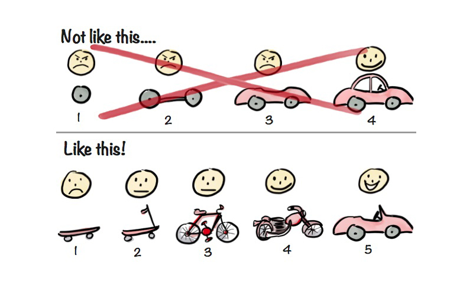

Mettre au contact profils techniques et opératifs est un enjeu de fidélisation au-delà de la plus-value d'une réponse plus rapidement et précise aux problématiques internes. Rappelez-vous : vos équipes sont en quête de sens. Elles ne viennent pas au travail le matin pour répondre à l'ordre de leur supérieur de développer un logiciel, mais pour concevoir avec leurs compétences d'expert la solution technique qui répondra le mieux au problème du métier. L'aboutissement du travail d'un ingénieur est de voir le métier utiliser la création qu'il a conçu.

## Libérer la parole et dé-siloter l'accès aux données

L'un des piliers du DevOps est de réduire les silos. Cela inclut l'accès aux données.

Si vous souhaitez que vos équipes techniques répondent du mieux possible à votre besoin, elles ont besoin d'un accès privilégié aux données de votre entreprise.

Abandonnez les « échantillons anonymisés ». Les ingénieurs ont besoin de comprendre précisément de quoi est composée la donnée qu'ils sont censés traiter. Tenter de développer un outil sur des données « anonymes » revient à développer un outil qui ne répond que partiellement à un cas d'usage.

Autrement dit, vous êtes certain qu'un bug se produira dès lors qu'une donnée « inconnue » passera dans le logiciel (cf. _edge cases_). Fournissez à vos équipes les données de production qui ont vocation à être utilisées dans les outils : vous perdrez moins de temps en résolution de bugs et améliorerez la qualité du service fournit par vos logiciels.

Dans le cas contraire, il n'est peut-être pas nécessaire d'embaucher des personnes en interne. Un prestataire pourra tout aussi bien construire le logiciel. Considérez néanmoins les risques de procéder ainsi (cf. [Être au plus proche du métier](#être-au-plus-proche-du-métier)).

# Sécurité : un nouveau paradigme avec l'approche DevOps

L'idée selon laquelle le DevOps permet de rapprocher les différents métiers pour collaborer ensemble n'est pas simple à appliquer. Les métiers historiques de la sécurité des systèmes d'information (SSI) se sont vu imposer des pratiques auxquelles ils n'étaient pas habitués et qu'ils n'ont parfois pas eu le temps d'appréhender.

Dans les grandes organisations, les règles de l'entreprise ou la loi elle-même imposent que des versions bien précises soient définies pour que le logiciel soit qualifié[^ANSSIQualifiedSoftware] ou homologué. Imaginez alors avoir la charge de faire respecter ces conditions quand les méthodes DevOps impliquent des dizaines de mise à jour logicielles chaque jour : il y a de quoi prendre peur ! Il est donc nécessaire de bien comprendre de quoi est composée une infrastructure cloud, pour correctement définir ce qu'implique sa "sécurité".

La sécurité affecte tous les [piliers du DevOps](#les-piliers-du-devops-en-pratique). Ce chapitre se concentre sur une description haut-niveau des notions de la sécurité dans une approche DevOps.

Dans ce mode d'organisation, les pratiques de sécurité sont automatisées pour être appliquées en permanence. L'objectif est d'éviter au maximum la sécurité dite "documentaire", souvent synonyme d'une efficacité moindre, en faveur de règles programmées. En effet, le fait d'user de technologies standardisées (cf. conteneurs, Kubernetes) permet de faciliter l'application des règles de sécurité et d'obtenir la garantie qu'elles soient appliquées.

## Culture de la sécurité

Le rapport DORA[^DORAWebsite] "_State of DevOps 2022_"[^DORAStateOfDevops2022Announcement] se concentre sur les enjeux de sécurité dans les initiatives de transformation des entreprises en mode DevOps. Il fait état du fait qu'une entreprise favorisant la confiance et la [sécurité psychologique](#accepter-léchec), est 60% plus susceptible d'adopter des pratiques de sécurité innovantes. Il ajoute que cette culture permet de réduire de 40% le nombre de _burnouts_[^Burnout] et augmente les chances qu'un collaborateur recommande son entreprise.

La sécurité a toujours été une affaire de culture. La méthodologie DevOps vient cependant apporter toutes les techniques qui permettront à une organisation de ne plus passer à côté des bonnes pratiques, autrefois négligées ou oubliées dans des archives volumineuses et indigestes.

L'essentiel est de comprendre qu'en mode DevOps, nous travaillons dans un principe de [cycle itératif d'amélioration](#être-au-plus-proche-du-métier). Les projets ne sont jamais figés en terme de technologie utilisée et les déploiements sont continus sans interaction humaine. Cela permet de ne pas nuire à la vélocité des innovations et de toujours répondre le plus justement possible au besoin du client. Mais ce n'est pas la loi de la jungle : il existe des standards technologiques et des procédés qui permettent de contrôler ce qui est déployé, selon les standards de sécurité exigés par votre organisation.

Nous détaillerons plus en détail les aspects culturels de la méthodologie DevOps dans le chapitre "[Accepter l'échec](#accepter-léchec)".

## Qualification, certification et homologation

Il existe trois manières de gérer le risque lorsque l'on doit faire un choix technique vis-à-vis de leurs caractéristiques de sécurité. L'ANSSI définit les termes suivants de cette manière :

- La qualification : elle est la recommandation par l'État français de produits ou services de cybersécurité éprouvés et approuvés[^QualificationANSSI]. Elle atteste de leur conformité aux exigences règlementaires, techniques et de sécurité promues par l'ANSSI en apportant une garantie de robustesse du produit. Elle permet au produit d'accéder à des marchés réglementés.
- La certification : elle est l'attestation de la robustesse d'un produit, basée sur une analyse de conformité et des tests de pénétration réalisés par un évaluateur tiers[^PASSI] sous l'autorité de l'ANSSI[^CertificationANSSI]. Elle permet d'accéder à des marchés réglementés et d'assurer un niveau de confiance auprès des utilisateurs souhaitant s'en équiper. Le processus dure entre 2 mois (certification de sécurité de premier niveau) et 18 mois (certification critères communs).

La certification/qualification concerne un produit. L'homologation concerne le déploiement de ce produit dans un environnement (un système d'information). Alors que la certification n'est pas une obligation légale, l'homologation peut l'être selon si vos règles SSI ou parfois la loi l'imposent (ex: si vous êtes un [^OIV]OIV). Elle représente l'acceptation du risque face aux bénéfices que l'installation apporte. En ce sens, elle peut être validée par une autorité SSI indépendamment de l'existence d'une certification/qualification du produit.

Les qualifications, certifications et homologations sont donc en l'état assez peu adaptées aux pratiques de déploiement continu, car elles figent le risque à l'instant T. Or les menaces s'imposent au jour le jour : une faille dans une librairie peut par exemple être détectée un jour après l'approbation d'une homologation. Bien que l'homologation soit temporaire, la faille va quand même persister pendant ce temps, au risque d'être exploitée. Faut-il encore qu'elle soit détectée et que la personne ayant subit l'aventure administrative que représente l'homologation, ne daigne réitérer l'expérience.

La sécurité d'un système d'information innovant est de partir du principe qu'une faille risque à tout moment de survenir ou d'être déployée. Mais que les procédés mis en place permettent de réagir vite à cette menace pour l'inhiber. Une bonne approche pour limiter les risques est l'intégration continue.

## Intégration continue et sécurité

Décrite en détail dans le chapitre "[Intégration Continue (CI)](#intégration-continue-ci)", l'intégration continue permet de contrôler automatiquement une modification apportée à un logiciel.

Dès que la moindre ligne de code est modifiée, des tests se lancent. Si une modification du code ne satisfait pas les standards de sécurité définis, elle est refusée. Le développeur est automatiquement informé dans son [usine logicielle](#usine-logicielle) (ex: GitLab) que sa contribution[^contribution] ne répond pas à la politique de l'organisation et peut voir un message d'erreur lui expliquant le problème. Il peut ainsi immédiatement effectuer les modifications pour se conformer.

C'est ici qu'on attend l'expertise des responsables de la sécurité. Ces profils doivent expliquer aux ingénieurs DevOps et aux SRE ce qui concrètement doit être contrôlé. Ces règles sont ensuite transcrites en code qui formera des tests automatisés, dans une chaîne d'intégration continue utilisée par tous les projets de l'entreprise.

Ces règles étant versionnées [sous forme de code](#infrastructure-as-code-iac) deviennent des tests automatisés. Elles pourront être mises à jour à souhait et impacteront immédiatement l'ensemble des projets.

Ces tests peuvent se composer : d'une analyse antivirus, de l'analyse de failles dans les images Docker du projet ou encore de s'assurer qu'il n'y ait pas de secrets poussés par inadvertance.


Dans la capture d'écran ci-dessus, vous pouvez observer une chaîne d'intégration continue à 5 étapes (Build, Test, Release, Preprod, Integration). La colonne qui nous intéresse est "Test". Elle comporte différents tests de sécurité qui sont lancés et qui ont dans ce cas soit réussi (coche verte), soit comporte des avertissements (point d'exclamation jaune). Si un test avait échoué, nous aurions vu une croix rouge. Un point d'exclamation signifie que le test en question n'est pas passé mais qu'il n'était pas critique (ex: une dépendance logicielle dépréciée mais sans faille de sécurité).

Dans une approche DevOps, les développeurs ne partent pas d'un projet vide. Ils partent d'un modèle (_template_ en anglais)[^GitLabCustomTemplate] qu'ils copient et qui intègrent toutes les règles de sécurité, en plus d'autres fichiers utiles pour démarrer. Veillez à ce que les équipes de sécurité co-contribuent à ces modèles pour que tout nouveau projet intègre vos standards de sécurité (cf. chapitre "[Intégration continue et sécurité](#intégration-continue-et-sécurité)"). Cela permettra de faire gagner du temps à tout le monde.

## Dépendances externes

Les pratiques SSI au sein des grandes organisation, requièrent que tout logiciel déployé soit homologué. Le document d'homologation doit lister les dépendances utilisées dans le logiciel : les librairies tiers-partie sur lesquelles ils se basent. Cela se nomme en anglais le _Software Bill of Materials (SBOM[^SBOM])_, en français "Nomenclature du logiciel".

Cette pratique est fastidieuse quand elle est manuelle, mais permet, lorsqu'une nouvelle faille est découverte, de pouvoir rapidement répondre aux questions "Sommes-nous affecté ?" ou encore "Où est utilisée cette librairie dans nos logiciels ?" pour la mitiger.

Néanmoins dans une approche DevOps, l'usage de ces librairies évolue au cours du temps. Une technologie utilisée un jour sera peut-être remplacée demain. Vous ne pouvez donc pas demander aux développeurs de mettre à jour la liste de ces centaines (voire milliers) de dépendances utilisées dans leurs logiciels.

L'avantage de la méthodologie DevOps est que l'ensemble du code est centralisé au sein de l'usine logicielle. Cela nous permet d'utiliser [des outils](medium.com/@geralexgr/opensource-devsecops-tools-for-devops-engineers-f6cbd5e3017a) pour analyser de quoi chaque projet est composé et prévenir les failles de sécurité. Le SBOM traditionnel peut donc être automatisé par deux choses :

- Des chaînes d'intégration continue qui détectent, mettent à jour ou refusent automatiquement l'usage de librairies spécifiques (ex: analyse des `package.json` en Javascript ou `requirements.txt` pour Python avec [_SPDX_](https://spdx.dev/) ou [_CycloneDX_](https://cyclonedx.org/), détection de paquets vulnérables avec _Renovate_[^Renovate]; cf. _Anchore_, _OSV-Scanner_[^osvscanner]).
- Des chaînes d'intégration continue qui intègrent de l'analyse de vulnérabilités dans les containers (ex: _Trivy_, [_Dockle_](https://github.com/goodwithtech/dockle), _Quay Clair_, [_Dagda_](https://github.com/eliasgranderubio/dagda), _Jfrog X-Ray_)

Au lieu de lister les dépendances, il s'agit de mettre en place une détection continue des librairies utilisées, pour tous les projets. Il faut pouvoir alerter au plus tôt des menaces et refuser les contributions pouvant apporter des risques, avant qu'elles soient déployées en production.

## Ressources pré-approuvées

Pour limiter les risques, il est possible de baser les logiciels développés sur des ressources pré-approuvées mises à disposition des développeurs. Chaque brique externe qui constitue le logiciel est vérifiée. Il peut s'agir de paquets Python, NPM, Go ou encore d'images Docker qui ont été analysés et pour lesquels les équipes de sécurité se sont assurées qu'il n'y avait pas de faille.

C'est le cas par exemple du service _Iron Bank_[^IronBankPresentation] mis en place par l'_U.S. Department of Defense_ au sein de _Platform One_[^PlatformOnePresentationWebsite]. Les images Docker doivent passer par une rigoureuse procédure de sécurité avant d'être approuvées. Ces étapes [combinent des vérifications](https://docs-ironbank.dso.mil/hardening/overview/) [manuelles](https://docs-ironbank.dso.mil/hardening/justifications/) et automatiques mais peuvent déjà faire, dans un premier temps, l'objet de procédures seulement automatisées. Les actions manuelles sont nécessaires pour justifier de l'intérêt d'ajouter une nouvelle image. C'est ce que les équipes de _Platform One_ appellent "l'homologation continue d'images approuvées"[^IronBankHardeningOverview].


Dans les organisations traitant de données très sensibles (c'est à dire des données pouvant mettre en péril la sécurité ou la crédibilité d'un pays si elles sont dévoilées), la politique par défaut est de n'autoriser que l'utilisation de librairies et d'images pré-approuvées (_hardened images_). Veillez néanmoins à considérer l'impact d'un tel choix sur la vélocité des développements. Soyez certain que vos équipes de sécurité et SRE puissent suivre le rythme de la mise à disposition des librairies.

Comme il est assez inenvisageable d'analyser "à la main" chaque librairie de développement pour s'assurer qu'elle n'ait pas de faille, les usines logicielles peuvent se baser sur la signature des fichiers. Les éditeurs de confiance signent chacune de leur librairie[^GitlabSigningProcess], pour que les chaînes d'intégration continue ou les administrateurs systèmes puissent vérifier qu'elle n'a pas été altérée au cours du transfert. Chaque éditeur de confiance émet un certificat que l'équipe SRE peut intégrer dans ses chaînes d'intégration continue pour vérifier que les paquets téléchargés n'ont pas été altérés.

Une méthode plus simple est de n'utiliser que la clé de hachage des fichiers. Chaque fichier est identifié par une chaîne de caractères nommée _hash_, que l'ordinateur peut facilement calculer.

> Exemple de _hash_ : _52dd368c0ed9714f9b84fb885c925da4_.

Si lors de l'installation, la dépendance téléchargée dispose d'un _hash_ différent de celui de référence (récupéré depuis Internet sur le site de l'éditeur), le lancement du logiciel est refusé. Ce mécanisme est déjà la plupart du temps implémenté par les gestionnaires de paquets des langages de programmation (ex: `package-lock.json` pour NPM, `poetry.lock` pour Python).

## Revues de code

Dans un monde idéal, toute vérification est automatisée. Néanmoins, il est parfois compliqué de "coder" des vérifications de sécurité avancées, ou vous n'êtes peut-être pas dimensionné en terme RH pour le faire.

En DevOps, on pratique la méthodologie [GitOps](#gitops) : chaque développeur travaille sur sa propre branche et développe sa fonctionnalité. Il teste si tout fonctionne comme attendu, puis crée une "demande de fusion" (communément appelée _merge request_ ou _pull request_) dans la branche principale. Ce processus est détaillé dans le chapitre "[workflow git](#workflows-git)".

La revue de code se passe à ce moment-là. Elle est l'occasion pour les ingénieurs d'approuver les modifications des autres, en apportant un regard extérieur avant qu'elle soit fusionnée sur la branche de développement principale. C'est à ce moment que les différentes personnes impliquées dans la vérification de la qualité d'une contribution peuvent écrire leurs commentaires.


L'objectif est de vérifier que le développeur n'ait pas fait de grosse erreur dans le fonctionnement du code, ou de s'assurer qu'il n'ajoute pas de dette technique. Par exemple chez Google, une _merge request_ requiert l'approbation d'au moins deux ingénieurs avant de pouvoir être validée.

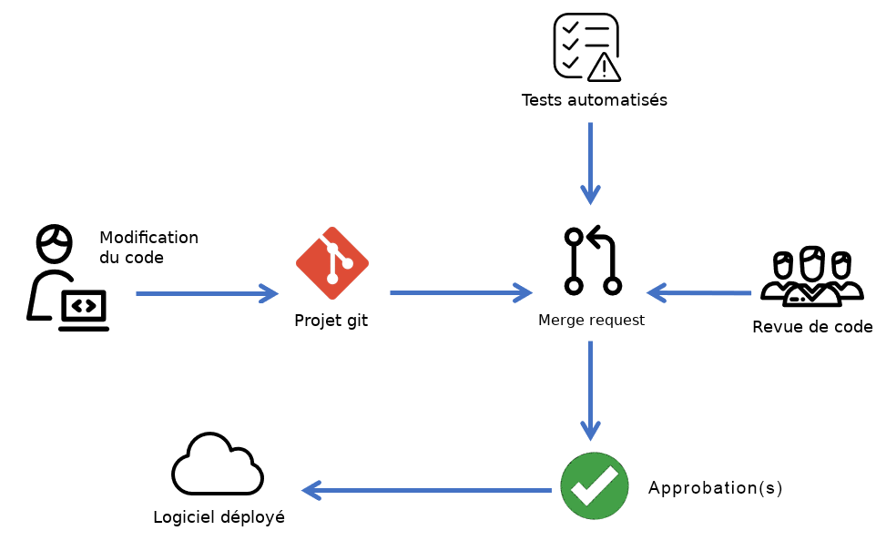

La publication d'une nouvelle version d'un logiciel en production est le moment idéal pour que les équipes de sécurité auditent le code. Cette pratique s'appelle la "revue de sécurité". Toute nouvelle version d'un logiciel est soumise aux règles d'intégration continue précédemment citées avec des tests automatisés de sécurité supplémentaires et optionnellement la validation de l'équipe de sécurité.

Pour les équipes des sécurité, la revue de code a pour objectif de vérifier que le maximum de critères de sécurité sont respectés. Par exemple :

- Présence de journaux d'activité qui recensent les actions utilisateur
- Accès à des sources de données autorisées (cf. chapitre "[Service mesh](#service-mesh)" pour forcer ces politiques de sécurité)
- Pas d'envoi de données vers un service non autorisé (cf. chapitre "[Service mesh](#service-mesh)" pour forcer ces politiques de sécurité)
- Technique de stockage des mots de passe / des cookies
- Respect des fonctionnalités RGPD

GitLab permet par exemple d'obliger l'approbation d'une _merge request_ par des équipes spécifiques[^GitLabRequiredApprovals] (ex: l'équipe de sécurité), avant qu'une contribution puisse être fusionnée dans la branche principale.

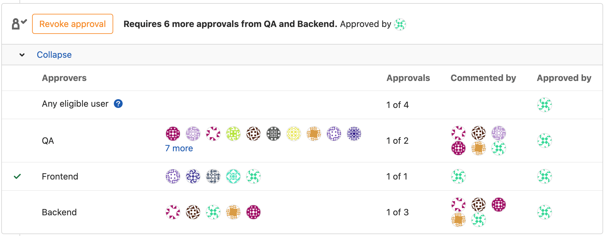

Des outils comme [_ReviewDog_](https://github.com/reviewdog/reviewdog), [_Hound_](https://houndci.com/) ou [_Sider Scan_](https://siderlabs.com/scan/en/) permettent d'assister les ingénieurs lors de la revue de code. Par exemple, ces outils font passer des _linters_[^linter] et ajoutent automatiquement des commentaires à la ligne concernée.

## Gérer son infrastructure avec du code

L'humain est le premier vecteur d'introduction de failles de sécurité. Pour éviter au maximum l'erreur ou la compromission volontaire d'un système, les infrastructures modernes "codent" leur infrastructure.

C'est à dire que pour opérer l'infrastructure au quotidien (en dehors d'un cas d'urgence), toute action d'administration est codée, publiée et vérifiée dans l'usine logicielle avant d'être lancée. Cela permet de pouvoir standardiser, documenter, rejouer et optimiser au cours du temps les actions d'administration.

Le domaine englobant les techniques de gestion de la production en code, est communément appelé _Infrastructure as Code_ (IaC). Cette notion et sa pertinence sont développés dans le chapitre "[Infrastructure as Code](#infrastructure-as-code-iac)".

Voici un exemple de configuration (code) permettant de mettre à jour le fuseau horaire et l'heure de la machine `prod-fr-zone-c-server-18` :

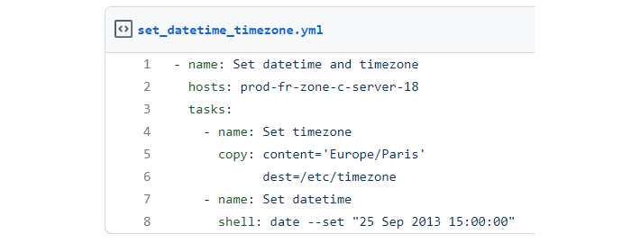

L'exemple ci-dessus est simple mais l'IaC peut aller jusqu'à décrire la manière dont des machines peuvent être instanciées et configurées. Une configuration d'Iac peut par exemple totalement configurer une machine de 0 (paramètres réseau, certificats de sécurité, ajout d'utilisateurs, installation des _drivers_ d'une imprimante, configuration des favoris du navigateur...). L'idée est encore une fois d'éviter au maximum l'intervention humaine, pour éviter des commandes erronées, lancées par erreur.

## Sécuriser sa chaîne logicielle

Le terme "chaîne logicielle" doit être compris comme "chaîne de développement et de déploiement des logiciels" (_software supply-chain_ en anglais). Il est raccourcis pour simplifier la compréhension des notions abordées.

En mai 2021, la Maison Blanche a fait paraître un décret décrivant de nouvelles pistes pour "améliorer la cybersécurité du pays". Parmi 7 priorités[^FactSheetUSASecurity] décrites, la volonté d'améliorer la sécurité de la chaîne logicielle est citée. Il stipule qu'il est "urgent de mettre en œuvre des mécanismes plus rigoureux et prévisibles pour garantir que les produits fonctionnent en toute sécurité et comme prévu"[^USAExecOrderImproveCybersec]. Cette volonté a été renouvelée en janvier 2022 lors de la signature par Joe BIDEN du _mémorandum_ sur la sécurité nationale des États-Unis[^NSM2022].

Aujourd'hui, des standards décrivent la manière dont il est possible de correctement sécuriser sa chaîne logicielle. Ces standards sont regroupés au sein de ce que l'on appelle des frameworks[^SecurityFramework]. Ces derniers continueront à évoluer mais fournissent déjà des règles de sécurité, sur lesquelles nous pouvons sereinement nous baser.

Chacun des frameworks présentés dans ce chapitre contient une liste de recommandations, sur les techniques de sécurité à mettre en place au sein de sa chaîne logicielle.

### SLSA

Les framework _Supply-chain Levels for Software Artifacts_ (SLSA[^SLSA], prononcé "salsa") se concentre historiquement sur la provenance des données et la notion d'artéfacts.

Le SLSA est né des pratiques internes de Google. L'entreprise a développé des techniques pour veiller à ce que les employés, en agissant seuls, ne puissent pas accéder directement ou indirectement aux données des utilisateurs - ni les manipuler de toute autre manière - sans autorisation et justification appropriées[^BinaryAuthorizationForBorg].

En développant des logiciels, vous utilisez et produisez des artéfacts (_artifacts_ en anglais). Ces derniers peuvent qualifier une librairie de développement utilisée dans votre code, un binaire de machine learning ou encore le produit de la compilation de votre logiciel (un `.bin`, `.exe`, `.whl`...). Le SLSA part du principe que chaque étape de la création d'un logiciel implique une vulnérabilité différente et que ces artéfacts sont un vecteur privilégié de menace.


Ses règles tournent autour de la vérification automatique de l'intégrité des données manipulées. Quelques exemples des vulnérabilités auxquelles le SLSA répond :

- s'assurer que le code source utilisé dans les scripts compilant le logiciel (CI) n'a pas été altéré
- s'assurer de la provenance des dépendances de développement
- s'assurer que l'usine logicielle dispose d'une connectivité réseau minimale

En fonction de la maturité technique de son équipe, il est possible d'appliquer les règles SLSA selon 4 niveaux de sécurité et de complexité. L'idée est de pouvoir progressivement améliorer la sécurité de sa chaîne logicielle au cours du temps.

Le SLSA se compose de deux parties :

- les [pré-requis](https://slsa.dev/spec/v0.1/requirements) (_requirements_) : ensemble de règles de sécurité plus ou moins complexes à mettre en place selon le niveau SLSA (1 à 4) que l'organisation souhaite atteindre
- les [menaces et contremesures](https://slsa.dev/spec/v0.1/threats) (_threats and mitigations_) : qui donnent des scénarios de menaces, des exemples publics connus et la manière dont il est possible d'y remédier

Le projet FRSCA[^FRSCAGithub] est un exemple pragmatique d'une usine logicielle mettant en œuvre les pré-requis SLSA.

La documentation du SLSA, continuellement mise à jour par la communauté[^GitHubSLSA], est disponible sur son [site officiel](https://slsa.dev).

### SSCSP

Les spécifications du _Software Supply Chain Security Paper_ (SSCSP ou SSCP) de la réputée _Cloud Native Computing Foundation_ (CNCF) sont complémentaires aux SLSA. Elles couvrent historiquement un panel plus large de sujets, mais beaucoup de recommandations se recoupent aujourd'hui.

Bien que le SLSA propose une documentation plus interactive, bien illustrée (avec des exemples d'outils à utiliser ou de menaces pour chaque règle) et presque gamifiée grâce à ses "badges de niveau de sécurité", les spécifications SSCSP semblent permettre - au moment de l'écriture de ce livre - de donner une vision plus haut-niveau sur les menaces au sein d'une chaîne logicielle.

Plus concises pour débuter, je recommande de démarrer son projet de sécurisation d'usine logicielle avec le SSCSP, puis de progresser avec le SLSA.

Ce document de référence est également contributif[^CNCFSSCSPGithub] et fait plus largement partie des standards[^CNCFTAGGithub] adoptés par l'équipe des conseillers techniques en sécurité (TAG) de la CNCF. Ces derniers rédigent différents documents de référence ayant vocation à améliorer la sécurité de l'écosystème cloud[^CNCFTAGAnnouncement].

### SSDF

Le _Secure Software Development Framework_ (SSDF[^SSDF]) est un document rédigé par le _National Institute of Standards and Technology_ (NIST) de l'_US Department of Commerce_ à l'attention de tout éditeur et tout acquéreur de logiciels, indépendamment de leur appartenance ou non à une entité gouvernementale.

Le travail du NIST est à saluer par la variété et la qualité des rapports produits, sur des technologies et techniques à l'état de l'art. Leurs travaux sont la plupart du temps le fruit d'une réflexion menée en concertation avec de nombreuses institutions et entreprises du privé. On y retrouve par exemple Google, AWS, IBM, Microsoft, la _Naval Sea Systems Command_ ou encore le _Software Engineering Institute_.

Plus complet que les deux précédents, le SSDF agit comme un annuaire regroupant les recommandations issues de dizaines d'autres frameworks (ex: SSCSP, OWASP SAMM, MSSDL, BSIMM, PCI SSLC). Il les classe en 4 grands thèmes : préparer l'organisation, protéger les logiciels, produire des logiciels bien sécurisés, répondre aux vulnérabilités.

Le framework répertorie des notions générales associées progressivement à des règles plus concrètes. Chacun des thèmes regroupe des grandes pratiques à suivre, qui incluent elle-mêmes des tâches contenant des exemples, associées à des références aux frameworks concernés.

Par exemple pour le thème "protéger les logiciels", la pratique "protéger toutes les formes de code contre l'accès non autorisé et la falsification" propose d'utiliser la "signature des _commits_" en référence au SSCSP avec le chapitre concerné "Sécuriser le code source".

Ce document [est à retrouver](https://nvlpubs.nist.gov/nistpubs/SpecialPublications/NIST.SP.800-218.pdf) sur le site Internet du NIST. La bibliothèque en ligne du directeur de l'information[^CIOLibrary] (CIO) de l'_US Department of Defense_ est également une excellente source d'inspiration.

### L'exemple de GitHub

GitHub est la plateforme de partage de code la plus populaire sur Internet. Elle héberge plus de 100 millions de projets avec plus de 40 millions de développeurs y contribuant. Pillier dans le domaine de l'open-source, elle propose des outils de sécurité nativement intégrés à sa plateforme. L'objectif de GitHub est de faire en sorte que protéger son code, ne nécessite que quelques clics pour activer les outils opportuns.

L'entreprise a opéré un virage stratégique en faisant l'acquisition en 2019 de _Semmle_, un outil d'analyse des vulnérabilités dans le code. Depuis, elle propose plusieurs moyens de sécuriser sa base de code :

- SAST (_Static application security testing_) : outils d'analyse automatisée de vulnérabilités dans le code (ex: injections SQL, faille XSS et autres vulnérabilités communes). GitHub inclut également une _marketplace_ permettant d'ajouter des analyseurs de code provenant de tiers-parties. Vous pouvez également ajouter vos propres règles grâce à des fichiers _CodeQL_. Vous pouvez mettre en place ces outils sur votre infrastructure, par exemple avec _CodeQL_, _Checkmarx_, _Klocwork_ ou encore _Checkov_.

    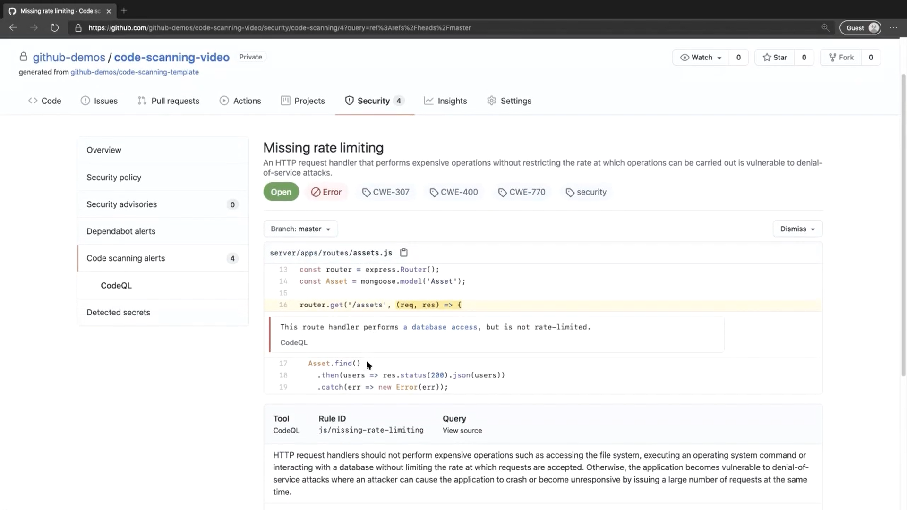

- Analyseur de secrets : analyse, détecte et alerte sur de potentiels mots de passe ou _tokens_ laissés par erreur dans le code source. Alternative open-source : [_Gitleaks_](https://owasp.org/www-community/Free_for_Open_Source_Application_Security_Tools).
- _Dependabot_ : outil d'analyse dynamique des risques liés aux dépendances utilisées (ex: [vulnérabilités, librairie non maintenue, risques légaux](https://github.blog/2020-12-17-shifting-supply-chain-security-left-with-dependency-review)). _Dependabot_ ouvre automatiquement une proposition de modification du code (_pull-request_) sur le projet et suggère la mise à jour de la dépendance ou bien une alternative. Alternative open-source : [_Faraday_](https://github.com/infobyte/faraday).

    

Toutes les failles de sécurité liées à un projet sont centralisées au sein d'une vue d'ensemble, permettant de facilement détecter et remédier aux menaces.

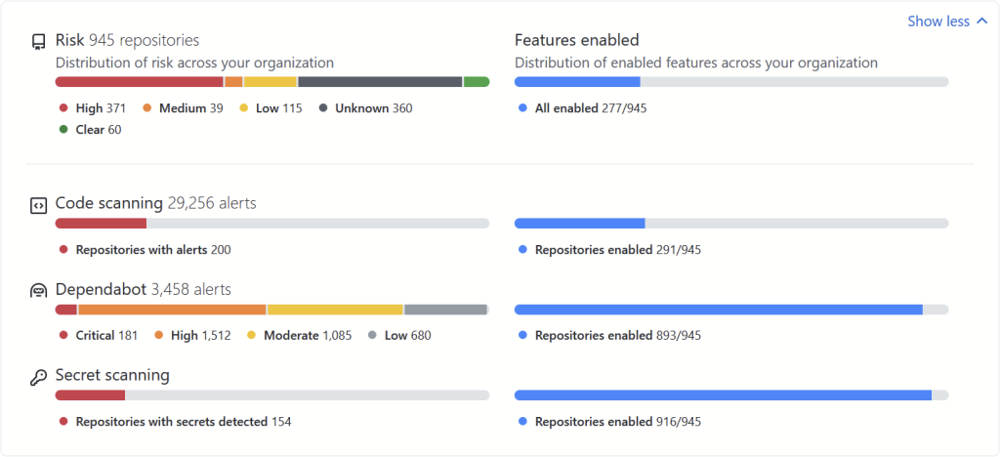

GitHub se base sur le référentiel international des CVEs[^CVE] (_Common Vulnerabilities and Exposures_) pour reconnaître les failles, une liste de vulnérabilités identifiées dans les systèmes informatiques et décrites sous un format précis. Vous pouvez ajouter des mécanismes de vérification supplémentaires grâce aux _GitHub Actions_, le mécanisme d'intégration continue de GitHub.

## Les bases de l'architecture réseau _zero trust_

Le concept _zero trust_ se résume en une expression : "Ne jamais faire confiance, toujours vérifier". Cette pratique s'impose aujourd'hui avec 55% des entreprises qui répondaient avoir mis en place une initiative _zero trust_ en 2022 contre 24% en 2021[^OKTAZeroTrustStudy].

Traditionnellement, la sécurité des réseaux était basée sur la définition d'un "périmètre de confiance" tracé autour des logiciels et des données d'une organisation. Elle mettait ensuite en place une variété d'outils et de technologies pour les protéger. Cette architecture réseau - aussi nommée "_castle-and-moat_"[^CloudflareCastleAndMoat] ou "périmétrique" - reposait sur l'hypothèse que toute activité à l'intérieur du périmètre est digne de confiance et par réciprocité, que toute activité à son extérieur ne l'est pas (ex: accès réseau via un VPN ou sur base de l'adresse MAC d'une machine).

Le _zero trust_ part du principe qu'aucun utilisateur n'est "de confiance" par défaut, qu'il se trouve à l'intérieur ou à l'extérieur du périmètre. Pour accéder aux données et aux logiciels, les utilisateurs doivent être authentifiés et autorisés. Leur activité doit être surveillée et enregistrée. Cette approche est plus efficace pour protéger systèmes d'information contre les attaques sophistiquées, car elle ne repose justement pas sur l'hypothèse que toute activité à l'intérieur du périmètre est digne de confiance. Ce modèle de sécurisation des réseaux s'est particulièrement développée en raison du recours massif au télétravail[^BCPANDRHStudyTeletravail].

Prenons un exemple : Sophie est une employée que vous côtoyez depuis 3 ans. Elle présente son badge à l'entrée et s'installe comme tous les jours à son poste de travail. Vous apprenez quelques jours après que Sophie a été licenciée depuis 1 mois. Il se peut qu'elle ait eu accès à des informations stratégiques sur votre entreprise. Des informations qu'elle utilisera dans son nouvel emploi, chez une société concurrente. Ici, sur le simple fait d'avoir "l'habitude" de voir ce collaborateur, l'entreprise s'est faite dérobée des informations précieuses. Les technologies _zero trust_ fournissant des moyens de gestion des accès centralisés, Sophie n'aurait pas pu se connecter à sa session.

Trois piliers constituent une architecture réseau _zero trust_ :

1. **Identification** : identifier l'utilisateur
     - _Identification_ : Qui êtes-vous ?
     - _Authentification_ : Êtes-vous celui que vous prétendez être ? (ex: facteur à double authentification _2FA_)
     - _Autorisation_ : Êtes-vous autorisé à accéder à cette ressource ?
2. **Contexte** : comment l'utilisateur tente d'accéder à la ressource
     - _Principe de moindre privilège_ ou _besoin d'en connaître_ : accorder l'accès à une ressource en ne cédant que la plus petite quantité d'accès possible (ex: cacher les applications/sources de données auxquelles l'utilisateur n'a pas accès, définir une date limite d'accès)
3. **Sécurité** : le matériel avec lequel l'utilisateur se connecte au réseau
     - Sécurité de la machine : s'assurer que la machine qui se connecte est conforme aux exigences de sécurité (ex: vérifier qu'un antivirus tourne ou que l'OS mis à jour)


L'idée est qu'en _zero trust_, chaque requête implique une nouvelle vérification de ces critères de sécurité. C'est l'intermédiaire de confiance (_trust broker_ ou CASB[^CASB]) qui vérifie ces critères (cf. _OpenID_, _Active Directory_, _PKI_, _SAML_).

Les CASB sont intégrés aux technologies dites "_Zero Trust Network Access_" (ZTNA) pour mettre en place une architecture _zero trust_. _Cloudflare_, _Cato_, _Fortinet_ ou encore _Palo Alto_ sont des exemples de technologies ZTNA[^ZTNA]. Voyez-les comme des serveurs proxy avancés, qui vérifient en permanence plusieurs critères de sécurité définis par votre organisation. Si vous souhaitez mettre en place une initiative _zero trust_, reportez-vous au framework SASE[^SASE].

En raison du nombre d'outils à configurer, le modèle _zero trust_ est moins simple à mettre en place qu'une sécurité périmétrique, mais il permet de surpasser ses limites[^ANSSIZeroTrust].

Au delà d'un besoin impératif de mieux sécuriser l'accès aux ressources, l'architecture _zero trust_ apporte la sérénité d'une infrastructure sécurisée. Elle permet tout autant de simplifier l'administration des postes d'exploitation et des matériels réseau (administration centrale des flux réseau et des accès, plutôt qu'une configuration de chaque poste), de réduire les coûts (temps de maintenance, machines pouvant être mutualisées) et de standardiser les interfaces de gestion de l'identité et des droits utilisateur.

L'innovation technologique implique de s'adapter rapidement. Le _zero trust_ permet aux organisations de s'adapter rapidement et en toute sécurité aux changements de leur environnement, sans avoir à revoir leur posture de sécurité.

Des documents de référence tels que le papier de recherche _Beyondcorp_ de Google[^Beyondcorp], ceux du NIST[^NISTZeroTrust] ou de l'_US Department of Defense_[^CNAPDod] donnent les spécifications pour déployer un réseau zero trust à l'état de l'art.

## Développement basé sur le _zero trust_

Dans le cadre d'un environnement de développement (R&D), le sujet se complique. Pour rester innovantes, vos équipes ont besoin de flexibilité. Elles utilisent des librairies de dernière génération, installent les derniers drivers GPU pour faire des expérimentations de _machine learning_ ou encore en testent les performances de leur logiciel, avec une consommation totale ressources de leur machine. En résumé, vos équipes ont besoin d'un accès complet à la configuration de leur machine pour efficacement développer.

Or, comme citée plus haut, la 3ème règle d'une architecture _zero trust_ est de s'assurer que la machine de l'utilisateur est sécurisée. Si vous laissez les droits d'administration à un développeur, il pourra toujours désactiver les paramètres de sécurité de sa machine. Donc que faire ?

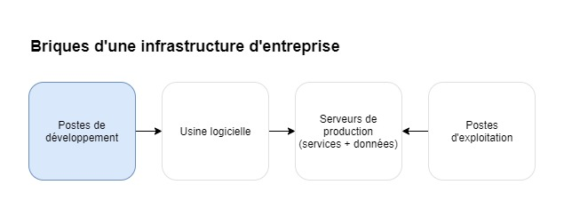

La suite de ce chapitre traite de la brique bleue sur le schéma ci-dessus : les postes de développement.

Ils sont un élément particulier de notre infrastructure _zero trust_ car ils impliquent la captation de ressources externes à l'entreprise, déployées par la suite au sein de son infrastructure. Inversement, le code source de l'usine logicielle ou les données de l'entreprise sont copiés sur ces machines. Avec des librairies téléchargées ou des éditeurs de code aux extensions non-vérifiées, on ajoute le risque d'une fuite de données vers l'extérieur.

Nous avons ici un dilemme. Soit nous acceptons de laisser les droits complets à nos développeurs sur leurs machines, pouvant désactiver nos mesures de sécurité mais en nous rassurant car les connexions à l'usine logicielle et la production sont bien protégées (cf. authentification, journaux d'activité). Soit nous restreignons ces droits mais amputons d'une portion significative la vélocité et l'innovation des développement, et acceptons de passer plus longtemps à former les personnels à leur environnement de travail atypique.

Tout dépend de ce dont on veut se prémunir. Il faut prendre en compte les facteurs suivants :

- La sécurité physique de vos installations est-elle garantie ? (les machines ont-elles vocation à sortir de vos bureaux ? des externes ont-ils accès à ces machines ?)
- Vos personnels ont-ils subit une enquête de sécurité ? (vérification périodique de l'intention des collaborateurs)
- Votre infrastructure est-elle connectée à Internet ?
- Votre infrastructure dispose-t-elle d'un débit important ?
- Votre infrastructure est-elle sujette à des déconnexions récurrentes ?
- Les données manipulées sont-elles massives ?
- Les données manipulées sont-elles de nature à nuire à l'organisation si elles sont dévoilées ?
- Êtes-vous en mesure de fournir des machines pour vos collaborateurs ?
- Avez-vous des équipes en mesure d'administrer ces machines ? (privilégier des solutions Cloud aux solutions _on-premise_)

Il existe plusieurs moyens d'adresser la problématique des environnements de développement. Je vous en propose 6 classés selon leur flexibilité pour l'utilisateur, leur complexité de mise en place et le risque qu'ils impliquent :

1. _BYOD_ : _Bring Your Own Device_. L'utilisateur utilise son propre ordinateur et ses propres moyens pour développer. Vous n'avez aucun contrôle sur la machine.
   - Cas 1 : vous embauchez un freelance qui travaille à distance
   - Cas 2 : vous n'avez pas les moyens ou le temps d'administrer un parc de machines
   - Remarque : Ne donnez accès à l'utilisateur qu'au strict minimum qu'il doit avoir pour travailler correctement (ex: accès limité à la base de code, aux données).
2. Machines partiellement contrôlées. Un utilisateur précis a les droits d'administration sur sa machine. Tout autre utilisateur ne les a pas.
   - Cas : vous fournissez des postes de travail à vos collaborateurs, avez faits des premiers efforts de sécurisation, mais n'avez pas les moyens de proposer une alternative.
   - Remarque : Préférez conserver la machine dans les locaux de l'entreprise en tout temps.
3. Machines entièrement contrôlées avec environnement de développement cloud (éphémère type CodeSpace[^CodeSpace], Coder[^CoderCloud] ou Eclipse Che[^EclipseChe]).
   - Cas : vous fournissez des postes de travail connectés en réseau
4. Machines entièrement contrôlées avec VM de développement distante (ex: Shadow[^Shadow], Azure VM)
   - Cas : vous avez accès à une infrastructure cloud gérable à distance par un tiers-partie de confiance.
   - Exemple : En 2014, Sogeti annonce la création de OneShare : une plateforme DevOps permettant à ses ingénieurs de créer des environnements de développement et de test, sur des VMs basées sur des _templates_ (incluant l'outillage de développement)[^SogetiDevOpsMicrosoft].
   - Remarque : Ces VMs doivent dans l'idéal inclure de l'outillage de développement. Ce moyen peut suffire si vos VMs ont accès à Internet pour faire des transferts de données et si vos postes sont reliés à la fibre. Sinon, cet environnement est absolument déconseillé.
5. Machines entièrement contrôlées avec VM de développement locale
   - Cas : votre activité nécessite que vos ingénieurs aient une autonomie élevée pour innover sur du matériel spécifique (ex: librairies GPU de dernière génération, R&D) mais vous manipulez des données critiques et avez des besoins élevés de sécurité.
   - Remarque : Ayez pour objectif de créer des images de VM pré-configurées avec des outils de développement. Dans le cas contraire, vous risqueriez de faire perdre du temps à vos collaborateurs en les obligeant à installer cet outillage. Faites en sorte de monter un dossier commun entre l'hôte et la VM pour gagner du temps sur les transferts de données.
6. Machines entièrement contrôlées et outillées
   - Cas : votre entreprise est mature, votre activité nécessite que vos ingénieurs aient une autonomie particulièrement élevée pour innover sur du matériel spécifique (ex: librairies GPU de dernière génération, recherche), qu'ils ne soient pas contraints par des outils intermédiaires (VM), mais vous manipulez des données critiques et avez des besoins élevés de sécurité.
   - Remarque : Cette pratique est déconseillée si vous n'avez pas des équipes dédiées et assez nombreuses pour maintenir régulièrement cette infrastructure (ex: Google). En terme de sécurité, pensez entre-autres à contrôler les extensions utilisées par votre IDE[^IDE].

| Méthode                                                  | Flexibilité  | Complexité                               | Risque      |
| -------------------------------------------------------- | ------------ | ---------------------------------------- | ----------- |
| _Bring Your Own Device_                                  | Maximale     | Aucune                                   | Haut        |
| Machines partiellement contrôlées                        | Maximale     | Plutôt faible                            | Moyen       |
| Machines entièrement contrôlées avec env. de dev. cloud  | Moyenne      | Moyenne (_Codespaces_) à Haute (_Coder_) | Faible      |
| Machines entièrement contrôlées avec VM de dev. distante | Moyenne      | Moyenne                                  | Faible      |
| Machines entièrement contrôlées avec VM de dev. locale   | Plutôt haute | Haute                                    | Très faible |
| Machines entièrement contrôlées et outillées             | Haute        | Très haute                               | Très faible |

Plus l'on souhaite faire baisser le risque (augmenter la sécurité) tout en augmentant la flexibilité (facilité pour innover), plus cela demandera du temps à vos équipes d'infrastructure, ou vous coûtera de l'argent (si vous externalisez). Prenez en compte les facteurs inhérents à votre organisation et son mode de fonctionnement pour choisir la solution qui vous convient le mieux.

## Savoir protéger ses secrets

Les administrateurs d'une infrastructure manipulent régulièrement des "secrets" : des mots de passe ou des _tokens_. Parfois, il est nécessaire de les partager à d'autres administrateurs. D'autres fois, nous pouvons avoir besoin de partager le mot de passe d'un compte à la personne concernée. Les gestionnaires de mot de passe sont un excellent moyen pour centraliser et partager ces ressources.

Vous pouvez y gérer vos mots de passe et les partager granulairement à d'autres utilisateurs. Chacun dispose de son compte pour accéder aux secrets qu'il a le droit de voir. Je vous recommande d'en faire l'usage autant que possible. Travailler en réseau vous permet de faire l'usage de ces outils.

Quelques services de gestion collaborative des mots de passe existent : Vaultwarden, Bitwarden, Lastpass.

## Un socle au service de votre résilience

Le socle d'une infrastructure informatique constitue l'ensemble des technologies qui permettent d'y déployer des logiciels. Y sont souvent associés des services "cœur" communs et vitaux pour le bon fonctionnement de l'infrastructure : une PKI[^PKI], un serveur d'authentification centralisé (ex: LDAP), un serveur de temps NTP ou encore un _Active Directory_[^ActiveDirectory].

Pour les ingénieurs ayant la charge de déployer des logiciels, le socle fournit des services communs pour éviter d'en déployer avec chacun des logiciels. Ces services étant centralisés, les tâches d'administration sont simplifiées. Dans un socle Cloud, cette idée est poussée plus loin que dans un socle traditionnel. Cela est rendu possible par l'usage de technologies standardisées (ex: conteneurs Docker, Kubernetes) qui simplifient l'interaction avec les logiciels déployés.

Comparons un socle traditionnel à un socle Cloud pour mieux comprendre la plus-value de ce dernier.

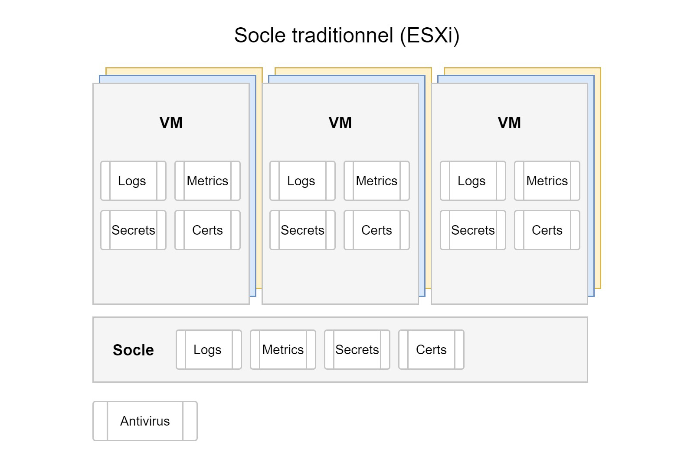

Dans un socle traditionnel, une machine virtuelle (VM) est attribuée à chaque logiciel pour l'isoler logiquement. Chaque logiciel a la charge de gérer ses propres logs, certificats, secrets et générer ses propres métriques. Il est possible que le socle héberge des services centralisant ces données, mais le développeur du logiciel devra alors apporter des modifications à son code pour se conformer aux services du socle.

La robustesse de ce type de socle n'est plus à prouver et se voit encore largement utilisé aujourd'hui dans les grandes institutions. L'isolation est très efficace. Néanmoins, les besoins en maintenance de ce type de socle augmentent proportionnellement au nombre de logiciels déployés. Chaque logiciel dispose de consignes d'installation, auxquelles s'ajoutent de la documentation de conformité au socle. L'installation et la configuration sont souvent manuelles. Or, les organisations ont tendance à installer de plus en plus de services au cours du temps, afin de continuer de répondre aux besoins métiers.

En résumé, on force ici le logiciel déployé à s'adapter au socle. Ce qui génère de la dette technique. Qui plus est, des services socle centralisés comme ceux pour gérer logs ou les métriques, n'existent pas toujours.

Ce type de socle est efficace avec un nombre raisonnable de services déployés, mais il passe difficilement à l'échelle sans une RH proportionnellement dimensionnée.


Dans un socle Cloud, l'interaction entre les logiciels déployés et le socle est nativement plus forte. Les interfaces standardisées des conteneurs permettent aux services socles d'un orchestrateur (ex: Kubernetes) de s'y "connecter", tout en conservant une isolation logique des ressources[^ANSSIContainerRecommandation].

Par exemple, les logs applicatifs ou les métriques de performance peuvent automatiquement être récupérés et capitalisés dans un outil central, pour ensuite configurer des alertes. Un antivirus vérifiant de manière continue la présence de menaces dans un conteneur peut être installé. C'est le mécanisme de _sidecars_[^sidecars] dans Kubernetes qui permet la plupart du temps de rendre ces capacités possibles.

Les flux de données entre conteneurs peuvent par défaut être chiffrés (cas d'usage: deux services qui tournent sur des serveurs différents). Les secrets (mots de passe, token) peuvent être fournis par le socle sans qu'un administrateur ne doive les voir. Les données persistantes (volumes) sont gérées de manières unifiées et leurs sauvegardes peuvent être automatisées.

L'intérêt de ce type de socle est de permettre de bénéficier de tous ces services automatiquement, sans jamais toucher au code de l'application ni que l'intégrateur ait connaissance de votre infrastructure. Ainsi vous avez la garantie que tous les logiciels déployés se conforment à vos exigences en matière de supervision et de sécurité. C'est donc le socle qui s'adapte aux logiciels déployés.

Les mécanismes d'installation étant standardisés par Kubernetes (cf. manifests Kubernetes, Helm[^Helm]), vous n'avez qu'à lancer quelques commandes pour que votre logiciel soit déployé. Kubernetes se chargera automatiquement d'instancier de nouveaux conteneurs si la charge utilisateur est trop importante. Nous retrouverons des références aux technologies évoquées ici, dans le chapitre "[Des extensions pour simplifier l'infrastructure](#des-extensions-pour-simplifier-linfrastructure)".

Si votre organisation se compose de personnels déjà formés aux technologies ESXi, ou si les règles SSI de votre organisation ne sont pas prêtes pour accueillir un socle Cloud, il reste possible de poser un cluster Kubernetes sur votre infrastructure ESXi traditionnelle. Cela peut s'envisager dans un plan de transformation, au prix d'une dette technique temporairement plus importante, pendant que vos équipes historiques se forment aux technologies Cloud. L'objectif a terme étant de ne faire tourner plus que le socle Cloud.

En terme de sécurité, les interfaces des technologies conteneurisées sont standardisées. Il ne s'agit donc plus de devoir vérifier le contenu du conteneur : l'infrastructure s'en charge elle-même. Mais de s'assurer de la sécurité de la technologie de conteneurisation (ex: Docker, CRI-O), ainsi que des technologies d'orchestration (ex: Kubernetes, Rancher, OpenShift). Par exemple, peut-être vous êtes vous assuré que _Microsoft Word_ était sécurisé au travers d'une [homologation](#qualification-certification-et-homologation) ? Pour autant, chaque fichier _Word_ n'a pas besoin d'être homologué à son tour. C'est la même chose pour une application conteneurisée : qu'elle soit codée en Python, en Go, en PHP ou qu'elle embarque des librairies de dernière génération, c'est l'enveloppe qui le fait tourner qui doit être homologué : le conteneur.

En conclusion, vous devez traiter votre socle comme un produit au service de vos équipes techniques. Plus vous mutualiserez et automatiserez le recours aux services de ce socle, moins vous devrez entretenir de dette technique (cf. chapitre "[Tirer parti de l'automatisation](#tirer-parti-de-lautomatisation)"). À la fin, ce travail se traduit par une meilleure disponibilité des services pour vos clients.

## Abandonner les VMs ?

Les micro-services étant au cœurs des infrastructures Cloud DevOps, le conteneur paraît comme la solution ultime pour déployer. Il n'y a plus besoin de machines virtuelles, puisque l'orchestrateur (ex: Kubernetes) peut s'installer directement sur la machine. C'est ce que l'on nomme une installation "_baremetal_". Néanmoins dans le cadre d'une transformation, il est souvent inoportun de mettre les VMs au placard.

Rares sont les cas où vous pourrez transformer du jour au lendemain votre infrastructure de production vers une infrastructure Cloud. Si vos équipes sont habituées à administrer des VMs, il leur faut le temps de se former à ces nouvelles technologies. Et aux applicatifs d'être migrés vers un format compatible. Pour avancer, fixez-vous un objectif pour réduire l'usage des VMs. Par exemple : "dans 1 an, au moins 80% de nos logiciels devront tourner sous forme de conteneurs". Ou encore : "tout nouveau logiciel doit être conteneurisé pour être déployé".

Voici quelques situations où les VMs restent utiles :

- Des logiciels historiques (_legacy_) ou critiques de votre entreprise ne sont pas déployables sous forme de conteneurs.
- Les industriels avec lesquels vous travaillez ne travaillent pas encore avec les conteneurs.
- Vos règles SSI vous forcent peut-être à utiliser un système d'exploitation[^OS] spécifique. Pour éviter de passer du temps à rendre compatible votre installation pour cet OS, vous pourriez installer un logiciel de virtualisation (ex: KVM). Cela vous permettra d'utiliser l'OS de votre choix pour lancer l'installation de votre infrastructure DevOps, dans l'environnement auquel vous êtes habitué.
- Si les scripts d'installation de l'infrastructure sont voués à être partagée à plusieurs entités, il est plus prudent de prévoir l'usage de VMs. Ces entités peuvent également avoir des règles SSI strictes.
- Si vous n'avez pas de machine dédiée où déployer votre infrastructure, l'usage de VMs est plus prudent afin d'isoler les nouveaux logiciels des installations existantes. De la même manière, si vous n'avez pas beaucoup de ressources, la VM peut être utile pour isoler les charges de travail que vont apporter votre chaîne logicielle DevOps.
- Tant que vos équipes ne sont pas prêtes à passer au 100% cloud, le processus de sauvegarde/restauration d'une VM peut être plus simple à gérer.

Néanmoins, gardez en tête que maintenir cette couche d'abstraction (les VMs), pour au final n'administrer que Kubernetes dessus, ajoute de la complexité à votre infrastructure. Si les pratiques évoluent dans votre organisations, envisagez de les supprimer. Mais conservez la flexibilité de pouvoir en instancier au besoin.

Au sein d'une infrastructure Cloud DevOps, il est possible d'utiliser des outils comme _KubeVirt_ ou _Virtlet_ pour instancier des VMs dans son cluster Kubernetes. Cela peut permettre de migrer en douceur vos applicatifs historiques, tout en faisant manipuler à vos équipes les technologies Cloud. Des outils plus visuels comme _OpenStack_ peuvent aussi aider à faire la transition vers cet écosystème, plus simplement que par les traditionnelles lignes de commande dans un terminal.

## Open-source : risques et avantage stratégique

Les technologies open-source (en français : "technologies libres") représentent 77% des librairies utilisées dans les logiciels propriétaires (ou "_closed-source_")[^SoOSS2022]. Parmi les 100 000 sites web les plus populaires, Linux - un système d'exploitation open-source - est utilisé dans près de 50% des cas.

Par exemple le navigateur _Firefox_, le langage de programmation _Python_ ou le système d'exploitation _Android_ n'existeraient pas sans l'open-source. Même Microsoft, historiquement un symbole du logiciel propriétaire, débute dès 2009 dans l'open-source en contribuant au kernel de Linux. En 2014, Satya NADELLA - son nouveau CEO - annonce "Microsoft aime Linux"[^MicrosoftLovesLinux]. Malgré les critiques[^GithubMsftAcquisitionCritics], l'entreprise finira même par acquérir _GitHub_ en 2018 et semble continuer de donner satisfaction[^GithubFollowingMsftAcquisition]. Elle continue de contribuer à de nombreux projets libres sur son site _opensource.microsoft.com_.

Un rapport de l'Union Européenne[^EUOSSReport] indique qu'en 2018, les contributions des européens à GitHub - la plus grande plateforme de contributions open-source au monde - représentaient l'équivalent de 16 000 équivalents temps-plein. Soit près d'un milliard d'euros pour les entreprises du vieux continent. Ces contributions portent un ratio coût/bénéfice de 1 pour 4, en permettant aux entreprises de rester à l'état de l'art, développer du code de qualité ou encore réduire les efforts de maintenance.

Néanmoins, là où dans le privé leur usage est une évidence, les équipes techniques au sein de grandes organisations se confrontent parfois à la réticence de responsables projet méfiants. Ces équipes sont mises au défi vis-à-vis de leur usage des technologies open-source principalement pour des raisons de sécurité.

Cette mise en doute n'est pas dénuée de sens. L'idée d'importer une librairie écrite par un tiers-partie au sein de son environnement de développement, sans regarder ce qu'il contient, peut sembler risqué. Les risques peuvent être les suivants :

- Une librairie supprimant arbitrairement des données
- Une librairie qui transmet des données à un serveur distant (données logicielles, télémétrie)
- Une librairie récemment mise à jour ne fonctionnant plus (bug ou sabotage volontaire : cf. _protestwares_[^Protestware])
- Légalement, l'utilisation d'une technologie open-source peut être conditionnée à des règles décrites dans une licence (ex: interdiction de vendre un logiciel qui utilise ladite librairie)

Il s'agit donc de trouver l'équilibre entre la productivité apportée par les librairies/logiciels open-source et la confiance qu'on leur accorde (sécurité).

Evitons néanmoins le piège de s'abandonner à croire qu'acheter le logiciel à une entreprise, permettra de le rendre sécurisé[^DependencyConfusion]. Bien que la responsabilité soit déléguée, le mal - s'il se produit - sera fait. Les responsables de l'ingénierie chez Google pensent que d'ici 2025, 80% des entreprises utiliseront des technologies open-source maintenues par des personnes payées pour le faire[^CuratedOpenSource] (cf. _[GitHub Sponsors](https://github.com/sponsors)_).

Jusqu'à présent, la politique officielle pour approuver l'usage de certaines librairies passait par un cycle d'homologation. Ce dernier a pour objectif de cartographier les risques apportés par l'usage d'une technologie, pour savoir si on l'accepte ou non. Le choix peut être appuyé par un audit de code, mais n'est souvent pas fait par manque de ressources humaines.

Pour se protéger correctement, il faut assurer une veille active et permanente des menaces de sécurité introduites dans le code. En mode DevOps, votre usine logicielle est équipée d'outils permettant de détecter les dépendances ou le code malicieux. En sécurisant sa chaîne logicielle (cf. chapitre "[Sécuriser sa chaîne logicielle](#sécuriser-sa-chaîne-logicielle)", fiche de poste "[Ingénieur SSI](#ingénieur-ssi-devops)"), vous minimisez les risques. Par exemple, si vous n'êtes pas en mesure d'installer par vous-même une forge logicielle sécurisée, vous pouvez bénéficier des fonctionnalités de _GitHub_ (cf. chapitre "[L'exemple de GitHub](#lexemple-de-github)"). Plus généralement, les pratiques de sécurité chez GitLab[^SecurityPracticesGitLab] sont un excellent point de départ pour vous organiser.

Une pratique commune chez les grandes entreprises est d'adhérer à une plateforme de _bug bounty_, que cela soit pour leurs sites en ligne ou des logiciels libres qu'ils utilisent[^BugBountyLinuxKnl]. Un _bug bounty_ est un programme qui récompense des individus ayant identifié et à signalé des vulnérabilités logicielles. L'objectif est d'identifier et de corriger les vulnérabilités avant qu'elles ne puissent être exploitées par des hackers malveillants. Les plateformes les plus populaires dans ce domaine sont _Hackerone_, _Bugcrowd_, _Synack_ ou encore _Open Bug Bounty_.

Enfin, les très grandes entreprises technologiques publient souvent de nouveaux logiciels en open-source. Ces logiciels deviennent des standards et sont utilisés par des dizaines de milliers de développeurs dans le monde. Cela leur permet de facilement acculturer des ingénieurs à leurs propres technologies, sans avoir à financer cette démarche. Les entreprises se retrouvent ainsi avec des candidats maîtrisant déjà leurs propres technologies. Loin de ne bénéficier qu'à ces seules entreprises, cette pratique facilite l'intégration et l'accueil des nouveaux arrivants pour toute organisation faisant l'usage de ces standards.

## Évaluer sa sécurité et s'entraîner

Comme dans toute activité, pour exceller dans la résilience des systèmes, il faut s'entraîner. C'est pourquoi l'une des bonnes pratiques SRE est de s'entraîner à faire face aux incidents. Les objectifs sont les suivants :

1. Evaluer la qualité de sa réponse à incident (vitesse et outils de détection, guides de résolution claires et faciles à trouver, outils de production fonctionnels)
2. Evaluer la résilience de l'infrastructure (mécanismes automatiques de l'infrastructure pour résoudre les pannes en production)
3. Entraîner les ingénieurs à mieux connaître leur infrastructure et les outils à leur disposition pour répondre aux incidents

Il existe chez Google deux types d'entraînement[^SRETrainingsGoogle] pour s'assurer que les équipes soient bien organisées, dans le cas où un incident suiviendrait. L'objectif est de réduire le _Mean Time To Mitigation_ (le temps moyen de résolution d'un incident, cf. chapitre "[Mesurer le succès de sa transformation](#mesurer-le-succès-de-sa-transformation)").

1. DiRT (_Disaster Recovery Testing_) : un groupe d'ingénieurs planifie et provoque une panne réelle et fictive pendant une période définie afin de tester l'efficacité de la réponse à incident. Il est recommandé d'effectuer ces entraînements au moins une fois par an sur vos services critiques.
2. La roue de la malchance (_Wheel of misfortune_) : scénario fictif tiré au hasard, sous forme d'un jeu de rôle type _Donjons et Dragons_ où un une équipe d'ingénieurs se retrouve face à une urgence opérationnelle. Elle intéragit avec un "maître du jeu" qui invente des conséquences aux actions que les ingénieurs annoncent prendre. Les ingénieurs révisent à cette occasion leur procédure d'investigation des incidents. Cette pratique est particulièrement utile pour les nouveaux arrivants mais requiert que le maître du jeu soit particulièrement expérimenté (cf. projet GitHub "[wheel of misfortune](https://dastergon.gr/wheel-of-misfortune)"[^pratiswomgithub] de Pavlos RATIS).

Amazon Web Services (AWS) propose une approche nommée _Game days_[^AWSGameday] similaire à la _Wheel of misfortune_ de Google. L'entreprise liste ses services critiques et les menaces qui peuvent y être associées (ex: perte de données, surcharge, indisponibilité), pour en déterminer un scénario "catastrophe". L'idée est par la suite de provisionner une infrastructure identique à celle de votre production, et de provoquer la panne souhaitée. Puis observez comment vos équipes et vos outils de production réagissent à l'incident.

Ces entraînements sont plus communément appelés _fire drills_. Encore une fois, leur objectif est de pratiquer sa réponse à incident face à une situation urgente. Au cours de ces entraînements, quelqu'un doit noter les éléments incomplets ou manquants dans les procédures ou outils existants, en vue de les améliorer.

Netflix y va encore plus fort avec son outil _Chaos Monkey_ qui arrête automatiquement, de manière aléatoire et à tout moment des services en production. L'objectif est de s'assurer que les clients continuent d'avoir accès à Netflix, même avec un ou plusieurs services internes en panne. Leur outil _Chaos Gorilla_ va même jusqu'à simuler l'arrêt d'une région AWS complète (ex: un datacentre qui serait mis hors service) pour observer ses conséquences sur la disponibilité de la plateforme. Ces pratiques font partie de ce que l'on appelle le _chaos engineering_.

Enfin, en dehors de [logiciels d'audit](https://www.tecmint.com/scan-linux-for-malware-and-rootkits) comme [_Lynis_](https://cisofy.com/lynis/) ou [_Kube Hunter_](https://github.com/aquasecurity/kube-hunter) permettant de détecter certaines failles de sécurité, il existe des exercices à faire pratiquer par vos équipes de sécurité et de SRE. La manière la plus populaire d'évaluer la sécurité de son infrastructure est l'exercice "blue team / red team". Inspiré des entraînement militaires, elle consiste en un face à face entre une équipe d'experts en cybersécurité qui tente de compromettre un système d'information (la _red team_), et les équipes de réponse à incident (les SRE, la _blue team_) qui vont identifier, évaluer et neutraliser les menaces. L'idée est d'éviter de se reposer sur les capacités théoriques de ses systèmes de sécurité, mais de les confronter à des menaces concrètes pour évaluer leur intérêt et leurs points faibles. Des variantes existent avec une _purple team_, une _white team_ ou encore une _gold team_. Mais commencez par mettre en place un scénario simple. Par exemple, un de vos développeurs introduisant une image Docker ou du code vérolé.

Ce sujet est vaste et les pratiques diffèrent selon la taille de l'organisation dans laquelle vous êtes employé. Ce chapitre vous donne quelques références pour entamer vos pratiques d'entraînement. Structurez-les par la suite en fonction de vos objectifs et de vos ressourcess.

# Les piliers du DevOps en pratique

Ca y est, nous atteignons le cœur du sujet. Dans ce chapitre, nous allons découvrir les différents piliers du DevOps, en décrivant les différentes pratiques et technologies qui peuvent répondre à nos enjeux.

En terme d'organisation, voyez le DevOps comme un moyen d'appliquer une "saine contrainte" à vos équipes, de sorte à inciter chacun à avancer dans la même direction. C'est faire communiquer tout le monde de manière optimale, au moyen d'outils techniques standardisés.

## Réduire les silos organisationnels

Vouloir supprimer les silos au sein de son organisation est une erreur courante. Voyons-le différemment : un silo est une concentration des connaissances, c'est une expertise.

Il est bienheureux que votre organisation intègre des silos. Ils peuvent par exemple comporter des experts en chimie organique, en science politique d'une certaine région du monde, ou maîtrisant une technologie spécifique.

La création d'un silo est souvent nécessaire pour répondre à un besoin d'expertise. Ce silo est nécessaire puisque cette expertise pointue a besoin d'une structure adaptée à son travail (outils et pratiques spécialisés, machines de pointe, local aux normes spécifiques). Le tout est d'avoir les outils et pratiques pour faire communiquer ce silo avec le reste de votre organisations.

Les silos indésirables se créent quand l'entreprise ne fournit pas aux équipes les outils dont elles ont besoin pour travailler correctement. Des initiatives individuelles se créent alors pour trouver des alternatives plus efficaces. C'est une réaction "immunitaire" attendue quand des employés subissent une dégradation de leurs conditions de travail.

Par exemple, votre centre d'expertise prend de l'âge et ne renouvelle pas ses outils. Face à une charge de travail toujours plus importante et à l'inaction de l'entreprise, les employés historiques commencent à être exaspérés. Certains se découragent à l'idée de discuter avec des responsables peu réceptifs. D'autres essaient d'introduire de nouvelles pratiques, mais se heurtent à des refus catégoriques. Enfin, de nouveaux employés intègrent les équipes et constatent leurs conditions de travail ne sont pas à la hauteur de ce qu'ils espéraient. Ayant connaissance d'un logiciel redoutablement efficace, le nouvel employé en instaure un nouveau. Ce dernier gagne en popularité grâce à son irrésistible efficacité et se propage dans le centre, puis dans l'entreprise. Bien sûr, l'employé n'en parlera pas à sa hiérarchie qui risquerait de lui reprocher son audace et d'interdire son nouvel outil.

La hiérarchie n'ayant pas anticipé le déclin, ni prêté attention aux remarques internes, lance alors un projet de transformation. En parallèle, l'initiative isolée lancée sans en informer la hiérarchie provoque des guerres de périmètres et des objectifs confus. La hiérarchie perd peu à peu pied avec ses équipes, n'étant pas au courant que ses équipes ont adopté de nouvelles pratiques. Le manque de communication avec le reste des collaborateurs et la duplication des efforts se font alors ressentir. C'est la conséquence d'un manque de cohérence globale. Voilà un terreau fertile pour une résistance au changement, face à la réaction trop tardive de l'entité dirigeante.


Pour éviter le déclin d'un silo qui se propagera à l'entreprise, il s'agit à l'origine de savoir faire communiquer les silos entre eux (le COMEX, les centres d'expertise, les équipes...). La hiérarchie doit fournir les outils pour que toute l'entreprise parle le même langage. Elle devra également proposer une vision commune pour que ses équipes puissent collaborer aisément.

Le mouvement DevOps croit en l'union de méthodologies et d'outils communs et intégrés pour faciliter ces échanges. Ce chapitre décrit les méthodologies à adopter pour atteindre cet objectif.

### Cartographier l'existant

Pour réaliser une transformation réussie, il faut avoir une vision exhaustive de son environnement de départ. Le cartographier est une étape primordiale permettant de bien comprendre dans quelle réalité vous évoluez et de se rendre compte des investissements qui vous seront demandés.

La cartographie de votre environnement doit répondre aux questions suivantes :

- **Quelles sont la ou les missions de l'entreprise ?** : cela peut sembler rudimentaire, mais cet objectif n'est pas toujours clairement défini dans toutes les organisations. Veillez à déterminer clairement les objectifs de l'entreprise, à savoir à quelle problématique elle répond. Ayez une vision claire de son _business model_ pour mieux établir votre plan de transformation.
- **Y a-t-il déjà une stratégie en place ?** : Quelles consignes ont été données lors de la dernière transformation et quels enseignements en tirer ? Peut-être devrez-vous adapter votre plan à une stratégie déjà lancée, ou vous permettre de commencer de zéro, ou de manière isolée (cf. chapitre "[Comment convaincre et garder la foi](#comment-convaincre-et-garder-la-foi)").
- **Quelles équipes travaillent à quelle mission ?** : listez les équipes qui existent au sein de l'organisation et leurs interlocuteurs : à qui rendent-elles service ? De qui ont-elles besoin ? Peut-être que certaines équipes ne travaillent pas avec celles qu'il faudrait pour être efficaces. Peut-être n'arrivent-elles simplement pas à communiquer.
- **Quel type de profil dans les équipes ?** : listez le nombre de collaborateurs et leurs expertises. Peut-être qu'il existe un _data scientist_ dans l'une des équipes, qui pourrait être bien plus utile ailleurs (attention néanmoins à ce genre de réflexe, cf. chapitre "[Réorganisations chroniques](#réorganisations-chroniques)"). Peut-être qu'il y a trop de chefs de projets et pas assez d'ingénieurs logiciels. Peut-être que l'entreprise ne dispose pas encore du profil dont vous avez besoin.
- **Par quels moyens les équipes s'échangent-elles des données ?** : lister leurs moyens d'échange. Peut-être qu'une proportion des collaborateurs utilise le nouveau service cloud interne mis en place récemment, mais peut-être que d'autres continuent d'utiliser l'email.
- **A quelles données ont accès quelles équipes ?** : listez les accès des équipes à la donnée. Y a-t-il des silos avec des équipes qui font de la rétention ? Existe-t'il une base de données peu surveillée avec un risque de fuite de données ? Une source de données est-elle particulièrement utilisée ou particulièrement stratégique ?

En ayant une vue d'ensemble claire et étayée de la manière dont est organisée l'entreprise, vous identifierez les points névralgiques sur lesquels agir. Faites de ce document votre point de départ et itérez sur les actions à entreprendre.

### Un réseau unique

Imaginez quelques instants des équipes de data-scientists, au sein de chacun des bureaux de votre organisation. Superbe ! Tous les métiers ont un appui technique pour traiter leurs données rapidement. Mais rapidement, ces ingénieurs discutent et se rendent compte qu'ils travaillent sur les mêmes sujets, qu'ils développent la même chose. C'est frustrant pour eux, mais cela veut surtout dire que vous perdez de l'argent.

Si personne n'a idée de ce sur quoi l'autre travaille, les efforts seront naturellement dupliqués. Dans les grandes organisations, les besoins sont souvent systémiques : les bureaux rencontrent les mêmes problèmes, à quelques détails près. Problèmes auxquels des solutions techniques mutualisées peuvent souvent répondre pour 90% des cas d'usage.

En travaillant sur un réseau unique, les documents et plus globalement les données sont mutualisées. Finies les questions du genre, "Est-ce que le département Marketing m'a fourni toutes les statistiques ?", "Où est la dernière version de cette présentation ?" ou "Où se trouve la procédure pour poser les vacances ?". Chacun travaille de manière virtuelle au même endroit que l'autre. Il n'y a plus besoin de se demander si le contenu d'un dossier est à jour.

Les ingénieurs, eux, peuvent mutualiser les environnements techniques au lieu de re-déployer une infrastructure dans chaque bureau. Par exemple, il est inutile de dupliquer un miroir de librairies de développement, sur deux machines séparées de quelques bureaux l'une de l'autre. Pour le _machine learning_, il est possible en réseau de bénéficier d'une puissance de calcul mutualisée en partageant les ressources d'un super-ordinateur central.

Dans de nombreuses organisations de grande taille, le principal frein à l'adoption des logiciels développés en interne est le réseau de déploiement. Les équipes sont contraintes de les déployer sur un réseau différent de celui des métiers pour répondre au besoin opérationnel. Pour rendre leurs logiciels accessibles sur le réseau des métiers, l'impératif est souvent une homologation. Pour tout logiciel développé, ce processus peut prendre plusieurs mois à une année. Si ces équipes déploient des dizaines de logiciels par jour, il est inenvisageable de subir ces délais (cf. chapitre "[Sécurité : un nouveau paradigme avec l'approche DevOps](#sécurité--un-nouveau-paradigme-avec-lapproche-devops)"). À la fin, les utilisateurs que vous aurez le moins de temps d'accompagner, délaisseront vos outils car l'irritant temporel deviendra trop important.

Utiliser un réseau unique est un élément clé dans l'adoption de vos nouveaux outils. Il permet à votre organisation de faire des économies et à vos collaborateurs d'être moins frustrés par les délais.

Dans le chapitre suivant, nous verrons comment s'organise une usine logicielle et comment elle permet grâce à un réseau unique, de décupler la productivité de l'organisation.

### Le cycle de vie d'un logiciel moderne

#### Usine logicielle

L'usine logicielle est au cœur de votre infrastructure DevOps. C'est ici que vos ingénieurs vont passer la majorité de leur temps : s'ils ne sont pas en train de coder dans leur IDE[^IDE], ils seront en train de gérer leurs projets dans l'usine logicielle.

Une usine logicielle est composée d'une forge logicielle et de services permettant à vos ingénieurs de développer et déployer des logiciels sur votre infrastructure : registre d'images de conteneurs, mirroirs de dépendances, dépôts d'artéfacts/binaires (cf. Nexus[^Nexus], Artifactory[^Artifactory], Distribution[^Distribution]). Désormais, la plupart de ces fonctionnalités sont disponibles directement au sein des forges logicielles.

Les forges logicielles les plus populaires sont GitLab et GitHub. Vous aurez tendance à retrouver GitLab de manière plus courante au sein des grandes organisations, car il est simplement et gratuitement déployable sur des réseaux isolés. D'autres plateformes comme Froggit[^Froggit], Gitea ou Bitbucket.

Comme nous le verrons dans le chapitre "[GitOps](#gitops)", en DevOps, tout le code source des logiciels et toutes les configurations de production sont stockées sous forme de code au sein d'une forge logicielle. On dit ainsi qu'elle est la "source unique de vérité" de votre infrastructure, centralisant toutes les ressources nécessaires au déploiement de services sur votre réseau.

Sans forge logicielle, les équipes de développement travaillaient chacunes dans leur propre dossier local et s'échangaient leur code sur un dossier réseau partagé ou par clé USB. Cela faisait perdre beaucoup de temps lors de la fusion de fonctionnalités développées par plusieurs contributeurs différents et occasionnait de réels problèmes de sécurité. Inutile de dire qu'il n'y avait aucun moyen de tracer les actions ni de retrouver ses fichiers en cas de suppression accidentelle. Qui plus est, les équipes de gestion de projet étaient totalement mises à l'écart du cycle de développement logiciel.

Ces forges logicielles se reposent sur la technologie _git_[^git], permettant de tracer toute contribution. Grâce à _git_, il est possible de savoir qui a fait quelle modification à quel moment. On peut remonter l'historique des contributions et gérer simplement la fusion des contributions. Nous détaillerons plus en détail ces mécanismes dans le [chapitre suivant](#gitops).

Aujourd'hui, les équipes de développement, d'administration système, de SSI et de _management_ travaillent conjointement sur ce type de plateforme en y capitalisant :

- La liste des fonctionnalités à développer pour un logiciel (tâches, priorités, échéances... cf. méthodologie agile)
- Les échanges sur la conception d'une fonctionnalité (commentaires dans les tâches)
- La documentation utilisateur et technique des logiciels
- Le code source des logiciels
- La documentation de l'infrastructure
- Les scripts d'administration de l'infrastructure
- Les règles de sécurité (cf. chapitre "[Intégration continue et sécurité](#intégration-continue-et-sécurité)")
- Les règles de qualité logicielle


L'objectif est de stocker dans un seul endroit le maximum de connaissances, de sorte à être certain de consulter la documentation la plus à jour.

Pour moi, _git_ est par exemple un moyen privilégié de capitaliser des guides, des tutoriels et même des procédures administratives pour mes équipes. Si quelqu'un observe une erreur ou une information obsolète dans une documentation, il peut directement proposer la modification dans _git_ pour garder le document à jour. On peut résumer ce mode de travail en disant que les équipes adoptant le DevOps remplacent les traditionnels _Word_ ou _Excel_ en _Markdown_ (format des documentations dans les projets _git_). Ce format conçu pour être intuitif à la fois pour les humains et les machines[^Markdown], est indépendant de toute technologie propriétaire (ex: _Microsoft Word_ est une technologie propriétaire).

Il est même possible de réaliser des présentations sous forme de code, visualisables dans un simple navigateur (cf. [Markdown-Slides](https://github.com/dadoomer/markdown-slides)[^MarkdownSlides], [Slides](https://github.com/maaslalani/slides)[^SlidesProject], [Remark](https://github.com/gnab/remark)[^Remark], [reveal.js](https://github.com/hakimel/reveal.js)[^RevealJS]).


En revanche, _git_ n'est pas fait pour stocker des fichiers lourds. On évitera d'y stocker de grandes images, des vidéos, des binaires ou des archives. D'autres technologies permettent de stocker ces types de fichiers (cf. [Amazon S3](https://docs.aws.amazon.com/AmazonS3/latest/userguide/Welcome.html)[^AmazonS3], [Minio S3](https://min.io/)[^MinioS3], [HDFS](https://hadoop.apache.org/docs/r1.2.1/hdfs_design.html)[^HDFS], [CephFS](https://docs.ceph.com/)[^CephFS], [Longhorn](https://longhorn.io/)[^Longhorn]) sans ou avec une référence vers un projet _git_ (ex. [DVC](https://dvc.org/)[^DVC]).

Mais l'usine logicielle ne se limite pas à la capitalisation de connaissance. Elle est aussi un point de contrôle pour toutes les contributions. Un premier niveau de contrôle se fait en ajoutant les utilisateurs aux projets auxquels ils ont le droit de contribuer. Mais un deuxième niveau de contrôle peut être configuré : grâce aux mécanismes d'intégration continue (cf. chapitre "[Intégration continue](#intégration-continue-ci)"), des scripts automatisés peuvent vérifier la validité d'une contribution en fonction de règles définies par votre organisation (qualité du logiciel, conformité SSI). Si la contribution ne répond pas à vos règles, elle est refusée. Le contributeur le voit immédiatement, sait pourquoi et peut dans les minutes qui suivent proposer une correction.

Les usines logicielles pouvant gérer l'accès aux ressources selon le profil de l'utilisateur, il est tout à fait envisageable d'ouvrir la votre à des partenaires industriels. Ils pourront ainsi ajouter leurs logiciels selon les règles établies par votre organisation et sauront immédiatement comment s'y conformer. Ces dernières sont définies par des [ingénieurs SSI](#ingénieur-ssi-devops) internes. C'est déjà le cas de _Platform One_[^PlatformOne] qui ouvre son usine logicielle à des industriels contractualisant avec l'_U.S. Department of Defense_. Ou encore de la [_NATO Software Factory_](https://nsf.dev.nato.int/), l'usine logicielle de l'OTAN[^NatoSoftwareFactory].

Néanmoins, je rappelle ici qu'il s'agit de pouvoir développer une expertise en interne avant d'être capable de définir des règles pour les autres. Vous devez maîtriser les technologies évoquées dans ce chapitre pour maîtriser la sécurité de votre plateforme. Travaillez donc d'abord pour vos projets internes avant de contrôler des projets externes. Chaque organisation est différente mais se doit [de disposer de ses propres experts en interne, pour la conseiller au mieux](#le-développement-interne-comme-véritable-alternative).

Comme décrit dans le chapitre "[Revues de code](#revues-de-code)", ces dernières sont l'occasion de donner son avis sur une contribution avant qu'elle soit déployée. Il est possible d'appliquer des règles de sortes à ce que des équipes spécifiques (ex: équipe SSI) doivent approuver la contribution avant qu'elle puisse être acceptée. On peut voir ce mécanisme comme un "sceau d'approbation". Les usines logicielles contiennent toutes ces fonctionnalités de validation des contributions, pour garantir au mieux la sécurité de la chaîne logicielle.

Enfin, c'est dans l'usine logicielle que les logiciels développés par vos équipes seront construits (compilés, mis sous un format déployable) puis déployés sur votre infrastructure. Analogues au principe d'[intégration continue](#intégration-continue-ci), les chaînes de déploiement continue ont la charge de déployer en production des logiciels, selon des règles définies sous forme de code (cf. chapitre "[Déploiement Continu (CD)](#déploiement-continu-cd)").

Attention : en aucun cas une usine logicielle ne permet à vos équipes de développer à proprement parler un logiciel. L'usine logicielle fournit des ressources permettant aux ingénieurs de développer leurs logiciels (dépendances, paquets, binaires) mais ne permet pas de rédiger ni d'exécuter du code à l'intérieur. L'usine logicielle est au développeur ce qu'est la trousse de pinceaux à l'artiste : la trousse contient tous les outils pour peindre, mais c'est sur son chevalet que l'artiste passe son temps à accomplir son œuvre. Le chevalet du développeur c'est son IDE[^IDE] sur son ordinateur : il code et lance son code pour le tester, à mesure qu'il l'écrit. Les options pour mettre en place des environnements de développement, sont décrits dans le chapitre "[Développement basé sur le zero trust](#développement-basé-sur-le-zero-trust)".

Toutes ces technologies contribuent à rapprocher les équipes et unifier les pratiques au sein de l'organisation. Nous allons découvrir dans le prochain chapitre comment les équipes techniques peuvent s'organiser pour collaborer efficacement dans une usine logicielle.

#### GitOps

Le GitOps est une méthodologie basée sur le déploiement continu (cf. [Déploiement Continu](#déploiement-continu-cd)) pour les applications Cloud. Elle utilise des projets _git_ comme une "source unique de vérité", pour la configuration de l'infrastructure et des applications. Ainsi capitalisée, la configuration est dite "déclarative". En d'autres termes, vous "codez" des fichiers de configuration, pour définir la manière de déployer votre infrastructure.

L'idée derrière le GitOps est d'utiliser un projet _git_ comme source de configuration, pour déterminer l'état souhaité du système et d'utiliser des mécanismes automatisés pour maintenir l'état réel du système. Cette synchronisation de l'état souhaité est assurée par des technologies spécifiques (ex: ArgoCD, FluxCD). Cette approche fournit une source unique de vérité pour l'ensemble du système, ce qui facilite le suivi des changements, l'audit de la configuration et permet de s'assurer que l'infrastructure est conforme aux exigences de l'entreprise.

Exemple : si vous devez créer un mécanisme de sauvegarde, vous allez coder un playbook Ansible (cf. chapitre "[Infrastructure as Code (IaC)](#infrastructure-as-code-iac)"), le pousser dans un projet _git_ et une chaîne de déploiement continue va se charger de déployer la modification. Ici, l'état final recherché est décrit par du code. Il peut bien entendu inclure des varibales d'environnement en fonction d'où il doit se déployer.

Vous pouvez commencer par écrire des scripts d'IaC lançables manuellement, puis opter pour une solution automatisée après être monté en maturité sur ce sujet (ex: script Ansible automatisé par une chaîne d'intégration continue (CI) et dont le déploiement est confié à ArgoCD, cf. chapitre "[Déploiement continu](#déploiement-continu-cd)").

#### Workflows git

Un _workflow git_ est une méthode pour organiser les contributions au code d'un logiciel.

_git_ permet de collaborer facilement sur du code, en apportant des mécanismes d'historisation des fichiers. Mais pour collaborer efficacement, encore faut-il s'organiser.

Imaginez plusieurs ingénieurs travaillant sur une voiture dans une chaîne d'assemblage. Robert travaille sur le démarreur pendant que Caroline s'assure que les phares répondent correctement aux commandes. Mais quand Robert éteint la la voiture, Caroline ne peut plus mesurer le courant. Robert et Caroline n'arrivent pas à travailler ensemble, en même temps.

A cause d'une urgence personnelle, Robert doit partir rapidement et il se fait remplacer par Marie. Malheureusement, Robert n'a pas eu le temps de communiquer à Marie où il en était. Elle doit donc deviner la situation, à partir de ce qu'elle a devant les yeux.

C'est pareil en logiciel. En travaillant au même endroit au même moment, on entre en collision. Dans _git_, quand deux personnes travaillent sur le même fichier et tentent de le fusionner, cela provoque un "conflit". Il faut un minimum de structure lorsque l'on développe un projet. Sinon, le risque est d'engranger de la dette technique et que le logiciel devienne impossible à faire évoluer.

_git_ fonctionne avec un principe de branches. Par défaut, seule la branche principale `main` ou `master` existe. Elle est la branche considérée comme "stable". Si un intégrateur doit déployer un logiciel en production, il choisira le code présent sur cette branche.

Un développeur qui souhaite concevoir une nouvelle fonctionnalité va créer une nouvelle branche, qui part de la branche principale. Il se retrouve avec une copie du code dont les modifications (_commits_) sont à sa discrétion, sans déranger les autres. Une fois la fonctionnalité finaliséee, le développeur peut faire une "demande de fusion" (_merge request_) vers la branche principale. Voici _workflow git_  le plus simple possible.


Il y a trois questions à se poser pour déterminer un "bon" _workflow git_ :

1. Cette méthode va-t-elle s'adapter à la taille de mon équipe ?
2. Cette méthode permet-elle de facilement retourner à une version antérieure du code en cas d'erreur?
3. Cette méthode n'est-elle pas trop complexe à utiliser au quotidien ?

Plusieurs méthodes ont émergé au cours du temps[^TrunkBaseDevHistory] mais il en existe 4 principales :

- _Release Branching_ : Orientée vers la publication (_release_) périodique d'un logiciel, cette méthode consiste à créer une nouvelle branche à partir de la branche principale, puis à la stabiliser avec des corrections de bugs et d'autres changements avant publication. Ici, une _release_ correspond à une branche qui évolue longtemps en parallèle de la branche principale, puis devient éventuellement dépréciée au bout d'un moment. Elle permet à des "groupes de développeurs" de travailler ensemble sur une _release_ en particulier ou une version personnalisée du logiciel pour un client. Cela limite les conflits mais complexifie l'unification des contributions entre versions.
- _Gitflow_ : Extension de la méthode _Release Branching_, celle-ci utilise 6 branches[^gitflowgithub] vivant en parallèle et adressant des besoins précis (_release_, _hotfix_, _feature_, _support_, _bugfix_ en plus de la branche principale _master_ ou _main_). Elle est historiquement utilisée pour gérer de très grands projets.

    

- _GitHub flow_ / _GitLab flow_ : Cette méthode élimine la complexité apportée par le _Gitflow_ en supprimant ses 5 branches parallèles à la branche principale. Un développeur doit créer une branche par nouvelle fonctionnalité, à partir de la branche principale. Une _release_ peut être créée à n'importe quel moment à partir de la branche principale. Au delà de sa simplicité, l'intérêt est d'avoir une branche qui contient un code fonctionnel en permanence et de savoir qu'il est à jour à tout moment.

    

- _Trunk-based_ : Cette méthode est orientée vers la publication en continu d'un logiciel (cf. chapitre "[Déploiement continu](#déploiement-continu-cd)"). Contrairement au _GitHub flow_, il n'y qu'une seule branche avec cette méthode. Chacun pousse son code directement dans la branche principale (le _trunk_). Elle incite à réaliser de petites contributions qui sont facilement annulables en cas de bug. Elle réduit le temps passé sur les conflits car le développeur synchronise plus régulièrement son code avec le reste des contributions. Cette méthode s'appuie fortement sur les mécanismes de CI/CD : chaque contribution est évaluée (CI). Si elle passe, le logiciel peut être automatiquement mis à jour (CD) en créant une _release_. Cela permet également de s'assurer que les mécanismes de mise en production (CD) fonctionnent à tout moment. Plusieurs sources - au moment de l'écriture de ce chapitre - défendent une approche alternative du _trunk-based development_ en rendant possible la création de branches d'une très courte durée de vie (maximum 1 jour).

    

Selon Atlassian, le _workflow git_ à l'état de l'art est aujourd'hui le _trunk-based development_[^AtlassianGitflow]. La base de code de Google est un bon exemple : malgré des dizaines de milliers de contributions quotidiennes, c'est cette méthode qu'elle a choisie[^GoogleSingleRepository].

Néanmoins, vous n'avez peut-être pas les équipes d'ingénieurs de Google. Le _trunk-based development_ implique une rigueur particulière que seule une équipe technique éxpérimentée peut assumer. Cette méthode nécessite des chaînes d'intégration continue qui vous assurent que le code poussé est valide (au risque de publier une version du logiciel qui ne fonctionne pas). Elle implique aussi la création de chaînes de déploiement continu optimisées (car régulières). Ecrire ces chaînes prend du temps et requiert de l'expérience. Si vous n'avez pas une équipe dimensionnée en conséquence, il est recommandé de rester sur du _GitHub flow_[^WhyTrunkIsNotForEveryone].

Mais respecter une méthodologie commune de contribution (branches, _commits_) n'est pas suffisant. Vous pouvez désormais plus facilement collaborer mais n'êtes pas en mesure de bien comprendre où en est chacun. Dans le chapitre suivant, je vous propose une méthode d'organisation prenant en compte la gestion de projet.

#### _Flexible flow_ : un workflow git équilibré

Vous n'avez peut-être pas à votre main une grande équipe mais souhaitez bénéficier des bonnes pratiques d'organisation sur votre projet _git_. Ce chapitre est pour moi l'occasion de vous présenter une méthode adaptée à la majorité des équipes de développement. C'est celle que j'utilise pour la vaste majorité de mes projets : pro ou perso.

S'inspirant du meilleur de plusieurs méthodologies Agile (_Scrum_[^Scrum], _Extreme Programming_, _Kanban_[^KanbanMethod]), elle emprunte leur pragmatisme sans inclure leur lourdeur organisationnelle. Cette méthodologie conviendra davantage à une hiérarchie en transformation, par rapport au _trunk-based development_. Les responsables SSI y sont également plus favorables car elle fixe des versions logicielles et facilite la maintenance de projet de toute taille sur le long terme. Enfin, elle permet aux responsables de projet autant qu'aux développeurs de suivre simplement les développements.

Nommée "_Flexible flow_", elle se base sur le _GitHub flow_ mais ajoute un lien entre les équipes de gestion de projet et les équipes techniques.


Pour faire le lien entre gestion de projet et contributions techniques, les projets GitLab ou GitHub utilisent des _issues_. Ces dernières sont des tâches assignables à un collaborateur, décrivant quoi et comment développer une nouvelle fonctionnalité ou corriger un bug.

.")

En _flexible flow_, toute contribution doit faire référence à une _issue_ qui décrit la genèse de la tâche, comment elle peut être résolue et centralise les réflexions des parties-prenantes. N'importe qui peut créer ces tâches (responsable projet, développeur, utilisateur). C'est le responsable du projet qui les priorise ensuite. Tout développeur nouvellement attribué doit savoir : quoi faire, où commencer et pourquoi, en consultant l'_issue_. Chacune est numérotée automatiquement par la forge logicielle.

Gestion de projet :

1. Utiliser la vue Kanban de sa forge logicielle
2. Créer quatre colonnes : _Open_, _To do_, _Doing_, _Done_
3. Créer et documenter les _issues_ (tâches) dans la colonne _Open_
4. Créer les _labels_ de type de contribution : `type/bug`, `type/feature`, `type/iteration`, `type/refacto`, `type/documentation`, `type/discussion`

    > Permet aux équipes de comprendre la nature de la contribution à faire.

5. Créer les _labels_ pour les domaines de contribution : `area/backend`, `area/frontend`, `area/documentation`, `area/cloud` (Docker, Kubernetes, CI/CD), `area/infrastructure` (Ansible, Terraform, configuration AWS/GCP/Azure)

    > Permet aux équipes spécialisées de savoir quelle tâche traiter. Par exemple sur GitLab, chaque équipe concernée par un label peut s'y "abonner" pour savoir quand une nouvelle tâche est ajoutée.

6. Créer les _labels_ de valeur commerciale : `business-value/p1`, `business-value/p2`, `business-value/p3`, `business-value/p4`

    > Permet de prioriser les tâches selon la valeur commerciale qu'apporte la réalisation de la tâche : `p1` correspond à une priorité commericale élevée. `p4` correspond à une priorité commerciale faible.

7. Créer les _labels_ de complexité : `complexity/1`, `complexity/2`, `complexity/3`, `complexity/4`

    > Permet de prioriser les tâches selon la complexité et le temps que nécessite la tâche : `1` correspond à une tâche peu complexe. `4` correspond à une tâche très complexe ou longue.

8. Créer les _labels_ de priorité : `priority/low`, `priority/medium`, `priority/high`, `priority/critical`

    > Permet de prioriser les tâches selon le contexte actuel du développement du projet (priorités politiques et/ou client).

9. Pour chaque _issue_, attribuer un _label_ de chaque catégorie (domaine, type, valeur commerciale, complexité, priorité)
10. Ordonner les _issues_ selon la priorité : plus une _issue_ est en haut dans la colonne _Open_, plus elle est importante
11. Attribuer une _issue_ à un collaborateur et la déplacer dans _To do_

    > Limiter l'attribution à 1 _issue_ par collaborateur disponible : permet de concentrer les efforts.

12. Eventuellement, créer une _milestone_ pour grouper les _issues_ qui doivent être réalisées pour une version précise du logiciel. Une _milestone_ est la plupart du temps associée à une date de sortie d'une version du logiciel (_dead line_).

Gestion des contributions :

1. _Trunk branch_ : une branche `main`/`master` unique de laquelle les développeurs peuvent partir pour ajouter une contribution
2. _Features branching_ : modification du code = 1 branche = 1 _issue_
    - Nomenclature de la branche : `f/#65-add-users-profile-page` pour l'_issue_ n°65 de type _feature_ et ayant pour nom "_Add users profile page_" (cf. chapitre "[Cheatsheet : _Flexible flow_](#cheatsheet--flexible-flow)")
    - Permet de faciliter le suivi des modifications (onglet _Changes_ dans GitHub/GitLab)
    - Ne PAS traiter autre chose que le sujet de l'_issue_ dans sa branche
3. Mentionner le numéro d'_issue_ à chaque _commit_
    - Nomenclature : _"#65 : Added page icon in sidebar"_
4. Une fois la contribution prête, créer une _merge request_ vers la _trunk branch_
    - Utiliser la fonctionnalité _squash_ pour éviter de polluer l'historique des contributions
    - Nomenclature : _"#65 : Add users profile page"_
    - Permet d'automatiquement faire référence à la merge request dans l'issue
5. _Release_ : mettre à jour la version du logiciel (dans les fichiers type `package.json`) et créer une _release_ à partir de la _trunk branch_.

Autres recommandations :

1. Ne pas faire de _merge request_ de la _trunk branch_ vers une _feature branch_
2. Limiter la taille des contributions en préférant créer plusieurs petites tâches
3. Limiter le temps passé sur une _review_ pour éviter les conflits chronophages (cf. bonnes pratiques de revue de code[^engpractices])
4. Chaque contribution doit être validée par une chaîne d'intégration continue (CI)
5. Si votre équipe gagne en maturité, vous pouvez ajouter une chaîne de déploiement continu à chaque contribution qui passe la CI sur la _trunk branch_.

Cette méthode a démontré son efficacité au cours du temps pour les projets auxquels j'ai contribués. Simple de prise en main même pour les débutants, je l'ai affinée au cours du temps pour qu'elle soit moins lourde à utiliser, tout en permettant de répondre aux problématiques de dette technique des logiciels et de _turn-over_ des équipes.

Pour présenter cette méthodologie à vos équipes et retrouver facilement les références, vous pouvez retrouver sa fiche pratique à la fin du livre, chapitre "[Cheatsheet : _Flexible flow_](#cheatsheet--flexible-flow)".

### Méthodologie à 12 critères

Les technologies Cloud apportent une flexibilité indéniable et donnent la possibilité de servir toujours plus de clients par rapport aux technologies traditionnelles. Mais passer d'un logiciel monolithique à un applicatif capables de passer à l'échelle, nécessite de respecter quelques règles lors de sa conception.

La méthodologie à 12 critères (_Twelve-Factor Methodology_) regroupe une liste de bonnes pratiques pour créer des applicatifs adaptés aux plateformes Cloud. Elle constitue la synthèse de l'expérience vécue par Adam WIGGINS et ses ingénieurs à _Heroku_. L'objectif est d'éviter "l'érosion logicielle"[^SoftwareErosion], un phénomène définit par la lente détérioration des logiciels au fil du temps, qui finissent par devenir défectueux ou inutilisables. En d'autres termes, cela permet de créer des applications plus faciles à maintenir, à déployer, à mettre à l'échelle et plus résistants aux pannes.

#### Les règles

Le site web _12factor.net_, créé par Adam WIGGINS, liste et détaille ces règles :

1. **Une base de code unique** : centraliser le code à un endroit (ex: git / GitLab / GitHub) et assigner un répertoire/projet unique par logiciel. Ce dernier doit pouvoir s'adapter à des environnements différents (développement, pré-production, production). Il faut par exemple éviter de créer un projet "production" et un projet "développement" pour le même logiciel.
2. **Dépendances déclarées et isolées** : toutes les dépendances doivent être déclarées dans un fichier - et non pas implicitement chargées si elles sont détectées ou non dans un dossier de la machine. Par exemple les fichiers `package.json` pour NPM (Javascript) et les `requirements.txt` pour PIP (Python). Elles doivent être isolées pendant l'exécution pour s'assurer de ne pas avoir de dépendances déjà installées sur la machine. Par exemple en utilisant les _virtualenv_ Python, le _bundle exec_ dans Ruby ou Docker pour tout langage.
3. **Configuration basée sur l'environnement** : le logiciel doit s'adapter à l'environnement de déploiement, pas l'inverse. Utilisez les variables d'environnement et évitez les constantes dans vos applicatifs pour adapter le comportement de votre logiciel à son environnement de déploiement.
4. **Accéder aux services tiers par des informations de connexion inscrites dans une variable** : les bases de données, systèmes de queue, services d'emailing type SMTP, de cache ou autre API utilisés par l'application doivent être interchangeables en fonction de l'environnement de déploiement. Le logiciel se base sur des URLs ou identifiants déclarés en variable d'environnement pour savoir à qui s'adresser. Par exemple, le logiciel doit pouvoir autant s'adresser à `mysql://auth@host/db` qu'à `mysql://auth@rds.amazonaws.com/db` sans changement dans le code, du moment où les technologies sont les mêmes.
5. **Etapes de _build_ et de _run_ étanches** : figer le code au moment de l'exécution du logiciel en rendant impossible des modifications. Attribuer à chaque _release_ du logiciel un identifiant unique (ex: un _timestamp_ au format `2022-05-07-21:33:18`) et rendre immutable le code pour cette version. Toute modification du code requiert une nouvelle _release_.
6. **Créer des applications sans état** (_stateless_) : tout logiciel doit se suffire à lui-même et se connecter à un service externe s'il a besoin d'intéragir avec de la donnée (ex: les bases de données citées au point 4). Par exemple, chaque requête envoyée à une route API de l'application ne doit pas inclure de mécanisme de cache pour la session d'un utilisateur (cf. _sticky sessions_[^StickySessions]). L'API doit pouvoir utiliser uniquement les paramètres présents dans la requête pour faire sa réponse. On parle également de "microservices". L'objectif est de dissocier les fonctionnalités d'un logiciel en plusieurs petites briques indépendantes. Ces dernières peuvent être passées à l'échelle indépendamment. C'est ce que l'on nomme le passage à l'échelle horizontal (_horizontal scaling_). On oppose ce type d'architecture aux architectures dites "monolithiques".
7. **Accéder aux services par _port binding_** : Une application ne doit pas nécessiter l'ajout d'un serveur web pour fonctionner. Chaque application doit embarquer un moyen de servir son contenu et exposer son propre port. Il doit être possible d'assigner un port pour un environnement sépcifique et un autre dans un environnement différent.
8. **Simultanéité** (_concurrency_) : Permettre la simultanéité de l'application signifie pouvoir en instancier plusieurs clones, sans qu'elles aient besoin de se coordonner entre elles ou de partager un état. Cette notion se rapproche du point 6, supposant que les différentes instances de l'application se basent sur des services tiers (comme les bases de données) pour gérer des données. Cela permet de passer à l'échelle les différents composants de l'applicatif (les microservices) indépendamment en fonction de la charge utilisateur (ex: le _Unix Process Model_[^UnixProcessModel], le _Horizontal Pod Autoscaling_ dans Kubernetes).
9. **Résistance et contrôle du redémarrage** (_disposability_) : L'extinction inopinée de l'applicatif ne doit pas impacter son redémarrage : il doit continuer de fonctionner comme avant et s'adapter à l'état actuel de l'infrastructure. Le démarrage de l'applicatif doit être rapide (pas plus de quelques secondes). L'extinction du logiciel doit être contrôlée lors de la réception d'un `SIGTERM` (_graceful exit_).
10. **Parité des environnements** : Les différents environnements (développement, pré-production, production) doivent être aussi similaires que possibles. Utiliser des services plateforme (ex: bases de données, services de cache) avec des versions différentes favorise les incompatibilités et les erreurs une fois le logiciel en production.
11. **Traiter les journaux applicatifs comme un flux** : une application ne doit jamais se charger de la redirection ou du stockage des journaux d'activité (_logs_). Elle ne doit pas essayer d'écrire ou de gérer des fichiers de _logs_. À la place, elle doit écrire les _logs_ sur la sortie standard (`stdout`) et ce dès que possible (sans mémoire tampon). Cela permet à la plateforme Cloud de facilement traiter les _logs_ des applicatifs déployés (cf. chapitre "[Un socle au service de votre résilience](#un-socle-au-service-de-votre-résilience)").
12. **Exécuter les tâches d'administration/gestion avec des commandes ponctuelles** : les applications doivent inclure des scripts ou des outils pour lancer des actions d'administration. Par exemple, lancer la migration d'une base de données avec un script Python, accéder à une console pour investiguer la base de données de production avec `psql` ou encore déclencher une sauvegarde avec une commande). L'idée est de permettre l'exécution de scripts, dans le même environnement que celui où est déployé le logiciel.

Ces critères - et en particulier le découpage des logiciels en microservices - couplés à des [chaînes de déploiement continue](#déploiement-continu-cd), augmentent de 43% les chances d'anticiper les incidents logiciels selon la recherche[^DORACDLooselyCoupledArchitecture] (ex: pannes, vulnérabilités ou performances de service dégradées). La conteneurisation est particulièrement adaptée à ces pratiques. En effet, les notions d'isolation y sont récurrentes et une technologie comme Docker peut facilement y répondre.

Bien qu'elles soient aujourd'hui des pratiques standard dans l'industrie, il peut être utile de les inclure dans un guide pour vos nouveaux arrivants.

#### Serverless computing

Pour permettre un passage à l'échelle encore plus fluide, les architectures dites "sans serveur" (_serverless_) ont émergé et commencent à gagner en popularité. L'intérêt d'une architecture _serverless_ par rapport aux micro-services est de ne pas avoir à gérer l'infrastructure sous-jacente. Lorsqu'une application _serverless_ est instanciée, la plateforme Cloud de gère automatiquement l'attribution des ressources (mémoire, CPU), sans avoir à créer et installer soi-même le serveur, le VPS ou la VM. Ce type de technologie permet également de réduire la facture : les ressources ne sont actives et facturées que lorsqu'une requête est faite à votre service.

On y retrouve des technologies du type _Function as a Service_ (ou FaaS, ex: _GCP Cloud Functions_, _AWS Lambda_, _Azure Functions_), les technologies de type _Container as a Service_ (CaaS) ou _serverless compute platforms_ à la main des développeurs pour déployer leurs services (ex: _GCP Cloud Run_, _AWS Elastic Beanstalk_, _Azure App Service_), ainsi que des ressources gérées par les hébergeurs Cloud telles que les _serverless databases_ (ex: _AWS DynamoDB_, _GCP Firestore_ ou _Azure Cosmos DB_, _AWS S3_) et les _serverless messaging services_ (ex: _AWS SQS_, _GCP Pub/Sub_ et _Azure Service Bus_).

En plus d'en faire un argument écologique car les ressources ne sont utilisées qu'au moment où elles sont demandées, le _serverless_ représente un argument économique de taille. Ces technologies peuvent vous faire passer d'une facture de 50€ à quelques centimes. Elles nécessitent d'avoir des équipes plus matures pour les maintenir, mais peuvent être d'une plus-value significative.

### Messagerie instantanée

Une manière simple mais particulièrement efficace pour rapprocher les silos, est d'instaurer une messagerie instantanée commune. Les collaborateurs peuvent par ce biais échanger rapidement au lieu de surcharger leur boite mail, faire des discussions de groupe sur la prochaine fonctionnalité à développer, s'échanger des bouts de code ou des documents facilement, favoriser la cohésion en partageant des memes, faire des annonces générales ou encore réaliser des sondages pour trancher sur une liste de choix. Au delà de fluidifier la collaboration, la messagerie rend possible le travail en mobilité ou avec des équipes décentralisées (dans d'autres villes ou pays).

Dans le cadre de l'amélioration de la résilience des systèmes, la messagerie est l'endroit parfait pour centraliser les alertes de la production à l'attention des équipes SRE. Les outils de surveillance des systèmes peuvent être configurés pour lever des alertes à un endroit unique. Les SRE sont immédiatements notifiés lorsqu'une alerte est émise. Bien configurées, ces alertes contient toutes les informations pour que le SRE puisse corriger au plus vite le problème. Les équipes de production peuvent également communiquer facilement avec leurs utilisateurs les actions qu'ils effectuent sur la production.

Les messageries telles que _Mattermost_, _Element_, _Zulip_ ou _Slack_ intègrent par défaut la _VoIP_ (appels) et la visioconférence. La plupart intègrent aussi nativement la connexion à des logiciels utilisés par la production (ex: notification automatique à chaque _release_ GitLab, incident report in chats, mises à jour sur la _status page_, chronologie du postmortem; cf. [Rootly](https://rootly.com)).

De nombreuses entreprises comme _Scaleway_ ouvrent leurs messagerie d'entreprise à leurs clients. Elles constituent alors une communauté d'entre-aide et une base de connaissance pour les nouveaux utilisateurs. Cela favorise l'engagement et rassure ceux qui n'ont pas encore franchit le pas, en sachant qu'il y aura quelqu'un pour leur répondre en cas de problème. Les utilisateurs se confrontant à un soucis posent leur question, auquel un utilisateur ou un expert de l'entreprise pourra répondre. Chez _Canonical_ et _Prefect_, il existe même des "ingénieurs de la communauté" (_Community Engineers_) dont le rôle est précisément d'aider la communauté face aux problèmes qu'elle peut rencontrer[^PrefectCommunityEngineers]. Certaines entreprises préfèrent faire entièrement payer ce soutien utilisateur.

#### Télétravail (aparté)

Les grandes organisations sont souvent frileuses à l'idée de proposer du télétravail à leurs employés. Le risque selon eux, est que l'employé ne travaille pas sur les sujets de l'entreprise.

Si vous devez convaincre votre hiérarchie, listez clairement les objectifs de l'employé en télétravail (avec l'aide du [chapitre précédent](#former-de-manière-continue)). Si cela ne suffit pas, vous pouvez par exemple lui proposer que l'employé écrive un compte rendu sur son travail en fin de journée. Mais cela revient à dire au collaborateur "je ne te fais pas confiance sur ton sérieux". Réfléchissez-y à deux fois.

La recherche[^DORAFlexibleWork] a démontré qu'un environnement de travail flexible était associé à une baisse de _burnout_ et une augmentation des chances que l'employé recommande son entreprise.

## Accepter l'échec

Vous devez vous organiser pour accueillir l'échec comme une opportunité de corriger votre trajectoire, vers une meilleure direction. Si vous subissez un échec important, c'est que vous n'aviez pas assez d'éléments pour contrôler la situation.

À l'aide d'outils et de méthodologies incontournables dans le domaine, ce chapitre vise à vous faire comprendre l'intérêt d'une culture d'entreprise qui accepte l'échec. Elle vous permettra de mieux anticiper les risques, pour en prendre davantage en toute sérénité et augmenter votre vélocité.

Cet état d'esprit est un changement culturel qu'une organisation doit instiller en son sein, dans toutes les strates hiérarchiques.

### Sécurité psychologique

> "La sécurité psychologique est la culture selon laquelle une personne ne sera pas punie ou humiliée pour avoir exprimé ses idées, questions, préoccupations ou erreurs." - Amy C. EDMONDSON, professeure en gestion et leadership à la _Harvard Business School_.

La culture d'une organisation est le fondement de son potentiel. Une bonne culture aide à promouvoir la collaboration et la communication entre les équipes, atout fondamental pour une mise en œuvre réussie d'une initiative DevOps. Cette idée n'est pas nouvelle, et fut théorisée en 2004 par le sociologue Ron WESTRUM dans son article "_Une typologie des cultures organisationnelles_"[^RonWestrumTypologyOfOrganisationCulture].

En prenant soin de la sécurité psychologique de vos employés, vous favorisez les sentiments de responsabilité et d'appropriation partagées du succès et des échecs. Des succès et des échecs partagés, plutôt qu'attribués à des équipes ou acteurs individuels.

Dans un environnement de travail ne tenant pas compte de la sécurité psychologique, les collaborateurs :

- Gardent leurs préoccupations ou leurs idées pour eux
- Ont peur de paraître incompétents ou ignorants
- Ont peur d'être ridiculisés

Comme l'indique Kiran VARMA dans son cours sur la culture SRE chez Google[^CourseraSRECourse], la recherche[^ATheoryOfBlameResearch] a démontré qu'il existe deux facteurs principaux alimentant la tendance des individus à blâmer les autres : le biais rétrospectif et la "décharge d'inconfort".

Le biais rétrospectif est la tendance d'un individu à surestimer sa capacité d'avoir été capable de prédire un évènement. Ce, quand bien même il n'aurait pas pu être prédit. Les humains ont souvent du mal à réaliser qu'une idée est devenue évidente seulement à partir du moment où elle s'est produite. Par exemple : dire en fin de match que vous saviez pertinemment qu'une équipe de foot allait perdre, seulement parce-que vous l'avez annoncé en début du match. Dans le monde professionnel, cela peut mener à blamer la personne en charge de réaliser une tâche, en disant qu'elle aurait "bien pu prévoir la chose évidente" qui allait se passer.

La notion de "décharge d'inconfort" fait référence au phénomène neurobiologique, selon lequel nous blâmons les gens pour nous décharger d'une douleur mentale. La sociologue Brené BROWN déclare que les humains le font contre leur gré, naturellement, mais que blâmer entrave notre capacité à apprendre de nos erreurs[^BrenéBROWNVideoOnBlame].

Dans une organisations qui n'est pas à l'aise avec l'échec, vos collaborateurs auront tendance à cacher des informations ou ne pas déclarer d'incident car ils auront peur d're puni. Pour la même raison ou par peur d'être considérés ridicules, ils auront peur de poser des questions pouvant mener à identifier les causes d'un problème. Or, les erreurs ne sont des opportunités de s'améliorer que si leurs causes véritables sont identifiées. Chose qui n'est possible que dans un environnement de travail psychologiquement sûre.

Une organisation qui tient compte de la sécurité psychologique considère que :

- L'échec doit être traité comme une opportunité pour s'améliorer
- Les nouvelles idées sont les bienvenues et doivent être discutées
- L'échec est le résultat d'un manque de méthodes et de procédures, pas la faute d'un individu

Cet état d'esprit permet d'établir la confiance. L'idée est de remplacer les questions du genre "Qui a fait ça ?" par "Qu'est-ce qu'il s'est passé ?". L'organisation doit se concentrer sur ses méthodes et ses procédures, pas sur les individus. La meilleure pratique consiste à supposer que les collaborateurs agissent de bonne foi et prennent leurs décisions à partir des informations les plus pertinentes dont ils disposent à l'instant T. Enquêter sur la source d'une information erronée est bien plus profitable pour l'entreprise que d'attribuer l'erreur à quelqu'un.

L'innovation requiert un certain degré de prise de risque. Il n'y a pas de nouveau produit ou de nouvelle stratégie ayant 100% de chance de réussir. Donc si tout le monde a peur à l'idée de prendre un risque, personne n'en prendra et votre organisation ne sera plus en mesure d'innover.

Un tas d'autres modèles de décision[^DecisionMakingMindtools] et de gestion de projet[^ProjectManagementMindtools] existent, n'hésitez pas à vous en inspirer.

### Les responsabilités dans un modèle DevOps

En découvrant la multitude de technologies expérimentales à mettre en place au sein de votre organisation pour atteindre un fonctionnement en mode DevOps, vous pourriez naturellement prendre peur à l'idée de devenir le responsable de ce grand et nouveau système.

Ce chapitre vise à mettre en perspectives un modèle de responsabilité traditionnel avec le modèle DevOps. Il propose aussi un outil permettant d'éclairer le décideur, le DACI. Libre à vous de piquer dans chacun les méthodologies qui vous semblent les plus opportunes pour votre organisation. Néanmoins, soyez assez audacieux et tentez d'éviter de retomber dans un modèle traditionnel, qui ne vous donnerait que l'illusion de vous transformer.

#### Le modèle RACI

L'un des modèles de partage des responsabilités est le "RACI", pour _Responsible_ (Exécutant), _Accountable_ (Responsable), _Consulted_ (Consulté) et _Informed_ (Informé). Il permet de s'assurer que toutes les parties-prenantes sont conscientes de leurs rôles et de leurs responsabilités dans un projet.

Dans le tableau suivant, nous avons cinq parties-prenantes pour le développement d'un nouveau site web. Un responsable, un exécutant (personne en charge de la réalisation), des consultés et des informés sont désignés pour chaque activité.

| Livrable du projet (ou activité) | Responsable du projet | Architec -te | Design -er | Développeur front-end | Développeur back-end |
| -------------------------------- | --------------------- | ------------ | ---------- | --------------------- | -------------------- |
| Conception du plan du site       | C                     | R            | A          | I                     | I                    |
| Direction artistique             | A                     | C            | R          | C                     | I                    |
| Conception des maquettes         | C                     | A            | R          | I                     | I                    |
| Structure du code (template)     | A                     | I            | C          | R                     | C                    |

- **R** (Exécutant): personne qui fait le travail pour achever un livrable
- **A** (Responsable): personne qui délègue le travail et réalise l'inspection des travaux finis
- **C** (Consulté): personne qui apporte sa contribution à un livrable en fonction de son domaine d'expertise ou des tâches dont il a la responsabilité
- **I** (Informé): personne qui doit être gardée dans la boucle concernant l'avancée du projet

Une extension du RACI est le RACI-VS[^RACI-VS] qui inclut un validateur (la personne en charge de la validation finale du livrable, une autorité) et un signataire (personne en charge de l'approbation officielle du livrable et qui engage sa signature, une haute autorité).

Le modèle RACI repose sur une séparation claire des rôles et des responsabilités. Cela peut être contre-productif dans une initiative DevOps, qui cherche à promouvoir une collaboration entre les équipes. De plus, le RACI ne tient pas compte de la nature dynamique et en constante évolution du développement d'un projet.

Dans un modèle DevOps, tout le monde peut contribuer à un projet. Tout le monde est responsable au même niveau selon son domaine d'expertise. Une modification significative - par exemple pour le lancement d'une nouvelle version d'un logiciel - nécessite l'approbation de chaque équipe (de l'équipe de _design_, en passant par le _marketing_, l'ingénierie et la sécurité).

Bien sûr, on évitera de demander à l'équipe SSI de nous donner son avis sur le changement de couleur d'un bouton... Mais l'idée est qu'il n'y a pas un seul responsable ou un seul exécutant : tout le monde est responsable et peut valider ou invalider une modification selon les règles et contraintes du moment.

Le RACI tel qu'utilisé dans les grandes organisations joue le rôle d'arbitre. Une équipe spécifique est désignée pour réaliser des tâches spécifiques. Or le DevOps est un ensemble commun de pratiques qui ne vont pas l'une sans l'autre. Et si vous visez à faire évoluer plusieurs équipes de l'organisation, le RACI peut avoir un effet pervers et décourageant. Il peut être le prétexte pour une équipe A, de ne pas s'intéresser au sujet de l'équipe B, sous prétexte que ça n'est pas dans ses responsabilités.

Pour pallier ce phénomène tout en continuant de rassurer vos responsables, les livrables du RACI peuvent dans un premier temps être élargis. Par exemple, on ne fera pas référence à "un mécanisme qui récupère les logs applicatifs" mais à un "ensemble d'outils pour faire de l'observabilité". Cela n'empêche pas de définir des sous-objectifs plus précis, mais la responsabilité doit rester vaste. Si certains ne jouent pas le jeu, le RACI peut les contraindre à faire le travail, mais ils ne sont probablement pas les bons membres à associer à votre projet.

En tant que meneur d'une initiative impliquant technologies et pratiques inédites, votre hiérarchie vous demandera de vous engager sur de nombreuses lignes du tableau ci-dessus. Prenez cette responsabilité pour rassurer vos autorités[^RadioDevOps12]. Vous n'avez rien à craindre puisque vous savez que la méthodologie que vous voulez mettre en place est collective et itérative.

#### Le modèle DevOps

La plupart du temps, il n'est pas souhaitable de se séparer immédiatement d'un modèle type RACI. C'est une question de culture à faire évoluer et d'outillage à mettre en place. Mais c'est bien cela que vous devez viser : un changement de culture dans votre organisation pour que les autorités surpassent leurs peurs.

Cependant, en assumant des responsabilités partagées sans les imputer, vous vous concentrez sur l'amélioration du service afin d'atteindre l'effet final recherché (ex: une infrastructure plus stable). Et ce, plutôt que de trouver un coupable. Fort de ce principe, analysons alors une réflexion qui peut nous venir à l'esprit.

Vous l'aurez compris, le DevOps incite à ne pas blamer les parties-prenantes. Il est naturel de rétorquer alors que si personne n'est personnellement responsable, les équipes risquent d'être moins attentives dans leurs responsabilités quotidiennes. Comment imaginer un responsable de la production qui supprimerait l'ensemble de la base de données client sans conséquence ? Les responsables doivent bien à un moment comprendre que leurs actions ont des conséquences. Le DevOps répond de deux manières à cet enjeu :

1. Si vos procédures sont valides, il n'y a pas de raison que l'ingénieur ait pu exécuter cette commande. S'il a fait une erreur, c'est que les règles gouvernant la sécurité de votre infrastructure de production n'étaient pas assez fortes (accès aux machines de production par commandes manuelles, absence de contrôle/validation des commandes, absence de sauvegardes, procédure mal décrite, manque de communication...). (cf. chapitre "[Tirer parti de l'automatisation](#tirer-parti-de-lautomatisation)")
2. Vous avez embauché un employé car il connaît son métier (vous l'avez bien eu en entretien). Si vous craignez qu'il n'assume pas ses responsabilités, parlez avec lui ou séparez-vous de lui et révisez votre politique d'embauche. Faites confiance à vos experts. Si vous doutez, demandez-leurs de renforcer les règles de contrôle (cf. point 1) et de vous rassurer avec des scénarios type (cf. chapitre "[Postmortems](#postmortems)").

Voilà pourquoi il faut commencer avec des moyens, mais avoir l'audace de commencer petit dans son initiative de transformation. Votre entreprise doit progressivement mettre en place les procédures (dans notre cas, les technologies de contrôle des systèmes informatiques) selon ses moyens RH et financiers. Une fois que vous avez éprouvé ces techniques, itérez à plus large échelle.

#### Le modèle DACI

Le DACI n'est pas un moyen de définir les responsabilités pour un projet. C'est un document et une méthode pour s'organiser ponctuellement, dans l'objectif de prendre une décision de groupe face à plusieurs options. On l'emploie généralement pour faire en sorte qu'une décision soit prise en fin de réunion. Considérez-le comme un outil, appuyant la démarche de partage des responsabilités en mode DevOps.

Une réunion sous le modèle DACI implique la désignation de quatre rôles :

1. Le **_driver_** (meneur) : celui qui oriente le comité vers une décision. Il est en charge de veiller à ce que chacun soit bien informé de l'avancée de la réunion et de répondre aux questions. Il s'assure qu'une décision est prise mais n'influence pas nécessairement le processus. Souvent un responsable de programme.
2. L'**approbateur** : personne qui a le dernier mot lors de l'approbation de la décision. Souvent un responsable ou un dirigeant de l'entreprise ayant un pouvoir de décision. Soyez innovant en invitant un métier ou un client pour qui le projet a été conçu, à endosser ce rôle.
3. Les **contributeurs** : les personnes possédant les connaissances pour éclairer le processus décisionnel. Les experts et les métiers.
4. Les **intervenants informés** : personnes concernées par la décision sans être directement impliquées dans la prise de cette décision. Ceux qui vont hypothétiquement devoir revoir leur travail à la suite de la décision prise. Par exemple les services juridiques, commerciaux ou de logistique. Limitez leur nombre : il est peut-être suffisant de leur envoyer un simple e-mail en fin de séance avec les actions à prendre.

Ensuite, l'objectif est de discuter ensemble pour lister en quelques mots les options envisagées. Indiquez pour chacune leur coût, le temps qu'elle nécessitera et autres avantages on inconvénients.

Dans les 5 minutes restantes, définissez la date à laquelle la décision doit être prise (si ce n'est pas tout de suite). Fort de ces ébauches d'options, s'il en reste à étayer, distribuez la tâche à celui en charge de la compléter.

Une fois les options regroupées, les approbateurs prennent la décision et l'autorité distribue les tâches à l'issue.

Exemple de DACI, listant les options considérées pour une prise de décision sur la problématique "Comment devrions-nous finaliser les spécifications de notre produit ?" :

| _Critères_                                          | Option 1: Groupes de discussion / Groupes de discussion de personas cibles rémunérées | Option 2: Revues internet / Équipe interne d'experts en contenu                                          | Option 3: Ne pas finaliser / Ne rien faire pour adresser le problème pour le moment       |
| --------------------------------------------------- | ------------------------------------------------------------------------------------- | -------------------------------------------------------------------------------------------------------- | ----------------------------------------------------------------------------------------- |
| Stratégiqu -ement fiable / _priorité haute_         | (+) Cibles ancrées dans la stratégie = retours ancré dans la stratégie                | (+) 2 nouveaux membres d'équipe correspondent au persona = quelques retours ancrés dans la stratégie     | (-) Risque d'erreur importante ou coûteuse, (-) Risque de prise de délais ou de confusion |
| Centré sur l'utilisateur / _priorité haute_         | (+) Retour précis de clients                                                          | (-) Biais d'expert                                                                                       | (-) Naviguer à l'aveugle                                                                  |
| Coût / _priorité moyenne_                           | (-) Plus coûteux sur le court-terme, (-) Chronophage                                  | (+) Pas de coût supplémentaire, (+) Relativement rapide à mettre en place, (-) Prend du temps à l'équipe | (+) Pas de coût supplémentaire, (+) Option la plus rapide                                 |
| Opportunité d'en apprendre plus / _priorité faible_ | (+) Opportunité d'en apprendre plus sur nos cibles                                    | (+) Opportunité d'apprendre des retours de nos experts inter-équipes                                     |                                                                                           |

> Exemple d'emploi du modèle DACI pour trier avantages & inconvénients et prendre une décision (dans ce cas l'option 1). Traduit depuis l'anglais. Source : _atlassian.com_

Une fois votre décision prise, il est temps de la communiquer pour que tout le monde soit à la page. Envoyez le document aux personnes qui doivent en prendre connaissance puis archivez-le.

Une fois archivé, il permettra aux nouvelles parties-prenantes du projet de comprendre pourquoi telle ou telle décision a été prise. En menant cette réflexion collective, vous évitez également les biais cognitifs individuels.

### Investiguer les incidents

Vous recevez un message d'alerte du support client sur Slack. Elle vous informe que votre plateforme de partage de fichiers est indisponible.

C'est dès ce moment que commence l'investigation du problème. La technique la plus courante est la _root cause analysis_ (RCA) : une méthode inspirée des techniques de [contrôle qualité dans l'industrie manufacturière](https://www.sciencedirect.com/topics/neuroscience/root-cause-analysis). Elle permet de comprendre de quels facteurs provient l'incident et d'en déterminer la source. L'objectif est alors de mettre en place les procédures pour que cet incident ne se reproduise pas.

En RCA, vous devez en priorité rétablir l'état des services. En suit une action pour résoudre le problème de manière pérenne. Enfin, une action préventive est mise en place pour que le problème ne se reproduise pas à l'avenir.

Par exemple, dans le cas d'une cafetière défectueuse :

- l'action immédiate est de remplacer la pièce tombée en panne
- l'action pérenne est de re-concevoir la cafetière pour tenir compte des disparités d'usinage
- l'action préventive (ou "systémique") est de changer le processus de conception, pour intégrer une étude de la disparité d'usinage en fonction des fournisseurs

Pour faire comprendre à votre hiérarchie l'intérêt de cette méthode, présentez-la comme un investissement pour gagner du temps et de l'argent[^CloudRCA]. La RCA réduit les risques de refonte logicielle, coûteux en temps. Priorisez vos efforts de RCA sur les incidents qui coûtent le plus à votre organisation. La mise en place de procédures et la conservation des connaissances sur la résolution des incidents, permet aussi d'améliorer la communication entre vos équipes. Au lieu de réagir en appliquant de simples rustines, l'idée est de trouver une solution pérenne.

Voici les 5 étapes de la _Root Cause Analysis_ :

- Identifier le problème
- Contenir et analyser le problème
- Définir la cause du problème
- Résoudre le problème de manière pérenne
- Valider le correctif et faire en sorte que l'incident ne se reproduise pas

1. **Identifier le problème**

    Analysez la situation pour vous assurer qu'il s'agit bien d'un incident, pas d'une simple alerte sans conséquence. L'entreprise doit déterminer un seuil pour qualifier un incident, par exemple une anomalie qui dure plus de 1 minute. Si l'évènement menace la stabilité de vos [indicateurs de résilience](#indicateurs-de-résilience), considérez-le comme un incident.

    Dans le doute, la bonne pratique est de déclarer les incidents tôt et souvent. Il vaut mieux déclarer un incident, puis trouver un correctif rapidement et le fermer, plutôt que de le laisser perdurer et qu'il s'aggrave. Si un incident majeur se déclare, vous devrez probablement le gérer en équipe (cf. chapitre "[Organiser sa réponse à incident](#organiser-sa-réponse-à-incident)"). Vous pouvez distinguer un incident majeur d'un plus mineur si vous répondez "oui" à l'une de ces questions :

    - Devez-vous faire appel à une seconde équipe pour résoudre le problème ?
    - La panne est-elle visible pour les clients ?
    - Le problème impacte-t-il toujours le système, même après une heure d'investigation intense ?

    Dès que l'incident débute, commencez à prendre des notes sur ce que vous allez observer et les actions que vous allez entreprendre. Cela sera utile pour votre postmortem. Vous pouvez ensuite qualifier le problème en utilisant la méthode "5W2H" (5 quoi/_what_, 2 comment/_how_) :

    | Interrogation | Description                                                                                         |
    | ------------- | --------------------------------------------------------------------------------------------------- |
    | Qui ?         | Personnes ou clients affectés par le problème                                                       |
    | Quoi ?        | Description ou la définition du problème                                                            |
    | Quand ?       | Date et l'heure à laquelle le problème a été identifié                                              |
    | Où ?          | Localisation des plaintes (zone, équipement ou clients en question)                                 |
    | Pourquoi ?    | Toute explication connue antérieuremen                                                              |
    | Comment ?     | Comment le problème est-il survenu (cause racine) et comment il va être corrigé (action corrective) |
    | Combien ?     | Gravité et fréquence du problème                                                                    |

    Sur les infrastructures matures, l'identification d'un problème est facilitée par la présence de systèmes de surveillance de la plateforme. Ils remontent sous forme de notification les anomalies qu'ils détectent. Par exemple, ces anomalies peuvent être détectées par des outils comme [Statping](https://github.com/statping/statping), qui déclenchent une alerte quand un service devient indisponible. Mais elles peuvent également être détectées par des mécanismes de _machine learning_, qui révèlent des tendances anormales. L'avantage est que l'alerte n'est pas lancée uniquement quand un simple seuil est franchi, mais quand un phénomène inhabituel se produit.

    

    Des outils comme [OpenRCA](https://openrca.io/), [OpenStack Vitrage](https://opendev.org/openstack/vitrage) ou [Datadog](https://datadoghq.com) peuvent vous aider à identifier la cause d'un problème en mettant en évidence les anomalies au sein de votre infrastructure.

    A cette étape, vous ne connaissez pas la gravité du problème, seulement ses symptômes.

2. **Contenir et analyser le problème**

    Toujours commencer pas résoudre le problème. Rétablir au plus tôt le service pour éviter qu'il ne dégénère, même si la solution est temporaire ou qu'elle n'est pas considérée "propre".

    La confiance que vos utilisateurs portent à l'égard de votre service, est liée à votre réactivité dans votre réponse à incident. Vos utilisateurs ne s'attendent pas à 100% de disponibilité, mais ils s'attendent à une communication claire en cas d'incident. Cette transparence est fondamentale.

    Une [page d'état des services](https://github.com/ivbeg/awesome-status-pages) (_status page_ en anglais), est un excellent moyen d'informer vos utilisateurs de l'état d'avancement d'un incident. Vous pouvez également indiquer à l'avance des opérations de maintenance.

    

    A chaque mise à jour du status de l'incident, communiquer sur :

    - La situation actuelle et l'impact mesuré
    - Ce qu'on sait du problème / ce qui a changé
    - Les services toujours impactés

    Pour analyser le problème plus en détail et trouver la source du dysfonctionnement, utiliser ses outils d'observabilité (journaux d'activité, métriques).

    > La suite [_Beats_ de Elastic](https://www.elastic.co/fr/beats/) est un exemple d'outil permettant de surveiller son infrastructure. Nous découvrirons l'étendue de ces technologies dans le chapitre "[Tout mesurer](#tout-mesurer)".

    A cette étape, vous devez trouver une action immédiate. Par exemple, un industriel fabriquant des pièces pourrait décider de ré-inspecter celles prêtes à l'expédition, les retravailler ou faire un rappel. Pour un logiciel, l'idée est de trouver une manière de rétablir le service, souvent en poussant un correctif rapide (_hotfix_ en anglais).

    Votre équipe SRE doit s'assurer que les correctifs déployés fonctionnent. Ils peuvent le faire en lançant des tests pilotes[^PilotTests] qu'ils auront préparé au préalable.

3. **Définir la cause du problème**

    L'impact de l'incident étant contrôlé, on peut désormais investiguer la cause racine du problème.

    Lister en équipe les facteurs probables contribuant au problème. Structurez ensuite vos hypothèses avec un diagramme de cause à effet (ou diagramme d'_Ishikawa_).

    

    Choisir par un vote à majorité les causes qui vous semblent les plus susceptibles de se reproduire. Selon la loi de Pareto, 80% des effets sont produits par 20% des problèmes. Vous avez désormais identifié un axe de réflexion.

    Utiliser la méthode des "5 pourquoi" (_5 Why's_). L'idée est d'identifier plusieurs symptômes en cascade, jusqu'à trouver la cause réacine d'un problème. "5" est une valeur arbitraire, elle peut être réduite ou agrandie selon le cas.

    Voici un exemple pour le problème identifié "Notre logiciel crash fréquemment" :

    | Question   | Réponse                                                                                                |
    | ---------- | ------------------------------------------------------------------------------------------------------ |
    | Pourquoi ? | Parce-que la mémoire utilisée augmente au cours du temps                                               |
    | Pourquoi ? | Parce-qu'il y a une fuite de mémoire dans le code                                                      |
    | Pourquoi ? | Parce-que les développeurs ne libéraient pas correctement la mémoire après l'avoir allouée             |
    | Pourquoi ? | Parce-qu'ils n'étaient pas au courant qu'il était possible que leur programme ait une fuite de mémoire |
    | Pourquoi ? | Parce-qu'il n'y avait pas de chaîne d'intégration continue le vérifiant                                |

4. **Résoudre le problème de manière pérenne**

    En ayant déterminé quelle était la cause racine du problème, il faut maintenant concevoir une solution pour la résoudre.

    Vérifier que la solution peut fonctionner en réalisant une preuve de concept avant de l'appliquer en production.

    Définir et rédiger les actions qui seront prises pour corriger le problème, qui en est responsable et quand cela sera fait.

    Définir comment l'efficacité de la solution sera mesurée : par sondage téléphonique, sondage en ligne, mesures remontées automatiquement, mesures prises manuellement... Définir un temps pendant lequel mesurerer l'action, puis appliquer la correction.

5. **Valider le correctif et faire en sorte que l'incident ne se reproduise pas**

    Fort de vos mesures définies en étape 4, s'assurer que les actions entreprises ont eu l'effet désiré.

    L'incident est désormais résolu et vous savez pourquoi le problème s'est passé. C'est le moment d'informer vos utilisateurs sur la _status page_ : "l'analyse de la cause du problème est terminée, l'incident a été résolu, l'incident est documenté".

    Il ne reste plus qu'à rédiger votre post-mortem, en y inscrivant ce que vous avez fait pour vous assurer que le problème ne se reproduise plus (cf. chapitre "[Postmortems](#postmortems)"). Reprendre ici les notes prises aux points précédents et formalisez ce document.

    Publier et communiquer ce document (en interne de l'entreprise ou au public). Cela permettra aux clients d'être satisfaits en étant mis au courant, et aux équipes gérant la production de voir leur travail reconnu.

Tout comme les pilotes d'avion qui s'entraînent à faire face à une situation d'urgence, vos équipes SRE doivent s'entraîner pour ne pas perdre de temps quand un incident se produit (cf. chapitre "[Évaluer sa sécurité et s'entraîner](#évaluer-sa-sécurité-et-sentraîner)").

Leur procédure de réponse à incident doit être simple à trouver et être rédigée à l'attention de tout public. Elle à la fois inclure les consignes pour les équipes SRE, mais aussi pour tout non-SRE qui se retrouverait face à un incident. Quelle que soit la taille de votre organisation, vous devez disposer d'une procédure de réponse à incident.

### Postmortems

Le postmortem est une technique d'investigation des incidents. Elle permet de tirer des conclusions sur les actions à prendre pour qu'ils ne se reproduisent pas. Le postmortem se traduit par un document formalisé par votre équipe SRE, qui le rédige à partir des informations récoltées pendant la [_root cause analysis_](#investiguer-les-incidents) (cf. chapitre "[Investiguer les incidents](#investiguer-les-incidents)").

Il est recommandé de stocker ces documents dans un projet _git_ pour être en mesure de les éditer et de visualiser leurs modifications au cours du temps (cf. chapitre ["GitOps"](#gitops)). Ma recommandation personnelle est de les rédiger au format Markdown.

Historiquement, le terme latin "_post mortem_" signifie "après la mort" et définit le processus d'investigation réalisé par les forces de l'ordre pour comprendre en quoi un crime a pu se produire. Pour cela : elles analysent les preuves, identifient la cause du décès (ex: via une autopsie), puis tentent d'emprisonner le coupable ou d'adapter la loi pour que le problème ne se reproduise plus. L'idée est similaire pour les incidents informatique.

#### Structure du postmortem

La structure que recommande Google[^GooglePostmortems] est un bon exemple. Le document est composé de deux parties : une qui décrit ce qu'il s'est passé et une autre décrivant les mesures à mettre en place suite à cet incident.

Ouvrez un nouveau document Markdown et nommez-le de cette manière :

- Format : `aaaammjj_postmortem_résumé-incident_durée.md`
- Exemple : `20230604_postmortem_partage-fichier-indisponible_00j00h38m.md`

Pour la première partie, définissez les titres suivants :

- **Titre**
  - Ex: "Plateforme de partage de fichiers indisponible pendant 2 jours le 4 juin 2023"
- **Date de l'alerte**
  - Ex: "04/07/2023 16h55 UTC"
- **Date du début de l'incident**
  - Ex: "04/07/2023 16h48 UTC"
  - Peut être inconnu par manque d'informations
- **Date de fin de l'incident**
  - Ex: "04/07/2023 17h26 UTC"
- **Durée de l'incident**
  - Ex: "00j00h38m - 04/07/2023 16h48 UTC - 04/07/2023 17h26 UTC"
  - Prendre la date d'alerte si le début de l'incident est indéfini
- **Auteurs**
  - Ex: "Élise DUPONT (@edupont) - Antoine MARTIN (@amartin)"
  - Auteurs du postmortem. Indiquer idéalement le pseudo de la forge logicielle.
- **État**
  - Valeurs possibles : en cours d'écriture, en cours de relecture, relu, publié en interne, publié publiquement
- **Résumé**
  - Résumer en cinq phrases maximum l'incident, sa durée et sa cause.
- **Impact**
  - Quels utilisateurs/clients ont été impactés ? Dans quelle proportion ? Sur quel réseau (intranet ou Internet) ? Y a-t-il eu des pertes de données, de la latence, une indisponibilité ? Incluez également l'impact sur les revenus s'il y a lieu.
- **Détection**
  - Comment l'incident a été détecté ? (outils d'observabilité, page d'état des services, appel client, collaborateur de l'entreprise, news en ligne ?)
- **Source(s) du problème**
  - C'est ici que vous incluez les éléments de votre _root cause analysis_ qui décrivent comment le problème a eu lieu. Ajoutez l'heure de chaque étape de l'investigation. Ajoutez des captures d'écran comme preuves et pour aider à mieux comprendre la situation.
  - Rappel : l'erreur n'est jamais celle d'une seule personne, mais celle de procédures mal décrites ou d'infrastructures mal conçues (cf. chapitre "[Accepter l'échec](#accepter-léchec)").
- **Évènement déclencheur**
  - Décrire l'action ayant mené à l'incident
  - Ex: "Un administrateur a lancé une commande ayant supprimé un fichier critique par erreur"
- **Résolution**
  - Lister les actions immédiates prises pour résoudre le problème sur le court-terme. Puis lister les actions pérennes prises pour adresser la source du problème.
- **Leçons apprises**
  - Décrire ce qu'il s'est bien et mal passé
    - Est-ce que l'incident a été détecté rapidement ou a-t-il pris un moment pour qu'un humain s'en rende compte ? Est-ce que l'équipe s'est bien organisée, ou y a-t-il eu des problèmes de communication ? Est-ce que les procédures étaient claires, ou est-ce que les ingénieurs ne savaient pas ou trouver d'aide ?
  - Décrire ce sur quoi nous avons eu de la chance / les surprises
    - Parfois, l'incident ne s'est pas passé aussi mal qu'on aurait pu le penser. Et quelque chose s'est peut-être bien passé sans l'avoir prévu. Indiquez-le pour mettre en place de nouveaux dispositifs afin de ne pas compter sur la "chance" à l'avenir.

La deuxième partie décrit ce que votre équipe pourrait faire différemment la prochaine fois. Conclusion de votre postmortem, elle liste les actions à prendre pour que les problèmes ne se reproduisent pas. Ne vous concentrez pas uniquement sur la correction des bugs. Incluez aussi les changements de procédure nécessaires pour réduire l'impact d'incidents similaires.

Définissez un tableau avec quatre colonnes et autant de lignes que souhaitées :

- Le **responsable** de l'action à mener
- La ou **les actions** à mener
- La **priorité** de cette action
- L'[_issue_](#flexible-flow--un-workflow-git-équilibré) ou le **ticket** associé

Si votre équipe ou vos projets commencent à s'agrandir, il pourrait être nécessaire de structurer plus formellement vos postmortems. Le modèle de postmortem proposé par Atlassian est un bon exemple[^AtlassianPostmortem].

Pour les incidents mineurs ou les bugs que vous rencontrez au quotidien, installez un service de question/réponse (Q&A) comme [_Scoold_](https://scoold.com/) ou [_question2answer_](https://github.com/q2a/question2answer). Il peut référencer des problèmes techniques (ex: "Comment résoudre un conflit de dépendances") ou des questions plus générales (ex: Q: "Je n'arrive pas à me connecter au service X". A: "Avez-vous pensé à vous inscrire à cette URL ?"). Grâce à lui, vos SRE auront une liste de problèmes mineurs à résoudre à l'avenir. Alternative à _StackOverflow_, ce type de service permet aussi à vos développeurs de poser des questions aux autres collaborateurs de l'entreprise, en toute confidentialité.

#### Le postmortem pour fidéliser et attirer

Comme évoqué dans le chapitre "[Investiguer les incidents](#investiguer-les-incidents)", publier ses travaux publiquement permet de voir son travail reconnu par la communauté. Cette pratique améliore aussi la fidélisation en faisant permettant au collaborateur de développer sa notoriété.

> Le vidéaste Bastien MARÉCAUX (connu sous le pseudo _Basti UI_) introduit la notion de "télétralive", mix de "télétravail" et de "live". Il diffuse publiquement des sessions de travail en direct sur la plateforme Twitch, pour ses clients l'ayant accepté[^Teletralive]. Cela démontre l'importance de la reconnaissance que peut apporter le fait de publier son travail. Une tendance qui pourrait prendre de l'ampleur à l'avenir.

Au delà de la perception personnelle, [diffuser son travail](https://github.com/danluu/post-mortems) à un public averti incite la personne derrière le nom publié à fournir un travail de qualité[^TransparencyPerformance]. Il s'agit dans un premier temps de le publier uniquement en interne aux collaborateurs de l'entreprise. Un simple message mentionnant l'existence du postmortem dans la messagerie de l'entreprise peut suffire.

La transparence est aussi un excellent moyen d'attirer les talents. Dans l'industrie, les entreprises ayant le courage de documenter et publier leurs incidents sont reconnues fiables. En effet, elles n'ont pas peur de le faire car leurs procédures sont sérieuses et leurs travaux faits avec soin. Cela donne confiance et inspire les talents.

De [nombreuses entreprises](https://github.com/kilimchoi/engineering-blogs) telles que [Spotify](https://engineering.atspotify.com/), [LinkedIn](https://engineering.linkedin.com/blog), [Meta](https://engineering.fb.com), [Airbnb](https://medium.com/airbnb-engineering) ou [Capgemini](https://capgemini.github.io/) partagent des articles sur leur blog respectif. Il peut être sujet de postmortems, mais aussi de bonnes pratiques internes ou de défis surmontés.

Par exemple, Cloudflare est reconnue pour ses postmortems de qualité qu'elle publie régulièrement sur [son blog](https://blog.cloudflare.com/tag/postmortem/)[^PostmortemCloudflare]. Des lettres d'information comme _SRE Weekly_ répertorient également des incidents publics chaque semaine.

Un postmortem public est souvent moins fourni qu'un postmortem interne. Dans le premier cas, on ne fera qu'un résumé du second, en enlevant les parties sensibles.

### Organiser sa réponse à incident

Quand l'incident est d'ampleur, il est impératif de s'organiser pour y faire face efficacement. Une technique efficace est celle des 3 Commandants (_3 Commanders_ ou 3Cs). Théorisée en 1968 par les pompiers sous le nom de [système de commandement des incidents](https://fr.wikipedia.org/wiki/Incident_Command_System) (_Incident Command System_, ICS)[^ICSFirefighters], elle a été adaptée aux incidents informatiques. Ajourd'hui, elle est utilisée par les équipes SRE de Google[^3CsGoogle].

Lorsqu'un incident important se produit, il faut réussir dans l'urgence à : coordonner les tâches, résoudre l'incident et communiquer. Le tout en même temps. Imaginez devoir conduire une voiture en même temps que de trouver votre chemin sur une carte.

_Ouch ! Le serveur gérant l'authentification de vos employés sur l'intranet vient de tomber en panne._

Pour gérer la situation, désignez 3 personnes pour les 3 rôles suivants :

1. Le **commandant de l'incident** (_Incident Commander_, **IC**)
   - Il coordonne qui fait quoi en déléguant les tâches à faire. Il désigne les 2 autres rôles : l'OL et le CL.
   - L'IC est au départ celui qui découvre l'incident. Si quelqu'un de plus expérimenté arrive, il peut lui transmettre son rôle pour ensuite retourner au travail ou devenir le nouveau CL.
   - Il fait au besoin appel à des renforts et explique au reste de l'équipe comment elle peut continuer à travailler.
2. Le **responsable de la communication** (_Communications Lead_, **CL**)
   - Il s'occupe de gérer la _status page_ et d'informer les employés ou les clients ainsi que la hiérarchie de l'état d'avancée de l'incident.
   - Il crée un canal de communication interne réservé à l'incident et invite les parties-prenantes.
   - Il est l'interface entre l'équipe gérant l'incident et l'extérieur.
   - Son objectif est de protéger l'OL de sollicitations extérieures.
3. Le **responsable des opérations** (_Operations Lead_, **OL**)
   - Il résout le problème et écrit les notes pour le postmortem.
   - Il réfère à l'IC pour demander des renforts.
   - Il communique l'état d'avancée de l'incident au CL.

Dans les petites équipes, l'IC occupe souvent les 3 rôles. Mais vous devez être préparé à déléguer ces tâches en cas d'incident grave.

La définition et l'organisation des rôles doit faire partie de votre procédure de réponse à incident. Veillez à ce qu'elle soit clairement définie dans votre base de connaissance pour que vos équipes sachent comment réagir. Veillez à entraîner vos équipes pour répondre efficacemnet à de potentiels incidents (cf. chapitre "[Évaluer sa sécurité et s'entraîner](#évaluer-sa-sécurité-et-sentraîner)"). Vous pouvez faire en sorte que vos équipes soient régulièrement entraînées en définissant un seuil d'alerte bas. Elles seront alors davantage confrontées à vos procédures de réponse à incident.

### L'importance de la communication

Communiquer est essentiel, que ce soit auprès de vos clients ou de vos équipes internes. A l'occasion d'un incident de grande envergure, Datadog pointe dans son postmortem[^DatadogMarch2023PM] l'importance de communiquer tôt les pannes, à la fois à ses clients et ses équipes internes. Voici quelques enseignements qu'ils ont su en tirer :

Dans le cas d'un incident n'étant pas encore totalement identifié et affectant différemment vos clients (ex: selon leur localisation ou le produit utilisé), la règle est de communiquer sur le problème ayant les "pires symptômes". Pour éviter de frustrer vos clients et de passer trop de temps à communiquer sur chaque zone ou chaque produit, vous devez décider de communiquer au plus tôt, sur la zone ou le produit le plus impacté. Par exemple, si la zone "UE" a des symptômes plus importants que la zone "US" de vos datacentres, communiquez sur les symptômes de la zone "UE" : vous ne savez pas encore si la panne est globale, si elle va se propager ou si elle n'impacte qu'une seule zone. Indiquez clairement que la zone "US" est possiblement impactée de la même manière que la zone "UE".

Lors d'un incident d'ampleur, de nombreux clients peuvent ouvrir des tickets. Des ingénieurs "support" sont alors assignés à ces tickets pour répondre à des clients en détresse. Sans communication claire en interne pour que vos ingénieurs support sachent quoi dire à vos clients, vos équipes et vos clients vont chacun commencer à s'impatienter. Veillez à disposer d'un canal de communication interne auxquels tous vos ingénieurs support ont accès (ex: canal Slack, document Google Docs) pour qu'ils sachent quoi répondre à leurs clients et sans discours contradictoire.

De manière plus générale, l'entreprise a découvert avec le temps qu'informer ses clients une fois toutes les 30 minutes était la fréquence idéale. Les équipes techniques peuvent ainsi se concentrer sur la résolution du problème sans être dérangées trop souvent pour communiquer.

### Anticiper les incidents

Nous allons voir dans ce chapitre deux techniques pour anticiper autant que possible les incidents : le premortem et l'analyse de cause à effets.

- Le premortem permet de répondre à la question : "Quels éléments pourraient faire que cette architecture/approche soit un échec ?"
- L'analyse de cause à effets permet de répondre à la question : "Quels incidents peuvent se produire avec cette architecture/approche ?"

Si plusieurs approches sont envisageables, effectuez d'abord un DACI (cf. chapitre "[Le modèle DACI](#le-modèle-daci)"). Une fois votre choix pris, l'équipe a une intuition sur l'approche à mener : c'est le moment de la mettre à l'épreuve avec le premortem.

L'analyse de cause à effets (FMEA) intervient elle sur les considérations techniques, une fois que la décision sur l'approche à adopter ait été prise.

#### Premortems

En amont du lancement d'un projet, vos chefs de projets et ingénieurs doivent se réunir pour lister les hypothèses de son échec.

Le premortem est une méthodologie de gestion de projet qui consiste à imaginer que le projet a échoué, avant même qu'il ne commence. Il se traduit par un document listant les incidents auxquels l'équipe doit se préparer pour que le projet réussisse.

Prenons un exemple : "Notre équipe administre aujourd'hui ses infrastructures avec des méthodes traditionnelles. Nous voulons établir un plan pour travailler en mode DevOps."

1. **Organisez une réunion** avec les parties-prenantes. Demandez-leur de s'imaginer dans 1 an et que ce plan de transformation a échoué.
2. Créez un **document collaboratif** (ex: Google Docs) et définissez les titres suivants :
    - Facteurs potentiels d'échec
    - Solutions
    - Facteurs les plus dangereux
    - Plan d'action
3. **Facteurs potentiels d'échec**
    - Raisons qui pourraient mener le projet à l'échec.
    - Ex : manque de soutien de la part de la hiérarchie, difficulté à intégrer les pratiques DevOps aux processus et systèmes existants, formation ou expertise insuffisante des équipes aux technologies Cloud, résistance au changement de certains membres...
4. **Solutions**
    - Pour chaque facteur d'échec, imaginez des solutions que vous pourriez mettre en place dès maintenant pour réduire le risque d'échec du projet.
    - Ex : réaliser des présentations de sensibilisation, commencer par une preuve de concept sur un cas d'usage précis, préparer un plan de formation, trouver de premiers expérimentateurs...
5. **Facteurs les plus dangereux**
    - Lister les facteurs les plus risqués que l'équipe peut quand même influencer.
6. **Plan d'action**
    - Lister les solutions aux facteurs les plus dangereux et en faire un plan d'action. Chaque solution devient une tâche et doit être attribuée à un membre, avec une date butoir.

Voici un autre exemple plus technique : "Notre équipe déploie ses logiciels avec Docker Compose. Elle veut maintenant les déployer avec Kubernetes."

1. **Organisez une réunion** avec les parties-prenantes. Demandez-leur de s'imaginer dans quelques mois et que Kubernetes demande finalement beaucoup d'efforts sans apporter plus d'avantages.
2. Créez le **document collaboratif**
3. Inscrivez les **facteurs potentiels d'échec**
    - Ex : formation ou expertise insuffisante de l'équipe à Kubernetes, documentation en ligne insuffisante pour nos cas d'usage, complexité d'intégration dans notre environnement de développement, vulnérabilités de sécurité dû à la complexité de maintenance, surcoût RH pour la maintenance de l'ancien système le temps de la transition...
4. Inscrivez les **solutions**
    - Ex : préparer un plan de formation, payer pour l'appui de consultants spécialisés dans le Cloud, installer un service de mise à jour automatique du cluster, embaucher un apprenti pour constituer une première version du cluster...
5. Inscrivez les **facteurs les plus dangereux**
    - Ex : formation ou expertise insuffisante de l'équipe à Kubernetes, vulnérabilités de sécurité dû à la complexité de maintenance.
6. Constituez votre **plan d'action**
    - Ex : préparer un plan de formation (à présenter dans 1 semaine), contractualiser avec la société X pour obtenir un appui Cloud spécialisé (à réaliser sous 15 jours).

#### Analyse de cause à effets

La [RCA](#investiguer-les-incidents) est une méthode dite "réactive" : elle est menée après qu'un problème survienne. Pour tenter d'anticiper les défaillances avant qu'elles ne surviennent, il est possible de réaliser une analyse des modes de défaillance (_failure modes and effects analysis_ ou FMEA en anglais). Créée en 1949 par l'armée américaine[^FMEAHistory] puis reprise dans l'industrie automobile, elle est une méthode dite "proactive".

Le résultat de cette analyse est un tableau listant les états d'erreur d'un produit ou d'un logiciel, priorisés par risque. En fonction des conséquences qu'un risque peut produire, les équipes de conception priorisent le développement des mécanismes empêchant qu'il se produise.

En FMEA, il est possible de représenter visuellement une cause susceptible de provoquer une situation d'erreur :

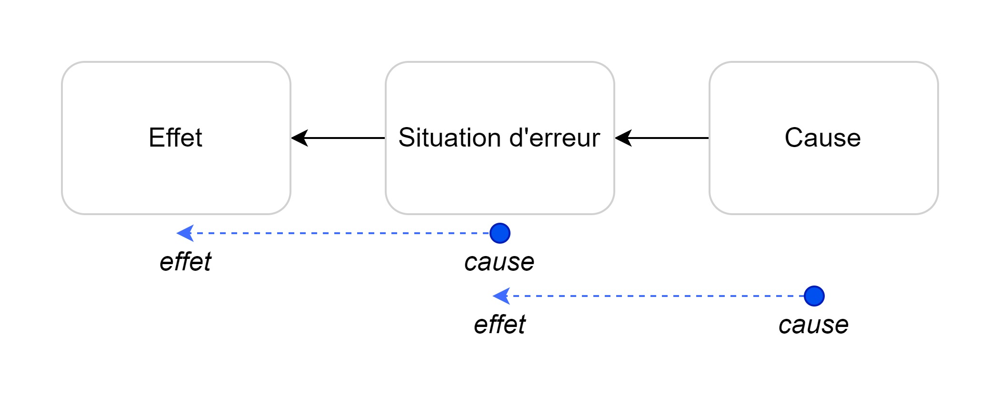

On peut ainsi établir une chaîne de causes à effets, pour mieux se représenter les conséquence d'un problème. Prenons par exemple le scénario du dysfonctionnement d'une imprimante de bureau :

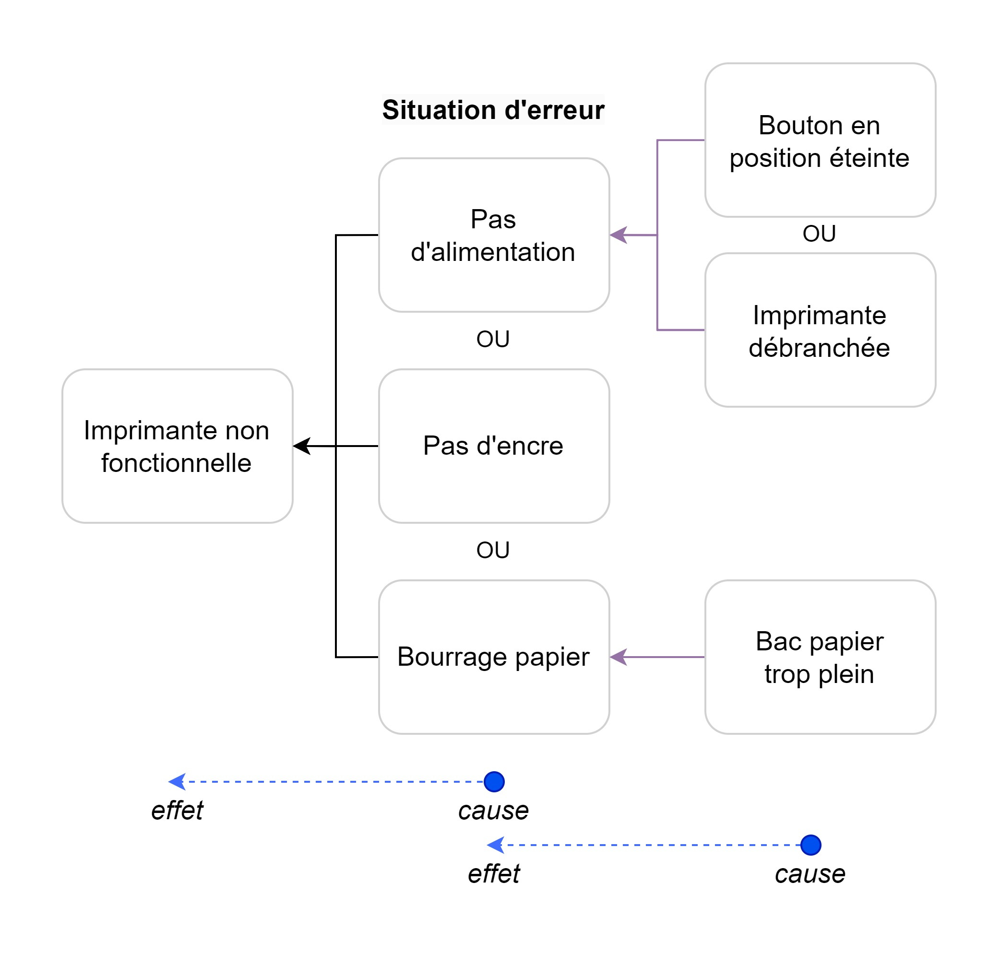

Vous pouvez faire de même avec des scénarios de dysfonctionnement d'un logiciel ou d'une infrastructure. Etablissez un tableau de 7 colonnes. Pour chaque hypothèse d'incident, l'auteur doit déterminer :

- **La situation d'erreur**
  - Ex: "La mise à jour du logiciel a échoué sur l'un des serveurs"
- Le ou **les effets**
  - Ex: "Les requêtes client atteignant ce serveur échoueront. Cela représente 20% de nos requêtes en raison de notre architecture de load-balancing."
- La **probabilité**
  - Indiquer de 1 à 10, la probabilité que l'évènement se produise.
  - Ex: "3"
- La **sévérité**
  - Indiquer de 1 à 10, la sévérité du problème au cas où l'évènement se produise.
  - Ex: "7"
- L'impossibilité de **détection**
  - Indiquer de 1 à 10, la probabilité que l'évènement ne puisse pas être détecté.
  - Ex: "1"
- Le **niveau de risque**
  - Produit de la probabilité, sévérité et détection.
  - Ex: "(3\*7\*1) = 21"
- Les **contremesures**
  - Décrire comment réagir au cas où l'évènement venait à se produire.
  - Ex: "Configurer le load-balancer pour exclure le serveur où a échoué la mise à jour. Restaurer la version du logiciel à une version antérieure. Rétablir la configuration du load-balancer dans sa version initiale."

A partir de ce tableau, priorisez les tâches de vos équipes pour qu'elles travaillent à anticiper les situations les plus critiques.

Pour la maintenance d'une infrastructure, l'une des bonnes pratiques est de créer des "fiches incident". Chacune inclut un scénario de panne, associé aux pistes à explorer pour la résoudre. Exemples typiques de pannes : manque d'espace disque, base de données mal migrée, sauvegarde mal exportée. Capitalisez-les dans votre base de connaissance (ex: GitLab, Confluence).

### Instruire sa réponse à incident

Si vous êtes une petite structure, commencez par formaliser vos procédures pour mener une RCA et par rédiger des postmortems. Ensuite, établissez progressivement des FMEA et tentez de commencer vos projets par des premortems. Enfin, réalisez périodiquement des FMEA.

Le choix d'investir du temps dans la réalisation de premortems, de FMEA ou de postmortems reste régit par vos priorités en terme de résilience. [La recherche](https://devops.com/real-cost-downtime/) démontre néanmoins que l'indisponibilité d'un service [peut coûter cher](https://www.gremlin.com/ecommerce-cost-of-downtime/) aux grandes organisations, en atteignant en moyenne 500'000 à 1'000'000 de dollars par heure d'indisponibilité[^CostDowntimeStudy].

## Réduire le coût du changement

### Ne pas disrupter

Le DevOps est souvent présenté comme un mode d'organisation disruptif, c'est à dire un changement de paradigme dans les technologies et les pratiques. Pour éviter d'intimider les parties-prenantes à votre transformation, présentez plutôt le DevOps comme une évolution des technologies traditionnelles.

Par exemple, Windows 10 (sorti en 2015) n'est qu'une [évolution de Windows NT](https://superuser.com/a/1744615/680804) 3.1 (sorti en 1993) et [comporte encore du code](https://qr.ae/prvnxD) datant des débuts de l'architecture Windows NT (conçu en 1988)[^WindowsNT].

Voici quelques parallèles concernant le Cloud :

- Un conteneur n'est qu'une petite VM plus flexible. Elle se gère avec des commandes différentes, la nomenclature n'est pas la même, mais les concepts restent identique : un OS (image) à partir duquel le conteneur est créé, un réseau configurable ou encore la possibilité d'ajouter du stockage.
- Un orchestrateur n'est qu'un hyperviseur géré avec des commandes différentes. Mais ses composantes restent identiques : politiques réseau configurable entre les conteneurs/VMs, gestion du stockage avec des _datastores_ sur VMWare en place des _PersistentVolumes_ sur Kubernetes ou encore le _NSX Controller_ sur VMWare en place du _Ingress Controller_ sur Kubernetes.
- Il existe cependant des évolutions particulières, qu'il convient seulement d'admettre (comme pour les théorèmes mathématiques) : cf. chapitre "[Un socle au service de votre résilience](#un-socle-au-service-de-votre-résilience)".
- Les micro-services ne sont qu'une division des logiciels traditionnels en plusieurs briques indépendantes. Chaque brique peut être passée à l'échelle en fonction de la charge utilisateur.

Les VMs traditionnelles ont aussi leur place dans une infrastructure Cloud DevOps, elles peuvent en faire partie (cf. chapitre "[Abandonner les VMs ?](#abandonner-les-vms-)").

A ces évolutions technologiques s'ajoutent des méthodologies pour maîtriser la dette technique, accélérer les déploiements et maintenir un niveau de résilience élevé : une forge logicielle, le gitops, l'intégration continue, le déploiement continu, les postmortems... C'est le DevOps.

En définissant les méthodologies vues dans ce livre et en utilisant des technologies dont l'administration est standardisées (ex: Kubernetes), vous diviserez à terme les coûts d'administration.

### Eviter les erreurs de conception

Comme évoqué dans le chapitre "[Être au plus proche du métier](#être-au-plus-proche-du-métier)", il est courant de ne pas répondre au besoin initialement exprimé avec les méthodes traditionnelles. Figer le besoin à l'instant T n'est pas un moyen fiable de livré le produit attendu. Le besoin évolue continuellement et le client ne sait souvent pas exprimer exactement ce dont il a besoin.

La méthodologie Agile vise à réduire ce risque en proposant plusieurs cycles courts de livraison (_sprints_). À chaque cycle, le client fournit ses retours. Cette boucle est rejouée jusqu'à ce que le projet convienne au client ou que le contrat prenne fin. Le DevOps vient outiller l'entreprise pour fluidifier les interactions. Dans les entreprises les plus performantes, les _sprints_ ne sont plus qu'un détail contractuel pour échanger sur les avancées : le logiciel, lui, est déjà en production et prêt à être utilisé.

Au contraire, cette méthodologie permet d'éviter de se faire piéger par des clients trop spécifiques dans leurs demande. Certains sont convaincus de la manière dont le logiciel devrait être conçu pour qu'il réponde le mieux à sa besoin. Or la suggestion faite n'est peut-être pas l'option la plus adaptée. Au cours de vos différentes livraisons, le client aura toujours une suggestion à faire ou un détail qu'il aura oublié de vous communiquer. Ces détails - plus ou moins grands - s'accumulent avec le temps et peuvent mener à des délais démesurés.

Si un logiciel est voué à changer en profondeur les habitudes de son récipiendaire, le livrer tôt est nécessaire pour qu'il s'acculture progressivement aux changements qui vont lui être imposés. Il pourra par exemple faire évoluer ses procédures internes, recruter les profils adaptés et préparer sa stratégie de communication. Cela évitera les frustrations et permettra de garantir un livrable au plus proche du besoin métier.

Se passer de cette approche si votre client est trop exigeant, peut mener dans des cas extrêmes à des projets perdurant des années. Voire même, à des projets abandonnés. Cela ne manquera pas d'engendrer des frustrations réciproques entre le responsable d'équipe, l'équipe de développement et le client.

### Eviter les erreurs de développement

L'humain est la première cause d'erreur. C'est pour cela que l'automatisation est un élément fondamental d'une organisation en mode DevOps. Les chaînes d'intégration et de déploiement continu sont particulièrement efficaces pour fluidifier le cycle de livraison logiciel.

Si vous ressentez actuellement une adhérence dans votre cycle de production, vous avez probablement besoin d'investir du temps pour automatiser. Dans les entreprises matures, des équipes dédiées au développement d'outils d'automatisation au profit des équipes de développement existent. Elles ont la mission d'être à l'écoute des développeurs pour fluidifier leur expérience de développement. Par exemple, elles vont développer des outils internes analysant le code ajouté pour proposer des modifications améliorant la lisibilité ou la sécurité de la contribution. Chez Google, une plateforme interne se charge de faire ce type de suggestion : si un code n'est pas conforme, un clic suffit à le reformater. Si une librairie est considérée vulnérable, une alternative est proposée.

Ces outils permettent globalement d'accélérer le processus de développement et accélèrent les revues de code pour livrer le logiciel le plus rapidement possible en production. Ces méthodes sont particulièrement efficaces quand vous recevez régulièrement de nouveaux personnels non formés à vos pratiques de développement. Des arrivants peu expérimentés, sans règles explicites et contraignantes (les chaînes de CI/CD), peuvent rapidement impacter la qualité de votre base de code. Une inattention et un bug peut rapidement survenir.

Les techniques de déploiement _blue/green_ précédemment évoquées permettent également de réduire les risques de régression logicielle (cf. chapitre "[Déploiement continu](#déploiement-continu-cd)").

### Design thinking

Les entreprises avec une forte culture SRE/DevOps favorisent les innovations proposées par leurs collaborateurs. Grâce aux techniques évoquées dans le chapitre précédent (CI, CD, _blue/green_, premortems, FMEA), il est heureusement possible de maîtriser le risque apporté par ces nouveautés.

Pour que vos employés restent motivés à faire de grandes choses, il faut éviter à tout prix de limiter leur créativité ou leurs idées. C'est pourquoi le _design thinking_ et la réalisation de prototypes sont des techniques clé pour une organisation efficace.

Le _design thinking_ est une technique d'innovation qui combine créativité et méthode pour tenter de résoudre des problèmes complexes. Elle est composée de 5 phases :

1. **Compatir** : partez rencontrer l'utilisateur final et faites immersion dans son environnement pour comprendre ses enjeux. Cela permet de mettre de côté ses pré-supposés pour déceler un point de vue authentique.
2. **Définir le problème** : définissez clairement le problème que vous essayez de résoudre. Exprimez-le du point de vue de l'utilisateur, plutôt que de décrire ce que vous souhaiteriez réaliser.
3. **Élaborez des idées** : maintenant que le problème est ciblé, vous pouvez commencer à réfléchir à des solutions.
4. **Réaliser une maquette** : faites de votre idée une réalité au travers d'un prototype. Identifiez les points faibles et trouvez des solutions, ou passer à une autre idée si celle expérimentée n'est pas viable (cf. chapitre "[Premortems](#premortems)").
5. **Évaluer** : testez votre prototype dans un environnement fidèle à celui de votre utilisateur cible (cf. chapitre "[Déploiement continu](#déploiement-continu-cd)").

En résumé, vous devez vous mettre dans la peau de l'utilisateur, et des techniques comme le déploiement continu permettent de fluidifier ce processus. En étant confrontée à la réalité, l'innovation n'est pas freinée par l'organisation.

Si elle échoue, l'organisation en aura appris davantage sur son client et son environnement. Si elle aboutit, c'est un succès pour tout le monde : l'équipe en charge de l'innovation, l'organisation et le client.

Cette culture du prototype est importante car une entreprise qui ne prototype pas lance moins d'idées, donc provoque moins de succès et prend plus de temps pour échouer. Au contraire, une entreprise ayant pris l'habitude de tester ses prototypes échouera plus vite et engrangera mécaniquement davantage de succès.

Il n'est pas obligatoire de créer le logiciel de A à Z avant de le confronter au client. Vous pouvez réaliser une maquette sur Figma ou Penpot, utiliser une solution _low-code/no-code_[^lownocode] ou trouver quelqu'un qui joue le rôle du client.

### Former de manière continue

Une bonne culture s'entretient par la connaissance des techniques à l'état de l'art. Les compétences techniques de vos équipes constituent le terreau de votre organisation et forgent leur confiance à l'égard de votre résilience.

La formation continue est un moyen simple d'éviter à votre organisation de perdre des millions d'euros chaque année. En effet, si votre personnel reste formé à l'état de l'art des technologies, ils sera moins susceptibles de se faire duper par des tiers-parties. Ces derniers arrivent souvent promettre "la solution idéale" au travers de présentations flatteuses et particulièrement ambitieuses. Des présentations qui ne manquent pas de cacher, la plupart du temps, un service non abouti ou complètement déficient. En restant à jour, vos collaborateurs prendront de meilleures décisions pour votre porte monnaie et le futur de votre organisation.

Mais garder le rythme n'est pas simple, surtout à la vitesse à laquelle les technologies évoluent. Raison de plus pour mettre en place de bonnes pratiques de formation dès l'arrivée de vos collaborateurs.

Par exemple chez Google, les stagiaires commencent par une semaine complète dédiée à la formation. Ils reçoivent des instructions sur les bonnes pratiques de sécurité, les formalités administratives qu'ils doivent remplir et sont sensibilisés aux outils techniques internes. Par la suite et comme pour tous les employés, ils devront valider périodiquement des modules de sensibilisation sur une plateforme dédiée avec des cours écrits ou vidéo.

L'_United States Air Force_ (USAF) s'est mise depuis 2019 en ordre de bataille en investissant massivement dans des solutions d'auto-apprentissage. Dans un podcast[^DevSecOpsUSAirForce], son ancien Directeur de l'Ingénierie Logicielle (_Chief Software Officer_) Nicolas CHAILLAN explique comment il a mis en place ce système pour plus de 100 000 développeurs. Une plateforme web a été déployée avec du contenu pédagogique spécialement sélectionné ou créé par ses équipes. Il ajoute qu'une heure par jour a été accordé aux collaborateurs pour "rattraper le retard et continuer d'être à jour sur les dernières technologies".

> "C'est _(la formation est)_ un investissement pour l'entreprise et pour eux-mêmes. Les gens qui ne veulent pas apprendre d'eux-même n'ont pas beaucoup de chance de réussir en informatique. De toute façon, l'industrie bouge tellement vite qu'ils n'ont pas le choix." - Nicolas CHAILLAN

À l'instar de l'USAF, la solution suivante avait bien fonctionné dans l'une de mes dernières expériences : nous avions réussi à obtenir un jour de télétravail par semaine. Le faire accepter à nos responsables n'était pas simple, mais ils ont fini par l'accorder après un temps certain à leur en faire comprendre le bien-fondé. Ce jour était dédié à notre formation continue en tant qu'expert en IA, data et DevOps. Mais nous étions outillé et nos progrès pouvaient être mesurés : un accès quasi-illimité à un service Cloud et à une plateforme de _e-learning_. Cette dernière permettait à notre hiérarchie de visualiser les statistiques sur le temps passé à se former et les cours achevés. Le coût de ces deux services était minime par rapport à toutes les connaissances qu'ils nous conféraient.

Si vous avez déjà des équipes techniques à votre main, donnez leur la possibilité d'expérimenter, de pratiquer. C'est ce que j'ai observé de plus efficace (donc rentable) pour l'organisation : investissez du temps dans la formation de votre personnel. Par exemple, donnez-leur accès à des machines ou des hébergeurs Cloud pour expérimenter les dernières innovations du privé ou issues de l'open-source. Vos équipes seront ravies d'avoir accès à ces services, pendant que la direction sera assurée d'être conseillée au mieux, grâce à des collaborateurs à jour.

Il peut être tentant de penser que former un personnel sur une technologie innovante - c'est à dire le rendre attirant auprès de la concurrence - peut l'inciter à changer d'entreprise. Premièrement, partir simplement parce-que l'on acquiert une nouvelle compétence dénote un manque de perspectives au sein de son entreprise. Cela révèle un personnel déjà peu motivé, donc peu productif. Secondement, la recherche indique qu'un personnel se formant sur son temps libre a plus fréquemment tendance à rechercher un autre travail[^TrainingTurnover]. C'est l'inverse quand l'entreprise se charge de le former.

Dans tous les cas, présentez votre transformation comme une opportunité d'évolution de carrière. Et soyez honnête avec les personnes qui devront monter en compétence : oui cela demandera des efforts personnels et du temps. Mais développer ces nouvelles expertises en vaut la chandelle.

## Tirer parti de l'automatisation

Au sein de systèmes d'informations de plus en plus complexes, il devient fondamental d'automatiser les tâches récurrentes. L'humain représente le facteur principal d'erreurs au sein d'un système d'information[^HumanErrorIS]. Tout ingénieur confirmé pourra vous le confirmer. C'est pour cela que les équipes de Google tentent de minimiser au maximum les interactions de leurs opérateurs pour administrer leurs systèmes[^GoogleWorkbookEliminatingToil].

> "Si un opérateur humain doit toucher votre système durant le fonctionnement normal du quotidien, vous avez un bug. La définition du terme "normal" change au fur et à mesure que vos systèmes se développent." - Carla GEISSER, SRE chez Google

Si vous souhaitez faire de votre système informatique un outil intégré au sein de votre entreprise, vous devez d'abord automatiser les actions répétitives et coûteuses en temps : les actions manuelles (ou _toil_ en anglais).

Cette notion de pénibilité qualifie toutes les tâches manuelles, répétitives et automatisables. Globalement, il s'agit de toutes les tâches peu intéressantes intellectuellement qu'un rebot serait bien plus à même de faire que vos brillants ingénieurs.

Les équipes SRE de Google ont pour objectif de maintenir le travail opérationnel (tâches d'administration manuelles) en dessous de 50% du temps pour chaque SRE. Au moins 50% du temps de chaque SRE doit être consacré à des projets d'ingénierie qui permettront de réduire la quantité future de tâches manuelles ou d'ajouter des fonctionnalités à l'infrastructure.

Ce travail peut commencer par de petites choses au sein de votre infrastructure existante. Nous allons dans ce chapitre les lister selon plusieurs niveaux de maturité organisationnelle. Il vous convient de déterminer quel niveau d'automatisation est le plus acceptable pour votre organisation, selon le niveau d'acculturation technologique de vos équipes d'ingénieurs et le temps que vous voulez accorder à la mise en place de ces technologies.

Gardez cet élément en tête : automatiser est l'action qui permet de réduire la dette technique. Veillez à allouer assez de temps à vos équipes pour qu'elles travaillent dessus.

### Infrastructure as Code (IaC)

Ce terme populaire est simple à appréhender : il regroupe les pratiques et les technologies permettant de rendre la configuration de votre infrastructure explicite, sous forme de code informatique.

Voici quelques exemples de configuration :

- Définir le nouveau serveur de temps de toutes vos machines
- Mettre à jour un logiciel en production (cf. : chapitre [déploiement continu](#déploiement-continu-cd))
- Mettre à jour le fond d'écran de toutes vos machines
- Ajouter un nouveau nom de domaine

Bien entendu, quand j'évoque « toutes vous machines », les scripts d'IaC permettent de définir quelles sont exactement ces machines de telle sorte à n'appliquer les modifications que sur tel ou tel groupe de machines.

Cette pratique comporte plusieurs avantages :

- **Documentation** : les scripts d'IaC sont écrits dans des langages de programmation ou à l'aide de fichiers de configuration standardisés. L'ingénieur consultant le projet peut directement voire comment se comporte la configuration et comment il peut l'utiliser ou la modifier.
- **Fiabilité** : les scripts d'IaC peuvent être lancés par des machines ou des humains, selon l'environnement souhaité (développement, staging, production) en suivant des règles algorithmiques. Il n'y a rien de plus fiable qu'un code exécuté par une machine plutôt qu'un humain. Il est également possible d'appliquer un contrôle de sécurité selon l'utilisateur qui lance ces scripts.
- **Rejeux** : tout script d'IaC se doit d'être idempotent, c'est-à-dire que lancer un ou plusieurs fois le même script doit produire le même effet sur l'infrastructure. Il est donc plus rapide de développer et modifier ce genre de scripts vis-à-vis de scripts traditionnels.
- **Versionnage** : les scripts d'IaC – comme tout autre algorithme – peuvent être versionnés. Cela permet de traquer leurs modifications au cours du temps et d'être critiqués par l'ensemble des équipes techniques au cours du temps.

Des exemples courants de technologies permettant de réaliser ces actions sont : Ansible, Terraform, Puppet ou encore SaltStack.

Chacun a ses avantages, ses inconvénients, sa communauté. D'autres sont complémentaires. Le tout est d'adopter un format standardisé (pas forcément en n'utilisant qu'une seule technologie) pour que vos équipes SRE s'y retrouvent. Un nouvel arrivant sera grandement aidé par ces pratiques et vos ingénieurs les plus confirmés pourront améliorer incrémentalement ces algorithmes.

Vous pouvez tout d'abord commencer à automatiser vos infrastructures à l'aide de scripts classiques (bash, Powershell) puis passer sur une technologie plus avancée comme Ansible qui standardisera vos configurations.

Reportez-vous au [projet GitHub « ToDevOps »](https://github.com/flavienbwk/ToDevOps#2-deploying-infrastructure-services) [^ToDevOps] pour voir cette technologie en pratique.

Pour superviser et automatiser ces tâches d'administration, des outils avancés comme _Ansible AWX_, _Ansible Tower_, _RedHat Satellite_, _Alcali_, _Uyuni_ ou _Palantir Apollo_ peuvent être intéressants à considérer, si la maturité de votre organisation vous le permet.

![Interface affichant les tâches Ansible lancées dans Ansible Tower. Extrait de l'article de Stuart CUNLIFFE[^Ansible101] sur le blog d'IBM.](./images/2020_ansible_tower_interface.png)

Gardez en tête que maintenir une infrastructure est une tâche complexe, donc _keep it simple_ ! N'allez pas adopter la dernière technologie du moment seulement parce-qu'elle est "sexy" : plus vous ajoutez des technologies et des niveaux d'abstraction, plus votre équipe doit être fournie et expérimentée pour la maintenir et la réparer (cf. chapitre "[Too big, too soon](#too-big-too-soon)").

### Développement piloté par tests

Le développement piloté par tests (ou _test-driven development_ (TDD) en anglais) est une pratique de développement logiciel qui remonte [au début des années 2000](https://en.wikipedia.org/wiki/Test-driven_development). L'objectif est de maîtriser l'érosion d'un logiciel[^SoftwareErosion]. C'est à dire éviter la régression du logiciel et maîtriser sa dette technique au cours du temps. Ou dit plus simplement : éviter les bugs à mesure que les contributions s'accumulent.

L'idée est de coder les tests avant de développer sa fonctionnalité. Le cycle de développement en TDD est le suivant[^BeckKentTDDBook] :

1. Ajouter un test : l'ajout d'une nouvelle fonctionnalité commence par l'écriture d'un test qui passe si et seulement si les spécifications de la fonctionnalité sont respectées.
    - Ma recommandation personnelle : écrivez au moins un test qui passe et un test qui n'est pas censé passer. Cela permet de comprendre les limites du cas d'usage qu'un test doit couvrir.
2. Lancer tous les tests du logiciel : votre nouveau test doit échouer à cette étape, puisque la fonction qui y répond n'a pas encore été écrite.
3. Développer une première version de la fonction : inélégante ou _hard-codée_, l'idée est d'avoir une fonction qui répond au test le plus simplement possible. Il sera amélioré en étape 5.
4. Lancer tous les tests du logiciel : tous les tests, incluant le votre, doivent passer à cette étape.
5. Réadapter le code si besoin, en utilisant des tests après chaque développement, pour s'assurer que la fonctionnalité est préservée : maintenant que vous êtes sûr que le code initial (étape 3) répond au besoin, vous pouvez l'améliorer (ex: découper la fonction, supprimer le code duppliqué, améliorer le nommage).

C'est une pratique courante dans les entreprises de la technologies, en particulier chez les GAFAM. Ces derniers se basent dessus pour maîtriser la dette technique, malgré les milliers de développeurs qui contribuent en parallèle et chaque jour à leurs logiciels. La plupart du temps, les logiciels sont développés sans ou avec peu de tests. Il peut être compliqué de justifier à une hiérarchie non-technique le temps passé à développer des tests, plutôt que de se concentrer sur une nouvelle fonctionnalité. Travailler en TDD impacte en effet la productivité, mais améliore significativement la qualité du code[^TDDStudy].

Pour un logiciel historique, il est recommandé d'au moins adopter l'approche TLD (_test-last developement_). C'est à dire développer les tests après que la fonctionnalité soit créée. Puis de progressivement passer au TDD pour améliorer la qualité et réduire la complexité du code[^TDDoverTLD]. Pour les nouveaux projets, privilégiez le TDD.

Dans tous les cas, l'idée est de tester son code pour éviter les mauvaises surprises en production. Selon _Atlassian_[^WhatIsCodeCoverage], il est recommandé de couvrir 80% de son code par des tests (_code coverage_ en anglais).

Le TDD est recommandé dans certains cas, mais pas tous. Par exemple, si votre secteur d'activité est réglementé - comme celui des banques ou de la santé - il est impératif de tester votre code. La conséquence du dysfonctionnement de votre logiciel peut impacter la responsabilité juridique de votre organisation. Si votre logiciel est destiné à être utilisé et maintenu de nombreuses années - comme dans la défense - il est recommandé d'adopter le TDD. En revanche, si vous êtes une start-up en étape de preuve de concept, le dysfonctionnement d'un logiciel peut avoir moins de conséquence et vous pouvez vous permettre de privilégier votre productivité. Plus votre structure grandit, plus le nombre de développeurs qui contribuent à votre logiciel augmente, plus il devient nécessaire de tester votre code. Par exemple, pour un nouveau contributeur, un test permet d'avoir un exemple de la manière dont une fonction est utilisée, ce qui facilite la compréhension du code.

En somme, il s'agit de trouver l'équilibre entre productivité, garantie de bon fonctionnement et contrôle de la dette technique.

Ce chapitre n'est qu'une introduction pour vous présenter l'intérêt de tester votre code. Il existe de nombreuses approches complémentaires et des bonnes pratiques de développement qui concernent davantage l'ingénierie logicielle (cf. [YAGNI, KISS, DRY](https://henriquesd.medium.com/dry-kiss-yagni-principles-1ce09d9c601f)) et moins spécifiquement le DevOps. Par exemple, le TDD peut être suppléé par le BDD (_behavior-driven development_) ou l'ATTD (_acceptance test-driven development_)[^TDDBDDATTDComparativeStudy] si la maturité de votre structure et la taille de vos équipes peuvent le permettre.

L'ensemble de ces tests est vérifiable automatiquement avant toute mise en production. Découvrons ce que cela signifie et comment le mettre en pratique dans le chapitre suivant.

### Intégration Continue (CI)

L'intégration continue (_continuous integration_ ou _CI_ en anglais) est une pratique de développement au sein de l'usine logicielle. L'idée est la suivante : à chaque modification du code, des scripts automatisés se lancent pour vérifier la conformité de la contribution. Cette conformité peut être d'ordre SSI, vérifier la qualité logicielle ou contrôler les pré-requis pour la mise en production.

Par exemple, vos équipes SSI n'ont probablement pas le temps de vérifier la conformité de chaque contribution. Elles peuvent alors déléguer une partie de ces vérifications àd de scripts, qui vérifieront automatiquement et systématiquement que la base de code respecte vos standards de sécurité. L'avantage est triple :

- Vos ingénieurs SSI peuvent travailler sur des tâches à plus haute valeur ajoutée
- La conformité de vos règles SSI n'est plus "édictée" mais garantie par des vérifications "codées"
- Vos développeurs voient directement si leur code est conforme et peuvent immédiatement le modifier s'il ne l'est pas

](./images/ci-pipeline-gitlab.png)

Ainsi, en mode DevOps, les responsables SSI ne sont plus des personne édictant des règles au format papier, mais [des ingénieurs "codant" des règles SSI](#ingénieur-ssi-devops) sous forme de scripts automatisés, dans la forge logicielle. Cela garantie le respect de ces règles par les développeurs et la production.

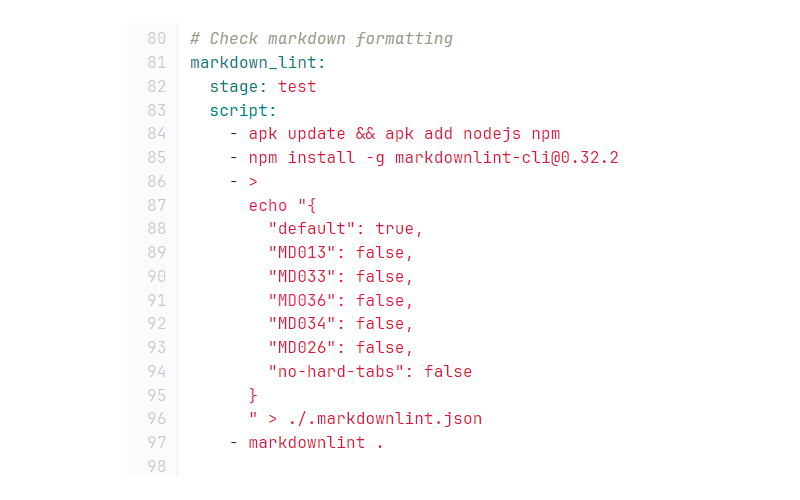

Voici quelques exemples d'algorithmes qu'il est possible de lancer pour vérifier automatiquement des règles ou prendre des actions lors d'un évènement déclencheur :

- S'assurer de la présence d'une documentation
- S'assurer que la documentation suit le formatage définit par l'organisation
- S'assurer que la documentation est à jour
- Vérifier que toutes les variables d'environnement sont bien déclarées dans les fichiers appropriés
- S'assurer que des mots de passe n'ont pas été ajoutés par erreur
- S'assurer de la présence d'un fichier de configuration requis
- S'assurer que le code respecte les standards de développement et de formatage (ex: PEP8, black, pylint)

Toutes ces tâches contribuent en la réduction de la dette technique de votre base de code et facilite le déploiement de vos projets, en garantissant l'effectivité des standards définis par vos équipes DevOps.

Il est courant d'entendre parler de _pipeline_ d'intégration continue (en français "chaîne d'intégration continue"), qui accompagne d'autres termes dans l'univers des technologies de CI/CD. Définissons les plus courants :

- **Job** : une tâche/script lancée automatiquement lors de l'évènement déclencheur
- **Pipeline** : enchaînement de _jobs_
- **Stages** : les trois étapes d'une chaîne (_pipeline_) d'intégration continue (_build_, _test_, _deploy_)
- **Build** : étape contenant les _jobs_ s'assurant que le code compile correctement, que l'image Docker se construit correctement avec les éléments présents dans le répertoire
- **Test** : jobs de vérification de la conformité du code / de la contribution
  - Exemples :
    - Vérifier que le code est maintenable : grâce à des outils comme [_SonarQube_](https://www.sonarsource.com/products/sonarqube) ou des _linters_[^linter] comme [_black_](https://github.com/psf/black) pour Python ou [_KubeLinter_](https://github.com/stackrox/kube-linter) pour les configurations Kubernetes (cf. [OpenSSF Best Practices](https://bestpractices.coreinfrastructure.org/en/criteria/0)).
    - Vérifier que la contribution n'introduit pas de faille de sécurité : avec des logiciels comme _Quay Clair_, _Jfrog X-Ray_, _ClamAV_ ou les _Scorecards_ de la OpenSSF.
    - Vérifier que le code respecte les tests unitaires (cf. chapitre ["Développement piloté par tests"](#développement-piloté-par-tests)).
    - Vérifier la conformité de la documentation : Au cours de l'évolution d'un logiciel dans le temps, les extraits de code dans les documentations peuvent devenir obsolètes et ne plus fonctionner. _Istio_ a développé un outil[^IstioTestDocumentationTool] permettant de s'assurer automatiquement que ces extraits de code soient à jour. Il extrait ces derniers à partir des fichiers _Markdown_ de la documentation et les convertit en exécutables à tester.
    - Vérifier la composition d'un conteneur Docker.
- **Deploy** : jobs prenant des actions affectant l'infrastructure, la production (cf. chapitre "[Déploiement Continu](#déploiement-continu-cd)").
  - Exemples :
    - Déployer la mise à jour d'un logiciel.
    - Ajouter une dépendance de développement conforme.
    - Effectuer des actions d'administration.

Comme cité plus haut, l'intérêt d'une pipeline d'intégration continue est également de tester le code poussé sur plusieurs environnements automatiquement : votre environnement de développement et de préproduction avant de le déployer en production. Néanmoins, ces pipelines multi-environnement introduisent une complexité supplémentaire qu'il faut être en mesure d'absorber lors de sa mise en place, par une équipe technique plus importante.

Au sein d'une usine logicielle, ce sont des technologies telles que les _GitLab Runners_, les _GitHub Actions_ ou les services de [_Circle CI_](https://circleci.com) qui permettent de lancer des tâches d'intégration continue.

### Déploiement Continu (CD)

Le déploiement continu (_continuous deployment_ ou _CD_ en anglais) est une pratique DevOps permettant de déclencher des actions d'administration ou de déployer et mettre à jour des logiciels en production. Le déclenchement n'est pas nécessairement automatisé mais les actions appliquées sont codées. C'est à dire prévisibles, traçables et réplicables. Cela réduit le temps de mise à disposition d'une nouvelle fonctionnalité à ses utilisateurs, en minimisant l'intervention manuelle et le risque d'erreur par les administrateurs.

Cette pratique se conjugue au principe de "livraison continue" (_continuous delivery_ en anglais), qui réunit des étapes préliminaires au déploiement. Par exemple, publier les binaires ou les images de la dernière version du logiciel, ou créer la dernière _release_ du projet dans l'usine logicielle.

La plupart du temps, les chaînes de déploiement continu sont techniquement similaires aux chaînes d'integration continue. Par exemple, elles vont rejouer les tâches des chaînes d'intégration continue avant de déployer le logiciel. En revanche, elles peuvent nécessiter des paramètres plus spécifiques, tels que des variables d'environnement ou des secrets (cf. _Hashicorp Vault_, _Akeyless_, _Keywhiz_, _Conjur_). En effet, un logiciel déployé repose communément sur des variables d'environnement pour s'exécuter correctement sur une infrastructure cible.

Il est habituel de retrouver des environnements de qualification/pré-production (_staging_) et de production différents. Ces derniers permettent de valider le bon fonctionnement d'un logiciel avant sa mise en production. Les chaînes de déploiement continu automatisent tout ou partie de ce processus, en ajoutant si souhaité des _smoke tests_ ou des tests fonctionnels (cf. chapitre "[Développement piloté par tests](#développement-piloté-par-tests)").

Dans un premier temps, il s'agit d'au moins automatiser la mise à jour de votre logiciel en production. Vous pouvez le faire de la même manière qu'avec les chaînes d'intégration continue, grâce aux _GitLab Runners_ ou aux _GitHub Actions_.

D'autres pratiques existent pour des utilisateurs plus avancés. Comme nous avons pu l'évoquer dans le chapitre "[GitOps](#gitops)", notre répertoire _git_ est la "source unique de vérité" d'un logiciel. Par conséquent, l'infrastructure doit idéalement se baser dessus pour définir l'état attendu d'un logiciel en production. Par exemple, l'outil _ArgoCD_ va vérifier en permanence la présence de modifications dans un répertoire _git_, sur une branche spécifique (souvent _main_ ou _master_). Dès qu'ArgoCD détecte un changement, il tente de déployer la toute dernière version du logiciel surveillé.

Les outils comme _ArgoCD_, _Flux_, _Spinnaker_ ou _Jenkins X_ permettent de suivre visuellement l'état du déploiement d'un logiciel. Ils révèlent tout leur potentiel dans un environnement Cloud, en pouvant observer l'état de chaque micro-service.


Basé sur la même mécanique, il est possible de déployer simultanément plusieurs instances d'un logiciel. Par exemple lors d'une revue de code dans une _merge request_, vous pouvez [configurer _ArgoCD_](https://www.youtube.com/watch?v=cpAaI8p4R60) pour qu'il déploie temporairement et de manière isolée cette version "en évaluation" du logiciel. Cette technique permet aux ingénieurs de rapidement tester un logiciel, au lieu de le déployer par leurs propres moyens. Les URLs ont souvent cette forme : `wxyz.staging.monapp.com`.

Avec ces mêmes outils, vous pouvez [adopter une stratégie de déploiement blue/green et l'automatiser](https://dev.to/stack-labs/canary-deployment-with-argo-cd-and-istio-406d). Cette technique fait basculer progressivement les clients vers la nouvelle version d'un logiciel, en s'assurant que cette dernière fonctionne correctement. L'idée est d'instancier la nouvelle version du logiciel (green), en parallèle avec l'actuelle (blue). Le système dirige alors une proportion limitée de clients vers le nouveau logiciel (ex: 10%). On augmente progressivement cette proportion au cours d'une période définie, tout en mesurant le taux d'erreurs obtenu pour chaque requête. Si le taux est identique ou inférieur au précédent déploiement, on laisse le logiciel se déployer pour l'ensemble des clients. Sinon, le déploiement est annulé et on laisse l'ancienne version en production.

Des outils encore plus avancés existent pour adresser les enjeux du déploiement à très grande échelle. Nous découvrirons l'exemple de Palantir et son produit Apollo dans le chapitre "[Déployer en parallèle dans des environnements différents](#déployer-en-parallèle-dans-des-environnements-différents)".

Par ailleurs, les chaînes de déploiement continu ne se limitent pas au déploiement du logiciel ou au lancement de tâches d'administration. Elles peuvent constituer un point de départ pour la supervision de votre logiciel. Par exemple, une chaîne de déploiement continu peut configurer une instance _Prometheus / Grafana_ et commencer à envoyer ses journaux d'activité. Le déploiement de votre logiciel ne signe pas la fin du cycle de résilience de votre infrastructure : vous devez maintenant le superviser. Nous découvrirons ces techniques dans le chapitre "[Tout mesurer](#tout-mesurer)".

## Tout mesurer

Dans le chapitre précédent - "[Tirer parti de l'automatisation](#tirer-parti-de-lautomatisation)" - nous avons vu en quoi l'automatisation permettait de gagner un temps considérable dans l'administration de notre infrastructure, ainsi que d'augmenter sa sécurité et sa résilience.

Dans ce chapitre, nous allons aborder une dimension importante de l'automatisation : l'observabilité. C'est grâce aux mesures qu'il est possible de massivement automatiser les systèmes et prendre de meilleures décisions à l'échelle de l'organisation. Le fait de tout mesurer permet trois choses :

1. Les équipes techniques et commerciales peuvent en tout temps connaître l'état d'un service (opérationnel, partiellement accessible, en panne)
2. Les équipes techniques peuvent analyser des données pour identifier le problème et tenter de le résoudre (cf. chapitre "[Organiser sa réponse à incident](#organiser-sa-réponse-à-incident)")
3. Les équipes techniques, fortes de ces données, peuvent aider les équipes commerciales à prendre de meilleures décisions pour l'organisation

Avoir confiance dans ses décisions, en se basant sur ses propres données, est l'aboutissement d'une transformation DevOps réussie. L'industrie nomme cela les "prises de décision basées sur la donnée" ou "_data-driven decision making_" en anglais.

### Les 3 pilliers de l'observabilité

Les journaux d'activité (_logs_), les métriques (_metrics_) et les traces (_traces_) sont considérés comme les trois pilliers de l'observabilité. Ces trois type de données peuvent être générés par les logiciels, pour identifier et résoudre les problèmes susceptibles de survenir une fois déployés.

L'observabilité est un sujet très vaste dans le domaine de la résilience des systèmes[^DistributedSystemsObservabilityBook]. Nous ne survolerons que les essentiels dans ce chapitre.

Le domaine de l'observabilité peut être résumé comme l'ensemble des outils et des pratiques permettant aux ingénieurs de détecter, diagnostiquer et résoudre les problèmes d'un système (bugs, lenteurs, disponibilité), le plus rapidement possible. Au delà du besoin de résilience, la récolte de certaines de ces données est parfoise requise par la loi[^ANSSIGuideJournalisation].

Examinons de plus près ce que chacune de ces données peut nous apprendre :

- _logs_ : enregistrements immutables et horodatés décrivant des évènements spécifiques au cours du temps. Par exemple, "_[MonLogiciel] jdupont a eu accès à l'URL /users/login à 18h55m14s_". Le code produisant une ligne de _logs_ est généralement ajouté manuellement par un développeur dans un logiciel.
- _metrics_ : représentations numériques de phénomènes mesurés au cours du temps. Par exemple, le nombre de requêtes, le temps de réponse ou l'utilisation de ressources (RAM, CPU, disque, réseau).
- _traces_ : type de _logs_ permettant de suivre le cheminement d'une opération (ex: une requête). Une trace est un groupe de _logs_ qui comporte des informations supplémentaires permettant de tracer une opération, au travers des différents services par lesquels elle passe. Chaque étape et sous-opération traversée est nommée travée (_span_). Les _logs_ d'une trace sont généralement générés automatiquement.

Attardons-nous sur les traces pour bien comprendre ce qu'elles impliquent. Prenons l'exemple d'une application (un client) qui envoit une requête à une API REST (un serveur). Une trace est composée de _spans_ et de métriques, associées à un identifiant unique. Cet identifiant permet de discriminer le cheminement de notre requête au travers de tous les services qu'elle traversera. Voici un exemple :

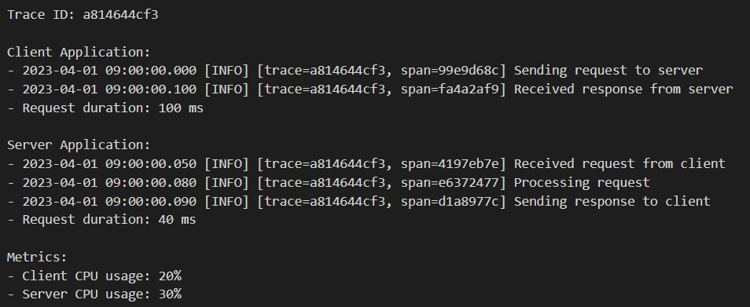

<!--
```txt
Trace ID: a814644cf3

Client Application:
- 2023-04-01 09:00:00.000 [INFO] [trace=a814644cf3, span=99e9d68c] Sending request to server
- 2023-04-01 09:00:00.100 [INFO] [trace=a814644cf3, span=fa4a2af9] Received response from server
- Request duration: 100 ms

Server Application:
- 2023-04-01 09:00:00.050 [INFO] [trace=a814644cf3, span=4197eb7e] Received request from client
- 2023-04-01 09:00:00.080 [INFO] [trace=a814644cf3, span=e6372477] Processing request
- 2023-04-01 09:00:00.090 [INFO] [trace=a814644cf3, span=d1a8977c] Sending response to client
- Request duration: 40 ms

Metrics:
- Client CPU usage: 20%
- Server CPU usage: 30%
```
-->

Pour mieux se représenter la temporalité de la requête, les _logs_ d'une _trace_ sont souvent affichés sous forme de diagramme. Chaque _span_ est alors représentée par un rectangle incluant un nom (à gauche) et une durée (au niveau du rectangle) :


Les traces sont indépendamment remontées par des librairies comme le SDK d'OpenTelemetry. Ces dernières les envoit à un collecteur de traces comme Jaeger, Tempo ou Zipkin pour qu'elles soient validées, nettoyées et/ou enrichies. Elles sont ensuite stockées dans des serveurs de logs centralisés, comme Prometheus ou Elasticsearch. L'identifiant de la trace nous permet de retrouver la chronologie des opérations par lesquelles elle est passé.

Le plus grand défi du traçage est son intégration au sein d'une infrastructure existante. En effet, pour que les traces soient pleinement utiles, il faut que chaque composant par lequel passe la requête émette un log et propage les informations de traçage à son tour. Moins précis que s'il était directement intégré à un logiciel, le traçage via _service mesh_ peut être un moyen rapide de disposer des fonctionnalités de traçage sans avoir à modifier le code de ses logiciels[^ServiceMeshTraces]. Nous verrons ce qu'est un _service mesh_ et comment cette technologie fonctionnent dans le chapitre "[Service mesh](#service-mesh)".

Au sein de très grandes infrastructures, les logs et les traces sont parfois trop massives pour être ingérées par son serveur de logs à temps. Des données peuvent alors être perdues. Pour éviter ce problème, il est courant d'utiliser des services qui viennent temporiser l'indexation. Un serveur comme Kafka peut être placé devant le serveur de logs pour les absorber progressivement. Puis un programme comme le [_Jaeger Ingester_](https://www.jaegertracing.io/docs/1.42/architecture/#ingester) vient progressivement les indexer. Pour les logs _rsyslog_, l'utilisation de protocoles comme le RELP[^RELP] peut être nécessaire pour s'assurer qu'ils soient bien sauvegardés.

Que ce soit à l'aide de [Logstash](https://www.elastic.co/logstash/) ou [Loki](https://grafana.com/oss/loki/) pour les logs, ou avec [Jaeger](https://www.jaegertracing.io/) ou [Tempo](https://grafana.com/oss/tempo) pour les traces, normaliser ses données est capital pour pouvoir correctement les stocker et les traiter. Pour répondre à cet enjeu, la [librairie OpenTelemetry](https://opentelemetry.io/docs/concepts/what-is-opentelemetry/) définit des conventions sémantiques[^OTSemanticConventions]. Elle est celle qui est utilisée la plupart du temps.

En mettant en place des mécanismes d'observabilité, vous pourrez répondre plus facilement à la question "_qu'est-ce qu'il s'est passé pour que ce bug se produise ?_". Vos ingénieurs pourront se baser sur des données exhaustives pour corriger les bugs plus rapidement. Ces données vont nous permettre de mieux construire nos [indicateurs de résilience](#indicateurs-de-résilience), pour prendre plus rapidement des décisions avisées.

### Savoir quand innover et quand s'arrêter

A première vue, il n'est pas évident de savoir où mettre le curseur entre les travaux de résilience et d'innovation. L'idée est donc de mesurer l'état des services pour savoir quand on s'autorise à innover.

Mesurer est une chose, mais encore faut-il mesurer les bonnes choses, au bon niveau. Dans une infrastructure distribuée, l'un des serveurs peut tomber en panne sans nécessairement impacter la disponibilité d'un logiciel pour vos clients. Mesurer la disponibilité d'un serveur est peut-être intéressant pour vos techniciens, mais peut-être n'est-elle pas la bonne mesure pour connaître l'impact du dysfonctionnement sur l'utilisateur. C'est cela que votre organisation doit définir :

- Quelles sont les mesures indiquant un service qui fonctionne "correctement" ?
- Quel taux d'indisponibilité vous accordez-vous ?

Pour la deuxième question, vous ne pouvez pas répondre "100%". Si vous mettez tous vos efforts à rendre le service disponible 100% du temps, vous allez ralentir le lancement de nouvelles fonctionnalités. Or c'est cela qui fait avancer votre projet. C'est pour répondre à cette question qu'intervient la notion de "budget d'erreur".

Le budget d'erreur est la quantité de temps sur une période donnée que votre entreprise accorde à vos équipes, durant lequel vos services peuvent être indisponibles. Tant que la disponibilité de votre service dépasse l'indisponibilité tolérée, vous pouvez en profiter pour déployer un nouveau service majeur, en forte interaction avec les autres, ou encore mettre à jour un système critique. Mais ce budget est essentiel pour faire face à des dysfonctionnements matériels nécessitant un remplacement, ou pour intervenir sur un système lors d'une interruption planifiée.

Par exemple, si votre budget d'erreur est de 54 minutes par semaine et que vous ne dépassez pas 10 minutes depuis 3 semaines, permettez-vous de prendre davantage de risques. Si c'est l'inverse, travaillez à rendre votre infrastructure plus résiliente.

En somme, le budget d'erreur est un accord entre la direction et les équipes techniques, aidant à prioriser les travaux d'innovation vis-à-vis des travaux améliorant la résilience de l'infrastructure.

Il permet aux équipes d'ingénierie de réévaluer par elles-mêmes des objectifs trop ambitieux vis-à-vis du risque toléré. Elles peuvent ainsi définir des objectifs réalistes. Le budget d'erreur permet aux équipes de partager entre elles la responsabilité de la résilience d'un service : les défaillances de l'infrastructure impactent le budget d'erreur des développeurs. Inversement, les défaillances logicielles impactent le budget d'erreur des équipes SRE.

Faites attention à vos pics de consommation de budget d'erreur : si un ingénieur passe dix heures au lieu d'une pour corriger un incident, il lui est recommandé d'ouvrir un ticket auprès de quelqu'un de plus expérimenté. Il évitera ainsi de consommer tout le budget d'erreur.

Pour répondre à la première question, voyons quels sont les indicateurs qu'il est possible de suivre dans le prochain chapitre.

### Indicateurs de résilience

#### Les 4 signaux clé

La surveillance de systèmes distribués représente un véritable dilemme. Les équipes SRE doivent réussir à les surveiller facilement - pour permettre d'intervenir rapidement - alors que leur architecture est souvent complexe. De fait, nombreuses sont les technologies qui composent ces systèmes. Les 4 signaux clé apportent un moyen unifié de caractériser les phénomènes les plus importants à surveiller.

Découvrons les 4 grandeurs qui nous permettrons ensuite de créer nos propres indicateurs de résilience :

1. La latence : temps que prend le système à répondre à une requête.
    - Il est important de différencier les requêtes ayant abouti avec succès de celles qui ne le sont pas. Par exemple, si vos systèmes retournent rapidement des erreurs serveur (ex: code HTTP 500), cela ne veut pas dire que votre système est en bonne santé pour autant. Il faut donc filtrer vos mesures de latence en excluant les requêtes ayant abouti à une erreur.
2. Le trafic : la quantité de requêtes affluant vers un système.
    - Généralement exprimé en requêtes par seconde, ou en MB/s dans le cas de flux de données.
3. Les erreurs : le taux de requêtes qui échouent.
    - Les requêtes peuvent échouer "explicitement" ou "implicitement". Les erreurs explicites sont celles qui peuvent par exemple retourner un code HTTP 500. Les erreurs implicites sont celles qui peuvent retourner un code HTTP 200 mais dont le contenu n'est pas celui attendu.
4. La saturation : à quel point les ressources de votre système sont consommées.
    - Taux d'utilisation des ressources par rapport à la charge maximale que votre système est en mesure de traiter. Elle permet de répondre à des questions du type "_Mon serveur est-il capable de traiter les requêtes clientes si l'affluence double ?_" ou bien "_Quand est-ce que mon disque-dur est susceptible d'être plein ?_". Elle se base sur des mesures d'utilisation de la RAM, du CPU, du réseau ou encore de l'I/O.

Ces quatre mesures sont déjà un bon point de départ pour la surveillance de votre infrastructure. Ce sont les mesures principales qui vous permettront de définir vos SLIs, SLOs et SLAs.

Au sein d'une infrastructure Cloud, un _service mesh_ automatise l'acquisition de ces mesures. Nous découvrirons cette technologie dans le chapitre "[Service mesh](#service-mesh)". Nous verrons également quels outils existent pour récolter et visualiser ces métriques. Mais avant cela, découvrons comment créer nos indicateurs de résilience dans le prochain chapitre.

#### SLI, SLO et SLA

La valeur de votre budget d'erreur découle de vos "objectifs de qualité de service" (_Service Level Objective_ ou SLO en anglais).

Un SLO qualifie un objectif cible de résilience pour un système. Il est représenté comme une proportion de "bons" évènements à honorer, sur l'ensemble des évènements surveillés, pour une période de temps donnée. Par exemple, votre équipe SRE peut définir l'objectif suivant : "_99% des pages doivent charger en moins de 200ms sur 28 jours_".

L'objectif "juste" d'un SLO est déterminé par le seuil de tolérance que peut supporter votre client face à un phénomène irritant. Par exemple, quantifiez ce que signifie pour lui avoir un site web "lent" (ex: grâce une étude SEO[^SEO]). Si vos clients quittent généralement vos pages après plus de 200ms d'attente, définissez votre SLO par "_99.9% des réponses doivent être retournées en moins de 200ms, sur 1 mois_".

Un bon SLO doit toujours avoir une valeur proche de 100% sans jamais l'atteindre ; nous en avons évoqué les raisons dans le chapitre "[Savoir quand innover et quand s'arrêter](#savoir-quand-innover-et-quand-sarrêter)". Quant à la fréquence à laquelle atteindre cet objectif (99.9% sur 1 mois), il n'existe pas de règle pour la définir initialement. Vous pouvez vous baser sur une moyenne de votre historique de mesures, ou expérimenter. Cette valeur doit être adaptée à la charge de travail que votre équipe est capable d'absorber.

Les SLOs se construisent à partir d'un ou plusieurs "indicateurs de niveau de service" (_Service Level Indicator_ ou SLI). Le SLI est le taux actuel de bons évènements mesurés, sur l'ensemble des évènements pris en compte, pour une période donnée. Se basant lui-même sur une ou plusieurs mesures, il permet de mesurer l'un des aspects de la résilience d'un système. Il qualifie un phénomène pouvant impacter négativement votre utilisateur : le temps de réponse à une requête, le nombre de données retournées qui sont bien à jour, ou encore la latence en lecture et écriture pour le stockage des données.

Voici quelques exemples pour bien distinguer sur quelle SLI se base un SLO, puis sur quelle(s) mesure(s) se base(nt) un SLI :

- **Phénomène : durée de chargement d'une page**
  - SLO : 99% des pages doivent charger en moins de 200ms sur 28 jours (objectif)
  - SLI : taux de pages chargées en moins de 200ms sur 28 jours (en pourcent)
    - Critère de bon évènement : toute page chargée en moins de 200ms
    - Critère de prise en compte d'un évènement : toute page chargée en plus de 0ms et n'ayant pas dépassé le délai d'attente (_timeout_)
  - Mesure : durée de chargement d'une page pour chaque requête (en millisecondes)
- **Phénomène : conversion des visiteurs**
  - SLO : 10% des visiteurs uniques doivent cliquer sur le bouton d'inscription de la page d'accueil chaque trimestre (objectif)
  - SLI : taux de visiteurs convertis sur l'ensemble des visiteurs sur un trimestre (en pourcent)
    - Critère de bon évènement : un visiteur unique (IP) a cliqué sur le bouton d'inscription
    - Critère de prise en compte d'un évènement : visiteurs uniques (IP) de la page d'accueil
  - Mesure : visites et clics des visiteurs sur les pages du site
- **Phénomène : réponses HTTP valides**
  - SLO : 99.9% des réponses HTTP doivent avoir un code < 500 sur 1 semaine (objectif)
  - SLI : taux de réponses HTTP au code < 500 sur l'ensemble des réponses HTTP sur 1 semaine (en pourcent)
    - Critère de bon évènement : toute réponse HTTP dont le code est < à 500
    - Critère de prise en compte d'un évènement : toute réponse HTTP dont le code n'est pas compris entre 300 et 499
  - Mesure : somme de réponses HTTP < 500 sur 5 minutes
- **Phénomène : état de fonctionnement d'un serveur**[^UptimeVsAvailability]
  - SLO : 99.9% des requêtes ICMP doivent être < 100ms sur 1 semaine (objectif)
  - SLI : taux de réponses < 100ms des requêtes ICMP sur 1 semaine (en pourcent)
    - Critère de bon évènement : toute requête ayant abouti en moins de 100ms
    - Critère de prise en compte d'un évènement : toute durée de plus de 0ms et n'ayant pas dépassé le délai d'attente (_timeout_)
  - Mesure : durée des réponses aux requêtes ICMP (en millisecondes)
- **Phénomène : vitesse de téléversement des fichiers** (_upload_)
  - SLO : 99% des fichiers de moins de 10Ko doivent être téléversés en moins de 100ms sur 1 semaine (objectif)
  - SLI : taux de fichiers de moins de 10Ko téléversés en moins 100ms sur 1 semaine
    - Critère de bon évènement : tout fichier de moins de 10ko téléversé en moins de 100ms
    - Critère de prise en compte d'un évènement : tout fichier téléversé de moins de 10ko et n'ayant pas échoué
  - Mesure 1 : taille des fichiers téléversés (en Ko)
  - Mesure 2 : durée de téléversement des fichiers (en millisecondes)

Un SLI peut se composer d'une ou plusieurs mesures. Néanmoins, évitez de construire des SLIs ou des SLOs trop complexes au risque de représenter des phénomènes vagues ou fallacieux.

Un SLO fixe une qualité de service à maintenir, c'est à dire une certaine valeur pour un SLI. Un SLO adopte un format de ce type : "_le SLI X doit être maintenue Y% du temps sur Z jours/mois/année_". Voici un tableau faisant correspondre taux de résilience et durée maximale de panne autorisée (partie "Z jours/mois/année" de l'exemple précédent) :

| Taux de résilience | Par année  | Par trimestre | Par mois (28 jours) |
| ------------------ | ---------- | ------------- | ------------------- |
| 90%                | 36j 12h    | 9j            | 2j 19h 12m          |
| 95%                | 18j 6h     | 4j 12h        | 1j 9h 36m           |
| 99%                | 3j 15h 36m | 21h 36m       | 6h 43m 12s          |
| 99.5%              | 1j 19h 48m | 10h 48m       | 3h 21m 36s          |
| 99.9%              | 9h 45m 36s | 2h 9m 36s     | 40m 19s             |
| 99.99%             | 52m 33.6s  | 12m 57.6s     | 4m 1.9s             |
| 99.999%            | 5m 15.4s   | 1m 17.8s      | 24.2s               |

Si les SLOs doivent représenter en priorité les irritants pour vos utilisateurs, vous pouvez aussi en constituer pour vos équipes internes. Par exemple, votre infrastructure peut vérifier que chaque serveur répond "_99% du temps en moins de 500ms aux requêtes ICMP sur 1 semaine_". Dans ce cas-là, définissez vos SLOs à partir de votre historique de mesures. Par exemple, si 99% de vos requêtes ICMP répondaient en moins de 300ms le mois dernier, définissez le SLO "_99% des requêtes ICMP doivent répondre en moins de 300ms sur un mois_".

](./images/2023_grafana_slo_eb.png)

Les SLOs doivent être définis de paire avec les décideurs. Leur implication dans cette définition est nécessaire pour qu'ils puissent comprendre en quoi leurs décisions (ex: priorisation des tâches, quantité de travail demandée) impactent la résilience de l'infrastructure. Si un décideur veut que ses ingénieurs développent souvent et rapidement des nouveautés, les SLOs aident à comprendre quand le rythme imposé est trop exigeant. À l'opposé, atteindre trop largement ses SLOs indique que votre entreprise peut avancer plus vite sans impacter sa qualité de service. L'implication des décideurs est d'autant plus importante qu'ils mettent parfois la responsabilité de l'entreprise en jeu. C'est la SLA qui en est à l'origine.

L'accord de niveau de service (_Service Level Agreement_ ou SLA) est un contrat entre votre organisation et un client. Si votre qualité de service est inférieure à celle définie par vos SLAs, votre organisation subit des pénalités. Un SLA se base sur un ou plusieurs SLOs, en définissant par précaution des taux de résilience inférieurs. Voici quelques exemples :

- En dessous de 99.9% de disponibilité, Google commence à rembourser ses clients [_Google Workspace_](https://workspace.google.com/terms/sla.html). Entre 99.9% et 99% de disponibilité, 3 jours d'accès supplémentaires sont ajoutés au compte du client. En dessous de 95%, c'est 15 jours.
- En dessous de 99.5% de disponibilité, AWS commence à rembourser ses clients [d'instances _EC2_](https://aws.amazon.com/compute/sla). Entre 99.9% et 99% de disponibilité, le client est remboursé à hauteur de 10% des dépenses. En dessous de 95%, il est remboursé à 100%.
- En dessous de 99.9% de disponibilité, Microsoft commence à rembourser ses [clients _Teams_](https://www.microsoft.com/licensing/docs/view/Service-Level-Agreements-SLA-for-Online-Services?lang=13). En dessous de 99.9%, le client obtient un avoir à hauteur de 25% de ses dépenses. En dessous de 95%, il obtient un avoir pour 100% de ses dépenses.

Les SLAs ne sont pas rendus obligatoires en France par la loi. Néanmoins ils peuvent faire partie de votre contrat de service, pour clarifier vos engagements et éviter les litiges. En effet, il est toujours préférable de lister des conditions claires pour lesquelles vous et votre client vous êtes engagés. Les SLAs sont également un avantage concurrentiel : votre entreprise s'engage à fournir une certaine qualité de service, là où vos concurrents ne s'en donnent pas nécessairement la peine. Instaurer un SLA dans votre méthode de gouvernance responsabilise les parties-prenantes (développeurs, SRE, décideurs) et partage les attendus. L'entreprise s'oriente désormais grâce aux mesures qu'elle récolte, puis qu'elle interprête sous forme de SLO. On dit qu'elle est _data-driven_.

Au sein d'une institution, vous pouvez utiliser un SLO/SLA comme un moyen de gagner en crédibilité auprès de votre hiérarchie ou de certaines équipes. Un SLA remplit peut justifier l'embauche de personnels nécessaires pour maintenir un certain niveau de service. Ou bien justifier une augmentation de budget pour développer l'activité de l'équipe. Inversement, la hiérarchie peut exiger de vos équipes un certain niveau de qualité de service, reporté sur les objectifs annuels des personnels. Dans le cadre d'une expérimentation, établir des SLOs suffit. Constituer des SLOs fiables est déjà un enjeu de taille. Maintenir les objectifs en est un autre.

#### Alertes et aggrégation par centile

Vos mécanismes d'alerte doivent constamment surveiller vos SLIs pour vérifier qu'ils ne dépassent pas vos SLOs. Et surtout, qu'ils ne dépassent pas vos SLAs ! Mais comment lever une alerte avant que vos SLOs/SLAs soient dépassés ?

Prenons l'exemple de cet SLO : _99% des pages doivent charger en moins de 200ms sur 28 jours_.

La méthode la plus simple est de calculer la moyenne du temps de chargement des pages, sur une courte période. Par exemple, la moyenne des temps de chargement sur 5 minutes. Configuré sur cette approche, votre mécanisme d'alerte se déclenche lorsque au cours des 5 dernières minutes, la moyenne des temps de chargement dépasse 200ms.

Néanmoins, baser ses alertes sur la moyenne ou la médianne des mesures n'est pas la meilleure option. Cette approche ne permet pas d'identifier les défaillances à large échelle. Google recommande une autre approche[^SLOSREBook], utilisant les centiles (_percentiles_ en anglais). Cette méthode de distribution permet de mettre en évidence les changements de tendance parmi le top X% des mesures récoltées.

Imaginez que votre infrastructure serve des millions d'utilisateurs. Vous recevez des milliards de requêtes. Il se peut qu'une page défaillante, affectant seulement quelques centaines d'utilisateurs sur votre site, passe totalement inaperçu si vous utilisez la moyenne ou la médianne comme méthode de mesure. En revanche, si vous utilisez l'aggrégation par centile, vous pourrez distinguer plus finement ces anomalies. Voici un exemple :

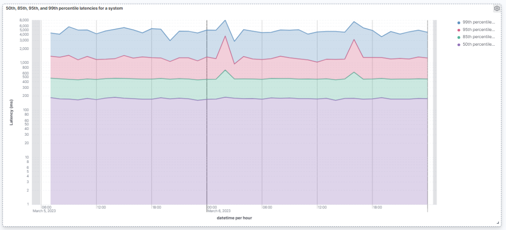

Avec cette représentation, il est possible de déduire qu'en moyenne, la latence des requêtes est inférieure ou égale à 200ms (le 50ème centile, partie violette, représente la médianne). Mais plus intéressant encore, elle permet de comprendre que 5% des requêtes (à partir du 95ème centile, partie rouge) sont 2.5 fois plus lentes (~500ms) que la moyenne. Votre équipe SRE va pouvoir travailler à découvrir pourquoi la latence est si élevée pour ces requêtes.

Attardons-nous sur un autre phénomène : le 6 mars peu après 0h00, le top 1% des requêtes les plus lentes (99ème centile, partie bleue) atteignent un pic de 8000ms de latence contre 5000ms en moyenne. Il se passe quelque chose : votre système d'alerte peut plus facilement détecter cette anomalie, et votre équipe SRE mieux isoler les requêtes concernées pour les invesiguer. En observant seulement la médianne (50ème percentile), on se rend compte que ces changements de tendance sont lissés, presque imperceptibles.

Fort de ce constat, nous pouvons améliorer l'un des indicateurs du chapitre précédent :

- **Phénomène : durée de chargement d'une page**
  - Mesure : durée de chargement d'une page pour chaque requête (en millisecondes)
  - SLI classique : taux de pages chargées en moins de 200ms sur 28 jours (en pourcent)
  - SLO classique : 99% des pages doivent charger en moins de 200ms sur 28 jours
  - SLI avancé : taux de pages chargées en moins de 1000ms dans le 95ème centile sur 28 jours (en pourcent)
  - SLO avancé : 99% des pages du 95ème centile doivent être chargées en moins de 1000ms sur 28 jours (en pourcent)

Pour développer votre intuition sur ces indicateurs, commencez par des SLIs et SLOs classiques. Une fois que votre infrastructure a gagné en maturité - et particulièrement en nombre d'utilisateurs - vous pouvez vous orienter vers des SLIs et SLOs avancés.

#### MTTx

Les MTTx sont des mesures qualifiant le temps moyen pour qu'un évènement se produise ou prenne fin. Le "x" de l'acronyme MTTx qualifie la pluralité de cette catégorie de mesures. Par exemple, le MTTR (_mean time to recovery_ ou temps moyen pour le rétablissement) est utilisé pour suivre le temps que prend une équipe avant de rétablir l'état d'un système défaillant.

Suivre ces mesures au cours du temps vous permet d'évaluer l'efficacité de vos travaux de résilience. Cela vous permet aussi de jauger l'efficacité de vos équipes pour répondre aux incidents. Si les mesures se dégradent, vous devrez étudier pourquoi et éventuellement réorganiser vos priorités afin de ne pas menacer vos SLOs. L'avantage est que vous saurez sur quoi vous concentrer.

Les MTTx sont nombreuses dans la littérature, avec chacune leurs spécificités et leurs nuances. Voyons les MTTx les plus populaires :

| Mesure   | Nom complet                                                       | Signification                                                                                                                                                                                                                                                                                                                                                                                                                                                              |
| -------- | ----------------------------------------------------------------- | -------------------------------------------------------------------------------------------------------------------------------------------------------------------------------------------------------------------------------------------------------------------------------------------------------------------------------------------------------------------------------------------------------------------------------------------------------------------------- |
| **MTTD** | _mean time to detect_ ou temps moyen de détection                 | Temps moyen entre le déclenchement de l'incident et le moment où vos systèmes lancent l'alerte. Détecter un incident peut prendre quelques secondes quand un problème conséquent se déclenche. Mais cela peut prendre plusieurs semaines quand il ne concerne qu'un utilisateur isolé qui ne fait pas remonter le problème... jusqu'à ce qu'il ne puisse plus le gérer.                                                                                                    |
| **MTTA** | _mean time to acknowledge_ ou temps moyen de prise en compte      | Temps moyen entre le déclenchement d'une alerte et l'attribution d'un personnel à la résolution cet incident.                                                                                                                                                                                                                                                                                                                                                              |
| **MTTI** | _mean time to investigation_ ou temps moyen d'investigation       | Une fois que l'incident a été pris en compte, temps moyen nécessaire pour que la personne qui a été désignée sache réellement ce qui ne va pas et comment y remédier. Une MTTI trop élevée suggère que votre infrastructure ou votre application est trop complexe, ou que vos mécanismes d'observabilité sont insuffisants. Cela peut aussi indiquer que vos ingénieurs sont débordés et qu'ils ont ainsi du mal à se libérer pour intervenir rapidement sur un incident. |
| **MTTR** | _mean time to recovery_ ou temps moyen pour le rétablissement     | Temps moyen entre l'alerte et la résolution du problème                                                                                                                                                                                                                                                                                                                                                                                                                    |
| **MTTP** | _mean time to production_ ou temps moyen à la production          | Temps moyen pour que le service affecté par un incident soit à nouveau opérationnel et accessible aux utilisateurs en production. Au contraire du MTTR qui mesure le temps de réparation d'un service, alors que le MTRS mesure le temps de restauration du service après la réparation du service. Par exemple en cas de panne, votre site peut afficher un avertissement "Nous sommes en maintenance" même si vous venez de réparer le service défaillant.               |
| **MTBF** | _mean time before failure_ ou temps moyen entre deux défaillances | Temps moyen entre la dernière défaillance détectée et l'actuelle. Cette mesure aide à prédire la disponibilité d'un service.                                                                                                                                                                                                                                                                                                                                               |


Vous pouvez commencer à suivre vos MTTx dans un tableur collaboratif (ex: _Baserow_, _NocoDB_, _Google Sheets_) puis passer à des outils plus intégrés comme _Jira Service Management_ ou [_Odoo_](https://www.odoo.com/fr_FR/app/maintenance). L'idée est de pouvoir calculer et visualiser la tendance que prennent vos MTTx avec le temps.

Si vous optez pour un tableur, vous pouvez utiliser pour cette structure :

| Mesure | Date de début        | Date de fin          | Incident                |
| ------ | -------------------- | -------------------- | ----------------------- |
| TTD    | 04/07/2024 16h45 UTC | 04/07/2024 16h50 UTC | https://abcd.com/C4D5E6 |
| TTA    | 04/07/2024 16h50 UTC | 04/07/2024 17h00 UTC | https://abcd.com/C4D5E6 |
| TTI    | 04/07/2024 17h00 UTC | 04/07/2024 17h20 UTC | https://abcd.com/C4D5E6 |
| TTR    | 04/07/2024 17h00 UTC | 04/07/2024 18h30 UTC | https://abcd.com/C4D5E6 |
| TTD    | 02/06/2024 13h30 UTC | 02/06/2024 13h34 UTC | https://abcd.com/A1B2C3 |
| ...    | ...                  | ...                  | ...                     |

- La **mesure** mentionne le nom du MTTx
- La **date de début** est le moment auquel l'évènement a débuté
- La **date de fin** est le moment auquel l'évènement a pris fin
- La colonne **incident** peut référencer un identifiant d'incident ou le lien vers le postmortem

Calculez vos MTTx en faisant la moyenne des différences entre date de début et date de fin pour chaque incident. Echantillonnez sur une période d'un mois calendaire.

Comme vous pouvez l'observer, la majorité des mesures peuvent être issues de votre postmortem. Elles sont dans tous les cas intimement liées à ce dernier et la complètent. Veillez à tenir vos MTTx à jour pour chiffrer votre niveau de résilience et identifier les points névralgiques qui l'affectent.

### Service mesh

Malgré son application très concrète et pratique, le _service mesh_ ou "service de maillage de services" est une notion qui peut paraître complexe au premier abord.

Abordons-la au travers de quelques problématiques qui illustrent son intérêt :

- "Nos logiciels sont écrits dans 6 langages différents et nous n'avons pas de moyen unifié pour récolter la télémétrie (logs applicatifs, logs d'erreur, métriques)." (sujet : observabilité)
- "Nous avons 70 équipes d'administration système et les amener à ajouter du TLS entre tous leurs services serait un travail d'organisation impossible." (sujet : sécurité, chiffrement des flux)
- "Nous avons des centaines de conteneurs tournant sur plusieurs machines réparties géographiquement et n'avons aucun moyen unifié d'analyser les latences réseau" (sujet : observabilité)
- "Nous ressentons des lenteurs sur notre service à l'usage et ne pouvons dire s'il s'agit d'un problème réseau ou logiciel." (sujet : observabilité)
- "Nous n'avons aucun moyen d'évaluer si la nouvelle version d'un logiciel déployé introduit des ralentissements" (sujet : observabilité, déploiements _canary_ ou _blue/green_)

Grâce aux mécanismes de déploiement standardisés que proposent les systèmes d'orchestration des containers (ex: Kubernetes), un _service mesh_ permet d'adresser ces problématiques en se "branchant" à votre système d'orchestration. Il peut améliorer la sécurité, la stabilité et l'observabilité de votre infrastructure en :

- Gérant les certificats de sécurité à un seul endroit
- Gérant les autorisations poussées dans l'administration des flux réseau
- Contrôlant les flux réseau avec des règles (_A/B testing_, déploiements _canary_ ou _blue/green_, [limites de requêtes par minutes](https://istio.io/latest/docs/tasks/policy-enforcement/rate-limit/#rate-limits))
- Répartissant la charge réseau de manière égale entre les services (_load balancer_)
- Récoltant automatiquement des métriques réseau selon les "[4 signaux clés](#les-4-signaux-clé)" (latence, traffic, erreurs et saturation), indépendamment d'où les pods sont déployés (cf. _Istio Dashboard_[^IstioDashboard])
- Récoltant les _logs_ d'accès aux applications (cf. _Istio access logs_[^IstioAccessLogs])
- Permettant de détailler le cheminement des requêtes entre des pods distribués sur plusieurs nœuds (cf. _Istio distributed traces_[^IstioDistributedTraces])

Les métriques étant standardisées, la plupart des _service mesh_ permettent de les utiliser pour configurer des règles automatiques selon l'activité réseau de l'infrastructure.

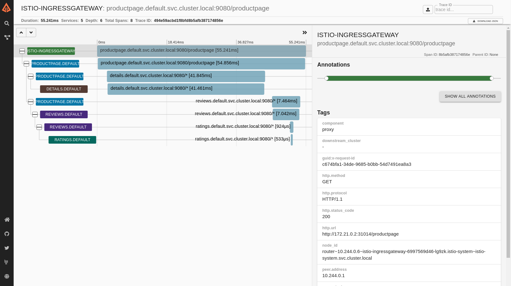

En résumé, un _service mesh_ gère tout ou partie des aspects suivants : gestion du traffic réseau, sécurité des flux et observabilité réseau. Cela permet de mieux sécuriser l'infrastructure, de mieux pouvoir l'auditer et de réduire la rupture de service.


> Vue d'ensemble du fonctionnement d'un service de maillage de services : des conteneurs "proxy" sont ajoutés dans chaque pod pour gérer les interactions avec le _service mesh_.[^WeaveWorksServiceMeshArticle]

Techniquement, un _service mesh_ va s'installer sur votre logiciel d'orchestration (ex: Kubernetes) et attacher dans chaque _pod_ (ensemble de conteneurs / application) un conteneur appelé _sidecar_. Ce dernier agira en tant que proxy réseau et gérera les interactions citées plus haut avec le _service mesh_.

En revanche, un _service mesh_ n'est pas une technologie légère : elle nécessite de l'administration et de la formation en interne (à la fois pour les développeurs et les administrateurs) avant que vous ne puissiez bénéficier de ses avantages. Ne vous attendez pas d'une technologie qui vous permet de passer de 50 à 5 administrateurs systèmes, qu'elle soit administrable par seulement 2 personnes. Les _service mesh_ ont un intérêt certain mais assurez-vous que vous soyez dimensionné pour l'administrer.

Plusieurs _service mesh_ existent avec chacun ses forces et ses faiblesses. Prenez le temps de les comparer avant d'en choisir un. Par exemple, Linkerd[^Linkerd] sera plus simple à déployer que Istio, mais contiendra moins de fonctionnalités. Consul[^Consul] est une autre alternative.

### Des extensions pour simplifier l'infrastructure

Comme décrit dans le chapitre "[Un socle au service de votre résilience](#un-socle-au-service-de-votre-résilience)", les plateformes Cloud ont l'intérêt d'inclure tout un tas de services assurant des besoins communs de sécurité et de supervision. Ces services gèrent automatiquement des fonctionnalités historiquement fastidieuses à développer individuellement pour chaque logiciel, ou pour l'infrastructure.

Grâce aux CRDs[^CRD] ou en déployant les configurations Helm[^Helm] d'outils _Cloud native_[^CloudNative], il est possible de facilement "installer" des services socle au sein d'un cluster Kubernetes. Voici une liste non-exhaustive des services qui peuvent être assurés nativement dans votre cluster et administrables de manière centralisée :

1. Centralisation des logs et traces applicatifs et réseaux (cf. [Filebeat](https://www.elastic.co/beats/filebeat), [Fluentd](https://www.fluentd.org/), [Loki](https://grafana.com/oss/loki/), [OpenTelemetry](https://opentelemetry.io/), [Jaeger](https://github.com/jaegertracing/jaeger), [Tempo](https://grafana.com/oss/tempo/), [Zipkin](https://zipkin.io/))

    

2. Centralisation des métriques de performance des nœuds et des conteneurs du cluster (cf. [Mimir](https://grafana.com/oss/mimir/), [Metricbeat](https://www.elastic.co/beats/metricbeat))

    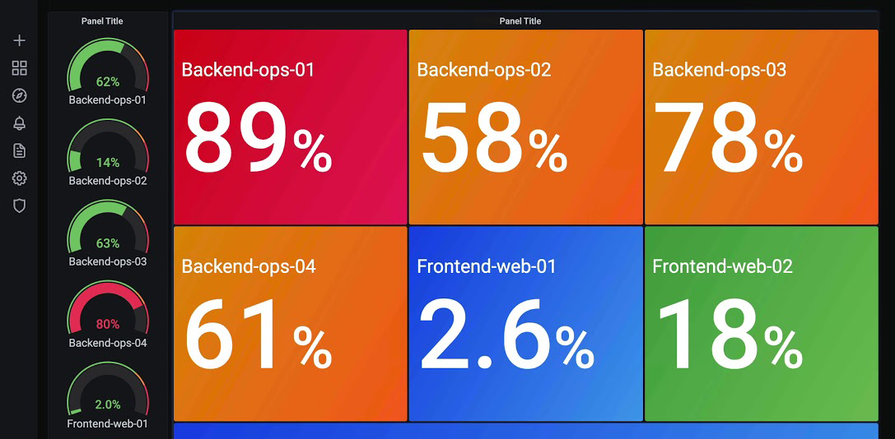

3. Analyse antivirus du contenu des nœuds et des conteneurs (cf. [Docker Antivirus Exclusions](https://docs.docker.com/engine/security/antivirus/), [Kubernetes ClamAV](https://cloud.google.com/community/tutorials/gcp-cos-clamav))

4. Détection de comportements suspects d'appels système Linux (cf. [Sysdig Falco](https://github.com/falcosecurity/falco))

5. Contrôle et audit des configurations du cluster (cf. [Gatekeeper](https://github.com/open-policy-agent/gatekeeper), [OpenSCAP](https://www.open-scap.org))

    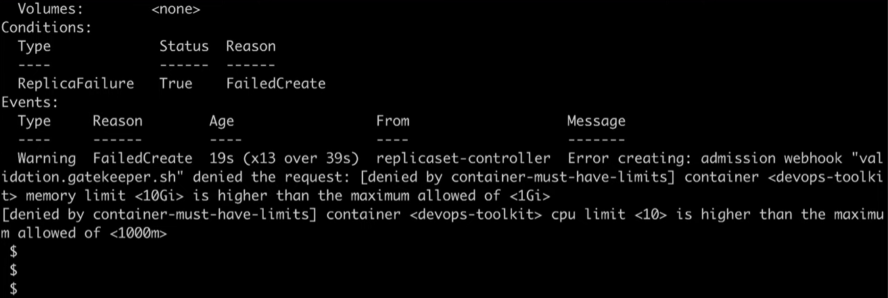

6. Gestion des secrets (mots de passe, tokens) des applicatifs (cf. [Vault](https://www.vaultproject.io/), [Sealed Secrets](https://github.com/bitnami-labs/sealed-secrets)[^SealedSecrets])

    

7. Sauvegarde automatique des volumes persistants (cf. [Valero](https://velero.io/docs/v1.10/))

8. Chiffrement des flux réseau entre les conteneurs (cf. chapitre "[Service mesh](#service-mesh)")

    

9. Gestion des certificats de sécurité (cf. chapitre "[Service mesh](#service-mesh)")

10. Gestion de l'authentification aux services web (cf. [Istio Ingress Gateway](https://medium.com/@senthilrch/api-authentication-using-istio-ingress-gateway-oauth2-proxy-and-keycloak-a980c996c259), [Keycloak](https://www.keycloak.org))

L'intégration et l'automatisation sont les caractéristiques fondamentales d'un socle Cloud. Encore une fois, en DevOps, on estime que quelque chose qui n'est pas automatisé ne sera pas utilisé.

Les technologies évoquées ci-dessus s'interfacent automatiquement au logiciel déployé. En Cloud, ce n'est plus au logiciel de s'interfacer aux technologies du socle, c'est le socle qui s'interface aux logiciels.

# Tirer parti des ressources à sa disposition

## Trouver des ambassadeurs pour son projet

L'importance du responsable de projet n'est pas à considérer comme une simple plus-value. C'est lui qui est responsable du fait que le projet atteigne ses objectifs. Il joue aussi souvent le rôle de _product owner_ - un terme défini dans la méthode Agile - dont le rôle est de faire le lien entre les équipes techniques et métiers. C'est lui qui « vend » votre projet à vos utilisateurs.

Il est important que se profil soit assez proche des utilisateurs pour comprendre les problématiques des métiers mais également assez proche des équipes techniques pour comprendre les enjeux d'ingénierie. Souvent, le chef de projet va avoir tendance à « sur-vendre » les délais auprès des métiers. Cette pratique génère du stress pour les équipes internes et de la frustration pour les clients, qui se sont vus promettre un nouvel outil qui prendra finalement plus de temps à être disponible.

Annoncez un calendrier réaliste discuté au préalable avec vos équipes techniques. Imposer un calendrier est le meilleur moyen d'échouer. Vos ingénieurs voudront peut-être faire de leur mieux pour respecter les délais mais le résultat ne sera qu'un produit de frustration pour tout le monde : risque de bugs élevés, de fonctionnalité mal évaluées… Si vous doutez du temps que peut prendre l'un des développements, posez des questions. Ne prenez pas de décision arbitraire car vous « pensez » que telle ou telle fonctionnalité peut être développée rapidement.

> « Under-promise, over deliver »

Afin d'accélérer l'adoption de vos solutions, conviez un métier à vos présentations. Si cette personne est convaincue par votre produit, elle sera tentée de le présenter elle-même à votre assemblée pour expliquer à quel point il lui a été précieux pour son travail de tous les jours.

Arriver à faire parler un métier à votre place est le meilleur moyen de gagner en crédibilité et prouver que votre solution répond à un besoin d'actualité. En illustrant un cas d'usage, vos invités se projetteront bien plus vite sur l'utilisation qu'ils peuvent faire de votre outil. Si vous avez des utilisateurs récalcitrants ou qui ont du mal à se projeter, un métier qui témoigne sur l'intérêt de votre projet est votre meilleur allié.

Tentez d'établir un réseau solide de quelques « ambassadeurs » (product advocates) au sein de votre organisation pour asseoir votre légitimité et soutenir votre initiative. En plus de ce soutien, l'ambassadeur vous permettra de capter les retours utilisateur ou d'en émettre lui-même pour affiner votre proposition de valeur.

## Réservistes ou projet « 20% »

Dans le privé et en particulier chez les GAFAM[^GAFAM], il est courant pour les employés d'avoir une journée dédiée dans leur semaine pour travailler sur un projet différent au sein de l'entreprise. En ce sens, ils choisissent de travailler au profit d'une autre équipe 1 jour sur 5. Cette possibilité est intéressante car elle profite à la fois à l'employé et à l'entreprise : l'employé peut voir autre chose et monter en compétence dans un autre domaine tout en aidant quand même l'entreprise.

Il est également possible de citer le ["Programme 10%"](https://www.10pourcent.etalab.gouv.fr/) de la DINUM et de l'INSEE. Basé sur le volontariat, l'objectif est de proposer aux agents de la fonction publique de consacrer 10% de leur temps de travail à des projets d'intérêt commun[^Programme10p].

Tentez de proposer à votre hiérarchie cette possibilité afin que chaque collaborateur puisse bénéficier de ce programme : cela favorisera les échanges, rapprochera les équipes et fidélisera vos collaborateurs en leur permettant de découvrir et travailler sur de nouveaux sujets.

Afin de tirer parti de toutes les ressources à votre disposition, considérez l'emploi de personnels réservistes au sein de votre équipe si votre organisation le permet. Quand bien même ils ne sont présents que quelques jours dans l'année, ils peuvent vous appuyer sur des tâches précises. Par exemple, un réserviste en sécurité des systèmes d'information vous aidera à boucler une homologation. Un data-scientist à évaluer une solution d'intelligence artificielle ou effectuer un appui ponctuel sur un jeu de données complexe à traiter.

## Synergie public / privé : une approche gagnante

Les grandes organisations se basent majoritairement aujourd'hui sur des prestations fournies par des industriels pour leurs projets techniques. Soit en raison du manque d'experts en interne, du manque de RH ou des deux. L'erreur est de s'abandonner à l'industriel et se dire « c'est l'expert, tout va fonctionner, il suffit que je paye ». Toute personne ayant mené un programme industriel s'est confrontée aux problématiques de compréhension des enjeux métiers par les parties-prenantes (chefs de projets vs métiers vs industriels) et n'a pu que constater qu'un projet ne se déroule jamais 100% selon le plan prévu.

Il est une erreur stratégique de se dire que le simple fait de payer un prestataire va nous apporter la solution qu'on attend. Si vous n'êtes pas un technicien expert du domaine qui a pratiqué depuis récemment, vous ne serez jamais au niveau pour challenger efficacement les propositions de votre prestataire. Vous risquez soit de ne pas répondre à vos problématiques métier, soit de perdre de l'argent, soit probablement les deux.

Voilà pourquoi il est important d'avoir en interne, dans vos propres équipes, des experts pratiquants du sujet que vous voulez développer. Ce sont les seuls qui seront capables de critiquer les propositions de vos prestataires pour vous faire gagner des délais et éviter qu'on vous dupe avec des fonctionnalités au coût exorbitants ou aux promesses irréalistes.

Chaque ingénieur DevOps et SRE le sait : il est impossible qu'un système fonctionne 100% du temps. C'est pourquoi vous ne pouvez pas attendre d'un prestataire, qu'importe le prix que vous paierez, qu'il livre quelque chose de 100% fonctionnel.

Pour référence, même Google [ne promet pas plus de 99.9% de disponibilité](https://workspace.google.com/terms/sla.html) (SLA)[^GoogleWorkspaceSLA] avec sa capitalisation de plus de 1.3 billions de dollars et ses +150 000 employés rigoureusement sélectionnés. Amazon (AWS) et son presque billion de dollars de capitalisation ne garantit [pas plus de 99.5%](https://aws.amazon.com/compute/sla)[^AWSSLA].

### Mieux s'organiser pour ne pas échouer

La méthode traditionnelle des institutions pour travailler avec des industriels peut s'assimiler aux développements de type « waterfall » : une grande réunion est organisée pour recueillir le besoin, un cahier des charges technique et fonctionnel est rédigé pour structurer le contrat, les développements sont réalisés sans retour des métiers et le produit final est livré, clôturant le contrat.

Cette méthode ne fonctionne plus aujourd'hui avec la dynamique du développement logiciel. La durée de vie moyenne d'un logiciel ne dépasse pas 3 à 5 ans[^TimeToOutdatedSoftware] et ce quand bien même en incluant des mises à jour régulières.

Prenons un exemple : vous avez la charge d'équiper votre organisation d'un nouvel outil numérique.

- Si vous en êtes venu à devoir lancer ce projet, il est probable que le besoin pour cet outil se soit manifesté il y a déjà quelques mois ou années.
- Vous vous mettez alors en ordre de bataille pour comparer les solutions existantes sur le marché et entrer en contact avec un industriel : cela vous prendra entre 1 à 3 mois.
- Vous avez trouvé votre industriel : vous organisez une réunion entre les métiers et les industriels pour leur faire comprendre la problématique et vos attendus.
- La formalisation du cahier des charges prend 1 mois supplémentaire. Quelques aller-retours pour l'ajuster : +1 mois.
- Vous allez devoir probablement homologuer ce nouvel outil pour respecter la politique SSI de cette organisation : même si cette procédure est réalisée en parallèle, elle vous coûtera probablement au moins 1 mois supplémentaire.
- La formalisation du contrat prend aussi 1 mois. Le développement prend 3 à 6 mois (et peut prendre du retard ou s'étaler sur des périodes plus grandes selon le cahier des charges).
- Les présentations et validation du bon fonctionnement : 1 mois.
- La mise en production 2 semaines à 2 mois supplémentaires selon votre politique SSI et les réseaux à votre disposition.

Résultat : le processus vous aura pris environ 1 an tout en n'ayant jamais mis l'outil entre les mains du métier. Vous n'êtes à cette étape même pas sûr qu'il réponde au besoin : rappelez-vous que le besoin exprimé n'est jamais vraiment le besoin effectif.

Le métier a enfin l'outil entre les mains : manque de chance, il ne répond pas pleinement au besoin, n'est pas pratique à utiliser et vos collaborateurs préfèrent rester sur les anciens outils qu'ils maîtrisent.

Il n'est pas concevable de travailler de cette manière en 2022. L'une des pratiques du DevOps est de permettre « d'échouer rapidement », pour itérer plus régulièrement et atteindre plus rapidement l'outil qui répond au besoin. En ce sens, la méthodologie DevOps vous recommande de ne pas partir tête baissée sur une version « parfaitement aboutie » du cahier des charges : partez sur une première version, échouez, itérez et construisez l'outil parfait pour vos métiers avec vos métiers. Vous vous souvenez de ce pilier ? « Réduire les silos organisationnels en impliquant chacun » : vous devez inclure les utilisateurs finaux tout au long du cycle du projet. Si vous les mettez de côté, le produit final risque de ni faciliter le travail du métier pour lequel il a été conçu, ni d'obtenir la volonté de ces métiers pour l'utiliser.

En ce sens si vous souhaitez travailler efficacement avec une entreprise externe à votre organisation, vous devez rapprocher toutes les parties-prenantes liées à ce projet. Faites en sorte que la voix de chacun puisse être entendue en mettant en place un moyen de communication simple et pratique à utiliser pour faire des retours et des suggestions. Par exemple, vous pourriez demander à l'industriel de vous partager l'accès à sa usine logicielle (ex : GitLab, BitBucket, GitHub) pour y ajouter les commentaires de vos équipes et que les ingénieurs puissent y répondre en boucle courte. GitLab permettant aussi de réaliser du déploiement continu, l'idée est que l'industriel puisse mettre à disposition de ses clients un accès à la dernière version du logiciel. De cette manière, vous évitez les réunions de plusieurs heures et gagnez en flexibilité : vous itérez, rapidement.

.")

> Exemple de vue Kanban dans GitLab où sont centralisés les commentaires sur un logiciel (tâches à réaliser, feedbacks, bugs…).

Dans le cas où vous ne pouvez pas agir sur vos pratiques avec l'industriel, organisez-vous au moins en interne pour avoir un outil de gestion de projet collaboratif comme Atlassian Confluence, qui agit comme une base de connaissance pour votre équipe.

.")

> Exemple de vue Kanban dans Atlassian Confluence où sont centralisés les commentaires sur un logiciel (tâches à réaliser, feedbacks, bugs…).

À titre d'exemple, le _ITZBund_ (Centre Fédéral Allemand des Technologies de l'Information, l'équivalent allemand de l'ANSSI[^ANSSI]) emploie depuis 2018 au sein de son _Bundescloud_ (cloud inter-ministériel) le logiciel open-source _Nextcloud_[^NextcloudITZBund]. Ce dernier permet de partager des fichiers et collaborer sur une plateforme unifiée. Environ 300 000 utilisateurs institutionnels et industriels l'utilisent. Un an après, c'est le Ministère de l'Intérieur français qui l'adopte[^NextCloudMinint].

Cette pratique est une approche gagnante : le client réduit les délais de livraison, le métier obtient un outil qui répond mieux à ses besoins, l'industriel favorise la possibilité d'une nouvelle contractualisation en ayant satisfait son client et le contribuable en a pour son argent. Globalement, tout le monde gagne du temps, est satisfait du résultat et se voit fidélisé en étant davantage impliqué dans chacune des interactions.

# Mesurer le succès de sa transformation

Il est impératif de mesurer les efforts que vous investissez dans votre initiative. Cela permet de constater factuellement l'efficacité de vos prises de décisions. Bien sûr, au début, il n'est pas rare d'observer une dégradation des performances puisque vous changez les habitudes, c'est à dire l'équilibre de l'organisation. Si vous observez une dégradation des indicateurs au cours du temps, vous savez que vous devrez adopter une autre stratégie pour corriger la tendance (cf. chapitre "[Savoir quand innover et quand s'arrêter](#savoir-quand-innover-et-quand-sarrêter)").

Selon la recherche, la maturité technique d'une organisation permet de quadrupler[^DORATechnicalCapabilities] la performance de ses équipes. Découvrons quelques indicateurs utilisés dans l'industrie. Ces derniers font régulièrement l'objet de nombreux débats, mais semblent tout de même être la référence faisant consensus.

Le succès d'une initiative DevOps se mesure grâce à 4 mesures théorisées (_4 key metrics_[^DORAsFourKeyMetrics]). À ces mesures s'ajoutent une cinquième qui révèle les performances opérationnelles de l'organisation. Elles font état des résultats obtenus à l'échelle globale de vos systèmes informatiques et de votre organisation plutôt que seulement sur des mesures logicielles. Ces dernières peuvent résulter d'amélioration locales, au détriment des performances globales. Découvrons-les :

- **Fréquence des déploiements** (_deployment frequency_) : pour le logiciel ou le service principal sur lequel vous travaillez, à quelle fréquence votre organisation déploie-t-elle le code en production ou le rend disponible pour ses utilisateurs ?
- **Délai de mise en production**  (_lead time for changes_) : pour le logiciel ou le service principal sur lequel vous travaillez, en combien de temps le mettez-vous en production (c'est-à-dire, combien de temps faut-il pour passer du code validé au code fonctionnant correctement en production) ?
- **Durée pour restaurer un service** (_time to restore service_) : pour le logiciel ou le service principal sur lequel vous travaillez, combien de temps faut-il généralement pour rétablir le service lorsqu'un incident ou un défaut ayant un impact sur les utilisateurs se produit (ex: une panne non planifiée ou un service dégradé) ?
- **Taux d'échec des déploiements** (_change failure rate_) : pour le logiciel ou le service principal sur lequel vous travaillez, quel est le pourcentage de mise à jour de la production ou de sortie d'une nouvelle version qui entraînent une dégradation du service (ex: détérioration ou interruption du service) et qui nécessitent par la suite des correctifs (ex: un _hotfix_, un _rollback_, un report de correctif, un _patch_) ?

Toutes ces mesures sont basées sur la disponibilité de l'infrastructure plutôt que sa résilience. Les checheurs du rapport DORA ont en conséquence posé une nouvelle question aux organisations en 2021[^DORA2021Summary]. Cela a donné naissance à une cinquième mesure :

- **Performance opérationnelle** ou Résilience (_operational performance_ ou _reliability_) : évaluation de la capacité à atteindre ou dépasser ses objectifs de résilience. Voici les réponses attendues concernant les objectifs de résilience pour cette mesure : "les atteint souvent", "les atteint la plupart du temps", "les surpasse toujours". Cela peut se mesurer entre-autres grâce aux SLO (cf. chapitre "[Indicateurs de résilience](#indicateurs-de-résilience)") ou à un taux de satisfaction utilisateur.

Si construisez de zéro votre initiative, se comparer aux performance de l'industrie a peu d'intérêt. Gardez-les en tête pour savoir quel objectif viser mais n'estimez pas votre succès en fonction d'eux. Estimez-le selon la progression de vos propres mesures dans le temps. Tout le monde part d'une situation initiale dont l'objectif est de l'améliorer.

Le rapport DORA 2022 a classé les organisations sondées en trois catégories de performance (bas, moyen et haut) pour ses quatre mesures clé :

| Mesure                          | Bas                          | Moyen                 | Haut                              |
| ------------------------------- | ---------------------------- | --------------------- | --------------------------------- |
| Fréquence des déploiements      | Entre 1 et 6 tous les 6 mois | Entre 1 et 4 par mois | A la demande (plusieurs par jour) |
| Délai de mise en production     | < 6 mois                     | < 1 mois              | < 1 semaine                       |
| Durée pour restaurer un service | < 1 mois                     | < 1 semaine           | < 1 jour                          |
| Taux d'échec des déploiements   | 46% - 60%                    | 16% - 30%             | 0% - 15%                          |

GitLab permet même de [visualiser en temps-réel ces mesures](https://gitlab.com/gitlab-org/gitlab/-/value_stream_analytics) depuis la version _12.3_.


Si vous disposez d'une version assez récente de GitLab ou avez mis en place des chaînes d'intégration continue, vous pouvez mesurer la plupart des phénomènes. Sinon, demandez à vos équipes de noter les évènements sur une interface collaborative (ex: _Google Sheets_, _Airtable_, _Atlassian Confluence_, _Baserow_, _NocoDB_).

A ces mesures s'en ajoute une que je nomme "**tendance de collaboration résiliente**" (_resilient collaboration trend_ ou RCT). Elle capture l'essence d'une initiative DevOps selon moi : réussir à innover en continu, tout en maintenant une dette technique faible et en fournissant un service le plus disponible possible. Les facteurs suivants sont multipliés pour totaliser la valeur de **l'indice de collaboration résiliente** (RCI) :

1. Nombre de jours depuis la création du logiciel (nombre)
2. Nombre de contributeurs au logiciel depuis la création du logiciel (nombre) : ces deux premiers facteurs déterminent la capacité de l'entreprise à entretenir un logiciel maintenable dans le temps, simple à appréhender et à modifier. C'est à dire sa capacité à maintenir une dette technique faible.
3. Nombre de déploiements effectués avec succès dans le trimestre (nombre) : facteur déterminant la capacité de l'entreprise à innover avec régularité, de l'écriture du code à la mise en production.
4. Disponibilité trimestrielle du logiciel en production (%) : facteur déterminant la capacité de l'entreprise à rendre un service stable à ses utilisateurs.

On observe et on compare ensuite la tendance de cet indice au cours du temps. C'est cette tendance qui peut se comparer à d'autres projets.

Par exemple, le projet GitLab[^GitLabGitLab] - l'un des plus gros projets open-source collaboratif - affiche sur le 2ème trimestre 2022 l'indice de collaboration résiliente `155 711 413`, `188 809 628` (+17.5%) au 3ème trimestre et `202 865 477` (+7%) au 4ème trimestre. Ce dernier, avec `4102` jours depuis la création du projet git (9 octobre 2011 - 1 janvier 2023), `2474` [contributeurs](https://gitlab.biterg.io/app/kibana#/dashboard/3e297c20-622c-11e9-8638-c11f0f1aa3fa), `20` publications du logiciel (_release_) et une disponibilité moyenne de `99.95%`[^GitLabAvailability]. Le projet a donc été moins véloce au 3ème qu'au 4ème trimestre (-10.5%).

Cet indice doit être actualisé tous les trimestres. Cet interval de temps peut être contracté ou étendu selon la maturité de votre organisation : plus vous êtes confiant sur votre capacité à déployer régulièrement, plus réduite peut être votre interval de mesure. Ex: sur un semestre, un trimestre, un mois ou une semaine.

Au contraire du SRE qui se base sur des mesures bien spécifiques (ex. les "[Les 4 signaux clé](#les-4-signaux-clé)", les "[Indicateurs de résilience](#indicateurs-de-résilience)"), le responsable DevOps a lui une certaine liberté pour choisir les mesures qui lui semblent les plus pertinentes. C'est à dire celles qui évaluent au mieux le service qu'il rend aux équipes internes. Néanmoins, le _modus vivendi_ entre les DevOps et les SRE est le "délai de mise en production" : chacun œuvre à ce que ce paramètre soit le plus satisfaisant possible.

# Plateforme DevOps intégrée

## Déployer en parallèle dans des environnements différents

Votre organisation est parfois menée à déployer des logiciels dans des environnements aussi variés que singuliers. Si vous avez de la chance, ces environnements sont peu nombreux et connectés. Mais cela se complique quand le nombre commence à grossir et qu'ils sont isolés. Il faut trouver un moyen standardisé de déployer ses mises à jour en réduisant au maximum les délais.

Basé sur Kubernetes, Apollo est le produit utilisé par Palantir pour déployer et garder à jour ses services chez l'ensemble de ses clients. Avec ses centaines d'ingénieurs, plus de 400 logiciels et des milliers de déploiements chaque jour, Palantir revendique le déploiement de ses services sur une centaine d'environnements informatiques différents (AWS, GCP, Azure, Clouds privés classifiés et déconnectés d'Internet, edge-servers avec connexion intermitente...)[^GregDeArmentInterviewApollo].

Poussée par cette contrainte d'un déploiement régulier sur des infrastructures variées, les travaux autour d'Apollo ont commencé début 2015. Il a été progressivement déployé chez ses clients dès 2017 et se voit désormais mis en vente depuis début 2022, et fait tourner l'infrastructure interne de Palantir. La philosophie du produit est de s'interfacer avec vos infrastructures et services existants (forge logicielle, moteur d'intégration continue, registre d'artéfacts...)[^PalantirApolloWhitepaper].

L'entreprise part du principe que les ingénieurs logiciels et les SRE ont chacun leurs domaines d'expertise. D'un côté, les ingénieurs logiciels savent mieux comment et quand les logiciels qu'ils développent doivent être mis à jour. De l'autre, les SRE connaissent mieux les particularités et contraintes des environnements dans lesquels ils déploient[^PalantirApolloBlogCD]. Les ingénieurs logiciels développent donc le code, Apollo le déploie et les SRE surveillent que tout s'est déroulé comme prévu.

C'est pourquoi Apollo présente principalement deux menus dans son interface : "Environnements" (orienté SRE) et "Produits" (orienté ingénieurs logiciels).

- Le menu "Environnements" permet de se connecter à différents environnements, définir sa stratégie de déploiement au travers de plusieurs environnements (ex: GCP, AWS, Azure, on-premise) et canaux (cf. _release channels_), définir des critères de qualité et de sécurité logicielle ou encore d'approuver des modifications dans l'infrastructure.
- Le menu "Produits" permet de garantir que la nouvelle version d'un logiciel est correctement déployée : Apollo gère automatiquement les déploiements _blue/green_ (cf. chapitre "[Déploiement continu](#déploiement-continu-cd)") et les retours en arrière (_rollback_). Il permet de décrire sa stratégie de mise à jour en déclarant quel service doit être mis à jour avant tel autre (cf. chapitre suivant "[Déploiement basé sur les contraintes](#déploiement-basé-sur-les-contraintes)").

Connecté à des répertoires _git_, il permet de suivre et d'approuver toute modification apportée au code avant son déploiement.

Enfin, Apollo permet une surveillance centralisée de l'état des services déployés dans tous vos environnements, depuis une même plateforme. Connecté à votre service d'observabilité favoris (ex: _Datadog_, _Prometheus_, _Pagerduty_) ou en autonomie via la _Apollo Observability Platform_, il inclut la remontée de toute sorte de mesures (_logs_, _metrics_, _traces_) pour investiguer les incidents en détails.

## Déploiement basé sur les contraintes

Avec Apollo, Palantir introduit le concept de déploiement continu basé sur des contraintes (_constraint-based continuous deployment_)[^PalantirConstraintBasedCD]. Apollo déploie dans chaque environnement un agent qui lui rapporte l'état réel de cet environnement pour savoir comment déployer les mises à jour. Apollo connaît ainsi l'état attendu des déploiements sur une infrastructure et l'état réel - à jour - de ces déploiements.

Les applications modernes faisant appel à des services externes, ce mécanisme permet d'éviter les incompatibilités entre les différentes versions d'une application déployée sur des environnements différents.

Par exemple, si l'application `foo` en version `1.1.0` requiert un l'existence d'un service `bar` déployé avec la version `1.1.0`, Apollo ne mettra pas à jour `foo:1.1.0` tant que `bar:1.1.0` n'est pas disponible et déployé. Le déploiement d'une nouvelle version d'un applicatif dépendant d'une version spécifique d'un autre est souvent géré manuellement, même si un mécanisme de déploiement continu est mis en place. En effet, les équipes doivent au préalable s'assurer que le service duquel dépend l'application (`bar:1.1.0`) est bien disponible et déployé, avant de déployer sa nouvelle version (`foo:1.1.0`). Ces dépendances sont inscrites au sein d'un fichier spécifique, dans le même projet que le code source de l'application.

La migration du schéma d'une base de données est un autre exemple. En déclarant la version d'un schéma de base de données compatible avec une version précise d'une application, Apollo évite de déployer une application incompatible avec une base de données qui n'a pas encore été mise à jour. Par exemple, si `foo:1.1.0` ne supporte que la `V2` du schéma de `bdd:V1`, `foo:1.1.0` ne sera déployé que quand `bdd:V1` aura migré à la `V2`. Apollo sait ainsi quelle version d'une application est élligible à être déployée dans quel environnement.

# Répartition des initiatives

Dans les sondages, 47% des organisations déclaraient adopter une approche DevOps. C'est 74% en 2021[^RedGate2021Report].

Entre 2019 et 2022, la répartition des initiatives DevOps par domaine d'activité est restée dans le même ordre de grandeur[^DORAIndustry] : largement dominée par le secteur technologique (~40%), suivit par le secteur financier (~12%) et le e-commerce (~8%). Le secteur institutionnel représente entre 2% et 4% de ces initiatives, laissant une grande place à l'innovation dans ce milieu.

Voici une répartition des entreprises pratiquant le DevOps en 2022[^INSEECompanySizeDefinition] :

- Grandes entreprises (>= 5000 employés) : ~30%
- Entreprises de taille intermédiaire (>= 250 et < 5000 employés) : ~38%
- Entre 20 et 250 employés : ~26%
- Moins de 20 employés: ~6%

La crise de 2019 a accéléré les initiatives de transformation numérique, augmentant la taille des équipes DevOps de 23%[^GlobalUpskillingWorldwideDevopsSize] pendant la période.

La répartition géographique des organisations adoptant des pratiques DevOps est encore complexe à estimer, mais semble se concentrer tout particulièrement dans la région nord-américaine. Cette dernière représente près de 33% des initiatives DevOps. Environ 33% également pour l'Europe et 33% pour l'Asie[^DORAGeoRepartition] (avec l'Inde à 21%). En 2019, l'Amérique du Nord représentait 50% de ces initiatives, l'Europe 29% et l'Asie 9%. On observe donc un fort gain d'intérêt du sujet par les pays asiatiques.

La taille moyenne des équipes DevOps est encore limitée et tourne autour de 8 personnes[^DORATeamSize].

Cela fait du DevOps une méthodologie majoritairement adoptée dans les entreprises ayant atteint une masse critique et encore peu dans les entreprises non-technologiques.

# Conclusion

La transformation d'une organisation, quelle que soit sa taille, est une tâche complexe impliquant des enjeux politiques, techniques et humains importants. En cas d'échec, les conséquences peuvent être lourdes. Dans le même temps, il est crucial pour votre organisation d'envisager les conséquences à long terme si elle poursuit avec son modèle actuel. Le DevOps vise précisément à minimiser ces risques au travers de méthodologies et d'outils normalisés.

La recherche et l'expérience de milliers d'entreprises nous permettent aujourd'hui d'appréhender les défis liés à la transformation des organisations vers le Cloud. Ayant démontré son efficacité, les institutions commencent progressivement porter de l'attention au DevOps, bien que peu aient encore franchit le pas pour l'adopter (cf. chapitre "[Répartition des initiatives](#répartition-des-initiatives)"). Si l'une des grandes difficultés est encore de trouver des talents dans ce domaine, la première reste de convaincre l'entité dirigeante.

Plusieurs stratégies sont alors envisageables selon votre niveau hiérarchique et techniques. La plus courante est de démarrer par un projet-pilote qui répond à des besoins interne (ex: le déploiement d'un logiciel co-construit avec vos métiers). Vous pourrez ainsi séduire de premiers partenaires internes (cf. chapitre "[Modèle d'équipe interne](#modèle-déquipe-interne)").

Rendez des services le plus tôt pour démontrer l'efficacité de votre approche vis-à-vis des approches traditionnelles (ex: logiciel mieux adapté au besoin, déploiement simplifié, réponse rapide aux incidents...). Une fois le métier convaincu, faites-le témoigner en présentation devant les décideurs. Les métiers acceptent de le faire car ils se sentent - la plupart du temps - redevables de vos services rendus. D'un impact redoutable, vous pourrez ainsi fédérer progressivement une communauté, pour porter votre vision plus haut (cf. chapitre "[Comment convaincre et garder la foi](#comment-convaincre-et-garder-la-foi)").

Faire accepter le changement est avant tout le sujet de minimiser les risques entrepris. Commencer petit pour itérer est le meilleur moyen de réussir. Qui plus est, en étant conscient des réalités psychologiques et techniques derrière un projet de transformation, vous aurez toutes les clés et les arguments pour réaliser une transition plus rapide et moins périlleuse (cf. chapitre "[Les initiatives dans les organisations](#les-initiatives-dans-les-organisations)"). Présenter les technologies Cloud et le DevOps comme une évolution, plutôt que des techniques disruptives, est un moyen efficace pour convaincre.

Tout comme les grandes entreprises qui investissent constamment dans les nouvelles technologies, chaque organisation doit être prête à prendre des risques pour rester compétitive. Votre comité exécutif doit rester à l'écoute des points de vue qui la surprennent et encourager les expérimentations. Par exemple, il est important de ne pas sous-estimer le potentiel des employés considérés difficiles à encadrer. Certains sont peut-être les visionnaires qui vous permettront d'exister demain. Etudier avec sérieux l'impact de leurs idées est essentiel, au risque de passer à côté d'opportunités cruciales pour l'avenir de l'organisation (cf. chapitre "[Réduire les silos organisationnels](#réduire-les-silos-organisationnels)").

Alors que les métiers auxquels vous rendrez service y voient un intérêt immédiat, cet intérêt est souvent plus abstrait pour l'équipe dirigeante. En tant qu'instigateur d'une transformation, vous devez donc investir du temps à acculturer les décideurs de votre organisation. N'hésitez pas à repartir des notions de base sur le Cloud pour faire progressivement comprendre les enjeux du DevOps aux parties-prenantes. Il est fondamental de trouver des exemples sur comment vous avez pu résoudre un dysfonctionnement interne, grâce à votre approche.

L'instigateur doit toujours rester prêt à répondre aux questions suivantes :

- Pourquoi avons-nous besoin de changer ?
  - Donner des exemples précis de dysfonctionnements au sein de l'organisation.
- Quel est l'intérêt de cette approche pour notre organisation ?
  - Chiffrer la quantité de temps ou d'argent que cette approche permettrait d'économiser.
- Qu'est-ce que cette transformation va nous coûter (matériel, RH, temps) ?
  - Chiffrer l'investissement requis pour mener cette transformation.
  - Proposer votre plan de transformation : plan de formation, plan de contractualisation, plan d'achats de matériel.
- Qu'en pensent les autres équipes ?
  - Lister les points forts et points faibles de l'approche. Cela nécessite d'avoir confronté sa vision aux équipes internes pour connaître leurs points de vue.

L'entité dirigeante est maintenant convaincue et vous donne les moyens techniques et politiques de mettre en place votre projet. L'aventure ne fait que commencer ! Ne communiquez pas trop tôt sur des capacités que vous ne maîtrisez pas encore. Commencez à y donner accès uniquement à une fraction d'utilisateurs volontaires et construisez vos procédures (gestion, administration, incidents). Votre initiative rencontrera nécessairement des écueils à ses débuts. Accueillez les retours avec bienveillance et améliorez ves services. Une fois que vous êtes confiant sur la fiabilité des services, déployez-les à plus large échelle puis communiquez.

Vous constaterez rapidement que les priorités opérationnelles ou commerciales empêchent souvent de se consacrer à des travaux d'infrastructure (Cloud/DevOps), en faveur de développements produit (logiciels). La recherche démontre pourtant que se structurer autour de ces méthodes éprouvées permet de gagner en efficacité sur le long terme (cf. chapitre "[Pourquoi le DevOps ?](#pourquoi-le-devops-)"). Veillez donc à intégrer dans l'emploi du temps de vos ingénieurs du temps pour les travaux de résilience.

Une infrastructure DevOps révêle son plein potentiel une fois connectée au réseau principal de votre organisation. C'est là qu'elle permettra de déployer des mises à jour fréquentes, répondre rapidement aux incidents et mutualiser les travaux de vos équipes. Si votre projet a débuté sur une plateforme isolée, portez désormais les efforts à vous connecter là où sont présents vos utilisateurs (cf. chapitre "[Les piliers du DevOps en pratique](#les-piliers-du-devops-en-pratique)").

Mesurer l'efficacité de son initiative au cours du temps est critique : à la fois pour s'assurer que l'on avance sans dogmatisme dans la bonne direction, mais aussi pour donner des arguments chiffrés à sa hiérarchie ou aux équipes qui ont encore besoin d'être convaincues. Veillez à garder un tableau de bord clair de ces indicateurs (cf. chapitre "[Mesurer le succès de sa transformation](#mesurer-le-succès-de-sa-transformation)").

Les outils tels que ChatGPT basés sur l'intelligence artificielle offrent autant de nouvelles opportunités qu'elles ouvrent à de nouvelles menaces. En parallèle, les standards en matière de sécurité continueront d'évoluer à un rythme effréné. Cela plaide d'autant plus pour une transformation des organisations vers un univers numérique plus agile. Des outils basés dessus commencent à émerger. Le futur se dessine aujourd'hui et les entreprises qui réussiront le mieux seront celles qui arrivent à s'approprier ces technologies pour les intégrer à leur cycle de développement logiciel (cf. chapitre "[Refuser le retard technologique](#refuser-le-retard-technologique)").

Au delà de la vitesse à laquelle ces outils évoluent et comme pour tout domaine d'expertise, ce type d'infrastructure nécessite l'entretien des compétences requises pour l'administrer. Nous arrivons facilement à nous imaginer qu'un pilote de chasse entretienne son aptitude à piloter. Pourquoi cela serait-il différent pour des ingénieurs qui réalisent la maintenance de logiciels critiques au bon fonctionnement de l'enreprise ? Vous et vos équipes devez continuer d'être à la pointe en vous formant (cf. chapitre "[Former de manière continue](#former-de-manière-continue)").

En mode DevOps, les organisations pourront se permettre d'échouer plus rapidement, avec un risque maîtrisé, pour innover avant leurs compétitrices.

# Terminologie "Ops"

Maintenant que vous comprenez la variété des enjeux du DevOps, il est intéressant de découvrir quelques termes que l'on peut entendre ci et là dans le domaine.

Vous avez probablement déjà entendu une multitude de termes suffixé par "Ops" : dans les propositions industrielles, les offres d'emploi ou les services en ligne. Tous ces termes décrivent des spécialités de l'exploitation des systèmes informatiques au travers de différentes techniques et de méthodologies. Définissons en quelques-uns :

- **DevOps** (Development and Operations) : méthodologie visant le rapprochement entre les développeurs et les ingénieurs s'occupant de la production pour accélérer la mise en production et la résilience des systèmes.
- **DevSecOps** (Development, Security and Operations) : partie du DevOps visant à intégrer les notions de sécurité dès la phase de conception d'un nouveau logiciel ou d'une nouvelle infrastructure. Il s'agit d'organiser l'entreprise de telle sorte à ce que les équipes de Sécurité des Systèmes d'Information (SSI) soient associées à l'ensemble des réflexions au cœur des projets de vos équipes de développement. (cf. [Sécurité : un nouveau paradigme avec l'approche DevOps](#sécurité--un-nouveau-paradigme-avec-lapproche-devops))
- **ITOps** (IT Operations) : Ensemble des pratiques se concentrant sur la maintenance et la gestion des systèmes informatiques. À distinguer subtilement du DevOps qui se concentre davantage sur l'amélioration du processus de développement et de déploiement des logiciels. Synonyme d'administrateur système (sysadmin) ou [SRE](#site-reliability-engineering-sre).
- **FinOps** (Financial Operations) : ensemble de pratiques pour mieux comprendre et gérer les coûts financiers d'une infrastructure cloud. Cela comprend le suivi et l'optimisation des dépenses, ainsi que la gestion de la facturation et des paiements. Par exemple à l'aide de tableaux de bord ou d'algorithmes automatisés.
- **MLOps** (Machine Learning Operations) : ensemble de pratiques pour la collaboration et la communication entre les équipes de _datascience_ et de production pour le développement et le déploiement efficace de modèles de _machine learning_ (ML). L'objectif est d'améliorer la rapidité, la qualité et la résilience des modèles de ML en automatisant et standardisant. (cf. _MLOps: Overview, Definition, and Architecture_[^MLOpsPaper])
- **GitOps** (Git Operations) : ensemble de règles visant à utiliser _git_[^git] comme unique source de vérité pour standardiser les pratiques de développement, de mise en production et rendre le département informatique d'une entreprise plus résiliente ([IaC](#infrastructure-as-code-iac), [CI/CD](#intégration-continue-ci), cf. [Le cycle de vie d'un logiciel moderne](#le-cycle-de-vie-dun-logiciel-moderne))
- **EmpOps** (Employees Operations) : outils qui permettent de gérer une entreprise et ses employés (projets, vacances, entretiens 1:1, base de connaissance) sur une plateforme unifiée (i.e: CRMs).
- **DataOps** (Data Operations) : Ensemble de pratiques[^DataOpsManifesto] aidant à gérer les données et la considérant comme un actif stratégique. Elles mettent l'accent sur la collaboration entre les équipes "data" et les autres équipes informatiques, l'automatisation des processus de gestion des données (ETL) et les retours réguliers pour garantir que les données répondent aux besoins de l'entreprise.
- **DevDataOps** (Development and Data operations) : Variante du DataOps adaptée pour les organisations qui suivent une approche DevOps pour leurs développements logiciel. Dans une approche DevDataOps, les pratiques de gestion des données sont intégrées au cycle de vie du développement logiciel, permettant de gérer les données et le code de manière plus coordonnée et efficace. (cf. _From DevOps to DevDataOps_ [^DataOpsPaper])
- **EdgeOps** (Edge computing Operations) : Le _edge computing_ (ou "traitement en périphérie") est un modèle d'architecture décentralisé de son SI où la gestion/transformation des données se passe à côté de l'endroit où elles sont collectées/générées. Cela s'oppose au modèle traditionnel où les données sont traitées uniquement sur un serveur distant, et permet d'optimiser la bande passante sur le réseau. Le EdgeOps intègre quelques principes du DevOps dans ce type d'infrastructure (ex: zero trust, monitoring air-gapped).
- **ChatOps** (Chat Operations) : Domaine plebiscitant l'usage des messageries instantanées comme outil pour faciliter le développement et la maintenance en production de logiciels. L'idée est de pouvoir rapidement et facilement discuter avec ses pairs (ex: messagerie simple d'accès, possibilité d'importer des fichiers ou images, visibilité des flux horaires...).
- **LiveOps** (Live Game Operations) : domaine faisant référence à toute les activités permettant le bon fonctionnement et le maintien de l'engouement autour d'un jeu vidéo. De manière plus familière, c'est "maintenir la hype" autour du jeu. Ces activités incluent : le suivi du nombre de joueurs, du temps de jeu ou encore des avis, le développement de l'engagement client, l'organisation de tournois et l'assistance faite aux joueurs.

L'émergence de ces termes qualifiant des spécialités ou des pratiques de l'administration d'infrastructures informatiques, est probablement liée à la maturité qu'a gagnée l'industrie grâce aux services Cloud. Ces derniers ont fortement simplifié l'administration des infrastructures, permettant de mener des réflexions plus avancées pour les optimiser.

Chacune de ces spécialités est un moyen d'optimiser vos pratiques DevOps et doit s'adapter à la maturité de l'entreprise. Ne vous mettez pas en tête de toutes les mettre en place avant d'avoir bien appréhendé et mis en pratique le DevOps dans votre organisation.

# Fiches de poste (exemples)

Pour éviter de perdre de temps et limiter les mauvais recrutements, le pré-requis à votre fiche de poste est votre besoin qui doit être clairement défini.

Si votre besoin n'est pas bien défini, la fiche de poste risque d'être un fourre-tout de tâches techniques qui pourraient occuper une équipe d'ingénieurs complète plutôt qu'un seul poste. Vous risquez alors de passer pour une organisation peu mature sur le sujet et de repousser par conséquent les meilleurs candidats.

Vous devez faire l'effort de définir le périmètre du poste que vous rédigez ou bien assumer le fait que votre environnement est si singulier qu'il nécessite une réadaptation très régulière (ou "tactique"). Hormis dans les secteurs de la sécurité et de la défense, vous ne devriez pas considérer votre activité comme telle.

Les exemples de fiches de poste ci-dessous sont indicatives et doivent être adaptées à votre situation (maturité et taille des équipes, de l'organisation). Modifiez le contexte et les missions que vous souhaitez confier à votre futur ingénieur DevOps ou SRE. Modifiez également les compétences que vous souhaitez mettre en avant selon votre projet du moment.

Les niveaux d'exigence des postes sont décrits selon la maturité de l'entreprise (débutante, intermédiaire, avancée) et le niveau d'expérience attendu par le candidat (débutant, medium ou senior).

Une section "Formation" est également disponible, pour vous donner une idée des cursus que le candidat peut avoir suivi pour prétendre au poste. Néanmoins, considérez dans l'informatique que le diplôme n'est plus d'aucune importance après 5 ans d'expérience professionnelle. C'est cette dernière et les projets que le candidat réalise qui définissent son niveau d'expertise.

## Ingénieur DevOps

|                                                 |                                                                                            |
| ----------------------------------------------- | :----------------------------------------------------------------------------------------- |
| **Niveau du poste**                             | Medium ou Senior[^DORAProfileExperience] (selon les responsabilités à confier au candidat) |
| **Maturité de l'organisation**                  | Débutante à intermédiaire                                                                  |
| **Rémunération approximative** (septembre 2022) | >50k€/an                                                                                   |

Dans le cadre de la transformation numérique de notre organisation, appuyé(e) par la hiérarchie, vous définirez les nouveaux processus de développement, mettrez en place les outils et accompagnerez les équipes internes dans leur réorganisation pour employer ces nouvelles techniques.

À partir des technologies actuellement utilisées dans nos équipes, vous participerez aux réflexions stratégiques et aux technologies à adopter pour le futur de notre organisation.

Avec les équipes d'ingénieurs au contact régulier des métiers vous exposant leurs activités opérationnelles, vous devrez être en mesure d'adapter la vélocité de la stratégie de transformation de notre organisation en fonction des interlocuteurs que vous rencontrerez.

À l'interface entre nos équipes de développement et au sein notre équipe SRE de X personnes, vous aurez la charge de :

- Participer aux réflexions sur la transformation numérique de notre institution
- Acculturer et conseiller les décideurs sur les nouvelles pratiques
- Aider les équipes RH à identifier les candidats pertinents
- Développer et maintenir des outils d'automatisation du cycle de vie de logiciels (GitLab, chaînes de CI/CD)
- Définir les bonnes pratiques GitOps et assurer la cohérence des développements (_workflow git_, gestion de projet kanban, chaînes de CI/CD, standardisation des déploiements avec Docker et Kubernetes...)
- Développer des modèles (_template_) de projets applicatifs pour encourager les bonnes pratiques
- Accompagner les différentes équipes techniques dans la conteneurisation de leurs applicatifs historiques

Compétences :

- Communication et capacité d'adaptation
- Conteneurisation (Docker, Kubernetes)
- Connaissance des architectures micro-services
- Administration technique de GitLab et des GitLab Runners
- Connaissance avancée en scripting Bash, Ansible, Saltstack et/ou Terraform
- Connaissance d'au moins un langage de programmation (Java, C++, Python ou Go)
- Bases de données orientées colonne, objet ou graphe
- Connaissance d'un ou plusieurs services Cloud (AWS, GCP, Azure, Alicloud, Scaleway)
- Culture DevOps
- Culture de la transformation (numérique et métier)
- Réseaux TCP/IP

Formation :

_Vous avez au moins 5 ans d'expérience professionnelle ? Nous la privilégions et ne tenons pas compte de votre diplôme._

- Master en ingénierie informatique
- Expérience professionnelle significative dans le domaine

Ce poste peut mener au poste d'Ingénieur Systèmes, de SRE ou d'Ingénieur SSI DevOps.

## Ingénieur SSI DevOps

|                                                 |                                                                    |
| ----------------------------------------------- | :----------------------------------------------------------------- |
| **Niveau du poste**                             | Medium ou Senior (selon les responsabilités à confier au candidat) |
| **Maturité de l'organisation**                  | Intermédiaire à avancée                                            |
| **Rémunération approximative** (septembre 2022) | >55k€/an                                                           |

Dans le cadre de la transformation numérique de notre organisation, appuyé(e) par la hiérarchie, vous êtes le "Sec" de notre organisation en mode "DevSecOps". Votre rôle est d'assurer les bonnes pratiques de sécurité sans impacter la vélocité des développements.

Intégré au sein de notre équipe SRE, vous aurez la responsabilité de sécuriser l'ensemble de la chaîne de développement et de déploiement logicielle. À partir des politiques de sécurité et des contraintes légales imposées à notre organisation, vous traduirez ces règles documentaires en code (dans des CI) ou au travers l'implémentation d'outils, pour garantir leur application. Vous définirez les pratiques de sécurité à adopter pour le présent et le futur de notre organisation.

À l'interface entre nos équipes de développement et notre équipe SRE, vous aurez la charge de :

- Participer aux réflexions sur la transformation numérique de notre institution
- Créer et maintenir les chaînes d'intégration continue selon nos règles et contraintes légales
- Participer à la définition des nouvelles règles et pratiques de sécurité de l'organisation
- Accompagner les différentes équipes techniques dans la sécurisation de leurs applicatifs
- Mettre en place et maintenir les pratiques du framework SLSA[^SLSA]
- Assurer une veille sur les dernières menaces et mettre en place des contre-mesures
- Organiser des exercices de type _blue team_ / _red team_

Compétences :

- Communication et capacité d'adaptation
- Connaissance des principes de conteneurisation (Docker, Kubernetes)
- Connaissance des principes d'architecture en micro-services
- Administration technique de GitLab
- Connaissance avancée en scripting Bash
- Connaissance d'au moins un langage de programmation (Java, C++, Python ou Go)
- Connaissances au moins théorique des bases de données (orientées colonne, objet ou graphe)
- Culture DevOps
- Culture de la transformation (numérique et métier)
- Idéalement, connaissance d'un ou plusieurs services Cloud (AWS, GCP, Azure, Alicloud, Scaleway)

Formation :

_Vous avez au moins 5 ans d'expérience professionnelle ? Nous la privilégions et ne tenons pas compte de votre diplôme._

- Licence/bachelor ou master en ingénierie logicielle avec connaissances en administration systèmes (Linux, réseaux, technologies Cloud)
- Licence/bachelor ou master en ingénierie réseaux et systèmes
- Master en cybersécurité (ex: Master en Sécurité Numérique de l'ANSSI[^MasterSecNumANSSI])
- Expérience professionnelle significative dans le domaine

Ce poste peut mener au poste d'Ingénieur Systèmes ou de SRE.

## Ingénieur Résilience des Systèmes (SRE)

|                                                 |                                                                                                                                                                  |
| ----------------------------------------------- | :--------------------------------------------------------------------------------------------------------------------------------------------------------------- |
| **Niveau du poste**                             | Medium ou Senior (selon les responsabilités à confier au candidat). Apprentissage ou débutant possible si un personnel expérimenté est disponible. Pas de stage. |
| **Maturité de l'organisation**                  | Débutante à intermédiaire                                                                                                                                        |
| **Rémunération approximative** (septembre 2022) | >50k€/an (medium), >42k€/an (débutant)                                                                                                                           |

Aux fondements du bon fonctionnement de notre organisation, vous aurez la charge de garantir la disponibilité, la fiabilité et la résilience de nos systèmes d'information. Vous veillerez à pérenniser les infrastructures.

Au sein de notre équipe SRE de _X_ personnes, vous aurez la charge de :

- Administrer nos réseaux de développement, pré-production et production
- Développer des scripts d'automatisation gérant le cycle de vie de l'infrastructure et des logiciels (scripts Ansible, pipelines CI/CD)
- Contribuer aux systèmes de supervision (ex: définir les [indicateurs de résilience](#indicateurs-de-résilience) (SLIs, SLOs), maintenir les tableaux de bords d'indicateurs et les systèmes d'alerte)
- Participer à l'automatisation de l'intégration et l'installation de serveurs physiques
- Préparer et pratiquer les procédures de gestion d'incident selon les 3Cs[^GoogleWorkbookIncidentResponse] (entraînement annuel DiRT[^DiRTTraining], documentations, outils)
- Rédiger des postmortems clairs et illustrés pour alimenter notre base de connaissance
- Sensibiliser les ingénieurs aux bonnes pratiques de mise en production
- Conseiller et collaborer avec les architectes applicatifs et les autres architectes de l'infrastructure

Compétences :

- Communication, autonomie et capacité d'adaptation
- Connaissance avancée d'une ou plusieurs distributions Linux
- Connaissances en réseaux TCP/IP
- Connaissance d'Ansible, Saltstack et/ou Terraform
- Connaissance avancée en scripting Bash
- Connaissance des principes d'architecture en micro-services
- Connaissance d'une technologie d'orchestration Cloud (Kubernetes ou Openstack)
- Connaissance d'au moins un langage de programmation (Java, C++, Python ou Go)
- Connaissance d'au moins un services Cloud (AWS, GCP, Azure, Alicloud, Scaleway)

Formation :

_Vous avez au moins 5 ans d'expérience professionnelle ? Nous la privilégions et ne tenons pas compte de votre diplôme._

- Licence/bachelor ou master en ingénierie logicielle avec connaissances en administration systèmes (Linux, réseaux, technologies Cloud)
- Licence/bachelor ou master en ingénierie réseaux et systèmes
- Expérience professionnelle significative dans le domaine

Ce poste peut mener au poste de Responsable de l'Infrastructure, d'Ingénieur SSI DevOps ou d'Ingénieur Systèmes.

## Ingénieur Systèmes ou Ingénieur Plateforme

|                                                 |                                        |
| ----------------------------------------------- | :------------------------------------- |
| **Niveau du poste**                             | Débutant à Senior                      |
| **Maturité de l'organisation**                  | Avancée                                |
| **Rémunération approximative** (septembre 2022) | >50k€/an (medium), >45k€/an (débutant) |

De formation ingénieur logiciel ou administrateur système avec des compétences avérées en ingénierie logicielle, vous serez responsable du développement et de la maintenance des outils qui améliorent au quotidien le cycle de développement de nos logiciels.

Au sein de l'équipe SRE, vous développerez les outils d'administration ou en intégrerez pour faciliter la vie de nos développeurs et de nos SRE.

Vous participerez à la mise en place d'un data-lake dans le cadre de l'initiative gouvernementale _data.gouv.fr_.

Compétences :

- Autonomie et capacité d'adaptation
- Connaissance avancée d'au moins un langage de programmation (Java, C++, Python ou Go)
- Connaissance avancée des bases de données orientées colonne, objet et/ou graphe
- Connaissance d'Ansible, Saltstack et/ou Terraform
- Connaissance d'une technologie d'orchestration Cloud (Kubernetes ou Openstack)
- Réseaux TCP/IP

Formation :

_Vous avez au moins 5 ans d'expérience professionnelle ? Nous la privilégions et ne tenons pas compte de votre diplôme._

- Licence/bachelor ou master en ingénierie logicielle
- Licence/bachelor ou master en ingénierie réseaux et systèmes avec une forte expérience en ingénierie logicielle
- Expérience professionnelle significative dans le domaine

# Cheatsheet : _Flexible flow_


[^RGPD]: [RGPD : Règlement Général sur la Protection des Données](https://www.cnil.fr/fr/reglement-europeen-protection-donnees)

[^DevSecOpsUSAirForce]: PAUPIER, François; CHAILLAN, Nicolas. [Postmortem #19 : Le DevSecOps à l'US Air Force](https://podcast.ausha.co/postmortem/19). 2022.

[^AtlassianHistoryOfDevops]: [Buchanan, Ian. atlassian.com: _History of DevOps_](https://www.atlassian.com/devops/what-is-devops/history-of-devops)

[^TheDevopsHandbook]: KIM, Gene; DEBOIS, Patrick; WILLIS, John; HUMBLE, Jez; ALLSPAW, John. _The DevOps handbook: how to create world-class agility, reliability, and security in technology organizations_. 2015.

[^GoogleWorkBookEngagementModel]: [_Google SRE workbook (sre.google) : Engagement model_](https://sre.google/workbook/engagement-model)

[^ModelsIA]: Modèles d'intelligence artificielle : algorithmes entraînés pour résoudre une tâche, la plupart du temps sans supervision

[^JupyterNotebook]: Jupyter Notebook : outil de développement populaire chez les data-scientists

[^DriversGPU]: Drivers GPU : librairies permettant de faire du calcul accéléré sur carte graphique

[^GoogleWorkbookEliminatingToil]: [_Google SRE workbook (sre.google) : Eliminating toil_](https://sre.google/sre-book/eliminating-toil)

[^ToDevOps]: [Projet GitHub](https://github.com/flavienbwk/ToDevOps#2-deploying-infrastructure-services) disponible à [links.berwick.fr/todevops-2](https://links.berwick.fr/todevops-2)

[^GoogleWorkspaceSLA]: Google commence à rembourser ses clients [_Google Workspace_](https://workspace.google.com/terms/sla.html) en dessous de 99.9% de disponibilité. _workspace.google.com/terms/sla.html_.

[^TimeToOutdatedSoftware]: Procter & Gamble Co. [2021 Form 10-K](https://sec.report/Document/80424/000008042421000100/R23.htm). 2021. <+> SPINELLIS, Diomidis; LOURIDAS, Panos; KECHAGIA, Maria. [_Software evolution: the lifetime of fine-grained elements_](https://www.ncbi.nlm.nih.gov/pmc/articles/PMC7959608/). 2021.

[^GoogleWorkbookIncidentResponse]: [_Google SRE workbook (sre.google) : Incident response_](https://sre.google/sre-book/incident-response)

[^ANSSIQualifiedSoftware]: La [certification "critères communs"](https://www.ssi.gouv.fr/administration/produits-certifies/cc/) de l'ANSSI requiert la définition d'une version du logiciel audité.

[^DataOpsPaper]: CAPIZZI, Antonio; DISTEFANO, Salvatore; MAZZARA, Manuel. [From DevOps to DevDataOps](https://arxiv.org/pdf/1910.03066.pdf). 2019.

[^DataOpsManifesto]: _18 DataOps principles of [The DataOps Manifesto](https://dataopsmanifesto.org/en/)_.

[^MLOpsPaper]: KREUZBERGER, Dominik; KÜHL, Niklas; HIRSCHL, Sebastian. [_MLOps: Overview, Definition, and Architecture_](https://arxiv.org/abs/2205.02302). 2022.

[^ArticlePSSyndromeCanard]: SILBERZAHN, Philippe. [_Le syndrome du canard: comment les organisations en déclin s'habituent à la médiocrité_](https://philippesilberzahn.com/2022/09/19/le-syndrome-du-canard-comment-les-organisations-en-declin-s-habituent-a-la-mediocrite/). 2022.

[^SREBlamelessCulture]: devops.com, [_How SRE creates a blameless culture_](https://devops.com/how-sre-creates-a-blameless-culture/). 2019.

[^ArticlePSSortirSpiraleDeclin]: SILBERZAHN, Philippe. [_Le canard était toujours vivant: comment l'entreprise peut sortir de la spirale du déclin_](https://philippesilberzahn.com/2022/09/26/le-canard-etait-toujours-vivant-comment-lentreprise-peut-sortir-de-la-spirale-du-declin/). 2022.

[^DefyingGravity]: DUNLAP, Preston. [_Defying gravity_](https://www.linkedin.com/posts/preston-dunlap_preston-dunlap-defying-gravity-activity-6921840269730443265-le7z/). 2022.

[^PlatformOne]: [_Platform One_](https://software.af.mil/team/platformone/) est une plateforme lancée en 2018 par l'_US Air Force_ permettant la collaboration logicielle dans une démarche DevSecOps, à l'échelle du Ministère des Armées des États-Unis.

[^DISAVulcan]: [Programme DevSecOps _Vulcan_](https://defensescoop.com/2022/10/21/disa-to-launch-vulcan-devsecops-program/) de la _Defense Information Systems Agency_ (DISA) américaine. 2022.

[^WeaveWorksServiceMeshArticle]: Weaveworks. [_Introduction to Kubernetes Service Mesh_](https://www.nginx.com/blog/what-is-a-service-mesh/). 2019.

[^WilliamMorganKubecon2018]: MORGAN, William. [_How to get a service mesh into production without getting fired_](https://www.youtube.com/watch?v=XA1aGpYzpYg&list=PLSIv_F9TtLlx8VW2MFONMRwS_-2rSJwdn&index=3&ab_channel=CNCF%5BCloudNativeComputingFoundation%5D) (conférence). 2018.

[^IstioTestDocumentationTool]: Istio's [testing framework documentation](https://github.com/istio/istio.io/blob/3ecc5aeb4a6125374f1a5da18a2c4befeb5ae685/tests/README.md) on _github.com_. 2022.

[^IstioDashboard]: [Istio Dashboard documentation](https://istio.io/latest/docs/tasks/observability/metrics/using-istio-dashboard/). _istio.io_.

[^IstioDistributedTraces]: [Istio Distributed traces documentation](https://istio.io/latest/docs/concepts/observability/#distributed-traces). _istio.io_.

[^IstioAccessLogs]: [Istio access logs documentation](https://istio.io/latest/docs/concepts/observability/#access-logs). _istio.io_.

[^ANSSI]: [Agence Nationale de la Sécurité des Systèmes d'Information](https://www.ssi.gouv.fr/en/)

[^NextcloudITZBund]: POORTVLIET, Jos. [_German Federal Administration relies on Nextcloud as a secure file exchange solution_](https://nextcloud.com/blog/german-federal-administration-relies-on-nextcloud-as-a-secure-file-exchange-solution/). 2018.

[^NextCloudMinint]: POORTVLIET, Jos. [_EU governments choose independence from US cloud providers with Nextcloud_](https://nextcloud.com/blog/eu-governments-choose-independence-from-us-cloud-providers-with-nextcloud/). 2019.

[^SoftwareErosion]: WIGGINS, Adam. [_The New Heroku (Part 4 of 4): Erosion-resistance & Explicit Contracts_](https://blog.heroku.com/the_new_heroku_4_erosion_resistance_explicit_contracts). 2011.

[^NatoSoftwareFactory]: OTAN. [_The NCI Agency's Software Factory: a new way to collaborate with industry_](https://www.ncia.nato.int/about-us/newsroom/the-nci-agencye28099s-software-factory-a-new-way-to-collaborate-with-industry.html). 2019.

[^RonWestrumTypologyOfOrganisationCulture]: WESTRUM, Ron. ["A typology of organisation culture", doi:10.1136/qshc.2003.009522](http://dx.doi.org/10.1136/qshc.2003.009522). 2004.

[^CourseraSRECourse]: Google Cloud. [Developing a Google SRE Culture](https://www.coursera.org/learn/developing-a-google-sre-culture-fr), module 4. _coursera.org_.

[^ATheoryOfBlameResearch]: MALLE, Bertram; GUGLIELMO, Steve; MONROE, Andrew. [_A Theory of Blame. Psychological Inquiry._ 25. 147-186. doi:10.1080/1047840X.2014.877340](https://www.researchgate.net/publication/266394032_A_Theory_of_Blame). 2014.

[^BrenéBROWNVideoOnBlame]: UK's Royal Society for Arts, Manufactures and Commerce. Vidéo "[Brené Brown on Blame](https://www.youtube.com/watch?v=RZWf2_2L2v8)" sur YouTube. 2015.

[^RACI-VS]: CLET, Étienne; MADERS, Henri-Pierre; LEBLANC, Jérôme; GOLDFARB, Marc. [Le métier de chef de projet, Éditions Eyrolles](https://books.google.fr/books?id=BtEiAgAAQBAJ&pg=PR21&dq=RACI+VS+validateur+signataire). 2013.

[^DecisionMakingMindtools]: [Decision making tools](https://www.mindtools.com/pages/main/newMN_TED.htm). _Mindtools.com_.

[^ProjectManagementMindtools]: [Project management tools](https://www.mindtools.com/pages/main/newMN_PPM.htm). _Mindtools.com_.

[^RadioDevOps12]: PIOT, Ludovic; [Les Compagnons du DevOps](https://www.compagnons-devops.fr/). [L'administrateur système DevOps | En Aparté #12, Radio DevOps](https://shows.acast.com/radio-devops), à 33 minutes et 30 secondes. 2022.

[^HenrikKNIBERG]: [Blog de Henrik Kniberg](blog.crisp.se/author/henrikkniberg).

[^DORAWebsite]: [DORA's research program website](https://www.devops-research.com/research.html)

[^DORAStateOfDevops2022Announcement]: Google Cloud. [Announcing the 2022 Accelerate State of DevOps Report: A deep dive into security](https://cloud.google.com/blog/products/devops-sre/dora-2022-accelerate-state-of-devops-report-now-out). 2022.

[^Burnout]: [Syndrome d'épuisement professionnel, ou _burnout_ en anglais](https://fr.wikipedia.org/wiki/Syndrome_d%27%C3%A9puisement_professionnel).

[^GAFAM]: GAFAM : [Grandes entreprise technologiques américaines](https://fr.wikipedia.org/wiki/GAFAM) (Google, Facebook, Amazon, Apple, Microsoft). Synonymes : [FAANG](https://en.wikipedia.org/wiki/Big_Tech), NATU[^NATU], MAMMA, [MANAMANA](https://www.fool.com/investing/2021/11/05/faang-is-dead-long-live-manamana/).

[^NATU]: NATU : [Autres grandes entreprises technologiques américaines, plus récentes dans l'usage](https://fr.wikipedia.org/wiki/GAFAM) (Airbnb, Tesla, Uber, Netflix).

[^GoogleCloudDevopsLeaders]: Multiple cas d'usage et témoignages d'entreprises de tout type de domaines sur [cloud.google.com/transform](https://cloud.google.com/transform/).

[^GitLabRequiredApprovals]: [_GitLab required approvals_](https://docs.gitlab.com/ee/user/project/merge_requests/approvals/index.html#required-approvals) documentation. _GitLab.com_.

[^GitLabCustomTemplate]: [_GitLab's custom instance-level projects templates_](https://docs.gitlab.com/ee/user/admin_area/custom_project_templates.html)

[^DORAsFourKeyMetrics]: [_Google Cloud DORA's 4 key metrics for measuring DevOps performances_](https://cloud.google.com/blog/products/devops-sre/using-the-four-keys-to-measure-your-devops-performance).

[^DORACDLooselyCoupledArchitecture]: Google Cloud. [DORA 2022 report](https://cloud.google.com/blog/products/devops-sre/dora-2022-accelerate-state-of-devops-report-now-out), chapter "Technical practices and CD", page 33. 2022.

[^DORAFlexibleWork]: Google Cloud. [DORA 2022 report](https://cloud.google.com/blog/products/devops-sre/dora-2022-accelerate-state-of-devops-report-now-out), chapter "Burnout", page 40. 2022.

[^GitlabSigningProcess]: GLENN, Eddie. [How to secure your software build pipeline using code signing](https://about.gitlab.com/blog/2021/08/30/secure-pipeline-with-single-sign-in/). 2021.

[^DORAReportSREPRacticesFigures]: Google Cloud. [DORA 2022 report](https://cloud.google.com/blog/products/devops-sre/dora-2022-accelerate-state-of-devops-report-now-out), chapter "Acknowledge the J-Curve", page 28. 2022.

[^DORAReportSREPractice]: Google Cloud. [DORA 2022 report](https://cloud.google.com/blog/products/devops-sre/dora-2022-accelerate-state-of-devops-report-now-out), chapter "Context matters", page 6. 2022.

[^IronBankPresentation]: _[Iron Bank](https://docs-ironbank.dso.mil/) [presentation](https://repo1.dso.mil/platform-one/bullhorn-delivery-static-assets/-/raw/master/p1/docs/Iron%20Bank%20Onboarding%20Presentation.pdf?inline=false) from Platform One's Big Bang. U.S. department of defense._

[^PlatformOnePresentationWebsite]: Site web du projet [_Platform One_](https://p1.dso.mil/resources). _p1.dso.mil_.

[^IronBankHardeningOverview]: [Iron Bank Hardening guide overview](https://docs-ironbank.dso.mil/hardening/overview/). _docs-ironbank.dso.mil_.

[^SBOM]: [_National Telecommunications and Information Administration's SOFTWARE BILL OF MATERIALS_](https://www.ntia.gov/SBOM). _ntia.gov_.

[^DORATechnicalCapabilities]: Google Cloud. [DORA 2022 report](https://cloud.google.com/blog/products/devops-sre/dora-2022-accelerate-state-of-devops-report-now-out), chapter "Technical DevOps Capabilities", page 30. 2022.

[^DORAGeoRepartition]: Google Cloud. [DORA 2022 report](https://cloud.google.com/blog/products/devops-sre/dora-2022-accelerate-state-of-devops-report-now-out), chapter "Region", page 63. 2022.

[^DORATeamSize]: Google Cloud. [DORA 2022 report](https://cloud.google.com/blog/products/devops-sre/dora-2022-accelerate-state-of-devops-report-now-out), chapter "Team size", page 65. 2022.

[^INSEECompanySizeDefinition]: Au sens des [catégories d'entreprises françaises](https://www.insee.fr/fr/statistiques/4277836?sommaire=4318291#documentation) définies par l'INSEE. 2020.

[^GlobalUpskillingWorldwideDevopsSize]: DevOps Institute. _Global Upskilling IT report_, chapitre "_DevOps Remains a Driving Force in IT Transformation_" (page 16). 2022.

[^DORAIndustry]: DevOps Institute. _Global Upskilling IT report_, chapitre "_Industry_" (page 162). 2022.

[^GartnerCloud2025]: Gartner. [_Gartner Says Cloud Will Be the Centerpiece of New Digital Experiences_](https://www.gartner.com/en/newsroom/press-releases/2021-11-10-gartner-says-cloud-will-be-the-centerpiece-of-new-digital-experiences). 2021.

[^AtlassianDevopsStudy]: Atlassian; CITE Research. "_2020 DevOps Trends Survey_". 2020.

[^RedGate2021Report]: En 2021, 74% des organisations déclaraient adopter une approche DevOps. Statistiques par Redgate. "[_The 2021 State of Database DevOps_](https://www.red-gate.com/solutions/database-devops/report-2021)". 2021.

[^DORAProfileExperience]: Google Cloud. [DORA 2022 report](https://cloud.google.com/blog/products/devops-sre/dora-2022-accelerate-state-of-devops-report-now-out), chapter "_Years of experience_", page 61. 2022.

[^DiRTTraining]: _Disaster and Recovery Testing_ (DiRT) est un [entraînement des équipes d'infrastructure chez Google](https://cloud.google.com/blog/products/management-tools/shrinking-the-time-to-mitigate-production-incidents), visant pousser les systèmes de production à leur limite et infliger des pannes réelles. L'objectif est de voir comment les équipes réagissent et si elles sont correctement outillées pour répondre à un incident.

[^MasterSecNumANSSI]: [Page de présentation du "Master sécurité numérique" de l'ANSSI](ssi.gouv.fr/particulier/formations/secnumedu/formations-labellisees-secnumedu/master-securite-numerique/). _ssi.gouv.fr_ (onglet "Formations").

[^SLSA]: _Supply chain Levels for Software Artifacts_ ([SLSA](https://slsa.dev), prononcé "salsa") est un ensemble de règles de sécurité recommandées pour sécuriser sa chaîne de développement et de déploiement logiciel.

[^BCPANDRHStudyTeletravail]: BCG; ANDRH. Étude ["Le futur du travail vu par les DRH - 2ème édition"](https://www.andrh.fr/uploads/files/attachments/622b046587abf003039119.pdf). 2022.

[^ZTNA]: Le _Zero Trust Network Access_ (ZTNA) est une catégorie de technologies qui fournit un accès à distance sécurisé aux applications et aux services sur la base de politiques de contrôle d'accès définies. [Définition par paloaltonetworks.com](https://www.paloaltonetworks.com/cyberpedia/what-is-zero-trust-network-access-ztna).

[^Renovate]: Renovate par [Mend](https://www.mend.io/) est un analyseur de dépendances logicielles. [_github.com/renovatebot/renovate_](https://github.com/renovatebot/renovate).

[^NSM2022]: Administration BIDEN. [_National Security Memorandum_](https://www.whitehouse.gov/briefing-room/statements-releases/2022/01/19/fact-sheet-president-biden-signs-national-security-memorandum-to-improve-the-cybersecurity-of-national-security-department-of-defense-and-intelligence-community-systems). 2022.

[^USAExecOrderImproveCybersec]: Administration BIDEN. [_Executive Order on Improving the Nation's Cybersecurity_](https://www.whitehouse.gov/briefing-room/presidential-actions/2021/05/12/executive-order-on-improving-the-nations-cybersecurity/). 2021.

[^FactSheetUSASecurity]: Administration BIDEN. [_FACT SHEET: President Signs Executive Order Charting New Course to Improve the Nation's Cybersecurity and Protect Federal Government Networks_](https://www.whitehouse.gov/briefing-room/statements-releases/2021/05/12/fact-sheet-president-signs-executive-order-charting-new-course-to-improve-the-nations-cybersecurity-and-protect-federal-government-networks/). 2021.

[^CloudflareCastleAndMoat]: [_What is the castle-and-moat network security model ?_](https://www.cloudflare.com/learning/access-management/castle-and-moat-network-security/) _cloudflare.com_.

[^ANSSIZeroTrust]: ANSSI. [Le modèle zero trust](https://www.ssi.gouv.fr/agence/publication/le-modele-zero-trust/). 2021.

[^OKTAZeroTrustStudy]: OKTA. [_State of zero trust report_](https://www.okta.com/blog/2022/08/state-of-zero-trust-report-2022-takeaways/). 2022.

[^CASB]: CASB / [Cloud Access Security Broker](https://www.gartner.com/en/information-technology/glossary/cloud-access-security-brokers-casbs) : service intermédiaire autorisant ou non l'accès à un applicatif par un utilisateur.

[^SASE]: SASE / [Secure Access Service Edge](https://blogs.gartner.com/andrew-lerner/2019/12/23/say-hello-sase-secure-access-service-edge/) : combinaison de plusieurs fonctions de sécurité réseau pour permettre l'accès dynamique aux ressources d'une organisation

[^ModelesMentaux]: Référence à la Théorie des Modèles Mentaux introduite par JOHNSON-LAIRD en 1983 (cf. THEVENOT C, PERRET P. [Le développement du raisonnement dans la résolution de problèmes: l'apport de la théorie des modèles mentaux](https://www.cairn.info/load_pdf.php?ID_ARTICLE=DEVEL_002_0049&download=1&from-feuilleteur=1). Développements. 2009).

[^SilberzhanModeleMental]: SILBERZAHN, Philippe. [Stratégie modèle mental](https://philippesilberzahn.com/ouvrages/strategie-modele-mental/). 2022.

[^InnovationPhases]: Théorie populaire sur l'innovation, [inspirée du discours de Nicholas KLEIN](https://en.wikipedia.org/wiki/Nicholas_Klein), avocat du premier syndicat américain du textile (l'Amalgamated Clothing Workers of America), en 1918.

[^ElonMuskBiography]: VANCE, Ashlee. Elon Musk: Tesla, SpaceX, and the Quest for a Fantastic Future. page 83. 2016.

[^MuskImpossibleQuote]: Allocution d'Elon MUSK à l'occasion de l'atterrissage contrôlé de _Falcon 9_, une fusée réutilisée, sur la rediffusion vidéo de SpaceX "_It's been 15 years to get to this point... This is a great day... in proving that something could be done that many people said was impossible_" le 30 mars 2017.

[^SecurityFramework]: A ne pas confondre avec les frameworks logiciels comme _ReactJS_ ou _Symfony_, un framework peut désigner une simple documentation, regroupant un ensemble de règles et de spécifications cadrant l'usage de technologies pour répondre à une problématique (ex: sécuriser la chaîne logicielle).

[^SSDF]: NIST. _Secure Software Development Framework_ version 1.1, [doi:10.6028/NIST.SP.800-218](https://nvlpubs.nist.gov/nistpubs/SpecialPublications/NIST.SP.800-218.pdf). 2022.

[^CIOLibrary]: Bibliothèque en ligne du Directeur de l'Information de l'_US Department of Defense_ : [_dodcio.defense.gov/library_](https://dodcio.defense.gov/library/)

[^GitHubSLSA]: Projet GitHub du projet SLSA. [_github.com/slsa-framework/slsa_](https://github.com/slsa-framework/slsa).

[^BinaryAuthorizationForBorg]: Google Cloud. [Binary Authorization for Borg (BAB)](https://cloud.google.com/docs/security/binary-authorization-for-borg). 2022.

[^CNCFTAGAnnouncement]: CNCF. [_Announcing the Refreshed Cloud Native Security Whitepaper_](https://www.cncf.io/blog/2022/05/18/announcing-the-refreshed-cloud-native-security-whitepaper/). 2022.

[^CNCFSSCSPGithub]: Projet GitHub du SSCSP : [_github.com/cncf/tag-security/blob/main/supply-chain-security/supply-chain-security-paper_](https://github.com/cncf/tag-security/blob/main/supply-chain-security/supply-chain-security-paper)

[^CNCFTAGGithub]: Projet GitHub du _security technical advisory group_ de la CNCF : [_github.com/cncf/tag-security_](https://github.com/cncf/tag-security)

[^FRSCAGithub]: Projet GitHub du projet FRSCA : [_github.com/buildsec/frsca_](https://github.com/buildsec/frsca).

[^MicrosoftDevOpsAbelWang]: WANG, Abel (_DevOps Lead_ à Microsoft). "[_Enterprise DevOps Transformation_](https://www.youtube.com/watch?v=WhRRGUmwoq4)" (vidéo YouTube). 2020.

[^CodeSpace]: _Codespaces_ est un produit de GitHub permettant de lancer un environnement de développement éphémère directement dans GitHub : [_github.com/features/codespaces_](https://github.com/features/codespaces).

[^CoderCloud]: _Coder_ est un outil similaire à _Codespaces_ pour du _on-premise_, permettant d'instancier un environnement de développement tournant sur une machine à distance : [_github.com/coder/coder_](https://github.com/coder/coder).

[^SogetiDevOpsMicrosoft]: Microsoft; Sogeti. [_Securing Enterprise DevOps Environments_](https://azure.microsoft.com/mediahandler/files/resourcefiles/securing-enterprise-devops-environments/Secure%20DevOps%20Environments%20FINAL.pdf), chapitre "_Control the developer environment with a cloud environment_" page 9. 2022.

[^IDE]: IDE : _Integrated Development Environment_. Interface de saisie et de gestion du code. Ex: Visual Studio Code (VSCode), Atom, IDEs JetBrains.

[^NISTZeroTrust]: NIST's [_Implementing a zero trust architecture website_](https://www.nccoe.nist.gov/projects/implementing-zero-trust-architecture) : nccoe.nist.gov/projects/implementing-zero-trust-architecture

[^CNAPDod]: US Department of Defense. [_Cloud Native Access Point specifications_](https://software.af.mil/wp-content/uploads/2021/08/CNAP-RefDesign_ver-1.0-Approved-for-Public-Release.pdf). 2021.

[^Shadow]: OVH Shadow est un service Cloud permettant d'accéder à des machines à distance par Internet. _shadow.tech_.

[^PKI]: Les [_Public Key Infrastructure_](https://www.digicert.com/fr/what-is-pki) (PKI) ou [Infrastructure de Gestion de Clés](https://www.ssi.gouv.fr/uploads/2014/11/RGS_v-2-0_B2.pdf) (IGC) sont des technologies (logicielles et/ou matérielle) permettant de gérer le cycle de vie (création/révoquation) des certificats de sécurité d'une infrastructure. Usages non-exhaustifs: signature électronique, chiffrement des données, certificats "HTTPS".

[^ActiveDirectory]: _Active Directory_ (AD) est un service d'annuaire dans lequel les administrateurs système peuvent gérer les contrôles d'accès à différentes ressources de l'infrastructure. Il tourne sur _Microsoft Windows Server_.

[^sidecars]: Un _sidecar_ est un conteneur distinct qui s'exécute aux côtés d'un conteneur applicatif dans un pod Kubernetes.

[^ANSSIContainerRecommandation]: ANSSI. [Recommandations de sécurité relatives aux déploiements de conteneur Docker](https://www.ssi.gouv.fr/uploads/2020/12/docker_fiche_technique.pdf). 2020.

[^CRD]: _Custom Resource Definition_ (CRD) : mécanisme permettant d'ajouter des extensions de fonctionnalités au sein d'un cluster Kubernetes.

[^Helm]: Helm est une technologie standardisant et simplifiant le déploiement d'applicatifs dans Kubernetes. _helm.sh_.

[^SealedSecrets]: Sealed Secrets permet de manipuler des secrets sans pouvoir accéder à leur contenu en clair, permettant d'aller jusqu'à "pousser" un secret. Un certificat de sécurité gère le déchiffrement de ces secrets au sein du cluster Kubernetes. Projet GitHub : _github.com/bitnami-labs/sealed-secrets_.

[^CloudNative]: Le terme "_Cloud Native_" fait référence à une application qui a été conçue dès le départ pour être exploitée dans le Cloud. Les projets _Cloud Native_ impliquent des technologies Cloud telles que les microservices, les orchestrateurs de conteneurs et le passage à l'échelle automatique.

[^Consul]: Site officiel du projet Hashicorp Consul : _consul.io_.

[^Linkerd]: Site officiel du projet Buoyant Linkerd : _linkerd.io_.

[^DVC]: Data Version Control (DVC) est un système de versionnage de données massives (ex: modèles d'intelligence artificielle), reposant sur des technologies de stockage Cloud (ex: S3) et permettant d'y faire référence dans un projet git. _dvc.org_.

[^git]: _git_ est un système de "contrôle de version" créé en 2005, traquant les modifications apportées aux fichiers dans un projet (gestion de l'historique des fichiers, de la fusion des contributions, imputabilité des actions). Il est le plus utilisé au monde. Des alternatives historiques et moins populaires existent : Apache Subversion (SVN), Mercurial.

[^Artifactory]: _JFrog Artifactory_ est une plateforme logicielle pour héberger et gérer tous les artéfacts, binaires, paquets, fichiers, conteneurs et composants utilisés dans sa chaîne logicielle. _jfrog.com/artifactory_.

[^Distribution]: _Distribution_ est un logiciel permettant de stocker et distribuer des images de conteneurs. Anciennement "_Docker Registry_". _github.com/distribution/distribution_.

[^Nexus]: _Sonatype Nexus_ est une plateforme logicielle pour héberger et gérer ses artéfacts, binaires, paquets et fichiers utilisés dans sa chaîne logicielle. _sonatype.com/products/nexus-repository_.

[^CephFS]: _CephFS_ est une technologie de stockage de fichiers distribuée. _ceph.com_.

[^HDFS]: _Hadoop Distributed File System_ (HDFS) est une technologie de stockage de fichiers distribuée de l'écosystème Hadoop. _hadoop.apache.org_.

[^MinioS3]: _MinIO_ est une technologie de stockage de fichiers sous format objets S3 distribuée. _min.io_.

[^AmazonS3]: _S3_ (_Amazon S3_) est une technologie de stockage de fichiers sous format objets S3 distribuée, créée par Amazon. _aws.amazon.com/s3_.

[^MarkdownSlides]: _markdown-slides_ est un outil permettant de créer des présentations à partir de fichiers Markdown. _github.com/dadoomer/markdown-slides_.

[^SlidesProject]: _Slides_ est un outil permettant de créer des présentations dans un terminal à partir de fichiers Markdown. _github.com/maaslalani/slides_.

[^Remark]:  _Remark_ est un outil permettant de créer des présentations à partir de fichiers Markdown. _github.com/gnab/remark_.

[^Markdown]: "Markdown est un langage de balisage léger créé en 2004 par John GRUBER, avec l'aide d'Aaron SWARTZ, dans le but d'offrir une syntaxe facile à lire et à écrire". Source : _fr.wikipedia.org/wiki/Markdown_.

[^RevealJS]: _Remark_ est un outil permettant de créer des présentations à partir de fichiers HTML. _github.com/hakimel/reveal.js_.

[^ChaillanDisaTweet]: [Post LinkedIn de Nicolas CHAILLAN](https://www.linkedin.com/posts/nicolaschaillan_disa-to-launch-vulcan-devsecops-program-activity-6989560308302249984-tsvR) (créateur de _Platform One_) déclarant avoir proposé à la DISA de collaborer sur _Platform One_, en réaction à l'[annonce de la DISA](https://defensescoop.com/2022/10/21/disa-to-launch-vulcan-devsecops-program/) disant vouloir créer une plateforme DevSecOps. 2022.

[^DISAVulcanDelays]: Breaking DEFENSE. Article "[_Learning from Ukraine, DISA extends Thunderdome to include classified SIPRNet_](https://breakingdefense.com/2022/07/learning-from-ukraine-disa-extends-thunderdome-to-include-classified-siprnet)". 2022.

[^AWSSLA]: AWS instance-level SLA. Les premiers remboursement commencent à 99.5% de disponibiligé. _aws.amazon.com/compute/sla_.

[^GoogleSingleRepository]: POTVIN, Rachel. "[_Why Google stores billions of lines of code in a single repository_](https://cacm.acm.org/magazines/2016/7/204032-why-google-stores-billions-of-lines-of-code-in-a-single-repository/fulltext)". 2016.

[^AtlassianGitflow]: _"Gitflow has fallen in popularity in favor of trunk-based workflows, which are now considered best practices for modern continuous software development and DevOps practices."_ - [Atlassian Tutorials (atlassian.com)](https://www.atlassian.com/git/tutorials/comparing-workflows/gitflow-workflow)

[^TrunkBaseDevHistory]: HAMMANT, Paul. "[_Trunk based development: Game changers_](https://trunkbaseddevelopment.com/game-changers/index.html)". _trunkbaseddevelopment.com_.

[^gitflowgithub]: Projet GitHub de git-flow : _github.com/nvie/gitflow_.

[^WhyTrunkIsNotForEveryone]: MORRIS, Ben. "[_Why trunk-based development isn't for everybody_](https://www.ben-morris.com/why-trunk-based-development-isnt-for-everybody/)". 2019.

[^KanbanMethod]: Atlassian. "[_What is Kanban ?_](https://atlassian.com/agile/kanban)". _atlassian.com/agile/kanban_.

[^Scrum]: Scrum.org. "[_What is Scrum ? A better way to work together and get work done._](https://www.scrum.org/resources/what-is-scrum)". _scrum.org_.

[^engpractices]: Google. "_[Code Review Developer Guide](https://google.github.io/eng-practices/review)_". _google.github.io/eng-practices/review_.

[^CanadaObjectif2020]: Gouvernement du Canada. "[Objectif 2020](https://publications.gc.ca/site/eng/9.843397/publication.html)". 2013.

[^UKDefenceAIStrategy]: _Ministry of Defence_ (Royaume-Uni). "[_Defense AI strategy_](https://www.gov.uk/government/publications/defence-artificial-intelligence-strategy)". 2022.

[^CanadaCAS]: Gouvernement du Canada. "[_Government of Canada Cloud Adoption Strategy_](https://www.canada.ca/en/government/system/digital-government/digital-government-innovations/cloud-services/government-canada-cloud-adoption-strategy.html)". 2018.

[^SouthKorea2015CloudLaw]: _National Assembly Law Information_ (Corée du Sud). "[_Cloud Computing Act_](https://likms.assembly.go.kr/law/lawsLawtInqyDetl1010.do)". 2015.

[^SouthKoreaMasterPlan2021]: Document téléchargeable : links.berwick.fr/SPnDtI

[^GIDCKorea]: _National Information Resource Service_ (Corée du Sud). "[_History (of NIRS)_](https://www.nirs.go.kr/eng/about/about_02.jsp)". _nirs.go.kr_.

[^NELSON]: [Détails de l'appel d'offre et du déroulé du programme NELSON](https://www.digitalmarketplace.service.gov.uk/digital-outcomes-and-specialists/opportunities/6275) disponible sur _digitalmarketplace.service.gov.uk_.

[^AUKUS]: Par exemple, l'affaire du [pacte de défense AUKUS](https://en.wikipedia.org/wiki/AUKUS)

[^InfluenceRussie]: AUDINET, Maxime; LIMONIER Kevin. "[Le dispositif d'influence informationnelle de la Russie en Afrique subsaharienne francophone : un écosystème flexible et composite](https://doi.org/10.4000/questionsdecommunication.29005), Questions de communication, 41 | 2022, 129-148".

[^DoDITEnterpriseStrategyRoadmap]: _Department of Defense_ (États-Unis). "[_DoD IT Enterprise Strategy and Roadmap_](https://dodcio.defense.gov/Portals/0/Documents/Announcement/Signed_ITESR_6SEP11.pdf)". 2011.

[^DoDEnterpriseDevSecOpsReferenceDesign]: _Department of Defense_ (États-Unis). "[_DoD Enterprise DevSecOps Reference Design_](https://dodcio.defense.gov/Portals/0/Documents/DoD%20Enterprise%20DevSecOps%20Reference%20Design%20v1.0_Public%20Release.pdf)". 2019.

[^Protestware]: Techcrunch. "[_Protestware on the rise: Why developers are sabotaging their own code_](https://techcrunch.com/2022/07/27/protestware-code-sabotage)". 2022.

[^CuratedOpenSource]: BERWICK, Flavien. "[_Top 10 Cloud Technologies Predictions (according to Google VPs)_](https://www.linkedin.com/pulse/top-10-cloud-technologies-predictions-according-google-berwick), point 2". 2022.

[^EUOSSReport]: OpenForum Europe; Fraunhofer ISI. "[_Study on the impact of Open Source for the European Commission_](https://openforumeurope.org/open-source-impact-study/)". 2021.

[^SoOSS2022]: Open Source Initiative; Perforce. "[_State of Open Source survey_](https://opensource.org/ten-takeaways-from-the-2022-state-of-open-source-survey)". 2022.

[^DependencyConfusion]: BIRSAN, Alex. "[_Dependency Confusion: How I Hacked Into Apple, Microsoft and Dozens of Other Companies_](https://medium.com/@alex.birsan/dependency-confusion-4a5d60fec610)". 2021.

[^SecurityPracticesGitLab]: GitLab. "[_Security at GitLab_](https://about.gitlab.com/handbook/security/)". _about.gitlab.com/handbook/security_.

[^Beyondcorp]: RORY, Ward; BEYER, Betsy. "[_BeyondCorp: A New Approach to Enterprise Security_](https://research.google/pubs/pub43231)". 2014.

[^MicrosoftLovesLinux]: McALLISTER, Neil (The Register). "[_Redmond top man Satya Nadella: 'Microsoft LOVES Linux'_](https://www.theregister.com/2014/10/20/microsoft_cloud_event/)". 2014.

[^GithubFollowingMsftAcquisition]: LARDINOIS, Frederic (Techcrunch). "[_Four years after being acquired by Microsoft, GitHub keeps doing its thing_](https://techcrunch.com/2022/10/26/four-years-after-being-acquired-by-microsoft-github-keeps-doing-its-thing/)". 2022.

[^GithubMsftAcquisitionCritics]: WARREN, Tom (The Verge). "_Microsoft has some old bad habits the community needs to trust won't happen again_" : [_Here's what GitHub developers really think about Microsoft's acquisition_](https://www.theverge.com/2018/6/18/17474284/microsoft-github-acquisition-developer-reaction). 2018.

[^CVE]: La liste des CVE est supervisée par le MITRE, un organisme subventionné par la CISA (_Cybersecurity and Infrastructure Security Agency_) qui fait partie du Département de la Sécurité Intérieure des États-Unis.

[^BugBountyLinuxKnl]: ARHIRE, Ionut. "[_Google Boosts Bug Bounty Rewards for Linux Kernel Vulnerabilities_](https://www.securityweek.com/google-boosts-bug-bounty-rewards-linux-kernel-vulnerabilities)". 2022.

[^WallofConfusion]: InfoQ. Podcast "[_Andrew Clay Shafer on Three Economies, the Wall of Confusion, and the Origin of DevOps_](https://www.infoq.com/podcasts/devops-origin-three-economics)". 2020.

[^SRETrainingsGoogle]: CLIMENT, Jesus (systems engineer at Google Cloud). [_Shrinking the time to mitigate production incidents_](https://cloud.google.com/blog/products/management-tools/shrinking-the-time-to-mitigate-production-incidents). 2019.

[^pratiswomgithub]: "A role-playing game for incident management training" : github.com/dastergon/wheel-of-misfortune

[^AWSGameday]: "[_Fun, gamified, hands-on learning : AWS Gameday_](https://aws.amazon.com/gameday/)". _aws.amazon.com/gameday_.

[^StickySessions]: Les _sticky sessions_ ou "affinités de session", sont une technique utilisée pour de la répartition de charge afin de garantir que les requêtes d'un client soient envoyées en permanence au même serveur au cours d'une session.

[^UnixProcessModel]: WIGGINS, Adam. "[_Applying the Unix Process Model to Web Apps_](https://adam.herokuapp.com/past/2011/5/9/applying_the_unix_process_model_to_web_apps/)". 2009.

[^PrefectCommunityEngineers]: GELLER, Anna (Prefect). "[_What is a Community Engineer in an Open-Source-Product Company_](https://www.prefect.io/guide/blog/what-is-a-community-engineer-in-an-open-source-product-company)". 2022.

[^DORA2021Summary]: SMITH, Dustin (DORA Research Lead). "[_2021 Accelerate State of DevOps report addresses burnout, team performance_](https://cloud.google.com/blog/products/devops-sre/announcing-dora-2021-accelerate-state-of-devops-report)". 2021.

[^GitLabGitLab]: [github.com/kubernetes/kubernetes](https://gitlab.com/gitlab-org/gitlab)

[^GitLabAvailability]: _Historical Service Level Availability_ : [about.gitlab.com/handbook/engineering/monitoring](https://about.gitlab.com/handbook/engineering/monitoring/#historical-service-level-availability)

[^PalantirConstraintBasedCD]: Palantir (blog.palantir.com). "[_Palantir Apollo Orchestration: Constraint-Based Continuous Deployment For Modern Architectures_](https://blog.palantir.com/palantir-apollo-orchestration-constraint-based-continuous-deployment-for-modern-architectures-cdf42da19ba4)". 2022.

[^contribution]: Une contribution qualifie toute modification apportée à une base de code. Cela peut être l'ajout d'une ligne de code, de documentation, la suppression d'un fichier ou encore l'ajout d'une _issue_.

[^linter]: Scripts qui analysent le code source pour signaler les erreurs de programmation, les bugs, les erreurs stylistiques et les constructions suspectes de code. L'objectif du _linting_ est d'imposer un style de code cohérent et de trouver des erreurs potentielles avant l'exécution du code.

[^osvscanner]: Analyseur de dépendances détectant leurs vulnérabilités, conçu par Google. _github.com/google/osv-scanner_.

[^Longhorn]: Stockage _Cloud-native_ distribué de type "block" pour Kubernetes. _longhorn.io_.

[^QualificationANSSI]: Source : _ssi.gouv.fr/administration/qualifications_

[^CertificationANSSI]: Source : _ssi.gouv.fr/administration/produits-certifies_

[^PASSI]: L'évaluateur tiers doit être un PASSI (Prestataires d'Audit de la Sécurité des Systèmes d'Information).

[^OIV]: OIV : Organisme d'Importance Vitale

[^EclipseChe]: Environnement de développement fournissant un IDE sur un pod Kubernetes. _github.com/eclipse/che_.

[^BeckKentTDDBook]: Basé sur le livre de Kent BECK. _Test-Driven Development by Example_. 2002.

[^TDDStudy]: _Dogša, T., Batič, D. "The effectiveness of test-driven development: an industrial case study". Software Qual J 19, 643–661_, [doi:10.1007/s11219-011-9130-2](https://doi.org/10.1007/s11219-011-9130-2). 2011.

[^TDDoverTLD]: Le TDD réduit de 31% la complexité et augmente de 21% la qualité du code, par rapport au TLD : KHANAM, Z; AHSAN, MN. _Evaluating the effectiveness of test driven development: Advantages and pitfalls_. _International Journal of Applied Engineering Research_. 2017.

[^WhatIsCodeCoverage]: Atlassian. "[_What is code coverage ?_](https://www.atlassian.com/continuous-delivery/software-testing/code-coverage)". _atlassian.com_.

[^TDDBDDATTDComparativeStudy]: MOE, Myint Myint. "_Comparative Study of Test-Driven Development TDD, Behavior-Driven Development BDD and Acceptance Test–Driven Development ATDD_". _International Journal of Trend in Scientific Research and Development_. 2019.

[^Ansible101]: CUNLIFFE, Stuart. Illustration de l'article "[_Red Hat Ansible: A 101 guide_](https://www.ibm.com/blogs/systems/red-hat-ansible-a-101-guide/)", _ibm.com/blogs_. 2020.

[^Programme10p]: Page web officielle du projet : _10pourcent.etalab.gouv.fr_

[^TrainingTurnover]: SIEBEN, Inge. "[_Does training trigger turnover - or not?: The impact of formal training on graduates' job search behaviour. Work, Employment and Society_](https://doi.org/10.1177/0950017007080004)". 2007.

[^OS]: Exemple de système d'exploitation : Debian, Ubuntu, Alma Linux, Microsoft Windows 10, Apple MacOS. Anglais : _operating system_ (OS).

[^WindowsNT]: Histoire du développement de Windows NT : _en.wikipedia.org/wiki/Windows_NT_3.1_

[^DilemmeInnovateurLivre]: CHRISTENSEN MAGLEBY, Clayton. Livre "Le dilemme de l'innovateur : lorsque les nouvelles technologies sont à l'origine de l'échec de grandes entreprises". 1997.

[^Bard]: PICHAI, Sundar. "[_An important next step on our AI journey_](https://blog.google/technology/ai/bard-google-ai-search-updates/)". 2023.

[^BardFails]: Reuters. "[_Alphabet shares dive after Google AI chatbot Bard flubs answer in ad_](https://www.reuters.com/technology/google-ai-chatbot-bard-offers-inaccurate-information-company-ad-2023-02-08/)". 2023.

[^MarketShareSearchEngines]: Sources _statista.com_ : _fr.statista.com/statistiques/559394_

[^CNNBingAI]: CNN. "[_Microsoft's Bing AI demo called out for several errors_](https://edition.cnn.com/2023/02/14/tech/microsoft-bing-ai-errors/index.html)". 2023.

[^FordIndustryChain]: "Cette technique est imaginée par Louis Renault en 1898 et mise en œuvre par Henry Ford en 1913". Source : _fr.wikipedia.org/wiki/Ligne_de_montage_

[^MilitaryStrategy]: Echelons de stratégie militaire, définissant des temps et des espaces d'action différents. Source : _fr.wikipedia.org/wiki/Stratégie_militaire_

[^CloudRCA]: "(l'outil de RCA CloudRCA) permet aux SRE d'économiser +20% du temps consacré à la résolution de pannes au cours des douze derniers mois et améliore considérablement la fiabilité des services.". ZHANG, Yingying et al. "[_CloudRCA: A Root Cause Analysis Framework for Cloud Computing Platforms_](https://arxiv.org/abs/2111.03753)". 2021.

[^3CsGoogle]: Google. Chapitre "[_Incident Command System_](https://sre.google/workbook/incident-response/)", _SRE Book_. _sre.google_.

[^PilotTests]: Tests pilotes : "type de test logiciel vérifiant tout ou partie d'un système dans des conditions réelles d'exploitation (en production)". Source : [_guru99.com_](https://www.guru99.com/pilot-testing.html)

[^Froggit]: Forge logicielle développée et hébergée en France. _froggit.fr_.

[^CostDowntimeStudy]: STEPHEN, Elliot. "_DevOps and the cost of downtime: Fortune 1000 best practice metrics quantified_", International Data Corporation (IDC). 2014.

[^Teletralive]: [Excelsior](https://www.youtube.com/@excelsior3838). Vidéo YouTube "[Le Canap' - Ui designer, youtubeur et streamer : Basti UI lance le « télétralive »](https://youtu.be/wthom1nsq5E?t=990)". 2022.

[^GooglePostmortems]: Google Cloud. [Developing a Google SRE Culture](https://www.coursera.org/learn/developing-a-google-sre-culture-fr), module 3. _coursera.org_.

[^AtlassianPostmortem]: Modèle de postmortem à retrouver sur _atlassian.com/incident-management/postmortem/templates_

[^TransparencyPerformance]: BERGGREN, Erik; BERNSHTEYN, Rob. "_Organizational transparency drives company performance_". Journal of management development 26, no. 5 411-417. 2007.

[^PostmortemCloudflare]: Blog où Cloudflare publie ses postmortems : _blog.cloudflare.com/tag/postmortem_

[^FMEAHistory]: US Department of Defense. "_MIL-P-1629 – Procedures for performing a failure mode effect and critical analysis. Department of Defense (US). MIL-P-1629_". 1949.

[^ICSFirefighters]: STAMBLER, Kimberly S; BARBERA, Joseph A. [_"Engineering the Incident Command and Multiagency Coordination Systems" Journal of Homeland Security and Emergency Management 8, no. 1_](https://doi.org/10.2202/1547-7355.1838). 2011.

[^HumanErrorIS]: Im, GHI PAUL; Richard, L. BASKERVILLE. [_"A longitudinal study of information system threat categories: the enduring problem of human error." ACM SIGMIS Database: the DATABASE for Advances in Information Systems 36.4 (2005): 68-79_](https://dl.acm.org/doi/abs/10.1145/1104004.1104010). 2005.

[^lownocode]: "Le _no-code_ est une approche du développement de logiciels permettant de créer et de déployer des logiciels sans écrire de code informatique". Source : _fr.wikipedia.org_.

[^SEO]: _Search Engine Optimization_ : Techniques d'optimisation visant améliorer son site web pour qu'il remonte dans les résultats de recherche.

[^UptimeVsAvailability]: Le taux de fonctionnement (_uptime_) est le temps pendant lequel le service est allumé sur une période donnée. La disponibilité (_availability_) indique si le service est accessible et retourne des réponses valides. Par exemple, une API peut être démarrée (_uptime_) sans être disponible pour retourner une réponse valide (_availability_; service inaccessible, saturé ou erreurs HTTP 500 intempestives).

[^SLOSREBook]: Google. Chapitre "[_Service Level Objectives_](https://sre.google/sre-book/service-level-objectives/)", _SRE Book_. _sre.google_.

[^ANSSIGuideJournalisation]: ANSSI. ["Recommandations de sécurité pour l'architecture d'un système de journalisation"](https://www.ssi.gouv.fr/uploads/2022/01/anssi-guide-recommandations_securite_architecture_systeme_journalisation.pdf) version 2, Annexe D : aspects juridiques et réglementaires. 2022.

[^RELP]: RELP (_Reliable Event Logging Protocol_ ou protocole fiable de journalisation d'évènements en français) est un protocole développé pour avoir l'assurance qu'un log émis est bien arrivé à destination. Source : [_connect.ed-diamond.com_](https://connect.ed-diamond.com/GNU-Linux-Magazine/glmfhs-042/rsyslog-et-picviz-supervision-de-logs-a-grande-echelle).

[^DistributedSystemsObservabilityBook]: SRIDHARAN, Cindy. "[_Distributed Systems Observability_](https://www.oreilly.com/library/view/distributed-systems-observability/9781492033431/)". 2018.

[^OTSemanticConventions]: "_OpenTelemetry définit des conventions sémantiques [...] qui spécifient des noms communs pour différents types d'opérations et de données._". Source : [_opentelemetry.io_](https://opentelemetry.io/docs/concepts/semantic-conventions/).

[^ServiceMeshTraces]: Grâce à son _service mesh_, [Lyft a réécrit les entêtes des requêtes qui passent dans son réseau pour ajouter ou propager les informations de traçage](https://eng.lyft.com/scaling-productivity-on-microservices-at-lyft-part-3-extending-our-envoy-mesh-with-staging-fdaafafca82f).

[^GregDeArmentInterviewApollo]: Vidéo de la chaîne Platform Engineering sur YouTube. [_Palantir's GitOps Journey with Apollo_](https://youtu.be/T2gF8KJDy3w?t=128), avec Greg DeArment. 2022.

[^PalantirApolloBlogCD]: Blog Palantir sur _medium.com_. [_Why Traditional Approaches to Continuous Deployment Don't Work Today_](https://blog.palantir.com/why-traditional-approaches-to-continuous-deployment-dont-work-today-b5a6c33cc754). 2022.

[^PalantirApolloWhitepaper]: Palantir. [_Palantir Apollo Whitepaper_](https://www.palantir.com/assets/xrfr7uokpv1b/2MqgGhNYSZRmkYnnRAOi2E/0f8787169349fade4d6d9a9e5bb3c9fe/PalantirApolloWhitePaper.pdf). 2022.

[^ConseilScientifiqueSPF]: "(Le Conseil scientifique) assiste Santé publique France dans sa mission de contribution à l'élaboration et à la mise en œuvre des politiques nationale et européenne de santé publique.". _santepubliquefrance.fr_. 2022.

[^VoeuxCEMA]: Vœux du CEMA Thierry BURKHARD. ["... les chefs doivent s'adapter à l'accélération de notre monde si nécessaire en prenant des risques calculés."](https://www.defense.gouv.fr/ema/actualites/voeux-du-chef-detat-major-armees). 2022.

[^DefPorteur]: Le "porteur" qualifie la structure, les machines et les équipements lourds d'un bateau.

[^DatadogMarch2023PM]: Datadog. [_2023-03-08 Incident: A deep dive into our incident response_](https://www.datadoghq.com/blog/engineering/2023-03-08-deep-dive-into-incident-response/#the-communication-clock-is-inexorably-ticking). 2023.
